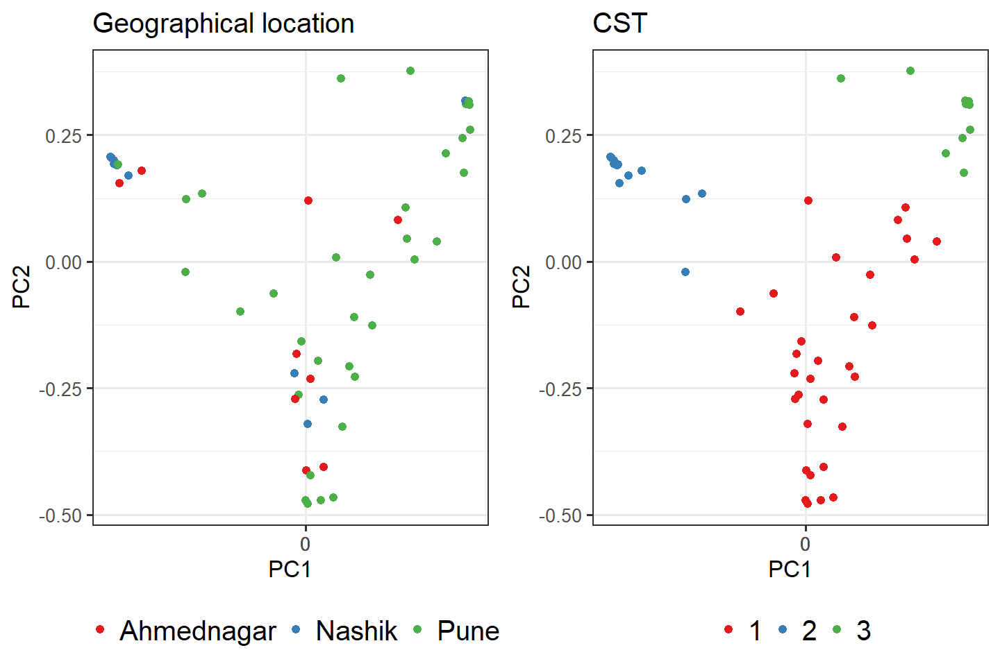
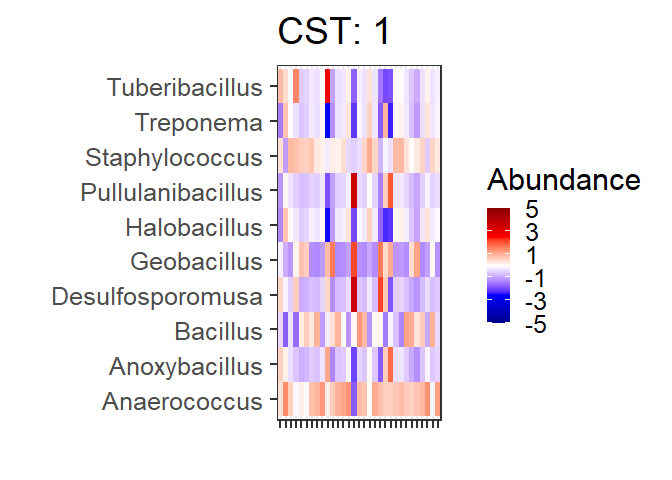
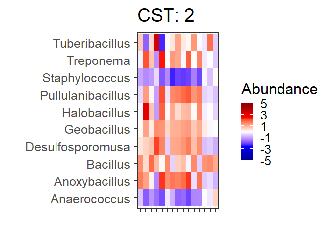
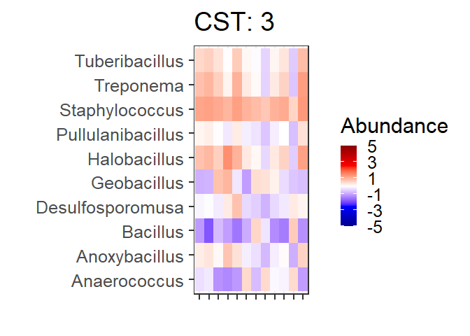

# Cluster into CSTs

## Denoise distance matrix

## Determine number of clusters

We will use the gap statistic to indicate the number of clusters in this
data:

    ## Clustering k = 1,2,..., K.max (= 12): .. done
    ## Bootstrapping, b = 1,2,..., B (= 50)  [one "." per sample]:
    ## .................................................. 50

## Cluster into CSTs

Perform PAM K-fold clusters and assess significance of CST vs. location
(p-value)

    ## 
    ##  Fisher's Exact Test for Count Data
    ## 
    ## data:  table(sample_data(ps)[, c("CST", "Geographical_location")])
    ## p-value = 0.002411
    ## alternative hypothesis: two.sided

## Evaluate clustering

# Principal Coordinates Analysis (PCoA)

Coloured by CST community type

### Heatmap

Heatmaps for the community state types. The most different OTUs are
shown.

Table of full names for the heatmap taxa:
