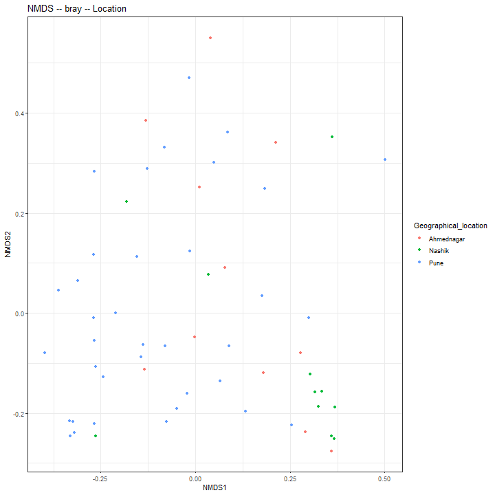

```
## Error in as.data.frame.default(x[[i]], optional = TRUE): cannot coerce class 'structure("phyloseq", package = "phyloseq")' to a data.frame
```


# Cluster into CSTs


```
##  [1] 3.7713973 2.9522877 2.3623454 1.9879696 1.4780915 1.4019418 1.0325943
##  [8] 0.9159503 0.6976916 0.6490130 0.6113887 0.5096734 0.5014806 0.4718493
## [15] 0.4436903 0.4410315 0.3809519 0.3695511 0.3207295 0.3036129
```

```
## [1] -0.03871145 -0.04200195 -0.05245575 -0.07669412 -0.08421908 -0.11034026
```


## Denoise distance matrix


## Determine number of clusters

We will use the gap statistic to indicate the number of clusters in this data:


```
## Clustering k = 1,2,..., K.max (= 12): .. done
## Bootstrapping, b = 1,2,..., B (= 50)  [one "." per sample]:
## .................................................. 50
```


## Cluster into CSTs

Perform PAM 3-fold clusters:


```
## 
## 	Fisher's Exact Test for Count Data
## 
## data:  table(sample_data(ps)[, c("CST", "Geographical_location")])
## p-value = 0.03092
## alternative hypothesis: two.sided
```


## Evaluate clustering





# Principal Coordinates Analysis (PCoA)

Coloured by CST community type


### Heatmap

Heatmaps for the community state types.


Table of full names for the taxa:


|ASV     |Full_name                                                                                         |
|:-------|:-------------------------------------------------------------------------------------------------|
|OTU2172 |Bacteria_Firmicutes_Bacilli_Bacillales_Staphylococcaceae_Staphylococcus                           |
|OTU2125 |Bacteria_Proteobacteria_Gammaproteobacteria_Enterobacterales _Enterobacteriaceae_Shimwellia       |
|OTU367  |Bacteria_Firmicutes_Bacilli_Bacillales_Bacillaceae_Bacillus                                       |
|OTU184  |Bacteria_Actinobacteria_Actinobacteria_Pseudonocardiales_Pseudonocardiaceae_Amycolatopsis         |
|OTU2388 |Bacteria_Actinobacteria_Actinobacteria_Corynebacteriales_NA_Tomitella                             |
|OTU1075 |Bacteria_Firmicutes_Bacilli_Bacillales_Bacillaceae_Geobacillus                                    |
|OTU985  |Bacteria_Proteobacteria_Gammaproteobacteria_Enterobacterales _Enterobacteriaceae_Escherichia      |
|OTU2021 |Bacteria_Proteobacteria_Alphaproteobacteria_Rhodospirillales_Acetobacteraceae_Roseomonas          |
|OTU1137 |Bacteria_Firmicutes_Bacilli_Bacillales_Bacillaceae_Halobacillus                                   |
|OTU2151 |Bacteria_Proteobacteria_Gammaproteobacteria_Chromatiales_Ectothiorhodospiraceae_Spiribacter       |
|OTU497  |Bacteria_Proteobacteria_Alphaproteobacteria_Rhizobiales_Bradyrhizobiaceae_Bosea                   |
|OTU2390 |Bacteria_Spirochaetes_Spirochaetia_Spirochaetales_Spirochaetaceae_Treponema                       |
|OTU2267 |Bacteria_Actinobacteria_Actinobacteria_Streptosporangiales_Streptosporangiaceae_Streptosporangium |
|OTU1130 |Bacteria_Proteobacteria_Deltaproteobacteria_Myxococcales_Kofleriaceae_Haliangium                  |
|OTU2093 |Bacteria_Firmicutes_Bacilli_Bacillales_Sporolactobacillaceae_Scopulibacillus                      |
|OTU1336 |Bacteria_Firmicutes_Bacilli_Bacillales_Bacillaceae_Lentibacillus                                  |
|OTU860  |Bacteria_Firmicutes_Negativicutes_Selenomonadales_Sporomusaceae_Desulfosporomusa                  |
|OTU629  |Bacteria_Proteobacteria_Gammaproteobacteria_Enterobacterales _Enterobacteriaceae_Citrobacter      |
|OTU2081 |Bacteria_Firmicutes_Bacilli_Bacillales_Bacillaceae_Salsuginibacillus                              |

