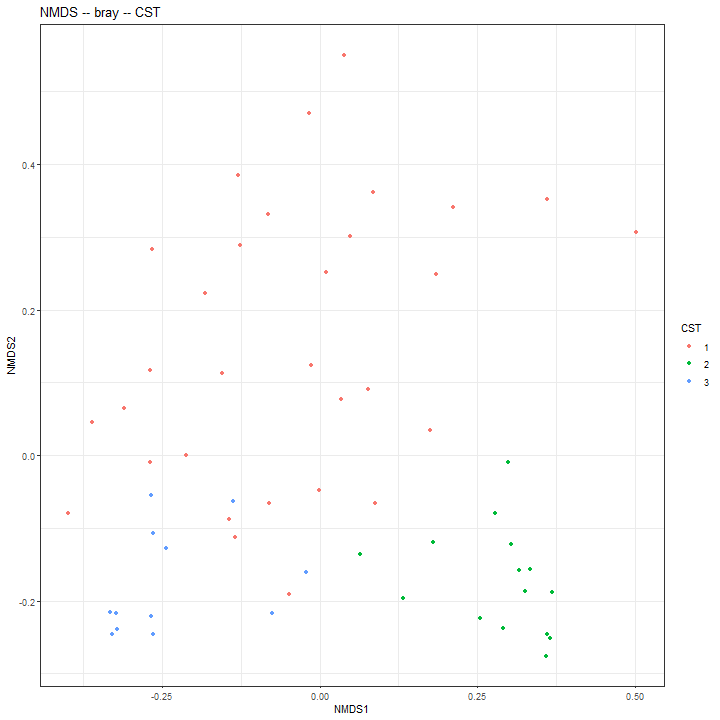
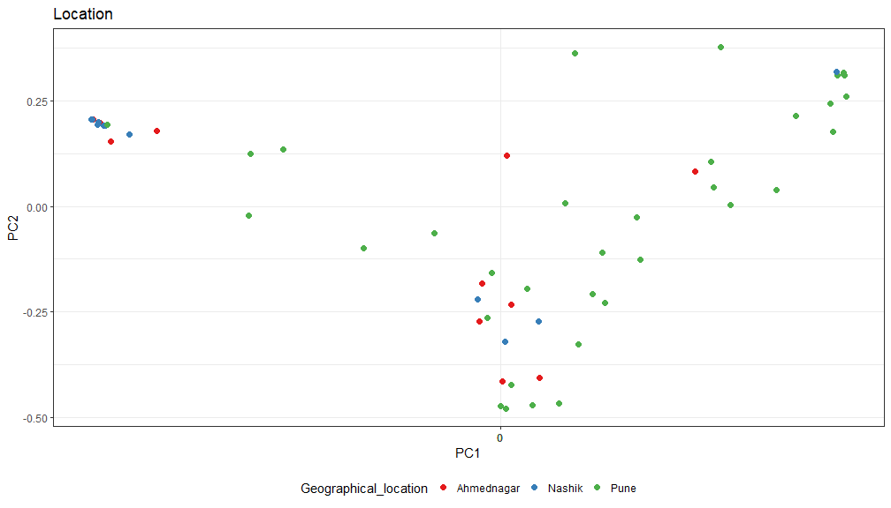
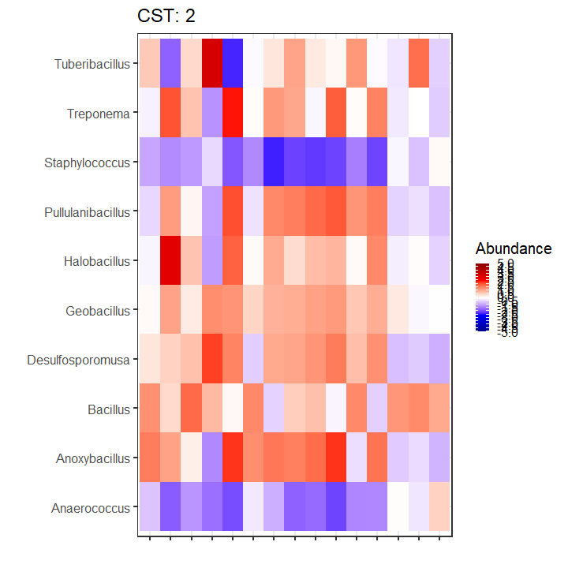
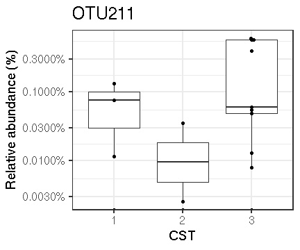
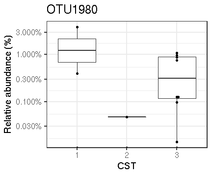
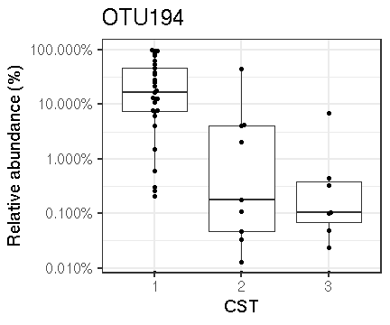
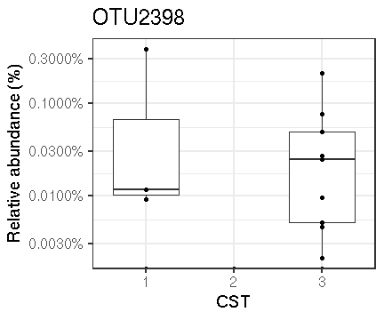
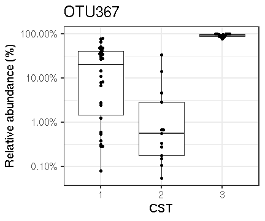

# Cluster into CSTs


```
##  [1] 5.9840548 3.7404996 2.0896780 1.3230250 1.1019674 0.9766566 0.9021602
##  [8] 0.6464166 0.5868130 0.5087633 0.4418356 0.3914422 0.3474311 0.3149250
## [15] 0.3031454 0.2890737 0.2568495 0.2294809 0.2250794 0.2010400
```

```
## [1] -0.05442782 -0.06150271 -0.07856958 -0.09270186 -0.10894815 -0.12931259
```


## Denoise distance matrix


## Determine number of clusters

We will use the gap statistic to indicate the number of clusters in this data:


```
## Clustering k = 1,2,..., K.max (= 12): .. done
## Bootstrapping, b = 1,2,..., B (= 50)  [one "." per sample]:
## .................................................. 50
```


## Cluster into CSTs

Perform PAM 3-fold clusters:


## Evaluate clustering





# Principal Coordinates Analysis (PCoA)

Coloured by CST community type



### Heatmap

Heatmaps for the community state types.




### Boxplots for each genus in the three clusters




Table of full names for the taxa:


```
## 
## 
## |ASV     |Full_name                                                                        |
## |:-------|:--------------------------------------------------------------------------------|
## |OTU2172 |Bacteria_Firmicutes_Bacilli_Bacillales_Staphylococcaceae_Staphylococcus          |
## |OTU367  |Bacteria_Firmicutes_Bacilli_Bacillales_Bacillaceae_Bacillus                      |
## |OTU1075 |Bacteria_Firmicutes_Bacilli_Bacillales_Bacillaceae_Geobacillus                   |
## |OTU2398 |Bacteria_Firmicutes_Bacilli_Bacillales_Sporolactobacillaceae_Tuberibacillus      |
## |OTU1137 |Bacteria_Firmicutes_Bacilli_Bacillales_Bacillaceae_Halobacillus                  |
## |OTU2390 |Bacteria_Spirochaetes_Spirochaetia_Spirochaetales_Spirochaetaceae_Treponema      |
## |OTU194  |Bacteria_Firmicutes_Tissierellia_Tissierellales_Peptoniphilaceae_Anaerococcus    |
## |OTU860  |Bacteria_Firmicutes_Negativicutes_Selenomonadales_Sporomusaceae_Desulfosporomusa |
## |OTU1980 |Bacteria_Firmicutes_Bacilli_Bacillales_Sporolactobacillaceae_Pullulanibacillus   |
## |OTU211  |Bacteria_Firmicutes_Bacilli_Bacillales_Bacillaceae_Anoxybacillus                 |
```

