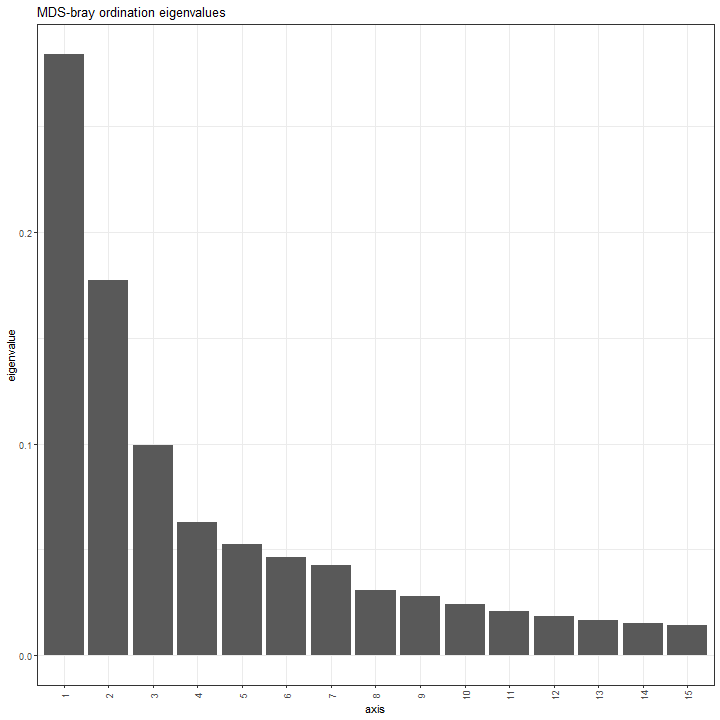
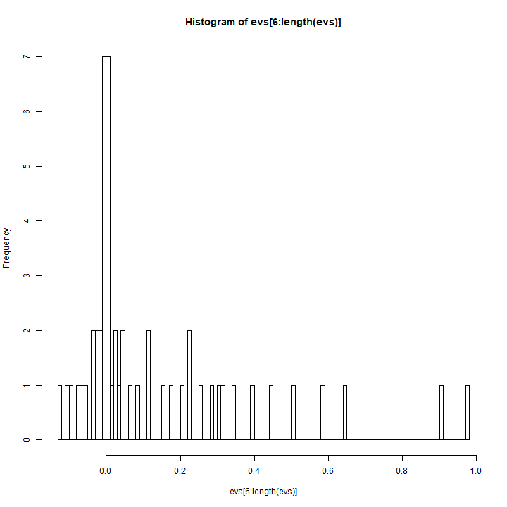
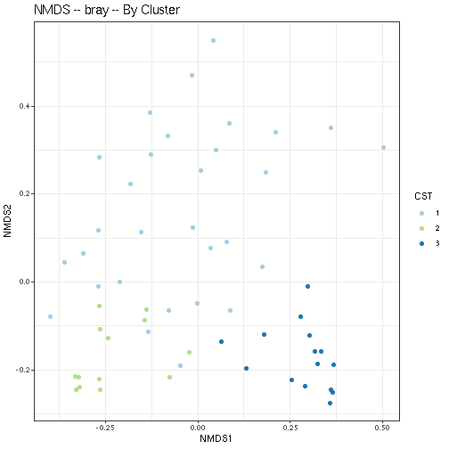
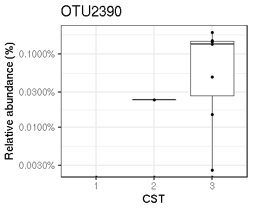

# Transform the data (proportions)


# Cluster into CSTs


## Denoise distance matrix


## Determine number of clusters
We will use the gap statistic to indicate the number of clusters in this data:


## Cluster into CSTs

Perform PAM 3-fold clusters:


## Evaluate clustering



#### Ordination plot for the Diet group


# Principal Coordinates Analysis (PCoA)

Coloured by DMM community type


### Heatmap

Heatmaps for the community state types.


### Boxplots for each genus in the three clusters




Table of full names for the taxa:


##### -----------------------------------------------------------------

What is the purpose of this analysis? Some comments would help.


|        |  Veg| Mixed|
|:-------|----:|-----:|
|Clust.1 | 53.3|  46.7|

#### Fisher-exact test at the first and second visits between clusters

Do we have first and second visits?


```
##      Diet
## CST   Mixed Veg Sum
##   1      14  16  30
##   2       5   8  13
##   3       9   6  15
##   Sum    28  30  58
```


```
## [1] "Fisher exact test p-value is: "
```

```
## [1] 0.5411113
```
