#Transform the data (proportions)


# Cluster into CSTs


## Denoise distance matrix
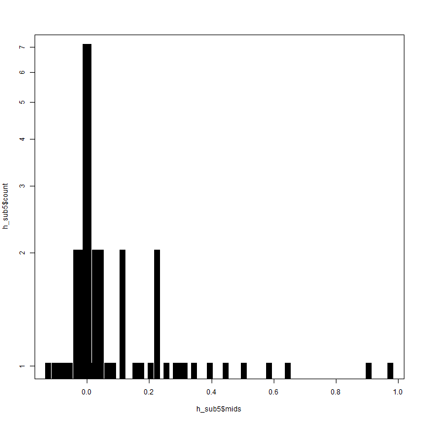

## Determine number of clusters
We will use the gap statistic to indicate the number of clusters in this data:
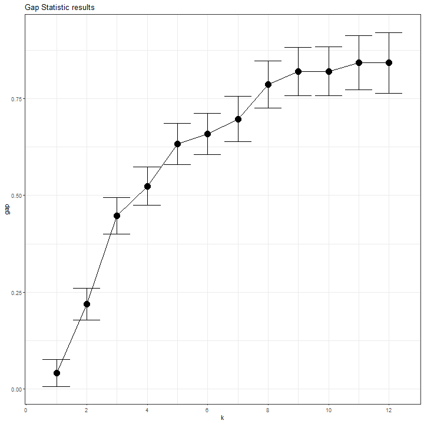

## Cluster into CSTs
Perform PAM 3-fold clusters:

## Evaluate clustering


#### Ordination plot for the Diet group


##### ...................
###Heatmap
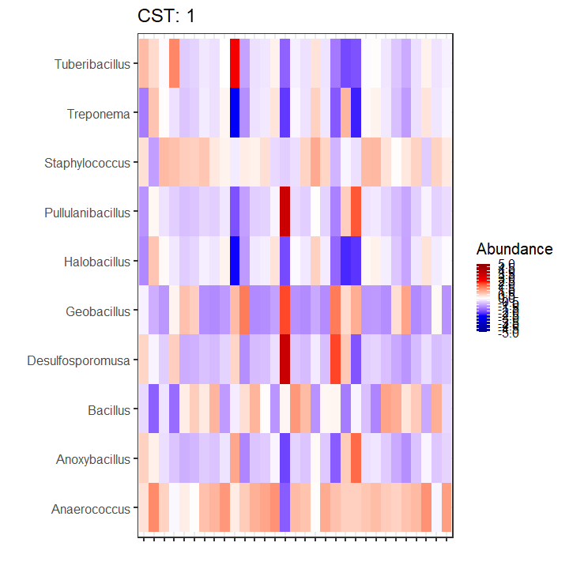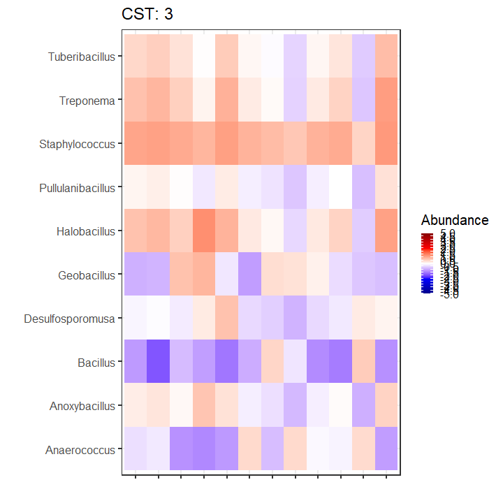
##### Boxplots for each genus in the three clusters
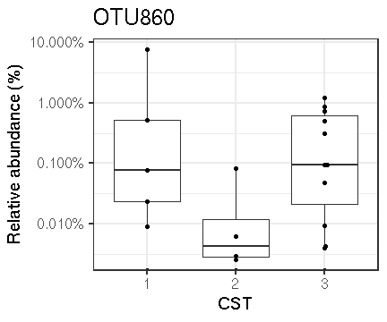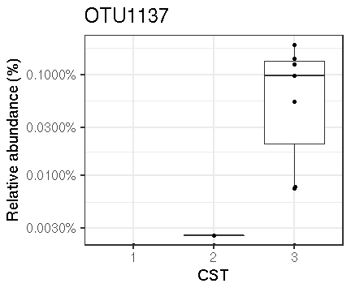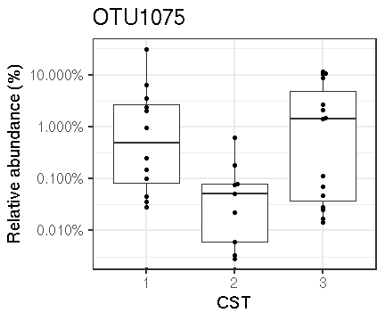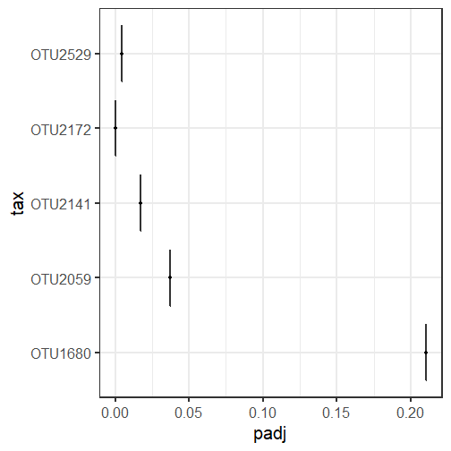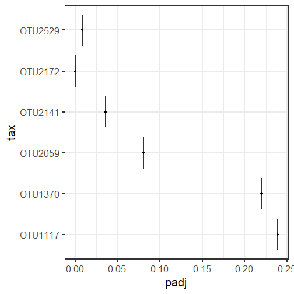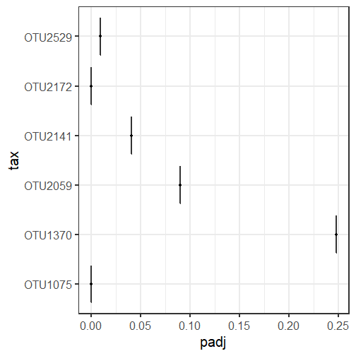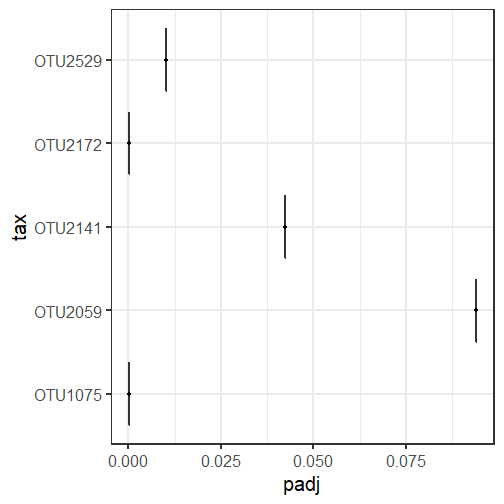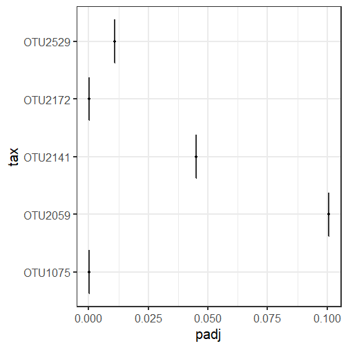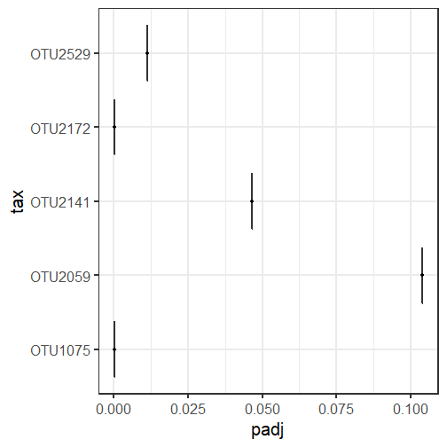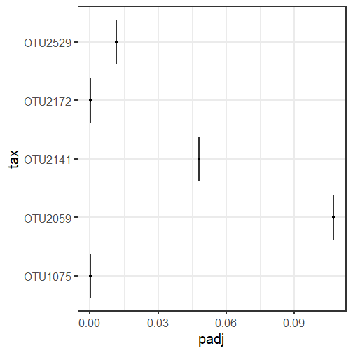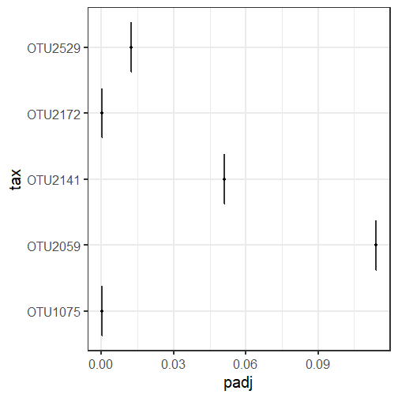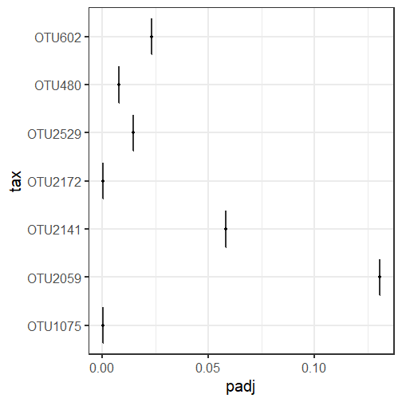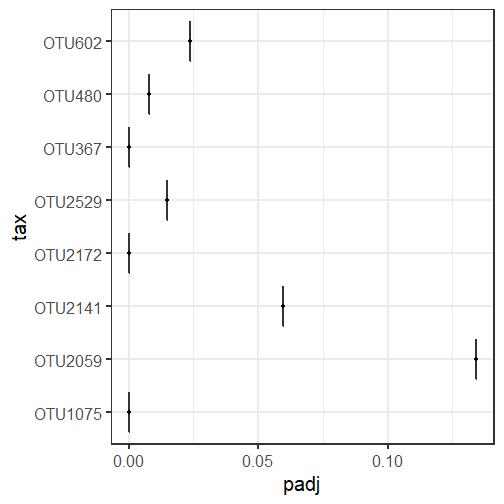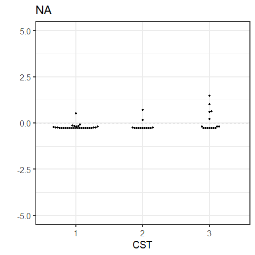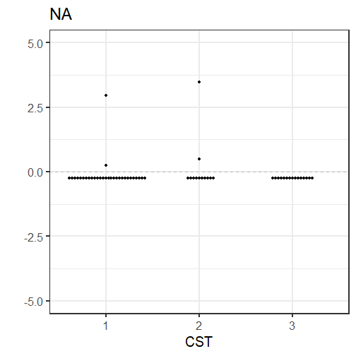
#### adjusted pvalues for kruskal tests By Benjamini-Hochberg


| adjusted_pvalue|
|---------------:|
|       0.0000246|
|       0.0000246|
|       0.0092642|
|       0.0092642|
|       0.0092642|
|       0.0096930|
|       0.0119068|
|       0.0122253|
|       0.0157795|
|       0.0190393|
|       0.0220737|
|       0.0220737|
|       0.0220737|
|       0.0220737|
|       0.0266533|
|       0.0272881|
|       0.0283403|
|       0.0335325|
|       0.0335325|
|       0.0335325|
|       0.0361313|
|       0.0382899|
|       0.0444898|
|       0.0444898|
|       0.0444898|
|       0.0444898|
|       0.0444898|
|       0.0444898|
|       0.0444898|
|       0.0444898|
|       0.0444898|
|       0.0444898|
|       0.0444898|
|       0.0444898|
|       0.0444898|
|       0.0444898|
|       0.0451622|
|       0.0451622|
##### -----------------------------------------------------------------

|        |  Veg| Mixed|
|:-------|----:|-----:|
|Clust.1 | 53.3|  46.7|
#### Fisher-exact test at the first and second visits between clusters

```
##      Diet
## CST   Mixed Veg Sum
##   1      14  16  30
##   2       5   8  13
##   3       9   6  15
##   Sum    28  30  58
```

```
## [1] "Fisher exact test p-value is: "
```

```
## [1] 0.5411113
```
