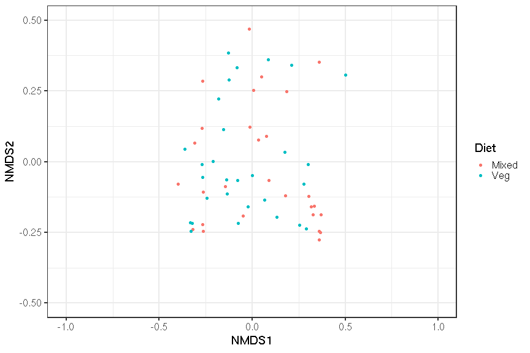

```
## Error in library("markovchain"): there is no package called 'markovchain'
```
# Transform the data (proportions)


# Cluster into CSTs


```
##  [1] 5.9840548 3.7404996 2.0896780 1.3230250 1.1019674 0.9766566 0.9021602
##  [8] 0.6464166 0.5868130 0.5087633 0.4418356 0.3914422 0.3474311 0.3149250
## [15] 0.3031454 0.2890737 0.2568495 0.2294809 0.2250794 0.2010400
```

```
## [1] -0.05442782 -0.06150271 -0.07856958 -0.09270186 -0.10894815 -0.12931259
```

## Denoise distance matrix


## Determine number of clusters
We will use the gap statistic to indicate the number of clusters in this data:

```
## Clustering k = 1,2,..., K.max (= 12): .. done
## Bootstrapping, b = 1,2,..., B (= 50)  [one "." per sample]:
## .................................................. 50
```


## Cluster into CSTs
Perform PAM 3-fold clusters:

## Evaluate clustering


#### Ordination plot for the Diet group




# Principal Coordinates Analysis (PCoA)
Coloured by DMM community type

```
## Error in factor(ass[rownames(sample_data(phy))]): object 'ass' not found
```

```
## Error: Unknown colour name: community_type
```


### Heatmap

```
## Error in library(BBmisc): there is no package called 'BBmisc'
```

```
## Error in loadNamespace(name): there is no package called 'BBmisc'
```

```
## Error in colnames(g1) <- colnames(otu_table(pso1)@.Data): object 'g1' not found
```

```
## Error in otu_table(g1, taxa_are_rows = T): object 'g1' not found
```

```
## Error in eval(expr, envir, enclos): object 'j' not found
```


### Boxplots for each genus in the three clusters

```
## Error in eval(expr, envir, enclos): object 'full.names' not found
```
### adjusted pvalues for kruskal tests By Benjamini-Hochberg

```
## Error in `.rowNamesDF<-`(x, value = value): invalid 'row.names' length
```


##### -----------------------------------------------------------------

|        |  Veg| Mixed|
|:-------|----:|-----:|
|Clust.1 | 53.3|  46.7|
#### Fisher-exact test at the first and second visits between clusters

```
##      Diet
## CST   Mixed Veg Sum
##   1      14  16  30
##   2       5   8  13
##   3       9   6  15
##   Sum    28  30  58
```

```
## [1] "Fisher exact test p-value is: "
```

```
## [1] 0.5411113
```
