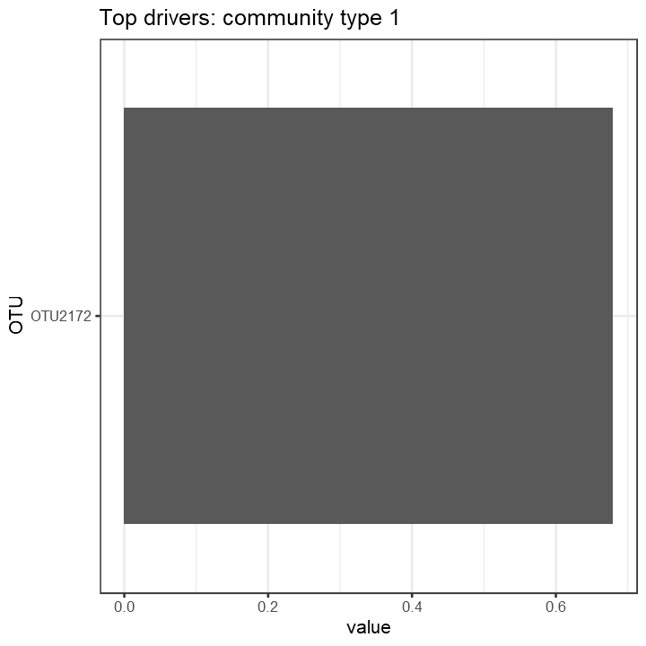
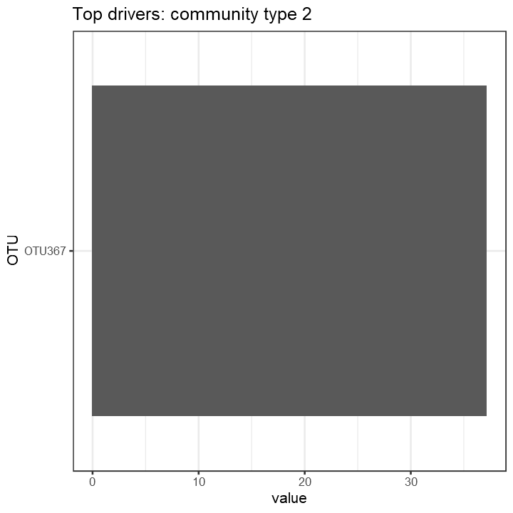

```r
library(microbiome)
library(DirichletMultinomial)
library(reshape2)
library(magrittr)
library(dplyr)
phy <- readRDS("data/processed/phyloseq/phy20.1.RDS")
data(phy)
pseq <- phy

pseq.comp <- microbiome::transform(pseq, "compositional")
taxa <- core_members(pseq.comp, detection = 0.1/100, prevalence = 50/100)
pseq <- prune_taxa(taxa, pseq)

dat <- abundances(pseq)
count <- as.matrix(t(dat))

fit <- lapply(1:3, dmn, count = count, verbose=TRUE)
```

```
##   Soft kmeans
##   Expectation Maximization setup
##   Expectation Maximization
##   Hessian
##   Soft kmeans
##     iteration 10 change 0.029457
##     iteration 20 change 0.000797
##     iteration 30 change 0.000008
##   Expectation Maximization setup
##   Expectation Maximization
##   Hessian
##   Soft kmeans
##     iteration 10 change 0.006641
##     iteration 20 change 0.000006
##   Expectation Maximization setup
##   Expectation Maximization
##     iteration 10 change 0.000025
##   Hessian
```

```r
lplc <- sapply(fit, laplace) 
aic  <- sapply(fit, AIC) 
bic  <- sapply(fit, BIC)

best <- fit[[which.min(unlist(lplc))]]
mixturewt(best)
```

```
##          pi     theta
## 1 0.7782303  1.618373
## 2 0.2217697 37.962784
```

```r
ass <- apply(mixture(best), 1, which.max)

for (k in seq(ncol(fitted(best)))) {
d <- melt(fitted(best))
  colnames(d) <- c("OTU", "cluster", "value")
d <- subset(d, cluster == k) %>%
    # Arrange OTUs by assignment strength
arrange(value) %>%
mutate(OTU = factor(OTU, levels = unique(OTU))) %>%
    # Only show the most important drivers
filter(abs(value) > quantile(abs(value), 0.8))     

p <- ggplot(d, aes(x = OTU, y = value)) +
  geom_bar(stat = "identity") +
  coord_flip() +
  labs(title = paste("Top drivers: community type", k))
print(p)
}  
```



