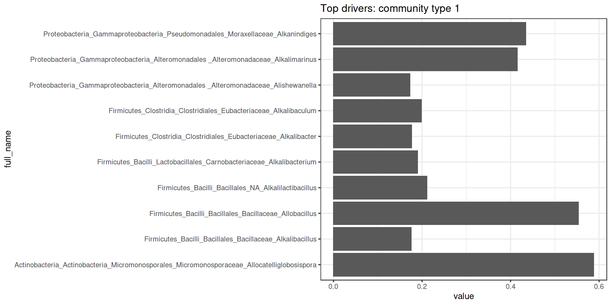
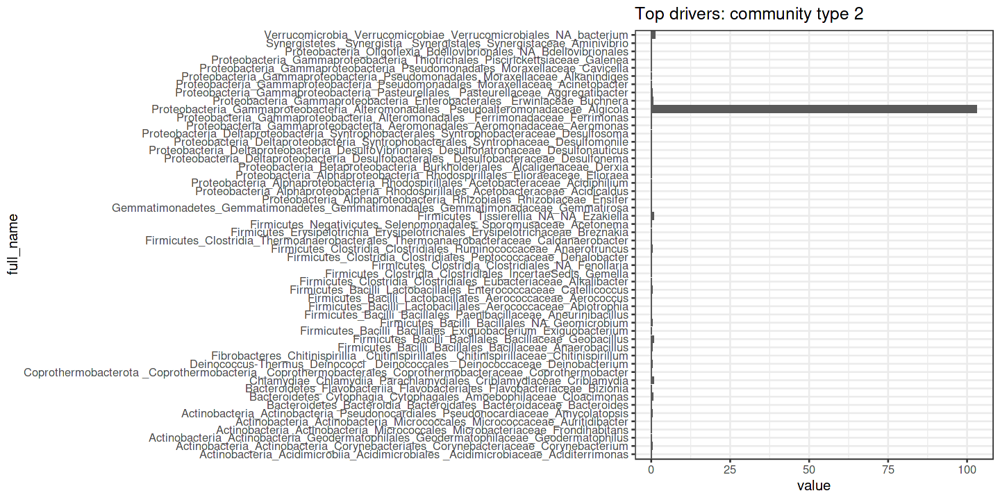
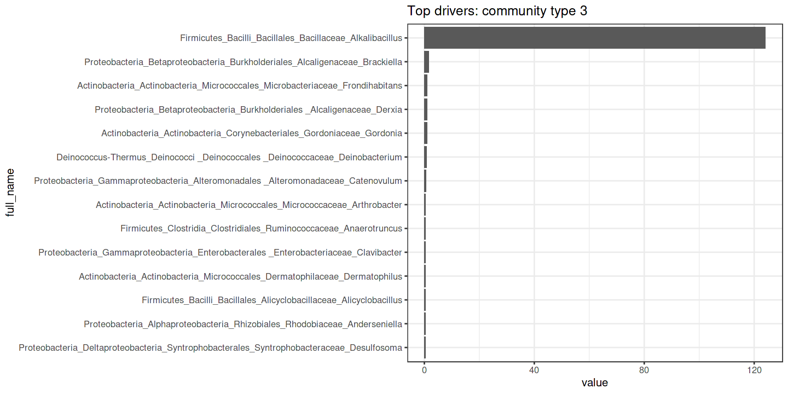

Altogether 49 taxonomic groups are detected with 10% prevalence at 0.1% relative abundance. We used this set to determine the community types.

The optimal number of clusters is: 3

The (main) drivers per component are visualized.

