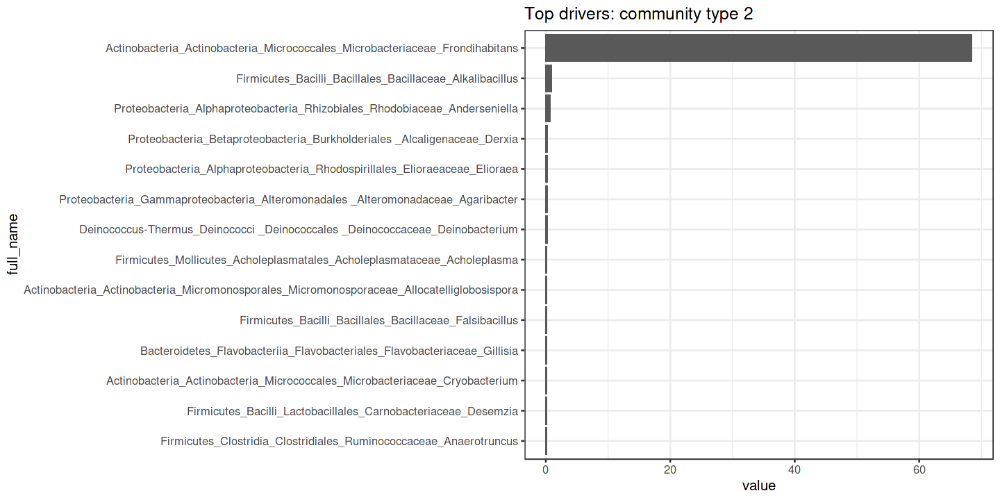
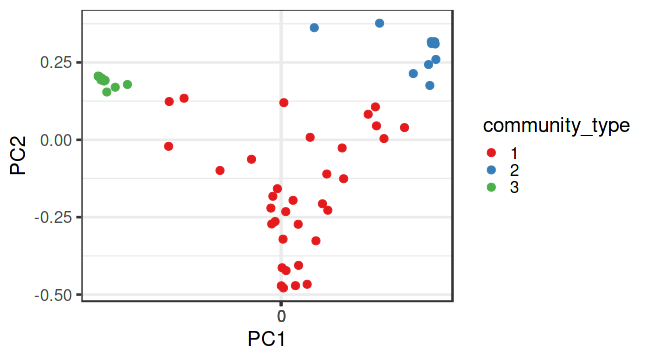

Altogether 275 taxonomic groups are detected with 10% prevalence at 0% relative abundance. We used this set to determine the community types.

The optimal number of clusters is: 3

The (main) drivers per component are visualized.

## Principal Coordinates Analysis (PCoA)

Coloured by DMM community type.

* Ordination method: PCoA
* Dissimilarity measure: bray
