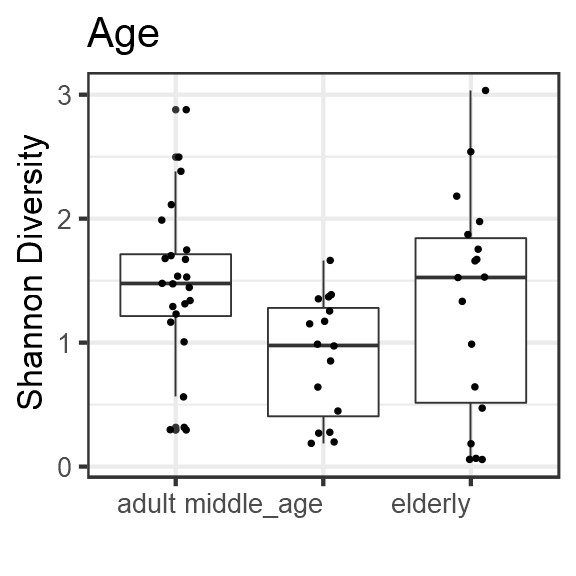

# Alpha diversity analysis


```
## [1] TRUE
```

```
## [1] TRUE
```


|           |         x|
|:----------|---------:|
|adult      | 1.4559824|
|middle_age | 0.8868898|
|elderly    | 1.3082521|

# Group-wise comparisons
* Diversity index: diversity_shannon


```
## 
## 	Kruskal-Wallis rank sum test
## 
## data:  index by factor(age_group)
## Kruskal-Wallis chi-squared = 7.7239, df = 2, p-value = 0.02103
```



# PERMANOVA analysis

p value for the effect of age  is (p=0.04), which is significant.


```
## [1] 0.06
```

```
## Analysis of Variance Table
## 
## Response: Distances
##           Df  Sum Sq  Mean Sq F value Pr(>F)
## Groups     2 0.02546 0.012730  0.5711 0.5682
## Residuals 55 1.22601 0.022291
```
