Alpha diversity analysis
========================

<table style="width:100%;">
<colgroup>
<col width="1%" />
<col width="2%" />
<col width="2%" />
<col width="6%" />
<col width="5%" />
<col width="4%" />
<col width="4%" />
<col width="4%" />
<col width="4%" />
<col width="4%" />
<col width="4%" />
<col width="3%" />
<col width="3%" />
<col width="3%" />
<col width="3%" />
<col width="4%" />
<col width="4%" />
<col width="4%" />
<col width="6%" />
<col width="3%" />
<col width="6%" />
<col width="5%" />
<col width="5%" />
</colgroup>
<thead>
<tr class="header">
<th align="left"></th>
<th align="right">observed</th>
<th align="right">chao1</th>
<th align="right">diversity_inverse_simpson</th>
<th align="right">diversity_gini_simpson</th>
<th align="right">diversity_shannon</th>
<th align="right">diversity_fisher</th>
<th align="right">diversity_coverage</th>
<th align="right">evenness_camargo</th>
<th align="right">evenness_pielou</th>
<th align="right">evenness_simpson</th>
<th align="right">evenness_evar</th>
<th align="right">evenness_bulla</th>
<th align="right">dominance_dbp</th>
<th align="right">dominance_dmn</th>
<th align="right">dominance_absolute</th>
<th align="right">dominance_relative</th>
<th align="right">dominance_simpson</th>
<th align="right">dominance_core_abundance</th>
<th align="right">dominance_gini</th>
<th align="right">rarity_log_modulo_skewness</th>
<th align="right">rarity_low_abundance</th>
<th align="right">rarity_rare_abundance</th>
</tr>
</thead>
<tbody>
<tr class="odd">
<td align="left">I3</td>
<td align="right">95</td>
<td align="right">159.6538</td>
<td align="right">1.931888</td>
<td align="right">0.4823717</td>
<td align="right">1.2914717</td>
<td align="right">14.410657</td>
<td align="right">1</td>
<td align="right">0.2914961</td>
<td align="right">0.2835983</td>
<td align="right">0.0203357</td>
<td align="right">0.1915306</td>
<td align="right">0.1160079</td>
<td align="right">0.7101353</td>
<td align="right">0.7990093</td>
<td align="right">7455</td>
<td align="right">0.7101353</td>
<td align="right">0.5176283</td>
<td align="right">0.8908363</td>
<td align="right">0.9937761</td>
<td align="right">2.061270</td>
<td align="right">0.0225757</td>
<td align="right">0.0135264</td>
</tr>
<tr class="even">
<td align="left">I4</td>
<td align="right">38</td>
<td align="right">66.9000</td>
<td align="right">4.132087</td>
<td align="right">0.7579915</td>
<td align="right">1.6716162</td>
<td align="right">6.171426</td>
<td align="right">2</td>
<td align="right">0.9940274</td>
<td align="right">0.4595400</td>
<td align="right">0.1087391</td>
<td align="right">0.1497128</td>
<td align="right">0.1603777</td>
<td align="right">0.2988308</td>
<td align="right">0.5718707</td>
<td align="right">869</td>
<td align="right">0.2988308</td>
<td align="right">0.2420085</td>
<td align="right">0.9381018</td>
<td align="right">0.9934163</td>
<td align="right">2.061423</td>
<td align="right">0.0154746</td>
<td align="right">0.0089409</td>
</tr>
<tr class="odd">
<td align="left">I5</td>
<td align="right">78</td>
<td align="right">158.1818</td>
<td align="right">1.745322</td>
<td align="right">0.4270397</td>
<td align="right">0.9880714</td>
<td align="right">11.186785</td>
<td align="right">1</td>
<td align="right">0.9839926</td>
<td align="right">0.2267931</td>
<td align="right">0.0223759</td>
<td align="right">0.1909460</td>
<td align="right">0.0772642</td>
<td align="right">0.7435424</td>
<td align="right">0.8430057</td>
<td align="right">8866</td>
<td align="right">0.7435424</td>
<td align="right">0.5729603</td>
<td align="right">0.8942469</td>
<td align="right">0.9960293</td>
<td align="right">2.061195</td>
<td align="right">0.0109024</td>
<td align="right">0.0016773</td>
</tr>
<tr class="even">
<td align="left">I7</td>
<td align="right">108</td>
<td align="right">148.0238</td>
<td align="right">1.738952</td>
<td align="right">0.4249411</td>
<td align="right">1.4452696</td>
<td align="right">22.746718</td>
<td align="right">1</td>
<td align="right">0.2341051</td>
<td align="right">0.3086777</td>
<td align="right">0.0161014</td>
<td align="right">0.3731768</td>
<td align="right">0.1825825</td>
<td align="right">0.7558631</td>
<td align="right">0.8039216</td>
<td align="right">1966</td>
<td align="right">0.7558631</td>
<td align="right">0.5750589</td>
<td align="right">0.8954248</td>
<td align="right">0.9852448</td>
<td align="right">2.061423</td>
<td align="right">0.0603614</td>
<td align="right">0.0480584</td>
</tr>
<tr class="odd">
<td align="left">I8</td>
<td align="right">81</td>
<td align="right">148.8462</td>
<td align="right">1.013491</td>
<td align="right">0.0133117</td>
<td align="right">0.0585647</td>
<td align="right">8.646857</td>
<td align="right">1</td>
<td align="right">0.9993421</td>
<td align="right">0.0133270</td>
<td align="right">0.0125122</td>
<td align="right">0.2164980</td>
<td align="right">0.0067645</td>
<td align="right">0.9933190</td>
<td align="right">0.9948014</td>
<td align="right">100506</td>
<td align="right">0.9933190</td>
<td align="right">0.9866883</td>
<td align="right">0.9962345</td>
<td align="right">0.9983408</td>
<td align="right">2.061212</td>
<td align="right">0.0066810</td>
<td align="right">0.0021447</td>
</tr>
<tr class="even">
<td align="left">I12</td>
<td align="right">129</td>
<td align="right">247.1316</td>
<td align="right">1.115739</td>
<td align="right">0.1037333</td>
<td align="right">0.3166417</td>
<td align="right">16.502676</td>
<td align="right">1</td>
<td align="right">0.9903683</td>
<td align="right">0.0651551</td>
<td align="right">0.0086491</td>
<td align="right">0.2681924</td>
<td align="right">0.0308253</td>
<td align="right">0.9461743</td>
<td align="right">0.9771656</td>
<td align="right">38743</td>
<td align="right">0.9461743</td>
<td align="right">0.8962667</td>
<td align="right">0.9610716</td>
<td align="right">0.9973881</td>
<td align="right">2.061340</td>
<td align="right">0.0102083</td>
<td align="right">0.0020759</td>
</tr>
</tbody>
</table>

Group-wise comparisons
======================

-   Diversity index: diversity\_shannon

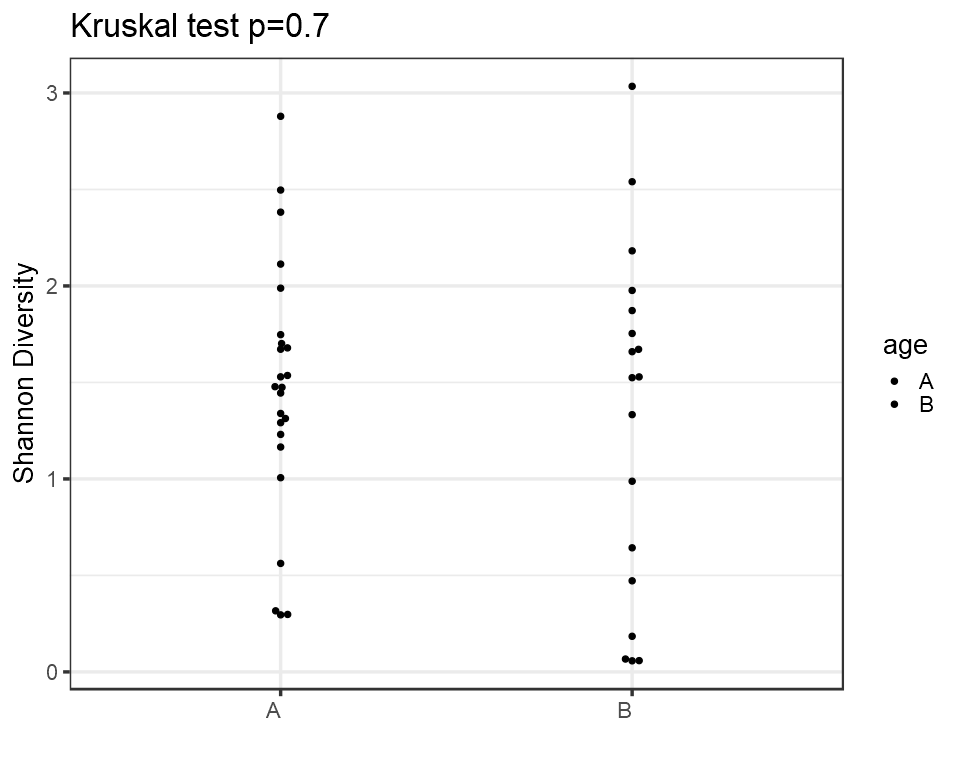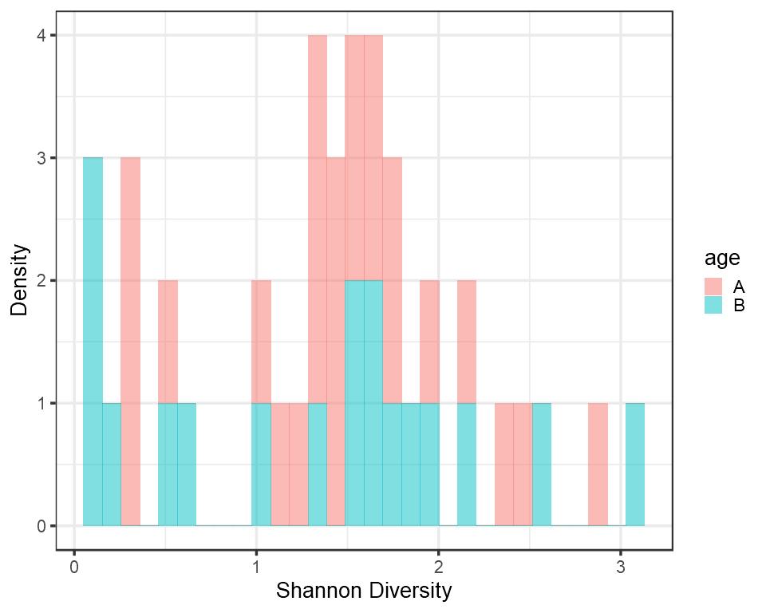

Ordination
==========

*Principal Coordinates Analysis (PCoA)*
---------------------------------------

-   Ordination method: PCoA
-   Dissimilarity measure: jaccard

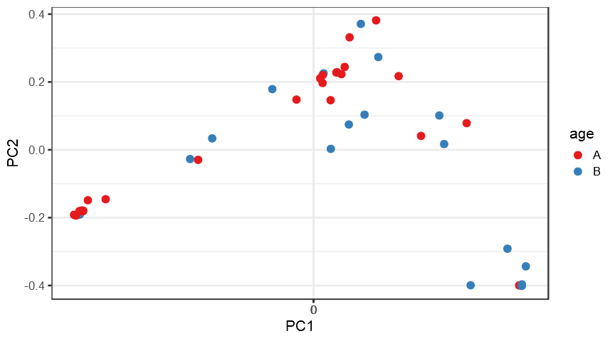

DESeq2 analysis\*
-----------------

<table>
<thead>
<tr class="header">
<th align="left"></th>
<th align="right">baseMean</th>
<th align="right">log2FoldChange</th>
<th align="right">lfcSE</th>
<th align="right">stat</th>
<th align="right">pvalue</th>
<th align="right">padj</th>
<th align="left">taxon</th>
</tr>
</thead>
<tbody>
<tr class="odd">
<td align="left">OTU2201</td>
<td align="right">8.379781</td>
<td align="right">-5.289879</td>
<td align="right">2.9135047</td>
<td align="right">-1.815641</td>
<td align="right">0.0694254</td>
<td align="right">0.2464619</td>
<td align="left">OTU2201</td>
</tr>
<tr class="even">
<td align="left">OTU1034</td>
<td align="right">29.102808</td>
<td align="right">-4.726481</td>
<td align="right">1.7938617</td>
<td align="right">-2.634808</td>
<td align="right">0.0084185</td>
<td align="right">0.0791696</td>
<td align="left">OTU1034</td>
</tr>
<tr class="odd">
<td align="left">OTU1615</td>
<td align="right">31.299241</td>
<td align="right">-4.663037</td>
<td align="right">1.5208505</td>
<td align="right">-3.066072</td>
<td align="right">0.0021689</td>
<td align="right">0.0395826</td>
<td align="left">OTU1615</td>
</tr>
<tr class="even">
<td align="left">OTU806</td>
<td align="right">11.532097</td>
<td align="right">-4.460480</td>
<td align="right">1.8194014</td>
<td align="right">-2.451620</td>
<td align="right">0.0142215</td>
<td align="right">0.0865141</td>
<td align="left">OTU806</td>
</tr>
<tr class="odd">
<td align="left">OTU1275</td>
<td align="right">6.976166</td>
<td align="right">-4.056330</td>
<td align="right">1.5248507</td>
<td align="right">-2.660149</td>
<td align="right">0.0078106</td>
<td align="right">0.0791696</td>
<td align="left">OTU1275</td>
</tr>
<tr class="even">
<td align="left">OTU540</td>
<td align="right">16.435211</td>
<td align="right">-3.710108</td>
<td align="right">1.8981742</td>
<td align="right">-1.954567</td>
<td align="right">0.0506343</td>
<td align="right">0.2310188</td>
<td align="left">OTU540</td>
</tr>
<tr class="odd">
<td align="left">OTU506</td>
<td align="right">6.515707</td>
<td align="right">-3.663688</td>
<td align="right">1.4380663</td>
<td align="right">-2.547649</td>
<td align="right">0.0108452</td>
<td align="right">0.0791696</td>
<td align="left">OTU506</td>
</tr>
<tr class="even">
<td align="left">OTU1216</td>
<td align="right">23.401404</td>
<td align="right">-3.552830</td>
<td align="right">1.1546760</td>
<td align="right">-3.076906</td>
<td align="right">0.0020916</td>
<td align="right">0.0395826</td>
<td align="left">OTU1216</td>
</tr>
<tr class="odd">
<td align="left">OTU179</td>
<td align="right">5.399356</td>
<td align="right">-3.409880</td>
<td align="right">1.8879613</td>
<td align="right">-1.806118</td>
<td align="right">0.0709000</td>
<td align="right">0.2464619</td>
<td align="left">OTU179</td>
</tr>
<tr class="even">
<td align="left">OTU1165</td>
<td align="right">38.051162</td>
<td align="right">-3.286556</td>
<td align="right">1.6050669</td>
<td align="right">-2.047613</td>
<td align="right">0.0405979</td>
<td align="right">0.1975766</td>
<td align="left">OTU1165</td>
</tr>
<tr class="odd">
<td align="left">OTU194</td>
<td align="right">256.416641</td>
<td align="right">-2.818331</td>
<td align="right">1.1390553</td>
<td align="right">-2.474271</td>
<td align="right">0.0133508</td>
<td align="right">0.0865141</td>
<td align="left">OTU194</td>
</tr>
<tr class="even">
<td align="left">OTU1893</td>
<td align="right">401.585681</td>
<td align="right">-2.753443</td>
<td align="right">1.2159809</td>
<td align="right">-2.264380</td>
<td align="right">0.0235508</td>
<td align="right">0.1228004</td>
<td align="left">OTU1893</td>
</tr>
<tr class="odd">
<td align="left">OTU1472</td>
<td align="right">88.400193</td>
<td align="right">-2.540264</td>
<td align="right">1.3647704</td>
<td align="right">-1.861312</td>
<td align="right">0.0627001</td>
<td align="right">0.2464619</td>
<td align="left">OTU1472</td>
</tr>
<tr class="even">
<td align="left">OTU1075</td>
<td align="right">11.664404</td>
<td align="right">-2.320629</td>
<td align="right">0.8996088</td>
<td align="right">-2.579598</td>
<td align="right">0.0098915</td>
<td align="right">0.0791696</td>
<td align="left">OTU1075</td>
</tr>
<tr class="odd">
<td align="left">OTU1235</td>
<td align="right">4.160625</td>
<td align="right">-2.209939</td>
<td align="right">0.9134772</td>
<td align="right">-2.419260</td>
<td align="right">0.0155521</td>
<td align="right">0.0873311</td>
<td align="left">OTU1235</td>
</tr>
<tr class="even">
<td align="left">OTU2529</td>
<td align="right">4.648084</td>
<td align="right">-2.178167</td>
<td align="right">0.8446638</td>
<td align="right">-2.578738</td>
<td align="right">0.0099162</td>
<td align="right">0.0791696</td>
<td align="left">OTU2529</td>
</tr>
<tr class="odd">
<td align="left">OTU251</td>
<td align="right">15.367931</td>
<td align="right">-1.712826</td>
<td align="right">0.9328114</td>
<td align="right">-1.836198</td>
<td align="right">0.0663284</td>
<td align="right">0.2464619</td>
<td align="left">OTU251</td>
</tr>
<tr class="even">
<td align="left">OTU520</td>
<td align="right">55.853187</td>
<td align="right">3.154956</td>
<td align="right">1.2329808</td>
<td align="right">2.558804</td>
<td align="right">0.0105033</td>
<td align="right">0.0791696</td>
<td align="left">OTU520</td>
</tr>
<tr class="odd">
<td align="left">OTU526</td>
<td align="right">33.819774</td>
<td align="right">4.115713</td>
<td align="right">1.2533047</td>
<td align="right">3.283889</td>
<td align="right">0.0010239</td>
<td align="right">0.0373707</td>
<td align="left">OTU526</td>
</tr>
<tr class="even">
<td align="left">OTU2172</td>
<td align="right">6608.082091</td>
<td align="right">4.409486</td>
<td align="right">0.9004040</td>
<td align="right">4.897231</td>
<td align="right">0.0000010</td>
<td align="right">0.0000710</td>
<td align="left">OTU2172</td>
</tr>
<tr class="odd">
<td align="left">OTU1117</td>
<td align="right">6.025284</td>
<td align="right">5.565926</td>
<td align="right">2.9384439</td>
<td align="right">1.894175</td>
<td align="right">0.0582018</td>
<td align="right">0.2464619</td>
<td align="left">OTU1117</td>
</tr>
</tbody>
</table>

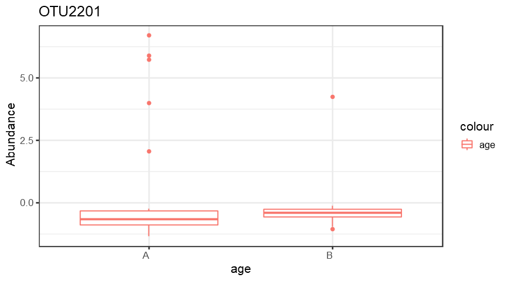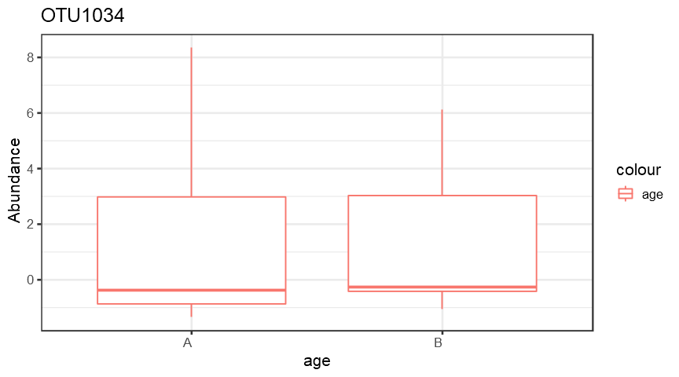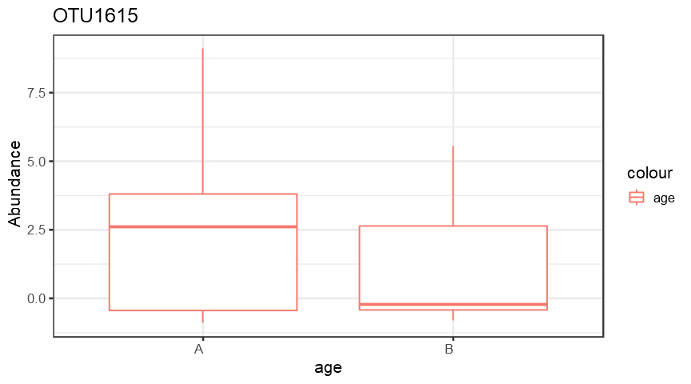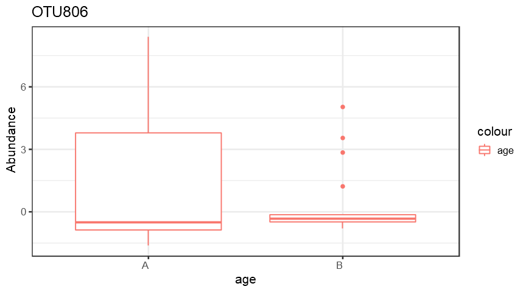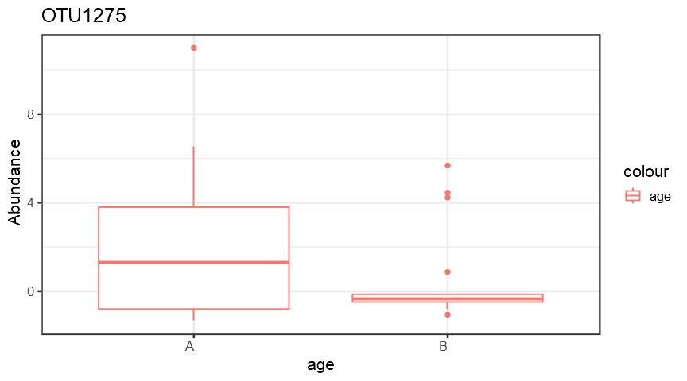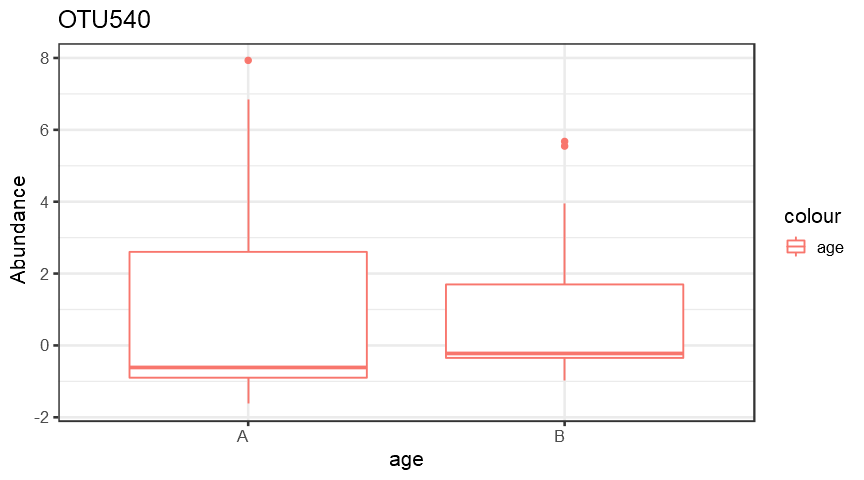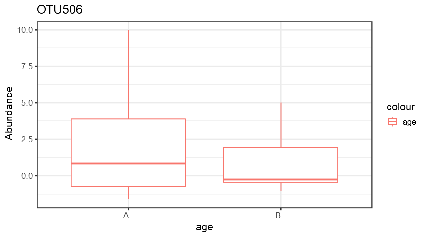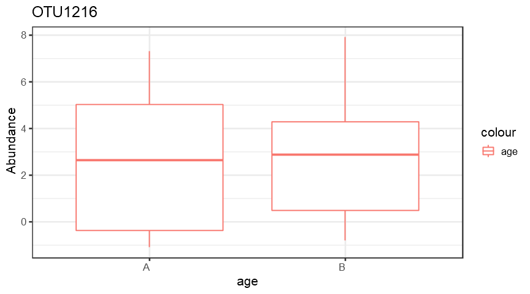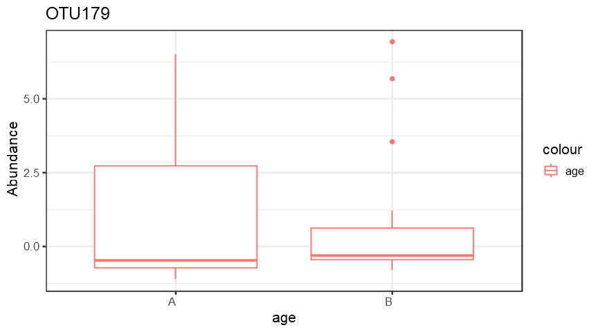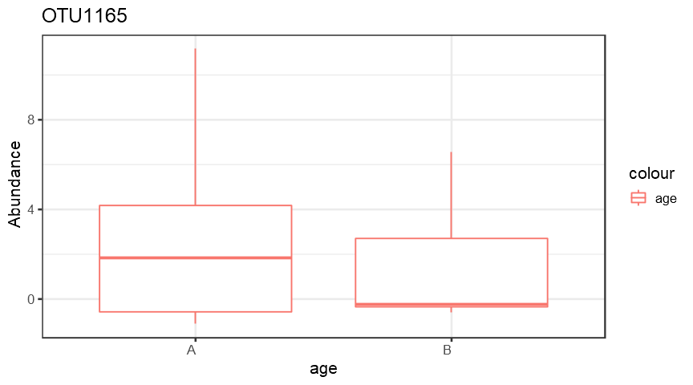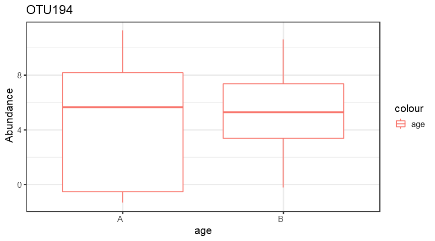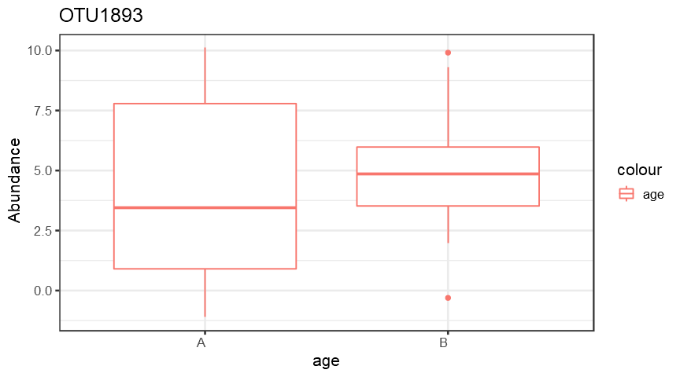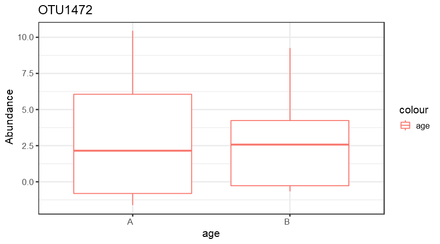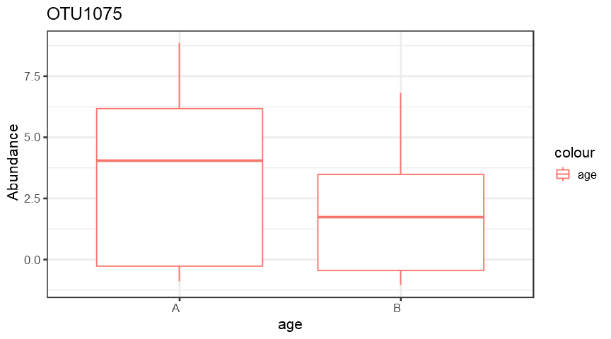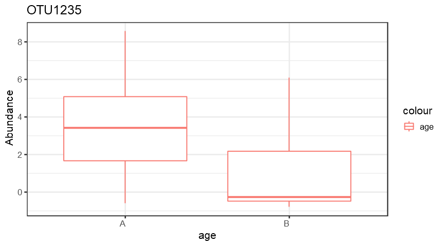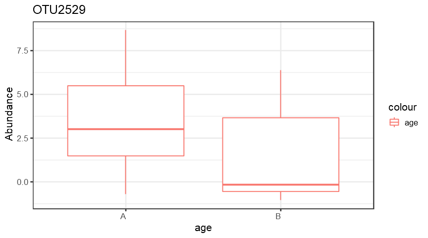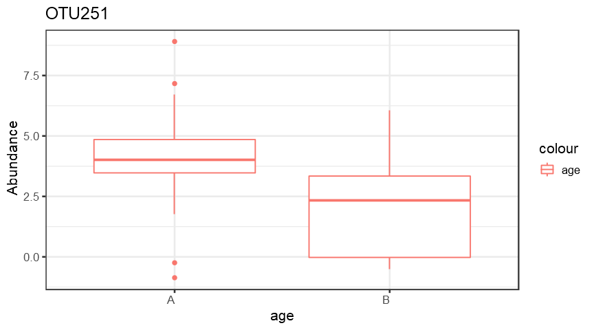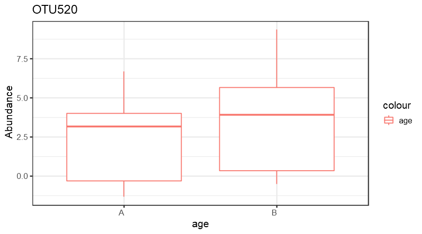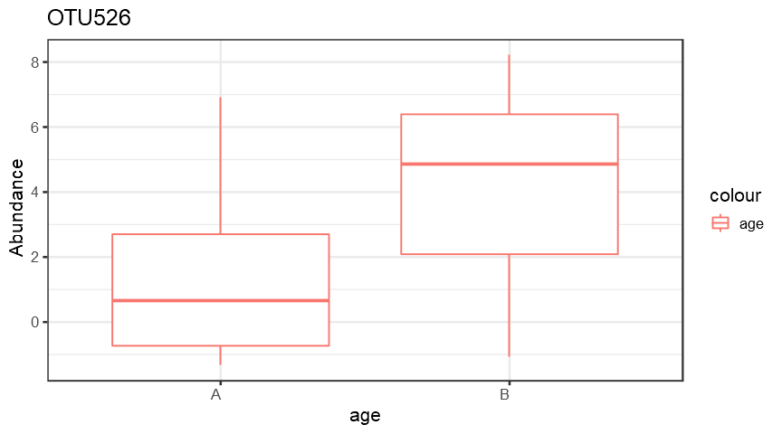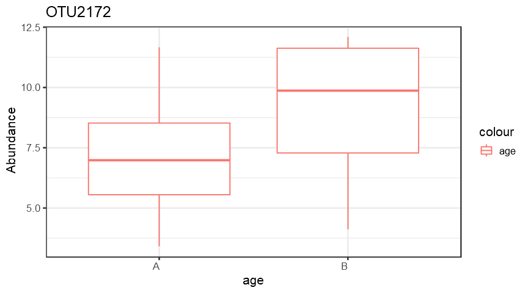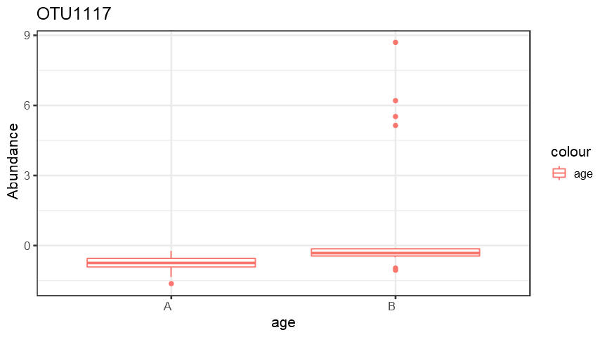
