# Alpha diversity analysis


```
## [1] TRUE
```

```
## [1] TRUE
```


|           |         x|
|:----------|---------:|
|adult      | 1.4559824|
|middle_age | 0.8868898|
|elderly    | 1.3082521|

# Group-wise comparisons
* Diversity index: diversity_shannon


```
## 
## 	Kruskal-Wallis rank sum test
## 
## data:  index by factor(age_group)
## Kruskal-Wallis chi-squared = 7.7239, df = 2, p-value = 0.02103
```


# Ordination


# Principal Coordinates Analysis (PCoA)

* Ordination method: PCoA
* Dissimilarity measure: bray


```
## Error: Unknown colour name: middle_age
```


## Differential abundance analysis 

Differential abundance analysis is carried out using DESeq2 method


```
## Error in DESeqDataSet(se, design = design, ignoreRank): design has a single variable, with all samples having the same value.
##   use instead a design of '~ 1'. estimateSizeFactors, rlog and the VST can then be used
```


| log2FoldChange|      padj|taxon   |full_name                                                                                             |
|--------------:|---------:|:-------|:-----------------------------------------------------------------------------------------------------|
|       6.538842| 0.0000001|OTU526  |Bacteria_Actinobacteria_Actinobacteria_Micrococcales_Brevibacteriaceae_Brevibacterium                 |
|       4.239621| 0.0002373|OTU194  |Bacteria_Firmicutes_Tissierellia_Tissierellales_Peptoniphilaceae_Anaerococcus                         |
|       4.871275| 0.0026454|OTU1034 |Bacteria_Firmicutes_Tissierellia_Tissierellales_Peptoniphilaceae_Finegoldia                           |
|       3.805141| 0.0423790|OTU1768 |Bacteria_Firmicutes_Clostridia_Clostridiales_Peptoniphilus_Peptoniphilus                              |
|       2.462234| 0.0423790|OTU661  |Bacteria_Firmicutes_Clostridia_Clostridiales_Clostridiaceae_Clostridium                               |
|       4.214174| 0.0434546|OTU2054 |Bacteria_Proteobacteria_Gammaproteobacteria_Oceanospirillales_Saccharospirillaceae_Saccharospirillum  |
|       2.897576| 0.0434546|OTU1849 |Bacteria_Actinobacteria_Actinobacteria_Propionibacteriales_Propionibacteriaceae_Propionibacterium     |
|       3.662462| 0.0489192|OTU2076 |Bacteria_Proteobacteria_Gammaproteobacteria_Enterobacterales _Enterobacteriaceae_Salmonella           |
|       3.243989| 0.0489192|OTU2306 |Bacteria_Actinobacteria_Actinobacteria_Propionibacteriales_Propionibacteriaceae_Tessaracoccus         |
|       4.247971| 0.0564232|OTU929  |Bacteria_Proteobacteria_Gammaproteobacteria_Enterobacterales _Enterobacteriaceae_Enterobacter         |
|       4.553118| 0.0677388|OTU1864 |Bacteria_Proteobacteria_Gammaproteobacteria_Enterobacterales _Morganellaceae_Proteus                  |
|       2.849115| 0.0981577|OTU1709 |Bacteria_Proteobacteria_Gammaproteobacteria_Enterobacterales _Erwiniaceae_Pantoea                     |
|       1.986647| 0.0981577|OTU2172 |Bacteria_Firmicutes_Bacilli_Bacillales_Staphylococcaceae_Staphylococcus                               |
|       4.456895| 0.1654653|OTU1797 |Bacteria_Proteobacteria_Gammaproteobacteria_Enterobacterales _NA_Phytobacter                          |
|       4.037909| 0.2060017|OTU804  |Bacteria_Proteobacteria_Gammaproteobacteria_Enterobacterales _Enterobacteriaceae_Cronobacter          |
|      -2.573789| 0.2060017|OTU1275 |Bacteria_Actinobacteria_Actinobacteria_Micrococcales_Micrococcaceae_Kocuria                           |
|       6.204146| 0.2172731|OTU1370 |Bacteria_Proteobacteria_Gammaproteobacteria_Xanthomonadales_Xanthomonadaceae_Luteimonas               |
|       3.095269| 0.2172731|OTU1874 |Bacteria_Proteobacteria_Gammaproteobacteria_Alteromonadales _Pseudoalteromonadaceae_Pseudoalteromonas |
|       2.421420| 0.2172731|OTU1450 |Bacteria_Actinobacteria_Actinobacteria_Micrococcales_Microbacteriaceae_Microbacterium                 |

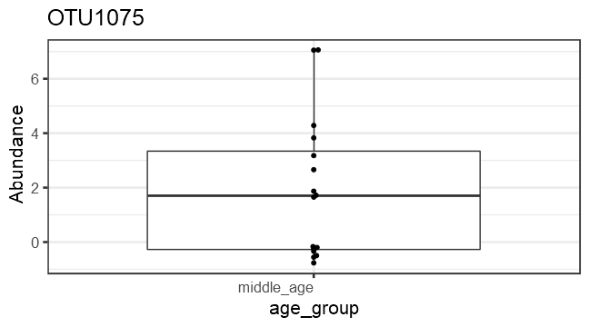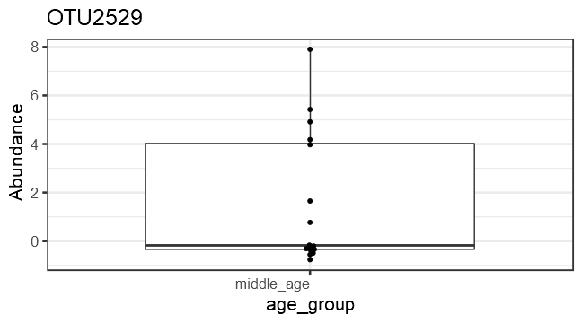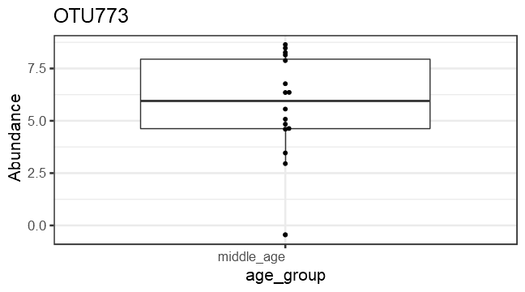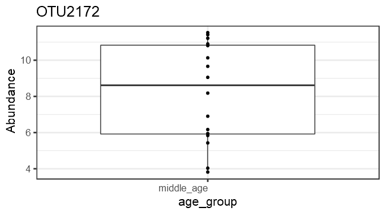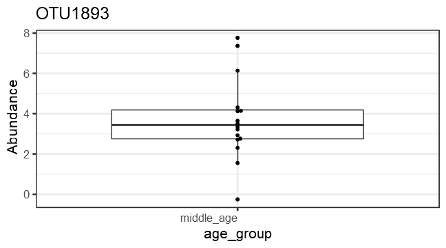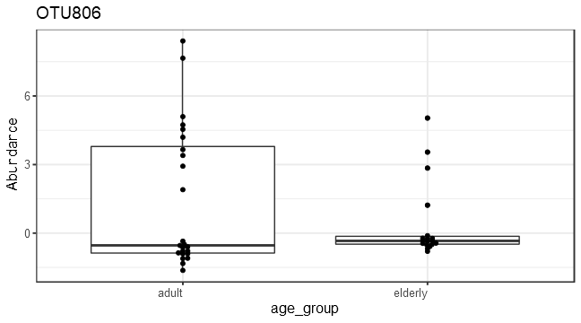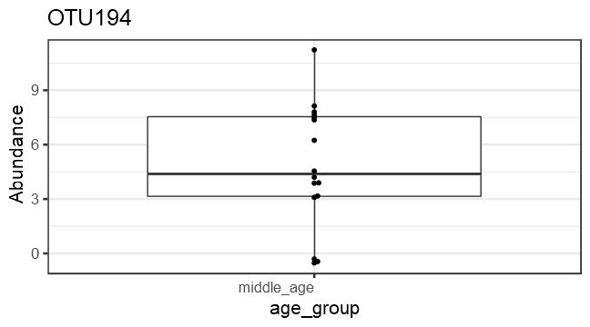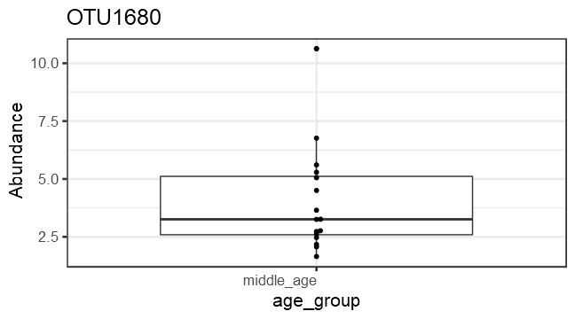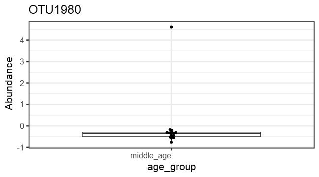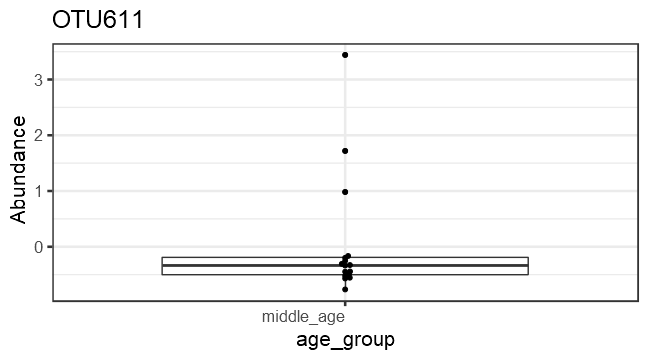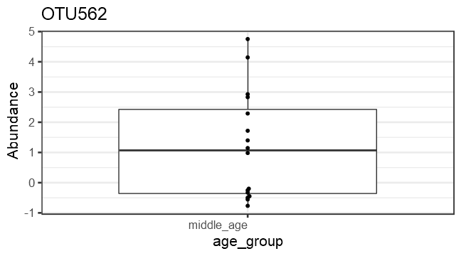

# PERMANOVA analysis

effect of age on microbial community is observed to be significant (p=0.05)


```
## Error in `contrasts<-`(`*tmp*`, value = contr.funs[1 + isOF[nn]]): contrasts can be applied only to factors with 2 or more levels
```

```
## [1] NA
```

```
## Error in anova.betadisper(betadisper(dist, meta$age_group)): anova() only applicable to two or more groups
```

# Investigate the top factors


```
## Error in coefficients(permanova)["age_group1", ]: subscript out of bounds
```

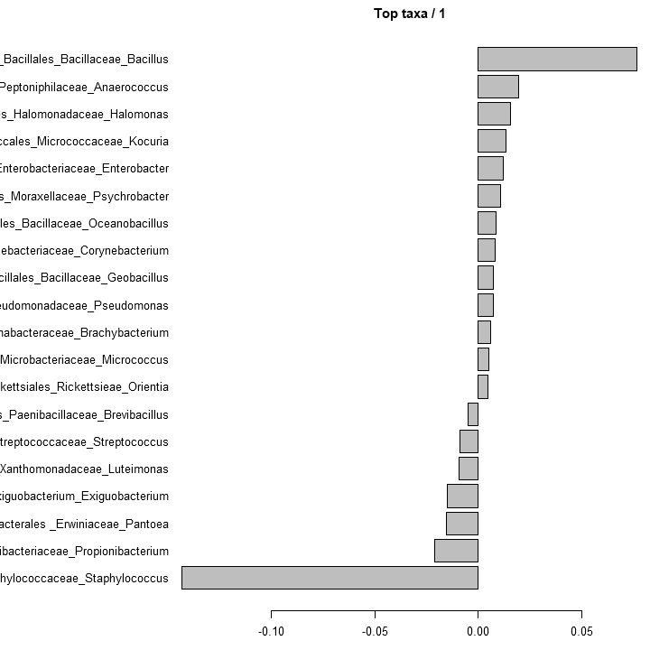

