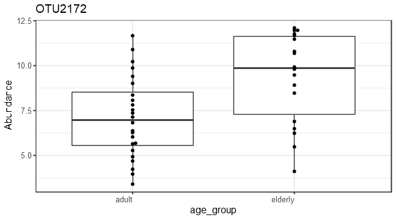
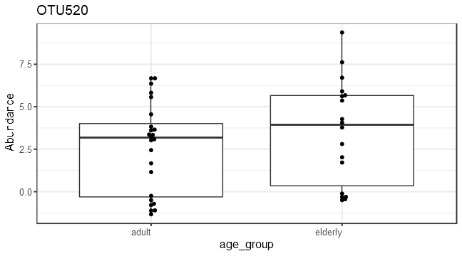
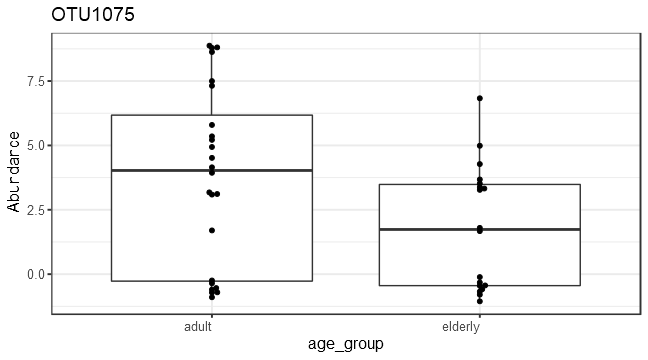

```
## phyloseq-class experiment-level object
## otu_table()   OTU Table:         [ 674 taxa and 16 samples ]
## sample_data() Sample Data:       [ 16 samples by 13 sample variables ]
## tax_table()   Taxonomy Table:    [ 674 taxa by 6 taxonomic ranks ]
```
# Alpha diversity analysis


# Group-wise comparisons
* Diversity index: diversity_shannon


# Ordination


## *Principal Coordinates Analysis (PCoA)*

* Ordination method: PCoA
* Dissimilarity measure: jaccard


```
##                                                                                                                 OTU1 
##                                              "Bacteria_Firmicutes_Bacilli_Lactobacillales_Aerococcaceae_Abiotrophia" 
##                                                                                                                 OTU2 
##                                              "Bacteria_Firmicutes_Bacilli_Bacillales_Staphylococcaceae_Abyssicoccus" 
##                                                                                                                 OTU7 
##                                         "Bacteria_Firmicutes_Clostridia_Clostridiales_Eubacteriaceae_Acetobacterium" 
##                                                                                                                 OTU9 
##                                          "Bacteria_Firmicutes_Negativicutes_Selenomonadales_Sporomusaceae_Acetonema" 
##                                                                                                                OTU10 
##                                   "Bacteria_Firmicutes_Mollicutes_Acholeplasmatales_Acholeplasmataceae_Acholeplasma" 
##                                                                                                                OTU12 
##                            "Bacteria_Proteobacteria_Betaproteobacteria_Burkholderiales_Alcaligenaceae_Achromobacter" 
##                                                                                                                OTU14 
##                                         "Bacteria_Firmicutes_Clostridia_Clostridiales_IncertaeSedis_Acidaminobacter" 
##                                                                                                                OTU15 
##                             "Bacteria_Firmicutes_Negativicutes_Acidaminococcales_Acidaminococcaceae_Acidaminococcus" 
##                                                                                                                OTU18 
##                          "Bacteria_Proteobacteria_Alphaproteobacteria_Rhodospirillales_Acetobacteraceae_Acidicaldus" 
##                                                                                                                OTU19 
##                         "Bacteria_Proteobacteria_Alphaproteobacteria_Rhodospirillales_Acetobacteraceae_Acidiphilium" 
##                                                                                                                OTU22 
##                         "Bacteria_Actinobacteria_Acidimicrobiia_Acidimicrobiales _Acidimicrobiaceae_Aciditerrimonas" 
##                                                                                                                OTU23 
##               "Bacteria_Proteobacteria_Acidithiobacillia_AcidithioBacillales_Acidithiobacillaceae_Acidithiobacillus" 
##                                                                                                                OTU53 
##                            "Bacteria_Proteobacteria_Gammaproteobacteria_Pseudomonadales_Moraxellaceae_Acinetobacter" 
##                                                                                                                OTU67 
##                                                       "Bacteria_Actinobacteria_Actinobacteria_NA_NA_Actinobacterium" 
##                                                                                                                OTU69 
##                              "Bacteria_Actinobacteria_Actinobacteria_Actinomycetales_Actinomycetaceae_Actinobaculum" 
##                                                                                                                OTU71 
##                      "Bacteria_Actinobacteria_Actinobacteria_Micromonosporales_Micromonosporaceae_Actinocatenispora" 
##                                                                                                                OTU72 
##                      "Bacteria_Actinobacteria_Actinobacteria_Streptosporangiales_Thermomonosporaceae_Actinocorallia" 
##                                                                                                                OTU75 
##                       "Bacteria_Actinobacteria_Actinobacteria_Pseudonocardiales_Pseudonocardiaceae_Actinokineospora" 
##                                                                                                                OTU76 
##                        "Bacteria_Actinobacteria_Actinobacteria_Streptosporangiales_Thermomonosporaceae_Actinomadura" 
##                                                                                                                OTU87 
##                                "Bacteria_Actinobacteria_Actinobacteria_Actinomycetales_Actinomycetaceae_Actinomyces" 
##                                                                                                                OTU97 
##                        "Bacteria_Actinobacteria_Actinobacteria_Pseudonocardiales_Pseudonocardiaceae_Actinophytocola" 
##                                                                                                                OTU99 
##                           "Bacteria_Actinobacteria_Actinobacteria_Micromonosporales_Micromonosporaceae_Actinoplanes" 
##                                                                                                               OTU102 
##                      "Bacteria_Actinobacteria_Actinobacteria_Actinopolysporales_Actinopolysporaceae_Actinopolyspora" 
##                                                                                                               OTU104 
##                                 "Bacteria_Actinobacteria_Actinobacteria_Micrococcales_Cellulomonadaceae_Actinotalea" 
##                                                                                                               OTU105 
##                                         "Bacteria_Firmicutes_Clostridia_Clostridiales_Ruminococcaceae_Acutalibacter" 
##                                                                                                               OTU111 
##                                               "Bacteria_Firmicutes_Bacilli_Lactobacillales_Aerococcaceae_Aerococcus" 
##                                                                                                               OTU114 
##                           "Bacteria_Actinobacteria_Actinobacteria_Propionibacteriales_Nocardioidaceae_Aeromicrobium" 
##                                                                                                               OTU119 
##                                 "Bacteria_Proteobacteria_Gammaproteobacteria_Aeromonadales_Aeromonadaceae_Aeromonas" 
##                                                                                                               OTU121 
##                          "Bacteria_Proteobacteria_Gammaproteobacteria_Alteromonadales _Alteromonadaceae_Agaribacter" 
##                                                                                                               OTU122 
##                        "Bacteria_Proteobacteria_Gammaproteobacteria_Pasteurellales _Pasteurellaceae_Aggregatibacter" 
##                                                                                                               OTU123 
##                                 "Bacteria_Proteobacteria_Alphaproteobacteria_Rhizobiales_Rhizobiaceae_Agrobacterium" 
##                                                                                                               OTU127 
##                                   "Bacteria_Actinobacteria_Actinobacteria_Micrococcales_Microbacteriaceae_Agromyces" 
##                                                                                                               OTU130 
##                              "Bacteria_Proteobacteria_Alphaproteobacteria_Rhodobacterales_Rhodobacteraceae_Ahrensia" 
##                                                                                                               OTU131 
##                          "Bacteria_Proteobacteria_Gammaproteobacteria_Oceanospirillales_Halomonadaceae_Aidingimonas" 
##                                                                                                               OTU133 
##                       "Bacteria_Proteobacteria_Gammaproteobacteria_Alteromonadales _Pseudoalteromonadaceae_Algicola" 
##                                                                                                               OTU134 
##                              "Bacteria_Proteobacteria_Alphaproteobacteria_Rhodobacterales_Hyphomonadaceae_Algimonas" 
##                                                                                                               OTU141 
##                                        "Bacteria_Firmicutes_Bacilli_Bacillales_Alicyclobacillaceae_Alicyclobacillus" 
##                                                                                                               OTU144 
##                                                "Bacteria_Firmicutes_Bacilli_Bacillales_Staphylococcaceae_Aliicoccus" 
##                                                                                                               OTU146 
##                          "Bacteria_Proteobacteria_Gammaproteobacteria_Oceanospirillales_Kangiellaceae_Aliikangiella" 
##                                                                                                               OTU147 
##                        "Bacteria_Proteobacteria_Gammaproteobacteria_Alteromonadales _Alteromonadaceae_Alishewanella" 
##                                                                                                               OTU148 
##                                                  "Bacteria_Firmicutes_Bacilli_Bacillales_Bacillaceae_Alkalibacillus" 
##                                                                                                               OTU149 
##                                           "Bacteria_Firmicutes_Clostridia_Clostridiales_Eubacteriaceae_Alkalibacter" 
##                                                                                                               OTU150 
##                                      "Bacteria_Firmicutes_Bacilli_Lactobacillales_Carnobacteriaceae_Alkalibacterium" 
##                                                                                                               OTU152 
##                                          "Bacteria_Firmicutes_Clostridia_Clostridiales_Eubacteriaceae_Alkalibaculum" 
##                                                                                                               OTU153 
##                                                      "Bacteria_Firmicutes_Bacilli_Bacillales_NA_Alkalilactibacillus" 
##                                                                                                               OTU154 
##                        "Bacteria_Proteobacteria_Gammaproteobacteria_Alteromonadales _Alteromonadaceae_Alkalimarinus" 
##                                                                                                               OTU157 
##                             "Bacteria_Proteobacteria_Gammaproteobacteria_Pseudomonadales_Moraxellaceae_Alkanindiges" 
##                                                                                                               OTU158 
##                                                    "Bacteria_Firmicutes_Bacilli_Bacillales_Bacillaceae_Allobacillus" 
##                                                                                                               OTU160 
##                "Bacteria_Actinobacteria_Actinobacteria_Micromonosporales_Micromonosporaceae_Allocatelliglobosispora" 
##                                                                                                               OTU161 
##                                           "Bacteria_Firmicutes_Bacilli_Lactobacillales_Carnobacteriaceae_Allofustis" 
##                                                                                                               OTU162 
##                         "Bacteria_Actinobacteria_Actinobacteria_Bifidobacteriales _Bifidobacteriaceae_Alloscardovia" 
##                                                                                                               OTU163 
##                                 "Bacteria_Actinobacteria_Actinobacteria_Micrococcales_Microbacteriaceae_Alpinimonas" 
##                                                                                                               OTU164 
##                 "Bacteria_Proteobacteria_Alphaproteobacteria_Sphingomonadales_Erythrobacteraceae_Altererythrobacter" 
##                                                                                                               OTU166 
##                                                  "Bacteria_Firmicutes_Bacilli_Bacillales_Bacillaceae_Alteribacillus" 
##                                                                                                               OTU167 
##                           "Bacteria_Proteobacteria_Alphaproteobacteria_Rhodobacterales_Rhodobacteraceae_Amaricoccus" 
##                                                                                                               OTU169 
##                                             "Bacteria_Firmicutes_Clostridia_Clostridiales_Eubacteriaceae_Aminicella" 
##                                                                                                               OTU170 
##                                      "Bacteria_Synergistetes _Synergistia _Synergistales_Synergistaceae_Aminivibrio" 
##                                                                                                               OTU171 
##                                   "Bacteria_Synergistetes _Synergistia _Synergistales_Synergistaceae_Aminobacterium" 
##                                                                                                               OTU174 
##                                            "Bacteria_Firmicutes_Bacilli_Bacillales_Paenibacillaceae_Ammoniibacillus" 
##                                                                                                               OTU175 
##                                                   "Bacteria_Firmicutes_Bacilli_Bacillales_Bacillaceae_Amphibacillus" 
##                                                                                                               OTU179 
##                         "Bacteria_Proteobacteria_Gammaproteobacteria_Oceanospirillales_Oceanospirillaceae_Amphritea" 
##                                                                                                               OTU184 
##                          "Bacteria_Actinobacteria_Actinobacteria_Pseudonocardiales_Pseudonocardiaceae_Amycolatopsis" 
##                                                                                                               OTU185 
##                          "Bacteria_Actinobacteria_Actinobacteria_Pseudonocardiales_Pseudonocardiaceae_Amycolatopsis" 
##                                                                                                               OTU187 
##                                                  "Bacteria_Firmicutes_Bacilli_Bacillales_Bacillaceae_Anaerobacillus" 
##                                                                                                               OTU194 
##                                      "Bacteria_Firmicutes_Tissierellia_Tissierellales_Peptoniphilaceae_Anaerococcus" 
##                                                                                                               OTU197 
##                                           "Bacteria_Firmicutes_Clostridia_Clostridiales_Eubacteriaceae_Anaerofustis" 
##                                                                                                               OTU198 
##                                                               "Bacteria_Chloroflexi_Anaerolineae_NA_NA_Anaerolineae" 
##                                                                                                               OTU199 
##                    "Bacteria_Proteobacteria_Deltaproteobacteria_Myxococcales_Anaeromyxobacteraceae_Anaeromyxobacter" 
##                                                                                                               OTU202 
##                                     "Bacteria_Firmicutes_Tissierellia_Tissierellales_Peptoniphilaceae_Anaerosphaera" 
##                                                                                                               OTU204 
##                                         "Bacteria_Firmicutes_Clostridia_Clostridiales_Ruminococcaceae_Anaerotruncus" 
##                                                                                                               OTU206 
##                                 "Bacteria_Proteobacteria_Alphaproteobacteria_Rhizobiales_Rhodobiaceae_Anderseniella" 
##                                                                                                               OTU207 
##                                           "Bacteria_Firmicutes_Bacilli_Bacillales_Paenibacillaceae_Aneurinibacillus" 
##                                                                                                               OTU210 
##                                "Bacteria_Actinobacteria_Actinobacteria_Kineosporiales_Kineosporiaceae_Angustibacter" 
##                                                                                                               OTU211 
##                                                   "Bacteria_Firmicutes_Bacilli_Bacillales_Bacillaceae_Anoxybacillus" 
##                                                                                                               OTU220 
##                                                   "Bacteria_Actinobacteria_Actinobacteria_Frankiales_NA_Antricoccus" 
##                                                                                                               OTU222 
##                          "Bacteria_Proteobacteria_Betaproteobacteria_Neisseriales _Chromobacteriaceae_Aquaspirillum" 
##                                                                                                               OTU223 
##                                                    "Bacteria_Firmicutes_Bacilli_Bacillales_Bacillaceae_Aquibacillus" 
##                                                                                                               OTU227 
##                            "Bacteria_Actinobacteria_Actinobacteria_Actinomycetales_Actinomycetaceae_Arcanobacterium" 
##                                                                                                               OTU228 
##                            "Bacteria_Proteobacteria_Gammaproteobacteria_Xanthomonadales_Xanthomonadaceae_Arenimonas" 
##                                                                                                               OTU231 
##                        "Bacteria_Proteobacteria_Gammaproteobacteria_Chromatiales_Ectothiorhodospiraceae_Arhodomonas" 
##                                                                                                               OTU232 
##                             "Bacteria_Actinobacteria_Actinobacteria_Micrococcales_Intrasporangiaceae_Arsenicicoccus" 
##                                                                                                               OTU233 
##                               "Bacteria_Actinobacteria_Actinobacteria_Micrococcales_Intrasporangiaceae_Arsenophonus" 
##                                                                                                               OTU251 
##                                   "Bacteria_Actinobacteria_Actinobacteria_Micrococcales_Micrococcaceae_Arthrobacter" 
##                                                                                                               OTU266 
##                                "Bacteria_Proteobacteria_Alphaproteobacteria_Rhodospirillales_Acetobacteraceae_Asaia" 
##                                                                                                               OTU267 
##                               "Bacteria_Tenericutes_Mollicutes_Anaeroplasmatales _Anaeroplasmataceae_Asteroleplasma" 
##                                                                                                               OTU268 
##                         "Bacteria_Proteobacteria_Alphaproteobacteria_Caulobacterales_Caulobacteraceae_Asticcacaulis" 
##                                                                                                               OTU270 
##                                          "Bacteria_Firmicutes_Bacilli_Lactobacillales_Carnobacteriaceae_Atopococcus" 
##                                                                                                               OTU272 
##                             "Bacteria_Proteobacteria_Alphaproteobacteria_Rhizobiales_Aurantimonadaceae_Aurantimonas" 
##                                                                                                               OTU273 
##                                                   "Bacteria_Firmicutes_Bacilli_Bacillales_Bacillaceae_Aureibacillus" 
##                                                                                                               OTU275 
##                                 "Bacteria_Actinobacteria_Actinobacteria_Micrococcales_Micrococcaceae_Auritidibacter" 
##                                                                                                               OTU276 
##                                   "Bacteria_Actinobacteria_Actinobacteria_Micrococcales_Dermatophilaceae_Austwickia" 
##                                                                                                               OTU278 
##                                   "Bacteria_Proteobacteria_Proteobacteria_Pseudomonadales_Pseudomonadaceae_Azomonas" 
##                                                                                                               OTU279 
##                             "Bacteria_Proteobacteria_Alphaproteobacteria_Rhizobiales_Xanthobacteraceae_Azorhizobium" 
##                                                                                                               OTU283 
##                           "Bacteria_Proteobacteria_Gammaproteobacteria_Pseudomonadales_Pseudomonadaceae_Azotobacter" 
##                                                                                                               OTU367 
##                                                        "Bacteria_Firmicutes_Bacilli_Bacillales_Bacillaceae_Bacillus" 
##                                                                                                               OTU455 
##                           "Bacteria_Proteobacteria_Oligoflexia_Bacteriovoracales_Halobacteriovoraceae_Bacteriovorax" 
##                                                                                                               OTU457 
##                                          "Bacteria_Verrucomicrobia_Verrucomicrobiae_Verrucomicrobiales_NA_bacterium" 
##                                                                                                               OTU463 
##                                        "Bacteria_Bacteroidetes_Bacteroidia_Bacteroidales_Bacteroidaceae_Bacteroides" 
##                                                                                                               OTU474 
##                          "Bacteria_Proteobacteria_Gammaproteobacteria_Oceanospirillales_Balneatrichaceae_Balneatrix" 
##                                                                                                               OTU475 
##                                          "Bacteria_Firmicutes_Bacilli_Lactobacillales_Enterococcaceae_Bavariicoccus" 
##                                                                                                               OTU476 
##                              "Bacteria_Proteobacteria_Oligoflexia_Bdellovibrionales_Bdellovibrionaceae_Bdellovibrio" 
##                                                                                                               OTU478 
##                                         "Bacteria_Proteobacteria_Oligoflexia_Bdellovibrionales_NA_Bdellovibrionales" 
##                                                                                                               OTU479 
##                                 "Bacteria_Actinobacteria_Actinobacteria_Micrococcales_Beutenbergiaceae_Beutenbergia" 
##                                                                                                               OTU480 
##                                                   "Bacteria_Firmicutes_Bacilli_Bacillales_Planococcaceae_Bhargavaea" 
##                                                                                                               OTU491 
##                     "Bacteria_Proteobacteria_Gammaproteobacteria_Enterobacterales _Enterobacteriaceae_Biostraticola" 
##                                                                                                               OTU492 
##                                  "Bacteria_Bacteroidetes_Flavobacteriia_Flavobacteriales_Flavobacteriaceae_Bizionia" 
##                                                                                                               OTU495 
##                                     "Bacteria_Actinobacteria_Actinobacteria_Micrococcales_Bogoriellaceae_Bogoriella" 
##                                                                                                               OTU497 
##                                    "Bacteria_Proteobacteria_Alphaproteobacteria_Rhizobiales_Bradyrhizobiaceae_Bosea" 
##                                                                                                               OTU506 
##                              "Bacteria_Actinobacteria_Actinobacteria_Micrococcales_Dermabacteraceae_Brachybacterium" 
##                                                                                                               OTU512 
##                               "Bacteria_Proteobacteria_Betaproteobacteria_Burkholderiales_Alcaligenaceae_Brackiella" 
##                                                                                                               OTU520 
##                                              "Bacteria_Firmicutes_Bacilli_Bacillales_Paenibacillaceae_Brevibacillus" 
##                                                                                                               OTU521 
##                           "Bacteria_Actinobacteria_Actinobacteria_Micrococcales_Brevibacteriaceae_Brevibacteriaceae" 
##                                                                                                               OTU526 
##                              "Bacteria_Actinobacteria_Actinobacteria_Micrococcales_Brevibacteriaceae_Brevibacterium" 
##                                                                                                               OTU536 
##                         "Bacteria_Proteobacteria_Alphaproteobacteria_Caulobacterales_Caulobacteraceae_Brevundimonas" 
##                                                                                                               OTU537 
##                              "Bacteria_Firmicutes_Erysipelotrichia_Erysipelotrichales_Erysipelotrichaceae_Breznakia" 
##                                                                                                               OTU540 
##                        "Bacteria_Actinobacteria_Actinobacteria_Propionibacteriales_Propionibacteriaceae_Brooklawnia" 
##                                                                                                               OTU542 
##                                 "Bacteria_Proteobacteria_Gammaproteobacteria_Enterobacterales _Erwiniaceae_Buchnera" 
##                                                                                                               OTU543 
##                           "Bacteria_Proteobacteria_Betaproteobacteria_Burkholderiales_Burkholderiaceae_Burkholderia" 
##                                                                                                               OTU546 
##                      "Bacteria_Proteobacteria_Gammaproteobacteria_Enterobacterales _Enterobacteriaceae_Buttiauxella" 
##                                                                                                               OTU549 
##                                         "Bacteria_Firmicutes_Clostridia_Clostridiales_Clostridiaceae_Butyricicoccus" 
##                                                                                                               OTU551 
##                               "Bacteria_Planctomycetes_Planctomycetia_Pirellulales_Lacipirellulaceae_Bythopirellula" 
##                                                                                                               OTU552 
##                               "Bacteria_Proteobacteria_Alphaproteobacteria_Holosporales_Caedimonadaceae_Caedibacter" 
##                                                                                                               OTU557 
##                     "Bacteria_Firmicutes_Clostridia_Thermoanaerobacterales_Thermoanaerobacteraceae_Caldanaerobacter" 
##                                                                                                               OTU559 
##                      "Bacteria_Firmicutes_Clostridia_Thermoanaerobacterales_Thermoanaerobacteraceae_Calderihabitans" 
##                                                                                                               OTU560 
##                                 "Bacteria_Firmicutes_Clostridia_Clostridiales_Symbiobacteriaceae_Caldinitratiruptor" 
##                                                                                                               OTU561 
##                                      "Bacteria_Caldiserica_Caldisericia_Caldisericales_Caldisericaceae_Caldisericum" 
##                                                                                                               OTU562 
##                                                  "Bacteria_Firmicutes_Bacilli_Bacillales_Bacillaceae_Calditerricola" 
##                                                                                                               OTU565 
##                                            "Bacteria_Firmicutes_Clostridia_Clostridiales_Clostridiaceae_Caloramator" 
##                                                                                                               OTU570 
##                  "Bacteria_Proteobacteria_Epsilonproteobacteria _Campylobacterales_Campylobacteraceae_Campylobacter" 
##                                                                                                               OTU576 
##                  "Bacteria_Proteobacteria_Gammaproteobacteria_Cardiobacteriales _Cardiobacteriaceae_Cardiobacterium" 
##                                                                                                               OTU578 
##                  "Bacteria_Firmicutes_Clostridia_Clostridiales_Clostridiales Family XIII. Incertae Sedis_Casaltella" 
##                                                                                                               OTU579 
##                         "Bacteria_Actinobacteria_Actinobacteria_Micromonosporales_Micromonosporaceae_Catellatospora" 
##                                                                                                               OTU580 
##                                          "Bacteria_Firmicutes_Bacilli_Lactobacillales_Enterococcaceae_Catellicoccus" 
##                                                                                                               OTU582 
##                                 "Bacteria_Proteobacteria_Gammaproteobacteria_Vibrionales _Vibrionaceae_Catenococcus" 
##                                                                                                               OTU583 
##                          "Bacteria_Proteobacteria_Gammaproteobacteria_Alteromonadales _Alteromonadaceae_Catenovulum" 
##                                                                                                               OTU585 
##                           "Bacteria_Actinobacteria_Actinobacteria_Catenulisporales _Catenulisporaceae_Catenulispora" 
##                                                                                                               OTU586 
##                                "Bacteria_Proteobacteria_Gammaproteobacteria_Pseudomonadales_Moraxellaceae_Cavicella" 
##                                                                                                               OTU588 
##                           "Bacteria_Proteobacteria_Gammaproteobacteria_Enterobacterales _Enterobacteriaceae_Cedecea" 
##                                                                                                               OTU590 
##                          "Bacteria_Proteobacteria_Gammaproteobacteria_NA_Celerinatantimonadaceae_Celerinatantimonas" 
##                                                                                                               OTU593 
##                                "Bacteria_Actinobacteria_Actinobacteria_Micrococcales_Cellulomonadaceae_Cellulomonas" 
##                                                                                                               OTU602 
##                      "Bacteria_Actinobacteria_Actinobacteria_Micrococcales_Promicromonosporaceae_Cellulosimicrobium" 
##                                                                                                               OTU605 
##                            "Bacteria_Proteobacteria_Gammaproteobacteria_CellVibrionales_Cellvibrionaceae_Cellvibrio" 
##                                                                                                               OTU608 
##                                                  "Bacteria_Firmicutes_Bacilli_Bacillales_Bacillaceae_Cerasibacillus" 
##                                                                                                               OTU610 
##                  "Bacteria_Fibrobacteres_Chitinispirillia _Chitinispirillales _Chitinispirillaceae_Chitinispirillum" 
##                                                                                                               OTU611 
##                     "Bacteria_Fibrobacteres_Chitinispirillia _Chitinispirillales _Chitinispirillaceae_Chitinivibrio" 
##                                                                                                               OTU615 
##                                         "Bacteria_Bacteroidetes_Chlorobia_Chlorobiales_Chlorobiaceae_Chloroherpeton" 
##                                                                                                               OTU616 
##                                  "Bacteria_Proteobacteria_Gammaproteobacteria_Chromatiales_Chromatiaceae_Chromatium" 
##                                                                                                               OTU617 
##                        "Bacteria_Proteobacteria_Betaproteobacteria_Neisseriales _Chromobacteriaceae_Chromobacterium" 
##                                                                                                               OTU618 
##                           "Bacteria_Cyanobacteria_NA_Chroococcidiopsidales_Chroococcidiopsidaceae_Chroococcidiopsis" 
##                                                                                                               OTU619 
##                          "Bacteria_Bacteroidetes_Flavobacteriia_Flavobacteriales_Flavobacteriaceae_Chryseobacterium" 
##                                                                                                               OTU623 
##                                                          "Bacteria_Firmicutes_Bacilli_Lactobacillales_NA_Chungangia" 
##                                                                                                               OTU625 
##                                    "Bacteria_Actinobacteria_Actinobacteria_Micrococcales_Micrococcaceae_Citricoccus" 
##                                                                                                               OTU629 
##                       "Bacteria_Proteobacteria_Gammaproteobacteria_Enterobacterales _Enterobacteriaceae_Citrobacter" 
##                                                                                                               OTU636 
##                       "Bacteria_Proteobacteria_Gammaproteobacteria_Enterobacterales _Enterobacteriaceae_Clavibacter" 
##                                                                                                               OTU638 
##                                         "Bacteria_Bacteroidetes_Cytophagia_Cytophagales_Amoebophilaceae_Cloacimonas" 
##                                                                                                               OTU640 
##                                   "Bacteria_Firmicutes_Clostridia_Clostridiales_Clostridiaceae_Clostridiisalibacter" 
##                                                                                                               OTU661 
##                                            "Bacteria_Firmicutes_Clostridia_Clostridiales_Clostridiaceae_Clostridium" 
##                                                                                                               OTU707 
##                                                   "Bacteria_Firmicutes_Bacilli_Bacillales_Paenibacillaceae_Cohnella" 
##                                                                                                               OTU722 
## "Bacteria_Coprothermobacterota _Coprothermobacteria _Coprothermobacterales_Coprothermobacteraceae_Coprothermobacter" 
##                                                                                                               OTU723 
##                         "Bacteria_Proteobacteria_Gammaproteobacteria_Alteromonadales _Alteromonadaceae_Corallomonas" 
##                                                                                                               OTU773 
##                        "Bacteria_Actinobacteria_Actinobacteria_Corynebacteriales_Corynebacteriaceae_Corynebacterium" 
##                                                                                                               OTU795 
##                                    "Bacteria_Proteobacteria_Gammaproteobacteria_Legionellales_Coxiellaceae_Coxiella" 
##                                                                                                               OTU798 
##                                        "Bacteria_Chlamydiae_Chlamydiia_Parachlamydiales_Criblamydiaceae_Criblamydia" 
##                                                                                                               OTU804 
##                       "Bacteria_Proteobacteria_Gammaproteobacteria_Enterobacterales _Enterobacteriaceae_Cronobacter" 
##                                                                                                               OTU806 
##                              "Bacteria_Bacteroidetes_Flavobacteriia_Flavobacteriales_Flavobacteriaceae_Cruoricaptor" 
##                                                                                                               OTU807 
##                               "Bacteria_Actinobacteria_Actinobacteria_Micrococcales_Microbacteriaceae_Cryobacterium" 
##                                                                                                               OTU808 
##                                   "Bacteria_Bacteroidetes_Flavobacteriia_Flavobacteriales_Cryomorphaceae_Cryomorpha" 
##                                                                                                               OTU809 
##                                      "Bacteria_Firmicutes_Clostridia_Clostridiales_Peptococcaceae_Cryptanaerobacter" 
##                                                                                                               OTU810 
##                                            "Bacteria_Viridiplantae_Magnoliopsida_Cucurbitales_Cucurbitaceae_Cucumis" 
##                                                                                                               OTU811 
##                                         "Bacteria_Firmicutes_Clostridia_Clostridiales_Lachnospiraceae_Cuneatibacter" 
##                                                                                                               OTU812 
##                              "Bacteria_Actinobacteria_Actinobacteria_Micrococcales_Microbacteriaceae_Curtobacterium" 
##                                                                                                               OTU814 
##                       "Bacteria_Proteobacteria_Gammaproteobacteria_Thiotrichales_Piscirickettsiaceae_Cycloclasticus" 
##                                                                                                               OTU817 
##                                                      "Bacteria_Proteobacteria_Deltaproteobacteria_NA_NA_Deferrisoma" 
##                                                                                                               OTU818 
##                      "Bacteria_Proteobacteria_Alphaproteobacteria_Rhodospirillales_Rhodospirillaceae_Defluviicoccus" 
##                                                                                                               OTU820 
##                                           "Bacteria_Firmicutes_Clostridia_Clostridiales_Peptococcaceae_Dehalobacter" 
##                                                                                                               OTU821 
##                          "Bacteria_Chloroflexi_Dehalococcoidia_Dehalococcoidales_Dehalococcoidaceae_Dehalococcoides" 
##                                                                                                               OTU822 
##                              "Bacteria_Deinococcus-Thermus_Deinococci _Deinococcales _Deinococcaceae_Deinobacterium" 
##                                                                                                               OTU823 
##                                       "Bacteria_Actinobacteria_Actinobacteria_Micrococcales_Demequinaceae_Demequina" 
##                                                                                                               OTU825 
##                                       "Bacteria_Actinobacteria_Actinobacteria_Micrococcales_Dermacoccaceae_Demetria" 
##                                                                                                               OTU826 
##                                  "Bacteria_Firmicutes_Negativicutes_Selenomonadales_Sporomusaceae_Dendrosporobacter" 
##                                                                                                               OTU830 
##                                    "Bacteria_Actinobacteria_Actinobacteria_Micrococcales_Dermacoccaceae_Dermacoccus" 
##                                                                                                               OTU832 
##                                "Bacteria_Actinobacteria_Actinobacteria_Micrococcales_Dermatophilaceae_Dermatophilus" 
##                                                                                                               OTU833 
##                                  "Bacteria_Proteobacteria_Betaproteobacteria_Burkholderiales _Alcaligenaceae_Derxia" 
##                                                                                                               OTU835 
##                                             "Bacteria_Firmicutes_Bacilli_Lactobacillales_Carnobacteriaceae_Desemzia" 
##                                                                                                               OTU839 
##                                        "Bacteria_Firmicutes_Clostridia_Clostridiales_Peptococcaceae_Desulfitibacter" 
##                                                                                                               OTU841 
##                                     "Bacteria_Firmicutes_Clostridia_Clostridiales_Peptococcaceae_Desulfitobacterium" 
##                                                                                                               OTU844 
##                 "Bacteria_Proteobacteria_Deltaproteobacteria_Syntrophobacterales_Syntrophobacteraceae_Desulfoglaeba" 
##                                                                                                               OTU846 
##                  "Bacteria_Proteobacteria_Deltaproteobacteria_DesulfoVibrionales_Desulfohalobiaceae_Desulfohalobium" 
##                                                                                                               OTU848 
##                        "Bacteria_Proteobacteria_Deltaproteobacteria_Syntrophobacterales_Syntrophaceae_Desulfomonile" 
##                                                                                                               OTU851 
##                  "Bacteria_Proteobacteria_Deltaproteobacteria_DesulfoVibrionales_Desulfonatronaceae_Desulfonauticus" 
##                                                                                                               OTU853 
##                      "Bacteria_Proteobacteria_Deltaproteobacteria_Desulfobacterales _Desulfobacteraceae_Desulfonema" 
##                                                                                                               OTU854 
##                                         "Bacteria_Firmicutes_Clostridia_Clostridiales_Peptococcaceae_Desulfonispora" 
##                                                                                                               OTU855 
##                        "Bacteria_Proteobacteria_Deltaproteobacteria_Desulfobacterales _Desulfobulbaceae_Desulfopila" 
##                                                                                                               OTU858 
##                      "Bacteria_Proteobacteria_Deltaproteobacteria_Desulfobacterales _Desulfobulbaceae_Desulforegula" 
##                                                                                                               OTU859 
##                   "Bacteria_Proteobacteria_Deltaproteobacteria_Syntrophobacterales_Syntrophobacteraceae_Desulfosoma" 
##                                                                                                               OTU860 
##                                   "Bacteria_Firmicutes_Negativicutes_Selenomonadales_Sporomusaceae_Desulfosporomusa" 
##                                                                                                               OTU861 
##                                  "Bacteria_Firmicutes_Negativicutes_Selenomonadales_Sporomusaceae_Desulfosporosinus" 
##                                                                                                               OTU862 
##                   "Bacteria_Proteobacteria_Deltaproteobacteria_DesulfoVibrionales_Desulfohalobiaceae_Desulfothermus" 
##                                                                                                               OTU870 
##                                       "Bacteria_Firmicutes_Clostridia_Clostridiales_Peptococcaceae_Desulfotomaculum" 
##                                                                                                               OTU876 
##                   "Bacteria_Proteobacteria_Deltaproteobacteria_DesulfoVibrionales_Desulfovibrionaceae_Desulfovibrio" 
##                                                                                                               OTU886 
##                  "Bacteria_Proteobacteria_Deltaproteobacteria_Desulfuromonadales_Desulfuromonadaceae_Desulfuromonas" 
##                                                                                                               OTU891 
##                                    "Bacteria_Actinobacteria_Actinobacteria_Micrococcales_Dermabacteraceae_Devriesea" 
##                                                                                                               OTU892 
##                                         "Bacteria_Firmicutes_Negativicutes_Veillonellales_Veillonellaceae_Dialister" 
##                                                                                                               OTU896 
##                                       "Bacteria_Actinobacteria_Actinobacteria_Corynebacteriales_Dietziaceae_Dietzia" 
##                                                                                                               OTU909 
##                                                    "Bacteria_Firmicutes_Bacilli_Bacillales_Bacillaceae_Domibacillus" 
##                                                                                                               OTU913 
##                                    "Bacteria_Bacteroidetes_Bacteroidia_Bacteroidales_Dysgonamonadaceae_Dysgonomonas" 
##                                                                                                               OTU915 
##                 "Bacteria_Proteobacteria_Gammaproteobacteria_Chromatiales_Ectothiorhodospiraceae_Ectothiorhodospira" 
##                                                                                                               OTU919 
##                                     "Bacteria_Actinobacteria_Nitriliruptoria_Egibacterales_Egibacteraceae_Egibacter" 
##                                                                                                               OTU921 
##                                 "Bacteria_Proteobacteria_Alphaproteobacteria_Rhodospirillales_Elioraeaceae_Elioraea" 
##                                                                                                               OTU922 
##                  "Bacteria_Firmicutes_Clostridia_Clostridiales_Clostridiales Family XIII. Incertae Sedis_Emergencia" 
##                                                                                                               OTU923 
##                                             "Bacteria_Bacteroidetes_Cytophagia_Cytophagales_Cytophagaceae_Emticicia" 
##                                                                                                               OTU924 
##                        "Bacteria_Proteobacteria_Gammaproteobacteria_Enterobacterales _Enterobacteriaceae_Endobacter" 
##                                                                                                               OTU925 
##                                       "Bacteria_Proteobacteria_Alphaproteobacteria_Rhizobiales_Rhizobiaceae_Ensifer" 
##                                                                                                               OTU926 
##                              "Bacteria_Actinobacteria_Actinobacteria_Micrococcales_Micrococcaceae_Enteractinococcus" 
##                                                                                                               OTU929 
##                      "Bacteria_Proteobacteria_Gammaproteobacteria_Enterobacterales _Enterobacteriaceae_Enterobacter" 
##                                                                                                               OTU944 
##                                           "Bacteria_Firmicutes_Bacilli_Lactobacillales_Enterococcaceae_Enterococcus" 
##                                                                                                               OTU963 
##                                  "Bacteria_Tenericutes_Mollicutes_Entomoplasmatales_Entomoplasmataceae_Entomoplasma" 
##                                                                                                               OTU964 
##                           "Bacteria_Bacteroidetes_Flavobacteriia_Flavobacteriales_Flavobacteriaceae_Epilithonimonas" 
##                                                                                                               OTU965 
##                                              "Bacteria_Firmicutes_Bacilli_Lactobacillales_Aerococcaceae_Eremococcus" 
##                                                                                                               OTU978 
##                                  "Bacteria_Proteobacteria_Gammaproteobacteria_Enterobacterales _Erwiniaceae_Erwinia" 
##                                                                                                               OTU987 
##              "Bacteria_Proteobacteria_Gammaproteobacteria_Enterobacterales _Enterobacteriaceae_Escherichia/Shigella" 
##                                                                                                               OTU985 
##                       "Bacteria_Proteobacteria_Gammaproteobacteria_Enterobacterales _Enterobacteriaceae_Escherichia" 
##                                                                                                               OTU988 
##                                            "Bacteria_Firmicutes_Clostridia_Clostridiales_Eubacteriaceae_Eubacterium" 
##                                                                                                               OTU999 
##                                  "Bacteria_Bacteroidetes_Flavobacteriia_Flavobacteriales_Flavobacteriaceae_Eudoraea" 
##                                                                                                              OTU1002 
##                               "Bacteria_Proteobacteria_Gammaproteobacteria_Enterobacterales _Yersiniaceae_Ewingella" 
##                                                                                                              OTU1005 
##                                             "Bacteria_Firmicutes_Bacilli_Bacillales_Exiguobacterium_Exiguobacterium" 
##                                                                                                              OTU1013 
##                                                                   "Bacteria_Firmicutes_Tissierellia_NA_NA_Ezakiella" 
##                                                                                                              OTU1019 
##                                                "Bacteria_Firmicutes_Bacilli_Lactobacillales_Aerococcaceae_Facklamia" 
##                                                                                                              OTU1021 
##                                                   "Bacteria_Firmicutes_Bacilli_Bacillales_Bacillaceae_Falsibacillus" 
##                                                                                                              OTU1023 
##                                                         "Bacteria_Firmicutes_Clostridia_Clostridiales_NA_Fenollaria" 
##                                                                                                              OTU1025 
##                            "Bacteria_Proteobacteria_Gammaproteobacteria_Alteromonadales _Ferrimonadaceae_Ferrimonas" 
##                                                                                                              OTU1031 
##                                                    "Bacteria_Firmicutes_Bacilli_Bacillales_Bacillaceae_Filobacillus" 
##                                                                                                              OTU1034 
##                                        "Bacteria_Firmicutes_Tissierellia_Tissierellales_Peptoniphilaceae_Finegoldia" 
##                                                                                                              OTU1037 
##                              "Bacteria_Bacteroidetes_Chitinophagia_Chitinophagales_Chitinophagaceae_Flavisolibacter" 
##                                                                                                              OTU1038 
##                            "Bacteria_Bacteroidetes_Flavobacteriia_Flavobacteriales_Flavobacteriaceae_Flavobacterium" 
##                                                                                                              OTU1043 
##                                         "Bacteria_Bacteroidetes_Cytophagia_Cytophagales_Flammeovirgaceae_Flexithrix" 
##                                                                                                              OTU1044 
##                                     "Bacteria_Actinobacteria_Actinobacteria_Micrococcales_Dermacoccaceae_Flexivirga" 
##                                                                                                              OTU1045 
##                                                       "Bacteria_Firmicutes_Clostridia_Clostridiales_NA_Flintibacter" 
##                                                                                                              OTU1046 
##                             "Bacteria_Proteobacteria_Gammaproteobacteria_Pseudomonadales_Moraxellaceae_Fluviicoccus" 
##                                                                                                              OTU1047 
##                           "Bacteria_Actinobacteria_Actinobacteria_Cryptosporangiales_Cryptosporangiaceae_Fodinicola" 
##                                                                                                              OTU1048 
##                                              "Bacteria_Firmicutes_Bacilli_Bacillales_Paenibacillaceae_Fontibacillus" 
##                                                                                                              OTU1052 
##                              "Bacteria_Actinobacteria_Actinobacteria_Micrococcales_Microbacteriaceae_Frondihabitans" 
##                                                                                                              OTU1053 
##                                        "Bacteria_Firmicutes_Bacilli_Lactobacillales_Leuconostocaceae_Fructobacillus" 
##                                                                                                              OTU1054 
##                                     "Bacteria_Firmicutes_Clostridia_Clostridiales_ClostridialesFamilyXII_Fusibacter" 
##                                                                                                              OTU1056 
##                                      "Bacteria_Firmicutes_Clostridia_Clostridiales_Lachnospiraceae_Fusicatenibacter" 
##                                                                                                              OTU1057 
##                                             "Bacteria_Actinobacteria_Rubrobacteria _Gaiellales _Gaiellaceae_Gaiella" 
##                                                                                                              OTU1058 
##                              "Bacteria_Proteobacteria_Gammaproteobacteria_Thiotrichales_Piscirickettsiaceae_Galenea" 
##                                                                                                              OTU1059 
##                                         "Bacteria_Firmicutes_Tissierellia_Tissierellales_Peptoniphilaceae_Gallicola" 
##                                                                                                              OTU1062 
##                               "Bacteria_Firmicutes_Clostridia_Thermoanaerobacterales_Thermoanaerobacteraceae_Gelria" 
##                                                                                                              OTU1065 
##                                                 "Bacteria_Firmicutes_Clostridia_Clostridiales_IncertaeSedis_Gemella" 
##                                                                                                              OTU1070 
##                          "Bacteria_Gemmatimonadetes_Gemmatimonadetes_Gemmatimonadales_Gemmatimonadaceae_Gemmatirosa" 
##                                                                                                              OTU1072 
##                           "Bacteria_Proteobacteria_Alphaproteobacteria_Rhodobacterales_Rhodobacteraceae_Gemmobacter" 
##                                                                                                              OTU1073 
##                       "Bacteria_Proteobacteria_Alphaproteobacteria_Rhodobacterales_Rhodobacteraceae_Geoalkalibacter" 
##                                                                                                              OTU1075 
##                                                     "Bacteria_Firmicutes_Bacilli_Bacillales_Bacillaceae_Geobacillus" 
##                                                                                                              OTU1077 
##                            "Bacteria_Proteobacteria_Deltaproteobacteria_Desulfuromonadales_Geobacteraceae_Geobacter" 
##                                                                                                              OTU1078 
##                     "Bacteria_Actinobacteria_Actinobacteria_Geodermatophilales_Geodermatophilaceae_Geodermatophilus" 
##                                                                                                              OTU1080 
##                                                             "Bacteria_Firmicutes_Bacilli_Bacillales_NA_Geomicrobium" 
##                                                                                                              OTU1081 
##                     "Bacteria_Proteobacteria_Deltaproteobacteria_Desulfuromonadales_Geobacteraceae_Geopsychrobacter" 
##                                                                                                              OTU1082 
##                                      "Bacteria_Pctinobacteria_Actinobacteria_Micrococcales_Bogoriellaceae_Georgenia" 
##                                                                                                              OTU1085 
##                                        "Bacteria_Firmicutes_Clostridia_Clostridiales _Clostridiaceae_Geosporobacter" 
##                                                                                                              OTU1086 
##                          "Bacteria_Proteobacteria_Alphaproteobacteria_Rickettsiales_Anaplasmataceae_Geothermobacter" 
##                                                                                                              OTU1088 
##                                  "Bacteria_Bacteroidetes_Flavobacteriia_Flavobacteriales_Flavobacteriaceae_Gillisia" 
##                                                                                                              OTU1090 
##                         "Bacteria_Proteobacteria_Gammaproteobacteria_CellVibrionales _Cellvibrionaceae_Gilvimarinus" 
##                                                                                                              OTU1094 
##                                             "Bacteria_Firmicutes_Bacilli_Lactobacillales_Aerococcaceae_Globicatella" 
##                                                                                                              OTU1095 
##                    "Bacteria_Proteobacteria_Alphaproteobacteria_Rhodospirillales_Acetobacteraceae_Gluconacetobacter" 
##                                                                                                              OTU1096 
##                        "Bacteria_Proteobacteria_Alphaproteobacteria_Rhodospirillales_Acetobacteraceae_Gluconobacter" 
##                                                                                                              OTU1098 
##                                   "Bacteria_Actinobacteria_Actinobacteria_Glycomycetales_Glycomycetaceae_Glycomyces" 
##                                                                                                              OTU1102 
##                                     "Bacteria_Actinobacteria_Actinobacteria_Corynebacteriales_Gordoniaceae_Gordonia" 
##                                                                                                              OTU1106 
##                                           "Bacteria_Firmicutes_Bacilli_Bacillales_Paenibacillaceae_Gorillibacterium" 
##                                                                                                              OTU1108 
##                                                 "Bacteria_Firmicutes_Bacilli_Bacillales_Bacillaceae_Gracilibacillus" 
##                                                                                                              OTU1110 
##                                      "Bacteria_Firmicutes_Clostridia_Clostridiales_Gracilibacteraceae_Gracilibacter" 
##                                                                                                              OTU1112 
##                                       "Bacteria_Firmicutes_Bacilli_Lactobacillales_Carnobacteriaceae_Granulicatella" 
##                                                                                                              OTU1117 
##                                "Bacteria_Actinobacteria_Actinobacteria_Micrococcales_Microbacteriaceae_Gulosibacter" 
##                                                                                                              OTU1118 
##                        "Bacteria_Proteobacteria_Gammaproteobacteria_Oceanospirillales_Saccharospirillaceae_Gynuella" 
##                                                                                                              OTU1119 
##                         "Bacteria_Proteobacteria_Alphaproteobacteria_Rhodobacterales_Rhodobacteraceae_Haematobacter" 
##                                                                                                              OTU1120 
##                             "Bacteria_Proteobacteria_Gammaproteobacteria_Pasteurellales_Pasteurellaceae_Haemophilus" 
##                                                                                                              OTU1124 
##                                  "Bacteria_Proteobacteria_Gammaproteobacteria_Oceanospirillales_Hahellaceae_Hahella" 
##                                                                                                              OTU1125 
##                                               "Bacteria_Firmicutes_Bacilli_Bacillales_Bacillaceae_Halalkalibacillus" 
##                                                                                                              OTU1128 
##                                      "Bacteria_Firmicutes_Clostridia_Halanaerobiales_Halanaerobiaceae_Halanaerobium" 
##                                                                                                              OTU1130 
##                                   "Bacteria_Proteobacteria_Deltaproteobacteria_Myxococcales_Kofleriaceae_Haliangium" 
##                                                                                                              OTU1131 
##                                      "Bacteria_Proteobacteria_Gammaproteobacteria_CellVibrionales_Halieaceae_Haliea" 
##                                                                                                              OTU1132 
##                                "Bacteria_Proteobacteria_Gammaproteobacteria_CellVibrionales _Halieaceae_Halioglobus" 
##                                                                                                              OTU1133 
##                                "Bacteria_Actinobacteria_Actinobacteria_Micrococcales_Ruaniaceae_Haloactinobacterium" 
##                                                                                                              OTU1134 
##                              "Bacteria_Actinobacteria_Actinobacteria_Jiangellales_Jiangellaceae_Haloactinopolyspora" 
##                                                                                                              OTU1137 
##                                                    "Bacteria_Firmicutes_Bacilli_Bacillales_Bacillaceae_Halobacillus" 
##                                                                                                              OTU1144 
##                                               "Bacteria_Firmicutes_Bacilli_Bacillales_Bacillaceae_Halolactibacillus" 
##                                                                                                              OTU1145 
##                                        "Bacteria_Cyanobacteria_NA_Synechococcales_Prochlorotrichaceae_Halomicronema" 
##                                                                                                              OTU1165 
##                             "Bacteria_Proteobacteria_Gammaproteobacteria_Oceanospirillales_Halomonadaceae_Halomonas" 
##                                                                                                              OTU1182 
##                                     "Bacteria_Firmicutes_Clostridia_Halanaerobiales_Halobacteroidaceae_Halonatronum" 
##                                                                                                              OTU1183 
##                                                         "Bacteria_NA_NA_Haloplasmatales_Haloplasmataceae_Haloplasma" 
##                                                                                                              OTU1184 
##                     "Bacteria_Proteobacteria_Gammaproteobacteria_Chromatiales_Ectothiorhodospiraceae_Halorhodospira" 
##                                                                                                              OTU1187 
##                             "Bacteria_Proteobacteria_Alphaproteobacteria_Rhodobacterales_Rhodobacteraceae_Halovulum" 
##                                                                                                              OTU1188 
##                            "Bacteria_Proteobacteria_Alphaproteobacteria_Rhizobiales_Methylocystaceae_Hansschlegelia" 
##                                                                                                              OTU1190 
##                          "Bacteria_Proteobacteria_Alphaproteobacteria_Rhodobacterales_Rhodobacteraceae_Hasllibacter" 
##                                                                                                              OTU1191 
##                                            "Bacteria_Firmicutes_Bacilli_Bacillales_Thermoactinomycetaceae_Hazenella" 
##                                                                                                              OTU1192 
##                                "Bacteria_Actinobacteria_Actinobacteria_Micrococcales_Dermabacteraceae_Helcobacillus" 
##                                                                                                              OTU1194 
##                                       "Bacteria_Firmicutes_Tissierellia_Tissierellales_Peptoniphilaceae_Helcococcus" 
##                                                                                                              OTU1196 
##                                      "Bacteria_Firmicutes_Clostridia_Clostridiales_Heliobacteriaceae_Heliobacterium" 
##                                                                                                              OTU1197 
##                                 "Bacteria_Actinobacteria_Actinobacteria_Micrococcales_Microbacteriaceae_Herbiconiux" 
##                                                                                                              OTU1198 
##                                 "Bacteria_Proteobacteria_Alphaproteobacteria_Rhizobiales_Phyllobacteriaceae_Hoeflea" 
##                                                                                                              OTU1200 
##                                           "Bacteria_Actinobacteria_Holophagae _Holophagales_Holophagaceae_Holophaga" 
##                                                                                                              OTU1201 
##                             "Bacteria_Actinobacteria_Actinobacteria_Micrococcales_Microbacteriaceae_Homoserinimonas" 
##                                                                                                              OTU1203 
##                                                                        "Bacteria_Firmicutes_NA_NA_NA_Hydrogenispora" 
##                                                                                                              OTU1207 
##                             "Bacteria_Proteobacteria_Gammaproteobacteria_Alteromonadales _Idiomarinaceae_Idiomarina" 
##                                                                                                              OTU1209 
##                    "Bacteria_Ignavibacteriae _Ignavibacteria _Ignavibacteriales _Ignavibacteriaceae_Ignavibacterium" 
##                                                                                                              OTU1210 
##                                             "Bacteria_Firmicutes_Bacilli_Lactobacillales_Aerococcaceae_Ignavigranum" 
##                                                                                                              OTU1211 
##                   "Bacteria_Firmicutes_Clostridia_Clostridiales_Clostridiales Family XIII. Incertae Sedis_Ihubacter" 
##                                                                                                              OTU1212 
##                          "Bacteria_Actinobacteria_Acidimicrobiia_Acidimicrobiales _Ilumatobacteraceae_Ilumatobacter" 
##                                                                                                              OTU1215 
##                                      "Bacteria_Firmicutes_Clostridia_Clostridiales_Eubacteriaceae_Intestinibacillus" 
##                                                                                                              OTU1216 
##                                                     "Bacteria_Firmicutes_Clostridia_Clostridiales_NA_Intestinimonas" 
##                                                                                                              OTU1218 
##                            "Bacteria_Actinobacteria_Actinobacteria_Micrococcales_Intrasporangiaceae_Intrasporangium" 
##                                                                                                              OTU1219 
##                                       "Bacteria_Firmicutes_Clostridia_Clostridiales_Eubacteriaceae_Irregularibacter" 
##                                                                                                              OTU1220 
##                                           "Bacteria_Firmicutes_Bacilli_Lactobacillales_Carnobacteriaceae_Isobaculum" 
##                                                                                                              OTU1221 
##                               "Bacteria_Proteobacteria_Gammaproteobacteria_Chromatiales_Chromatiaceae_Isochromatium" 
##                                                                                                              OTU1223 
##                                 "Bacteria_Actinobacteria_Actinobacteria_Micrococcales_Intrasporangiaceae_Janibacter" 
##                                                                                                              OTU1229 
##                            "Bacteria_Proteobacteria_Alphaproteobacteria_Rhodobacterales_Rhodobacteraceae_Jannaschia" 
##                                                                                                              OTU1231 
##                                     "Bacteria_Actinobacteria_Actinobacteria_Frankiales_Frankiaceae_Jatrophihabitans" 
##                                                                                                              OTU1235 
##                                            "Bacteria_Firmicutes_Bacilli_Bacillales_Staphylococcaceae_Jeotgalicoccus" 
##                                                                                                              OTU1242 
##                              "Bacteria_Firmicutes_Erysipelotrichia_Erysipelotrichales_Erysipelotrichaceae_Kandleria" 
##                                                                                                              OTU1243 
##                              "Bacteria_Proteobacteria_Gammaproteobacteria_Oceanospirillales_Kangiellaceae_Kangiella" 
##                                                                                                              OTU1246 
##                                "Bacteria_Proteobacteria_Alphaproteobacteria_Kiloniellales_Kiloniellaceae_Kiloniella" 
##                                                                                                              OTU1247 
##                                  "Bacteria_Actinobacteria_Actinobacteria_Kineosporiales_Kineosporiaceae_Kineococcus" 
##                                                                                                              OTU1248 
##                                 "Bacteria_Actinobacteria_Actinobacteria_Micrococcales_Dermatophilaceae_Kineosphaera" 
##                                                                                                              OTU1251 
##                       "Bacteria_Proteobacteria_Gammaproteobacteria_Oceanospirillales_Endozoicomonadaceae_Kistimonas" 
##                                                                                                              OTU1252 
##                           "Bacteria_Actinobacteria_Actinobacteria_Streptomycetales _Streptomycetaceae_Kitasatospora" 
##                                                                                                              OTU1260 
##                        "Bacteria_Proteobacteria_Gammaproteobacteria_Enterobacterales _Enterobacteriaceae_Klebsiella" 
##                                                                                                              OTU1261 
##                                   "Bacteria_Actinobacteria_Actinobacteria_Micrococcales_Microbacteriaceae_Klugiella" 
##                                                                                                              OTU1262 
##                          "Bacteria_Proteobacteria_Gammaproteobacteria_Enterobacterales _Enterobacteriaceae_Kluyvera" 
##                                                                                                              OTU1265 
##                          "Bacteria_Proteobacteria_Gammaproteobacteria_Enterobacterales _Enterobacteriaceae_Knoellia" 
##                                                                                                              OTU1275 
##                                        "Bacteria_Actinobacteria_Actinobacteria_Micrococcales_Micrococcaceae_Kocuria" 
##                                                                                                              OTU1277 
##                                   "Bacteria_Proteobacteria_Deltaproteobacteria_Myxococcales_Nannocystineae_Kofleria" 
##                                                                                                              OTU1278 
##                         "Bacteria_Proteobacteria_Gammaproteobacteria_Enterobacterales _Enterobacteriaceae_Kosakonia" 
##                                                                                                              OTU1282 
##                               "Bacteria_Actinobacteria_Actinobacteria_Propionibacteriales_Nocardioidaceae_Kribbella" 
##                                                                                                              OTU1283 
##                                       "Bacteria_Firmicutes_Bacilli_Bacillales_Thermoactinomycetaceae_Kroppenstedtia" 
##                                                                                                              OTU1285 
##                             "Bacteria_Proteobacteria_Gammaproteobacteria_Oceanospirillales_Halomonadaceae_Kushneria" 
##                                                                                                              OTU1287 
##                                     "Bacteria_Actinobacteria_Actinobacteria_Micrococcales_Dermacoccaceae_Kytococcus" 
##                                                                                                              OTU1292 
##                                   "Bacteria_Actinobacteria_Actinobacteria_Micrococcales_Microbacteriaceae_Laceyella" 
##                                                                                                              OTU1300 
##                                         "Bacteria_Firmicutes_Bacilli_Lactobacillales_Lactobacillaceae_Lactobacillus" 
##                                                                                                              OTU1320 
##                                           "Bacteria_Firmicutes_Bacilli_Lactobacillales_Streptococcaceae_Lactococcus" 
##                                                                                                              OTU1322 
##                                         "Bacteria_Firmicutes_Bacilli_Lactobacillales_Streptococcaceae_Lapillicoccus" 
##                                                                                                              OTU1323 
##                                            "Bacteria_Bacteroidetes_Cytophagia_Cytophagales_Cytophagaceae_Larkinella" 
##                                                                                                              OTU1324 
##                                "Bacteria_Bacteroidetes_Bacteroidia_Bacteroidales_Porphyromonadaceae_Lascolabacillus" 
##                                                                                                              OTU1326 
##                        "Bacteria_Proteobacteria_Deltaproteobacteria_DesulfoVibrionales_Desulfovibrionaceae_Lawsonia" 
##                                                                                                              OTU1327 
##                               "Bacteria_Proteobacteria_Epsilonproteobacteria _Nautiliales _Nautiliaceae_Lebetimonas" 
##                                                                                                              OTU1328 
##                                "Bacteria_Proteobacteria_Gammaproteobacteria_Legionellales_Legionellaceae_Legionella" 
##                                                                                                              OTU1332 
##                             "Bacteria_Proteobacteria_Gammaproteobacteria_Enterobacterales _Budviciaceae_Leminorella" 
##                                                                                                              OTU1336 
##                                                   "Bacteria_Firmicutes_Bacilli_Bacillales_Bacillaceae_Lentibacillus" 
##                                                                                                              OTU1341 
##                                "Bacteria_Actinobacteria_Actinobacteria_Pseudonocardiales_Pseudonocardiaceae_Lentzea" 
##                                                                                                              OTU1344 
##                                           "Bacteria_Proteobacteria_Betaproteobacteria_Burkholderiales_NA_Leptothrix" 
##                                                                                                              OTU1347 
##                                 "Bacteria_Actinobacteria_Actinobacteria_Micrococcales_Microbacteriaceae_Leucobacter" 
##                                                                                                              OTU1354 
##                                         "Bacteria_Bacteroidetes_Cytophagia_Cytophagales_Flammeovirgaceae_Limibacter" 
##                                                                                                              OTU1355 
##                           "Bacteria_Proteobacteria_Alphaproteobacteria_Rhodospirillales_Rhodospirillaceae_Limimonas" 
##                                                                                                              OTU1357 
##                                        "Bacteria_Firmicutes_Limnochordia_Limnochordales_Limnochordaceae_Limnochorda" 
##                                                                                                              OTU1358 
##                                                       "Bacteria_Firmicutes_Bacilli_Bacillales_Listeriaceae_Listeria" 
##                                                                                                              OTU1359 
##                    "Bacteria_Proteobacteria_Gammaproteobacteria_Oceanospirillales_Oceanospirillaceae_Litoribacillus" 
##                                                                                                              OTU1361 
##                           "Bacteria_Firmicutes_Erysipelotrichia_Erysipelotrichales_Erysipelotrichaceae_Longibaculum" 
##                                                                                                              OTU1363 
##                          "Bacteria_Proteobacteria_Gammaproteobacteria_Enterobacterales _Pectobacteriaceae_Lonsdalea" 
##                                                                                                              OTU1364 
##                          "Bacteria_Actinobacteria_Actinobacteria_Micromonosporales_Micromonosporaceae_Luedemannella" 
##                                                                                                              OTU1366 
##                                "Bacteria_Proteobacteria_Gammaproteobacteria_CellVibrionales_Halieaceae_Luminiphilus" 
##                                                                                                              OTU1367 
##                         "Bacteria_Proteobacteria_Gammaproteobacteria_Xanthomonadales_Rhodanobacteraceae_Luteibacter" 
##                                                                                                              OTU1368 
##                                             "Bacteria_Actinobacteria_Actinobacteria_Micrococcales_NA_Luteimicrobium" 
##                                                                                                              OTU1370 
##                            "Bacteria_Proteobacteria_Gammaproteobacteria_Xanthomonadales_Xanthomonadaceae_Luteimonas" 
##                                                                                                              OTU1378 
##                                                  "Bacteria_Firmicutes_Bacilli_Bacillales_Bacillaceae_Lysinibacillus" 
##                                                                                                              OTU1385 
##                            "Bacteria_Proteobacteria_Gammaproteobacteria_Xanthomonadales_Xanthomonadaceae_Lysobacter" 
##                                                                                                              OTU1393 
##                       "Bacteria_Proteobacteria_Alphaproteobacteria_Rhodospirillales_Rhodospirillaceae_Magnetovibrio" 
##                                                                                                              OTU1396 
##                                  "Bacteria_Firmicutes_Bacilli_Lactobacillales_Carnobacteriaceae_Marinilactibacillus" 
##                                                                                                              OTU1397 
##                   "Bacteria_Actinobacteria_Actinobacteria_Propionibacteriales_Propionibacteriaceae_Marinilutecoccus" 
##                                                                                                              OTU1398 
##                       "Bacteria_Proteobacteria_Gammaproteobacteria_CellVibrionales_Cellvibrionaceae_Marinimicrobium" 
##                                                                                                              OTU1399 
##                                           "Bacteria_Firmicutes_Bacilli_Bacillales_Thermoactinomycetaceae_Marininema" 
##                                                                                                              OTU1400 
##                         "Bacteria_Proteobacteria_Gammaproteobacteria_Alteromonadales _Alteromonadaceae_Marinobacter" 
##                                                                                                              OTU1404 
##                   "Bacteria_Proteobacteria_Gammaproteobacteria_Oceanospirillales_Oceanospirillaceae_Marinobacterium" 
##                                                                                                              OTU1409 
##                       "Bacteria_Proteobacteria_Gammaproteobacteria_Oceanospirillales_Oceanospirillaceae_Marinomonas" 
##                                                                                                              OTU1414 
##                   "Bacteria_Proteobacteria_Gammaproteobacteria_Oceanospirillales_Oceanospirillaceae_Marinospirillum" 
##                                                                                                              OTU1415 
##                          "Bacteria_Proteobacteria_Zetaproteobacteria_Mariprofundales_Mariprofundaceae_Mariprofundus" 
##                                                                                                              OTU1416 
##                                        "Bacteria_Firmicutes_Clostridia_Clostridiales_Lachnospiraceae_Marvinbryantia" 
##                                                                                                              OTU1418 
##                               "Bacteria_Proteobacteria_Betaproteobacteria_Burkholderiales_Oxalobacteraceae_Massilia" 
##                                                                                                              OTU1420 
##                                                "Bacteria_Firmicutes_Bacilli_Bacillales_Bacillaceae_Massilibacterium" 
##                                                                                                              OTU1425 
##                               "Bacteria_Proteobacteria_Alphaproteobacteria_Rhizobiales_Methylobacteriaceae_Meganema" 
##                                                                                                              OTU1426 
##                                       "Bacteria_Firmicutes_Negativicutes_Veillonellales_Veillonellaceae_Megasphaera" 
##                                                                                                              OTU1429 
##                                        "Bacteria_Firmicutes_Bacilli_Bacillales_Thermoactinomycetaceae_Melghirimyces" 
##                                                                                                              OTU1431 
##                                          "Bacteria_Firmicutes_Bacilli_Lactobacillales_Enterococcaceae_Melissococcus" 
##                                                                                                              OTU1432 
##                           "Bacteria_Proteobacteria_Alphaproteobacteria_Rhizobiales_Phyllobacteriaceae_Mesorhizobium" 
##                                                                                                              OTU1435 
##                          "Bacteria_Proteobacteria_Alphaproteobacteria_Rhodobacterales_Rhodobacteraceae_Methylarcula" 
##                                                                                                              OTU1436 
##                       "Bacteria_Proteobacteria_Betaproteobacteria_Nitrosomonadales_Methylophilaceae_Methylobacillus" 
##                                                                                                              OTU1438 
##                           "Bacteria_Proteobacteria_Gammaproteobacteria_Methylococcales_Methylococcaceae_Methylogaea" 
##                                                                                                              OTU1443 
##                     "Bacteria_Proteobacteria_Gammaproteobacteria_Methylococcales_Methylothermaceae_Methylomarinovum" 
##                                                                                                              OTU1444 
##                      "Bacteria_Proteobacteria_Gammaproteobacteria_Methylococcales_Methylococcaceae_Methylomicrobium" 
##                                                                                                              OTU1445 
##                         "Bacteria_Proteobacteria_Gammaproteobacteria_Thiotrichales_Piscirickettsiaceae_Methylophaga" 
##                                                                                                              OTU1449 
##                                                 "Bacteria_Firmicutes_Bacilli_Bacillales_Bacillaceae_Microaerobacter" 
##                                                                                                              OTU1450 
##                              "Bacteria_Actinobacteria_Actinobacteria_Micrococcales_Microbacteriaceae_Microbacterium" 
##                                                                                                              OTU1464 
##                       "Bacteria_Proteobacteria_Gammaproteobacteria_CellVibrionales_Microbulbiferaceae_Microbulbifer" 
##                                                                                                              OTU1467 
##                                  "Bacteria_Actinobacteria_Actinobacteria_Micrococcales_Microbacteriaceae_Microcella" 
##                                                                                                              OTU1472 
##                                 "Bacteria_Actinobacteria_Actinobacteria_Micrococcales_Microbacteriaceae_Micrococcus" 
##                                                                                                              OTU1479 
##                         "Bacteria_Actinobacteria_Actinobacteria_Micromonosporales_Micromonosporaceae_Micromonospora" 
##                                                                                                              OTU1491 
##                        "Bacteria_Actinobacteria_Actinobacteria_Geodermatophilales_Geodermatophilaceae_Modestobacter" 
##                                                                                                              OTU1492 
##                     "Bacteria_Actinobacteria_Actinobacteria_Geodermatophilales_Geodermatophilaceae_Modicisalibacter" 
##                                                                                                              OTU1493 
##                           "Bacteria_Proteobacteria_Gammaproteobacteria_Enterobacterales _Morganellaceae_Moellerella" 
##                                                                                                              OTU1497 
##                                "Bacteria_Proteobacteria_Gammaproteobacteria_Pseudomonadales_Moraxellaceae_Moraxella" 
##                                                                                                              OTU1507 
##                            "Bacteria_Actinobacteria_Actinobacteria_Corynebacteriales_Mycobacteriaceae_Mycobacterium" 
##                                                                                                              OTU1516 
##                                        "Bacteria_Tenericutes_Mollicutes_Mycoplasmatales_Mycoplasmataceae_Mycoplasma" 
##                                                                                                              OTU1522 
##                                                   "Bacteria_Firmicutes_Bacilli_Bacillales_Bacillaceae_Natribacillus" 
##                                                                                                              OTU1524 
##                                      "Bacteria_Firmicutes_Clostridia_Halanaerobiales_Halobacteroidaceae_Natroniella" 
##                                                                                                              OTU1526 
##                                                 "Bacteria_Firmicutes_Bacilli_Bacillales_Bacillaceae_Natronobacillus" 
##                                                                                                              OTU1527 
##                                                "Bacteria_Firmicutes_Bacilli_Bacillales_Bacillaceae_Negativibacillus" 
##                                                                                                              OTU1530 
##                                   "Bacteria_Proteobacteria_Betaproteobacteria_Neisseriales _Neisseriaceae_Neisseria" 
##                                                                                                              OTU1533 
##                    "Bacteria_Proteobacteria_Gammaproteobacteria_Oceanospirillales_Oceanospirillaceae_Neptuniibacter" 
##                                                                                                              OTU1535 
##                      "Bacteria_Proteobacteria_Gammaproteobacteria_Oceanospirillales_Oceanospirillaceae_Neptunomonas" 
##                                                                                                              OTU1536 
##                                  "Bacteria_Actinobacteria_Actinobacteria_Micrococcales_Micrococcaceae_Nesterenkonia" 
##                                                                                                              OTU1543 
##                                 "Bacteria_Proteobacteria_Epsilonproteobacteria _Campylobacterales_NA_Nitratifractor" 
##                                                                                                              OTU1544 
##                         "Bacteria_Proteobacteria_Alphaproteobacteria_Rhizobiales_Phyllobacteriaceae_Nitratireductor" 
##                                                                                                              OTU1545 
##                        "Bacteria_Proteobacteria_Gammaproteobacteria_Oceanospirillales_Oceanospirillaceae_Nitrincola" 
##                                                                                                              OTU1546 
##                              "Bacteria_Proteobacteria_Alphaproteobacteria_Rhizobiales_Bradyrhizobiaceae_Nitrobacter" 
##                                                                                                              OTU1547 
##                                 "Bacteria_Proteobacteria_Gammaproteobacteria_Chromatiales_Chromatiaceae_Nitrococcus" 
##                                                                                                              OTU1549 
##                               "Bacteria_Proteobacteria_Gammaproteobacteria_Chromatiales_Chromatiaceae_Nitrosococcus" 
##                                                                                                              OTU1551 
##                         "Bacteria_Proteobacteria_Betaproteobacteria_Nitrosomonadales_Nitrosomonadaceae_Nitrosomonas" 
##                                                                                                              OTU1555 
##                                     "Bacteria_Actinobacteria_Actinobacteria_Corynebacteriales_Nocardiaceae_Nocardia" 
##                                                                                                              OTU1558 
##                            "Bacteria_Actinobacteria_Actinobacteria_Propionibacteriales_Nocardioidaceae_Nocardioides" 
##                                                                                                              OTU1560 
##                         "Bacteria_Actinobacteria_Actinobacteria_Streptosporangiales_Streptosporangiaceae_Nonomuraea" 
##                                                                                                              OTU1562 
##                                           "Bacteria_Firmicutes_Bacilli_Bacillales_Staphylococcaceae_Nosocomiicoccus" 
##                                                                                                              OTU1564 
##                       "Bacteria_Proteobacteria_Alphaproteobacteria_Rhodospirillales_Rhodospirillaceae_Novispirillum" 
##                                                                                                              OTU1565 
##                     "Bacteria_Proteobacteria_Alphaproteobacteria_Sphingomonadales_Sphingomonadaceae_Novosphingobium" 
##                                                                                                              OTU1571 
##                                          "Bacteria_Firmicutes_Clostridia_Clostridiales_Clostridiaceae_Oceanirhabdus" 
##                                                                                                              OTU1572 
##                 "Bacteria_Proteobacteria_Gammaproteobacteria_Oceanospirillales_Oceanospirillaceae_Oceaniserpentilla" 
##                                                                                                              OTU1573 
##                                        "Bacteria_Deinococcus-Thermus_Deinococci _Thermales_Thermaceae_Oceanithermus" 
##                                                                                                              OTU1585 
##                                                  "Bacteria_Firmicutes_Bacilli_Bacillales_Bacillaceae_Oceanobacillus" 
##                                                                                                              OTU1595 
##                      "Bacteria_Proteobacteria_Gammaproteobacteria_Oceanospirillales_Oceanospirillaceae_Oceanobacter" 
##                                                                                                              OTU1597 
##                "Bacteria_Proteobacteria_Gammaproteobacteria_Oceanospirillales_Oceanospirillaceae_Oceanospirillaceae" 
##                                                                                                              OTU1600 
##                   "Bacteria_Proteobacteria_Gammaproteobacteria_Oceanospirillales_Oceanospirillaceae_Oceanospirillum" 
##                                                                                                              OTU1602 
##                                  "Bacteria_Proteobacteria_Alphaproteobacteria_Rhizobiales_Brucellaceae_Ochrobactrum" 
##                                                                                                              OTU1605 
##                         "Bacteria_Proteobacteria_Gammaproteobacteria_Oceanospirillales_Oceanospirillaceae_Oleispira" 
##                                                                                                              OTU1609 
##                                 "Bacteria_Lentisphaerae_Oligosphaeria_Oligosphaerales_Oligosphaeraceae_Oligosphaera" 
##                                                                                                              OTU1610 
##                                     "Bacteria_Actinobacteria_Coriobacteriia_Coriobacteriales_Atopobiaceae_Olsenella" 
##                                                                                                              OTU1613 
##                                           "Bacteria_Firmicutes_Clostridia_Halanaerobiales_Halobacteroidaceae_Orenia" 
##                                                                                                              OTU1615 
##                                    "Bacteria_Proteobacteria_Alphaproteobacteria_Rickettsiales_Rickettsieae_Orientia" 
##                                                                                                              OTU1617 
##                                       "Bacteria_Chloroflexi_Anaerolineae_Anaerolineales_Anaerolineaceae_Ornatilinea" 
##                                                                                                              OTU1622 
##                                               "Bacteria_Firmicutes_Bacilli_Bacillales_Bacillaceae_Ornithinibacillus" 
##                                                                                                              OTU1624 
##                            "Bacteria_Actinobacteria_Actinobacteria_Micrococcales_Intrasporangiaceae_Ornithinibacter" 
##                                                                                                              OTU1625 
##                         "Bacteria_Actinobacteria_Actinobacteria_Micrococcales_Intrasporangiaceae_Ornithinimicrobium" 
##                                                                                                              OTU1627 
##                                 "Bacteria_Actinobacteria_Actinobacteria_Micrococcales_Intrasporangiaceae_Oryzihumus" 
##                                                                                                              OTU1629 
##                                "Bacteria_Actinobacteria_Actinobacteria_Micrococcales_Intrasporangiaceae_Oryzobacter" 
##                                                                                                              OTU1680 
##                                             "Bacteria_Firmicutes_Bacilli_Bacillales_Paenibacillaceae _Paenibacillus" 
##                                                                                                              OTU1709 
##                                  "Bacteria_Proteobacteria_Gammaproteobacteria_Enterobacterales _Erwiniaceae_Pantoea" 
##                                                                                                              OTU1731 
##                            "Bacteria_Proteobacteria_Alphaproteobacteria_Rhodobacterales_Rhodobacteraceae_Paracoccus" 
##                                                                                                              OTU1737 
##                                                 "Bacteria_Firmicutes_Bacilli_Bacillales_Bacillaceae_Paraliobacillus" 
##                                                                                                              OTU1741 
##                         "Bacteria_Proteobacteria_Betaproteobacteria_Burkholderiales_Alcaligenaceae_Parapusillimonas" 
##                                                                                                              OTU1743 
##                           "Bacteria_Proteobacteria_Betaproteobacteria_Burkholderiales_Sutterellaceae_Parasutterella" 
##                                                                                                              OTU1745 
##                                               "Bacteria_Firmicutes_Bacilli_Bacillales_Bacillaceae_Paucisalibacillus" 
##                                                                                                              OTU1749 
##                     "Bacteria_Proteobacteria_Gammaproteobacteria_Enterobacterales _Pectobacteriaceae_Pectobacterium" 
##                                                                                                              OTU1751 
##                          "Bacteria_Bacteroidetes_Sphingobacteriia_Sphingobacteriales_Sphingobacteriaceae_Pedobacter" 
##                                                                                                              OTU1753 
##                          "Bacteria_Proteobacteria_Alphaproteobacteria_Rhodospirillales_Rhodospirillaceae_Pelagibius" 
##                                                                                                              OTU1754 
##                                    "Bacteria_Verrucomicrobia_Opitutae_Puniceicoccales_Puniceicoccaceae_Pelagicoccus" 
##                                                                                                              OTU1757 
##                                          "Bacteria_Firmicutes_Negativicutes_Selenomonadales_Sporomusaceae_Pelosinus" 
##                                                                                                              OTU1758 
##                                         "Bacteria_Firmicutes_Clostridia_Clostridiales_Syntrophomonadaceae_Pelospora" 
##                                                                                                              OTU1760 
##                                          "Bacteria_Firmicutes_Clostridia_Clostridiales_Peptococcaceae_Pelotomaculum" 
##                                                                                                              OTU1768 
##                                           "Bacteria_Firmicutes_Clostridia_Clostridiales_Peptoniphilus_Peptoniphilus" 
##                                                                                                              OTU1777 
##                              "Bacteria_Proteobacteria_Oligoflexia_Bacteriovoracales_Bacteriovoracaceae_Peredibacter" 
##                                                                                                              OTU1778 
##                           "Bacteria_Proteobacteria_Gammaproteobacteria_Arenicellales_Arenicellaceae_Perspicuibacter" 
##                                                                                                              OTU1779 
##                                     "Bacteria_Bacteroidetes_Bacteroidia_Bacteroidales_Porphyromonadaceae_Petrimonas" 
##                                                                                                              OTU1780 
##                         "Bacteria_Proteobacteria_Alphaproteobacteria_Rhodospirillales_Rhodospirillaceae_Phaeovibrio" 
##                                                                                                              OTU1782 
##                           "Bacteria_Proteobacteria_Gammaproteobacteria_Enterobacterales _Erwiniaceae_Phaseolibacter" 
##                                                                                                              OTU1783 
##                      "Bacteria_Proteobacteria_Alphaproteobacteria_Caulobacterales_Caulobacteraceae_Phenylobacterium" 
##                                                                                                              OTU1786 
##                                         "Bacteria_Bacteroidetes_Bacteroidetes_Bacteroidia_Bacteroidales_Phocaeicola" 
##                                                                                                              OTU1789 
##                          "Bacteria_Proteobacteria_Gammaproteobacteria_Enterobacterales _Morganellaceae_Photorhabdus" 
##                                                                                                              OTU1793 
##                                "Bacteria_Actinobacteria_Actinobacteria_Micrococcales_Intrasporangiaceae_Phycicoccus" 
##                                                                                                              OTU1794 
##                                                          "Bacteria_Planctomycetes_Phycisphaerae_NA_NA_Phycisphaerae" 
##                                                                                                              OTU1795 
##                         "Bacteria_Proteobacteria_Alphaproteobacteria_Rhizobiales_Phyllobacteriaceae_Phyllobacterium" 
##                                                                                                              OTU1796 
##                             "Bacteria_Actinobacteria_Actinobacteria_Jiangellales_Jiangellaceae_Phytoactinopolyspora" 
##                                                                                                              OTU1797 
##                                       "Bacteria_Proteobacteria_Gammaproteobacteria_Enterobacterales _NA_Phytobacter" 
##                                                                                                              OTU1798 
##                         "Bacteria_Actinobacteria_Actinobacteria_Micromonosporales_Micromonosporaceae_Phytomonospora" 
##                                                                                                              OTU1799 
##                                             "Bacteria_Firmicutes_Bacilli_Lactobacillales_Enterococcaceae_Pilibacter" 
##                                                                                                              OTU1801 
##                                  "Bacteria_Actinobacteria_Actinobacteria_Micrococcales_Dermatophilaceae_Piscicoccus" 
##                                                                                                              OTU1802 
##                      "Bacteria_Proteobacteria_Gammaproteobacteria_Thiotrichales_Piscirickettsiaceae_Piscirickettsia" 
##                                                                                                              OTU1803 
##                                 "Bacteria_Actinobacteria_Actinobacteria_Micrococcales_Microbacteriaceae_Planktoluna" 
##                                                                                                              OTU1806 
##                                                  "Bacteria_Firmicutes_Bacilli_Bacillales_Planococcaceae_Planococcus" 
##                                                                                                              OTU1810 
##                                               "Bacteria_Firmicutes_Bacilli_Bacillales_Planococcaceae_Planomicrobium" 
##                                                                                                              OTU1815 
##                       "Bacteria_Proteobacteria_Gammaproteobacteria_NA_CandidatusCompetibacteraceae_Plasticicumulans" 
##                                                                                                              OTU1816 
##                   "Bacteria_Proteobacteria_Alphaproteobacteria_Rhodobacterales_Rhodobacteraceae_Pleomorphobacterium" 
##                                                                                                              OTU1817 
##                               "Bacteria_Proteobacteria_Deltaproteobacteria_Myxococcales_Nannocystaceae_Plesiocystis" 
##                                                                                                              OTU1818 
##                                       "Bacteria_Proteobacteria_Gammaproteobacteria_Enterobacterales _NA_Plesiomonas" 
##                                                                                                              OTU1819 
##                     "Bacteria_Proteobacteria_Gammaproteobacteria_Enterobacterales _Enterobacteriaceae_Pluralibacter" 
##                                                                                                              OTU1821 
##                                       "Bacteria_Firmicutes_Bacilli_Bacillales_Thermoactinomycetaceae_Polycladomyces" 
##                                                                                                              OTU1828 
##                     "Bacteria_Proteobacteria_Alphaproteobacteria_Sphingomonadales_Erythrobacteraceae_Porphyrobacter" 
##                                                                                                              OTU1829 
##                                  "Bacteria_Bacteroidetes_Bacteroidia_Bacteroidales_Porphyromonadaceae_Porphyromonas" 
##                                                                                                              OTU1832 
##                                  "Bacteria_Proteobacteria_Gammaproteobacteria_Enterobacterales _Budviciaceae_Pragia" 
##                                                                                                              OTU1835 
##                                         "Bacteria_Bacteroidetes_Bacteroidia_Bacteroidales_Prevotellaceae_Prevotella" 
##                                                                                                              OTU1838 
##                     "Bacteria_Proteobacteria_Gammaproteobacteria_Oceanospirillales_Oceanospirillaceae_Profundimonas" 
##                                                                                                              OTU1840 
##                       "Bacteria_Actinobacteria_Actinobacteria_Micrococcales_Promicromonosporaceae_Promicromonospora" 
##                                                                                                              OTU1849 
##                  "Bacteria_Actinobacteria_Actinobacteria_Propionibacteriales_Propionibacteriaceae_Propionibacterium" 
##                                                                                                              OTU1854 
##                         "Bacteria_Actinobacteria_Actinobacteria_Propionibacteriales_Nocardioidaceae_Propionicicella" 
##                                                                                                              OTU1855 
##                    "Bacteria_Actinobacteria_Actinobacteria_Propionibacteriales_Propionibacteriaceae_Propioniciclava" 
##                                                                                                              OTU1857 
##                      "Bacteria_Actinobacteria_Actinobacteria_Propionibacteriales_Propionibacteriaceae_Propioniferax" 
##                                                                                                              OTU1858 
##                  "Bacteria_Actinobacteria_Actinobacteria_Propionibacteriales_Propionibacteriaceae_Propionimicrobium" 
##                                                                                                              OTU1860 
##                                      "Bacteria_Firmicutes_Clostridia_Clostridiales_Clostridiaceae_Proteiniclasticum" 
##                                                                                                              OTU1861 
##                                                  "Bacteria_Proteobacteria_Gammaproteobacteria_NA_NA_proteobacterium" 
##                                                                                                              OTU1862 
##                         "Bacteria_Proteobacteria_Gammaproteobacteria_Enterobacterales _Morganellaceae_Proteocatella" 
##                                                                                                              OTU1864 
##                               "Bacteria_Proteobacteria_Gammaproteobacteria_Enterobacterales _Morganellaceae_Proteus" 
##                                                                                                              OTU1869 
##                           "Bacteria_Proteobacteria_Gammaproteobacteria_Enterobacterales _Morganellaceae_Providencia" 
##                                                                                                              OTU1874 
##              "Bacteria_Proteobacteria_Gammaproteobacteria_Alteromonadales _Pseudoalteromonadaceae_Pseudoalteromonas" 
##                                                                                                              OTU1880 
##                              "Bacteria_Firmicutes_Clostridia_Clostridiales_Hungateiclostridiaceae_Pseudobacteroides" 
##                                                                                                              OTU1883 
##                           "Bacteria_Actinobacteria_Actinobacteria_Micrococcales_Microbacteriaceae_Pseudoclavibacter" 
##                                                                                                              OTU1888 
##                                           "Bacteria_Firmicutes_Bacilli_Bacillales_Bacillaceae_Pseudogracilibacillus" 
##                                                                                                              OTU1889 
##                            "Bacteria_Actinobacteria_Actinobacteria_Kineosporiales_Kineosporiaceae_Pseudokineococcus" 
##                                                                                                              OTU1890 
##                      "Bacteria_Proteobacteria_Gammaproteobacteria_Pseudomonadales_Pseudomonadaceae_Pseudomonadaceae" 
##                                                                                                              OTU1893 
##                           "Bacteria_Proteobacteria_Gammaproteobacteria_Pseudomonadales_Pseudomonadaceae_Pseudomonas" 
##                                                                                                              OTU1959 
##                         "Bacteria_Actinobacteria_Actinobacteria_Pseudonocardiales_Pseudonocardiaceae_Pseudonocardia" 
##                                                                                                              OTU1961 
##                   "Bacteria_Bacteroidetes_Sphingobacteriia_Sphingobacteriales_Sphingobacteriaceae_Pseudorhodobacter" 
##                                                                                                              OTU1962 
##                   "Bacteria_Proteobacteria_Gammaproteobacteria_Oceanospirillales_Oceanospirillaceae_Pseudospirillum" 
##                                                                                                              OTU1963 
##                     "Bacteria_Proteobacteria_Gammaproteobacteria_Xanthomonadales_Xanthomonadaceae_Pseudoxanthomonas" 
##                                                                                                              OTU1971 
##                            "Bacteria_Proteobacteria_Gammaproteobacteria_Pseudomonadales_Moraxellaceae_Psychrobacter" 
##                                                                                                              OTU1976 
##                        "Bacteria_Proteobacteria_Gammaproteobacteria_Alteromonadales _Psychromonadaceae_Psychromonas" 
##                                                                                                              OTU1980 
##                                     "Bacteria_Firmicutes_Bacilli_Bacillales_Sporolactobacillaceae_Pullulanibacillus" 
##                                                                                                              OTU1983 
##                             "Bacteria_Proteobacteria_Betaproteobacteria_Burkholderiales_Alcaligenaceae_Pusillimonas" 
##                                                                                                              OTU1986 
##                                "Bacteria_Actinobacteria_Actinobacteria_Kineosporiales_Kineosporiaceae_Quadrisphaera" 
##                                                                                                              OTU1987 
##                              "Bacteria_Proteobacteria_Betaproteobacteria_Burkholderiales_Burkholderiaceae_Ralstonia" 
##                                                                                                              OTU1991 
##                        "Bacteria_Proteobacteria_Gammaproteobacteria_Enterobacterales _Enterobacteriaceae_Raoultella" 
##                                                                                                              OTU1992 
##                                "Bacteria_Actinobacteria_Coriobacteriia_Eggerthellales_Eggerthellaceae_Raoultibacter" 
##                                                                                                              OTU1994 
##                                    "Bacteria_Actinobacteria_Actinobacteria_Micrococcales_Rarobacteraceae_Rarobacter" 
##                                                                                                              OTU1995 
##                               "Bacteria_Actinobacteria_Actinobacteria_Micrococcales_Microbacteriaceae_Rathayibacter" 
##                                                                                                              OTU1996 
##                        "Bacteria_Proteobacteria_Gammaproteobacteria_Oceanospirillales_Saccharospirillaceae_Reinekea" 
##                                                                                                              OTU2000 
##                                "Bacteria_Proteobacteria_Gammaproteobacteria_Chromatiales_Chromatiaceae_Rheinheimera" 
##                                                                                                              OTU2003 
##                                     "Bacteria_Proteobacteria_Alphaproteobacteria_Rhizobiales_Rhizobiaceae_Rhizobium" 
##                                                                                                              OTU2006 
##                           "Bacteria_Proteobacteria_Alphaproteobacteria_Rhodobacterales_Rhodobacteraceae_Rhodobacter" 
##                                                                                                              OTU2008 
##                                  "Bacteria_Actinobacteria_Actinobacteria_Corynebacteriales_Nocardiaceae_Rhodococcus" 
##                                                                                                              OTU2010 
##                                 "Bacteria_Actinobacteria_Actinobacteria_Micrococcales_Microbacteriaceae_Rhodoglobus" 
##                                                                                                              OTU2011 
##                              "Bacteria_Proteobacteria_Alphaproteobacteria_Rhizobiales_Rhodobiaceae_Rhodoligotrophos" 
##                                                                                                              OTU2015 
##                   "Bacteria_Proteobacteria_Alphaproteobacteria_Rhodospirillales_Rhodospirillaceae_Rhodospirillaceae" 
##                                                                                                              OTU2018 
##                                             "Bacteria_Firmicutes_Clostridia_Clostridiales_Lachnospiraceae_Roseburia" 
##                                                                                                              OTU2021 
##                           "Bacteria_Proteobacteria_Alphaproteobacteria_Rhodospirillales_Acetobacteraceae_Roseomonas" 
##                                                                                                              OTU2025 
##                                         "Bacteria_Actinobacteria_Actinobacteria_Micrococcales_Micrococcaceae_Rothia" 
##                                                                                                              OTU2030 
##                                             "Bacteria_Actinobacteria_Actinobacteria_Micrococcales_Ruaniaceae_Ruania" 
##                                                                                                              OTU2033 
##                        "Bacteria_Proteobacteria_Alphaproteobacteria_Rhodobacterales_Rhodobacteraceae_Rubribacterium" 
##                                                                                                              OTU2034 
##                            "Bacteria_Proteobacteria_Alphaproteobacteria_Rhodobacterales_Rhodobacteraceae_Rubrimonas" 
##                                                                                                              OTU2035 
##                                "Bacteria_Actinobacteria_Rubrobacteria _Rubrobacterales_Rubrobacteraceae_Rubrobacter" 
##                                                                                                              OTU2038 
##                         "Bacteria_Proteobacteria_Gammaproteobacteria_Aeromonadales_Succinivibrionaceae_Ruminobacter" 
##                                                                                                              OTU2044 
##                                           "Bacteria_Firmicutes_Bacilli_Bacillales_Paenibacillaceae_Saccharibacillus" 
##                                                                                                              OTU2045 
##                                                  "Bacteria_Firmicutes_Bacilli_Bacillales_Bacillaceae_Saccharococcus" 
##                                                                                                              OTU2046 
##                      "Bacteria_Actinobacteria_Actinobacteria_Pseudonocardiales_Pseudonocardiaceae_Saccharomonospora" 
##                                                                                                              OTU2052 
##                      "Bacteria_Actinobacteria_Actinobacteria_Pseudonocardiales_Pseudonocardiaceae_Saccharopolyspora" 
##                                                                                                              OTU2054 
##               "Bacteria_Proteobacteria_Gammaproteobacteria_Oceanospirillales_Saccharospirillaceae_Saccharospirillum" 
##                                                                                                              OTU2055 
##                          "Bacteria_Actinobacteria_Actinobacteria_Pseudonocardiales_Pseudonocardiaceae_Saccharothrix" 
##                                                                                                              OTU2056 
##                                       "Bacteria_Actinobacteria_Actinobacteria_Micrococcales_Beutenbergiaceae_Salana" 
##                                                                                                              OTU2057 
##                                                   "Bacteria_Firmicutes_Bacilli_Bacillales_Bacillaceae_Salimicrobium" 
##                                                                                                              OTU2059 
##                                                  "Bacteria_Firmicutes_Bacilli_Bacillales_Bacillaceae_Salinibacillus" 
##                                                                                                              OTU2065 
##                                              "Bacteria_Firmicutes_Bacilli_Bacillales_Staphylococcaceae_Salinicoccus" 
##                                                                                                              OTU2070 
##                          "Bacteria_Proteobacteria_Gammaproteobacteria_Alteromonadales _Alteromonadaceae_Salinimonas" 
##                                                                                                              OTU2073 
##                                                     "Bacteria_Firmicutes_Bacilli_Bacillales_Bacillaceae_Salirhabdus" 
##                                                                                                              OTU2074 
##                                               "Bacteria_Firmicutes_Bacilli_Bacillales_Bacillaceae_Saliterribacillus" 
##                                                                                                              OTU2076 
##                        "Bacteria_Proteobacteria_Gammaproteobacteria_Enterobacterales _Enterobacteriaceae_Salmonella" 
##                                                                                                              OTU2081 
##                                               "Bacteria_Firmicutes_Bacilli_Bacillales_Bacillaceae_Salsuginibacillus" 
##                                                                                                              OTU2082 
##                                "Bacteria_Proteobacteria_Gammaproteobacteria_Enterobacterales _Yersiniaceae_Samsonia" 
##                                                                                                              OTU2083 
##                   "Bacteria_Proteobacteria_Alphaproteobacteria_Sphingomonadales_Sphingomonadaceae_Sandaracinobacter" 
##                                                                                                              OTU2084 
##                                     "Bacteria_Proteobacteria_Myxococcales_Sorangiineae_Sandaracinaceae_Sandaracinus" 
##                                                                                                              OTU2085 
##                                "Bacteria_Actinobacteria_Actinobacteria_Micrococcales_Sanguibacteraceae_Sanguibacter" 
##                                                                                                              OTU2089 
##                                       "Bacteria_Chlorophyta_Chlorophyceae_Sphaeropleales_Scenedesmaceae_Scenedesmus" 
##                                                                                                              OTU2091 
##                              "Bacteria_Planctomycetes_Planctomycetia_Planctomycetales_Planctomycetaceae_Schlesneria" 
##                                                                                                              OTU2092 
##                                      "Bacteria_Firmicutes_Negativicutes_Selenomonadales_Selenomonadaceae_Schwartzia" 
##                                                                                                              OTU2093 
##                                       "Bacteria_Firmicutes_Bacilli_Bacillales_Sporolactobacillaceae_Scopulibacillus" 
##                                                                                                              OTU2099 
##                                           "Bacteria_Firmicutes_Bacilli_Bacillales_Thermoactinomycetaceae_Seinonella" 
##                                                                                                              OTU2100 
##                                     "Bacteria_Firmicutes_Negativicutes_Selenomonadales_Selenomonadaceae_Selenomonas" 
##                                                                                                              OTU2104 
##                                              "Bacteria_Firmicutes_Clostridia_Clostridiales_Clostridiaceae_Senegalia" 
##                                                                                                              OTU2105 
##                                 "Bacteria_Actinobacteria_Actinobacteria_Micrococcales_Beutenbergiaceae_Serinibacter" 
##                                                                                                              OTU2107 
##                               "Bacteria_Actinobacteria_Actinobacteria_Micrococcales_Intrasporangiaceae_Serinicoccus" 
##                                                                                                              OTU2111 
##                                "Bacteria_Proteobacteria_Gammaproteobacteria_Enterobacterales _Yersiniaceae_Serratia" 
##                                                                                                              OTU2117 
##                             "Bacteria_Proteobacteria_Gammaproteobacteria_Alteromonadales _Shewanellaceae_Shewanella" 
##                                                                                                              OTU2124 
##                                          "Bacteria_Firmicutes_Bacilli_Bacillales_Thermoactinomycetaceae_Shimazuella" 
##                                                                                                              OTU2125 
##                        "Bacteria_Proteobacteria_Gammaproteobacteria_Enterobacterales _Enterobacteriaceae_Shimwellia" 
##                                                                                                              OTU2126 
##                                        "Bacteria_Firmicutes_Clostridia_Clostridiales_Lachnospiraceae_Shuttleworthia" 
##                                                                                                              OTU2127 
##                           "Bacteria_Proteobacteria_Alphaproteobacteria_Rhodobacterales_Rhodobacteraceae_Siccibacter" 
##                                                                                                              OTU2129 
##                                      "Bacteria_Actinobacteria_Actinobacteria_Micrococcales_Micrococcaceae_Sinomonas" 
##                                                                                                              OTU2133 
##                                    "Bacteria_Actinobacteria_Actinobacteria_Corynebacteriales_Gordoniaceae_Skermania" 
##                                                                                                              OTU2136 
##                            "Bacteria_Proteobacteria_Gammaproteobacteria_Enterobacterales _Pectobacteriaceae_Sodalis" 
##                                                                                                              OTU2141 
##                         "Bacteria_Proteobacteria_Alphaproteobacteria_Sphingomonadales_Sphingomonadaceae_Sphingobium" 
##                                                                                                              OTU2144 
##                    "Bacteria_Proteobacteria_Alphaproteobacteria_Sphingomonadales_Sphingomonadaceae_Sphingomicrobium" 
##                                                                                                              OTU2147 
##                        "Bacteria_Proteobacteria_Alphaproteobacteria_Sphingomonadales_Sphingomonadaceae_Sphingomonas" 
##                                                                                                              OTU2151 
##                        "Bacteria_Proteobacteria_Gammaproteobacteria_Chromatiales_Ectothiorhodospiraceae_Spiribacter" 
##                                                                                                              OTU2152 
##                         "Bacteria_Actinobacteria_Actinobacteria_Micromonosporales_Micromonosporaceae_Spirilliplanes" 
##                                                                                                              OTU2153 
##                                      "Bacteria_Spirochaetes_Spirochaetia_Spirochaetales_Spirochaetaceae_Spirochaeta" 
##                                                                                                              OTU2154 
##                                    "Bacteria_Tenericutes_Mollicutes_Entomoplasmatales_Spiroplasmataceae_Spiroplasma" 
##                                                                                                              OTU2156 
##                      "Bacteria_Proteobacteria_Gammaproteobacteria_Oceanospirillales_Oceanospirillaceae_Spongiispira" 
##                                                                                                              OTU2158 
##                                  "Bacteria_Actinobacteria_Actinobacteria_Sporichthyales_Sporichthyaceae_Sporichthya" 
##                                                                                                              OTU2162 
##                                    "Bacteria_Firmicutes_Bacilli_Bacillales_Sporolactobacillaceae_Sporolactobacillus" 
##                                                                                                              OTU2163 
##                                          "Bacteria_Firmicutes_Negativicutes_Selenomonadales_Sporomusaceae_Sporomusa" 
##                                                                                                              OTU2165 
##                                                 "Bacteria_Firmicutes_Bacilli_Bacillales_Planococcaceae_Sporosarcina" 
##                                                                                                              OTU2172 
##                                            "Bacteria_Firmicutes_Bacilli_Bacillales_Staphylococcaceae_Staphylococcus" 
##                                                                                                              OTU2201 
##                      "Bacteria_Proteobacteria_Gammaproteobacteria_Xanthomonadales_Xanthomonadaceae_Stenotrophomonas" 
##                                                                                                              OTU2203 
##                              "Bacteria_Proteobacteria_Gammaproteobacteria_Nevskiales_Sinobacteraceae_Steroidobacter" 
##                                                                                                              OTU2218 
##                                         "Bacteria_Firmicutes_Bacilli_Lactobacillales_Streptococcaceae_Streptococcus" 
##                                                                                                              OTU2243 
##                              "Bacteria_Actinobacteria_Actinobacteria_Actinomycetales_Streptomycetaceae_Streptomyces" 
##                                                                                                              OTU2267 
##                  "Bacteria_Actinobacteria_Actinobacteria_Streptosporangiales_Streptosporangiaceae_Streptosporangium" 
##                                                                                                              OTU2271 
##                       "Bacteria_Proteobacteria_Gammaproteobacteria_Aeromonadales_Succinivibrionaceae_Succinatimonas" 
##                                                                                                              OTU2272 
##                         "Bacteria_Proteobacteria_Gammaproteobacteria_Aeromonadales_Succinivibrionaceae_Succinimonas" 
##                                                                                                              OTU2274 
##                        "Bacteria_Proteobacteria_Gammaproteobacteria_Aeromonadales_Succinivibrionaceae_Succinivibrio" 
##                                                                                                              OTU2276 
##                         "Bacteria_Proteobacteria_Gammaproteobacteria_Thiotrichales_Piscirickettsiaceae_Sulfurivirga" 
##                                                                                                              OTU2283 
##                                           "Bacteria_Cyanobacteria_NA_Synechococcales_Synechococcaceae_Synechococcus" 
##                                                                                                              OTU2285 
##             "Bacteria_Firmicutes_Clostridia_Thermoanaerobacterales_ThermoanaerobacteralesFamilyIII_Syntrophaceticus" 
##                                                                                                              OTU2286 
##                                       "Bacteria_Firmicutes_Clostridia_Clostridiales_Peptococcaceae_Syntrophobotulus" 
##                                                                                                              OTU2289 
##               "Bacteria_Proteobacteria_Deltaproteobacteria_Syntrophobacterales_Syntrophorhabdaceae_Syntrophorhabdus" 
##                                                                                                              OTU2291 
##                                "Bacteria_Proteobacteria_Gammaproteobacteria_Enterobacterales _Erwiniaceae_Tatumella" 
##                                                                                                              OTU2295 
##                                                  "Bacteria_Firmicutes_Bacilli_Bacillales_Bacillaceae_Tepidibacillus" 
##                                                                                                              OTU2296 
##                                  "Bacteria_Proteobacteria_Alphaproteobacteria_Rhizobiales_Rhodobiaceae_Tepidicaulis" 
##                                                                                                              OTU2297 
##                                    "Bacteria_Proteobacteria_Gammaproteobacteria_Oceanospirillales_NA_Terasakiispira" 
##                                                                                                              OTU2298 
##                        "Bacteria_Proteobacteria_Gammaproteobacteria_CellVibrionales_Cellvibrionaceae_Teredinibacter" 
##                                                                                                              OTU2299 
##                                                   "Bacteria_Firmicutes_Bacilli_Bacillales_Bacillaceae_Terribacillus" 
##                                                                                                              OTU2302 
##                                    "Bacteria_Actinobacteria_Actinobacteria_Micrococcales_Micrococcaceae_Tersicoccus" 
##                                                                                                              OTU2306 
##                      "Bacteria_Actinobacteria_Actinobacteria_Propionibacteriales_Propionibacteriaceae_Tessaracoccus" 
##                                                                                                              OTU2310 
##                                        "Bacteria_Firmicutes_Bacilli_Lactobacillales_Enterococcaceae_Tetragenococcus" 
##                                                                                                              OTU2314 
##                               "Bacteria_Actinobacteria_Actinobacteria_Micrococcales_Intrasporangiaceae_Tetrasphaera" 
##                                                                                                              OTU2319 
##                                 "Bacteria_Actinobacteria_Actinobacteria_Kineosporiales_Kineosporiaceae_Thalassiella" 
##                                                                                                              OTU2320 
##                                                "Bacteria_Firmicutes_Bacilli_Bacillales_Bacillaceae_Thalassobacillus" 
##                                                                                                              OTU2322 
##                     "Bacteria_Proteobacteria_Alphaproteobacteria_Rhodospirillales_Rhodospirillaceae_Thalassobaculum" 
##                                                                                                              OTU2324 
##                    "Bacteria_Proteobacteria_Gammaproteobacteria_Oceanospirillales_Oceanospirillaceae_Thalassolituus" 
##                                                                                                              OTU2325 
##                       "Bacteria_Proteobacteria_Alphaproteobacteria_Rhodospirillales_Rhodospirillaceae_Thalassospira" 
##                                                                                                              OTU2329 
##                                  "Bacteria_Chloroflexi_Anaerolineae_Anaerolineales_Anaerolineaceae_Thermanaerothrix" 
##                                                                                                              OTU2330 
##                        "Bacteria_Actinobacteria_Actinobacteria_Propionibacteriales_Nocardioidaceae_Thermasporomyces" 
##                                                                                                              OTU2331 
##                                 "Bacteria_Firmicutes_Bacilli_Bacillales_BacillalesFamilyX.IncertaeSedis_Thermicanus" 
##                                                                                                              OTU2333 
##                                            "Bacteria_Firmicutes_Clostridia_Clostridiales_Peptococcaceae_Thermincola" 
##                                                                                                              OTU2335 
##                   "Bacteria_Firmicutes_Clostridia_Thermoanaerobacterales_Thermoanaerobacteraceae_Thermoanaerobacter" 
##                                                                                                              OTU2340 
##        "Bacteria_Acidobacteria_Thermoanaerobaculia_Thermoanaerobaculales_Thermoanaerobaculaceae_Thermoanaerobaculum" 
##                                                                                                              OTU2341 
##                            "Bacteria_Proteobacteria_Gammaproteobacteria_Chromatiales_Chromatiaceae_Thermochromatium" 
##                                                                                                              OTU2342 
##                       "Bacteria_Firmicutes_Clostridia_Thermoanaerobacterales_Thermodesulfobiaceae_Thermodesulfobium" 
##                                                                                                              OTU2343 
##                                   "Bacteria_Nitrospirae_Nitrospira_Nitrospirales_Nitrospiraceae_Thermodesulfovibrio" 
##                                                                                                              OTU2345 
##                                      "Bacteria_Chloroflexi_Thermoflexia_Thermoflexales_Thermoflexaceae_Thermoflexus" 
##                                                                                                              OTU2346 
##                                       "Bacteria_Firmicutes_Clostridia_Clostridiales_Clostridiaceae_Thermohalobacter" 
##                                                                                                              OTU2347 
##                       "Bacteria_Actinobacteria_Thermoleophilia_Thermoleophilales_Thermoleophilaceae_Thermoleophilum" 
##                                                                                                              OTU2348 
##                                             "Bacteria_Firmicutes_Bacilli_Bacillales_Bacillaceae_Thermolongibacillus" 
##                                                                                                              OTU2351 
##                           "Bacteria_Proteobacteria_Gammaproteobacteria_Xanthomonadales_Xanthomonadaceae_Thermomonas" 
##                                                                                                              OTU2353 
##                     "Bacteria_Actinobacteria_Actinobacteria_Streptosporangiales_Thermomonosporaceae_Thermomonospora" 
##                                                                                                              OTU2354 
##                                         "Bacteria_Bacteroidetes_Cytophagia_Cytophagales_Thermonemataceae_Thermonema" 
##                                                                                                              OTU2356 
##                                   "Bacteria_Firmicutes_Clostridia_Clostridiales_Syntrophomonadaceae_Thermosyntropha" 
##                                                                                                              OTU2358 
##                                      "Bacteria_Synergistetes _Synergistia _Synergistales_Synergistaceae_Thermovirga" 
##                                                                                                              OTU2360 
##                  "Bacteria_Proteobacteria_Gammaproteobacteria_Thiotrichales_Piscirickettsiaceae_Thioalkalimicrobium" 
##                                                                                                              OTU2361 
##                       "Bacteria_Proteobacteria_Gammaproteobacteria_Chromatiales_Thioalkalispiraceae_Thioalkalispira" 
##                                                                                                              OTU2362 
##                   "Bacteria_Proteobacteria_Gammaproteobacteria_Chromatiales_Ectothiorhodospiraceae_Thioalkalivibrio" 
##                                                                                                              OTU2368 
##                              "Bacteria_Proteobacteria_Gammaproteobacteria_Chromatiales_Halothiobacillaceae_Thiofaba" 
##                                                                                                              OTU2371 
##                               "Bacteria_Proteobacteria_Gammaproteobacteria_Chromatiales_Chromatiaceae_Thiohalocapsa" 
##                                                                                                              OTU2373 
##                      "Bacteria_Proteobacteria_Gammaproteobacteria_Chromatiales_Ectothiorhodospiraceae_Thiohalomonas" 
##                                                                                                              OTU2375 
##                                                  "Bacteria_Proteobacteria_Gammaproteobacteria_NA_NA_Thiohalorhabdus" 
##                                                                                                              OTU2377 
##                               "Bacteria_Proteobacteria_Gammaproteobacteria_Chromatiales_Chromatiaceae_Thiolamprovum" 
##                                                                                                              OTU2378 
##                                                     "Bacteria_Proteobacteria_Gammaproteobacteria_NA_NA_Thiolapillus" 
##                                                                                                              OTU2380 
##                                            "Bacteria_Proteobacteria_Betaproteobacteria_Burkholderiales_NA_Thiomonas" 
##                                                                                                              OTU2381 
##                             "Bacteria_Proteobacteria_Gammaproteobacteria_Chromatiales_Chromatiaceae_Thiophaeococcus" 
##                                                                                                              OTU2382 
##                             "Bacteria_Proteobacteria_Gammaproteobacteria_Chromatiales_Chromatiaceae_Thiorhodococcus" 
##                                                                                                              OTU2384 
##                                 "Bacteria_Proteobacteria_Gammaproteobacteria_Thiotrichales_Thiotrichaceae_Thiothrix" 
##                                                                                                              OTU2388 
##                                              "Bacteria_Actinobacteria_Actinobacteria_Corynebacteriales_NA_Tomitella" 
##                                                                                                              OTU2390 
##                                        "Bacteria_Spirochaetes_Spirochaetia_Spirochaetales_Spirochaetaceae_Treponema" 
##                                                                                                              OTU2394 
##                                         "Bacteria_Firmicutes_Bacilli_Lactobacillales_Carnobacteriaceae_Trichococcus" 
##                                                                                                              OTU2396 
##                                                     "Bacteria_Firmicutes_Actinobacteria_Micrococcales_NA_Tropheryma" 
##                                                                                                              OTU2398 
##                                        "Bacteria_Firmicutes_Bacilli_Bacillales_Sporolactobacillaceae_Tuberibacillus" 
##                                                                                                              OTU2399 
##                              "Bacteria_Actinobacteria_Actinobacteria_Corynebacteriales_Corynebacteriaceae_Turicella" 
##                                                                                                              OTU2401 
##                         "Bacteria_Proteobacteria_Gammaproteobacteria_CellVibrionales_Cellvibrionaceae_Umboniibacter" 
##                                                                                                              OTU2403 
##                              "Bacteria_Actinobacteria_Actinobacteria_Pseudonocardiales_Pseudonocardiaceae_Umezawaea" 
##                                                                                                              OTU2495 
##                                                 "Bacteria_Firmicutes_Bacilli_Bacillales_Planococcaceae_Ureibacillus" 
##                                                                                                              OTU2498 
##                                                  "Bacteria_Firmicutes_Bacilli_Lactobacillales_Vagococcus_Vagococcus" 
##                                                                                                              OTU2500 
##                                         "Bacteria_Candidatus Melainabacteria_NA_VampiroVibrionales_NA_Vampirovibrio" 
##                                                                                                              OTU2504 
##                                 "Bacteria_Verrucomicrobia_Verrucomicrobiae_Verrucomicrobiales_NA_Verrucomicrobiales" 
##                                                                                                              OTU2506 
##                         "Bacteria_Actinobacteria_Actinobacteria_Micromonosporales_Micromonosporaceae_Verrucosispora" 
##                                                                                                              OTU2515 
##                                       "Bacteria_Proteobacteria_Gammaproteobacteria_Vibrionales _Vibrionaceae_Vibrio" 
##                                                                                                              OTU2529 
##                                                   "Bacteria_Firmicutes_Bacilli_Bacillales_Bacillaceae_Virgibacillus" 
##                                                                                                              OTU2540 
##                                "Bacteria_Proteobacteria_Betaproteobacteria_Neisseriales _Neisseriaceae_Vitreoscilla" 
##                                                                                                              OTU2542 
##                                                 "Bacteria_Firmicutes_Bacilli_Bacillales_Bacillaceae_Vulcanibacillus" 
##                                                                                                              OTU2543 
##                                               "Bacteria_Firmicutes_Bacilli_Bacillales_Bacillaceae_Vulcaniibacterium" 
##                                                                                                              OTU2544 
##                             "Bacteria_Proteobacteria_Myxococcales_Cystobacterineae_Vulgatibacteraceae_Vulgatibacter" 
##                                                                                                              OTU2545 
##                                             "Bacteria_Firmicutes_Bacilli_Lactobacillales_Leuconostocaceae_Weissella" 
##                                                                                                              OTU2546 
##                                       "Bacteria_Proteobacteria_Gammaproteobacteria_Chromatiales_Woeseiaceae_Woeseia" 
##                                                                                                              OTU2548 
##                           "Bacteria_Proteobacteria_Gammaproteobacteria_Xanthomonadales_Xanthomonadaceae_Xanthomonas" 
##                                                                                                              OTU2550 
##                           "Bacteria_Proteobacteria_Gammaproteobacteria_Enterobacterales _Morganellaceae_Xenorhabdus" 
##                                                                                                              OTU2553 
##                              "Bacteria_Actinobacteria_Actinobacteria_Micromonosporales_Micromonosporaceae_Xiangella" 
##                                                                                                              OTU2555 
##                                "Bacteria_Proteobacteria_Gammaproteobacteria_Enterobacterales _Yersiniaceae_Yersinia" 
##                                                                                                              OTU2556 
##                                        "Bacteria_Actinobacteria_Actinobacteria_Micrococcales_Dermacoccaceae_Yimella" 
##                                                                                                              OTU2558 
##                            "Bacteria_Actinobacteria_Actinobacteria_Pseudonocardiales_Pseudonocardiaceae_Yuhushiella" 
##                                                                                                              OTU2560 
##                                 "Bacteria_Actinobacteria_Actinobacteria_Micrococcales_Micrococcaceae_Zhihengliuella" 
##                                                                                                              OTU2564 
##                              "Bacteria_Actinobacteria_Actinobacteria_Micrococcales_Microbacteriaceae_Zimmermannella" 
##                                                                                                              OTU2567 
##                                "Bacteria_Proteobacteria_Gammaproteobacteria_Aeromonadales_Aeromonadaceae_Zobellella" 
##                                                                                                              OTU2569 
##                            "Bacteria_Proteobacteria_Gammaproteobacteria_Oceanospirillales_Halomonadaceae_Zymobacter"
```


| log2FoldChange|      padj|taxon   |
|--------------:|---------:|:-------|
|       4.548054| 0.0000358|OTU2172 |
|       4.193210| 0.0365749|OTU526  |
|      -4.801004| 0.0400515|OTU1615 |
|      -3.635654| 0.0400515|OTU1216 |
|      -4.200172| 0.0682206|OTU1130 |
|      -4.562412| 0.0997216|OTU1034 |
|      -4.393058| 0.0997216|OTU806  |
|      -4.006487| 0.0997216|OTU1275 |
|      -3.592363| 0.0997216|OTU506  |
|       3.297079| 0.0997216|OTU520  |
|      -2.965051| 0.0997216|OTU1893 |
|      -2.962616| 0.0997216|OTU194  |
|      -2.195100| 0.0997216|OTU1075 |
|      -2.079609| 0.0997216|OTU2529 |
|      -1.945307| 0.0997216|OTU1585 |
|      -2.130483| 0.1167806|OTU1235 |
|      -3.648780| 0.1217426|OTU1165 |
|      -2.175555| 0.2076876|OTU876  |



#PERMANOVA analysis

```r
library(microbiome)
library(ggplot2)
library(dplyr)

pseq <- Q
data = microbiome::meta(Q)
# Pick relative abundances (compositional) and sample metadata 
pseq.rel <- microbiome::transform(pseq, "compositional")
otu <- abundances(pseq.rel)
meta <- meta(pseq.rel)
library(vegan)
library(phyloseq)
permanova <- adonis(t(otu) ~ Age,
               data = meta(Q), permutations=99, method = "bray")

# P-value
print(as.data.frame(permanova$aov.tab)["Age", "Pr(>F)"])
```

```
## [1] 0.01
```

```r
dist <- vegdist(t(otu))
anova(betadisper(dist, meta$Age))
```

```
## Analysis of Variance Table
## 
## Response: Distances
##           Df  Sum Sq  Mean Sq F value Pr(>F)
## Groups     1 0.02875 0.028748   1.089  0.303
## Residuals 40 1.05594 0.026399
```

# Investigate the top factors


```r
library(vegan)
coef <- coefficients(permanova)["Age1", ]
top.coef <- coef[rev(order(abs(coef)))[1:20]]
par(mar = c(3, 14, 2, 1))
barplot(sort(top.coef), horiz = T, las = 1, main = "Top taxa")
```


```r
apply(tax_table(Q), 1, function (x) {paste(x, collapse = "_")})
```

```
##                                                                                                                 OTU1 
##                                              "Bacteria_Firmicutes_Bacilli_Lactobacillales_Aerococcaceae_Abiotrophia" 
##                                                                                                                 OTU2 
##                                              "Bacteria_Firmicutes_Bacilli_Bacillales_Staphylococcaceae_Abyssicoccus" 
##                                                                                                                 OTU7 
##                                         "Bacteria_Firmicutes_Clostridia_Clostridiales_Eubacteriaceae_Acetobacterium" 
##                                                                                                                 OTU9 
##                                          "Bacteria_Firmicutes_Negativicutes_Selenomonadales_Sporomusaceae_Acetonema" 
##                                                                                                                OTU10 
##                                   "Bacteria_Firmicutes_Mollicutes_Acholeplasmatales_Acholeplasmataceae_Acholeplasma" 
##                                                                                                                OTU12 
##                            "Bacteria_Proteobacteria_Betaproteobacteria_Burkholderiales_Alcaligenaceae_Achromobacter" 
##                                                                                                                OTU14 
##                                         "Bacteria_Firmicutes_Clostridia_Clostridiales_IncertaeSedis_Acidaminobacter" 
##                                                                                                                OTU15 
##                             "Bacteria_Firmicutes_Negativicutes_Acidaminococcales_Acidaminococcaceae_Acidaminococcus" 
##                                                                                                                OTU18 
##                          "Bacteria_Proteobacteria_Alphaproteobacteria_Rhodospirillales_Acetobacteraceae_Acidicaldus" 
##                                                                                                                OTU19 
##                         "Bacteria_Proteobacteria_Alphaproteobacteria_Rhodospirillales_Acetobacteraceae_Acidiphilium" 
##                                                                                                                OTU22 
##                         "Bacteria_Actinobacteria_Acidimicrobiia_Acidimicrobiales _Acidimicrobiaceae_Aciditerrimonas" 
##                                                                                                                OTU23 
##               "Bacteria_Proteobacteria_Acidithiobacillia_AcidithioBacillales_Acidithiobacillaceae_Acidithiobacillus" 
##                                                                                                                OTU53 
##                            "Bacteria_Proteobacteria_Gammaproteobacteria_Pseudomonadales_Moraxellaceae_Acinetobacter" 
##                                                                                                                OTU67 
##                                                       "Bacteria_Actinobacteria_Actinobacteria_NA_NA_Actinobacterium" 
##                                                                                                                OTU69 
##                              "Bacteria_Actinobacteria_Actinobacteria_Actinomycetales_Actinomycetaceae_Actinobaculum" 
##                                                                                                                OTU71 
##                      "Bacteria_Actinobacteria_Actinobacteria_Micromonosporales_Micromonosporaceae_Actinocatenispora" 
##                                                                                                                OTU72 
##                      "Bacteria_Actinobacteria_Actinobacteria_Streptosporangiales_Thermomonosporaceae_Actinocorallia" 
##                                                                                                                OTU75 
##                       "Bacteria_Actinobacteria_Actinobacteria_Pseudonocardiales_Pseudonocardiaceae_Actinokineospora" 
##                                                                                                                OTU76 
##                        "Bacteria_Actinobacteria_Actinobacteria_Streptosporangiales_Thermomonosporaceae_Actinomadura" 
##                                                                                                                OTU87 
##                                "Bacteria_Actinobacteria_Actinobacteria_Actinomycetales_Actinomycetaceae_Actinomyces" 
##                                                                                                                OTU97 
##                        "Bacteria_Actinobacteria_Actinobacteria_Pseudonocardiales_Pseudonocardiaceae_Actinophytocola" 
##                                                                                                                OTU99 
##                           "Bacteria_Actinobacteria_Actinobacteria_Micromonosporales_Micromonosporaceae_Actinoplanes" 
##                                                                                                               OTU102 
##                      "Bacteria_Actinobacteria_Actinobacteria_Actinopolysporales_Actinopolysporaceae_Actinopolyspora" 
##                                                                                                               OTU104 
##                                 "Bacteria_Actinobacteria_Actinobacteria_Micrococcales_Cellulomonadaceae_Actinotalea" 
##                                                                                                               OTU105 
##                                         "Bacteria_Firmicutes_Clostridia_Clostridiales_Ruminococcaceae_Acutalibacter" 
##                                                                                                               OTU111 
##                                               "Bacteria_Firmicutes_Bacilli_Lactobacillales_Aerococcaceae_Aerococcus" 
##                                                                                                               OTU114 
##                           "Bacteria_Actinobacteria_Actinobacteria_Propionibacteriales_Nocardioidaceae_Aeromicrobium" 
##                                                                                                               OTU119 
##                                 "Bacteria_Proteobacteria_Gammaproteobacteria_Aeromonadales_Aeromonadaceae_Aeromonas" 
##                                                                                                               OTU121 
##                          "Bacteria_Proteobacteria_Gammaproteobacteria_Alteromonadales _Alteromonadaceae_Agaribacter" 
##                                                                                                               OTU122 
##                        "Bacteria_Proteobacteria_Gammaproteobacteria_Pasteurellales _Pasteurellaceae_Aggregatibacter" 
##                                                                                                               OTU123 
##                                 "Bacteria_Proteobacteria_Alphaproteobacteria_Rhizobiales_Rhizobiaceae_Agrobacterium" 
##                                                                                                               OTU127 
##                                   "Bacteria_Actinobacteria_Actinobacteria_Micrococcales_Microbacteriaceae_Agromyces" 
##                                                                                                               OTU130 
##                              "Bacteria_Proteobacteria_Alphaproteobacteria_Rhodobacterales_Rhodobacteraceae_Ahrensia" 
##                                                                                                               OTU131 
##                          "Bacteria_Proteobacteria_Gammaproteobacteria_Oceanospirillales_Halomonadaceae_Aidingimonas" 
##                                                                                                               OTU133 
##                       "Bacteria_Proteobacteria_Gammaproteobacteria_Alteromonadales _Pseudoalteromonadaceae_Algicola" 
##                                                                                                               OTU134 
##                              "Bacteria_Proteobacteria_Alphaproteobacteria_Rhodobacterales_Hyphomonadaceae_Algimonas" 
##                                                                                                               OTU141 
##                                        "Bacteria_Firmicutes_Bacilli_Bacillales_Alicyclobacillaceae_Alicyclobacillus" 
##                                                                                                               OTU144 
##                                                "Bacteria_Firmicutes_Bacilli_Bacillales_Staphylococcaceae_Aliicoccus" 
##                                                                                                               OTU146 
##                          "Bacteria_Proteobacteria_Gammaproteobacteria_Oceanospirillales_Kangiellaceae_Aliikangiella" 
##                                                                                                               OTU147 
##                        "Bacteria_Proteobacteria_Gammaproteobacteria_Alteromonadales _Alteromonadaceae_Alishewanella" 
##                                                                                                               OTU148 
##                                                  "Bacteria_Firmicutes_Bacilli_Bacillales_Bacillaceae_Alkalibacillus" 
##                                                                                                               OTU149 
##                                           "Bacteria_Firmicutes_Clostridia_Clostridiales_Eubacteriaceae_Alkalibacter" 
##                                                                                                               OTU150 
##                                      "Bacteria_Firmicutes_Bacilli_Lactobacillales_Carnobacteriaceae_Alkalibacterium" 
##                                                                                                               OTU152 
##                                          "Bacteria_Firmicutes_Clostridia_Clostridiales_Eubacteriaceae_Alkalibaculum" 
##                                                                                                               OTU153 
##                                                      "Bacteria_Firmicutes_Bacilli_Bacillales_NA_Alkalilactibacillus" 
##                                                                                                               OTU154 
##                        "Bacteria_Proteobacteria_Gammaproteobacteria_Alteromonadales _Alteromonadaceae_Alkalimarinus" 
##                                                                                                               OTU157 
##                             "Bacteria_Proteobacteria_Gammaproteobacteria_Pseudomonadales_Moraxellaceae_Alkanindiges" 
##                                                                                                               OTU158 
##                                                    "Bacteria_Firmicutes_Bacilli_Bacillales_Bacillaceae_Allobacillus" 
##                                                                                                               OTU160 
##                "Bacteria_Actinobacteria_Actinobacteria_Micromonosporales_Micromonosporaceae_Allocatelliglobosispora" 
##                                                                                                               OTU161 
##                                           "Bacteria_Firmicutes_Bacilli_Lactobacillales_Carnobacteriaceae_Allofustis" 
##                                                                                                               OTU162 
##                         "Bacteria_Actinobacteria_Actinobacteria_Bifidobacteriales _Bifidobacteriaceae_Alloscardovia" 
##                                                                                                               OTU163 
##                                 "Bacteria_Actinobacteria_Actinobacteria_Micrococcales_Microbacteriaceae_Alpinimonas" 
##                                                                                                               OTU164 
##                 "Bacteria_Proteobacteria_Alphaproteobacteria_Sphingomonadales_Erythrobacteraceae_Altererythrobacter" 
##                                                                                                               OTU166 
##                                                  "Bacteria_Firmicutes_Bacilli_Bacillales_Bacillaceae_Alteribacillus" 
##                                                                                                               OTU167 
##                           "Bacteria_Proteobacteria_Alphaproteobacteria_Rhodobacterales_Rhodobacteraceae_Amaricoccus" 
##                                                                                                               OTU169 
##                                             "Bacteria_Firmicutes_Clostridia_Clostridiales_Eubacteriaceae_Aminicella" 
##                                                                                                               OTU170 
##                                      "Bacteria_Synergistetes _Synergistia _Synergistales_Synergistaceae_Aminivibrio" 
##                                                                                                               OTU171 
##                                   "Bacteria_Synergistetes _Synergistia _Synergistales_Synergistaceae_Aminobacterium" 
##                                                                                                               OTU174 
##                                            "Bacteria_Firmicutes_Bacilli_Bacillales_Paenibacillaceae_Ammoniibacillus" 
##                                                                                                               OTU175 
##                                                   "Bacteria_Firmicutes_Bacilli_Bacillales_Bacillaceae_Amphibacillus" 
##                                                                                                               OTU179 
##                         "Bacteria_Proteobacteria_Gammaproteobacteria_Oceanospirillales_Oceanospirillaceae_Amphritea" 
##                                                                                                               OTU184 
##                          "Bacteria_Actinobacteria_Actinobacteria_Pseudonocardiales_Pseudonocardiaceae_Amycolatopsis" 
##                                                                                                               OTU185 
##                          "Bacteria_Actinobacteria_Actinobacteria_Pseudonocardiales_Pseudonocardiaceae_Amycolatopsis" 
##                                                                                                               OTU187 
##                                                  "Bacteria_Firmicutes_Bacilli_Bacillales_Bacillaceae_Anaerobacillus" 
##                                                                                                               OTU194 
##                                      "Bacteria_Firmicutes_Tissierellia_Tissierellales_Peptoniphilaceae_Anaerococcus" 
##                                                                                                               OTU197 
##                                           "Bacteria_Firmicutes_Clostridia_Clostridiales_Eubacteriaceae_Anaerofustis" 
##                                                                                                               OTU198 
##                                                               "Bacteria_Chloroflexi_Anaerolineae_NA_NA_Anaerolineae" 
##                                                                                                               OTU199 
##                    "Bacteria_Proteobacteria_Deltaproteobacteria_Myxococcales_Anaeromyxobacteraceae_Anaeromyxobacter" 
##                                                                                                               OTU202 
##                                     "Bacteria_Firmicutes_Tissierellia_Tissierellales_Peptoniphilaceae_Anaerosphaera" 
##                                                                                                               OTU204 
##                                         "Bacteria_Firmicutes_Clostridia_Clostridiales_Ruminococcaceae_Anaerotruncus" 
##                                                                                                               OTU206 
##                                 "Bacteria_Proteobacteria_Alphaproteobacteria_Rhizobiales_Rhodobiaceae_Anderseniella" 
##                                                                                                               OTU207 
##                                           "Bacteria_Firmicutes_Bacilli_Bacillales_Paenibacillaceae_Aneurinibacillus" 
##                                                                                                               OTU210 
##                                "Bacteria_Actinobacteria_Actinobacteria_Kineosporiales_Kineosporiaceae_Angustibacter" 
##                                                                                                               OTU211 
##                                                   "Bacteria_Firmicutes_Bacilli_Bacillales_Bacillaceae_Anoxybacillus" 
##                                                                                                               OTU220 
##                                                   "Bacteria_Actinobacteria_Actinobacteria_Frankiales_NA_Antricoccus" 
##                                                                                                               OTU222 
##                          "Bacteria_Proteobacteria_Betaproteobacteria_Neisseriales _Chromobacteriaceae_Aquaspirillum" 
##                                                                                                               OTU223 
##                                                    "Bacteria_Firmicutes_Bacilli_Bacillales_Bacillaceae_Aquibacillus" 
##                                                                                                               OTU227 
##                            "Bacteria_Actinobacteria_Actinobacteria_Actinomycetales_Actinomycetaceae_Arcanobacterium" 
##                                                                                                               OTU228 
##                            "Bacteria_Proteobacteria_Gammaproteobacteria_Xanthomonadales_Xanthomonadaceae_Arenimonas" 
##                                                                                                               OTU231 
##                        "Bacteria_Proteobacteria_Gammaproteobacteria_Chromatiales_Ectothiorhodospiraceae_Arhodomonas" 
##                                                                                                               OTU232 
##                             "Bacteria_Actinobacteria_Actinobacteria_Micrococcales_Intrasporangiaceae_Arsenicicoccus" 
##                                                                                                               OTU233 
##                               "Bacteria_Actinobacteria_Actinobacteria_Micrococcales_Intrasporangiaceae_Arsenophonus" 
##                                                                                                               OTU251 
##                                   "Bacteria_Actinobacteria_Actinobacteria_Micrococcales_Micrococcaceae_Arthrobacter" 
##                                                                                                               OTU266 
##                                "Bacteria_Proteobacteria_Alphaproteobacteria_Rhodospirillales_Acetobacteraceae_Asaia" 
##                                                                                                               OTU267 
##                               "Bacteria_Tenericutes_Mollicutes_Anaeroplasmatales _Anaeroplasmataceae_Asteroleplasma" 
##                                                                                                               OTU268 
##                         "Bacteria_Proteobacteria_Alphaproteobacteria_Caulobacterales_Caulobacteraceae_Asticcacaulis" 
##                                                                                                               OTU270 
##                                          "Bacteria_Firmicutes_Bacilli_Lactobacillales_Carnobacteriaceae_Atopococcus" 
##                                                                                                               OTU272 
##                             "Bacteria_Proteobacteria_Alphaproteobacteria_Rhizobiales_Aurantimonadaceae_Aurantimonas" 
##                                                                                                               OTU273 
##                                                   "Bacteria_Firmicutes_Bacilli_Bacillales_Bacillaceae_Aureibacillus" 
##                                                                                                               OTU275 
##                                 "Bacteria_Actinobacteria_Actinobacteria_Micrococcales_Micrococcaceae_Auritidibacter" 
##                                                                                                               OTU276 
##                                   "Bacteria_Actinobacteria_Actinobacteria_Micrococcales_Dermatophilaceae_Austwickia" 
##                                                                                                               OTU278 
##                                   "Bacteria_Proteobacteria_Proteobacteria_Pseudomonadales_Pseudomonadaceae_Azomonas" 
##                                                                                                               OTU279 
##                             "Bacteria_Proteobacteria_Alphaproteobacteria_Rhizobiales_Xanthobacteraceae_Azorhizobium" 
##                                                                                                               OTU283 
##                           "Bacteria_Proteobacteria_Gammaproteobacteria_Pseudomonadales_Pseudomonadaceae_Azotobacter" 
##                                                                                                               OTU367 
##                                                        "Bacteria_Firmicutes_Bacilli_Bacillales_Bacillaceae_Bacillus" 
##                                                                                                               OTU455 
##                           "Bacteria_Proteobacteria_Oligoflexia_Bacteriovoracales_Halobacteriovoraceae_Bacteriovorax" 
##                                                                                                               OTU457 
##                                          "Bacteria_Verrucomicrobia_Verrucomicrobiae_Verrucomicrobiales_NA_bacterium" 
##                                                                                                               OTU463 
##                                        "Bacteria_Bacteroidetes_Bacteroidia_Bacteroidales_Bacteroidaceae_Bacteroides" 
##                                                                                                               OTU474 
##                          "Bacteria_Proteobacteria_Gammaproteobacteria_Oceanospirillales_Balneatrichaceae_Balneatrix" 
##                                                                                                               OTU475 
##                                          "Bacteria_Firmicutes_Bacilli_Lactobacillales_Enterococcaceae_Bavariicoccus" 
##                                                                                                               OTU476 
##                              "Bacteria_Proteobacteria_Oligoflexia_Bdellovibrionales_Bdellovibrionaceae_Bdellovibrio" 
##                                                                                                               OTU478 
##                                         "Bacteria_Proteobacteria_Oligoflexia_Bdellovibrionales_NA_Bdellovibrionales" 
##                                                                                                               OTU479 
##                                 "Bacteria_Actinobacteria_Actinobacteria_Micrococcales_Beutenbergiaceae_Beutenbergia" 
##                                                                                                               OTU480 
##                                                   "Bacteria_Firmicutes_Bacilli_Bacillales_Planococcaceae_Bhargavaea" 
##                                                                                                               OTU491 
##                     "Bacteria_Proteobacteria_Gammaproteobacteria_Enterobacterales _Enterobacteriaceae_Biostraticola" 
##                                                                                                               OTU492 
##                                  "Bacteria_Bacteroidetes_Flavobacteriia_Flavobacteriales_Flavobacteriaceae_Bizionia" 
##                                                                                                               OTU495 
##                                     "Bacteria_Actinobacteria_Actinobacteria_Micrococcales_Bogoriellaceae_Bogoriella" 
##                                                                                                               OTU497 
##                                    "Bacteria_Proteobacteria_Alphaproteobacteria_Rhizobiales_Bradyrhizobiaceae_Bosea" 
##                                                                                                               OTU506 
##                              "Bacteria_Actinobacteria_Actinobacteria_Micrococcales_Dermabacteraceae_Brachybacterium" 
##                                                                                                               OTU512 
##                               "Bacteria_Proteobacteria_Betaproteobacteria_Burkholderiales_Alcaligenaceae_Brackiella" 
##                                                                                                               OTU520 
##                                              "Bacteria_Firmicutes_Bacilli_Bacillales_Paenibacillaceae_Brevibacillus" 
##                                                                                                               OTU521 
##                           "Bacteria_Actinobacteria_Actinobacteria_Micrococcales_Brevibacteriaceae_Brevibacteriaceae" 
##                                                                                                               OTU526 
##                              "Bacteria_Actinobacteria_Actinobacteria_Micrococcales_Brevibacteriaceae_Brevibacterium" 
##                                                                                                               OTU536 
##                         "Bacteria_Proteobacteria_Alphaproteobacteria_Caulobacterales_Caulobacteraceae_Brevundimonas" 
##                                                                                                               OTU537 
##                              "Bacteria_Firmicutes_Erysipelotrichia_Erysipelotrichales_Erysipelotrichaceae_Breznakia" 
##                                                                                                               OTU540 
##                        "Bacteria_Actinobacteria_Actinobacteria_Propionibacteriales_Propionibacteriaceae_Brooklawnia" 
##                                                                                                               OTU542 
##                                 "Bacteria_Proteobacteria_Gammaproteobacteria_Enterobacterales _Erwiniaceae_Buchnera" 
##                                                                                                               OTU543 
##                           "Bacteria_Proteobacteria_Betaproteobacteria_Burkholderiales_Burkholderiaceae_Burkholderia" 
##                                                                                                               OTU546 
##                      "Bacteria_Proteobacteria_Gammaproteobacteria_Enterobacterales _Enterobacteriaceae_Buttiauxella" 
##                                                                                                               OTU549 
##                                         "Bacteria_Firmicutes_Clostridia_Clostridiales_Clostridiaceae_Butyricicoccus" 
##                                                                                                               OTU551 
##                               "Bacteria_Planctomycetes_Planctomycetia_Pirellulales_Lacipirellulaceae_Bythopirellula" 
##                                                                                                               OTU552 
##                               "Bacteria_Proteobacteria_Alphaproteobacteria_Holosporales_Caedimonadaceae_Caedibacter" 
##                                                                                                               OTU557 
##                     "Bacteria_Firmicutes_Clostridia_Thermoanaerobacterales_Thermoanaerobacteraceae_Caldanaerobacter" 
##                                                                                                               OTU559 
##                      "Bacteria_Firmicutes_Clostridia_Thermoanaerobacterales_Thermoanaerobacteraceae_Calderihabitans" 
##                                                                                                               OTU560 
##                                 "Bacteria_Firmicutes_Clostridia_Clostridiales_Symbiobacteriaceae_Caldinitratiruptor" 
##                                                                                                               OTU561 
##                                      "Bacteria_Caldiserica_Caldisericia_Caldisericales_Caldisericaceae_Caldisericum" 
##                                                                                                               OTU562 
##                                                  "Bacteria_Firmicutes_Bacilli_Bacillales_Bacillaceae_Calditerricola" 
##                                                                                                               OTU565 
##                                            "Bacteria_Firmicutes_Clostridia_Clostridiales_Clostridiaceae_Caloramator" 
##                                                                                                               OTU570 
##                  "Bacteria_Proteobacteria_Epsilonproteobacteria _Campylobacterales_Campylobacteraceae_Campylobacter" 
##                                                                                                               OTU576 
##                  "Bacteria_Proteobacteria_Gammaproteobacteria_Cardiobacteriales _Cardiobacteriaceae_Cardiobacterium" 
##                                                                                                               OTU578 
##                  "Bacteria_Firmicutes_Clostridia_Clostridiales_Clostridiales Family XIII. Incertae Sedis_Casaltella" 
##                                                                                                               OTU579 
##                         "Bacteria_Actinobacteria_Actinobacteria_Micromonosporales_Micromonosporaceae_Catellatospora" 
##                                                                                                               OTU580 
##                                          "Bacteria_Firmicutes_Bacilli_Lactobacillales_Enterococcaceae_Catellicoccus" 
##                                                                                                               OTU582 
##                                 "Bacteria_Proteobacteria_Gammaproteobacteria_Vibrionales _Vibrionaceae_Catenococcus" 
##                                                                                                               OTU583 
##                          "Bacteria_Proteobacteria_Gammaproteobacteria_Alteromonadales _Alteromonadaceae_Catenovulum" 
##                                                                                                               OTU585 
##                           "Bacteria_Actinobacteria_Actinobacteria_Catenulisporales _Catenulisporaceae_Catenulispora" 
##                                                                                                               OTU586 
##                                "Bacteria_Proteobacteria_Gammaproteobacteria_Pseudomonadales_Moraxellaceae_Cavicella" 
##                                                                                                               OTU588 
##                           "Bacteria_Proteobacteria_Gammaproteobacteria_Enterobacterales _Enterobacteriaceae_Cedecea" 
##                                                                                                               OTU590 
##                          "Bacteria_Proteobacteria_Gammaproteobacteria_NA_Celerinatantimonadaceae_Celerinatantimonas" 
##                                                                                                               OTU593 
##                                "Bacteria_Actinobacteria_Actinobacteria_Micrococcales_Cellulomonadaceae_Cellulomonas" 
##                                                                                                               OTU602 
##                      "Bacteria_Actinobacteria_Actinobacteria_Micrococcales_Promicromonosporaceae_Cellulosimicrobium" 
##                                                                                                               OTU605 
##                            "Bacteria_Proteobacteria_Gammaproteobacteria_CellVibrionales_Cellvibrionaceae_Cellvibrio" 
##                                                                                                               OTU608 
##                                                  "Bacteria_Firmicutes_Bacilli_Bacillales_Bacillaceae_Cerasibacillus" 
##                                                                                                               OTU610 
##                  "Bacteria_Fibrobacteres_Chitinispirillia _Chitinispirillales _Chitinispirillaceae_Chitinispirillum" 
##                                                                                                               OTU611 
##                     "Bacteria_Fibrobacteres_Chitinispirillia _Chitinispirillales _Chitinispirillaceae_Chitinivibrio" 
##                                                                                                               OTU615 
##                                         "Bacteria_Bacteroidetes_Chlorobia_Chlorobiales_Chlorobiaceae_Chloroherpeton" 
##                                                                                                               OTU616 
##                                  "Bacteria_Proteobacteria_Gammaproteobacteria_Chromatiales_Chromatiaceae_Chromatium" 
##                                                                                                               OTU617 
##                        "Bacteria_Proteobacteria_Betaproteobacteria_Neisseriales _Chromobacteriaceae_Chromobacterium" 
##                                                                                                               OTU618 
##                           "Bacteria_Cyanobacteria_NA_Chroococcidiopsidales_Chroococcidiopsidaceae_Chroococcidiopsis" 
##                                                                                                               OTU619 
##                          "Bacteria_Bacteroidetes_Flavobacteriia_Flavobacteriales_Flavobacteriaceae_Chryseobacterium" 
##                                                                                                               OTU623 
##                                                          "Bacteria_Firmicutes_Bacilli_Lactobacillales_NA_Chungangia" 
##                                                                                                               OTU625 
##                                    "Bacteria_Actinobacteria_Actinobacteria_Micrococcales_Micrococcaceae_Citricoccus" 
##                                                                                                               OTU629 
##                       "Bacteria_Proteobacteria_Gammaproteobacteria_Enterobacterales _Enterobacteriaceae_Citrobacter" 
##                                                                                                               OTU636 
##                       "Bacteria_Proteobacteria_Gammaproteobacteria_Enterobacterales _Enterobacteriaceae_Clavibacter" 
##                                                                                                               OTU638 
##                                         "Bacteria_Bacteroidetes_Cytophagia_Cytophagales_Amoebophilaceae_Cloacimonas" 
##                                                                                                               OTU640 
##                                   "Bacteria_Firmicutes_Clostridia_Clostridiales_Clostridiaceae_Clostridiisalibacter" 
##                                                                                                               OTU661 
##                                            "Bacteria_Firmicutes_Clostridia_Clostridiales_Clostridiaceae_Clostridium" 
##                                                                                                               OTU707 
##                                                   "Bacteria_Firmicutes_Bacilli_Bacillales_Paenibacillaceae_Cohnella" 
##                                                                                                               OTU722 
## "Bacteria_Coprothermobacterota _Coprothermobacteria _Coprothermobacterales_Coprothermobacteraceae_Coprothermobacter" 
##                                                                                                               OTU723 
##                         "Bacteria_Proteobacteria_Gammaproteobacteria_Alteromonadales _Alteromonadaceae_Corallomonas" 
##                                                                                                               OTU773 
##                        "Bacteria_Actinobacteria_Actinobacteria_Corynebacteriales_Corynebacteriaceae_Corynebacterium" 
##                                                                                                               OTU795 
##                                    "Bacteria_Proteobacteria_Gammaproteobacteria_Legionellales_Coxiellaceae_Coxiella" 
##                                                                                                               OTU798 
##                                        "Bacteria_Chlamydiae_Chlamydiia_Parachlamydiales_Criblamydiaceae_Criblamydia" 
##                                                                                                               OTU804 
##                       "Bacteria_Proteobacteria_Gammaproteobacteria_Enterobacterales _Enterobacteriaceae_Cronobacter" 
##                                                                                                               OTU806 
##                              "Bacteria_Bacteroidetes_Flavobacteriia_Flavobacteriales_Flavobacteriaceae_Cruoricaptor" 
##                                                                                                               OTU807 
##                               "Bacteria_Actinobacteria_Actinobacteria_Micrococcales_Microbacteriaceae_Cryobacterium" 
##                                                                                                               OTU808 
##                                   "Bacteria_Bacteroidetes_Flavobacteriia_Flavobacteriales_Cryomorphaceae_Cryomorpha" 
##                                                                                                               OTU809 
##                                      "Bacteria_Firmicutes_Clostridia_Clostridiales_Peptococcaceae_Cryptanaerobacter" 
##                                                                                                               OTU810 
##                                            "Bacteria_Viridiplantae_Magnoliopsida_Cucurbitales_Cucurbitaceae_Cucumis" 
##                                                                                                               OTU811 
##                                         "Bacteria_Firmicutes_Clostridia_Clostridiales_Lachnospiraceae_Cuneatibacter" 
##                                                                                                               OTU812 
##                              "Bacteria_Actinobacteria_Actinobacteria_Micrococcales_Microbacteriaceae_Curtobacterium" 
##                                                                                                               OTU814 
##                       "Bacteria_Proteobacteria_Gammaproteobacteria_Thiotrichales_Piscirickettsiaceae_Cycloclasticus" 
##                                                                                                               OTU817 
##                                                      "Bacteria_Proteobacteria_Deltaproteobacteria_NA_NA_Deferrisoma" 
##                                                                                                               OTU818 
##                      "Bacteria_Proteobacteria_Alphaproteobacteria_Rhodospirillales_Rhodospirillaceae_Defluviicoccus" 
##                                                                                                               OTU820 
##                                           "Bacteria_Firmicutes_Clostridia_Clostridiales_Peptococcaceae_Dehalobacter" 
##                                                                                                               OTU821 
##                          "Bacteria_Chloroflexi_Dehalococcoidia_Dehalococcoidales_Dehalococcoidaceae_Dehalococcoides" 
##                                                                                                               OTU822 
##                              "Bacteria_Deinococcus-Thermus_Deinococci _Deinococcales _Deinococcaceae_Deinobacterium" 
##                                                                                                               OTU823 
##                                       "Bacteria_Actinobacteria_Actinobacteria_Micrococcales_Demequinaceae_Demequina" 
##                                                                                                               OTU825 
##                                       "Bacteria_Actinobacteria_Actinobacteria_Micrococcales_Dermacoccaceae_Demetria" 
##                                                                                                               OTU826 
##                                  "Bacteria_Firmicutes_Negativicutes_Selenomonadales_Sporomusaceae_Dendrosporobacter" 
##                                                                                                               OTU830 
##                                    "Bacteria_Actinobacteria_Actinobacteria_Micrococcales_Dermacoccaceae_Dermacoccus" 
##                                                                                                               OTU832 
##                                "Bacteria_Actinobacteria_Actinobacteria_Micrococcales_Dermatophilaceae_Dermatophilus" 
##                                                                                                               OTU833 
##                                  "Bacteria_Proteobacteria_Betaproteobacteria_Burkholderiales _Alcaligenaceae_Derxia" 
##                                                                                                               OTU835 
##                                             "Bacteria_Firmicutes_Bacilli_Lactobacillales_Carnobacteriaceae_Desemzia" 
##                                                                                                               OTU839 
##                                        "Bacteria_Firmicutes_Clostridia_Clostridiales_Peptococcaceae_Desulfitibacter" 
##                                                                                                               OTU841 
##                                     "Bacteria_Firmicutes_Clostridia_Clostridiales_Peptococcaceae_Desulfitobacterium" 
##                                                                                                               OTU844 
##                 "Bacteria_Proteobacteria_Deltaproteobacteria_Syntrophobacterales_Syntrophobacteraceae_Desulfoglaeba" 
##                                                                                                               OTU846 
##                  "Bacteria_Proteobacteria_Deltaproteobacteria_DesulfoVibrionales_Desulfohalobiaceae_Desulfohalobium" 
##                                                                                                               OTU848 
##                        "Bacteria_Proteobacteria_Deltaproteobacteria_Syntrophobacterales_Syntrophaceae_Desulfomonile" 
##                                                                                                               OTU851 
##                  "Bacteria_Proteobacteria_Deltaproteobacteria_DesulfoVibrionales_Desulfonatronaceae_Desulfonauticus" 
##                                                                                                               OTU853 
##                      "Bacteria_Proteobacteria_Deltaproteobacteria_Desulfobacterales _Desulfobacteraceae_Desulfonema" 
##                                                                                                               OTU854 
##                                         "Bacteria_Firmicutes_Clostridia_Clostridiales_Peptococcaceae_Desulfonispora" 
##                                                                                                               OTU855 
##                        "Bacteria_Proteobacteria_Deltaproteobacteria_Desulfobacterales _Desulfobulbaceae_Desulfopila" 
##                                                                                                               OTU858 
##                      "Bacteria_Proteobacteria_Deltaproteobacteria_Desulfobacterales _Desulfobulbaceae_Desulforegula" 
##                                                                                                               OTU859 
##                   "Bacteria_Proteobacteria_Deltaproteobacteria_Syntrophobacterales_Syntrophobacteraceae_Desulfosoma" 
##                                                                                                               OTU860 
##                                   "Bacteria_Firmicutes_Negativicutes_Selenomonadales_Sporomusaceae_Desulfosporomusa" 
##                                                                                                               OTU861 
##                                  "Bacteria_Firmicutes_Negativicutes_Selenomonadales_Sporomusaceae_Desulfosporosinus" 
##                                                                                                               OTU862 
##                   "Bacteria_Proteobacteria_Deltaproteobacteria_DesulfoVibrionales_Desulfohalobiaceae_Desulfothermus" 
##                                                                                                               OTU870 
##                                       "Bacteria_Firmicutes_Clostridia_Clostridiales_Peptococcaceae_Desulfotomaculum" 
##                                                                                                               OTU876 
##                   "Bacteria_Proteobacteria_Deltaproteobacteria_DesulfoVibrionales_Desulfovibrionaceae_Desulfovibrio" 
##                                                                                                               OTU886 
##                  "Bacteria_Proteobacteria_Deltaproteobacteria_Desulfuromonadales_Desulfuromonadaceae_Desulfuromonas" 
##                                                                                                               OTU891 
##                                    "Bacteria_Actinobacteria_Actinobacteria_Micrococcales_Dermabacteraceae_Devriesea" 
##                                                                                                               OTU892 
##                                         "Bacteria_Firmicutes_Negativicutes_Veillonellales_Veillonellaceae_Dialister" 
##                                                                                                               OTU896 
##                                       "Bacteria_Actinobacteria_Actinobacteria_Corynebacteriales_Dietziaceae_Dietzia" 
##                                                                                                               OTU909 
##                                                    "Bacteria_Firmicutes_Bacilli_Bacillales_Bacillaceae_Domibacillus" 
##                                                                                                               OTU913 
##                                    "Bacteria_Bacteroidetes_Bacteroidia_Bacteroidales_Dysgonamonadaceae_Dysgonomonas" 
##                                                                                                               OTU915 
##                 "Bacteria_Proteobacteria_Gammaproteobacteria_Chromatiales_Ectothiorhodospiraceae_Ectothiorhodospira" 
##                                                                                                               OTU919 
##                                     "Bacteria_Actinobacteria_Nitriliruptoria_Egibacterales_Egibacteraceae_Egibacter" 
##                                                                                                               OTU921 
##                                 "Bacteria_Proteobacteria_Alphaproteobacteria_Rhodospirillales_Elioraeaceae_Elioraea" 
##                                                                                                               OTU922 
##                  "Bacteria_Firmicutes_Clostridia_Clostridiales_Clostridiales Family XIII. Incertae Sedis_Emergencia" 
##                                                                                                               OTU923 
##                                             "Bacteria_Bacteroidetes_Cytophagia_Cytophagales_Cytophagaceae_Emticicia" 
##                                                                                                               OTU924 
##                        "Bacteria_Proteobacteria_Gammaproteobacteria_Enterobacterales _Enterobacteriaceae_Endobacter" 
##                                                                                                               OTU925 
##                                       "Bacteria_Proteobacteria_Alphaproteobacteria_Rhizobiales_Rhizobiaceae_Ensifer" 
##                                                                                                               OTU926 
##                              "Bacteria_Actinobacteria_Actinobacteria_Micrococcales_Micrococcaceae_Enteractinococcus" 
##                                                                                                               OTU929 
##                      "Bacteria_Proteobacteria_Gammaproteobacteria_Enterobacterales _Enterobacteriaceae_Enterobacter" 
##                                                                                                               OTU944 
##                                           "Bacteria_Firmicutes_Bacilli_Lactobacillales_Enterococcaceae_Enterococcus" 
##                                                                                                               OTU963 
##                                  "Bacteria_Tenericutes_Mollicutes_Entomoplasmatales_Entomoplasmataceae_Entomoplasma" 
##                                                                                                               OTU964 
##                           "Bacteria_Bacteroidetes_Flavobacteriia_Flavobacteriales_Flavobacteriaceae_Epilithonimonas" 
##                                                                                                               OTU965 
##                                              "Bacteria_Firmicutes_Bacilli_Lactobacillales_Aerococcaceae_Eremococcus" 
##                                                                                                               OTU978 
##                                  "Bacteria_Proteobacteria_Gammaproteobacteria_Enterobacterales _Erwiniaceae_Erwinia" 
##                                                                                                               OTU987 
##              "Bacteria_Proteobacteria_Gammaproteobacteria_Enterobacterales _Enterobacteriaceae_Escherichia/Shigella" 
##                                                                                                               OTU985 
##                       "Bacteria_Proteobacteria_Gammaproteobacteria_Enterobacterales _Enterobacteriaceae_Escherichia" 
##                                                                                                               OTU988 
##                                            "Bacteria_Firmicutes_Clostridia_Clostridiales_Eubacteriaceae_Eubacterium" 
##                                                                                                               OTU999 
##                                  "Bacteria_Bacteroidetes_Flavobacteriia_Flavobacteriales_Flavobacteriaceae_Eudoraea" 
##                                                                                                              OTU1002 
##                               "Bacteria_Proteobacteria_Gammaproteobacteria_Enterobacterales _Yersiniaceae_Ewingella" 
##                                                                                                              OTU1005 
##                                             "Bacteria_Firmicutes_Bacilli_Bacillales_Exiguobacterium_Exiguobacterium" 
##                                                                                                              OTU1013 
##                                                                   "Bacteria_Firmicutes_Tissierellia_NA_NA_Ezakiella" 
##                                                                                                              OTU1019 
##                                                "Bacteria_Firmicutes_Bacilli_Lactobacillales_Aerococcaceae_Facklamia" 
##                                                                                                              OTU1021 
##                                                   "Bacteria_Firmicutes_Bacilli_Bacillales_Bacillaceae_Falsibacillus" 
##                                                                                                              OTU1023 
##                                                         "Bacteria_Firmicutes_Clostridia_Clostridiales_NA_Fenollaria" 
##                                                                                                              OTU1025 
##                            "Bacteria_Proteobacteria_Gammaproteobacteria_Alteromonadales _Ferrimonadaceae_Ferrimonas" 
##                                                                                                              OTU1031 
##                                                    "Bacteria_Firmicutes_Bacilli_Bacillales_Bacillaceae_Filobacillus" 
##                                                                                                              OTU1034 
##                                        "Bacteria_Firmicutes_Tissierellia_Tissierellales_Peptoniphilaceae_Finegoldia" 
##                                                                                                              OTU1037 
##                              "Bacteria_Bacteroidetes_Chitinophagia_Chitinophagales_Chitinophagaceae_Flavisolibacter" 
##                                                                                                              OTU1038 
##                            "Bacteria_Bacteroidetes_Flavobacteriia_Flavobacteriales_Flavobacteriaceae_Flavobacterium" 
##                                                                                                              OTU1043 
##                                         "Bacteria_Bacteroidetes_Cytophagia_Cytophagales_Flammeovirgaceae_Flexithrix" 
##                                                                                                              OTU1044 
##                                     "Bacteria_Actinobacteria_Actinobacteria_Micrococcales_Dermacoccaceae_Flexivirga" 
##                                                                                                              OTU1045 
##                                                       "Bacteria_Firmicutes_Clostridia_Clostridiales_NA_Flintibacter" 
##                                                                                                              OTU1046 
##                             "Bacteria_Proteobacteria_Gammaproteobacteria_Pseudomonadales_Moraxellaceae_Fluviicoccus" 
##                                                                                                              OTU1047 
##                           "Bacteria_Actinobacteria_Actinobacteria_Cryptosporangiales_Cryptosporangiaceae_Fodinicola" 
##                                                                                                              OTU1048 
##                                              "Bacteria_Firmicutes_Bacilli_Bacillales_Paenibacillaceae_Fontibacillus" 
##                                                                                                              OTU1052 
##                              "Bacteria_Actinobacteria_Actinobacteria_Micrococcales_Microbacteriaceae_Frondihabitans" 
##                                                                                                              OTU1053 
##                                        "Bacteria_Firmicutes_Bacilli_Lactobacillales_Leuconostocaceae_Fructobacillus" 
##                                                                                                              OTU1054 
##                                     "Bacteria_Firmicutes_Clostridia_Clostridiales_ClostridialesFamilyXII_Fusibacter" 
##                                                                                                              OTU1056 
##                                      "Bacteria_Firmicutes_Clostridia_Clostridiales_Lachnospiraceae_Fusicatenibacter" 
##                                                                                                              OTU1057 
##                                             "Bacteria_Actinobacteria_Rubrobacteria _Gaiellales _Gaiellaceae_Gaiella" 
##                                                                                                              OTU1058 
##                              "Bacteria_Proteobacteria_Gammaproteobacteria_Thiotrichales_Piscirickettsiaceae_Galenea" 
##                                                                                                              OTU1059 
##                                         "Bacteria_Firmicutes_Tissierellia_Tissierellales_Peptoniphilaceae_Gallicola" 
##                                                                                                              OTU1062 
##                               "Bacteria_Firmicutes_Clostridia_Thermoanaerobacterales_Thermoanaerobacteraceae_Gelria" 
##                                                                                                              OTU1065 
##                                                 "Bacteria_Firmicutes_Clostridia_Clostridiales_IncertaeSedis_Gemella" 
##                                                                                                              OTU1070 
##                          "Bacteria_Gemmatimonadetes_Gemmatimonadetes_Gemmatimonadales_Gemmatimonadaceae_Gemmatirosa" 
##                                                                                                              OTU1072 
##                           "Bacteria_Proteobacteria_Alphaproteobacteria_Rhodobacterales_Rhodobacteraceae_Gemmobacter" 
##                                                                                                              OTU1073 
##                       "Bacteria_Proteobacteria_Alphaproteobacteria_Rhodobacterales_Rhodobacteraceae_Geoalkalibacter" 
##                                                                                                              OTU1075 
##                                                     "Bacteria_Firmicutes_Bacilli_Bacillales_Bacillaceae_Geobacillus" 
##                                                                                                              OTU1077 
##                            "Bacteria_Proteobacteria_Deltaproteobacteria_Desulfuromonadales_Geobacteraceae_Geobacter" 
##                                                                                                              OTU1078 
##                     "Bacteria_Actinobacteria_Actinobacteria_Geodermatophilales_Geodermatophilaceae_Geodermatophilus" 
##                                                                                                              OTU1080 
##                                                             "Bacteria_Firmicutes_Bacilli_Bacillales_NA_Geomicrobium" 
##                                                                                                              OTU1081 
##                     "Bacteria_Proteobacteria_Deltaproteobacteria_Desulfuromonadales_Geobacteraceae_Geopsychrobacter" 
##                                                                                                              OTU1082 
##                                      "Bacteria_Pctinobacteria_Actinobacteria_Micrococcales_Bogoriellaceae_Georgenia" 
##                                                                                                              OTU1085 
##                                        "Bacteria_Firmicutes_Clostridia_Clostridiales _Clostridiaceae_Geosporobacter" 
##                                                                                                              OTU1086 
##                          "Bacteria_Proteobacteria_Alphaproteobacteria_Rickettsiales_Anaplasmataceae_Geothermobacter" 
##                                                                                                              OTU1088 
##                                  "Bacteria_Bacteroidetes_Flavobacteriia_Flavobacteriales_Flavobacteriaceae_Gillisia" 
##                                                                                                              OTU1090 
##                         "Bacteria_Proteobacteria_Gammaproteobacteria_CellVibrionales _Cellvibrionaceae_Gilvimarinus" 
##                                                                                                              OTU1094 
##                                             "Bacteria_Firmicutes_Bacilli_Lactobacillales_Aerococcaceae_Globicatella" 
##                                                                                                              OTU1095 
##                    "Bacteria_Proteobacteria_Alphaproteobacteria_Rhodospirillales_Acetobacteraceae_Gluconacetobacter" 
##                                                                                                              OTU1096 
##                        "Bacteria_Proteobacteria_Alphaproteobacteria_Rhodospirillales_Acetobacteraceae_Gluconobacter" 
##                                                                                                              OTU1098 
##                                   "Bacteria_Actinobacteria_Actinobacteria_Glycomycetales_Glycomycetaceae_Glycomyces" 
##                                                                                                              OTU1102 
##                                     "Bacteria_Actinobacteria_Actinobacteria_Corynebacteriales_Gordoniaceae_Gordonia" 
##                                                                                                              OTU1106 
##                                           "Bacteria_Firmicutes_Bacilli_Bacillales_Paenibacillaceae_Gorillibacterium" 
##                                                                                                              OTU1108 
##                                                 "Bacteria_Firmicutes_Bacilli_Bacillales_Bacillaceae_Gracilibacillus" 
##                                                                                                              OTU1110 
##                                      "Bacteria_Firmicutes_Clostridia_Clostridiales_Gracilibacteraceae_Gracilibacter" 
##                                                                                                              OTU1112 
##                                       "Bacteria_Firmicutes_Bacilli_Lactobacillales_Carnobacteriaceae_Granulicatella" 
##                                                                                                              OTU1117 
##                                "Bacteria_Actinobacteria_Actinobacteria_Micrococcales_Microbacteriaceae_Gulosibacter" 
##                                                                                                              OTU1118 
##                        "Bacteria_Proteobacteria_Gammaproteobacteria_Oceanospirillales_Saccharospirillaceae_Gynuella" 
##                                                                                                              OTU1119 
##                         "Bacteria_Proteobacteria_Alphaproteobacteria_Rhodobacterales_Rhodobacteraceae_Haematobacter" 
##                                                                                                              OTU1120 
##                             "Bacteria_Proteobacteria_Gammaproteobacteria_Pasteurellales_Pasteurellaceae_Haemophilus" 
##                                                                                                              OTU1124 
##                                  "Bacteria_Proteobacteria_Gammaproteobacteria_Oceanospirillales_Hahellaceae_Hahella" 
##                                                                                                              OTU1125 
##                                               "Bacteria_Firmicutes_Bacilli_Bacillales_Bacillaceae_Halalkalibacillus" 
##                                                                                                              OTU1128 
##                                      "Bacteria_Firmicutes_Clostridia_Halanaerobiales_Halanaerobiaceae_Halanaerobium" 
##                                                                                                              OTU1130 
##                                   "Bacteria_Proteobacteria_Deltaproteobacteria_Myxococcales_Kofleriaceae_Haliangium" 
##                                                                                                              OTU1131 
##                                      "Bacteria_Proteobacteria_Gammaproteobacteria_CellVibrionales_Halieaceae_Haliea" 
##                                                                                                              OTU1132 
##                                "Bacteria_Proteobacteria_Gammaproteobacteria_CellVibrionales _Halieaceae_Halioglobus" 
##                                                                                                              OTU1133 
##                                "Bacteria_Actinobacteria_Actinobacteria_Micrococcales_Ruaniaceae_Haloactinobacterium" 
##                                                                                                              OTU1134 
##                              "Bacteria_Actinobacteria_Actinobacteria_Jiangellales_Jiangellaceae_Haloactinopolyspora" 
##                                                                                                              OTU1137 
##                                                    "Bacteria_Firmicutes_Bacilli_Bacillales_Bacillaceae_Halobacillus" 
##                                                                                                              OTU1144 
##                                               "Bacteria_Firmicutes_Bacilli_Bacillales_Bacillaceae_Halolactibacillus" 
##                                                                                                              OTU1145 
##                                        "Bacteria_Cyanobacteria_NA_Synechococcales_Prochlorotrichaceae_Halomicronema" 
##                                                                                                              OTU1165 
##                             "Bacteria_Proteobacteria_Gammaproteobacteria_Oceanospirillales_Halomonadaceae_Halomonas" 
##                                                                                                              OTU1182 
##                                     "Bacteria_Firmicutes_Clostridia_Halanaerobiales_Halobacteroidaceae_Halonatronum" 
##                                                                                                              OTU1183 
##                                                         "Bacteria_NA_NA_Haloplasmatales_Haloplasmataceae_Haloplasma" 
##                                                                                                              OTU1184 
##                     "Bacteria_Proteobacteria_Gammaproteobacteria_Chromatiales_Ectothiorhodospiraceae_Halorhodospira" 
##                                                                                                              OTU1187 
##                             "Bacteria_Proteobacteria_Alphaproteobacteria_Rhodobacterales_Rhodobacteraceae_Halovulum" 
##                                                                                                              OTU1188 
##                            "Bacteria_Proteobacteria_Alphaproteobacteria_Rhizobiales_Methylocystaceae_Hansschlegelia" 
##                                                                                                              OTU1190 
##                          "Bacteria_Proteobacteria_Alphaproteobacteria_Rhodobacterales_Rhodobacteraceae_Hasllibacter" 
##                                                                                                              OTU1191 
##                                            "Bacteria_Firmicutes_Bacilli_Bacillales_Thermoactinomycetaceae_Hazenella" 
##                                                                                                              OTU1192 
##                                "Bacteria_Actinobacteria_Actinobacteria_Micrococcales_Dermabacteraceae_Helcobacillus" 
##                                                                                                              OTU1194 
##                                       "Bacteria_Firmicutes_Tissierellia_Tissierellales_Peptoniphilaceae_Helcococcus" 
##                                                                                                              OTU1196 
##                                      "Bacteria_Firmicutes_Clostridia_Clostridiales_Heliobacteriaceae_Heliobacterium" 
##                                                                                                              OTU1197 
##                                 "Bacteria_Actinobacteria_Actinobacteria_Micrococcales_Microbacteriaceae_Herbiconiux" 
##                                                                                                              OTU1198 
##                                 "Bacteria_Proteobacteria_Alphaproteobacteria_Rhizobiales_Phyllobacteriaceae_Hoeflea" 
##                                                                                                              OTU1200 
##                                           "Bacteria_Actinobacteria_Holophagae _Holophagales_Holophagaceae_Holophaga" 
##                                                                                                              OTU1201 
##                             "Bacteria_Actinobacteria_Actinobacteria_Micrococcales_Microbacteriaceae_Homoserinimonas" 
##                                                                                                              OTU1203 
##                                                                        "Bacteria_Firmicutes_NA_NA_NA_Hydrogenispora" 
##                                                                                                              OTU1207 
##                             "Bacteria_Proteobacteria_Gammaproteobacteria_Alteromonadales _Idiomarinaceae_Idiomarina" 
##                                                                                                              OTU1209 
##                    "Bacteria_Ignavibacteriae _Ignavibacteria _Ignavibacteriales _Ignavibacteriaceae_Ignavibacterium" 
##                                                                                                              OTU1210 
##                                             "Bacteria_Firmicutes_Bacilli_Lactobacillales_Aerococcaceae_Ignavigranum" 
##                                                                                                              OTU1211 
##                   "Bacteria_Firmicutes_Clostridia_Clostridiales_Clostridiales Family XIII. Incertae Sedis_Ihubacter" 
##                                                                                                              OTU1212 
##                          "Bacteria_Actinobacteria_Acidimicrobiia_Acidimicrobiales _Ilumatobacteraceae_Ilumatobacter" 
##                                                                                                              OTU1215 
##                                      "Bacteria_Firmicutes_Clostridia_Clostridiales_Eubacteriaceae_Intestinibacillus" 
##                                                                                                              OTU1216 
##                                                     "Bacteria_Firmicutes_Clostridia_Clostridiales_NA_Intestinimonas" 
##                                                                                                              OTU1218 
##                            "Bacteria_Actinobacteria_Actinobacteria_Micrococcales_Intrasporangiaceae_Intrasporangium" 
##                                                                                                              OTU1219 
##                                       "Bacteria_Firmicutes_Clostridia_Clostridiales_Eubacteriaceae_Irregularibacter" 
##                                                                                                              OTU1220 
##                                           "Bacteria_Firmicutes_Bacilli_Lactobacillales_Carnobacteriaceae_Isobaculum" 
##                                                                                                              OTU1221 
##                               "Bacteria_Proteobacteria_Gammaproteobacteria_Chromatiales_Chromatiaceae_Isochromatium" 
##                                                                                                              OTU1223 
##                                 "Bacteria_Actinobacteria_Actinobacteria_Micrococcales_Intrasporangiaceae_Janibacter" 
##                                                                                                              OTU1229 
##                            "Bacteria_Proteobacteria_Alphaproteobacteria_Rhodobacterales_Rhodobacteraceae_Jannaschia" 
##                                                                                                              OTU1231 
##                                     "Bacteria_Actinobacteria_Actinobacteria_Frankiales_Frankiaceae_Jatrophihabitans" 
##                                                                                                              OTU1235 
##                                            "Bacteria_Firmicutes_Bacilli_Bacillales_Staphylococcaceae_Jeotgalicoccus" 
##                                                                                                              OTU1242 
##                              "Bacteria_Firmicutes_Erysipelotrichia_Erysipelotrichales_Erysipelotrichaceae_Kandleria" 
##                                                                                                              OTU1243 
##                              "Bacteria_Proteobacteria_Gammaproteobacteria_Oceanospirillales_Kangiellaceae_Kangiella" 
##                                                                                                              OTU1246 
##                                "Bacteria_Proteobacteria_Alphaproteobacteria_Kiloniellales_Kiloniellaceae_Kiloniella" 
##                                                                                                              OTU1247 
##                                  "Bacteria_Actinobacteria_Actinobacteria_Kineosporiales_Kineosporiaceae_Kineococcus" 
##                                                                                                              OTU1248 
##                                 "Bacteria_Actinobacteria_Actinobacteria_Micrococcales_Dermatophilaceae_Kineosphaera" 
##                                                                                                              OTU1251 
##                       "Bacteria_Proteobacteria_Gammaproteobacteria_Oceanospirillales_Endozoicomonadaceae_Kistimonas" 
##                                                                                                              OTU1252 
##                           "Bacteria_Actinobacteria_Actinobacteria_Streptomycetales _Streptomycetaceae_Kitasatospora" 
##                                                                                                              OTU1260 
##                        "Bacteria_Proteobacteria_Gammaproteobacteria_Enterobacterales _Enterobacteriaceae_Klebsiella" 
##                                                                                                              OTU1261 
##                                   "Bacteria_Actinobacteria_Actinobacteria_Micrococcales_Microbacteriaceae_Klugiella" 
##                                                                                                              OTU1262 
##                          "Bacteria_Proteobacteria_Gammaproteobacteria_Enterobacterales _Enterobacteriaceae_Kluyvera" 
##                                                                                                              OTU1265 
##                          "Bacteria_Proteobacteria_Gammaproteobacteria_Enterobacterales _Enterobacteriaceae_Knoellia" 
##                                                                                                              OTU1275 
##                                        "Bacteria_Actinobacteria_Actinobacteria_Micrococcales_Micrococcaceae_Kocuria" 
##                                                                                                              OTU1277 
##                                   "Bacteria_Proteobacteria_Deltaproteobacteria_Myxococcales_Nannocystineae_Kofleria" 
##                                                                                                              OTU1278 
##                         "Bacteria_Proteobacteria_Gammaproteobacteria_Enterobacterales _Enterobacteriaceae_Kosakonia" 
##                                                                                                              OTU1282 
##                               "Bacteria_Actinobacteria_Actinobacteria_Propionibacteriales_Nocardioidaceae_Kribbella" 
##                                                                                                              OTU1283 
##                                       "Bacteria_Firmicutes_Bacilli_Bacillales_Thermoactinomycetaceae_Kroppenstedtia" 
##                                                                                                              OTU1285 
##                             "Bacteria_Proteobacteria_Gammaproteobacteria_Oceanospirillales_Halomonadaceae_Kushneria" 
##                                                                                                              OTU1287 
##                                     "Bacteria_Actinobacteria_Actinobacteria_Micrococcales_Dermacoccaceae_Kytococcus" 
##                                                                                                              OTU1292 
##                                   "Bacteria_Actinobacteria_Actinobacteria_Micrococcales_Microbacteriaceae_Laceyella" 
##                                                                                                              OTU1300 
##                                         "Bacteria_Firmicutes_Bacilli_Lactobacillales_Lactobacillaceae_Lactobacillus" 
##                                                                                                              OTU1320 
##                                           "Bacteria_Firmicutes_Bacilli_Lactobacillales_Streptococcaceae_Lactococcus" 
##                                                                                                              OTU1322 
##                                         "Bacteria_Firmicutes_Bacilli_Lactobacillales_Streptococcaceae_Lapillicoccus" 
##                                                                                                              OTU1323 
##                                            "Bacteria_Bacteroidetes_Cytophagia_Cytophagales_Cytophagaceae_Larkinella" 
##                                                                                                              OTU1324 
##                                "Bacteria_Bacteroidetes_Bacteroidia_Bacteroidales_Porphyromonadaceae_Lascolabacillus" 
##                                                                                                              OTU1326 
##                        "Bacteria_Proteobacteria_Deltaproteobacteria_DesulfoVibrionales_Desulfovibrionaceae_Lawsonia" 
##                                                                                                              OTU1327 
##                               "Bacteria_Proteobacteria_Epsilonproteobacteria _Nautiliales _Nautiliaceae_Lebetimonas" 
##                                                                                                              OTU1328 
##                                "Bacteria_Proteobacteria_Gammaproteobacteria_Legionellales_Legionellaceae_Legionella" 
##                                                                                                              OTU1332 
##                             "Bacteria_Proteobacteria_Gammaproteobacteria_Enterobacterales _Budviciaceae_Leminorella" 
##                                                                                                              OTU1336 
##                                                   "Bacteria_Firmicutes_Bacilli_Bacillales_Bacillaceae_Lentibacillus" 
##                                                                                                              OTU1341 
##                                "Bacteria_Actinobacteria_Actinobacteria_Pseudonocardiales_Pseudonocardiaceae_Lentzea" 
##                                                                                                              OTU1344 
##                                           "Bacteria_Proteobacteria_Betaproteobacteria_Burkholderiales_NA_Leptothrix" 
##                                                                                                              OTU1347 
##                                 "Bacteria_Actinobacteria_Actinobacteria_Micrococcales_Microbacteriaceae_Leucobacter" 
##                                                                                                              OTU1354 
##                                         "Bacteria_Bacteroidetes_Cytophagia_Cytophagales_Flammeovirgaceae_Limibacter" 
##                                                                                                              OTU1355 
##                           "Bacteria_Proteobacteria_Alphaproteobacteria_Rhodospirillales_Rhodospirillaceae_Limimonas" 
##                                                                                                              OTU1357 
##                                        "Bacteria_Firmicutes_Limnochordia_Limnochordales_Limnochordaceae_Limnochorda" 
##                                                                                                              OTU1358 
##                                                       "Bacteria_Firmicutes_Bacilli_Bacillales_Listeriaceae_Listeria" 
##                                                                                                              OTU1359 
##                    "Bacteria_Proteobacteria_Gammaproteobacteria_Oceanospirillales_Oceanospirillaceae_Litoribacillus" 
##                                                                                                              OTU1361 
##                           "Bacteria_Firmicutes_Erysipelotrichia_Erysipelotrichales_Erysipelotrichaceae_Longibaculum" 
##                                                                                                              OTU1363 
##                          "Bacteria_Proteobacteria_Gammaproteobacteria_Enterobacterales _Pectobacteriaceae_Lonsdalea" 
##                                                                                                              OTU1364 
##                          "Bacteria_Actinobacteria_Actinobacteria_Micromonosporales_Micromonosporaceae_Luedemannella" 
##                                                                                                              OTU1366 
##                                "Bacteria_Proteobacteria_Gammaproteobacteria_CellVibrionales_Halieaceae_Luminiphilus" 
##                                                                                                              OTU1367 
##                         "Bacteria_Proteobacteria_Gammaproteobacteria_Xanthomonadales_Rhodanobacteraceae_Luteibacter" 
##                                                                                                              OTU1368 
##                                             "Bacteria_Actinobacteria_Actinobacteria_Micrococcales_NA_Luteimicrobium" 
##                                                                                                              OTU1370 
##                            "Bacteria_Proteobacteria_Gammaproteobacteria_Xanthomonadales_Xanthomonadaceae_Luteimonas" 
##                                                                                                              OTU1378 
##                                                  "Bacteria_Firmicutes_Bacilli_Bacillales_Bacillaceae_Lysinibacillus" 
##                                                                                                              OTU1385 
##                            "Bacteria_Proteobacteria_Gammaproteobacteria_Xanthomonadales_Xanthomonadaceae_Lysobacter" 
##                                                                                                              OTU1393 
##                       "Bacteria_Proteobacteria_Alphaproteobacteria_Rhodospirillales_Rhodospirillaceae_Magnetovibrio" 
##                                                                                                              OTU1396 
##                                  "Bacteria_Firmicutes_Bacilli_Lactobacillales_Carnobacteriaceae_Marinilactibacillus" 
##                                                                                                              OTU1397 
##                   "Bacteria_Actinobacteria_Actinobacteria_Propionibacteriales_Propionibacteriaceae_Marinilutecoccus" 
##                                                                                                              OTU1398 
##                       "Bacteria_Proteobacteria_Gammaproteobacteria_CellVibrionales_Cellvibrionaceae_Marinimicrobium" 
##                                                                                                              OTU1399 
##                                           "Bacteria_Firmicutes_Bacilli_Bacillales_Thermoactinomycetaceae_Marininema" 
##                                                                                                              OTU1400 
##                         "Bacteria_Proteobacteria_Gammaproteobacteria_Alteromonadales _Alteromonadaceae_Marinobacter" 
##                                                                                                              OTU1404 
##                   "Bacteria_Proteobacteria_Gammaproteobacteria_Oceanospirillales_Oceanospirillaceae_Marinobacterium" 
##                                                                                                              OTU1409 
##                       "Bacteria_Proteobacteria_Gammaproteobacteria_Oceanospirillales_Oceanospirillaceae_Marinomonas" 
##                                                                                                              OTU1414 
##                   "Bacteria_Proteobacteria_Gammaproteobacteria_Oceanospirillales_Oceanospirillaceae_Marinospirillum" 
##                                                                                                              OTU1415 
##                          "Bacteria_Proteobacteria_Zetaproteobacteria_Mariprofundales_Mariprofundaceae_Mariprofundus" 
##                                                                                                              OTU1416 
##                                        "Bacteria_Firmicutes_Clostridia_Clostridiales_Lachnospiraceae_Marvinbryantia" 
##                                                                                                              OTU1418 
##                               "Bacteria_Proteobacteria_Betaproteobacteria_Burkholderiales_Oxalobacteraceae_Massilia" 
##                                                                                                              OTU1420 
##                                                "Bacteria_Firmicutes_Bacilli_Bacillales_Bacillaceae_Massilibacterium" 
##                                                                                                              OTU1425 
##                               "Bacteria_Proteobacteria_Alphaproteobacteria_Rhizobiales_Methylobacteriaceae_Meganema" 
##                                                                                                              OTU1426 
##                                       "Bacteria_Firmicutes_Negativicutes_Veillonellales_Veillonellaceae_Megasphaera" 
##                                                                                                              OTU1429 
##                                        "Bacteria_Firmicutes_Bacilli_Bacillales_Thermoactinomycetaceae_Melghirimyces" 
##                                                                                                              OTU1431 
##                                          "Bacteria_Firmicutes_Bacilli_Lactobacillales_Enterococcaceae_Melissococcus" 
##                                                                                                              OTU1432 
##                           "Bacteria_Proteobacteria_Alphaproteobacteria_Rhizobiales_Phyllobacteriaceae_Mesorhizobium" 
##                                                                                                              OTU1435 
##                          "Bacteria_Proteobacteria_Alphaproteobacteria_Rhodobacterales_Rhodobacteraceae_Methylarcula" 
##                                                                                                              OTU1436 
##                       "Bacteria_Proteobacteria_Betaproteobacteria_Nitrosomonadales_Methylophilaceae_Methylobacillus" 
##                                                                                                              OTU1438 
##                           "Bacteria_Proteobacteria_Gammaproteobacteria_Methylococcales_Methylococcaceae_Methylogaea" 
##                                                                                                              OTU1443 
##                     "Bacteria_Proteobacteria_Gammaproteobacteria_Methylococcales_Methylothermaceae_Methylomarinovum" 
##                                                                                                              OTU1444 
##                      "Bacteria_Proteobacteria_Gammaproteobacteria_Methylococcales_Methylococcaceae_Methylomicrobium" 
##                                                                                                              OTU1445 
##                         "Bacteria_Proteobacteria_Gammaproteobacteria_Thiotrichales_Piscirickettsiaceae_Methylophaga" 
##                                                                                                              OTU1449 
##                                                 "Bacteria_Firmicutes_Bacilli_Bacillales_Bacillaceae_Microaerobacter" 
##                                                                                                              OTU1450 
##                              "Bacteria_Actinobacteria_Actinobacteria_Micrococcales_Microbacteriaceae_Microbacterium" 
##                                                                                                              OTU1464 
##                       "Bacteria_Proteobacteria_Gammaproteobacteria_CellVibrionales_Microbulbiferaceae_Microbulbifer" 
##                                                                                                              OTU1467 
##                                  "Bacteria_Actinobacteria_Actinobacteria_Micrococcales_Microbacteriaceae_Microcella" 
##                                                                                                              OTU1472 
##                                 "Bacteria_Actinobacteria_Actinobacteria_Micrococcales_Microbacteriaceae_Micrococcus" 
##                                                                                                              OTU1479 
##                         "Bacteria_Actinobacteria_Actinobacteria_Micromonosporales_Micromonosporaceae_Micromonospora" 
##                                                                                                              OTU1491 
##                        "Bacteria_Actinobacteria_Actinobacteria_Geodermatophilales_Geodermatophilaceae_Modestobacter" 
##                                                                                                              OTU1492 
##                     "Bacteria_Actinobacteria_Actinobacteria_Geodermatophilales_Geodermatophilaceae_Modicisalibacter" 
##                                                                                                              OTU1493 
##                           "Bacteria_Proteobacteria_Gammaproteobacteria_Enterobacterales _Morganellaceae_Moellerella" 
##                                                                                                              OTU1497 
##                                "Bacteria_Proteobacteria_Gammaproteobacteria_Pseudomonadales_Moraxellaceae_Moraxella" 
##                                                                                                              OTU1507 
##                            "Bacteria_Actinobacteria_Actinobacteria_Corynebacteriales_Mycobacteriaceae_Mycobacterium" 
##                                                                                                              OTU1516 
##                                        "Bacteria_Tenericutes_Mollicutes_Mycoplasmatales_Mycoplasmataceae_Mycoplasma" 
##                                                                                                              OTU1522 
##                                                   "Bacteria_Firmicutes_Bacilli_Bacillales_Bacillaceae_Natribacillus" 
##                                                                                                              OTU1524 
##                                      "Bacteria_Firmicutes_Clostridia_Halanaerobiales_Halobacteroidaceae_Natroniella" 
##                                                                                                              OTU1526 
##                                                 "Bacteria_Firmicutes_Bacilli_Bacillales_Bacillaceae_Natronobacillus" 
##                                                                                                              OTU1527 
##                                                "Bacteria_Firmicutes_Bacilli_Bacillales_Bacillaceae_Negativibacillus" 
##                                                                                                              OTU1530 
##                                   "Bacteria_Proteobacteria_Betaproteobacteria_Neisseriales _Neisseriaceae_Neisseria" 
##                                                                                                              OTU1533 
##                    "Bacteria_Proteobacteria_Gammaproteobacteria_Oceanospirillales_Oceanospirillaceae_Neptuniibacter" 
##                                                                                                              OTU1535 
##                      "Bacteria_Proteobacteria_Gammaproteobacteria_Oceanospirillales_Oceanospirillaceae_Neptunomonas" 
##                                                                                                              OTU1536 
##                                  "Bacteria_Actinobacteria_Actinobacteria_Micrococcales_Micrococcaceae_Nesterenkonia" 
##                                                                                                              OTU1543 
##                                 "Bacteria_Proteobacteria_Epsilonproteobacteria _Campylobacterales_NA_Nitratifractor" 
##                                                                                                              OTU1544 
##                         "Bacteria_Proteobacteria_Alphaproteobacteria_Rhizobiales_Phyllobacteriaceae_Nitratireductor" 
##                                                                                                              OTU1545 
##                        "Bacteria_Proteobacteria_Gammaproteobacteria_Oceanospirillales_Oceanospirillaceae_Nitrincola" 
##                                                                                                              OTU1546 
##                              "Bacteria_Proteobacteria_Alphaproteobacteria_Rhizobiales_Bradyrhizobiaceae_Nitrobacter" 
##                                                                                                              OTU1547 
##                                 "Bacteria_Proteobacteria_Gammaproteobacteria_Chromatiales_Chromatiaceae_Nitrococcus" 
##                                                                                                              OTU1549 
##                               "Bacteria_Proteobacteria_Gammaproteobacteria_Chromatiales_Chromatiaceae_Nitrosococcus" 
##                                                                                                              OTU1551 
##                         "Bacteria_Proteobacteria_Betaproteobacteria_Nitrosomonadales_Nitrosomonadaceae_Nitrosomonas" 
##                                                                                                              OTU1555 
##                                     "Bacteria_Actinobacteria_Actinobacteria_Corynebacteriales_Nocardiaceae_Nocardia" 
##                                                                                                              OTU1558 
##                            "Bacteria_Actinobacteria_Actinobacteria_Propionibacteriales_Nocardioidaceae_Nocardioides" 
##                                                                                                              OTU1560 
##                         "Bacteria_Actinobacteria_Actinobacteria_Streptosporangiales_Streptosporangiaceae_Nonomuraea" 
##                                                                                                              OTU1562 
##                                           "Bacteria_Firmicutes_Bacilli_Bacillales_Staphylococcaceae_Nosocomiicoccus" 
##                                                                                                              OTU1564 
##                       "Bacteria_Proteobacteria_Alphaproteobacteria_Rhodospirillales_Rhodospirillaceae_Novispirillum" 
##                                                                                                              OTU1565 
##                     "Bacteria_Proteobacteria_Alphaproteobacteria_Sphingomonadales_Sphingomonadaceae_Novosphingobium" 
##                                                                                                              OTU1571 
##                                          "Bacteria_Firmicutes_Clostridia_Clostridiales_Clostridiaceae_Oceanirhabdus" 
##                                                                                                              OTU1572 
##                 "Bacteria_Proteobacteria_Gammaproteobacteria_Oceanospirillales_Oceanospirillaceae_Oceaniserpentilla" 
##                                                                                                              OTU1573 
##                                        "Bacteria_Deinococcus-Thermus_Deinococci _Thermales_Thermaceae_Oceanithermus" 
##                                                                                                              OTU1585 
##                                                  "Bacteria_Firmicutes_Bacilli_Bacillales_Bacillaceae_Oceanobacillus" 
##                                                                                                              OTU1595 
##                      "Bacteria_Proteobacteria_Gammaproteobacteria_Oceanospirillales_Oceanospirillaceae_Oceanobacter" 
##                                                                                                              OTU1597 
##                "Bacteria_Proteobacteria_Gammaproteobacteria_Oceanospirillales_Oceanospirillaceae_Oceanospirillaceae" 
##                                                                                                              OTU1600 
##                   "Bacteria_Proteobacteria_Gammaproteobacteria_Oceanospirillales_Oceanospirillaceae_Oceanospirillum" 
##                                                                                                              OTU1602 
##                                  "Bacteria_Proteobacteria_Alphaproteobacteria_Rhizobiales_Brucellaceae_Ochrobactrum" 
##                                                                                                              OTU1605 
##                         "Bacteria_Proteobacteria_Gammaproteobacteria_Oceanospirillales_Oceanospirillaceae_Oleispira" 
##                                                                                                              OTU1609 
##                                 "Bacteria_Lentisphaerae_Oligosphaeria_Oligosphaerales_Oligosphaeraceae_Oligosphaera" 
##                                                                                                              OTU1610 
##                                     "Bacteria_Actinobacteria_Coriobacteriia_Coriobacteriales_Atopobiaceae_Olsenella" 
##                                                                                                              OTU1613 
##                                           "Bacteria_Firmicutes_Clostridia_Halanaerobiales_Halobacteroidaceae_Orenia" 
##                                                                                                              OTU1615 
##                                    "Bacteria_Proteobacteria_Alphaproteobacteria_Rickettsiales_Rickettsieae_Orientia" 
##                                                                                                              OTU1617 
##                                       "Bacteria_Chloroflexi_Anaerolineae_Anaerolineales_Anaerolineaceae_Ornatilinea" 
##                                                                                                              OTU1622 
##                                               "Bacteria_Firmicutes_Bacilli_Bacillales_Bacillaceae_Ornithinibacillus" 
##                                                                                                              OTU1624 
##                            "Bacteria_Actinobacteria_Actinobacteria_Micrococcales_Intrasporangiaceae_Ornithinibacter" 
##                                                                                                              OTU1625 
##                         "Bacteria_Actinobacteria_Actinobacteria_Micrococcales_Intrasporangiaceae_Ornithinimicrobium" 
##                                                                                                              OTU1627 
##                                 "Bacteria_Actinobacteria_Actinobacteria_Micrococcales_Intrasporangiaceae_Oryzihumus" 
##                                                                                                              OTU1629 
##                                "Bacteria_Actinobacteria_Actinobacteria_Micrococcales_Intrasporangiaceae_Oryzobacter" 
##                                                                                                              OTU1680 
##                                             "Bacteria_Firmicutes_Bacilli_Bacillales_Paenibacillaceae _Paenibacillus" 
##                                                                                                              OTU1709 
##                                  "Bacteria_Proteobacteria_Gammaproteobacteria_Enterobacterales _Erwiniaceae_Pantoea" 
##                                                                                                              OTU1731 
##                            "Bacteria_Proteobacteria_Alphaproteobacteria_Rhodobacterales_Rhodobacteraceae_Paracoccus" 
##                                                                                                              OTU1737 
##                                                 "Bacteria_Firmicutes_Bacilli_Bacillales_Bacillaceae_Paraliobacillus" 
##                                                                                                              OTU1741 
##                         "Bacteria_Proteobacteria_Betaproteobacteria_Burkholderiales_Alcaligenaceae_Parapusillimonas" 
##                                                                                                              OTU1743 
##                           "Bacteria_Proteobacteria_Betaproteobacteria_Burkholderiales_Sutterellaceae_Parasutterella" 
##                                                                                                              OTU1745 
##                                               "Bacteria_Firmicutes_Bacilli_Bacillales_Bacillaceae_Paucisalibacillus" 
##                                                                                                              OTU1749 
##                     "Bacteria_Proteobacteria_Gammaproteobacteria_Enterobacterales _Pectobacteriaceae_Pectobacterium" 
##                                                                                                              OTU1751 
##                          "Bacteria_Bacteroidetes_Sphingobacteriia_Sphingobacteriales_Sphingobacteriaceae_Pedobacter" 
##                                                                                                              OTU1753 
##                          "Bacteria_Proteobacteria_Alphaproteobacteria_Rhodospirillales_Rhodospirillaceae_Pelagibius" 
##                                                                                                              OTU1754 
##                                    "Bacteria_Verrucomicrobia_Opitutae_Puniceicoccales_Puniceicoccaceae_Pelagicoccus" 
##                                                                                                              OTU1757 
##                                          "Bacteria_Firmicutes_Negativicutes_Selenomonadales_Sporomusaceae_Pelosinus" 
##                                                                                                              OTU1758 
##                                         "Bacteria_Firmicutes_Clostridia_Clostridiales_Syntrophomonadaceae_Pelospora" 
##                                                                                                              OTU1760 
##                                          "Bacteria_Firmicutes_Clostridia_Clostridiales_Peptococcaceae_Pelotomaculum" 
##                                                                                                              OTU1768 
##                                           "Bacteria_Firmicutes_Clostridia_Clostridiales_Peptoniphilus_Peptoniphilus" 
##                                                                                                              OTU1777 
##                              "Bacteria_Proteobacteria_Oligoflexia_Bacteriovoracales_Bacteriovoracaceae_Peredibacter" 
##                                                                                                              OTU1778 
##                           "Bacteria_Proteobacteria_Gammaproteobacteria_Arenicellales_Arenicellaceae_Perspicuibacter" 
##                                                                                                              OTU1779 
##                                     "Bacteria_Bacteroidetes_Bacteroidia_Bacteroidales_Porphyromonadaceae_Petrimonas" 
##                                                                                                              OTU1780 
##                         "Bacteria_Proteobacteria_Alphaproteobacteria_Rhodospirillales_Rhodospirillaceae_Phaeovibrio" 
##                                                                                                              OTU1782 
##                           "Bacteria_Proteobacteria_Gammaproteobacteria_Enterobacterales _Erwiniaceae_Phaseolibacter" 
##                                                                                                              OTU1783 
##                      "Bacteria_Proteobacteria_Alphaproteobacteria_Caulobacterales_Caulobacteraceae_Phenylobacterium" 
##                                                                                                              OTU1786 
##                                         "Bacteria_Bacteroidetes_Bacteroidetes_Bacteroidia_Bacteroidales_Phocaeicola" 
##                                                                                                              OTU1789 
##                          "Bacteria_Proteobacteria_Gammaproteobacteria_Enterobacterales _Morganellaceae_Photorhabdus" 
##                                                                                                              OTU1793 
##                                "Bacteria_Actinobacteria_Actinobacteria_Micrococcales_Intrasporangiaceae_Phycicoccus" 
##                                                                                                              OTU1794 
##                                                          "Bacteria_Planctomycetes_Phycisphaerae_NA_NA_Phycisphaerae" 
##                                                                                                              OTU1795 
##                         "Bacteria_Proteobacteria_Alphaproteobacteria_Rhizobiales_Phyllobacteriaceae_Phyllobacterium" 
##                                                                                                              OTU1796 
##                             "Bacteria_Actinobacteria_Actinobacteria_Jiangellales_Jiangellaceae_Phytoactinopolyspora" 
##                                                                                                              OTU1797 
##                                       "Bacteria_Proteobacteria_Gammaproteobacteria_Enterobacterales _NA_Phytobacter" 
##                                                                                                              OTU1798 
##                         "Bacteria_Actinobacteria_Actinobacteria_Micromonosporales_Micromonosporaceae_Phytomonospora" 
##                                                                                                              OTU1799 
##                                             "Bacteria_Firmicutes_Bacilli_Lactobacillales_Enterococcaceae_Pilibacter" 
##                                                                                                              OTU1801 
##                                  "Bacteria_Actinobacteria_Actinobacteria_Micrococcales_Dermatophilaceae_Piscicoccus" 
##                                                                                                              OTU1802 
##                      "Bacteria_Proteobacteria_Gammaproteobacteria_Thiotrichales_Piscirickettsiaceae_Piscirickettsia" 
##                                                                                                              OTU1803 
##                                 "Bacteria_Actinobacteria_Actinobacteria_Micrococcales_Microbacteriaceae_Planktoluna" 
##                                                                                                              OTU1806 
##                                                  "Bacteria_Firmicutes_Bacilli_Bacillales_Planococcaceae_Planococcus" 
##                                                                                                              OTU1810 
##                                               "Bacteria_Firmicutes_Bacilli_Bacillales_Planococcaceae_Planomicrobium" 
##                                                                                                              OTU1815 
##                       "Bacteria_Proteobacteria_Gammaproteobacteria_NA_CandidatusCompetibacteraceae_Plasticicumulans" 
##                                                                                                              OTU1816 
##                   "Bacteria_Proteobacteria_Alphaproteobacteria_Rhodobacterales_Rhodobacteraceae_Pleomorphobacterium" 
##                                                                                                              OTU1817 
##                               "Bacteria_Proteobacteria_Deltaproteobacteria_Myxococcales_Nannocystaceae_Plesiocystis" 
##                                                                                                              OTU1818 
##                                       "Bacteria_Proteobacteria_Gammaproteobacteria_Enterobacterales _NA_Plesiomonas" 
##                                                                                                              OTU1819 
##                     "Bacteria_Proteobacteria_Gammaproteobacteria_Enterobacterales _Enterobacteriaceae_Pluralibacter" 
##                                                                                                              OTU1821 
##                                       "Bacteria_Firmicutes_Bacilli_Bacillales_Thermoactinomycetaceae_Polycladomyces" 
##                                                                                                              OTU1828 
##                     "Bacteria_Proteobacteria_Alphaproteobacteria_Sphingomonadales_Erythrobacteraceae_Porphyrobacter" 
##                                                                                                              OTU1829 
##                                  "Bacteria_Bacteroidetes_Bacteroidia_Bacteroidales_Porphyromonadaceae_Porphyromonas" 
##                                                                                                              OTU1832 
##                                  "Bacteria_Proteobacteria_Gammaproteobacteria_Enterobacterales _Budviciaceae_Pragia" 
##                                                                                                              OTU1835 
##                                         "Bacteria_Bacteroidetes_Bacteroidia_Bacteroidales_Prevotellaceae_Prevotella" 
##                                                                                                              OTU1838 
##                     "Bacteria_Proteobacteria_Gammaproteobacteria_Oceanospirillales_Oceanospirillaceae_Profundimonas" 
##                                                                                                              OTU1840 
##                       "Bacteria_Actinobacteria_Actinobacteria_Micrococcales_Promicromonosporaceae_Promicromonospora" 
##                                                                                                              OTU1849 
##                  "Bacteria_Actinobacteria_Actinobacteria_Propionibacteriales_Propionibacteriaceae_Propionibacterium" 
##                                                                                                              OTU1854 
##                         "Bacteria_Actinobacteria_Actinobacteria_Propionibacteriales_Nocardioidaceae_Propionicicella" 
##                                                                                                              OTU1855 
##                    "Bacteria_Actinobacteria_Actinobacteria_Propionibacteriales_Propionibacteriaceae_Propioniciclava" 
##                                                                                                              OTU1857 
##                      "Bacteria_Actinobacteria_Actinobacteria_Propionibacteriales_Propionibacteriaceae_Propioniferax" 
##                                                                                                              OTU1858 
##                  "Bacteria_Actinobacteria_Actinobacteria_Propionibacteriales_Propionibacteriaceae_Propionimicrobium" 
##                                                                                                              OTU1860 
##                                      "Bacteria_Firmicutes_Clostridia_Clostridiales_Clostridiaceae_Proteiniclasticum" 
##                                                                                                              OTU1861 
##                                                  "Bacteria_Proteobacteria_Gammaproteobacteria_NA_NA_proteobacterium" 
##                                                                                                              OTU1862 
##                         "Bacteria_Proteobacteria_Gammaproteobacteria_Enterobacterales _Morganellaceae_Proteocatella" 
##                                                                                                              OTU1864 
##                               "Bacteria_Proteobacteria_Gammaproteobacteria_Enterobacterales _Morganellaceae_Proteus" 
##                                                                                                              OTU1869 
##                           "Bacteria_Proteobacteria_Gammaproteobacteria_Enterobacterales _Morganellaceae_Providencia" 
##                                                                                                              OTU1874 
##              "Bacteria_Proteobacteria_Gammaproteobacteria_Alteromonadales _Pseudoalteromonadaceae_Pseudoalteromonas" 
##                                                                                                              OTU1880 
##                              "Bacteria_Firmicutes_Clostridia_Clostridiales_Hungateiclostridiaceae_Pseudobacteroides" 
##                                                                                                              OTU1883 
##                           "Bacteria_Actinobacteria_Actinobacteria_Micrococcales_Microbacteriaceae_Pseudoclavibacter" 
##                                                                                                              OTU1888 
##                                           "Bacteria_Firmicutes_Bacilli_Bacillales_Bacillaceae_Pseudogracilibacillus" 
##                                                                                                              OTU1889 
##                            "Bacteria_Actinobacteria_Actinobacteria_Kineosporiales_Kineosporiaceae_Pseudokineococcus" 
##                                                                                                              OTU1890 
##                      "Bacteria_Proteobacteria_Gammaproteobacteria_Pseudomonadales_Pseudomonadaceae_Pseudomonadaceae" 
##                                                                                                              OTU1893 
##                           "Bacteria_Proteobacteria_Gammaproteobacteria_Pseudomonadales_Pseudomonadaceae_Pseudomonas" 
##                                                                                                              OTU1959 
##                         "Bacteria_Actinobacteria_Actinobacteria_Pseudonocardiales_Pseudonocardiaceae_Pseudonocardia" 
##                                                                                                              OTU1961 
##                   "Bacteria_Bacteroidetes_Sphingobacteriia_Sphingobacteriales_Sphingobacteriaceae_Pseudorhodobacter" 
##                                                                                                              OTU1962 
##                   "Bacteria_Proteobacteria_Gammaproteobacteria_Oceanospirillales_Oceanospirillaceae_Pseudospirillum" 
##                                                                                                              OTU1963 
##                     "Bacteria_Proteobacteria_Gammaproteobacteria_Xanthomonadales_Xanthomonadaceae_Pseudoxanthomonas" 
##                                                                                                              OTU1971 
##                            "Bacteria_Proteobacteria_Gammaproteobacteria_Pseudomonadales_Moraxellaceae_Psychrobacter" 
##                                                                                                              OTU1976 
##                        "Bacteria_Proteobacteria_Gammaproteobacteria_Alteromonadales _Psychromonadaceae_Psychromonas" 
##                                                                                                              OTU1980 
##                                     "Bacteria_Firmicutes_Bacilli_Bacillales_Sporolactobacillaceae_Pullulanibacillus" 
##                                                                                                              OTU1983 
##                             "Bacteria_Proteobacteria_Betaproteobacteria_Burkholderiales_Alcaligenaceae_Pusillimonas" 
##                                                                                                              OTU1986 
##                                "Bacteria_Actinobacteria_Actinobacteria_Kineosporiales_Kineosporiaceae_Quadrisphaera" 
##                                                                                                              OTU1987 
##                              "Bacteria_Proteobacteria_Betaproteobacteria_Burkholderiales_Burkholderiaceae_Ralstonia" 
##                                                                                                              OTU1991 
##                        "Bacteria_Proteobacteria_Gammaproteobacteria_Enterobacterales _Enterobacteriaceae_Raoultella" 
##                                                                                                              OTU1992 
##                                "Bacteria_Actinobacteria_Coriobacteriia_Eggerthellales_Eggerthellaceae_Raoultibacter" 
##                                                                                                              OTU1994 
##                                    "Bacteria_Actinobacteria_Actinobacteria_Micrococcales_Rarobacteraceae_Rarobacter" 
##                                                                                                              OTU1995 
##                               "Bacteria_Actinobacteria_Actinobacteria_Micrococcales_Microbacteriaceae_Rathayibacter" 
##                                                                                                              OTU1996 
##                        "Bacteria_Proteobacteria_Gammaproteobacteria_Oceanospirillales_Saccharospirillaceae_Reinekea" 
##                                                                                                              OTU2000 
##                                "Bacteria_Proteobacteria_Gammaproteobacteria_Chromatiales_Chromatiaceae_Rheinheimera" 
##                                                                                                              OTU2003 
##                                     "Bacteria_Proteobacteria_Alphaproteobacteria_Rhizobiales_Rhizobiaceae_Rhizobium" 
##                                                                                                              OTU2006 
##                           "Bacteria_Proteobacteria_Alphaproteobacteria_Rhodobacterales_Rhodobacteraceae_Rhodobacter" 
##                                                                                                              OTU2008 
##                                  "Bacteria_Actinobacteria_Actinobacteria_Corynebacteriales_Nocardiaceae_Rhodococcus" 
##                                                                                                              OTU2010 
##                                 "Bacteria_Actinobacteria_Actinobacteria_Micrococcales_Microbacteriaceae_Rhodoglobus" 
##                                                                                                              OTU2011 
##                              "Bacteria_Proteobacteria_Alphaproteobacteria_Rhizobiales_Rhodobiaceae_Rhodoligotrophos" 
##                                                                                                              OTU2015 
##                   "Bacteria_Proteobacteria_Alphaproteobacteria_Rhodospirillales_Rhodospirillaceae_Rhodospirillaceae" 
##                                                                                                              OTU2018 
##                                             "Bacteria_Firmicutes_Clostridia_Clostridiales_Lachnospiraceae_Roseburia" 
##                                                                                                              OTU2021 
##                           "Bacteria_Proteobacteria_Alphaproteobacteria_Rhodospirillales_Acetobacteraceae_Roseomonas" 
##                                                                                                              OTU2025 
##                                         "Bacteria_Actinobacteria_Actinobacteria_Micrococcales_Micrococcaceae_Rothia" 
##                                                                                                              OTU2030 
##                                             "Bacteria_Actinobacteria_Actinobacteria_Micrococcales_Ruaniaceae_Ruania" 
##                                                                                                              OTU2033 
##                        "Bacteria_Proteobacteria_Alphaproteobacteria_Rhodobacterales_Rhodobacteraceae_Rubribacterium" 
##                                                                                                              OTU2034 
##                            "Bacteria_Proteobacteria_Alphaproteobacteria_Rhodobacterales_Rhodobacteraceae_Rubrimonas" 
##                                                                                                              OTU2035 
##                                "Bacteria_Actinobacteria_Rubrobacteria _Rubrobacterales_Rubrobacteraceae_Rubrobacter" 
##                                                                                                              OTU2038 
##                         "Bacteria_Proteobacteria_Gammaproteobacteria_Aeromonadales_Succinivibrionaceae_Ruminobacter" 
##                                                                                                              OTU2044 
##                                           "Bacteria_Firmicutes_Bacilli_Bacillales_Paenibacillaceae_Saccharibacillus" 
##                                                                                                              OTU2045 
##                                                  "Bacteria_Firmicutes_Bacilli_Bacillales_Bacillaceae_Saccharococcus" 
##                                                                                                              OTU2046 
##                      "Bacteria_Actinobacteria_Actinobacteria_Pseudonocardiales_Pseudonocardiaceae_Saccharomonospora" 
##                                                                                                              OTU2052 
##                      "Bacteria_Actinobacteria_Actinobacteria_Pseudonocardiales_Pseudonocardiaceae_Saccharopolyspora" 
##                                                                                                              OTU2054 
##               "Bacteria_Proteobacteria_Gammaproteobacteria_Oceanospirillales_Saccharospirillaceae_Saccharospirillum" 
##                                                                                                              OTU2055 
##                          "Bacteria_Actinobacteria_Actinobacteria_Pseudonocardiales_Pseudonocardiaceae_Saccharothrix" 
##                                                                                                              OTU2056 
##                                       "Bacteria_Actinobacteria_Actinobacteria_Micrococcales_Beutenbergiaceae_Salana" 
##                                                                                                              OTU2057 
##                                                   "Bacteria_Firmicutes_Bacilli_Bacillales_Bacillaceae_Salimicrobium" 
##                                                                                                              OTU2059 
##                                                  "Bacteria_Firmicutes_Bacilli_Bacillales_Bacillaceae_Salinibacillus" 
##                                                                                                              OTU2065 
##                                              "Bacteria_Firmicutes_Bacilli_Bacillales_Staphylococcaceae_Salinicoccus" 
##                                                                                                              OTU2070 
##                          "Bacteria_Proteobacteria_Gammaproteobacteria_Alteromonadales _Alteromonadaceae_Salinimonas" 
##                                                                                                              OTU2073 
##                                                     "Bacteria_Firmicutes_Bacilli_Bacillales_Bacillaceae_Salirhabdus" 
##                                                                                                              OTU2074 
##                                               "Bacteria_Firmicutes_Bacilli_Bacillales_Bacillaceae_Saliterribacillus" 
##                                                                                                              OTU2076 
##                        "Bacteria_Proteobacteria_Gammaproteobacteria_Enterobacterales _Enterobacteriaceae_Salmonella" 
##                                                                                                              OTU2081 
##                                               "Bacteria_Firmicutes_Bacilli_Bacillales_Bacillaceae_Salsuginibacillus" 
##                                                                                                              OTU2082 
##                                "Bacteria_Proteobacteria_Gammaproteobacteria_Enterobacterales _Yersiniaceae_Samsonia" 
##                                                                                                              OTU2083 
##                   "Bacteria_Proteobacteria_Alphaproteobacteria_Sphingomonadales_Sphingomonadaceae_Sandaracinobacter" 
##                                                                                                              OTU2084 
##                                     "Bacteria_Proteobacteria_Myxococcales_Sorangiineae_Sandaracinaceae_Sandaracinus" 
##                                                                                                              OTU2085 
##                                "Bacteria_Actinobacteria_Actinobacteria_Micrococcales_Sanguibacteraceae_Sanguibacter" 
##                                                                                                              OTU2089 
##                                       "Bacteria_Chlorophyta_Chlorophyceae_Sphaeropleales_Scenedesmaceae_Scenedesmus" 
##                                                                                                              OTU2091 
##                              "Bacteria_Planctomycetes_Planctomycetia_Planctomycetales_Planctomycetaceae_Schlesneria" 
##                                                                                                              OTU2092 
##                                      "Bacteria_Firmicutes_Negativicutes_Selenomonadales_Selenomonadaceae_Schwartzia" 
##                                                                                                              OTU2093 
##                                       "Bacteria_Firmicutes_Bacilli_Bacillales_Sporolactobacillaceae_Scopulibacillus" 
##                                                                                                              OTU2099 
##                                           "Bacteria_Firmicutes_Bacilli_Bacillales_Thermoactinomycetaceae_Seinonella" 
##                                                                                                              OTU2100 
##                                     "Bacteria_Firmicutes_Negativicutes_Selenomonadales_Selenomonadaceae_Selenomonas" 
##                                                                                                              OTU2104 
##                                              "Bacteria_Firmicutes_Clostridia_Clostridiales_Clostridiaceae_Senegalia" 
##                                                                                                              OTU2105 
##                                 "Bacteria_Actinobacteria_Actinobacteria_Micrococcales_Beutenbergiaceae_Serinibacter" 
##                                                                                                              OTU2107 
##                               "Bacteria_Actinobacteria_Actinobacteria_Micrococcales_Intrasporangiaceae_Serinicoccus" 
##                                                                                                              OTU2111 
##                                "Bacteria_Proteobacteria_Gammaproteobacteria_Enterobacterales _Yersiniaceae_Serratia" 
##                                                                                                              OTU2117 
##                             "Bacteria_Proteobacteria_Gammaproteobacteria_Alteromonadales _Shewanellaceae_Shewanella" 
##                                                                                                              OTU2124 
##                                          "Bacteria_Firmicutes_Bacilli_Bacillales_Thermoactinomycetaceae_Shimazuella" 
##                                                                                                              OTU2125 
##                        "Bacteria_Proteobacteria_Gammaproteobacteria_Enterobacterales _Enterobacteriaceae_Shimwellia" 
##                                                                                                              OTU2126 
##                                        "Bacteria_Firmicutes_Clostridia_Clostridiales_Lachnospiraceae_Shuttleworthia" 
##                                                                                                              OTU2127 
##                           "Bacteria_Proteobacteria_Alphaproteobacteria_Rhodobacterales_Rhodobacteraceae_Siccibacter" 
##                                                                                                              OTU2129 
##                                      "Bacteria_Actinobacteria_Actinobacteria_Micrococcales_Micrococcaceae_Sinomonas" 
##                                                                                                              OTU2133 
##                                    "Bacteria_Actinobacteria_Actinobacteria_Corynebacteriales_Gordoniaceae_Skermania" 
##                                                                                                              OTU2136 
##                            "Bacteria_Proteobacteria_Gammaproteobacteria_Enterobacterales _Pectobacteriaceae_Sodalis" 
##                                                                                                              OTU2141 
##                         "Bacteria_Proteobacteria_Alphaproteobacteria_Sphingomonadales_Sphingomonadaceae_Sphingobium" 
##                                                                                                              OTU2144 
##                    "Bacteria_Proteobacteria_Alphaproteobacteria_Sphingomonadales_Sphingomonadaceae_Sphingomicrobium" 
##                                                                                                              OTU2147 
##                        "Bacteria_Proteobacteria_Alphaproteobacteria_Sphingomonadales_Sphingomonadaceae_Sphingomonas" 
##                                                                                                              OTU2151 
##                        "Bacteria_Proteobacteria_Gammaproteobacteria_Chromatiales_Ectothiorhodospiraceae_Spiribacter" 
##                                                                                                              OTU2152 
##                         "Bacteria_Actinobacteria_Actinobacteria_Micromonosporales_Micromonosporaceae_Spirilliplanes" 
##                                                                                                              OTU2153 
##                                      "Bacteria_Spirochaetes_Spirochaetia_Spirochaetales_Spirochaetaceae_Spirochaeta" 
##                                                                                                              OTU2154 
##                                    "Bacteria_Tenericutes_Mollicutes_Entomoplasmatales_Spiroplasmataceae_Spiroplasma" 
##                                                                                                              OTU2156 
##                      "Bacteria_Proteobacteria_Gammaproteobacteria_Oceanospirillales_Oceanospirillaceae_Spongiispira" 
##                                                                                                              OTU2158 
##                                  "Bacteria_Actinobacteria_Actinobacteria_Sporichthyales_Sporichthyaceae_Sporichthya" 
##                                                                                                              OTU2162 
##                                    "Bacteria_Firmicutes_Bacilli_Bacillales_Sporolactobacillaceae_Sporolactobacillus" 
##                                                                                                              OTU2163 
##                                          "Bacteria_Firmicutes_Negativicutes_Selenomonadales_Sporomusaceae_Sporomusa" 
##                                                                                                              OTU2165 
##                                                 "Bacteria_Firmicutes_Bacilli_Bacillales_Planococcaceae_Sporosarcina" 
##                                                                                                              OTU2172 
##                                            "Bacteria_Firmicutes_Bacilli_Bacillales_Staphylococcaceae_Staphylococcus" 
##                                                                                                              OTU2201 
##                      "Bacteria_Proteobacteria_Gammaproteobacteria_Xanthomonadales_Xanthomonadaceae_Stenotrophomonas" 
##                                                                                                              OTU2203 
##                              "Bacteria_Proteobacteria_Gammaproteobacteria_Nevskiales_Sinobacteraceae_Steroidobacter" 
##                                                                                                              OTU2218 
##                                         "Bacteria_Firmicutes_Bacilli_Lactobacillales_Streptococcaceae_Streptococcus" 
##                                                                                                              OTU2243 
##                              "Bacteria_Actinobacteria_Actinobacteria_Actinomycetales_Streptomycetaceae_Streptomyces" 
##                                                                                                              OTU2267 
##                  "Bacteria_Actinobacteria_Actinobacteria_Streptosporangiales_Streptosporangiaceae_Streptosporangium" 
##                                                                                                              OTU2271 
##                       "Bacteria_Proteobacteria_Gammaproteobacteria_Aeromonadales_Succinivibrionaceae_Succinatimonas" 
##                                                                                                              OTU2272 
##                         "Bacteria_Proteobacteria_Gammaproteobacteria_Aeromonadales_Succinivibrionaceae_Succinimonas" 
##                                                                                                              OTU2274 
##                        "Bacteria_Proteobacteria_Gammaproteobacteria_Aeromonadales_Succinivibrionaceae_Succinivibrio" 
##                                                                                                              OTU2276 
##                         "Bacteria_Proteobacteria_Gammaproteobacteria_Thiotrichales_Piscirickettsiaceae_Sulfurivirga" 
##                                                                                                              OTU2283 
##                                           "Bacteria_Cyanobacteria_NA_Synechococcales_Synechococcaceae_Synechococcus" 
##                                                                                                              OTU2285 
##             "Bacteria_Firmicutes_Clostridia_Thermoanaerobacterales_ThermoanaerobacteralesFamilyIII_Syntrophaceticus" 
##                                                                                                              OTU2286 
##                                       "Bacteria_Firmicutes_Clostridia_Clostridiales_Peptococcaceae_Syntrophobotulus" 
##                                                                                                              OTU2289 
##               "Bacteria_Proteobacteria_Deltaproteobacteria_Syntrophobacterales_Syntrophorhabdaceae_Syntrophorhabdus" 
##                                                                                                              OTU2291 
##                                "Bacteria_Proteobacteria_Gammaproteobacteria_Enterobacterales _Erwiniaceae_Tatumella" 
##                                                                                                              OTU2295 
##                                                  "Bacteria_Firmicutes_Bacilli_Bacillales_Bacillaceae_Tepidibacillus" 
##                                                                                                              OTU2296 
##                                  "Bacteria_Proteobacteria_Alphaproteobacteria_Rhizobiales_Rhodobiaceae_Tepidicaulis" 
##                                                                                                              OTU2297 
##                                    "Bacteria_Proteobacteria_Gammaproteobacteria_Oceanospirillales_NA_Terasakiispira" 
##                                                                                                              OTU2298 
##                        "Bacteria_Proteobacteria_Gammaproteobacteria_CellVibrionales_Cellvibrionaceae_Teredinibacter" 
##                                                                                                              OTU2299 
##                                                   "Bacteria_Firmicutes_Bacilli_Bacillales_Bacillaceae_Terribacillus" 
##                                                                                                              OTU2302 
##                                    "Bacteria_Actinobacteria_Actinobacteria_Micrococcales_Micrococcaceae_Tersicoccus" 
##                                                                                                              OTU2306 
##                      "Bacteria_Actinobacteria_Actinobacteria_Propionibacteriales_Propionibacteriaceae_Tessaracoccus" 
##                                                                                                              OTU2310 
##                                        "Bacteria_Firmicutes_Bacilli_Lactobacillales_Enterococcaceae_Tetragenococcus" 
##                                                                                                              OTU2314 
##                               "Bacteria_Actinobacteria_Actinobacteria_Micrococcales_Intrasporangiaceae_Tetrasphaera" 
##                                                                                                              OTU2319 
##                                 "Bacteria_Actinobacteria_Actinobacteria_Kineosporiales_Kineosporiaceae_Thalassiella" 
##                                                                                                              OTU2320 
##                                                "Bacteria_Firmicutes_Bacilli_Bacillales_Bacillaceae_Thalassobacillus" 
##                                                                                                              OTU2322 
##                     "Bacteria_Proteobacteria_Alphaproteobacteria_Rhodospirillales_Rhodospirillaceae_Thalassobaculum" 
##                                                                                                              OTU2324 
##                    "Bacteria_Proteobacteria_Gammaproteobacteria_Oceanospirillales_Oceanospirillaceae_Thalassolituus" 
##                                                                                                              OTU2325 
##                       "Bacteria_Proteobacteria_Alphaproteobacteria_Rhodospirillales_Rhodospirillaceae_Thalassospira" 
##                                                                                                              OTU2329 
##                                  "Bacteria_Chloroflexi_Anaerolineae_Anaerolineales_Anaerolineaceae_Thermanaerothrix" 
##                                                                                                              OTU2330 
##                        "Bacteria_Actinobacteria_Actinobacteria_Propionibacteriales_Nocardioidaceae_Thermasporomyces" 
##                                                                                                              OTU2331 
##                                 "Bacteria_Firmicutes_Bacilli_Bacillales_BacillalesFamilyX.IncertaeSedis_Thermicanus" 
##                                                                                                              OTU2333 
##                                            "Bacteria_Firmicutes_Clostridia_Clostridiales_Peptococcaceae_Thermincola" 
##                                                                                                              OTU2335 
##                   "Bacteria_Firmicutes_Clostridia_Thermoanaerobacterales_Thermoanaerobacteraceae_Thermoanaerobacter" 
##                                                                                                              OTU2340 
##        "Bacteria_Acidobacteria_Thermoanaerobaculia_Thermoanaerobaculales_Thermoanaerobaculaceae_Thermoanaerobaculum" 
##                                                                                                              OTU2341 
##                            "Bacteria_Proteobacteria_Gammaproteobacteria_Chromatiales_Chromatiaceae_Thermochromatium" 
##                                                                                                              OTU2342 
##                       "Bacteria_Firmicutes_Clostridia_Thermoanaerobacterales_Thermodesulfobiaceae_Thermodesulfobium" 
##                                                                                                              OTU2343 
##                                   "Bacteria_Nitrospirae_Nitrospira_Nitrospirales_Nitrospiraceae_Thermodesulfovibrio" 
##                                                                                                              OTU2345 
##                                      "Bacteria_Chloroflexi_Thermoflexia_Thermoflexales_Thermoflexaceae_Thermoflexus" 
##                                                                                                              OTU2346 
##                                       "Bacteria_Firmicutes_Clostridia_Clostridiales_Clostridiaceae_Thermohalobacter" 
##                                                                                                              OTU2347 
##                       "Bacteria_Actinobacteria_Thermoleophilia_Thermoleophilales_Thermoleophilaceae_Thermoleophilum" 
##                                                                                                              OTU2348 
##                                             "Bacteria_Firmicutes_Bacilli_Bacillales_Bacillaceae_Thermolongibacillus" 
##                                                                                                              OTU2351 
##                           "Bacteria_Proteobacteria_Gammaproteobacteria_Xanthomonadales_Xanthomonadaceae_Thermomonas" 
##                                                                                                              OTU2353 
##                     "Bacteria_Actinobacteria_Actinobacteria_Streptosporangiales_Thermomonosporaceae_Thermomonospora" 
##                                                                                                              OTU2354 
##                                         "Bacteria_Bacteroidetes_Cytophagia_Cytophagales_Thermonemataceae_Thermonema" 
##                                                                                                              OTU2356 
##                                   "Bacteria_Firmicutes_Clostridia_Clostridiales_Syntrophomonadaceae_Thermosyntropha" 
##                                                                                                              OTU2358 
##                                      "Bacteria_Synergistetes _Synergistia _Synergistales_Synergistaceae_Thermovirga" 
##                                                                                                              OTU2360 
##                  "Bacteria_Proteobacteria_Gammaproteobacteria_Thiotrichales_Piscirickettsiaceae_Thioalkalimicrobium" 
##                                                                                                              OTU2361 
##                       "Bacteria_Proteobacteria_Gammaproteobacteria_Chromatiales_Thioalkalispiraceae_Thioalkalispira" 
##                                                                                                              OTU2362 
##                   "Bacteria_Proteobacteria_Gammaproteobacteria_Chromatiales_Ectothiorhodospiraceae_Thioalkalivibrio" 
##                                                                                                              OTU2368 
##                              "Bacteria_Proteobacteria_Gammaproteobacteria_Chromatiales_Halothiobacillaceae_Thiofaba" 
##                                                                                                              OTU2371 
##                               "Bacteria_Proteobacteria_Gammaproteobacteria_Chromatiales_Chromatiaceae_Thiohalocapsa" 
##                                                                                                              OTU2373 
##                      "Bacteria_Proteobacteria_Gammaproteobacteria_Chromatiales_Ectothiorhodospiraceae_Thiohalomonas" 
##                                                                                                              OTU2375 
##                                                  "Bacteria_Proteobacteria_Gammaproteobacteria_NA_NA_Thiohalorhabdus" 
##                                                                                                              OTU2377 
##                               "Bacteria_Proteobacteria_Gammaproteobacteria_Chromatiales_Chromatiaceae_Thiolamprovum" 
##                                                                                                              OTU2378 
##                                                     "Bacteria_Proteobacteria_Gammaproteobacteria_NA_NA_Thiolapillus" 
##                                                                                                              OTU2380 
##                                            "Bacteria_Proteobacteria_Betaproteobacteria_Burkholderiales_NA_Thiomonas" 
##                                                                                                              OTU2381 
##                             "Bacteria_Proteobacteria_Gammaproteobacteria_Chromatiales_Chromatiaceae_Thiophaeococcus" 
##                                                                                                              OTU2382 
##                             "Bacteria_Proteobacteria_Gammaproteobacteria_Chromatiales_Chromatiaceae_Thiorhodococcus" 
##                                                                                                              OTU2384 
##                                 "Bacteria_Proteobacteria_Gammaproteobacteria_Thiotrichales_Thiotrichaceae_Thiothrix" 
##                                                                                                              OTU2388 
##                                              "Bacteria_Actinobacteria_Actinobacteria_Corynebacteriales_NA_Tomitella" 
##                                                                                                              OTU2390 
##                                        "Bacteria_Spirochaetes_Spirochaetia_Spirochaetales_Spirochaetaceae_Treponema" 
##                                                                                                              OTU2394 
##                                         "Bacteria_Firmicutes_Bacilli_Lactobacillales_Carnobacteriaceae_Trichococcus" 
##                                                                                                              OTU2396 
##                                                     "Bacteria_Firmicutes_Actinobacteria_Micrococcales_NA_Tropheryma" 
##                                                                                                              OTU2398 
##                                        "Bacteria_Firmicutes_Bacilli_Bacillales_Sporolactobacillaceae_Tuberibacillus" 
##                                                                                                              OTU2399 
##                              "Bacteria_Actinobacteria_Actinobacteria_Corynebacteriales_Corynebacteriaceae_Turicella" 
##                                                                                                              OTU2401 
##                         "Bacteria_Proteobacteria_Gammaproteobacteria_CellVibrionales_Cellvibrionaceae_Umboniibacter" 
##                                                                                                              OTU2403 
##                              "Bacteria_Actinobacteria_Actinobacteria_Pseudonocardiales_Pseudonocardiaceae_Umezawaea" 
##                                                                                                              OTU2495 
##                                                 "Bacteria_Firmicutes_Bacilli_Bacillales_Planococcaceae_Ureibacillus" 
##                                                                                                              OTU2498 
##                                                  "Bacteria_Firmicutes_Bacilli_Lactobacillales_Vagococcus_Vagococcus" 
##                                                                                                              OTU2500 
##                                         "Bacteria_Candidatus Melainabacteria_NA_VampiroVibrionales_NA_Vampirovibrio" 
##                                                                                                              OTU2504 
##                                 "Bacteria_Verrucomicrobia_Verrucomicrobiae_Verrucomicrobiales_NA_Verrucomicrobiales" 
##                                                                                                              OTU2506 
##                         "Bacteria_Actinobacteria_Actinobacteria_Micromonosporales_Micromonosporaceae_Verrucosispora" 
##                                                                                                              OTU2515 
##                                       "Bacteria_Proteobacteria_Gammaproteobacteria_Vibrionales _Vibrionaceae_Vibrio" 
##                                                                                                              OTU2529 
##                                                   "Bacteria_Firmicutes_Bacilli_Bacillales_Bacillaceae_Virgibacillus" 
##                                                                                                              OTU2540 
##                                "Bacteria_Proteobacteria_Betaproteobacteria_Neisseriales _Neisseriaceae_Vitreoscilla" 
##                                                                                                              OTU2542 
##                                                 "Bacteria_Firmicutes_Bacilli_Bacillales_Bacillaceae_Vulcanibacillus" 
##                                                                                                              OTU2543 
##                                               "Bacteria_Firmicutes_Bacilli_Bacillales_Bacillaceae_Vulcaniibacterium" 
##                                                                                                              OTU2544 
##                             "Bacteria_Proteobacteria_Myxococcales_Cystobacterineae_Vulgatibacteraceae_Vulgatibacter" 
##                                                                                                              OTU2545 
##                                             "Bacteria_Firmicutes_Bacilli_Lactobacillales_Leuconostocaceae_Weissella" 
##                                                                                                              OTU2546 
##                                       "Bacteria_Proteobacteria_Gammaproteobacteria_Chromatiales_Woeseiaceae_Woeseia" 
##                                                                                                              OTU2548 
##                           "Bacteria_Proteobacteria_Gammaproteobacteria_Xanthomonadales_Xanthomonadaceae_Xanthomonas" 
##                                                                                                              OTU2550 
##                           "Bacteria_Proteobacteria_Gammaproteobacteria_Enterobacterales _Morganellaceae_Xenorhabdus" 
##                                                                                                              OTU2553 
##                              "Bacteria_Actinobacteria_Actinobacteria_Micromonosporales_Micromonosporaceae_Xiangella" 
##                                                                                                              OTU2555 
##                                "Bacteria_Proteobacteria_Gammaproteobacteria_Enterobacterales _Yersiniaceae_Yersinia" 
##                                                                                                              OTU2556 
##                                        "Bacteria_Actinobacteria_Actinobacteria_Micrococcales_Dermacoccaceae_Yimella" 
##                                                                                                              OTU2558 
##                            "Bacteria_Actinobacteria_Actinobacteria_Pseudonocardiales_Pseudonocardiaceae_Yuhushiella" 
##                                                                                                              OTU2560 
##                                 "Bacteria_Actinobacteria_Actinobacteria_Micrococcales_Micrococcaceae_Zhihengliuella" 
##                                                                                                              OTU2564 
##                              "Bacteria_Actinobacteria_Actinobacteria_Micrococcales_Microbacteriaceae_Zimmermannella" 
##                                                                                                              OTU2567 
##                                "Bacteria_Proteobacteria_Gammaproteobacteria_Aeromonadales_Aeromonadaceae_Zobellella" 
##                                                                                                              OTU2569 
##                            "Bacteria_Proteobacteria_Gammaproteobacteria_Oceanospirillales_Halomonadaceae_Zymobacter"
```
