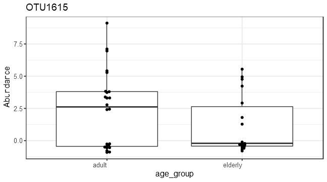
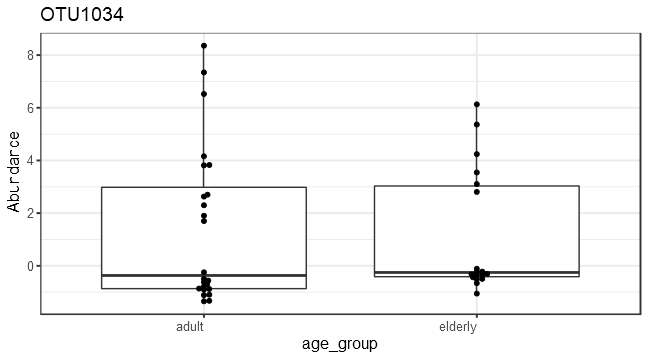
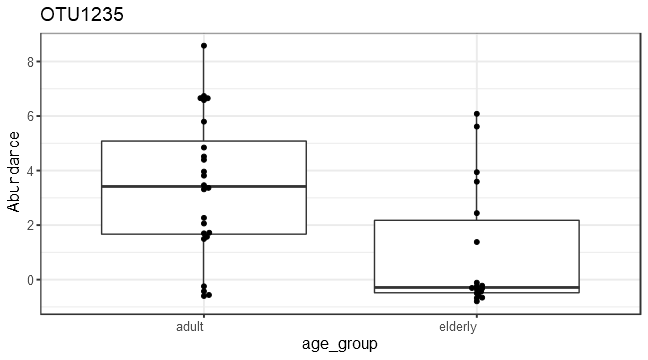

```
## Error in age_group %in% middle_age: object 'middle_age' not found
```


# Alpha diversity analysis


# Group-wise comparisons
* Diversity index: diversity_shannon


# Ordination


## *Principal Coordinates Analysis (PCoA)*

* Ordination method: PCoA
* Dissimilarity measure: jaccard


| log2FoldChange|      padj|taxon   |full_name                                                                                     |
|--------------:|---------:|:-------|:---------------------------------------------------------------------------------------------|
|       4.409486| 0.0000710|OTU2172 |Bacteria_Firmicutes_Bacilli_Bacillales_Staphylococcaceae_Staphylococcus                       |
|       4.115713| 0.0373707|OTU526  |Bacteria_Actinobacteria_Actinobacteria_Micrococcales_Brevibacteriaceae_Brevibacterium         |
|      -4.663037| 0.0395826|OTU1615 |Bacteria_Proteobacteria_Alphaproteobacteria_Rickettsiales_Rickettsieae_Orientia               |
|      -3.552830| 0.0395826|OTU1216 |Bacteria_Firmicutes_Clostridia_Clostridiales_NA_Intestinimonas                                |
|      -4.726481| 0.0791696|OTU1034 |Bacteria_Firmicutes_Tissierellia_Tissierellales_Peptoniphilaceae_Finegoldia                   |
|      -4.056330| 0.0791696|OTU1275 |Bacteria_Actinobacteria_Actinobacteria_Micrococcales_Micrococcaceae_Kocuria                   |
|      -3.663688| 0.0791696|OTU506  |Bacteria_Actinobacteria_Actinobacteria_Micrococcales_Dermabacteraceae_Brachybacterium         |
|       3.154956| 0.0791696|OTU520  |Bacteria_Firmicutes_Bacilli_Bacillales_Paenibacillaceae_Brevibacillus                         |
|      -2.320629| 0.0791696|OTU1075 |Bacteria_Firmicutes_Bacilli_Bacillales_Bacillaceae_Geobacillus                                |
|      -2.178167| 0.0791696|OTU2529 |Bacteria_Firmicutes_Bacilli_Bacillales_Bacillaceae_Virgibacillus                              |
|      -4.460480| 0.0865141|OTU806  |Bacteria_Bacteroidetes_Flavobacteriia_Flavobacteriales_Flavobacteriaceae_Cruoricaptor         |
|      -2.818331| 0.0865141|OTU194  |Bacteria_Firmicutes_Tissierellia_Tissierellales_Peptoniphilaceae_Anaerococcus                 |
|      -2.209939| 0.0873311|OTU1235 |Bacteria_Firmicutes_Bacilli_Bacillales_Staphylococcaceae_Jeotgalicoccus                       |
|      -2.753443| 0.1228004|OTU1893 |Bacteria_Proteobacteria_Gammaproteobacteria_Pseudomonadales_Pseudomonadaceae_Pseudomonas      |
|      -3.286556| 0.1975766|OTU1165 |Bacteria_Proteobacteria_Gammaproteobacteria_Oceanospirillales_Halomonadaceae_Halomonas        |
|      -3.710108| 0.2310188|OTU540  |Bacteria_Actinobacteria_Actinobacteria_Propionibacteriales_Propionibacteriaceae_Brooklawnia   |
|       5.565926| 0.2464619|OTU1117 |Bacteria_Actinobacteria_Actinobacteria_Micrococcales_Microbacteriaceae_Gulosibacter           |
|      -5.289879| 0.2464619|OTU2201 |Bacteria_Proteobacteria_Gammaproteobacteria_Xanthomonadales_Xanthomonadaceae_Stenotrophomonas |
|      -3.409880| 0.2464619|OTU179  |Bacteria_Proteobacteria_Gammaproteobacteria_Oceanospirillales_Oceanospirillaceae_Amphritea    |
|      -2.540264| 0.2464619|OTU1472 |Bacteria_Actinobacteria_Actinobacteria_Micrococcales_Microbacteriaceae_Micrococcus            |
|      -1.712826| 0.2464619|OTU251  |Bacteria_Actinobacteria_Actinobacteria_Micrococcales_Micrococcaceae_Arthrobacter              |



#PERMANOVA analysis

```r
library(microbiome)
library(ggplot2)
library(dplyr)

pseq <- Q
data = microbiome::meta(Q)
# Pick relative abundances (compositional) and sample metadata 
pseq.rel <- microbiome::transform(pseq, "compositional")
otu <- abundances(pseq.rel)
meta <- meta(pseq.rel)
library(vegan)
library(phyloseq)
permanova <- adonis(t(otu) ~ age_group,
               data = meta(Q), permutations=99, method = "bray")

# P-value
print(as.data.frame(permanova$aov.tab)["age_group", "Pr(>F)"])
```

```
## [1] 0.03
```

```r
dist <- vegdist(t(otu))
anova(betadisper(dist, meta$age_group))
```

```
## Analysis of Variance Table
## 
## Response: Distances
##           Df  Sum Sq  Mean Sq F value Pr(>F)
## Groups     1 0.02098 0.020976  0.8447 0.3636
## Residuals 40 0.99324 0.024831
```

# Investigate the top factors


```r
library(vegan)
coef <- coefficients(permanova)["age_group1", ]
top.coef <- coef[rev(order(abs(coef)))[1:20]]
names(top.coef) <- full.names[names(top.coef)]
par(mar = c(3, 14, 2, 1))
barplot(sort(top.coef), horiz = T, las = 1, main = "Top taxa / 1")
```


```

Note that the `echo = FALSE` parameter was added to the code chunk to prevent printing of the R code that generated the plot.
