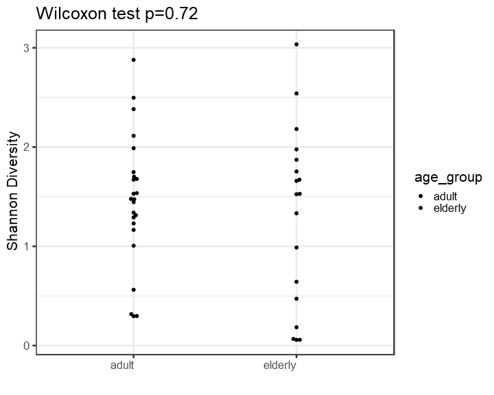
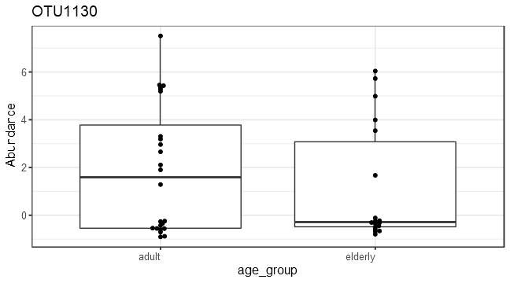
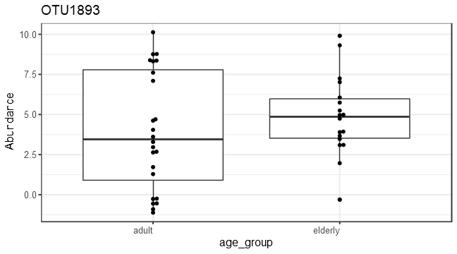
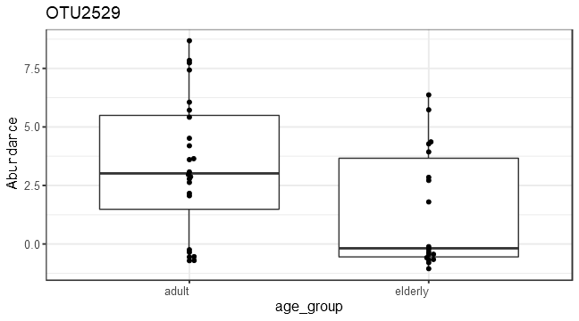

```
## phyloseq-class experiment-level object
## otu_table()   OTU Table:         [ 674 taxa and 16 samples ]
## sample_data() Sample Data:       [ 16 samples by 13 sample variables ]
## tax_table()   Taxonomy Table:    [ 674 taxa by 6 taxonomic ranks ]
```
# Alpha diversity analysis


# Group-wise comparisons
* Diversity index: diversity_shannon




# Ordination


## *Principal Coordinates Analysis (PCoA)*

* Ordination method: PCoA
* Dissimilarity measure: jaccard


| log2FoldChange|      padj|taxon   |full_name                                                                                        |
|--------------:|---------:|:-------|:------------------------------------------------------------------------------------------------|
|       4.548054| 0.0000358|OTU2172 |Bacteria_Firmicutes_Bacilli_Bacillales_Staphylococcaceae_Staphylococcus                          |
|       4.193210| 0.0365749|OTU526  |Bacteria_Actinobacteria_Actinobacteria_Micrococcales_Brevibacteriaceae_Brevibacterium            |
|      -4.801004| 0.0400515|OTU1615 |Bacteria_Proteobacteria_Alphaproteobacteria_Rickettsiales_Rickettsieae_Orientia                  |
|      -3.635654| 0.0400515|OTU1216 |Bacteria_Firmicutes_Clostridia_Clostridiales_NA_Intestinimonas                                   |
|      -4.200172| 0.0682206|OTU1130 |Bacteria_Proteobacteria_Deltaproteobacteria_Myxococcales_Kofleriaceae_Haliangium                 |
|      -4.562412| 0.0997216|OTU1034 |Bacteria_Firmicutes_Tissierellia_Tissierellales_Peptoniphilaceae_Finegoldia                      |
|      -4.393058| 0.0997216|OTU806  |Bacteria_Bacteroidetes_Flavobacteriia_Flavobacteriales_Flavobacteriaceae_Cruoricaptor            |
|      -4.006487| 0.0997216|OTU1275 |Bacteria_Actinobacteria_Actinobacteria_Micrococcales_Micrococcaceae_Kocuria                      |
|      -3.592363| 0.0997216|OTU506  |Bacteria_Actinobacteria_Actinobacteria_Micrococcales_Dermabacteraceae_Brachybacterium            |
|       3.297079| 0.0997216|OTU520  |Bacteria_Firmicutes_Bacilli_Bacillales_Paenibacillaceae_Brevibacillus                            |
|      -2.965051| 0.0997216|OTU1893 |Bacteria_Proteobacteria_Gammaproteobacteria_Pseudomonadales_Pseudomonadaceae_Pseudomonas         |
|      -2.962616| 0.0997216|OTU194  |Bacteria_Firmicutes_Tissierellia_Tissierellales_Peptoniphilaceae_Anaerococcus                    |
|      -2.195100| 0.0997216|OTU1075 |Bacteria_Firmicutes_Bacilli_Bacillales_Bacillaceae_Geobacillus                                   |
|      -2.079609| 0.0997216|OTU2529 |Bacteria_Firmicutes_Bacilli_Bacillales_Bacillaceae_Virgibacillus                                 |
|      -1.945307| 0.0997216|OTU1585 |Bacteria_Firmicutes_Bacilli_Bacillales_Bacillaceae_Oceanobacillus                                |
|      -2.130483| 0.1167806|OTU1235 |Bacteria_Firmicutes_Bacilli_Bacillales_Staphylococcaceae_Jeotgalicoccus                          |
|      -3.648780| 0.1217426|OTU1165 |Bacteria_Proteobacteria_Gammaproteobacteria_Oceanospirillales_Halomonadaceae_Halomonas           |
|      -2.175555| 0.2076876|OTU876  |Bacteria_Proteobacteria_Deltaproteobacteria_DesulfoVibrionales_Desulfovibrionaceae_Desulfovibrio |



#PERMANOVA analysis

```r
library(microbiome)
library(ggplot2)
library(dplyr)

pseq <- Q
data = microbiome::meta(Q)
# Pick relative abundances (compositional) and sample metadata 
pseq.rel <- microbiome::transform(pseq, "compositional")
otu <- abundances(pseq.rel)
meta <- meta(pseq.rel)
library(vegan)
library(phyloseq)
permanova <- adonis(t(otu) ~ Age,
               data = meta(Q), permutations=99, method = "bray")

# P-value
print(as.data.frame(permanova$aov.tab)["Age", "Pr(>F)"])
```

```
## [1] 0.01
```

```r
dist <- vegdist(t(otu))
anova(betadisper(dist, meta$Age))
```

```
## Analysis of Variance Table
## 
## Response: Distances
##           Df  Sum Sq  Mean Sq F value Pr(>F)
## Groups     1 0.02875 0.028748   1.089  0.303
## Residuals 40 1.05594 0.026399
```

# Investigate the top factors


```r
library(vegan)
coef <- coefficients(permanova)["Age1", ]
top.coef <- coef[rev(order(abs(coef)))[1:20]]
names(top.coef) <- full.names[names(top.coef)]
par(mar = c(3, 14, 2, 1))
barplot(sort(top.coef), horiz = T, las = 1, main = "Top taxa / 1")
```


```

Note that the `echo = FALSE` parameter was added to the code chunk to prevent printing of the R code that generated the plot.
