Alpha diversity analysis
========================

Group-wise comparisons
======================

-   Diversity index: diversity\_shannon

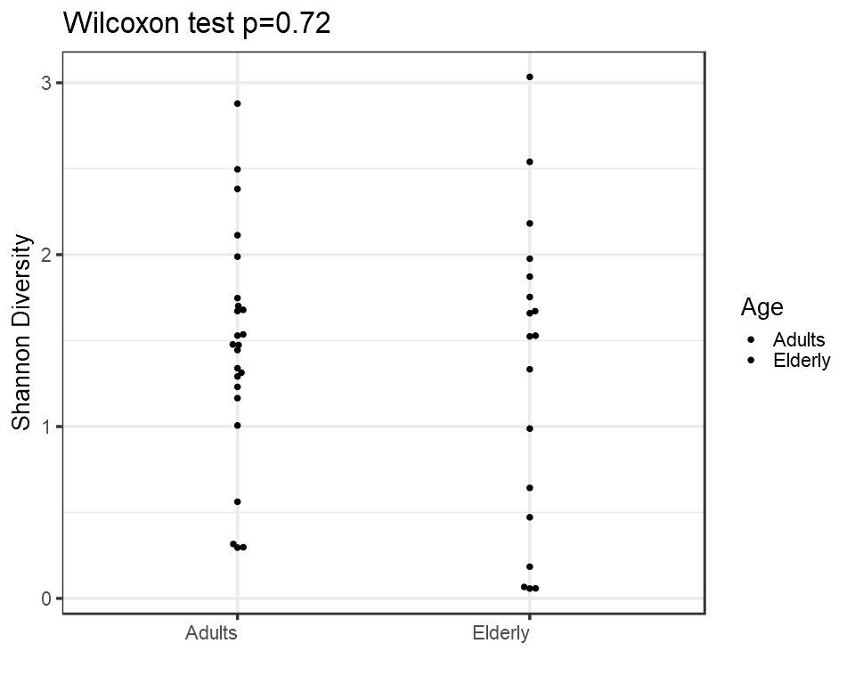

Ordination
==========

*Principal Coordinates Analysis (PCoA)*
---------------------------------------

-   Ordination method: PCoA
-   Dissimilarity measure: jaccard

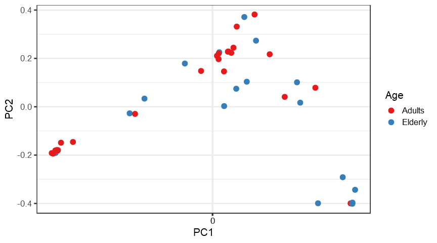

DESeq2 analysis
---------------

<table>
<thead>
<tr class="header">
<th align="left"></th>
<th align="right">baseMean</th>
<th align="right">log2FoldChange</th>
<th align="right">lfcSE</th>
<th align="right">stat</th>
<th align="right">pvalue</th>
<th align="right">padj</th>
<th align="left">taxon</th>
</tr>
</thead>
<tbody>
<tr class="odd">
<td align="left">sp273</td>
<td align="right">6.025284</td>
<td align="right">5.565926</td>
<td align="right">2.9384439</td>
<td align="right">1.894175</td>
<td align="right">0.0582018</td>
<td align="right">0.2464619</td>
<td align="left">sp273</td>
</tr>
<tr class="even">
<td align="left">sp585</td>
<td align="right">8.379781</td>
<td align="right">-5.289879</td>
<td align="right">2.9135047</td>
<td align="right">-1.815641</td>
<td align="right">0.0694254</td>
<td align="right">0.2464619</td>
<td align="left">sp585</td>
</tr>
<tr class="odd">
<td align="left">sp233</td>
<td align="right">29.102808</td>
<td align="right">-4.726481</td>
<td align="right">1.7938617</td>
<td align="right">-2.634808</td>
<td align="right">0.0084185</td>
<td align="right">0.0791696</td>
<td align="left">sp233</td>
</tr>
<tr class="even">
<td align="left">sp434</td>
<td align="right">31.299241</td>
<td align="right">-4.663037</td>
<td align="right">1.5208505</td>
<td align="right">-3.066072</td>
<td align="right">0.0021689</td>
<td align="right">0.0395826</td>
<td align="left">sp434</td>
</tr>
<tr class="odd">
<td align="left">sp165</td>
<td align="right">11.532097</td>
<td align="right">-4.460480</td>
<td align="right">1.8194014</td>
<td align="right">-2.451620</td>
<td align="right">0.0142215</td>
<td align="right">0.0865141</td>
<td align="left">sp165</td>
</tr>
<tr class="even">
<td align="left">sp584</td>
<td align="right">6608.082091</td>
<td align="right">4.409486</td>
<td align="right">0.9004040</td>
<td align="right">4.897231</td>
<td align="right">0.0000010</td>
<td align="right">0.0000710</td>
<td align="left">sp584</td>
</tr>
<tr class="odd">
<td align="left">sp113</td>
<td align="right">33.819774</td>
<td align="right">4.115713</td>
<td align="right">1.2533047</td>
<td align="right">3.283889</td>
<td align="right">0.0010239</td>
<td align="right">0.0373707</td>
<td align="left">sp113</td>
</tr>
<tr class="even">
<td align="left">sp330</td>
<td align="right">6.976166</td>
<td align="right">-4.056330</td>
<td align="right">1.5248507</td>
<td align="right">-2.660149</td>
<td align="right">0.0078106</td>
<td align="right">0.0791696</td>
<td align="left">sp330</td>
</tr>
<tr class="odd">
<td align="left">sp116</td>
<td align="right">16.435211</td>
<td align="right">-3.710108</td>
<td align="right">1.8981742</td>
<td align="right">-1.954567</td>
<td align="right">0.0506343</td>
<td align="right">0.2310188</td>
<td align="left">sp116</td>
</tr>
<tr class="even">
<td align="left">sp109</td>
<td align="right">6.515707</td>
<td align="right">-3.663688</td>
<td align="right">1.4380663</td>
<td align="right">-2.547649</td>
<td align="right">0.0108452</td>
<td align="right">0.0791696</td>
<td align="left">sp109</td>
</tr>
<tr class="odd">
<td align="left">sp310</td>
<td align="right">23.401404</td>
<td align="right">-3.552830</td>
<td align="right">1.1546760</td>
<td align="right">-3.076906</td>
<td align="right">0.0020916</td>
<td align="right">0.0395826</td>
<td align="left">sp310</td>
</tr>
<tr class="even">
<td align="left">sp61</td>
<td align="right">5.399356</td>
<td align="right">-3.409880</td>
<td align="right">1.8879613</td>
<td align="right">-1.806118</td>
<td align="right">0.0709000</td>
<td align="right">0.2464619</td>
<td align="left">sp61</td>
</tr>
<tr class="odd">
<td align="left">sp288</td>
<td align="right">38.051162</td>
<td align="right">-3.286556</td>
<td align="right">1.6050669</td>
<td align="right">-2.047613</td>
<td align="right">0.0405979</td>
<td align="right">0.1975766</td>
<td align="left">sp288</td>
</tr>
<tr class="even">
<td align="left">sp111</td>
<td align="right">55.853187</td>
<td align="right">3.154956</td>
<td align="right">1.2329808</td>
<td align="right">2.558804</td>
<td align="right">0.0105033</td>
<td align="right">0.0791696</td>
<td align="left">sp111</td>
</tr>
<tr class="odd">
<td align="left">sp65</td>
<td align="right">256.416641</td>
<td align="right">-2.818331</td>
<td align="right">1.1390553</td>
<td align="right">-2.474271</td>
<td align="right">0.0133508</td>
<td align="right">0.0865141</td>
<td align="left">sp65</td>
</tr>
<tr class="even">
<td align="left">sp504</td>
<td align="right">401.585681</td>
<td align="right">-2.753443</td>
<td align="right">1.2159809</td>
<td align="right">-2.264380</td>
<td align="right">0.0235508</td>
<td align="right">0.1228004</td>
<td align="left">sp504</td>
</tr>
<tr class="odd">
<td align="left">sp393</td>
<td align="right">88.400193</td>
<td align="right">-2.540264</td>
<td align="right">1.3647704</td>
<td align="right">-1.861312</td>
<td align="right">0.0627001</td>
<td align="right">0.2464619</td>
<td align="left">sp393</td>
</tr>
<tr class="even">
<td align="left">sp254</td>
<td align="right">11.664404</td>
<td align="right">-2.320629</td>
<td align="right">0.8996088</td>
<td align="right">-2.579598</td>
<td align="right">0.0098915</td>
<td align="right">0.0791696</td>
<td align="left">sp254</td>
</tr>
<tr class="odd">
<td align="left">sp318</td>
<td align="right">4.160625</td>
<td align="right">-2.209939</td>
<td align="right">0.9134772</td>
<td align="right">-2.419260</td>
<td align="right">0.0155521</td>
<td align="right">0.0873311</td>
<td align="left">sp318</td>
</tr>
<tr class="even">
<td align="left">sp658</td>
<td align="right">4.648084</td>
<td align="right">-2.178167</td>
<td align="right">0.8446638</td>
<td align="right">-2.578738</td>
<td align="right">0.0099162</td>
<td align="right">0.0791696</td>
<td align="left">sp658</td>
</tr>
<tr class="odd">
<td align="left">sp83</td>
<td align="right">15.367931</td>
<td align="right">-1.712826</td>
<td align="right">0.9328114</td>
<td align="right">-1.836198</td>
<td align="right">0.0663284</td>
<td align="right">0.2464619</td>
<td align="left">sp83</td>
</tr>
</tbody>
</table>

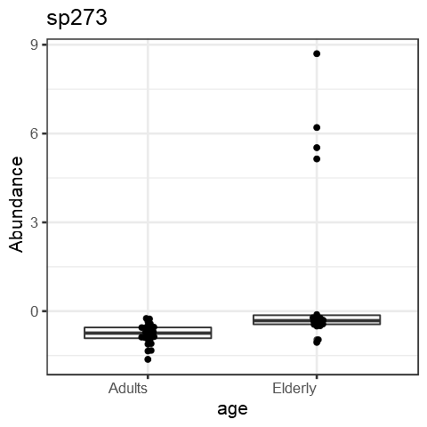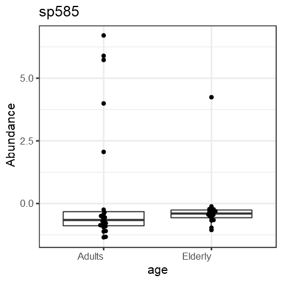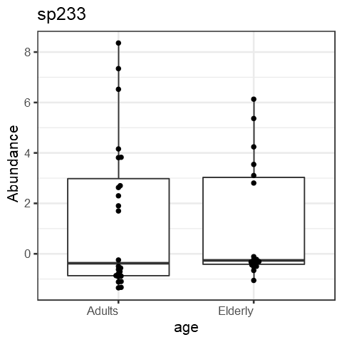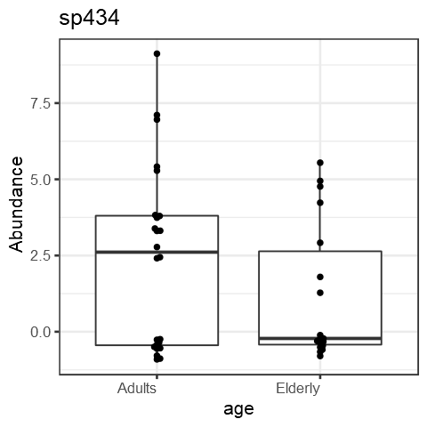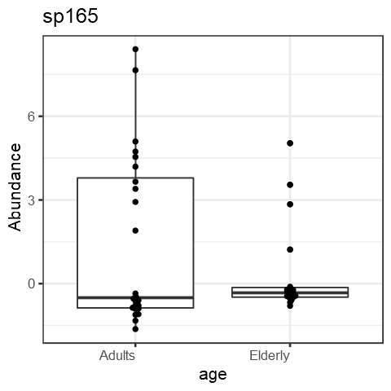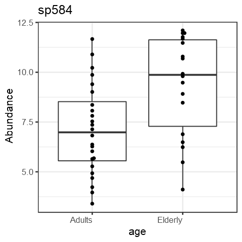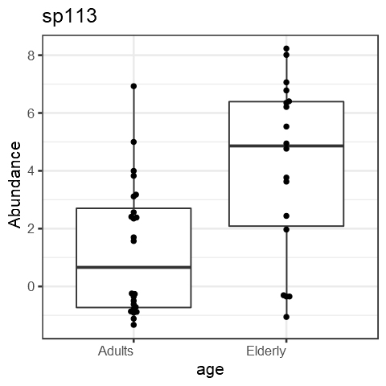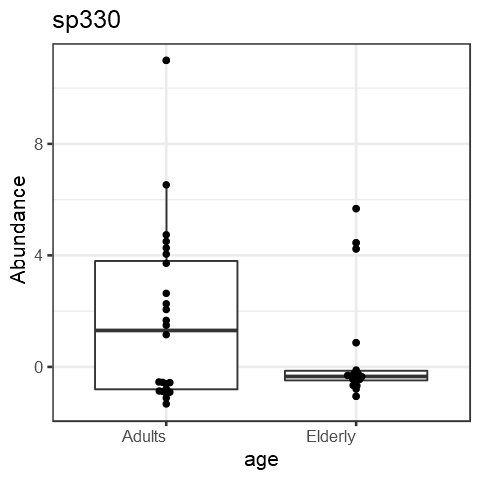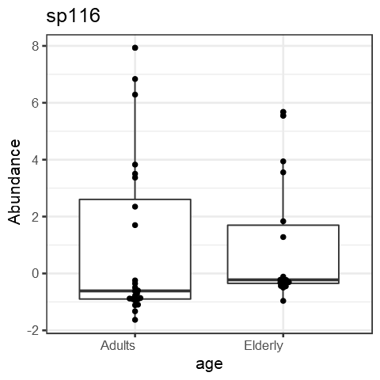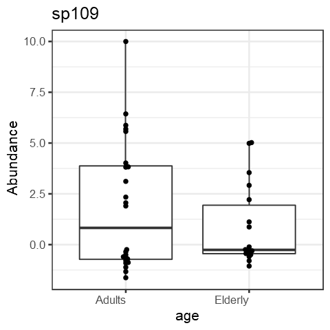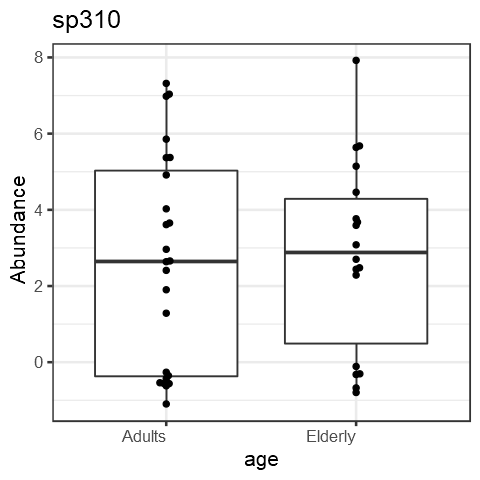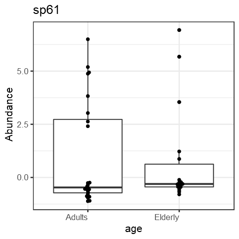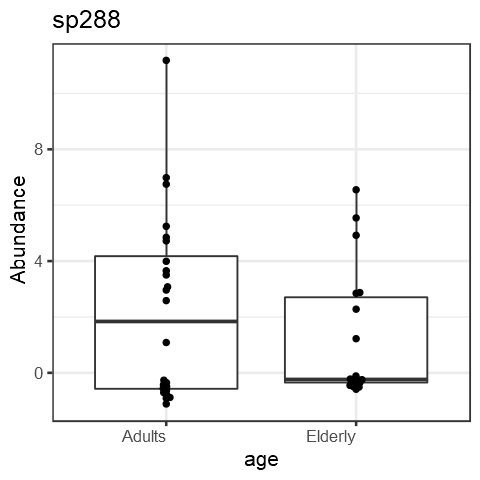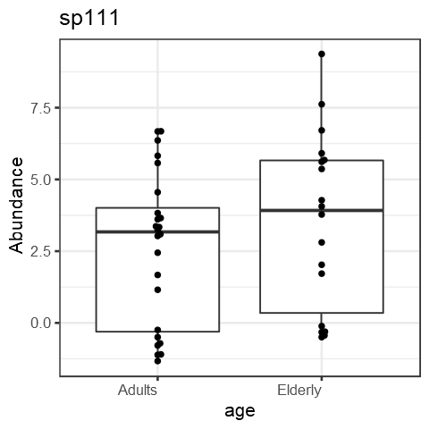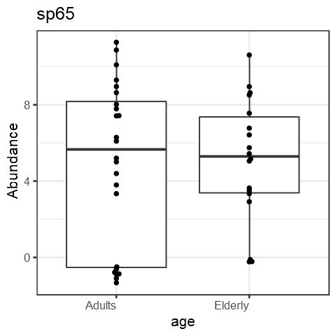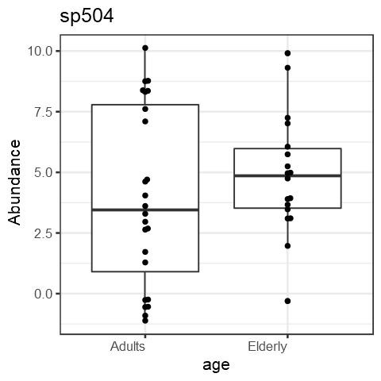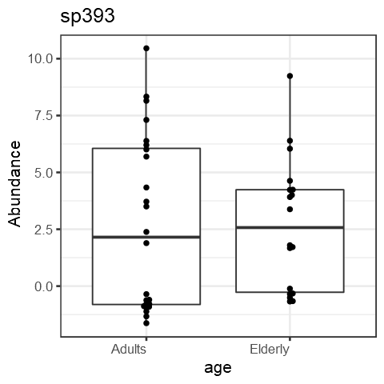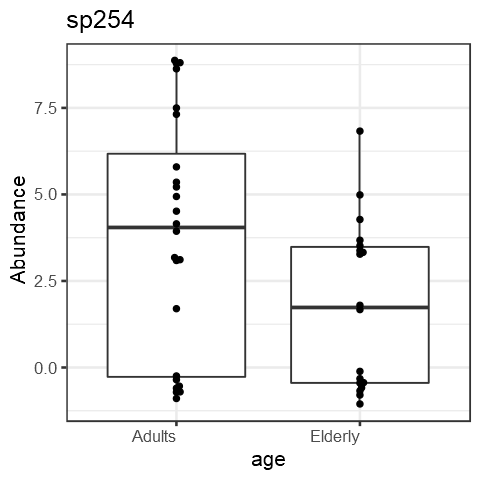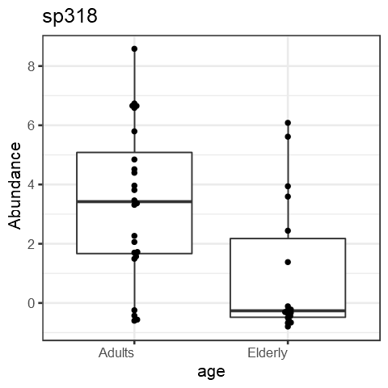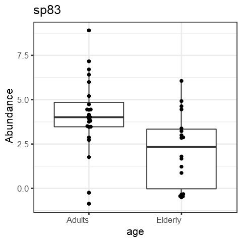
