    ## Warning: package 'ggplot2' was built under R version 3.6.3

    ## Warning: package 'igraph' was built under R version 3.6.3

    ## Warning: package 'markovchain' was built under R version 3.6.3

    ## Warning: package 'gridExtra' was built under R version 3.6.3

    ## Warning: package 'tidyr' was built under R version 3.6.3

    ## Warning: package 'dplyr' was built under R version 3.6.3

Cluster into CSTs
=================

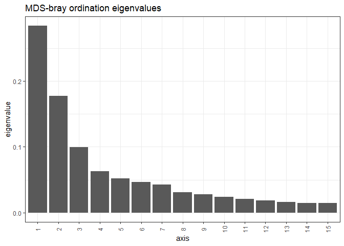

    ##  [1] 5.9840548 3.7404996 2.0896780 1.3230250 1.1019674 0.9766566 0.9021602 0.6464166 0.5868130 0.5087633 0.4418356 0.3914422 0.3474311 0.3149250 0.3031454
    ## [16] 0.2890737 0.2568495 0.2294809 0.2250794 0.2010400

    ## [1] -0.05442782 -0.06150271 -0.07856958 -0.09270186 -0.10894815 -0.12931259

Denoise distance matrix
-----------------------

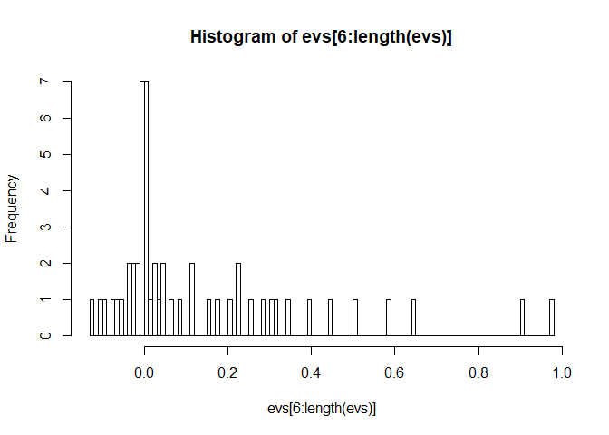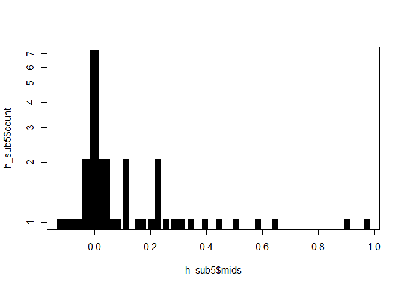

Determine number of clusters
----------------------------

We will use the gap statistic to indicate the number of clusters in this
data:

    ## Clustering k = 1,2,..., K.max (= 12): .. done
    ## Bootstrapping, b = 1,2,..., B (= 50)  [one "." per sample]:
    ## .................................................. 50

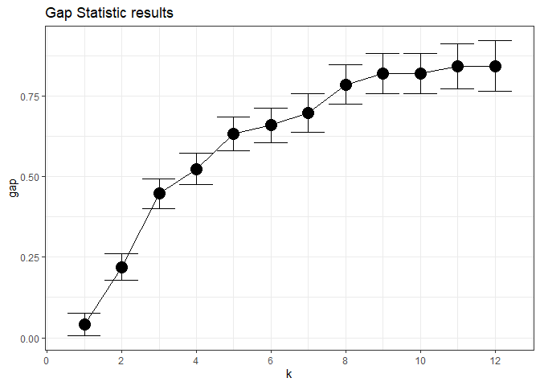

Cluster into CSTs
-----------------

Perform PAM K-fold clusters and assess significance of CST vs. location
(p-value)

    ## 
    ##  Fisher's Exact Test for Count Data
    ## 
    ## data:  table(sample_data(ps)[, c("CST", "Geographical_location")])
    ## p-value = 0.002411
    ## alternative hypothesis: two.sided

Evaluate clustering
-------------------

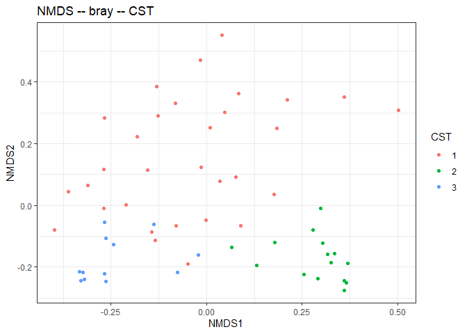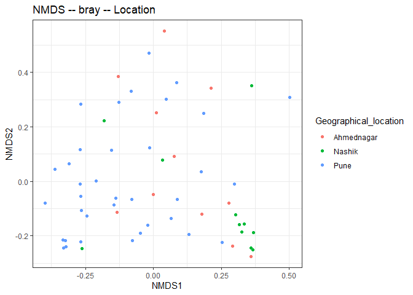

Principal Coordinates Analysis (PCoA)
=====================================

Coloured by CST community type

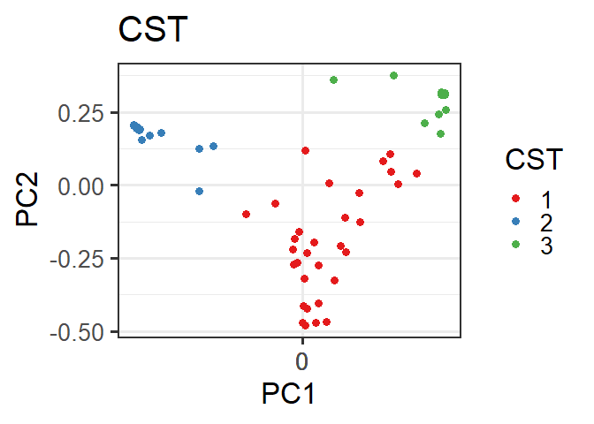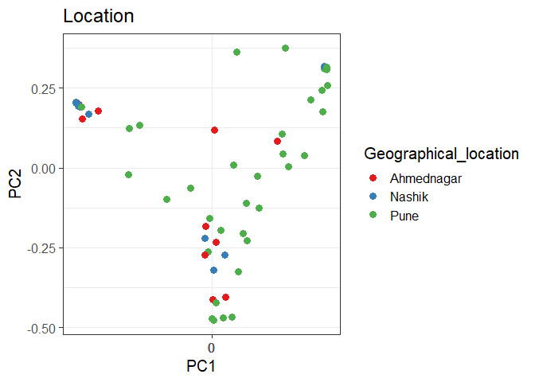

### Heatmap

Heatmaps for the community state types. The most different OTUs are
shown.

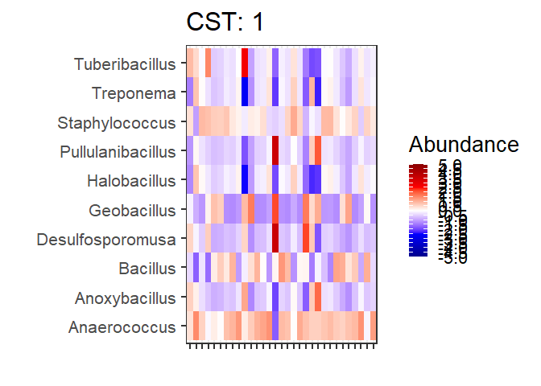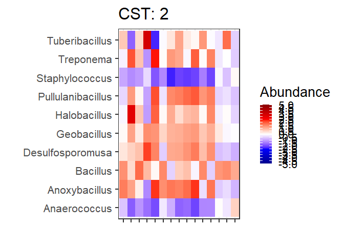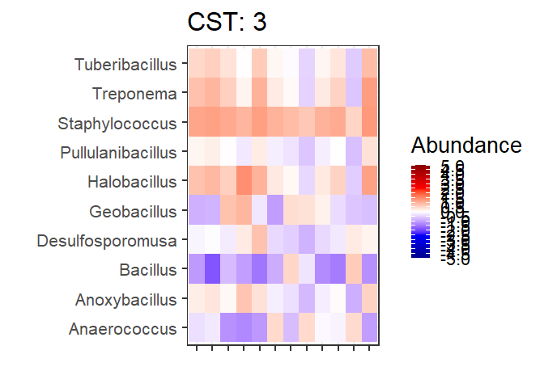

Table of full names for the heatmap taxa:

    ## Warning: package 'knitr' was built under R version 3.6.3

<table>
<colgroup>
<col width="9%" />
<col width="90%" />
</colgroup>
<thead>
<tr class="header">
<th align="left">ASV</th>
<th align="left">Full_name</th>
</tr>
</thead>
<tbody>
<tr class="odd">
<td align="left">OTU367</td>
<td align="left">Bacteria_Firmicutes_Bacilli_Bacillales_Bacillaceae_Bacillus</td>
</tr>
<tr class="even">
<td align="left">OTU2172</td>
<td align="left">Bacteria_Firmicutes_Bacilli_Bacillales_Staphylococcaceae_Staphylococcus</td>
</tr>
<tr class="odd">
<td align="left">OTU194</td>
<td align="left">Bacteria_Firmicutes_Tissierellia_Tissierellales_Peptoniphilaceae_Anaerococcus</td>
</tr>
<tr class="even">
<td align="left">OTU2398</td>
<td align="left">Bacteria_Firmicutes_Bacilli_Bacillales_Sporolactobacillaceae_Tuberibacillus</td>
</tr>
<tr class="odd">
<td align="left">OTU1137</td>
<td align="left">Bacteria_Firmicutes_Bacilli_Bacillales_Bacillaceae_Halobacillus</td>
</tr>
<tr class="even">
<td align="left">OTU1075</td>
<td align="left">Bacteria_Firmicutes_Bacilli_Bacillales_Bacillaceae_Geobacillus</td>
</tr>
<tr class="odd">
<td align="left">OTU2390</td>
<td align="left">Bacteria_Spirochaetes_Spirochaetia_Spirochaetales_Spirochaetaceae_Treponema</td>
</tr>
<tr class="even">
<td align="left">OTU1980</td>
<td align="left">Bacteria_Firmicutes_Bacilli_Bacillales_Sporolactobacillaceae_Pullulanibacillus</td>
</tr>
<tr class="odd">
<td align="left">OTU860</td>
<td align="left">Bacteria_Firmicutes_Negativicutes_Selenomonadales_Sporomusaceae_Desulfosporomusa</td>
</tr>
<tr class="even">
<td align="left">OTU211</td>
<td align="left">Bacteria_Firmicutes_Bacilli_Bacillales_Bacillaceae_Anoxybacillus</td>
</tr>
</tbody>
</table>
