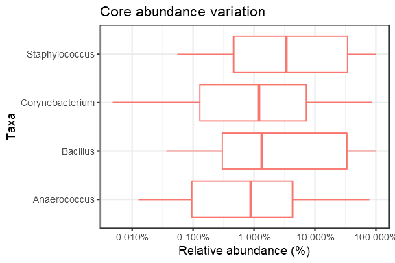
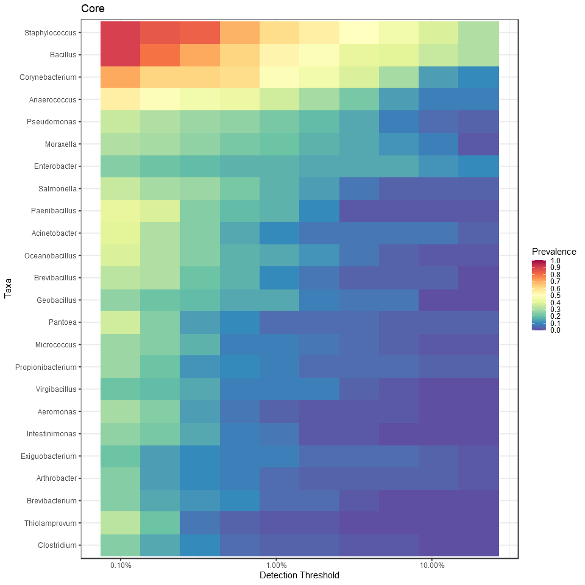

Core microbiota.
================

Core microbiota is here defined based on the following parameters:

-   Detection threshold (relative abundance): 0.1%
-   Prevalence threshold (above threshold in the population) 50%.

The following taxonomic groups are in the core microbiota. Mean relative
abundance and population prevalence (above detection threshold) are
shown.

Core phyla.

<table>
<thead>
<tr class="header">
<th align="left">Taxon</th>
<th align="right">Relative abundance (%)</th>
<th align="right">Prevalence (%)</th>
</tr>
</thead>
<tbody>
<tr class="odd">
<td align="left">Staphylococcus</td>
<td align="right">23.2</td>
<td align="right">89.7</td>
</tr>
<tr class="even">
<td align="left">Bacillus</td>
<td align="right">21.7</td>
<td align="right">89.7</td>
</tr>
<tr class="odd">
<td align="left">Corynebacterium</td>
<td align="right">7.1</td>
<td align="right">70.7</td>
</tr>
<tr class="even">
<td align="left">Anaerococcus</td>
<td align="right">5.8</td>
<td align="right">55.2</td>
</tr>
</tbody>
</table>

Abundance variation across samples for each core taxa.

Core with varying detection and prevalence thresholds.

