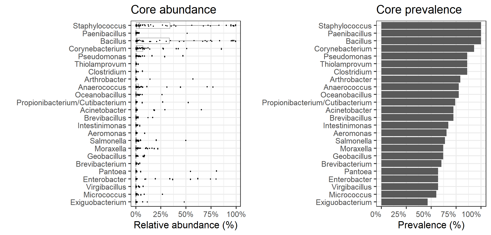

# Core microbiota.

Core microbiota is here defined based on the following parameters:

-   Detection threshold (relative abundance): 0.1%
-   Prevalence threshold (above threshold in the population) 20%.

The following taxonomic groups are in the core genera. Mean relative
abundance and population prevalence (above detection threshold) are
shown.

Phylum abundance table (relative abundance % and prevalance):

<table>
<thead>
<tr class="header">
<th style="text-align: left;">Taxon</th>
<th style="text-align: right;">Mean Relative abundance (%)</th>
<th style="text-align: right;">Prevalence (%)</th>
<th style="text-align: right;">Standard deviation</th>
</tr>
</thead>
<tbody>
<tr class="odd">
<td style="text-align: left;">Firmicutes</td>
<td style="text-align: right;">59.8</td>
<td style="text-align: right;">100.0</td>
<td style="text-align: right;">0.37</td>
</tr>
<tr class="even">
<td style="text-align: left;">Proteobacteria</td>
<td style="text-align: right;">24.4</td>
<td style="text-align: right;">94.8</td>
<td style="text-align: right;">0.33</td>
</tr>
<tr class="odd">
<td style="text-align: left;">Actinobacteria</td>
<td style="text-align: right;">15.4</td>
<td style="text-align: right;">96.6</td>
<td style="text-align: right;">0.24</td>
</tr>
</tbody>
</table>

# Genus abundance table (relative abundance % and prevalance):

    ##                   Genus mean prevalence   sd
    ##   1:     Staphylococcus 23.2      100.0 0.34
    ##   2:           Bacillus 21.7      100.0 0.33
    ##   3:    Corynebacterium  7.1       93.1 0.15
    ##   4:       Enterobacter  6.6       56.9 0.18
    ##   5:       Anaerococcus  5.8       77.6 0.16
    ##   6:            Pantoea  2.5       56.9 0.13
    ##   7:      Acinetobacter  2.4       72.4 0.10
    ##   8:        Pseudomonas  2.3       86.2 0.07
    ##   9:          Moraxella  2.0       62.1 0.05
    ##  10:         Salmonella  1.7       63.8 0.07
    ##  11: Cellulosimicrobium  1.6        1.7 0.12
    ##  12:  Propionibacterium  1.6       74.1 0.08
    ##  13:          Halomonas  1.5       50.0 0.10
    ##  14:       Arthrobacter  1.3       79.3 0.08
    ##  15:      Paenibacillus  1.3      100.0 0.07
    ##  16:            Kocuria  1.2       43.1 0.08
    ##  17:    Exiguobacterium  1.2       46.6 0.07
    ##  18:     Oceanobacillus  1.0       77.6 0.04
    ##  19:      Psychrobacter  0.9       39.7 0.06
    ##  20:        Micrococcus  0.8       55.2 0.04
    ##  ---                                        
    ## 654:       Sandaracinus  0.0        6.9 0.00
    ## 655:       Peredibacter  0.0        3.4 0.00
    ## 656:      Bacteriovorax  0.0        5.2 0.00
    ## 657:       Bdellovibrio  0.0        6.9 0.00
    ## 658:  Bdellovibrionales  0.0       13.8 0.00
    ## 659:           Azomonas  0.0       15.5 0.00
    ## 660:      Mariprofundus  0.0        5.2 0.00
    ## 661:        Spirochaeta  0.0        6.9 0.00
    ## 662:          Treponema  0.0       13.8 0.00
    ## 663:        Aminivibrio  0.0       12.1 0.00
    ## 664:     Aminobacterium  0.0        6.9 0.00
    ## 665:        Thermovirga  0.0        3.4 0.00
    ## 666:     Asteroleplasma  0.0       12.1 0.00
    ## 667:       Entomoplasma  0.0        6.9 0.00
    ## 668:        Spiroplasma  0.0        5.2 0.00
    ## 669:         Mycoplasma  0.0       60.3 0.00
    ## 670:       Pelagicoccus  0.0        5.2 0.00
    ## 671:          bacterium  0.0       15.5 0.00
    ## 672: Verrucomicrobiales  0.0        8.6 0.00
    ## 673:            Cucumis  0.0        1.7 0.00

# Relative abundance and prevalance for most prevalnet genera

