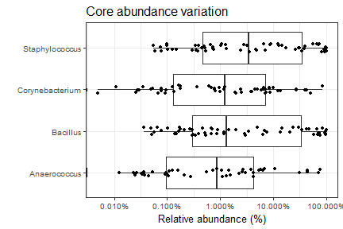

# Core microbiota.

Core microbiota is here defined based on the following parameters:

  * Detection threshold (relative abundance): 0.1%
  * Prevalence threshold (above threshold in the population) 50%.

The following taxonomic groups are in the core microbiota. Mean relative abundance and population prevalence (above detection threshold) are shown.

Core phyla.

|Taxon           | Relative abundance (%)| Prevalence (%)|
|:---------------|----------------------:|--------------:|
|Staphylococcus  |                   23.2|           89.7|
|Bacillus        |                   21.7|           89.7|
|Corynebacterium |                    7.1|           70.7|
|Anaerococcus    |                    5.8|           55.2|
Abundance variation across samples for each core taxa.

Core with varying detection and prevalence thresholds.

##Phylum abundance distributions

Abundance-prevalence plot per Phylum.

Phylum abundance table (relative abundance %):
  

|phylum                     | mean| median| min|  max|
|:--------------------------|----:|------:|---:|----:|
|Firmicutes                 | 59.8|   75.1| 0.8| 99.7|
|Proteobacteria             | 24.4|    8.7| 0.0| 96.7|
|Actinobacteria             | 15.4|    3.5| 0.1| 96.2|
|Bacteroidetes              |  0.2|    0.0| 0.0|  4.8|
|NA                         |  0.1|    0.0| 0.0|  4.8|
|Acidobacteria              |  0.0|    0.0| 0.0|  0.0|
|Caldiserica                |  0.0|    0.0| 0.0|  0.0|
|Candidatus Melainabacteria |  0.0|    0.0| 0.0|  0.0|
|Chlamydiae                 |  0.0|    0.0| 0.0|  0.0|
|Chloroflexi                |  0.0|    0.0| 0.0|  0.1|
|Chlorophyta                |  0.0|    0.0| 0.0|  0.1|
|Coprothermobacterota       |  0.0|    0.0| 0.0|  0.0|
|Cyanobacteria              |  0.0|    0.0| 0.0|  0.1|
|Deinococcus-Thermus        |  0.0|    0.0| 0.0|  0.0|
|Fibrobacteres              |  0.0|    0.0| 0.0|  0.7|
|Gemmatimonadetes           |  0.0|    0.0| 0.0|  0.0|
|Ignavibacteriae            |  0.0|    0.0| 0.0|  0.0|
|Lentisphaerae              |  0.0|    0.0| 0.0|  0.0|
|Nitrospirae                |  0.0|    0.0| 0.0|  0.1|
|Pctinobacteria             |  0.0|    0.0| 0.0|  0.1|
|Planctomycetes             |  0.0|    0.0| 0.0|  0.2|
|Spirochaetes               |  0.0|    0.0| 0.0|  0.1|
|Synergistetes              |  0.0|    0.0| 0.0|  0.1|
|Tenericutes                |  0.0|    0.0| 0.0|  0.4|
|Verrucomicrobia            |  0.0|    0.0| 0.0|  0.1|
|Viridiplantae              |  0.0|    0.0| 0.0|  0.0|

