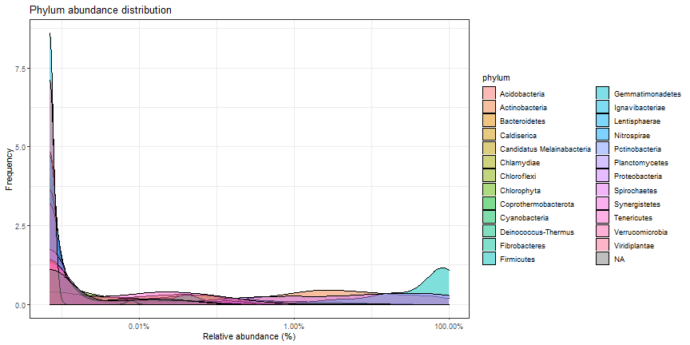

# Core microbiota.

Core microbiota is here defined based on the following parameters:

  * Detection threshold (relative abundance): 0.1%
  * Prevalence threshold (above threshold in the population) 50%.

The following taxonomic groups are in the core genera. Mean relative abundance and population prevalence (above detection threshold) are shown.

|Taxon           | Mean Relative abundance (%)| Median Relative abundance (%)| Prevalence (%)|
|:---------------|---------------------------:|-----------------------------:|--------------:|
|Staphylococcus  |                        23.2|                           3.4|           89.7|
|Bacillus        |                        21.7|                           1.3|           89.7|
|Corynebacterium |                         7.1|                           1.0|           70.7|
|Anaerococcus    |                         5.8|                           0.1|           55.2|
Abundance variation across samples for each core taxa.

Core with varying detection and prevalence thresholds.

# Phylum abundance distributions.

Abundance-prevalence plot per Phylum.

Phylum abundance table (relative abundance %):

|Taxon          | Mean Relative abundance (%)| Median Relative abundance (%)| Prevalence (%)|
|:--------------|---------------------------:|-----------------------------:|--------------:|
|Firmicutes     |                        59.8|                          75.1|          100.0|
|Proteobacteria |                        24.4|                           8.7|           94.8|
|Actinobacteria |                        15.4|                           3.5|           96.6|
