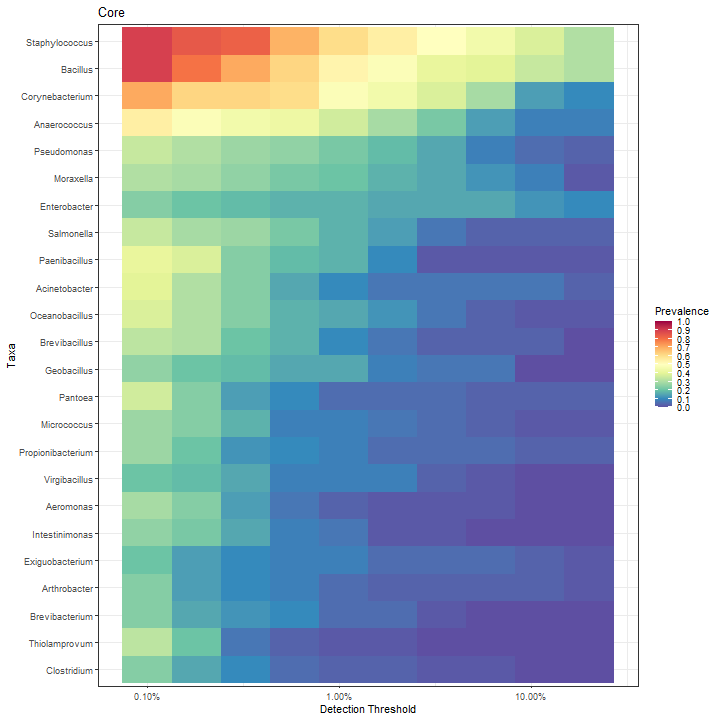

# Core microbiota.

Core microbiota is here defined based on the following parameters:

  * Detection threshold (relative abundance): 0.1%
  * Prevalence threshold (above threshold in the population) 50%.

The following taxonomic groups are in the core genera. Mean relative abundance and population prevalence (above detection threshold) are shown.


|Taxon           | Mean Relative abundance (%)| Median Relative abundance (%)| Prevalence (%)|
|:---------------|---------------------------:|-----------------------------:|--------------:|
|Staphylococcus  |                        23.2|                           3.4|           89.7|
|Bacillus        |                        21.7|                           1.3|           89.7|
|Corynebacterium |                         7.1|                           1.0|           70.7|
|Anaerococcus    |                         5.8|                           0.1|           55.2|


Abundance variation across samples for each core taxa.


Core with varying detection and prevalence thresholds.


# Phylum abundance distributions

Abundance-prevalence plot per Phylum.


Phylum abundance table (relative abundance %):


|Taxon          | Mean Relative abundance (%)| Median Relative abundance (%)| Prevalence (%)|
|:--------------|---------------------------:|-----------------------------:|--------------:|
|Firmicutes     |                        59.8|                          75.1|          100.0|
|Proteobacteria |                        24.4|                           8.7|           94.8|
|Actinobacteria |                        15.4|                           3.5|           96.6|


|Genus                   | mean| median| min|  max| prevalence|
|:-----------------------|----:|------:|---:|----:|----------:|
|Staphylococcus          | 23.2|    3.4| 0.1| 99.3|      100.0|
|Bacillus                | 21.7|    1.3| 0.0| 99.3|      100.0|
|Corynebacterium         |  7.1|    1.0| 0.0| 85.0|       93.1|
|Enterobacter            |  6.6|    0.0| 0.0| 79.7|       56.9|
|Anaerococcus            |  5.8|    0.1| 0.0| 76.6|       77.6|
|Pantoea                 |  2.5|    0.0| 0.0| 80.2|       56.9|
|Acinetobacter           |  2.4|    0.0| 0.0| 65.2|       72.4|
|Pseudomonas             |  2.3|    0.0| 0.0| 46.8|       86.2|
|Moraxella               |  2.0|    0.0| 0.0| 21.8|       62.1|
|Salmonella              |  1.7|    0.0| 0.0| 49.7|       63.8|
|Cellulosimicrobium      |  1.6|    0.0| 0.0| 93.2|        1.7|
|Propionibacterium       |  1.6|    0.0| 0.0| 52.1|       74.1|
|Halomonas               |  1.5|    0.0| 0.0| 72.5|       50.0|
|Arthrobacter            |  1.3|    0.0| 0.0| 56.9|       79.3|
|Paenibacillus           |  1.3|    0.1| 0.0| 51.1|      100.0|
|Kocuria                 |  1.2|    0.0| 0.0| 64.5|       43.1|
|Exiguobacterium         |  1.2|    0.0| 0.0| 48.2|       46.6|
|Oceanobacillus          |  1.0|    0.0| 0.0| 26.0|       77.6|
|Psychrobacter           |  0.9|    0.0| 0.0| 47.7|       39.7|
|Micrococcus             |  0.8|    0.0| 0.0| 26.3|       55.2|
|Geobacillus             |  0.7|    0.0| 0.0|  8.5|       62.1|
|Brevibacillus           |  0.7|    0.0| 0.0| 16.7|       72.4|
|Streptococcus           |  0.6|    0.0| 0.0| 32.9|       34.5|
|Luteimonas              |  0.6|    0.0| 0.0| 31.0|        8.6|
|Brachybacterium         |  0.5|    0.0| 0.0| 26.6|       39.7|
|Virgibacillus           |  0.4|    0.0| 0.0|  7.2|       56.9|
|Orientia                |  0.4|    0.0| 0.0| 17.1|       51.7|
|Jeotgalicoccus          |  0.3|    0.0| 0.0| 10.1|       67.2|
|Enterococcus            |  0.3|    0.0| 0.0|  9.9|       29.3|
|Peptoniphilus           |  0.3|    0.0| 0.0|  7.6|       39.7|
|Aeromonas               |  0.3|    0.0| 0.0|  8.6|       65.5|
|Citrobacter             |  0.3|    0.0| 0.0| 13.5|       24.1|
|Brevibacterium          |  0.2|    0.0| 0.0|  3.9|       60.3|
|Bhargavaea              |  0.2|    0.0| 0.0| 14.3|       12.1|
|Clostridium             |  0.2|    0.0| 0.0|  6.6|       86.2|
|Intestinimonas          |  0.2|    0.0| 0.0|  3.9|       67.2|
|Cronobacter             |  0.2|    0.0| 0.0|  4.2|       29.3|
|Streptomyces            |  0.1|    0.0| 0.0|  2.1|       44.8|
|Gulosibacter            |  0.1|    0.0| 0.0|  6.6|        6.9|
|Zimmermannella          |  0.1|    0.0| 0.0|  2.4|       12.1|
|Rothia                  |  0.1|    0.0| 0.0|  3.1|       25.9|
|Brooklawnia             |  0.1|    0.0| 0.0|  2.4|       34.5|
|Cruoricaptor            |  0.1|    0.0| 0.0|  4.5|       31.0|
|Massilibacterium        |  0.1|    0.0| 0.0|  1.3|       75.9|
|Pseudogracilibacillus   |  0.1|    0.0| 0.0|  1.2|       24.1|
|Salinibacillus          |  0.1|    0.0| 0.0|  1.5|       36.2|
|Pullulanibacillus       |  0.1|    0.0| 0.0|  0.8|       19.0|
|Salinicoccus            |  0.1|    0.0| 0.0|  3.0|       41.4|
|Eubacterium             |  0.1|    0.0| 0.0|  4.4|       34.5|
|Desulfosporomusa        |  0.1|    0.0| 0.0|  0.9|       34.5|
|Finegoldia              |  0.1|    0.0| 0.0|  3.0|       44.8|
|Haloplasma              |  0.1|    0.0| 0.0|  4.8|       20.7|
|Bosea                   |  0.1|    0.0| 0.0|  3.2|       24.1|
|Methylarcula            |  0.1|    0.0| 0.0|  1.4|       51.7|
|Sphingobium             |  0.1|    0.0| 0.0|  8.4|        1.7|
|Achromobacter           |  0.1|    0.0| 0.0|  3.1|        8.6|
|Haliangium              |  0.1|    0.0| 0.0|  3.4|       39.7|
|Cellvibrio              |  0.1|    0.0| 0.0|  1.9|       19.0|
|Thiolamprovum           |  0.1|    0.0| 0.0|  2.3|       86.2|
|Klebsiella              |  0.1|    0.0| 0.0|  2.0|       31.0|
|Raoultella              |  0.1|    0.0| 0.0|  2.6|        8.6|
|Erwinia                 |  0.1|    0.0| 0.0|  6.0|       31.0|
|Tatumella               |  0.1|    0.0| 0.0|  2.7|        8.6|
|Xenorhabdus             |  0.1|    0.0| 0.0|  0.7|       60.3|
|Serratia                |  0.1|    0.0| 0.0|  3.9|       31.0|
|Amphritea               |  0.1|    0.0| 0.0|  1.7|       25.9|
|Lysobacter              |  0.1|    0.0| 0.0|  4.0|       48.3|
|Thermoanaerobaculum     |  0.0|    0.0| 0.0|  0.0|        3.4|
|Aciditerrimonas         |  0.0|    0.0| 0.0|  0.0|       12.1|
|Ilumatobacter           |  0.0|    0.0| 0.0|  0.4|       51.7|
|Actinobaculum           |  0.0|    0.0| 0.0|  0.1|       13.8|
|Actinomyces             |  0.0|    0.0| 0.0|  0.2|       34.5|
|Arcanobacterium         |  0.0|    0.0| 0.0|  0.1|        1.7|
|Actinopolyspora         |  0.0|    0.0| 0.0|  0.0|        1.7|
|Alloscardovia           |  0.0|    0.0| 0.0|  0.0|        3.4|
|Catenulispora           |  0.0|    0.0| 0.0|  0.1|        6.9|
|Turicella               |  0.0|    0.0| 0.0|  0.0|        5.2|
|Dietzia                 |  0.0|    0.0| 0.0|  0.2|       24.1|
|Gordonia                |  0.0|    0.0| 0.0|  0.1|       25.9|
|Skermania               |  0.0|    0.0| 0.0|  0.0|        6.9|
|Mycobacterium           |  0.0|    0.0| 0.0|  0.3|       24.1|
|Tomitella               |  0.0|    0.0| 0.0|  0.3|        6.9|
|Nocardia                |  0.0|    0.0| 0.0|  0.0|        1.7|
|Rhodococcus             |  0.0|    0.0| 0.0|  0.0|        1.7|
|Fodinicola              |  0.0|    0.0| 0.0|  0.0|        3.4|
|Jatrophihabitans        |  0.0|    0.0| 0.0|  0.1|        3.4|
|Antricoccus             |  0.0|    0.0| 0.0|  0.0|       13.8|
|Geodermatophilus        |  0.0|    0.0| 0.0|  0.0|       13.8|
|Modestobacter           |  0.0|    0.0| 0.0|  0.0|        6.9|
|Modicisalibacter        |  0.0|    0.0| 0.0|  0.1|        8.6|
|Glycomyces              |  0.0|    0.0| 0.0|  0.0|        5.2|
|Haloactinopolyspora     |  0.0|    0.0| 0.0|  0.0|        6.9|
|Phytoactinopolyspora    |  0.0|    0.0| 0.0|  0.1|        6.9|
|Angustibacter           |  0.0|    0.0| 0.0|  0.0|        1.7|
|Kineococcus             |  0.0|    0.0| 0.0|  0.1|       25.9|
|Pseudokineococcus       |  0.0|    0.0| 0.0|  0.0|        5.2|
|Quadrisphaera           |  0.0|    0.0| 0.0|  0.0|       22.4|
|Thalassiella            |  0.0|    0.0| 0.0|  0.0|        3.4|
|Beutenbergia            |  0.0|    0.0| 0.0|  0.0|        1.7|
|Salana                  |  0.0|    0.0| 0.0|  0.0|        5.2|
|Serinibacter            |  0.0|    0.0| 0.0|  0.0|        3.4|
|Bogoriella              |  0.0|    0.0| 0.0|  0.1|       22.4|
|Brevibacteriaceae       |  0.0|    0.0| 0.0|  0.1|        8.6|
|Actinotalea             |  0.0|    0.0| 0.0|  0.0|        6.9|
|Cellulomonas            |  0.0|    0.0| 0.0|  0.1|       17.2|
|Demequina               |  0.0|    0.0| 0.0|  0.1|       20.7|
|Devriesea               |  0.0|    0.0| 0.0|  0.1|        6.9|
|Helcobacillus           |  0.0|    0.0| 0.0|  0.3|       12.1|
|Demetria                |  0.0|    0.0| 0.0|  0.1|       12.1|
|Dermacoccus             |  0.0|    0.0| 0.0|  1.3|       10.3|
|Flexivirga              |  0.0|    0.0| 0.0|  0.0|        3.4|
|Kytococcus              |  0.0|    0.0| 0.0|  0.3|       13.8|
|Yimella                 |  0.0|    0.0| 0.0|  0.3|        3.4|
|Austwickia              |  0.0|    0.0| 0.0|  0.1|        8.6|
|Dermatophilus           |  0.0|    0.0| 0.0|  0.0|        1.7|
|Kineosphaera            |  0.0|    0.0| 0.0|  0.0|        3.4|
|Piscicoccus             |  0.0|    0.0| 0.0|  0.0|        3.4|
|Arsenicicoccus          |  0.0|    0.0| 0.0|  2.3|        6.9|
|Arsenophonus            |  0.0|    0.0| 0.0|  0.1|       15.5|
|Intrasporangium         |  0.0|    0.0| 0.0|  0.0|       10.3|
|Janibacter              |  0.0|    0.0| 0.0|  0.3|       22.4|
|Ornithinibacter         |  0.0|    0.0| 0.0|  0.1|        6.9|
|Ornithinimicrobium      |  0.0|    0.0| 0.0|  0.0|        1.7|
|Oryzihumus              |  0.0|    0.0| 0.0|  0.0|        1.7|
|Oryzobacter             |  0.0|    0.0| 0.0|  0.3|        3.4|
|Phycicoccus             |  0.0|    0.0| 0.0|  0.0|        1.7|
|Serinicoccus            |  0.0|    0.0| 0.0|  0.1|        3.4|
|Tetrasphaera            |  0.0|    0.0| 0.0|  0.3|       13.8|
|Agromyces               |  0.0|    0.0| 0.0|  0.9|       20.7|
|Alpinimonas             |  0.0|    0.0| 0.0|  0.0|       13.8|
|Cryobacterium           |  0.0|    0.0| 0.0|  0.4|       39.7|
|Curtobacterium          |  0.0|    0.0| 0.0|  0.1|        6.9|
|Frondihabitans          |  0.0|    0.0| 0.0|  0.1|        6.9|
|Herbiconiux             |  0.0|    0.0| 0.0|  0.1|        5.2|
|Homoserinimonas         |  0.0|    0.0| 0.0|  0.0|        3.4|
|Klugiella               |  0.0|    0.0| 0.0|  0.1|        1.7|
|Laceyella               |  0.0|    0.0| 0.0|  0.1|       36.2|
|Leucobacter             |  0.0|    0.0| 0.0|  0.1|       27.6|
|Microbacterium          |  0.0|    0.0| 0.0|  0.1|       39.7|
|Microcella              |  0.0|    0.0| 0.0|  0.0|       13.8|
|Planktoluna             |  0.0|    0.0| 0.0|  0.1|       10.3|
|Pseudoclavibacter       |  0.0|    0.0| 0.0|  0.1|       15.5|
|Rathayibacter           |  0.0|    0.0| 0.0|  0.0|       15.5|
|Rhodoglobus             |  0.0|    0.0| 0.0|  0.6|       31.0|
|Auritidibacter          |  0.0|    0.0| 0.0|  0.1|        6.9|
|Citricoccus             |  0.0|    0.0| 0.0|  0.1|       10.3|
|Enteractinococcus       |  0.0|    0.0| 0.0|  0.0|        3.4|
|Nesterenkonia           |  0.0|    0.0| 0.0|  0.3|       31.0|
|Sinomonas               |  0.0|    0.0| 0.0|  0.1|       13.8|
|Tersicoccus             |  0.0|    0.0| 0.0|  0.0|        3.4|
|Zhihengliuella          |  0.0|    0.0| 0.0|  0.0|        6.9|
|Luteimicrobium          |  0.0|    0.0| 0.0|  0.1|        1.7|
|Promicromonospora       |  0.0|    0.0| 0.0|  0.0|        5.2|
|Rarobacter              |  0.0|    0.0| 0.0|  0.7|        6.9|
|Haloactinobacterium     |  0.0|    0.0| 0.0|  0.0|        1.7|
|Ruania                  |  0.0|    0.0| 0.0|  0.1|        8.6|
|Sanguibacter            |  0.0|    0.0| 0.0|  0.0|        1.7|
|Actinocatenispora       |  0.0|    0.0| 0.0|  0.0|        5.2|
|Actinoplanes            |  0.0|    0.0| 0.0|  0.1|       24.1|
|Allocatelliglobosispora |  0.0|    0.0| 0.0|  0.0|        5.2|
|Catellatospora          |  0.0|    0.0| 0.0|  0.1|        3.4|
|Luedemannella           |  0.0|    0.0| 0.0|  0.0|        1.7|
|Micromonospora          |  0.0|    0.0| 0.0|  0.5|       17.2|
|Phytomonospora          |  0.0|    0.0| 0.0|  0.4|       19.0|
|Spirilliplanes          |  0.0|    0.0| 0.0|  0.0|        1.7|
|Verrucosispora          |  0.0|    0.0| 0.0|  0.1|        6.9|
|Xiangella               |  0.0|    0.0| 0.0|  0.0|        3.4|
|Actinobacterium         |  0.0|    0.0| 0.0|  0.0|        5.2|
|Aeromicrobium           |  0.0|    0.0| 0.0|  0.1|       10.3|
|Kribbella               |  0.0|    0.0| 0.0|  0.0|        3.4|
|Nocardioides            |  0.0|    0.0| 0.0|  0.0|        3.4|
|Propionicicella         |  0.0|    0.0| 0.0|  0.1|        5.2|
|Thermasporomyces        |  0.0|    0.0| 0.0|  0.0|        8.6|
|Marinilutecoccus        |  0.0|    0.0| 0.0|  0.4|        1.7|
|Propioniciclava         |  0.0|    0.0| 0.0|  0.0|        8.6|
|Propioniferax           |  0.0|    0.0| 0.0|  0.1|       12.1|
|Propionimicrobium       |  0.0|    0.0| 0.0|  0.0|        5.2|
|Tessaracoccus           |  0.0|    0.0| 0.0|  0.9|       36.2|
|Actinokineospora        |  0.0|    0.0| 0.0|  0.0|        3.4|
|Actinophytocola         |  0.0|    0.0| 0.0|  0.0|        1.7|
|Amycolatopsis           |  0.0|    0.0| 0.0|  0.1|       20.7|
|Lentzea                 |  0.0|    0.0| 0.0|  0.0|        5.2|
|Pseudonocardia          |  0.0|    0.0| 0.0|  0.5|       43.1|
|Saccharomonospora       |  0.0|    0.0| 0.0|  0.1|       10.3|
|Saccharopolyspora       |  0.0|    0.0| 0.0|  0.1|       34.5|
|Saccharothrix           |  0.0|    0.0| 0.0|  0.0|        3.4|
|Umezawaea               |  0.0|    0.0| 0.0|  0.0|        1.7|
|Yuhushiella             |  0.0|    0.0| 0.0|  0.1|        5.2|
|Sporichthya             |  0.0|    0.0| 0.0|  0.0|        6.9|
|Kitasatospora           |  0.0|    0.0| 0.0|  0.0|        3.4|
|Nonomuraea              |  0.0|    0.0| 0.0|  0.0|        5.2|
|Streptosporangium       |  0.0|    0.0| 0.0|  0.0|        8.6|
|Actinocorallia          |  0.0|    0.0| 0.0|  0.0|        6.9|
|Actinomadura            |  0.0|    0.0| 0.0|  0.5|       10.3|
|Thermomonospora         |  0.0|    0.0| 0.0|  0.1|       19.0|
|Olsenella               |  0.0|    0.0| 0.0|  0.1|       10.3|
|Raoultibacter           |  0.0|    0.0| 0.0|  0.0|        3.4|
|Holophaga               |  0.0|    0.0| 0.0|  0.1|       20.7|
|Egibacter               |  0.0|    0.0| 0.0|  0.1|       25.9|
|Gaiella                 |  0.0|    0.0| 0.0|  0.0|        6.9|
|Rubrobacter             |  0.0|    0.0| 0.0|  0.3|       24.1|
|Thermoleophilum         |  0.0|    0.0| 0.0|  0.0|        5.2|
|Phocaeicola             |  0.0|    0.0| 0.0|  0.1|        3.4|
|Bacteroides             |  0.0|    0.0| 0.0|  0.0|        1.7|
|Dysgonomonas            |  0.0|    0.0| 0.0|  0.0|        8.6|
|Lascolabacillus         |  0.0|    0.0| 0.0|  0.0|        3.4|
|Petrimonas              |  0.0|    0.0| 0.0|  0.0|        3.4|
|Porphyromonas           |  0.0|    0.0| 0.0|  0.1|        1.7|
|Prevotella              |  0.0|    0.0| 0.0|  0.0|        5.2|
|Flavisolibacter         |  0.0|    0.0| 0.0|  1.4|        5.2|
|Chloroherpeton          |  0.0|    0.0| 0.0|  0.0|       10.3|
|Cloacimonas             |  0.0|    0.0| 0.0|  0.1|       12.1|
|Emticicia               |  0.0|    0.0| 0.0|  0.0|        3.4|
|Larkinella              |  0.0|    0.0| 0.0|  0.1|        5.2|
|Flexithrix              |  0.0|    0.0| 0.0|  0.0|        3.4|
|Limibacter              |  0.0|    0.0| 0.0|  0.0|        3.4|
|Thermonema              |  0.0|    0.0| 0.0|  0.0|        3.4|
|Cryomorpha              |  0.0|    0.0| 0.0|  0.0|        3.4|
|Bizionia                |  0.0|    0.0| 0.0|  0.5|        6.9|
|Chryseobacterium        |  0.0|    0.0| 0.0|  0.1|        3.4|
|Epilithonimonas         |  0.0|    0.0| 0.0|  0.0|        3.4|
|Eudoraea                |  0.0|    0.0| 0.0|  0.4|        5.2|
|Flavobacterium          |  0.0|    0.0| 0.0|  0.0|        8.6|
|Gillisia                |  0.0|    0.0| 0.0|  1.0|       12.1|
|Pedobacter              |  0.0|    0.0| 0.0|  0.0|        3.4|
|Pseudorhodobacter       |  0.0|    0.0| 0.0|  0.1|        5.2|
|Caldisericum            |  0.0|    0.0| 0.0|  0.0|        5.2|
|Vampirovibrio           |  0.0|    0.0| 0.0|  0.0|        5.2|
|Criblamydia             |  0.0|    0.0| 0.0|  0.0|        3.4|
|Ornatilinea             |  0.0|    0.0| 0.0|  0.0|        3.4|
|Thermanaerothrix        |  0.0|    0.0| 0.0|  0.1|        5.2|
|Anaerolineae            |  0.0|    0.0| 0.0|  0.1|       44.8|
|Dehalococcoides         |  0.0|    0.0| 0.0|  0.0|        5.2|
|Thermoflexus            |  0.0|    0.0| 0.0|  0.0|        1.7|
|Scenedesmus             |  0.0|    0.0| 0.0|  0.1|        8.6|
|Coprothermobacter       |  0.0|    0.0| 0.0|  0.0|        5.2|
|Chroococcidiopsis       |  0.0|    0.0| 0.0|  0.0|        1.7|
|Halomicronema           |  0.0|    0.0| 0.0|  0.1|        3.4|
|Synechococcus           |  0.0|    0.0| 0.0|  0.1|       19.0|
|Deinobacterium          |  0.0|    0.0| 0.0|  0.0|        5.2|
|Oceanithermus           |  0.0|    0.0| 0.0|  0.0|        3.4|
|Chitinispirillum        |  0.0|    0.0| 0.0|  0.1|       12.1|
|Chitinivibrio           |  0.0|    0.0| 0.0|  0.6|       25.9|
|Tropheryma              |  0.0|    0.0| 0.0|  0.0|        6.9|
|Alicyclobacillus        |  0.0|    0.0| 0.0|  0.3|       74.1|
|Alkalibacillus          |  0.0|    0.0| 0.0|  0.0|        6.9|
|Allobacillus            |  0.0|    0.0| 0.0|  0.0|       13.8|
|Alteribacillus          |  0.0|    0.0| 0.0|  0.1|       25.9|
|Amphibacillus           |  0.0|    0.0| 0.0|  0.0|        5.2|
|Anaerobacillus          |  0.0|    0.0| 0.0|  0.3|        6.9|
|Anoxybacillus           |  0.0|    0.0| 0.0|  0.5|       24.1|
|Aquibacillus            |  0.0|    0.0| 0.0|  0.0|        5.2|
|Aureibacillus           |  0.0|    0.0| 0.0|  0.0|        3.4|
|Calditerricola          |  0.0|    0.0| 0.0|  0.5|       50.0|
|Cerasibacillus          |  0.0|    0.0| 0.0|  0.1|       17.2|
|Domibacillus            |  0.0|    0.0| 0.0|  0.2|        3.4|
|Falsibacillus           |  0.0|    0.0| 0.0|  0.0|       12.1|
|Filobacillus            |  0.0|    0.0| 0.0|  0.1|       13.8|
|Gracilibacillus         |  0.0|    0.0| 0.0|  0.2|       27.6|
|Halalkalibacillus       |  0.0|    0.0| 0.0|  0.0|        5.2|
|Halobacillus            |  0.0|    0.0| 0.0|  0.1|       13.8|
|Halolactibacillus       |  0.0|    0.0| 0.0|  0.8|        1.7|
|Lentibacillus           |  0.0|    0.0| 0.0|  1.0|       34.5|
|Lysinibacillus          |  0.0|    0.0| 0.0|  0.1|       19.0|
|Microaerobacter         |  0.0|    0.0| 0.0|  0.0|        3.4|
|Natribacillus           |  0.0|    0.0| 0.0|  0.2|        5.2|
|Natronobacillus         |  0.0|    0.0| 0.0|  0.2|        3.4|
|Negativibacillus        |  0.0|    0.0| 0.0|  0.0|        3.4|
|Ornithinibacillus       |  0.0|    0.0| 0.0|  0.4|       50.0|
|Paraliobacillus         |  0.0|    0.0| 0.0|  0.0|        1.7|
|Paucisalibacillus       |  0.0|    0.0| 0.0|  0.0|        6.9|
|Saccharococcus          |  0.0|    0.0| 0.0|  0.0|        3.4|
|Salimicrobium           |  0.0|    0.0| 0.0|  0.0|        8.6|
|Salirhabdus             |  0.0|    0.0| 0.0|  1.0|        3.4|
|Saliterribacillus       |  0.0|    0.0| 0.0|  0.2|        1.7|
|Salsuginibacillus       |  0.0|    0.0| 0.0|  0.0|       10.3|
|Tepidibacillus          |  0.0|    0.0| 0.0|  0.2|       36.2|
|Terribacillus           |  0.0|    0.0| 0.0|  0.2|        8.6|
|Thalassobacillus        |  0.0|    0.0| 0.0|  0.1|        6.9|
|Thermolongibacillus     |  0.0|    0.0| 0.0|  0.0|        3.4|
|Vulcanibacillus         |  0.0|    0.0| 0.0|  0.1|       20.7|
|Vulcaniibacterium       |  0.0|    0.0| 0.0|  0.1|        1.7|
|Thermicanus             |  0.0|    0.0| 0.0|  0.0|       15.5|
|Listeria                |  0.0|    0.0| 0.0|  0.0|        5.2|
|Alkalilactibacillus     |  0.0|    0.0| 0.0|  0.3|        3.4|
|Geomicrobium            |  0.0|    0.0| 0.0|  0.2|       48.3|
|Ammoniibacillus         |  0.0|    0.0| 0.0|  0.0|       27.6|
|Aneurinibacillus        |  0.0|    0.0| 0.0|  0.7|       22.4|
|Cohnella                |  0.0|    0.0| 0.0|  0.0|        8.6|
|Fontibacillus           |  0.0|    0.0| 0.0|  0.0|        1.7|
|Gorillibacterium        |  0.0|    0.0| 0.0|  0.1|        5.2|
|Saccharibacillus        |  0.0|    0.0| 0.0|  0.2|       37.9|
|Planococcus             |  0.0|    0.0| 0.0|  0.1|       20.7|
|Planomicrobium          |  0.0|    0.0| 0.0|  0.6|       37.9|
|Sporosarcina            |  0.0|    0.0| 0.0|  0.0|        5.2|
|Ureibacillus            |  0.0|    0.0| 0.0|  0.1|       27.6|
|Scopulibacillus         |  0.0|    0.0| 0.0|  0.3|        8.6|
|Sporolactobacillus      |  0.0|    0.0| 0.0|  0.8|       29.3|
|Tuberibacillus          |  0.0|    0.0| 0.0|  0.2|       20.7|
|Abyssicoccus            |  0.0|    0.0| 0.0|  0.4|       65.5|
|Aliicoccus              |  0.0|    0.0| 0.0|  0.2|       15.5|
|Nosocomiicoccus         |  0.0|    0.0| 0.0|  1.8|       31.0|
|Hazenella               |  0.0|    0.0| 0.0|  0.1|       24.1|
|Kroppenstedtia          |  0.0|    0.0| 0.0|  0.1|        3.4|
|Marininema              |  0.0|    0.0| 0.0|  0.0|        8.6|
|Melghirimyces           |  0.0|    0.0| 0.0|  0.0|        8.6|
|Polycladomyces          |  0.0|    0.0| 0.0|  0.0|        5.2|
|Seinonella              |  0.0|    0.0| 0.0|  0.1|       17.2|
|Shimazuella             |  0.0|    0.0| 0.0|  0.0|        3.4|
|Abiotrophia             |  0.0|    0.0| 0.0|  0.1|       10.3|
|Aerococcus              |  0.0|    0.0| 0.0|  0.2|       51.7|
|Eremococcus             |  0.0|    0.0| 0.0|  0.1|       19.0|
|Facklamia               |  0.0|    0.0| 0.0|  0.5|       48.3|
|Globicatella            |  0.0|    0.0| 0.0|  0.1|        8.6|
|Ignavigranum            |  0.0|    0.0| 0.0|  0.0|        3.4|
|Alkalibacterium         |  0.0|    0.0| 0.0|  0.1|       10.3|
|Allofustis              |  0.0|    0.0| 0.0|  0.0|        3.4|
|Atopococcus             |  0.0|    0.0| 0.0|  0.0|        6.9|
|Desemzia                |  0.0|    0.0| 0.0|  0.0|        6.9|
|Granulicatella          |  0.0|    0.0| 0.0|  0.1|        6.9|
|Isobaculum              |  0.0|    0.0| 0.0|  0.0|        8.6|
|Marinilactibacillus     |  0.0|    0.0| 0.0|  0.0|        1.7|
|Trichococcus            |  0.0|    0.0| 0.0|  0.0|        6.9|
|Bavariicoccus           |  0.0|    0.0| 0.0|  0.0|        1.7|
|Catellicoccus           |  0.0|    0.0| 0.0|  0.0|        6.9|
|Melissococcus           |  0.0|    0.0| 0.0|  0.2|       10.3|
|Pilibacter              |  0.0|    0.0| 0.0|  0.0|        5.2|
|Tetragenococcus         |  0.0|    0.0| 0.0|  0.1|       13.8|
|Lactobacillus           |  0.0|    0.0| 0.0|  0.0|       15.5|
|Fructobacillus          |  0.0|    0.0| 0.0|  0.0|       19.0|
|Weissella               |  0.0|    0.0| 0.0|  0.0|        3.4|
|Chungangia              |  0.0|    0.0| 0.0|  0.0|        5.2|
|Lactococcus             |  0.0|    0.0| 0.0|  0.0|        1.7|
|Lapillicoccus           |  0.0|    0.0| 0.0|  0.0|        1.7|
|Vagococcus              |  0.0|    0.0| 0.0|  0.1|        1.7|
|Geosporobacter          |  0.0|    0.0| 0.0|  0.0|        5.2|
|Butyricicoccus          |  0.0|    0.0| 0.0|  0.0|        3.4|
|Caloramator             |  0.0|    0.0| 0.0|  0.0|        3.4|
|Clostridiisalibacter    |  0.0|    0.0| 0.0|  0.0|        1.7|
|Oceanirhabdus           |  0.0|    0.0| 0.0|  0.0|       12.1|
|Proteiniclasticum       |  0.0|    0.0| 0.0|  0.0|        3.4|
|Senegalia               |  0.0|    0.0| 0.0|  0.1|        5.2|
|Thermohalobacter        |  0.0|    0.0| 0.0|  0.2|       41.4|
|Casaltella              |  0.0|    0.0| 0.0|  0.0|        3.4|
|Emergencia              |  0.0|    0.0| 0.0|  0.1|       15.5|
|Ihubacter               |  0.0|    0.0| 0.0|  0.0|        3.4|
|Fusibacter              |  0.0|    0.0| 0.0|  0.3|        8.6|
|Acetobacterium          |  0.0|    0.0| 0.0|  0.0|        3.4|
|Alkalibacter            |  0.0|    0.0| 0.0|  0.0|        6.9|
|Alkalibaculum           |  0.0|    0.0| 0.0|  0.1|        6.9|
|Aminicella              |  0.0|    0.0| 0.0|  0.1|        6.9|
|Anaerofustis            |  0.0|    0.0| 0.0|  0.2|       19.0|
|Intestinibacillus       |  0.0|    0.0| 0.0|  0.0|        3.4|
|Irregularibacter        |  0.0|    0.0| 0.0|  0.0|        3.4|
|Gracilibacter           |  0.0|    0.0| 0.0|  0.0|        8.6|
|Heliobacterium          |  0.0|    0.0| 0.0|  0.1|        6.9|
|Pseudobacteroides       |  0.0|    0.0| 0.0|  0.0|        5.2|
|Acidaminobacter         |  0.0|    0.0| 0.0|  0.1|        3.4|
|Gemella                 |  0.0|    0.0| 0.0|  0.0|        6.9|
|Cuneatibacter           |  0.0|    0.0| 0.0|  0.0|        3.4|
|Fusicatenibacter        |  0.0|    0.0| 0.0|  0.0|        6.9|
|Marvinbryantia          |  0.0|    0.0| 0.0|  0.0|        3.4|
|Roseburia               |  0.0|    0.0| 0.0|  0.0|        6.9|
|Shuttleworthia          |  0.0|    0.0| 0.0|  0.0|        3.4|
|Fenollaria              |  0.0|    0.0| 0.0|  0.0|       12.1|
|Flintibacter            |  0.0|    0.0| 0.0|  0.0|        5.2|
|Cryptanaerobacter       |  0.0|    0.0| 0.0|  0.0|        8.6|
|Dehalobacter            |  0.0|    0.0| 0.0|  0.0|       12.1|
|Desulfitibacter         |  0.0|    0.0| 0.0|  0.0|        3.4|
|Desulfitobacterium      |  0.0|    0.0| 0.0|  0.0|        3.4|
|Desulfonispora          |  0.0|    0.0| 0.0|  0.1|       19.0|
|Desulfotomaculum        |  0.0|    0.0| 0.0|  0.2|       79.3|
|Pelotomaculum           |  0.0|    0.0| 0.0|  0.1|       31.0|
|Syntrophobotulus        |  0.0|    0.0| 0.0|  0.1|        6.9|
|Thermincola             |  0.0|    0.0| 0.0|  0.0|        6.9|
|Acutalibacter           |  0.0|    0.0| 0.0|  0.0|        3.4|
|Anaerotruncus           |  0.0|    0.0| 0.0|  0.0|        3.4|
|Caldinitratiruptor      |  0.0|    0.0| 0.0|  0.0|        5.2|
|Pelospora               |  0.0|    0.0| 0.0|  0.0|        3.4|
|Thermosyntropha         |  0.0|    0.0| 0.0|  0.0|        1.7|
|Halanaerobium           |  0.0|    0.0| 0.0|  0.0|        3.4|
|Halonatronum            |  0.0|    0.0| 0.0|  0.0|        3.4|
|Natroniella             |  0.0|    0.0| 0.0|  0.0|        8.6|
|Orenia                  |  0.0|    0.0| 0.0|  0.2|       37.9|
|Caldanaerobacter        |  0.0|    0.0| 0.0|  0.0|       15.5|
|Calderihabitans         |  0.0|    0.0| 0.0|  0.0|        3.4|
|Gelria                  |  0.0|    0.0| 0.0|  0.0|        6.9|
|Thermoanaerobacter      |  0.0|    0.0| 0.0|  0.2|       27.6|
|Syntrophaceticus        |  0.0|    0.0| 0.0|  0.0|        3.4|
|Thermodesulfobium       |  0.0|    0.0| 0.0|  0.0|        5.2|
|Breznakia               |  0.0|    0.0| 0.0|  0.0|        5.2|
|Kandleria               |  0.0|    0.0| 0.0|  0.0|        6.9|
|Longibaculum            |  0.0|    0.0| 0.0|  0.0|        3.4|
|Limnochorda             |  0.0|    0.0| 0.0|  0.0|        5.2|
|Acholeplasma            |  0.0|    0.0| 0.0|  0.1|        5.2|
|Hydrogenispora          |  0.0|    0.0| 0.0|  0.0|       10.3|
|Acidaminococcus         |  0.0|    0.0| 0.0|  0.3|       31.0|
|Schwartzia              |  0.0|    0.0| 0.0|  0.1|       17.2|
|Selenomonas             |  0.0|    0.0| 0.0|  0.1|       27.6|
|Acetonema               |  0.0|    0.0| 0.0|  0.0|        6.9|
|Dendrosporobacter       |  0.0|    0.0| 0.0|  0.0|        3.4|
|Desulfosporosinus       |  0.0|    0.0| 0.0|  0.2|       12.1|
|Pelosinus               |  0.0|    0.0| 0.0|  0.0|        3.4|
|Sporomusa               |  0.0|    0.0| 0.0|  0.0|        3.4|
|Dialister               |  0.0|    0.0| 0.0|  0.0|        6.9|
|Megasphaera             |  0.0|    0.0| 0.0|  0.0|        3.4|
|Ezakiella               |  0.0|    0.0| 0.0|  0.0|        5.2|
|Anaerosphaera           |  0.0|    0.0| 0.0|  0.0|        5.2|
|Gallicola               |  0.0|    0.0| 0.0|  0.1|       10.3|
|Helcococcus             |  0.0|    0.0| 0.0|  0.0|       12.1|
|Gemmatirosa             |  0.0|    0.0| 0.0|  0.0|        1.7|
|Ignavibacterium         |  0.0|    0.0| 0.0|  0.0|        1.7|
|Oligosphaera            |  0.0|    0.0| 0.0|  0.0|        3.4|
|Thermodesulfovibrio     |  0.0|    0.0| 0.0|  0.1|        3.4|
|Georgenia               |  0.0|    0.0| 0.0|  0.1|        3.4|
|Phycisphaerae           |  0.0|    0.0| 0.0|  0.2|        1.7|
|Bythopirellula          |  0.0|    0.0| 0.0|  0.0|        6.9|
|Schlesneria             |  0.0|    0.0| 0.0|  0.0|        3.4|
|Acidithiobacillus       |  0.0|    0.0| 0.0|  0.0|        8.6|
|Asticcacaulis           |  0.0|    0.0| 0.0|  0.0|        3.4|
|Brevundimonas           |  0.0|    0.0| 0.0|  0.1|       25.9|
|Phenylobacterium        |  0.0|    0.0| 0.0|  0.0|        3.4|
|Caedibacter             |  0.0|    0.0| 0.0|  0.0|        3.4|
|Kiloniella              |  0.0|    0.0| 0.0|  0.1|        5.2|
|Aurantimonas            |  0.0|    0.0| 0.0|  0.3|        5.2|
|Nitrobacter             |  0.0|    0.0| 0.0|  0.2|        6.9|
|Ochrobactrum            |  0.0|    0.0| 0.0|  0.0|        3.4|
|Meganema                |  0.0|    0.0| 0.0|  0.2|       17.2|
|Hansschlegelia          |  0.0|    0.0| 0.0|  0.1|        3.4|
|Hoeflea                 |  0.0|    0.0| 0.0|  0.1|       13.8|
|Mesorhizobium           |  0.0|    0.0| 0.0|  0.6|       24.1|
|Nitratireductor         |  0.0|    0.0| 0.0|  0.3|        8.6|
|Phyllobacterium         |  0.0|    0.0| 0.0|  0.3|       12.1|
|Agrobacterium           |  0.0|    0.0| 0.0|  0.0|        3.4|
|Ensifer                 |  0.0|    0.0| 0.0|  0.0|        8.6|
|Rhizobium               |  0.0|    0.0| 0.0|  0.0|        3.4|
|Anderseniella           |  0.0|    0.0| 0.0|  0.0|        3.4|
|Rhodoligotrophos        |  0.0|    0.0| 0.0|  2.0|       17.2|
|Tepidicaulis            |  0.0|    0.0| 0.0|  0.5|       36.2|
|Azorhizobium            |  0.0|    0.0| 0.0|  0.0|        3.4|
|Algimonas               |  0.0|    0.0| 0.0|  0.3|       13.8|
|Ahrensia                |  0.0|    0.0| 0.0|  0.1|        3.4|
|Amaricoccus             |  0.0|    0.0| 0.0|  0.3|       15.5|
|Gemmobacter             |  0.0|    0.0| 0.0|  0.1|       10.3|
|Geoalkalibacter         |  0.0|    0.0| 0.0|  0.0|       12.1|
|Haematobacter           |  0.0|    0.0| 0.0|  0.0|        6.9|
|Halovulum               |  0.0|    0.0| 0.0|  0.0|        1.7|
|Hasllibacter            |  0.0|    0.0| 0.0|  0.0|        3.4|
|Jannaschia              |  0.0|    0.0| 0.0|  0.1|       15.5|
|Paracoccus              |  0.0|    0.0| 0.0|  0.4|       22.4|
|Pleomorphobacterium     |  0.0|    0.0| 0.0|  0.2|       17.2|
|Rhodobacter             |  0.0|    0.0| 0.0|  0.1|        5.2|
|Rubribacterium          |  0.0|    0.0| 0.0|  0.0|        5.2|
|Rubrimonas              |  0.0|    0.0| 0.0|  0.0|        3.4|
|Siccibacter             |  0.0|    0.0| 0.0|  0.8|       44.8|
|Acidicaldus             |  0.0|    0.0| 0.0|  0.0|        5.2|
|Acidiphilium            |  0.0|    0.0| 0.0|  0.1|        3.4|
|Asaia                   |  0.0|    0.0| 0.0|  0.1|        5.2|
|Gluconacetobacter       |  0.0|    0.0| 0.0|  0.0|        6.9|
|Gluconobacter           |  0.0|    0.0| 0.0|  0.1|       17.2|
|Roseomonas              |  0.0|    0.0| 0.0|  1.1|       22.4|
|Elioraea                |  0.0|    0.0| 0.0|  0.1|        1.7|
|Defluviicoccus          |  0.0|    0.0| 0.0|  0.0|        3.4|
|Limimonas               |  0.0|    0.0| 0.0|  0.0|        6.9|
|Magnetovibrio           |  0.0|    0.0| 0.0|  0.0|        3.4|
|Novispirillum           |  0.0|    0.0| 0.0|  0.0|        3.4|
|Pelagibius              |  0.0|    0.0| 0.0|  0.1|        8.6|
|Phaeovibrio             |  0.0|    0.0| 0.0|  0.0|        3.4|
|Rhodospirillaceae       |  0.0|    0.0| 0.0|  0.1|        8.6|
|Thalassobaculum         |  0.0|    0.0| 0.0|  0.0|        3.4|
|Thalassospira           |  0.0|    0.0| 0.0|  0.1|       10.3|
|Geothermobacter         |  0.0|    0.0| 0.0|  0.1|       13.8|
|Altererythrobacter      |  0.0|    0.0| 0.0|  0.1|        8.6|
|Porphyrobacter          |  0.0|    0.0| 0.0|  0.0|        5.2|
|Novosphingobium         |  0.0|    0.0| 0.0|  0.3|       10.3|
|Sandaracinobacter       |  0.0|    0.0| 0.0|  0.1|        6.9|
|Sphingomicrobium        |  0.0|    0.0| 0.0|  0.1|        1.7|
|Sphingomonas            |  0.0|    0.0| 0.0|  0.5|       10.3|
|Derxia                  |  0.0|    0.0| 0.0|  0.0|        3.4|
|Brackiella              |  0.0|    0.0| 0.0|  0.1|        1.7|
|Parapusillimonas        |  0.0|    0.0| 0.0|  0.6|        1.7|
|Pusillimonas            |  0.0|    0.0| 0.0|  1.6|        1.7|
|Burkholderia            |  0.0|    0.0| 0.0|  0.0|        5.2|
|Ralstonia               |  0.0|    0.0| 0.0|  0.2|        5.2|
|Leptothrix              |  0.0|    0.0| 0.0|  0.0|        6.9|
|Thiomonas               |  0.0|    0.0| 0.0|  0.1|        3.4|
|Massilia                |  0.0|    0.0| 0.0|  0.0|        8.6|
|Parasutterella          |  0.0|    0.0| 0.0|  0.0|        3.4|
|Aquaspirillum           |  0.0|    0.0| 0.0|  0.0|        3.4|
|Chromobacterium         |  0.0|    0.0| 0.0|  0.4|        6.9|
|Neisseria               |  0.0|    0.0| 0.0|  0.0|        6.9|
|Vitreoscilla            |  0.0|    0.0| 0.0|  0.0|       13.8|
|Methylobacillus         |  0.0|    0.0| 0.0|  0.0|        5.2|
|Nitrosomonas            |  0.0|    0.0| 0.0|  0.1|       15.5|
|Desulfonema             |  0.0|    0.0| 0.0|  0.0|        3.4|
|Desulfopila             |  0.0|    0.0| 0.0|  0.2|       27.6|
|Desulforegula           |  0.0|    0.0| 0.0|  0.0|        3.4|
|Desulfohalobium         |  0.0|    0.0| 0.0|  0.1|       12.1|
|Desulfothermus          |  0.0|    0.0| 0.0|  0.0|        3.4|
|Desulfonauticus         |  0.0|    0.0| 0.0|  0.0|        3.4|
|Desulfovibrio           |  0.0|    0.0| 0.0|  0.2|       51.7|
|Lawsonia                |  0.0|    0.0| 0.0|  0.1|       15.5|
|Desulfuromonas          |  0.0|    0.0| 0.0|  0.3|        6.9|
|Geobacter               |  0.0|    0.0| 0.0|  0.0|       15.5|
|Geopsychrobacter        |  0.0|    0.0| 0.0|  0.0|        6.9|
|Anaeromyxobacter        |  0.0|    0.0| 0.0|  0.4|       58.6|
|Plesiocystis            |  0.0|    0.0| 0.0|  0.2|       41.4|
|Kofleria                |  0.0|    0.0| 0.0|  0.1|       15.5|
|Deferrisoma             |  0.0|    0.0| 0.0|  0.0|        3.4|
|Desulfomonile           |  0.0|    0.0| 0.0|  0.0|        3.4|
|Desulfoglaeba           |  0.0|    0.0| 0.0|  0.0|        6.9|
|Desulfosoma             |  0.0|    0.0| 0.0|  0.0|       10.3|
|Syntrophorhabdus        |  0.0|    0.0| 0.0|  0.0|        3.4|
|Campylobacter           |  0.0|    0.0| 0.0|  0.4|        3.4|
|Nitratifractor          |  0.0|    0.0| 0.0|  0.0|        6.9|
|Lebetimonas             |  0.0|    0.0| 0.0|  0.1|       10.3|
|Zobellella              |  0.0|    0.0| 0.0|  0.1|       13.8|
|Ruminobacter            |  0.0|    0.0| 0.0|  0.0|       17.2|
|Succinatimonas          |  0.0|    0.0| 0.0|  0.0|        5.2|
|Succinimonas            |  0.0|    0.0| 0.0|  0.0|        3.4|
|Succinivibrio           |  0.0|    0.0| 0.0|  0.0|        3.4|
|Agaribacter             |  0.0|    0.0| 0.0|  0.0|        3.4|
|Alishewanella           |  0.0|    0.0| 0.0|  0.1|       13.8|
|Alkalimarinus           |  0.0|    0.0| 0.0|  0.2|       17.2|
|Catenovulum             |  0.0|    0.0| 0.0|  0.2|        8.6|
|Corallomonas            |  0.0|    0.0| 0.0|  0.0|        3.4|
|Marinobacter            |  0.0|    0.0| 0.0|  0.3|       22.4|
|Salinimonas             |  0.0|    0.0| 0.0|  0.0|        6.9|
|Ferrimonas              |  0.0|    0.0| 0.0|  0.0|        3.4|
|Idiomarina              |  0.0|    0.0| 0.0|  0.0|        8.6|
|Algicola                |  0.0|    0.0| 0.0|  0.1|       20.7|
|Pseudoalteromonas       |  0.0|    0.0| 0.0|  0.2|       25.9|
|Psychromonas            |  0.0|    0.0| 0.0|  0.0|        3.4|
|Shewanella              |  0.0|    0.0| 0.0|  1.6|       43.1|
|Perspicuibacter         |  0.0|    0.0| 0.0|  0.1|        1.7|
|Cardiobacterium         |  0.0|    0.0| 0.0|  0.0|       13.8|
|Gilvimarinus            |  0.0|    0.0| 0.0|  0.2|        8.6|
|Halioglobus             |  0.0|    0.0| 0.0|  0.1|        1.7|
|Marinimicrobium         |  0.0|    0.0| 0.0|  0.1|        1.7|
|Teredinibacter          |  0.0|    0.0| 0.0|  0.0|        3.4|
|Umboniibacter           |  0.0|    0.0| 0.0|  0.1|        6.9|
|Haliea                  |  0.0|    0.0| 0.0|  0.1|        1.7|
|Luminiphilus            |  0.0|    0.0| 0.0|  0.1|        8.6|
|Microbulbifer           |  0.0|    0.0| 0.0|  0.1|       10.3|
|Chromatium              |  0.0|    0.0| 0.0|  0.2|       27.6|
|Isochromatium           |  0.0|    0.0| 0.0|  0.0|        1.7|
|Nitrococcus             |  0.0|    0.0| 0.0|  0.2|        1.7|
|Nitrosococcus           |  0.0|    0.0| 0.0|  0.1|       12.1|
|Rheinheimera            |  0.0|    0.0| 0.0|  0.0|        5.2|
|Thermochromatium        |  0.0|    0.0| 0.0|  0.1|       15.5|
|Thiohalocapsa           |  0.0|    0.0| 0.0|  0.4|       41.4|
|Thiophaeococcus         |  0.0|    0.0| 0.0|  0.1|       13.8|
|Thiorhodococcus         |  0.0|    0.0| 0.0|  0.0|        6.9|
|Arhodomonas             |  0.0|    0.0| 0.0|  0.1|        8.6|
|Ectothiorhodospira      |  0.0|    0.0| 0.0|  1.2|       22.4|
|Halorhodospira          |  0.0|    0.0| 0.0|  0.0|        5.2|
|Spiribacter             |  0.0|    0.0| 0.0|  0.4|        6.9|
|Thioalkalivibrio        |  0.0|    0.0| 0.0|  0.0|        5.2|
|Thiohalomonas           |  0.0|    0.0| 0.0|  0.0|        5.2|
|Thiofaba                |  0.0|    0.0| 0.0|  0.0|        3.4|
|Thioalkalispira         |  0.0|    0.0| 0.0|  0.0|       12.1|
|Woeseia                 |  0.0|    0.0| 0.0|  0.0|        1.7|
|Leminorella             |  0.0|    0.0| 0.0|  0.0|        3.4|
|Pragia                  |  0.0|    0.0| 0.0|  0.2|        5.2|
|Biostraticola           |  0.0|    0.0| 0.0|  0.1|       10.3|
|Buttiauxella            |  0.0|    0.0| 0.0|  0.3|       22.4|
|Cedecea                 |  0.0|    0.0| 0.0|  0.4|       17.2|
|Clavibacter             |  0.0|    0.0| 0.0|  0.1|        6.9|
|Endobacter              |  0.0|    0.0| 0.0|  0.4|       34.5|
|Escherichia             |  0.0|    0.0| 0.0|  2.1|       20.7|
|Escherichia/Shigella    |  0.0|    0.0| 0.0|  0.7|       34.5|
|Kluyvera                |  0.0|    0.0| 0.0|  0.9|        6.9|
|Knoellia                |  0.0|    0.0| 0.0|  0.0|        1.7|
|Kosakonia               |  0.0|    0.0| 0.0|  0.1|       20.7|
|Pluralibacter           |  0.0|    0.0| 0.0|  0.1|        6.9|
|Shimwellia              |  0.0|    0.0| 0.0|  0.4|       12.1|
|Buchnera                |  0.0|    0.0| 0.0|  0.0|        6.9|
|Phaseolibacter          |  0.0|    0.0| 0.0|  0.1|        6.9|
|Moellerella             |  0.0|    0.0| 0.0|  0.0|        3.4|
|Photorhabdus            |  0.0|    0.0| 0.0|  0.2|       46.6|
|Proteocatella           |  0.0|    0.0| 0.0|  0.1|       25.9|
|Proteus                 |  0.0|    0.0| 0.0|  0.2|       22.4|
|Providencia             |  0.0|    0.0| 0.0|  0.2|       20.7|
|Phytobacter             |  0.0|    0.0| 0.0|  0.5|       19.0|
|Plesiomonas             |  0.0|    0.0| 0.0|  0.0|        3.4|
|Lonsdalea               |  0.0|    0.0| 0.0|  0.0|        3.4|
|Pectobacterium          |  0.0|    0.0| 0.0|  1.5|       17.2|
|Sodalis                 |  0.0|    0.0| 0.0|  0.0|        8.6|
|Ewingella               |  0.0|    0.0| 0.0|  0.1|        8.6|
|Samsonia                |  0.0|    0.0| 0.0|  0.2|       10.3|
|Yersinia                |  0.0|    0.0| 0.0|  0.0|        3.4|
|Coxiella                |  0.0|    0.0| 0.0|  0.1|        8.6|
|Legionella              |  0.0|    0.0| 0.0|  0.1|        8.6|
|Methylogaea             |  0.0|    0.0| 0.0|  0.0|        8.6|
|Methylomicrobium        |  0.0|    0.0| 0.0|  0.0|        8.6|
|Methylomarinovum        |  0.0|    0.0| 0.0|  0.1|       10.3|
|Plasticicumulans        |  0.0|    0.0| 0.0|  0.2|        3.4|
|Celerinatantimonas      |  0.0|    0.0| 0.0|  0.1|        3.4|
|proteobacterium         |  0.0|    0.0| 0.0|  0.1|       20.7|
|Thiohalorhabdus         |  0.0|    0.0| 0.0|  0.1|       20.7|
|Thiolapillus            |  0.0|    0.0| 0.0|  0.2|        3.4|
|Steroidobacter          |  0.0|    0.0| 0.0|  0.1|       10.3|
|Balneatrix              |  0.0|    0.0| 0.0|  0.0|        6.9|
|Kistimonas              |  0.0|    0.0| 0.0|  0.0|        5.2|
|Hahella                 |  0.0|    0.0| 0.0|  0.1|       13.8|
|Aidingimonas            |  0.0|    0.0| 0.0|  0.0|        3.4|
|Kushneria               |  0.0|    0.0| 0.0|  0.1|        1.7|
|Zymobacter              |  0.0|    0.0| 0.0|  0.5|       31.0|
|Aliikangiella           |  0.0|    0.0| 0.0|  0.1|        5.2|
|Kangiella               |  0.0|    0.0| 0.0|  0.0|        3.4|
|Terasakiispira          |  0.0|    0.0| 0.0|  0.0|        6.9|
|Litoribacillus          |  0.0|    0.0| 0.0|  0.0|       15.5|
|Marinobacterium         |  0.0|    0.0| 0.0|  0.5|        8.6|
|Marinomonas             |  0.0|    0.0| 0.0|  0.2|       20.7|
|Marinospirillum         |  0.0|    0.0| 0.0|  0.2|       12.1|
|Neptuniibacter          |  0.0|    0.0| 0.0|  0.0|        1.7|
|Neptunomonas            |  0.0|    0.0| 0.0|  0.1|        5.2|
|Nitrincola              |  0.0|    0.0| 0.0|  0.0|       10.3|
|Oceaniserpentilla       |  0.0|    0.0| 0.0|  0.0|       12.1|
|Oceanobacter            |  0.0|    0.0| 0.0|  0.3|        3.4|
|Oceanospirillaceae      |  0.0|    0.0| 0.0|  0.0|        3.4|
|Oceanospirillum         |  0.0|    0.0| 0.0|  0.1|        8.6|
|Oleispira               |  0.0|    0.0| 0.0|  0.1|       17.2|
|Profundimonas           |  0.0|    0.0| 0.0|  0.1|       12.1|
|Pseudospirillum         |  0.0|    0.0| 0.0|  0.1|       12.1|
|Spongiispira            |  0.0|    0.0| 0.0|  0.0|        3.4|
|Thalassolituus          |  0.0|    0.0| 0.0|  0.0|        5.2|
|Gynuella                |  0.0|    0.0| 0.0|  0.0|        3.4|
|Reinekea                |  0.0|    0.0| 0.0|  0.0|        8.6|
|Saccharospirillum       |  0.0|    0.0| 0.0|  0.1|       31.0|
|Aggregatibacter         |  0.0|    0.0| 0.0|  0.0|        3.4|
|Haemophilus             |  0.0|    0.0| 0.0|  0.0|        1.7|
|Alkanindiges            |  0.0|    0.0| 0.0|  0.3|        6.9|
|Cavicella               |  0.0|    0.0| 0.0|  0.1|       12.1|
|Fluviicoccus            |  0.0|    0.0| 0.0|  0.1|       15.5|
|Azotobacter             |  0.0|    0.0| 0.0|  0.6|       10.3|
|Pseudomonadaceae        |  0.0|    0.0| 0.0|  0.1|       13.8|
|Cycloclasticus          |  0.0|    0.0| 0.0|  0.0|        6.9|
|Galenea                 |  0.0|    0.0| 0.0|  0.0|        5.2|
|Methylophaga            |  0.0|    0.0| 0.0|  0.0|       15.5|
|Piscirickettsia         |  0.0|    0.0| 0.0|  0.0|        5.2|
|Sulfurivirga            |  0.0|    0.0| 0.0|  0.2|        5.2|
|Thioalkalimicrobium     |  0.0|    0.0| 0.0|  0.1|        3.4|
|Thiothrix               |  0.0|    0.0| 0.0|  0.0|        5.2|
|Catenococcus            |  0.0|    0.0| 0.0|  0.1|       10.3|
|Vibrio                  |  0.0|    0.0| 0.0|  0.5|       25.9|
|Luteibacter             |  0.0|    0.0| 0.0|  0.1|        5.2|
|Arenimonas              |  0.0|    0.0| 0.0|  0.0|        3.4|
|Pseudoxanthomonas       |  0.0|    0.0| 0.0|  0.8|       13.8|
|Stenotrophomonas        |  0.0|    0.0| 0.0|  0.9|       10.3|
|Thermomonas             |  0.0|    0.0| 0.0|  0.1|        6.9|
|Xanthomonas             |  0.0|    0.0| 0.0|  0.0|        6.9|
|Vulgatibacter           |  0.0|    0.0| 0.0|  0.1|       60.3|
|Sandaracinus            |  0.0|    0.0| 0.0|  0.1|        6.9|
|Peredibacter            |  0.0|    0.0| 0.0|  0.0|        3.4|
|Bacteriovorax           |  0.0|    0.0| 0.0|  0.0|        5.2|
|Bdellovibrio            |  0.0|    0.0| 0.0|  0.1|        6.9|
|Bdellovibrionales       |  0.0|    0.0| 0.0|  0.1|       13.8|
|Azomonas                |  0.0|    0.0| 0.0|  0.2|       15.5|
|Mariprofundus           |  0.0|    0.0| 0.0|  0.0|        5.2|
|Spirochaeta             |  0.0|    0.0| 0.0|  0.0|        6.9|
|Treponema               |  0.0|    0.0| 0.0|  0.1|       13.8|
|Aminivibrio             |  0.0|    0.0| 0.0|  0.0|       12.1|
|Aminobacterium          |  0.0|    0.0| 0.0|  0.1|        6.9|
|Thermovirga             |  0.0|    0.0| 0.0|  0.0|        3.4|
|Asteroleplasma          |  0.0|    0.0| 0.0|  0.1|       12.1|
|Entomoplasma            |  0.0|    0.0| 0.0|  0.1|        6.9|
|Spiroplasma             |  0.0|    0.0| 0.0|  0.0|        5.2|
|Mycoplasma              |  0.0|    0.0| 0.0|  0.4|       60.3|
|Pelagicoccus            |  0.0|    0.0| 0.0|  0.0|        5.2|
|bacterium               |  0.0|    0.0| 0.0|  0.1|       15.5|
|Verrucomicrobiales      |  0.0|    0.0| 0.0|  0.0|        8.6|
|Cucumis                 |  0.0|    0.0| 0.0|  0.0|        1.7|

```
## Error in file(file, ifelse(append, "a", "w")): cannot open the connection
```

```
## [1] "Genus"      "mean"       "median"     "min"        "max"        "prevalence"
```
