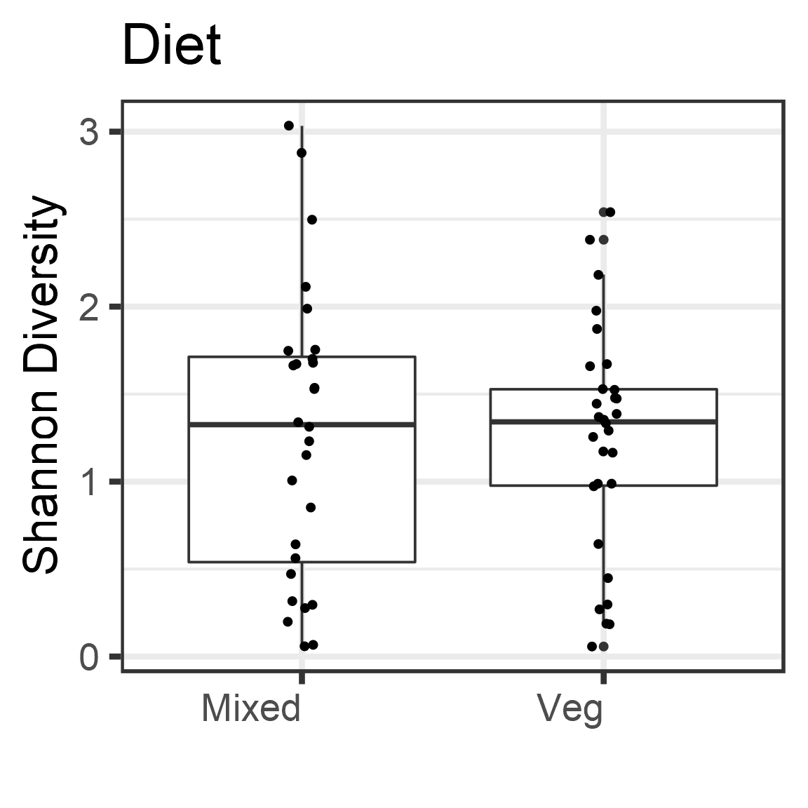
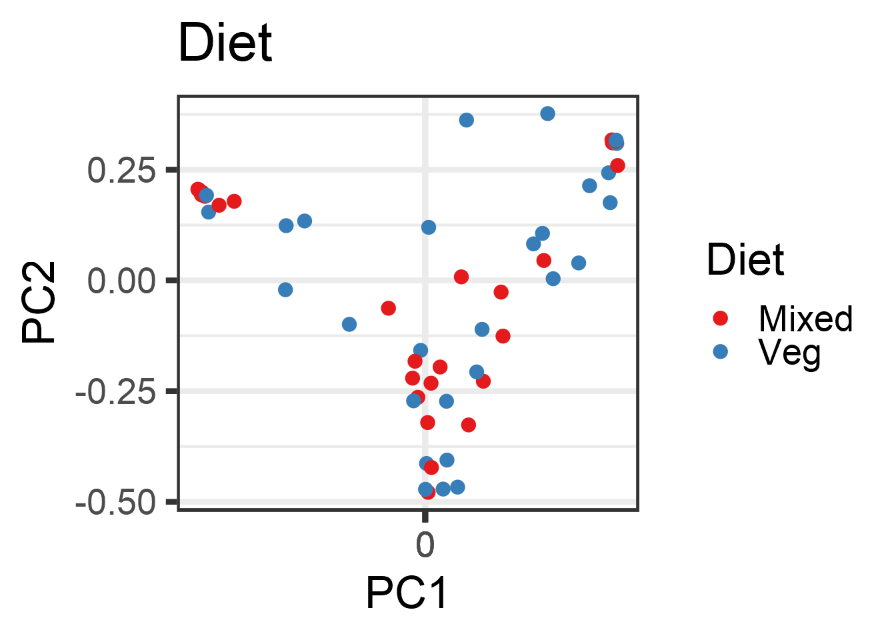

# Diet Analysis


# Alpha diversity analysis


```
##    observed    chao1 diversity_inverse_simpson diversity_gini_simpson diversity_shannon diversity_fisher diversity_coverage evenness_camargo evenness_pielou
## I1      100 245.8000                  2.742798             0.63540883         1.3694541        13.364437                  1        0.9474949      0.29737317
## I2       92 165.6333                  1.052462             0.04984661         0.1878765        10.980589                  1        0.9985936      0.04154916
## I3       95 159.6538                  1.931888             0.48237170         1.2914717        14.410657                  1        0.2914961      0.28359828
## I4       38  66.9000                  4.132087             0.75799152         1.6716162         6.171426                  2        0.9940274      0.45953997
## I5       78 158.1818                  1.745322             0.42703968         0.9880714        11.186785                  1        0.9839926      0.22679307
## I6       44 106.5000                  1.112965             0.10149904         0.2698556         4.792753                  1        0.9988391      0.07131132
##    evenness_simpson evenness_evar evenness_bulla dominance_dbp dominance_dmn dominance_absolute dominance_relative dominance_simpson dominance_core_abundance
## I1       0.02742798     0.1579553     0.07787295     0.5107450     0.8213804              12121          0.5107450         0.3645912                0.9810804
## I2       0.01143980     0.2065513     0.02556145     0.9747164     0.9809117              46570          0.9747164         0.9501534                0.9960023
## I3       0.02033567     0.1915306     0.11600791     0.7101353     0.7990093               7455          0.7101353         0.5176283                0.8909316
## I4       0.10873912     0.1497128     0.16037771     0.2988308     0.5718707                869          0.2988308         0.2420085                0.9381018
## I5       0.02237592     0.1909460     0.07726423     0.7435424     0.8430057               8866          0.7435424         0.5729603                0.8940792
## I6       0.02529466     0.1186903     0.03944664     0.9471353     0.9841771              44056          0.9471353         0.8985010                0.9922606
##    dominance_gini rarity_log_modulo_skewness rarity_low_abundance rarity_rare_abundance
## I1      0.9948356                   2.061147          0.014537334          0.0024018203
## I2      0.9978941                   2.061260          0.008874377          0.0009418561
## I3      0.9937761                   2.061270          0.022575729          0.0125738236
## I4      0.9934163                   2.061423          0.015474553          0.0127235213
## I5      0.9960293                   2.061195          0.010902382          0.0012579671
## I6      0.9981882                   2.060696          0.006277545          0.0001504891
```

```
## [1] TRUE
```

```
## [1] TRUE
```


|      |        s|         g|
|:-----|--------:|---------:|
|Mixed | 1.270704| 0.8257846|
|Veg   | 1.236754| 0.6488095|


# Group-wise comparisons
* Diversity index: diversity_shannon



# Ordination


## *Principal Coordinates Analysis (PCoA)*

* Ordination method: PCoA
* Dissimilarity measure: bray




# PERMANOVA analysis

p value for the effect of diet is (p=0.31), which is not significant.


```
## [1] 0.28
```

```
## Analysis of Variance Table
## 
## Response: Distances
##           Df  Sum Sq  Mean Sq F value Pr(>F)
## Groups     1 0.01306 0.013062  0.8866 0.3504
## Residuals 56 0.82502 0.014733
```

