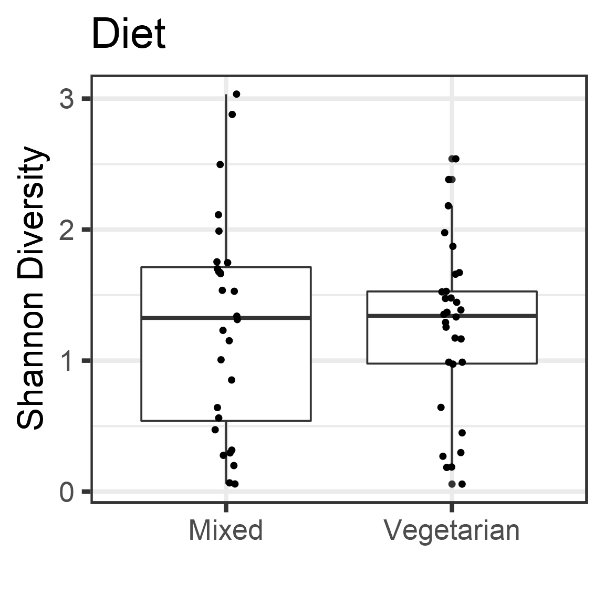

# Diet Analysis


# Alpha diversity analysis


```
## [1] TRUE
```

```
## [1] TRUE
```


|      |        s|         g|
|:-----|--------:|---------:|
|Mixed | 1.270704| 0.8257846|
|Veg   | 1.236754| 0.6488095|


# Group-wise comparisons
* Diversity index: diversity_shannon


```
## 
## 	Wilcoxon rank sum exact test
## 
## data:  index by factor(Diet)
## W = 442, p-value = 0.7399
## alternative hypothesis: true location shift is not equal to 0
```



# Ordination


## *Principal Coordinates Analysis (PCoA)*

* Ordination method: PCoA
* Dissimilarity measure: bray


# PERMANOVA analysis

p value for the effect of diet is (p=0.31), which is not significant.


```
## [1] 0.36
```

```
## Analysis of Variance Table
## 
## Response: Distances
##           Df  Sum Sq  Mean Sq F value Pr(>F)
## Groups     1 0.01306 0.013062  0.8866 0.3504
## Residuals 56 0.82502 0.014733
```

