Analysis
========

Alpha diversity analysis
========================

    ##    observed    chao1 diversity_inverse_simpson diversity_gini_simpson
    ## I1      100 245.8000                  2.742798             0.63540883
    ## I2       92 165.6333                  1.052462             0.04984661
    ## I3       95 159.6538                  1.931888             0.48237170
    ## I4       38  66.9000                  4.132087             0.75799152
    ## I5       78 158.1818                  1.745322             0.42703968
    ## I6       44 106.5000                  1.112965             0.10149904
    ##    diversity_shannon diversity_fisher diversity_coverage evenness_camargo
    ## I1         1.3694541        13.364437                  1        0.9474949
    ## I2         0.1878765        10.980589                  1        0.9985936
    ## I3         1.2914717        14.410657                  1        0.2914961
    ## I4         1.6716162         6.171426                  2        0.9940274
    ## I5         0.9880714        11.186785                  1        0.9839926
    ## I6         0.2698556         4.792753                  1        0.9988391
    ##    evenness_pielou evenness_simpson evenness_evar evenness_bulla dominance_dbp
    ## I1      0.29737317       0.02742798     0.1579553     0.07787295     0.5107450
    ## I2      0.04154916       0.01143980     0.2065513     0.02556145     0.9747164
    ## I3      0.28359828       0.02033567     0.1915306     0.11600791     0.7101353
    ## I4      0.45953997       0.10873912     0.1497128     0.16037771     0.2988308
    ## I5      0.22679307       0.02237592     0.1909460     0.07726423     0.7435424
    ## I6      0.07131132       0.02529466     0.1186903     0.03944664     0.9471353
    ##    dominance_dmn dominance_absolute dominance_relative dominance_simpson
    ## I1     0.8213804              12121          0.5107450         0.3645912
    ## I2     0.9809117              46570          0.9747164         0.9501534
    ## I3     0.7990093               7455          0.7101353         0.5176283
    ## I4     0.5718707                869          0.2988308         0.2420085
    ## I5     0.8430057               8866          0.7435424         0.5729603
    ## I6     0.9841771              44056          0.9471353         0.8985010
    ##    dominance_core_abundance dominance_gini rarity_log_modulo_skewness
    ## I1                0.9810804      0.9948356                   2.061147
    ## I2                0.9960023      0.9978941                   2.061260
    ## I3                0.8909316      0.9937761                   2.061270
    ## I4                0.9381018      0.9934163                   2.061423
    ## I5                0.8940792      0.9960293                   2.061195
    ## I6                0.9922606      0.9981882                   2.060696
    ##    rarity_low_abundance rarity_rare_abundance
    ## I1          0.014537334          0.0024018203
    ## I2          0.008874377          0.0009418561
    ## I3          0.022575729          0.0125738236
    ## I4          0.015474553          0.0127235213
    ## I5          0.010902382          0.0012579671
    ## I6          0.006277545          0.0001504891

    ## [1] TRUE

    ## [1] TRUE

    ##    Mixed      Veg 
    ## 1.270704 1.236754

Group-wise comparisons
======================

-   Diversity index: diversity\_shannon

Ordination
==========

*Principal Coordinates Analysis (PCoA)*
---------------------------------------

-   Ordination method: PCoA
-   Dissimilarity measure: bray

Differential abundance analysis
-------------------------------

Differential abundance analysis is carriedout using DESeq2 method

<table>
<colgroup>
<col width="11%" />
<col width="7%" />
<col width="6%" />
<col width="74%" />
</colgroup>
<thead>
<tr class="header">
<th align="right">log2FoldChange</th>
<th align="right">padj</th>
<th align="left">taxon</th>
<th align="left">full_name</th>
</tr>
</thead>
<tbody>
<tr class="odd">
<td align="right">6.538842</td>
<td align="right">0.0000001</td>
<td align="left">OTU526</td>
<td align="left">Bacteria_Actinobacteria_Actinobacteria_Micrococcales_Brevibacteriaceae_Brevibacterium</td>
</tr>
<tr class="even">
<td align="right">4.239621</td>
<td align="right">0.0002373</td>
<td align="left">OTU194</td>
<td align="left">Bacteria_Firmicutes_Tissierellia_Tissierellales_Peptoniphilaceae_Anaerococcus</td>
</tr>
<tr class="odd">
<td align="right">4.871275</td>
<td align="right">0.0026454</td>
<td align="left">OTU1034</td>
<td align="left">Bacteria_Firmicutes_Tissierellia_Tissierellales_Peptoniphilaceae_Finegoldia</td>
</tr>
<tr class="even">
<td align="right">3.805141</td>
<td align="right">0.0423790</td>
<td align="left">OTU1768</td>
<td align="left">Bacteria_Firmicutes_Clostridia_Clostridiales_Peptoniphilus_Peptoniphilus</td>
</tr>
<tr class="odd">
<td align="right">2.462234</td>
<td align="right">0.0423790</td>
<td align="left">OTU661</td>
<td align="left">Bacteria_Firmicutes_Clostridia_Clostridiales_Clostridiaceae_Clostridium</td>
</tr>
<tr class="even">
<td align="right">4.214174</td>
<td align="right">0.0434546</td>
<td align="left">OTU2054</td>
<td align="left">Bacteria_Proteobacteria_Gammaproteobacteria_Oceanospirillales_Saccharospirillaceae_Saccharospirillum</td>
</tr>
<tr class="odd">
<td align="right">2.897576</td>
<td align="right">0.0434546</td>
<td align="left">OTU1849</td>
<td align="left">Bacteria_Actinobacteria_Actinobacteria_Propionibacteriales_Propionibacteriaceae_Propionibacterium</td>
</tr>
<tr class="even">
<td align="right">3.662462</td>
<td align="right">0.0489192</td>
<td align="left">OTU2076</td>
<td align="left">Bacteria_Proteobacteria_Gammaproteobacteria_Enterobacterales _Enterobacteriaceae_Salmonella</td>
</tr>
<tr class="odd">
<td align="right">3.243989</td>
<td align="right">0.0489192</td>
<td align="left">OTU2306</td>
<td align="left">Bacteria_Actinobacteria_Actinobacteria_Propionibacteriales_Propionibacteriaceae_Tessaracoccus</td>
</tr>
<tr class="even">
<td align="right">4.247971</td>
<td align="right">0.0564232</td>
<td align="left">OTU929</td>
<td align="left">Bacteria_Proteobacteria_Gammaproteobacteria_Enterobacterales _Enterobacteriaceae_Enterobacter</td>
</tr>
<tr class="odd">
<td align="right">4.553118</td>
<td align="right">0.0677388</td>
<td align="left">OTU1864</td>
<td align="left">Bacteria_Proteobacteria_Gammaproteobacteria_Enterobacterales _Morganellaceae_Proteus</td>
</tr>
<tr class="even">
<td align="right">2.849115</td>
<td align="right">0.0981577</td>
<td align="left">OTU1709</td>
<td align="left">Bacteria_Proteobacteria_Gammaproteobacteria_Enterobacterales _Erwiniaceae_Pantoea</td>
</tr>
<tr class="odd">
<td align="right">1.986647</td>
<td align="right">0.0981577</td>
<td align="left">OTU2172</td>
<td align="left">Bacteria_Firmicutes_Bacilli_Bacillales_Staphylococcaceae_Staphylococcus</td>
</tr>
<tr class="even">
<td align="right">4.456895</td>
<td align="right">0.1654653</td>
<td align="left">OTU1797</td>
<td align="left">Bacteria_Proteobacteria_Gammaproteobacteria_Enterobacterales _NA_Phytobacter</td>
</tr>
<tr class="odd">
<td align="right">4.037909</td>
<td align="right">0.2060017</td>
<td align="left">OTU804</td>
<td align="left">Bacteria_Proteobacteria_Gammaproteobacteria_Enterobacterales _Enterobacteriaceae_Cronobacter</td>
</tr>
<tr class="even">
<td align="right">-2.573789</td>
<td align="right">0.2060017</td>
<td align="left">OTU1275</td>
<td align="left">Bacteria_Actinobacteria_Actinobacteria_Micrococcales_Micrococcaceae_Kocuria</td>
</tr>
<tr class="odd">
<td align="right">6.204146</td>
<td align="right">0.2172731</td>
<td align="left">OTU1370</td>
<td align="left">Bacteria_Proteobacteria_Gammaproteobacteria_Xanthomonadales_Xanthomonadaceae_Luteimonas</td>
</tr>
<tr class="even">
<td align="right">3.095269</td>
<td align="right">0.2172731</td>
<td align="left">OTU1874</td>
<td align="left">Bacteria_Proteobacteria_Gammaproteobacteria_Alteromonadales _Pseudoalteromonadaceae_Pseudoalteromonas</td>
</tr>
<tr class="odd">
<td align="right">2.421420</td>
<td align="right">0.2172731</td>
<td align="left">OTU1450</td>
<td align="left">Bacteria_Actinobacteria_Actinobacteria_Micrococcales_Microbacteriaceae_Microbacterium</td>
</tr>
</tbody>
</table>

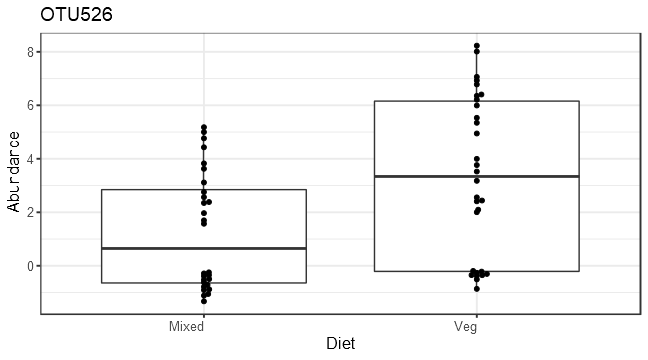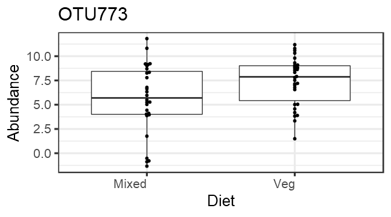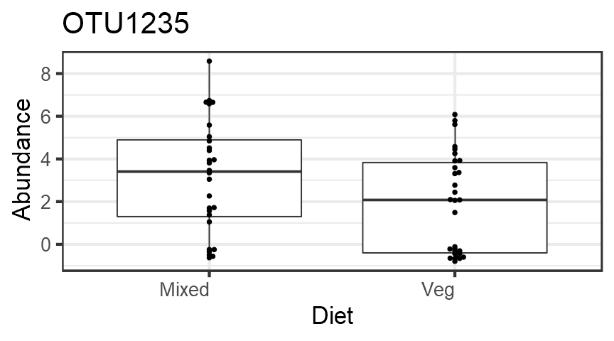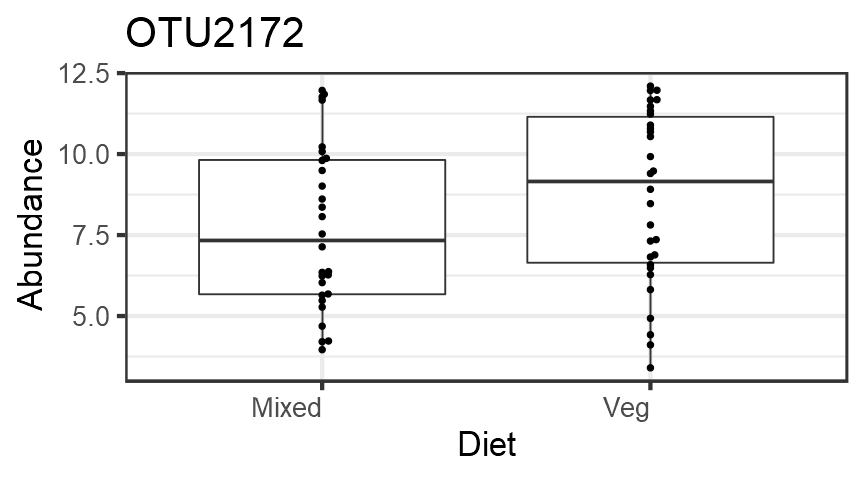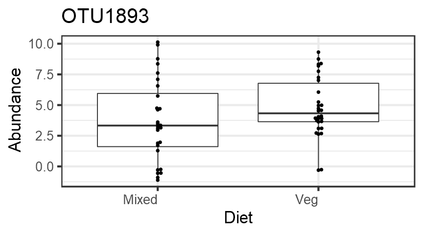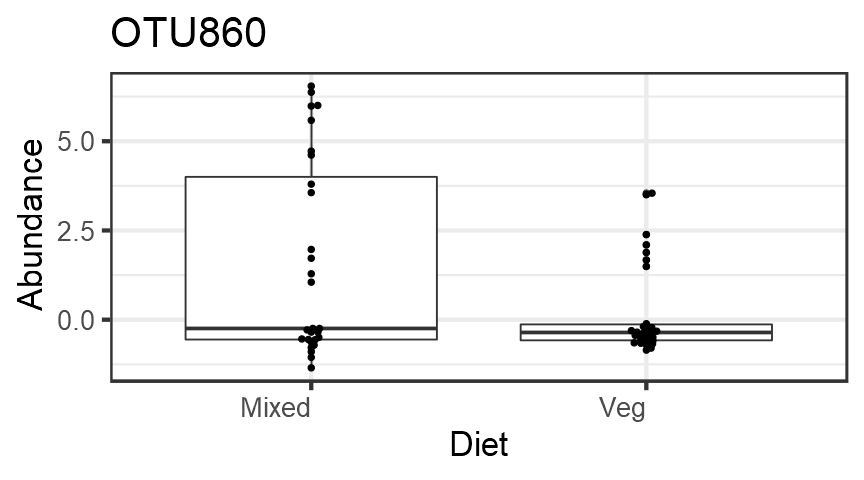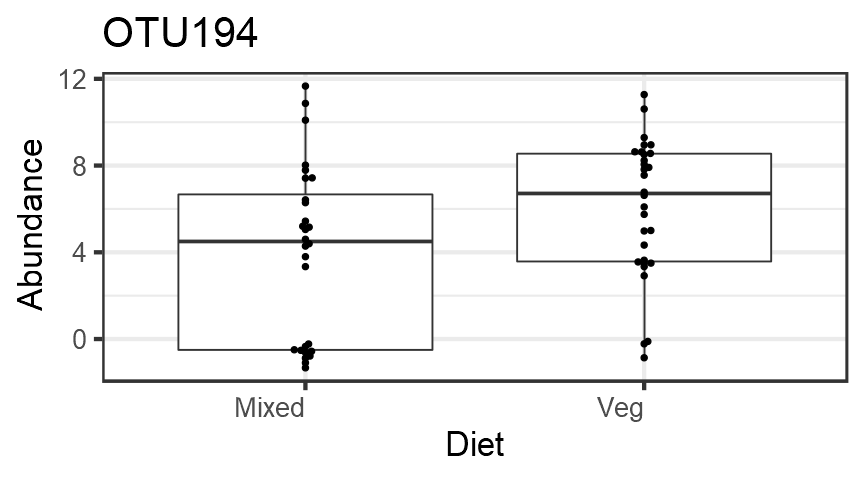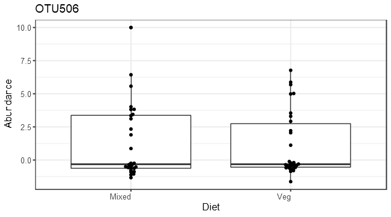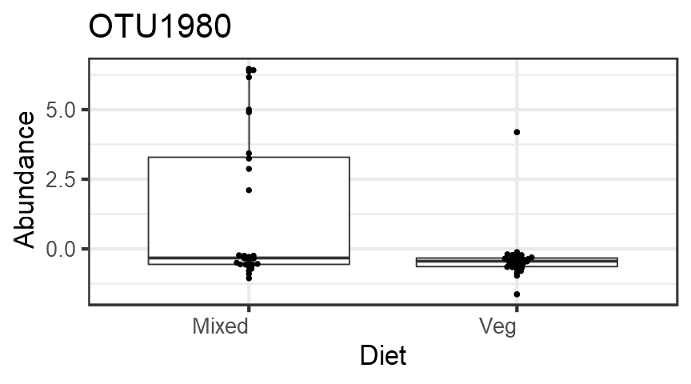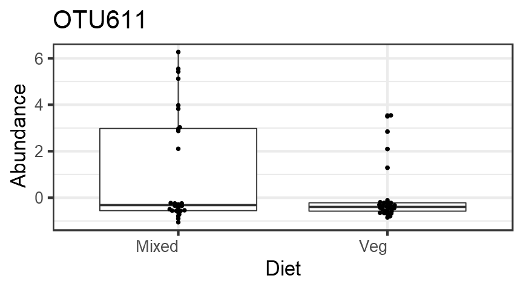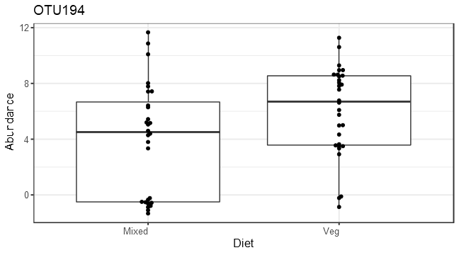

PERMANOVA analysis
==================

p value for the effect of diet is (p=0.31), which is not significant.

    ## [1] 0.32

    ## Analysis of Variance Table
    ## 
    ## Response: Distances
    ##           Df  Sum Sq  Mean Sq F value Pr(>F)
    ## Groups     1 0.01306 0.013062  0.8866 0.3504
    ## Residuals 56 0.82502 0.014733

Investigate the top factors
===========================

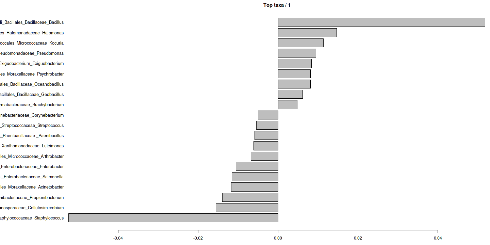
