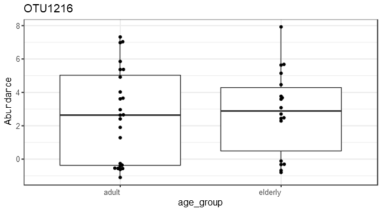
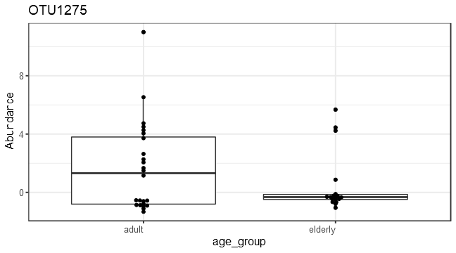
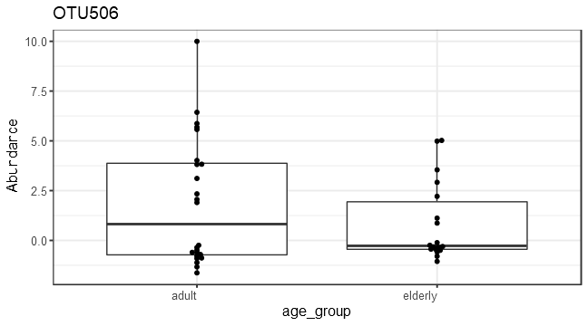
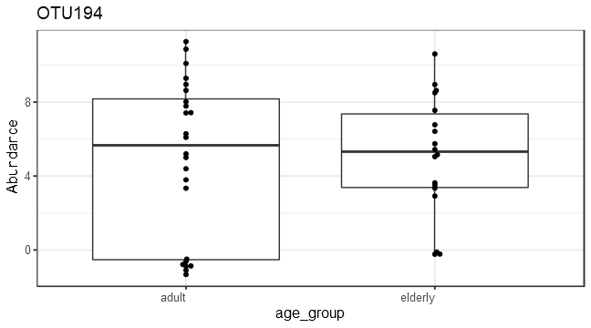
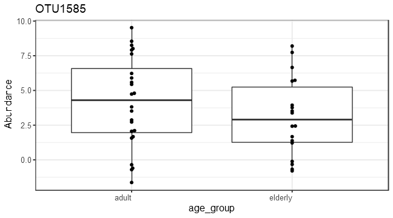
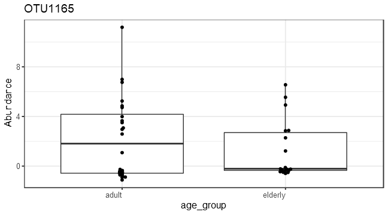
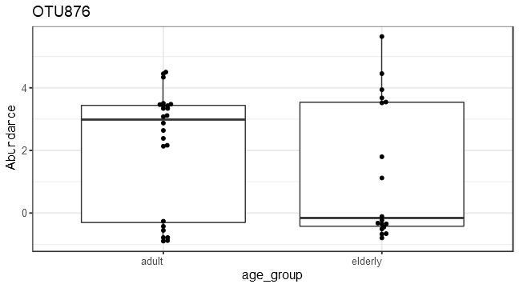

# Analysis


# Alpha diversity analysis


# Group-wise comparisons
* Diversity index: diversity_shannon


# Ordination


## *Principal Coordinates Analysis (PCoA)*

* Ordination method: PCoA
* Dissimilarity measure: jaccard


##DESeq2 analysis*


| log2FoldChange|      padj|taxon   |full_name                                                                                             |
|--------------:|---------:|:-------|:-----------------------------------------------------------------------------------------------------|
|       6.538842| 0.0000001|OTU526  |Bacteria_Actinobacteria_Actinobacteria_Micrococcales_Brevibacteriaceae_Brevibacterium                 |
|       4.239621| 0.0002373|OTU194  |Bacteria_Firmicutes_Tissierellia_Tissierellales_Peptoniphilaceae_Anaerococcus                         |
|       4.871275| 0.0026454|OTU1034 |Bacteria_Firmicutes_Tissierellia_Tissierellales_Peptoniphilaceae_Finegoldia                           |
|       3.805141| 0.0423790|OTU1768 |Bacteria_Firmicutes_Clostridia_Clostridiales_Peptoniphilus_Peptoniphilus                              |
|       2.462234| 0.0423790|OTU661  |Bacteria_Firmicutes_Clostridia_Clostridiales_Clostridiaceae_Clostridium                               |
|       4.214174| 0.0434546|OTU2054 |Bacteria_Proteobacteria_Gammaproteobacteria_Oceanospirillales_Saccharospirillaceae_Saccharospirillum  |
|       2.897576| 0.0434546|OTU1849 |Bacteria_Actinobacteria_Actinobacteria_Propionibacteriales_Propionibacteriaceae_Propionibacterium     |
|       3.662462| 0.0489192|OTU2076 |Bacteria_Proteobacteria_Gammaproteobacteria_Enterobacterales _Enterobacteriaceae_Salmonella           |
|       3.243989| 0.0489192|OTU2306 |Bacteria_Actinobacteria_Actinobacteria_Propionibacteriales_Propionibacteriaceae_Tessaracoccus         |
|       4.247971| 0.0564232|OTU929  |Bacteria_Proteobacteria_Gammaproteobacteria_Enterobacterales _Enterobacteriaceae_Enterobacter         |
|       4.553118| 0.0677388|OTU1864 |Bacteria_Proteobacteria_Gammaproteobacteria_Enterobacterales _Morganellaceae_Proteus                  |
|       2.849115| 0.0981577|OTU1709 |Bacteria_Proteobacteria_Gammaproteobacteria_Enterobacterales _Erwiniaceae_Pantoea                     |
|       1.986647| 0.0981577|OTU2172 |Bacteria_Firmicutes_Bacilli_Bacillales_Staphylococcaceae_Staphylococcus                               |
|       4.456895| 0.1654653|OTU1797 |Bacteria_Proteobacteria_Gammaproteobacteria_Enterobacterales _NA_Phytobacter                          |
|       4.037909| 0.2060017|OTU804  |Bacteria_Proteobacteria_Gammaproteobacteria_Enterobacterales _Enterobacteriaceae_Cronobacter          |
|      -2.573789| 0.2060017|OTU1275 |Bacteria_Actinobacteria_Actinobacteria_Micrococcales_Micrococcaceae_Kocuria                           |
|       6.204146| 0.2172731|OTU1370 |Bacteria_Proteobacteria_Gammaproteobacteria_Xanthomonadales_Xanthomonadaceae_Luteimonas               |
|       3.095269| 0.2172731|OTU1874 |Bacteria_Proteobacteria_Gammaproteobacteria_Alteromonadales _Pseudoalteromonadaceae_Pseudoalteromonas |
|       2.421420| 0.2172731|OTU1450 |Bacteria_Actinobacteria_Actinobacteria_Micrococcales_Microbacteriaceae_Microbacterium                 |



#PERMANOVA analysis

```r
library(microbiome)
library(ggplot2)
library(dplyr)

pseq <- phy# Rename the example data
data = microbiome::meta(phy)
# Pick relative abundances (compositional) and sample metadata 
pseq.rel <- microbiome::transform(pseq, "compositional")
otu <- abundances(pseq.rel)
meta <- meta(pseq.rel)
library(vegan)
library(phyloseq)
permanova <- adonis(t(otu) ~ Diet,
               data = meta(phy), permutations=99, method = "bray")

# P-value
print(as.data.frame(permanova$aov.tab)["Diet", "Pr(>F)"])
```

```
## [1] 0.33
```

```r
dist <- vegdist(t(otu))
anova(betadisper(dist, meta$Diet))
```

```
## Analysis of Variance Table
## 
## Response: Distances
##           Df  Sum Sq  Mean Sq F value Pr(>F)
## Groups     1 0.01306 0.013062  0.8866 0.3504
## Residuals 56 0.82502 0.014733
```

# Investigate the top factors


```r
library(vegan)
coef1 <- coefficients(permanova)["Diet1", ]
top.coef1 <- coef1[rev(order(abs(coef1)))[1:20]]
names(top.coef1) <- full.names[names(top.coef1)]
par(mar = c(3, 14, 2, 1))
barplot(sort(top.coef1), horiz = T, las = 1, main = "Top taxa / 1")
```


