Alpha diversity analysis
========================

Group-wise comparisons
======================

-   Diversity index: diversity\_shannon

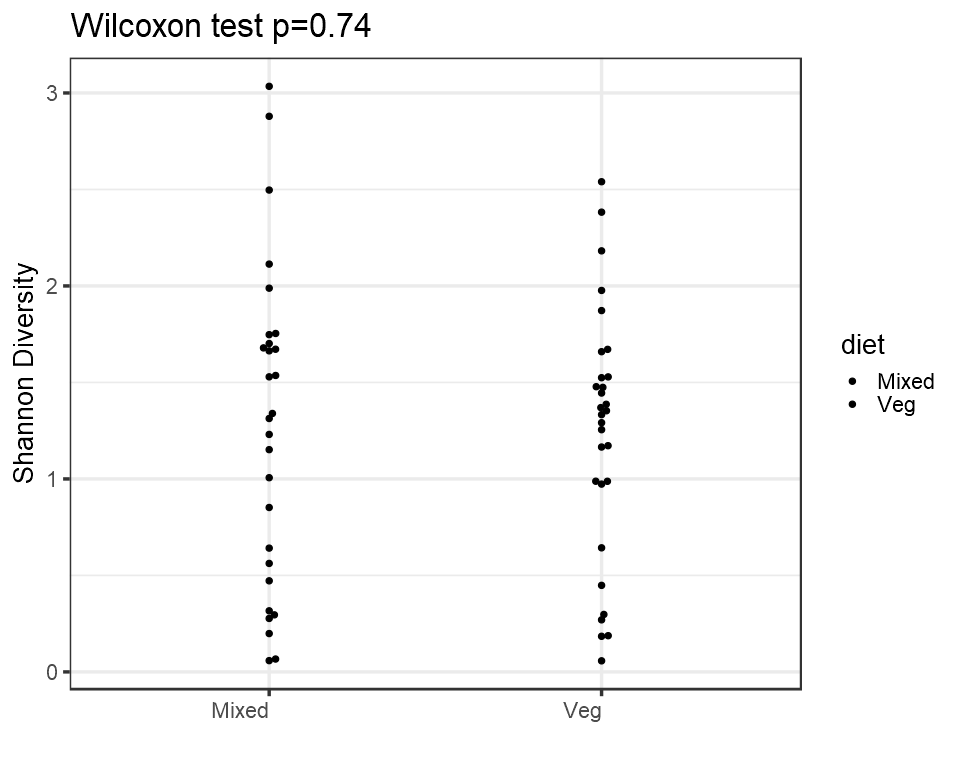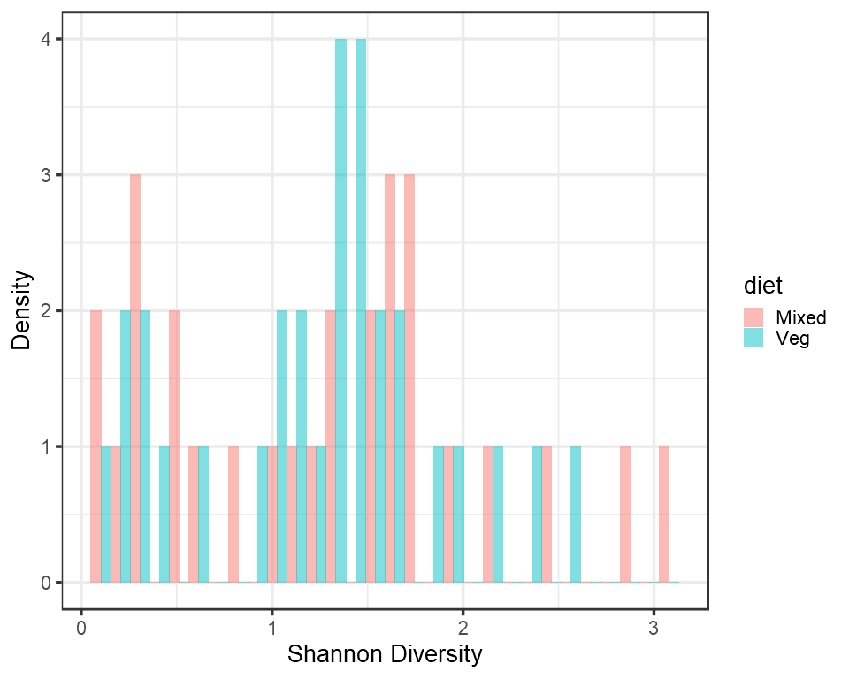

Ordination
==========

*Principal Coordinates Analysis (PCoA)*
---------------------------------------

-   Ordination method: PCoA
-   Dissimilarity measure: jaccard

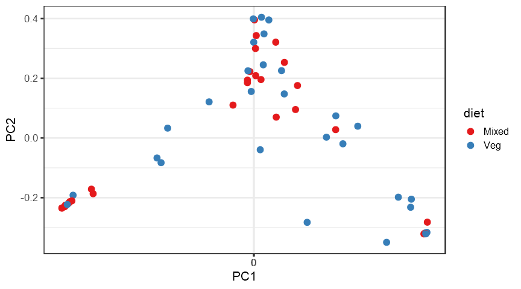

DESeq2 analysis\*
-----------------

<table>
<thead>
<tr class="header">
<th align="left"></th>
<th align="right">baseMean</th>
<th align="right">log2FoldChange</th>
<th align="right">lfcSE</th>
<th align="right">stat</th>
<th align="right">pvalue</th>
<th align="right">padj</th>
<th align="left">taxon</th>
</tr>
</thead>
<tbody>
<tr class="odd">
<td align="left">OTU526</td>
<td align="right">122.312750</td>
<td align="right">6.538842</td>
<td align="right">1.0479243</td>
<td align="right">6.239803</td>
<td align="right">0.0000000</td>
<td align="right">0.0000001</td>
<td align="left">OTU526</td>
</tr>
<tr class="even">
<td align="left">OTU1370</td>
<td align="right">10.027138</td>
<td align="right">6.204146</td>
<td align="right">2.9078420</td>
<td align="right">2.133591</td>
<td align="right">0.0328763</td>
<td align="right">0.2172731</td>
<td align="left">OTU1370</td>
</tr>
<tr class="odd">
<td align="left">OTU1034</td>
<td align="right">13.603931</td>
<td align="right">4.871275</td>
<td align="right">1.2185645</td>
<td align="right">3.997552</td>
<td align="right">0.0000640</td>
<td align="right">0.0026454</td>
<td align="left">OTU1034</td>
</tr>
<tr class="even">
<td align="left">OTU1864</td>
<td align="right">6.588585</td>
<td align="right">4.553118</td>
<td align="right">1.6573154</td>
<td align="right">2.747285</td>
<td align="right">0.0060091</td>
<td align="right">0.0677388</td>
<td align="left">OTU1864</td>
</tr>
<tr class="odd">
<td align="left">OTU1797</td>
<td align="right">5.735555</td>
<td align="right">4.456895</td>
<td align="right">1.8950792</td>
<td align="right">2.351825</td>
<td align="right">0.0186816</td>
<td align="right">0.1654653</td>
<td align="left">OTU1797</td>
</tr>
<tr class="even">
<td align="left">OTU929</td>
<td align="right">4051.362077</td>
<td align="right">4.247971</td>
<td align="right">1.4972091</td>
<td align="right">2.837260</td>
<td align="right">0.0045503</td>
<td align="right">0.0564232</td>
<td align="left">OTU929</td>
</tr>
<tr class="odd">
<td align="left">OTU194</td>
<td align="right">557.110161</td>
<td align="right">4.239621</td>
<td align="right">0.9175517</td>
<td align="right">4.620579</td>
<td align="right">0.0000038</td>
<td align="right">0.0002373</td>
<td align="left">OTU194</td>
</tr>
<tr class="even">
<td align="left">OTU2054</td>
<td align="right">6.667699</td>
<td align="right">4.214174</td>
<td align="right">1.3749276</td>
<td align="right">3.065015</td>
<td align="right">0.0021766</td>
<td align="right">0.0434546</td>
<td align="left">OTU2054</td>
</tr>
<tr class="odd">
<td align="left">OTU804</td>
<td align="right">37.075024</td>
<td align="right">4.037909</td>
<td align="right">1.8074611</td>
<td align="right">2.234023</td>
<td align="right">0.0254816</td>
<td align="right">0.2060017</td>
<td align="left">OTU804</td>
</tr>
<tr class="even">
<td align="left">OTU1768</td>
<td align="right">7.712308</td>
<td align="right">3.805141</td>
<td align="right">1.2064511</td>
<td align="right">3.153995</td>
<td align="right">0.0016105</td>
<td align="right">0.0423790</td>
<td align="left">OTU1768</td>
</tr>
<tr class="odd">
<td align="left">OTU2076</td>
<td align="right">895.980457</td>
<td align="right">3.662462</td>
<td align="right">1.2561809</td>
<td align="right">2.915553</td>
<td align="right">0.0035506</td>
<td align="right">0.0489192</td>
<td align="left">OTU2076</td>
</tr>
<tr class="even">
<td align="left">OTU2306</td>
<td align="right">3.502212</td>
<td align="right">3.243989</td>
<td align="right">1.1114448</td>
<td align="right">2.918714</td>
<td align="right">0.0035148</td>
<td align="right">0.0489192</td>
<td align="left">OTU2306</td>
</tr>
<tr class="odd">
<td align="left">OTU1874</td>
<td align="right">2.636744</td>
<td align="right">3.095269</td>
<td align="right">1.4541707</td>
<td align="right">2.128546</td>
<td align="right">0.0332918</td>
<td align="right">0.2172731</td>
<td align="left">OTU1874</td>
</tr>
<tr class="even">
<td align="left">OTU1849</td>
<td align="right">59.435176</td>
<td align="right">2.897576</td>
<td align="right">0.9565896</td>
<td align="right">3.029070</td>
<td align="right">0.0024531</td>
<td align="right">0.0434546</td>
<td align="left">OTU1849</td>
</tr>
<tr class="odd">
<td align="left">OTU1709</td>
<td align="right">62.622479</td>
<td align="right">2.849115</td>
<td align="right">1.1057553</td>
<td align="right">2.576623</td>
<td align="right">0.0099771</td>
<td align="right">0.0981577</td>
<td align="left">OTU1709</td>
</tr>
<tr class="even">
<td align="left">OTU1275</td>
<td align="right">5.153567</td>
<td align="right">-2.573789</td>
<td align="right">1.1606094</td>
<td align="right">-2.217618</td>
<td align="right">0.0265809</td>
<td align="right">0.2060017</td>
<td align="left">OTU1275</td>
</tr>
<tr class="odd">
<td align="left">OTU661</td>
<td align="right">30.194312</td>
<td align="right">2.462234</td>
<td align="right">0.7849855</td>
<td align="right">3.136662</td>
<td align="right">0.0017088</td>
<td align="right">0.0423790</td>
<td align="left">OTU661</td>
</tr>
<tr class="even">
<td align="left">OTU1450</td>
<td align="right">4.579000</td>
<td align="right">2.421420</td>
<td align="right">1.1227136</td>
<td align="right">2.156757</td>
<td align="right">0.0310246</td>
<td align="right">0.2172731</td>
<td align="left">OTU1450</td>
</tr>
<tr class="odd">
<td align="left">OTU2172</td>
<td align="right">5958.148300</td>
<td align="right">1.986647</td>
<td align="right">0.7742484</td>
<td align="right">2.565904</td>
<td align="right">0.0102907</td>
<td align="right">0.0981577</td>
<td align="left">OTU2172</td>
</tr>
</tbody>
</table>

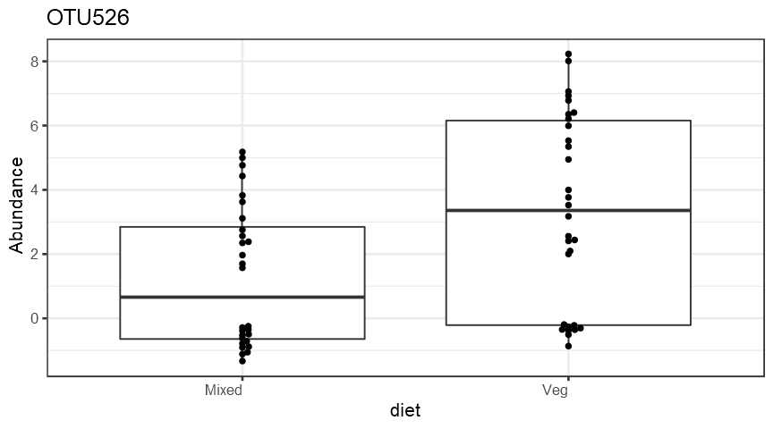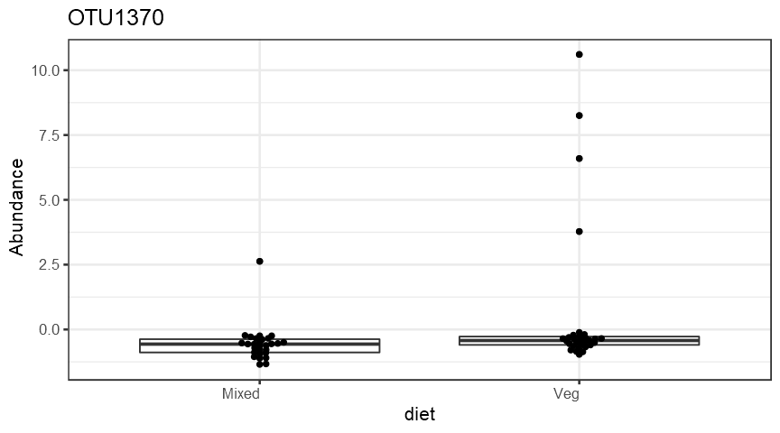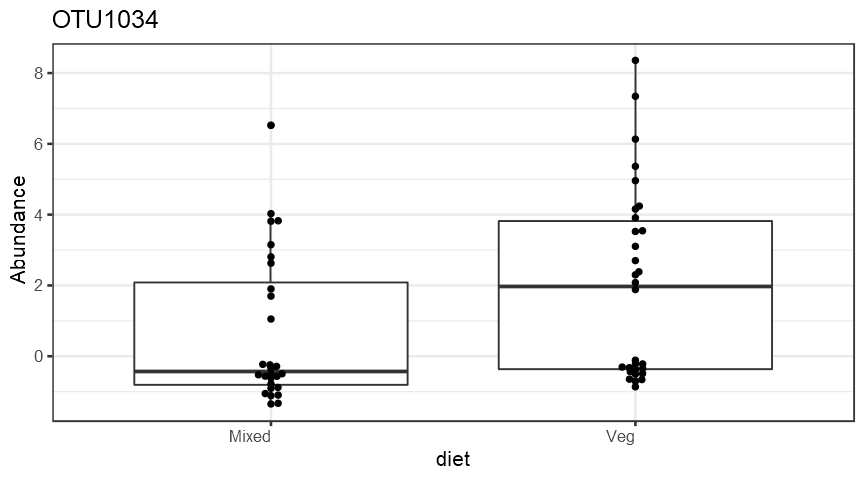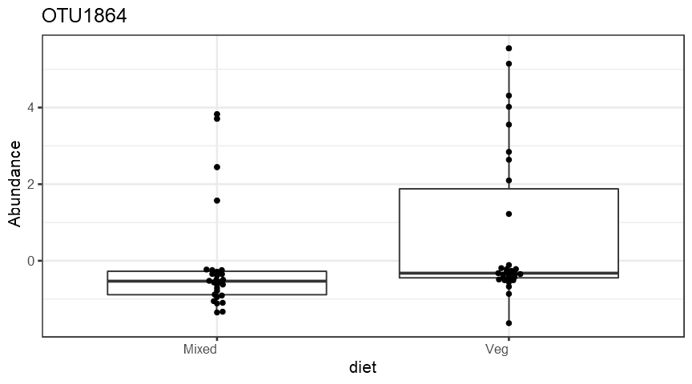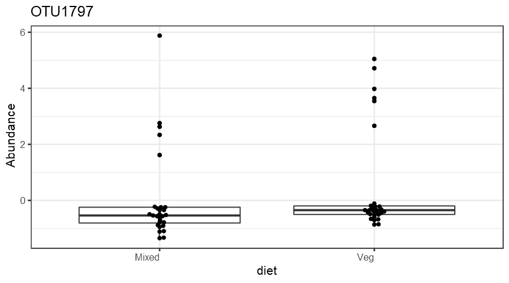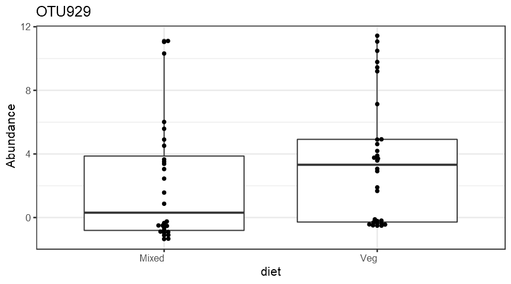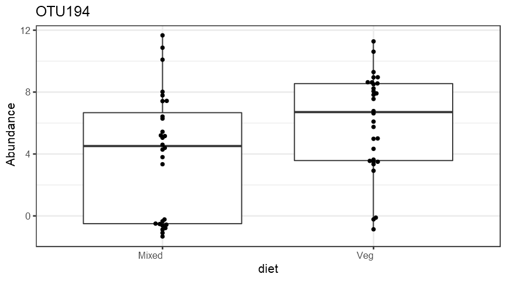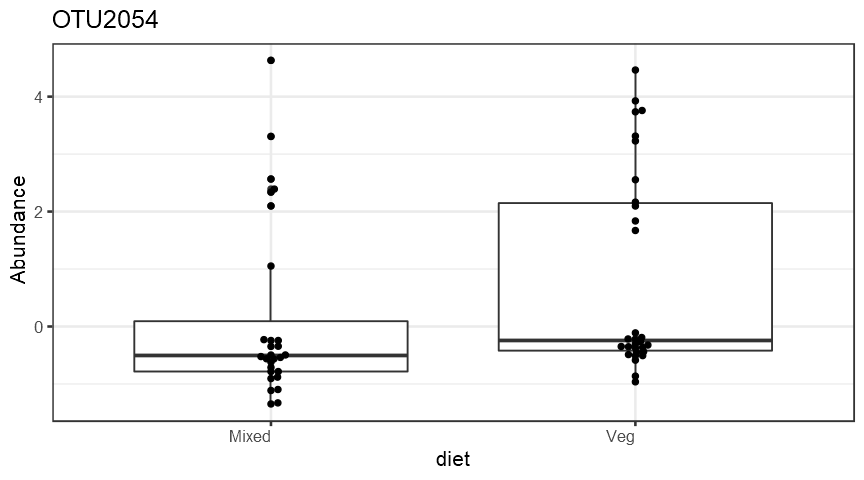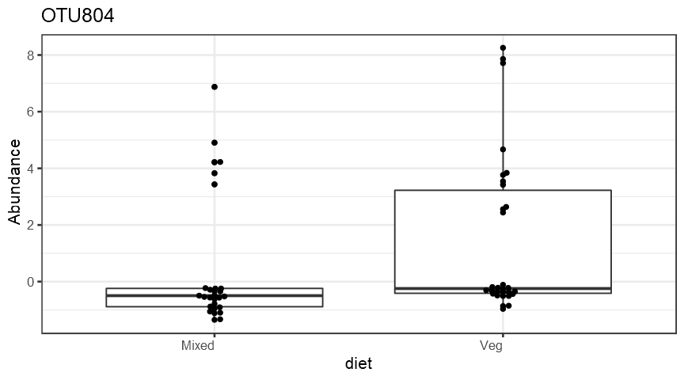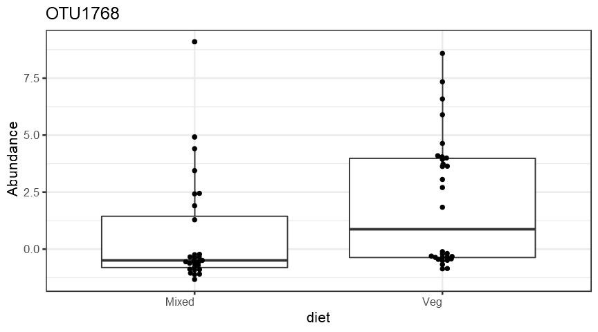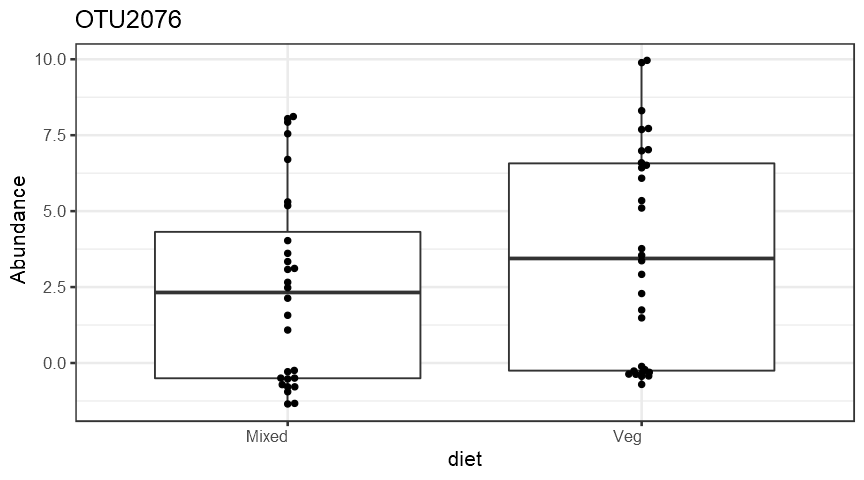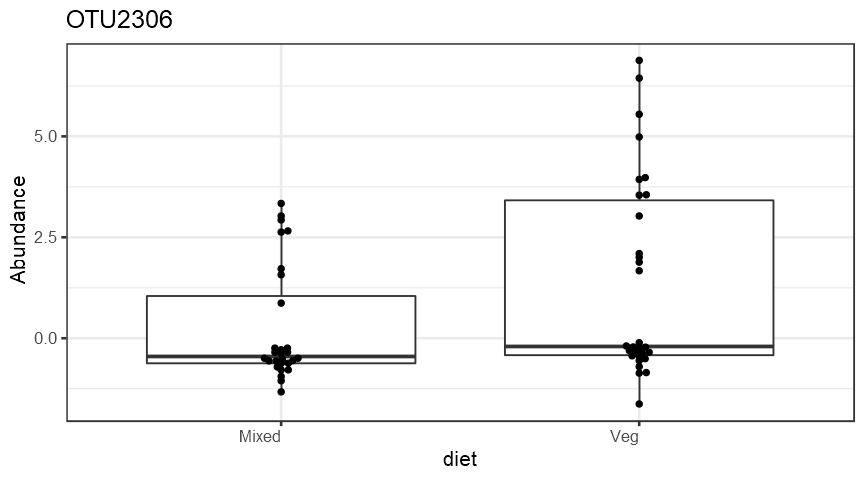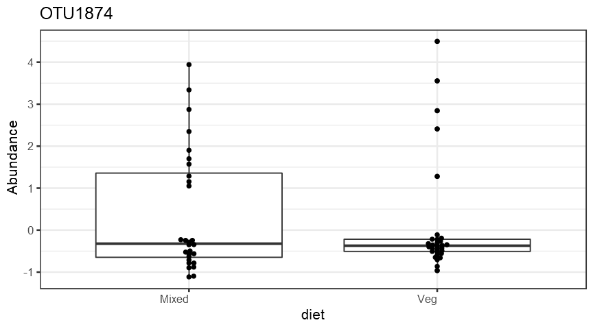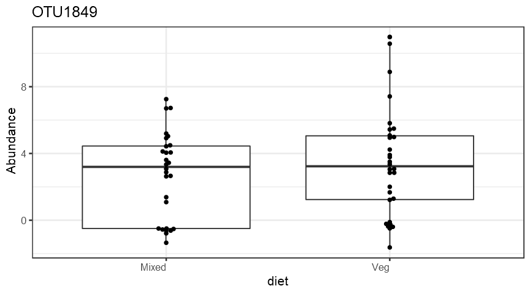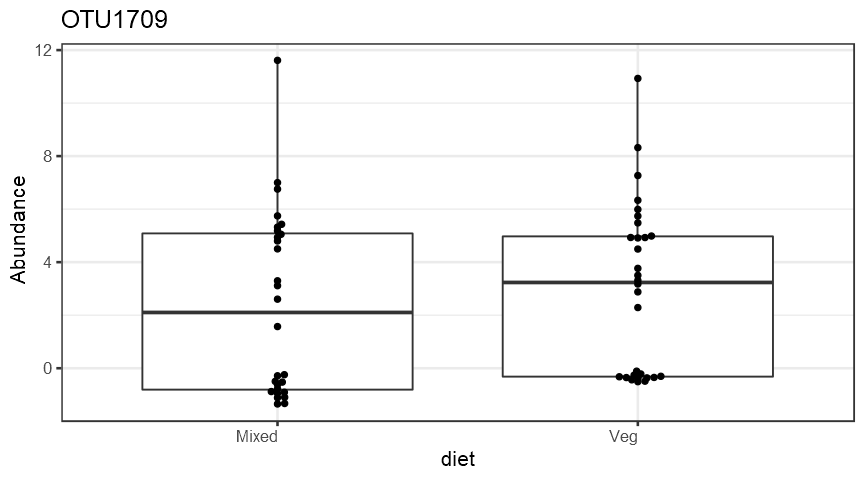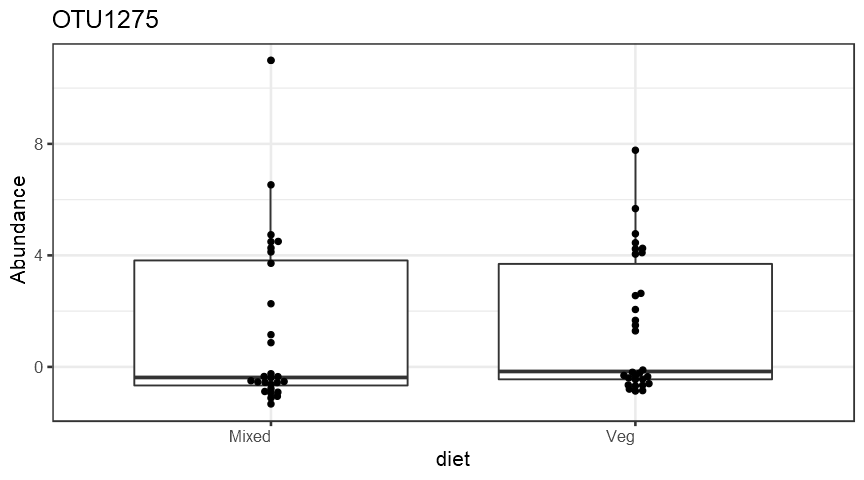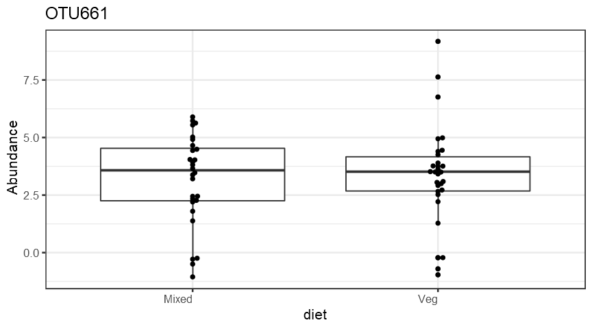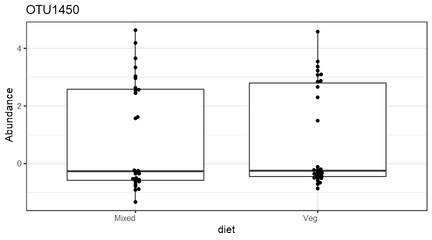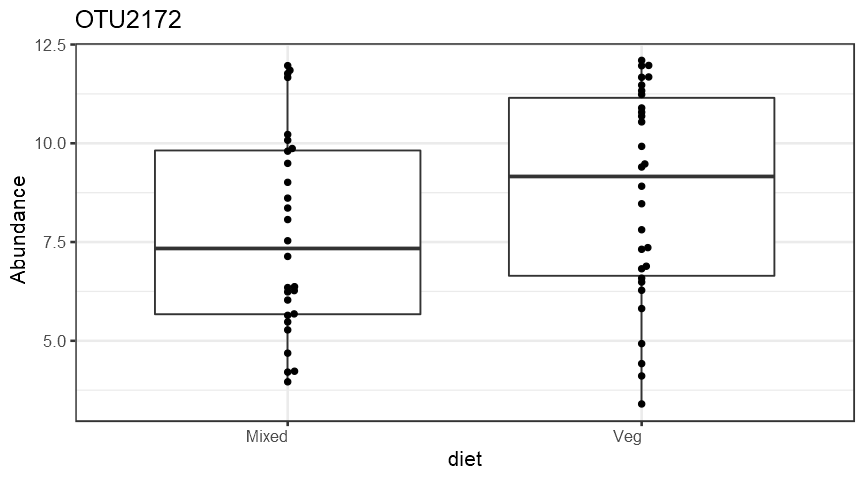
