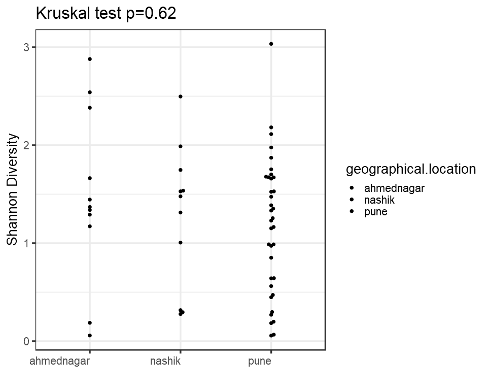
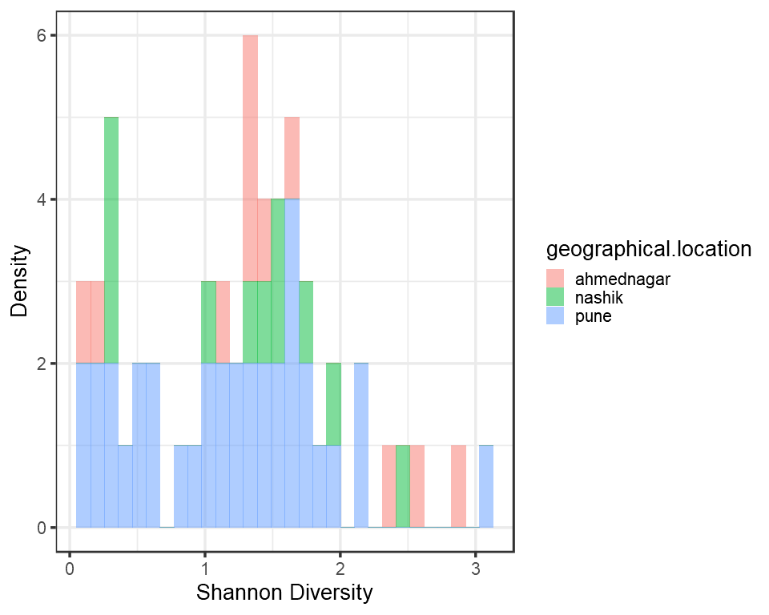
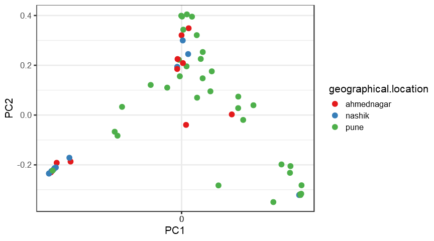
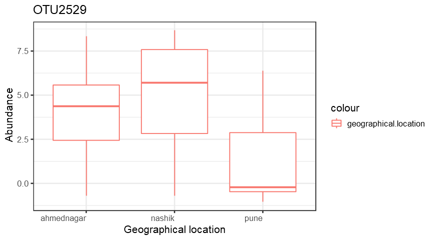
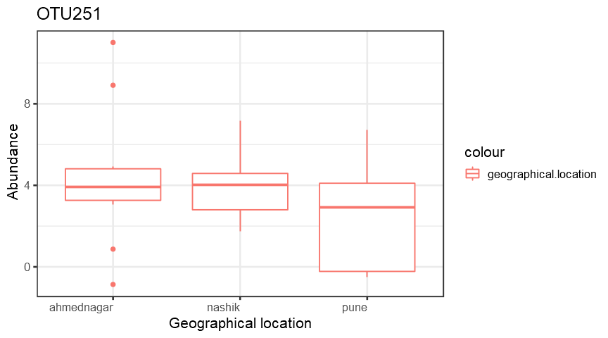
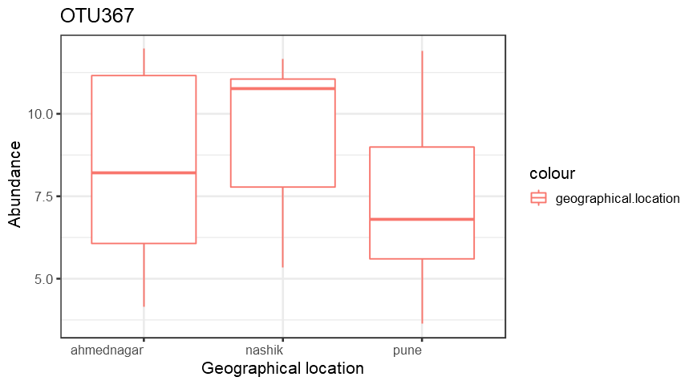
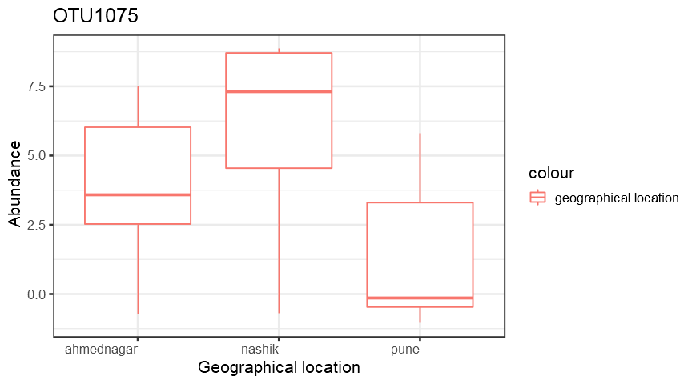
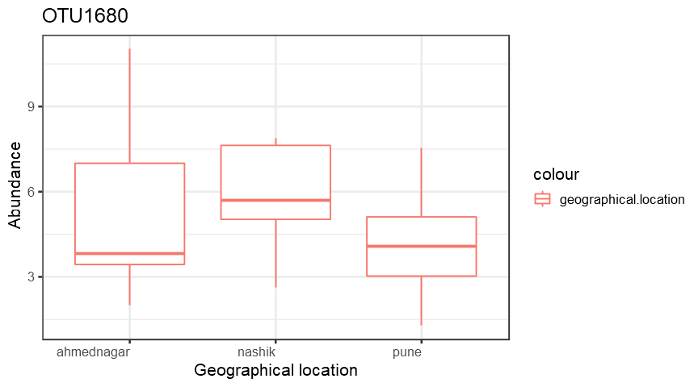
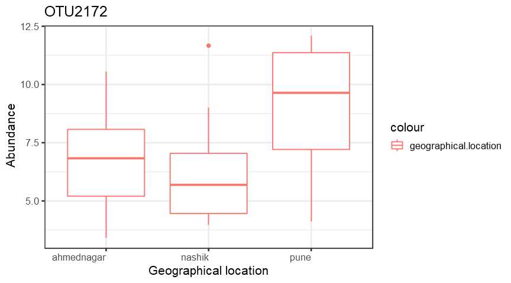

Alpha diversity analysis
========================

<table>
<colgroup>
<col width="0%" />
<col width="2%" />
<col width="2%" />
<col width="6%" />
<col width="5%" />
<col width="4%" />
<col width="4%" />
<col width="4%" />
<col width="4%" />
<col width="4%" />
<col width="4%" />
<col width="3%" />
<col width="3%" />
<col width="3%" />
<col width="3%" />
<col width="4%" />
<col width="4%" />
<col width="4%" />
<col width="6%" />
<col width="3%" />
<col width="6%" />
<col width="5%" />
<col width="5%" />
</colgroup>
<thead>
<tr class="header">
<th align="left"></th>
<th align="right">observed</th>
<th align="right">chao1</th>
<th align="right">diversity_inverse_simpson</th>
<th align="right">diversity_gini_simpson</th>
<th align="right">diversity_shannon</th>
<th align="right">diversity_fisher</th>
<th align="right">diversity_coverage</th>
<th align="right">evenness_camargo</th>
<th align="right">evenness_pielou</th>
<th align="right">evenness_simpson</th>
<th align="right">evenness_evar</th>
<th align="right">evenness_bulla</th>
<th align="right">dominance_dbp</th>
<th align="right">dominance_dmn</th>
<th align="right">dominance_absolute</th>
<th align="right">dominance_relative</th>
<th align="right">dominance_simpson</th>
<th align="right">dominance_core_abundance</th>
<th align="right">dominance_gini</th>
<th align="right">rarity_log_modulo_skewness</th>
<th align="right">rarity_low_abundance</th>
<th align="right">rarity_rare_abundance</th>
</tr>
</thead>
<tbody>
<tr class="odd">
<td align="left">I1</td>
<td align="right">100</td>
<td align="right">245.8000</td>
<td align="right">2.742798</td>
<td align="right">0.6354088</td>
<td align="right">1.3694541</td>
<td align="right">13.364437</td>
<td align="right">1</td>
<td align="right">0.9474949</td>
<td align="right">0.2973732</td>
<td align="right">0.0274280</td>
<td align="right">0.1579553</td>
<td align="right">0.0778729</td>
<td align="right">0.5107450</td>
<td align="right">0.8213804</td>
<td align="right">12121</td>
<td align="right">0.5107450</td>
<td align="right">0.3645912</td>
<td align="right">0.9810804</td>
<td align="right">0.9948356</td>
<td align="right">2.061147</td>
<td align="right">0.0145373</td>
<td align="right">0.0024018</td>
</tr>
<tr class="even">
<td align="left">I2</td>
<td align="right">92</td>
<td align="right">165.6333</td>
<td align="right">1.052462</td>
<td align="right">0.0498466</td>
<td align="right">0.1878765</td>
<td align="right">10.980589</td>
<td align="right">1</td>
<td align="right">0.9985936</td>
<td align="right">0.0415492</td>
<td align="right">0.0114398</td>
<td align="right">0.2065513</td>
<td align="right">0.0255614</td>
<td align="right">0.9747164</td>
<td align="right">0.9809117</td>
<td align="right">46570</td>
<td align="right">0.9747164</td>
<td align="right">0.9501534</td>
<td align="right">0.9960023</td>
<td align="right">0.9978941</td>
<td align="right">2.061259</td>
<td align="right">0.0088744</td>
<td align="right">0.0009419</td>
</tr>
<tr class="odd">
<td align="left">I3</td>
<td align="right">95</td>
<td align="right">159.6538</td>
<td align="right">1.931888</td>
<td align="right">0.4823717</td>
<td align="right">1.2914717</td>
<td align="right">14.410657</td>
<td align="right">1</td>
<td align="right">0.2914961</td>
<td align="right">0.2835983</td>
<td align="right">0.0203357</td>
<td align="right">0.1915306</td>
<td align="right">0.1160079</td>
<td align="right">0.7101353</td>
<td align="right">0.7990093</td>
<td align="right">7455</td>
<td align="right">0.7101353</td>
<td align="right">0.5176283</td>
<td align="right">0.8909316</td>
<td align="right">0.9937761</td>
<td align="right">2.061270</td>
<td align="right">0.0225757</td>
<td align="right">0.0125738</td>
</tr>
<tr class="even">
<td align="left">I4</td>
<td align="right">38</td>
<td align="right">66.9000</td>
<td align="right">4.132087</td>
<td align="right">0.7579915</td>
<td align="right">1.6716162</td>
<td align="right">6.171426</td>
<td align="right">2</td>
<td align="right">0.9940274</td>
<td align="right">0.4595400</td>
<td align="right">0.1087391</td>
<td align="right">0.1497128</td>
<td align="right">0.1603777</td>
<td align="right">0.2988308</td>
<td align="right">0.5718707</td>
<td align="right">869</td>
<td align="right">0.2988308</td>
<td align="right">0.2420085</td>
<td align="right">0.9381018</td>
<td align="right">0.9934163</td>
<td align="right">2.061423</td>
<td align="right">0.0154746</td>
<td align="right">0.0127235</td>
</tr>
<tr class="odd">
<td align="left">I5</td>
<td align="right">78</td>
<td align="right">158.1818</td>
<td align="right">1.745322</td>
<td align="right">0.4270397</td>
<td align="right">0.9880714</td>
<td align="right">11.186785</td>
<td align="right">1</td>
<td align="right">0.9839926</td>
<td align="right">0.2267931</td>
<td align="right">0.0223759</td>
<td align="right">0.1909460</td>
<td align="right">0.0772642</td>
<td align="right">0.7435424</td>
<td align="right">0.8430057</td>
<td align="right">8866</td>
<td align="right">0.7435424</td>
<td align="right">0.5729603</td>
<td align="right">0.8940792</td>
<td align="right">0.9960293</td>
<td align="right">2.061195</td>
<td align="right">0.0109024</td>
<td align="right">0.0012580</td>
</tr>
<tr class="even">
<td align="left">I6</td>
<td align="right">44</td>
<td align="right">106.5000</td>
<td align="right">1.112965</td>
<td align="right">0.1014990</td>
<td align="right">0.2698556</td>
<td align="right">4.792753</td>
<td align="right">1</td>
<td align="right">0.9988391</td>
<td align="right">0.0713113</td>
<td align="right">0.0252947</td>
<td align="right">0.1186903</td>
<td align="right">0.0394466</td>
<td align="right">0.9471353</td>
<td align="right">0.9841771</td>
<td align="right">44056</td>
<td align="right">0.9471353</td>
<td align="right">0.8985010</td>
<td align="right">0.9922606</td>
<td align="right">0.9981882</td>
<td align="right">2.060696</td>
<td align="right">0.0062775</td>
<td align="right">0.0001505</td>
</tr>
</tbody>
</table>

Group-wise comparisons
======================

-   Diversity index: diversity\_shannon

\#Ordination

*Principal Coordinates Analysis (PCoA)*
---------------------------------------

-   Ordination method: PCoA
-   Dissimilarity measure: jaccard

DESeq2 analysis\*
-----------------

<table>
<thead>
<tr class="header">
<th align="left"></th>
<th align="right">baseMean</th>
<th align="right">log2FoldChange</th>
<th align="right">lfcSE</th>
<th align="right">stat</th>
<th align="right">pvalue</th>
<th align="right">padj</th>
<th align="left">taxon</th>
</tr>
</thead>
<tbody>
<tr class="odd">
<td align="left">OTU2529</td>
<td align="right">4.610056</td>
<td align="right">-3.199304</td>
<td align="right">0.7822497</td>
<td align="right">-4.089876</td>
<td align="right">0.0000432</td>
<td align="right">0.0085109</td>
<td align="left">OTU2529</td>
</tr>
<tr class="even">
<td align="left">OTU251</td>
<td align="right">17.748538</td>
<td align="right">-3.175628</td>
<td align="right">0.9553760</td>
<td align="right">-3.323956</td>
<td align="right">0.0008875</td>
<td align="right">0.1176826</td>
<td align="left">OTU251</td>
</tr>
<tr class="odd">
<td align="left">OTU367</td>
<td align="right">934.496813</td>
<td align="right">-3.154752</td>
<td align="right">0.7421585</td>
<td align="right">-4.250779</td>
<td align="right">0.0000213</td>
<td align="right">0.0070619</td>
<td align="left">OTU367</td>
</tr>
<tr class="even">
<td align="left">OTU1075</td>
<td align="right">9.344737</td>
<td align="right">-2.581503</td>
<td align="right">0.7966940</td>
<td align="right">-3.240270</td>
<td align="right">0.0011942</td>
<td align="right">0.1319555</td>
<td align="left">OTU1075</td>
</tr>
<tr class="odd">
<td align="left">OTU1680</td>
<td align="right">24.974876</td>
<td align="right">-2.511998</td>
<td align="right">0.6203374</td>
<td align="right">-4.049406</td>
<td align="right">0.0000513</td>
<td align="right">0.0085109</td>
<td align="left">OTU1680</td>
</tr>
<tr class="even">
<td align="left">OTU2172</td>
<td align="right">5958.148300</td>
<td align="right">5.890011</td>
<td align="right">0.8990864</td>
<td align="right">6.551106</td>
<td align="right">0.0000000</td>
<td align="right">0.0000000</td>
<td align="left">OTU2172</td>
</tr>
</tbody>
</table>

