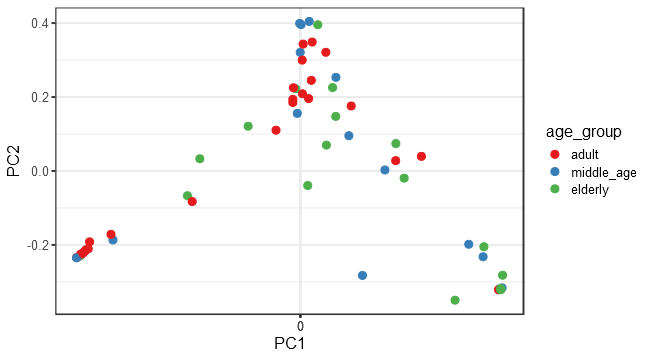

# Ordination


## *Principal Coordinates Analysis (PCoA)*

* Ordination method: PCoA
* Dissimilarity measure: jaccard



# PERMANOVA analysis


```r
library(microbiome)
library(ggplot2)
library(dplyr)
pseq <- phy
data = microbiome::meta(phy)
# Pick relative abundances (compositional) and sample metadata 
pseq.rel <- microbiome::transform(pseq, "compositional")
otu <- abundances(pseq.rel)
meta <- meta(pseq.rel)
library(vegan)
library(phyloseq)
#adonis(t(otu_table(phy)) ~ Diet + Geographical_location + Age, data = meta(phy), permutations=99, method = "bray")
res <- adonis(t(otu_table(phy)) ~ Diet + Geographical_location + age_group, data = meta(phy), permutations=99, method = "bray")
print(res)
```

```
## 
## Call:
## adonis(formula = t(otu_table(phy)) ~ Diet + Geographical_location +      age_group, data = meta(phy), permutations = 99, method = "bray") 
## 
## Permutation: free
## Number of permutations: 99
## 
## Terms added sequentially (first to last)
## 
##                       Df SumsOfSqs MeanSqs F.Model      R2 Pr(>F)   
## Diet                   1    0.3745 0.37445 0.95573 0.01605   0.45   
## Geographical_location  2    1.7028 0.85138 2.17301 0.07299   0.01 **
## age_group              2    0.8792 0.43960 1.12202 0.03769   0.21   
## Residuals             52   20.3734 0.39180         0.87328          
## Total                 57   23.3298                 1.00000          
## ---
## Signif. codes:  0 '***' 0.001 '**' 0.01 '*' 0.05 '.' 0.1 ' ' 1
```

# DESeq2


```
## Error in eval(expr, envir, enclos): object 'full.names' not found
```


| log2FoldChange|      padj|taxon   |
|--------------:|---------:|:-------|
|       5.698115| 0.0000001|OTU2172 |
|      -2.673359| 0.0045704|OTU1680 |
|      -3.183697| 0.0082460|OTU2529 |
|      -2.593370| 0.1838509|OTU1075 |
|      -3.274485| 0.2419627|OTU251  |
