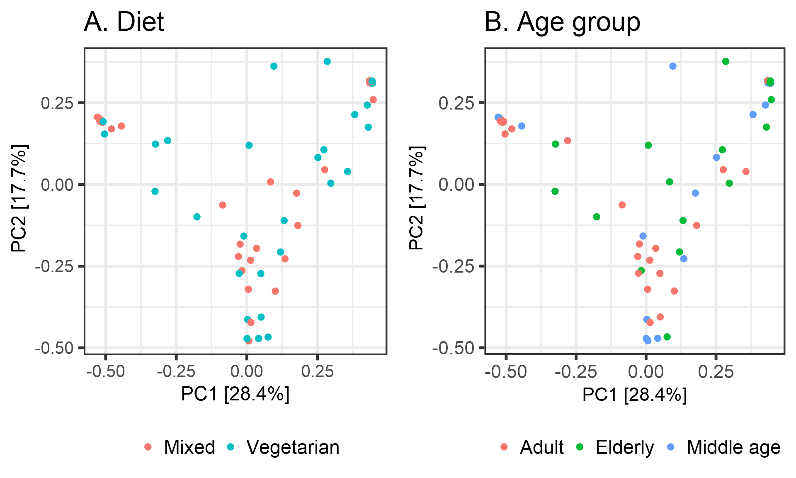

# Ordination


## *Principal Coordinates Analysis (PCoA)*

* Ordination method: PCoA
* Dissimilarity measure: bray



# PERMANOVA analysis


```r
res <- adonis(t(otu_table(phy)) ~ Diet + Geographical_location + age_group,
         data = meta(phy),
	 permutations=99,
	 method = "bray")
print(res)
```

```
## 
## Call:
## adonis(formula = t(otu_table(phy)) ~ Diet + Geographical_location +      age_group, data = meta(phy), permutations = 99, method = "bray") 
## 
## Permutation: free
## Number of permutations: 99
## 
## Terms added sequentially (first to last)
## 
##                       Df SumsOfSqs MeanSqs F.Model      R2 Pr(>F)   
## Diet                   1    0.3745 0.37445 0.95573 0.01605   0.49   
## Geographical_location  2    1.7028 0.85138 2.17301 0.07299   0.01 **
## age_group              2    0.8792 0.43960 1.12202 0.03769   0.31   
## Residuals             52   20.3734 0.39180         0.87328          
## Total                 57   23.3298                 1.00000          
## ---
## Signif. codes:  0 '***' 0.001 '**' 0.01 '*' 0.05 '.' 0.1 ' ' 1
```

# Differential abundance analysis


|taxon   |      padj|full_name                                                                                          |
|:-------|---------:|:--------------------------------------------------------------------------------------------------|
|OTU1137 | 0.0004564|Bacteria_Firmicutes_Bacilli_Bacillales_Bacillaceae_Halobacillus                                    |
|OTU1980 | 0.0005883|Bacteria_Firmicutes_Bacilli_Bacillales_Sporolactobacillaceae_Pullulanibacillus                     |
|OTU1053 | 0.0009277|Bacteria_Firmicutes_Bacilli_Lactobacillales_Leuconostocaceae_Fructobacillus                        |
|OTU860  | 0.0014029|Bacteria_Firmicutes_Negativicutes_Selenomonadales_Sporomusaceae_Desulfosporomusa                   |
|OTU611  | 0.0029045|Bacteria_Fibrobacteres_Chitinispirillia _Chitinispirillales _Chitinispirillaceae_Chitinivibrio     |
|OTU2335 | 0.0033954|Bacteria_Firmicutes_Clostridia_Thermoanaerobacterales_Thermoanaerobacteraceae_Thermoanaerobacter   |
|OTU610  | 0.0052708|Bacteria_Fibrobacteres_Chitinispirillia _Chitinispirillales _Chitinispirillaceae_Chitinispirillum  |
|OTU1429 | 0.0069412|Bacteria_Firmicutes_Bacilli_Bacillales_Thermoactinomycetaceae_Melghirimyces                        |
|OTU2057 | 0.0069827|Bacteria_Firmicutes_Bacilli_Bacillales_Bacillaceae_Salimicrobium                                   |
|OTU2529 | 0.0078574|Bacteria_Firmicutes_Bacilli_Bacillales_Bacillaceae_Virgibacillus                                   |
|OTU1075 | 0.0095364|Bacteria_Firmicutes_Bacilli_Bacillales_Bacillaceae_Geobacillus                                     |
|OTU915  | 0.0124887|Bacteria_Proteobacteria_Gammaproteobacteria_Chromatiales_Ectothiorhodospiraceae_Ectothiorhodospira |
|OTU1223 | 0.0126271|Bacteria_Actinobacteria_Actinobacteria_Micrococcales_Intrasporangiaceae_Janibacter                 |
|OTU211  | 0.0237266|Bacteria_Firmicutes_Bacilli_Bacillales_Bacillaceae_Anoxybacillus                                   |
|OTU15   | 0.0249790|Bacteria_Firmicutes_Negativicutes_Acidaminococcales_Acidaminococcaceae_Acidaminococcus             |
|OTU2283 | 0.0249790|Bacteria_Cyanobacteria_NA_Synechococcales_Synechococcaceae_Synechococcus                           |
|OTU1888 | 0.0250103|Bacteria_Firmicutes_Bacilli_Bacillales_Bacillaceae_Pseudogracilibacillus                           |
|OTU2390 | 0.0295262|Bacteria_Spirochaetes_Spirochaetia_Spirochaetales_Spirochaetaceae_Treponema                        |
|OTU1235 | 0.0297481|Bacteria_Firmicutes_Bacilli_Bacillales_Staphylococcaceae_Jeotgalicoccus                            |
|OTU562  | 0.0388722|Bacteria_Firmicutes_Bacilli_Bacillales_Bacillaceae_Calditerricola                                  |
|OTU1798 | 0.0389941|Bacteria_Actinobacteria_Actinobacteria_Micromonosporales_Micromonosporaceae_Phytomonospora         |
|OTU76   | 0.0470674|Bacteria_Actinobacteria_Actinobacteria_Streptosporangiales_Thermomonosporaceae_Actinomadura        |
|OTU1062 | 0.0788540|Bacteria_Firmicutes_Clostridia_Thermoanaerobacterales_Thermoanaerobacteraceae_Gelria               |
|OTU2153 | 0.0788540|Bacteria_Spirochaetes_Spirochaetia_Spirochaetales_Spirochaetaceae_Spirochaeta                      |
|OTU169  | 0.0795218|Bacteria_Firmicutes_Clostridia_Clostridiales_Eubacteriaceae_Aminicella                             |
|OTU184  | 0.0795218|Bacteria_Actinobacteria_Actinobacteria_Pseudonocardiales_Pseudonocardiaceae_Amycolatopsis          |
|OTU2286 | 0.0795218|Bacteria_Firmicutes_Clostridia_Clostridiales_Peptococcaceae_Syntrophobotulus                       |
|OTU2333 | 0.0795218|Bacteria_Firmicutes_Clostridia_Clostridiales_Peptococcaceae_Thermincola                            |
|OTU2388 | 0.0795218|Bacteria_Actinobacteria_Actinobacteria_Corynebacteriales_NA_Tomitella                              |
|OTU2394 | 0.0795218|Bacteria_Firmicutes_Bacilli_Lactobacillales_Carnobacteriaceae_Trichococcus                         |
|OTU1810 | 0.1017300|Bacteria_Firmicutes_Bacilli_Bacillales_Planococcaceae_Planomicrobium                               |
|OTU1336 | 0.1409617|Bacteria_Firmicutes_Bacilli_Bacillales_Bacillaceae_Lentibacillus                                   |
|OTU922  | 0.1592962|Bacteria_Firmicutes_Clostridia_Clostridiales_Clostridiales Family XIII. Incertae Sedis_Emergencia  |
|OTU2218 | 0.1613689|Bacteria_Firmicutes_Bacilli_Lactobacillales_Streptococcaceae_Streptococcus                         |

