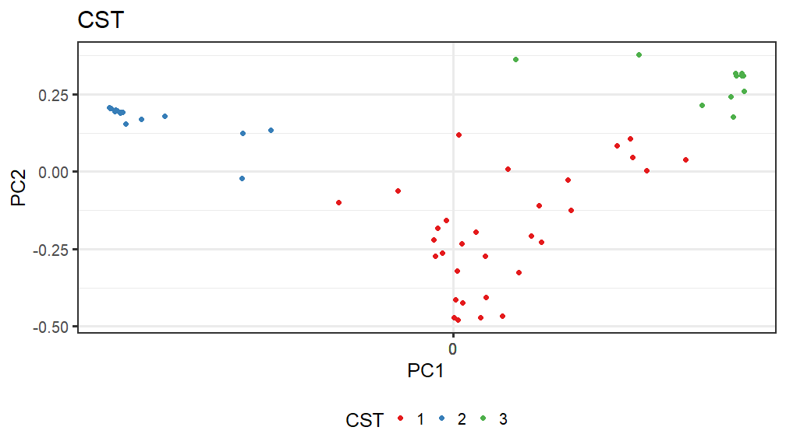

# Ordination


## *Principal Coordinates Analysis (PCoA)*

* Ordination method: PCoA
* Dissimilarity measure: jaccard


```
## Error: Unknown colour name: age_group
```



# PERMANOVA analysis


```r
library(microbiome)
library(ggplot2)
library(dplyr)
pseq <- phy
data = microbiome::meta(phy)
# Pick relative abundances (compositional) and sample metadata 
pseq.rel <- microbiome::transform(pseq, "compositional")
otu <- abundances(pseq.rel)
meta <- meta(pseq.rel)
library(vegan)
library(phyloseq)
#adonis(t(otu_table(phy)) ~ Diet + Geographical_location + Age, data = meta(phy), permutations=99, method = "bray")
res <- adonis(t(otu_table(phy)) ~ Diet + Geographical_location + age_group, data = meta(phy), permutations=99, method = "bray")
```

```
## Error in eval(predvars, data, env): object 'age_group' not found
```

```r
print(res)
```

```
## Error in print(res): object 'res' not found
```

# DESeq2


```
## Error in eval(expr, envir, enclos): object 'full.names' not found
```


| log2FoldChange|      padj|taxon   |
|--------------:|---------:|:-------|
|       5.698115| 0.0000001|OTU2172 |
|      -2.673359| 0.0045704|OTU1680 |
|      -3.183697| 0.0082460|OTU2529 |
|      -2.593370| 0.1838509|OTU1075 |
|      -3.274485| 0.2419627|OTU251  |
