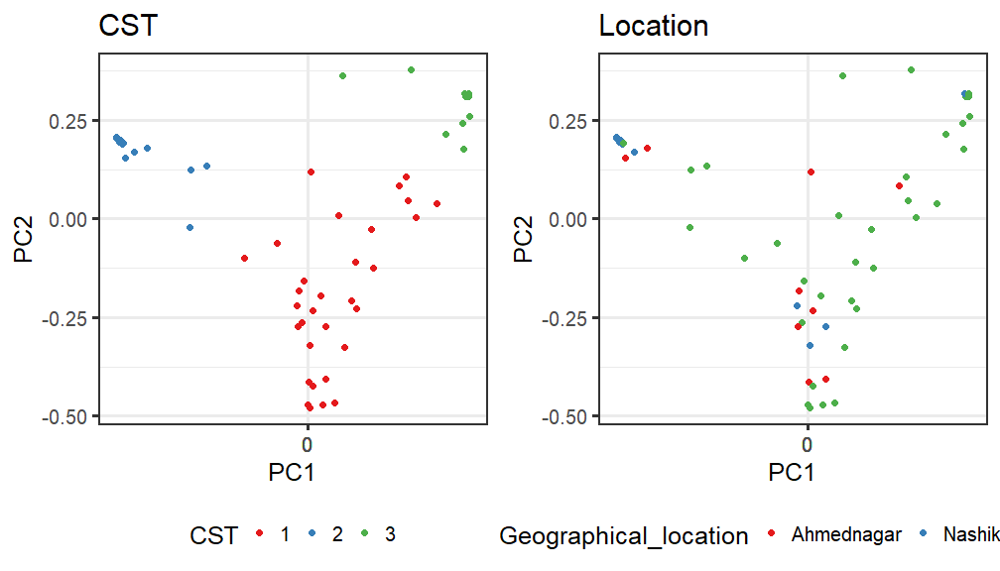

# Ordination


## *Principal Coordinates Analysis (PCoA)*

* Ordination method: PCoA
* Dissimilarity measure: jaccard


```
## Warning: Position guide is perpendicular to the intended axis. Did you mean to specify a different guide `position`?

## Warning: Position guide is perpendicular to the intended axis. Did you mean to specify a different guide `position`?

## Warning: Position guide is perpendicular to the intended axis. Did you mean to specify a different guide `position`?
```



#PERMANOVA analysis


```r
library(microbiome)
library(ggplot2)
library(dplyr)
pseq <- phy
data = microbiome::meta(phy)
# Pick relative abundances (compositional) and sample metadata 
pseq.rel <- microbiome::transform(pseq, "compositional")
otu <- abundances(pseq.rel)
meta <- meta(pseq.rel)
library(vegan)
library(phyloseq)
#adonis(t(otu_table(phy)) ~ Diet + Geographical_location + Age, data = meta(phy), permutations=99, method = "bray")
adonis(t(otu_table(phy)) ~ meta(phy)$Diet + meta(phy)$Geographical_location + meta(phy)$age_group, data = meta(phy), permutations=99, method = "bray")
```

```
## 
## Call:
## adonis(formula = t(otu_table(phy)) ~ meta(phy)$Diet + meta(phy)$Geographical_location +      meta(phy)$age_group, data = meta(phy), permutations = 99,      method = "bray") 
## 
## Permutation: free
## Number of permutations: 99
## 
## Terms added sequentially (first to last)
## 
##                                 Df SumsOfSqs MeanSqs F.Model      R2 Pr(>F)   
## meta(phy)$Diet                   1    0.3745 0.37445 0.95573 0.01605   0.59   
## meta(phy)$Geographical_location  2    1.7028 0.85138 2.17301 0.07299   0.01 **
## meta(phy)$age_group              2    0.8792 0.43960 1.12202 0.03769   0.28   
## Residuals                       52   20.3734 0.39180         0.87328          
## Total                           57   23.3298                 1.00000          
## ---
## Signif. codes:  0 '***' 0.001 '**' 0.01 '*' 0.05 '.' 0.1 ' ' 1
```

#DESeq2


| log2FoldChange|      padj|taxon   |full_name                                                                        |
|--------------:|---------:|:-------|:--------------------------------------------------------------------------------|
|       5.698115| 0.0000001|OTU2172 |Bacteria_Firmicutes_Bacilli_Bacillales_Staphylococcaceae_Staphylococcus          |
|      -2.673359| 0.0045704|OTU1680 |Bacteria_Firmicutes_Bacilli_Bacillales_Paenibacillaceae _Paenibacillus           |
|      -3.183697| 0.0082460|OTU2529 |Bacteria_Firmicutes_Bacilli_Bacillales_Bacillaceae_Virgibacillus                 |
|      -2.593370| 0.1838509|OTU1075 |Bacteria_Firmicutes_Bacilli_Bacillales_Bacillaceae_Geobacillus                   |
|      -3.274485| 0.2419627|OTU251  |Bacteria_Actinobacteria_Actinobacteria_Micrococcales_Micrococcaceae_Arthrobacter |
