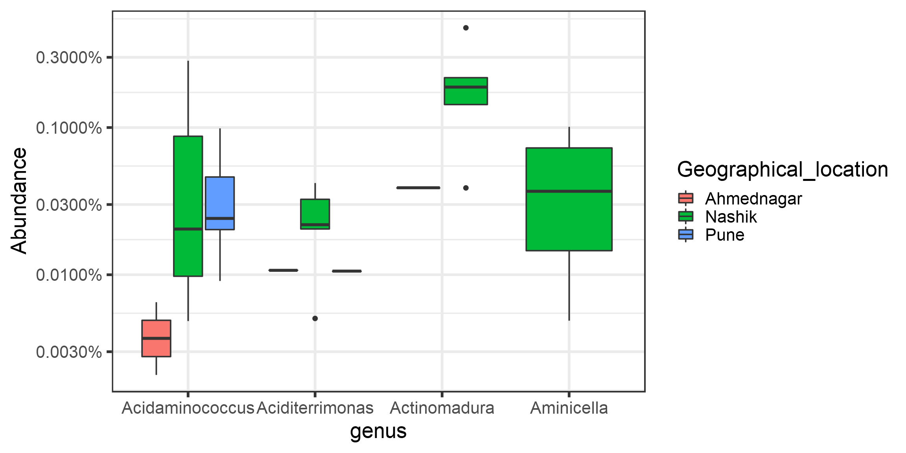

# Analysis


## Alpha diversity analysis

Diversity index: diversity_shannon


```
## [1] TRUE
```

```
## [1] TRUE
```


|           |        z|         f|
|:----------|--------:|---------:|
|Ahmednagar | 1.484529| 0.8822138|
|Nashik     | 1.271455| 0.7312206|
|Pune       | 1.176848| 0.6908416|


```
## 
## 	Kruskal-Wallis rank sum test
## 
## data:  index by factor(Geographical_location)
## Kruskal-Wallis chi-squared = 0.94558, df = 2, p-value = 0.6233
```


## investigating top factors


```
## [1] "OTU15"  "OTU22"  "OTU76"  "OTU169"
```




## Differential abundance analysis (with ANCOM)

In [jointanalysis.md](jointanalysis.md) it was shown that geographical location has a significant effect.

Here, we investigate individual taxonomic groups in more detail.

For community comparison, see [CSTAnalysis_SkinSamples.md](CSTAnalysis_SkinSamples.md)

Significant (or marginally significant) taxa between geographical locations.


```
## Error in library(compositions): there is no package called 'compositions'
```

```
## Error in feature_table_pre_process(feature_table, meta_data, sample_var, : could not find function "feature_table_pre_process"
```

```
## Error in eval(expr, envir, enclos): object 'prepro' not found
```

```
## Error in eval(expr, envir, enclos): object 'prepro' not found
```

```
## Error in eval(expr, envir, enclos): object 'prepro' not found
```

```
## Error in ANCOM(feature_table, meta_data, struc_zero, main_var, p_adj_method, : could not find function "ANCOM"
```

```
## Error in UseMethod("arrange"): no applicable method for 'arrange' applied to an object of class "NULL"
```

```
## Error in eval(expr, envir, enclos): object 'res.sorted' not found
```

```
## Error in head(res.sorted): object 'res.sorted' not found
```

```
## Error in eval(expr, envir, enclos): object 'top.taxa' not found
```


```
## Error in `$<-.data.frame`(S3Part(x, TRUE), name, value): replacement has 674 rows, data has 58
```

