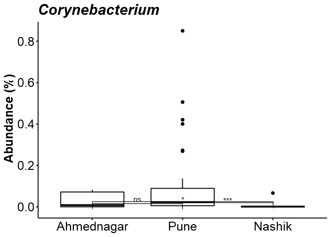
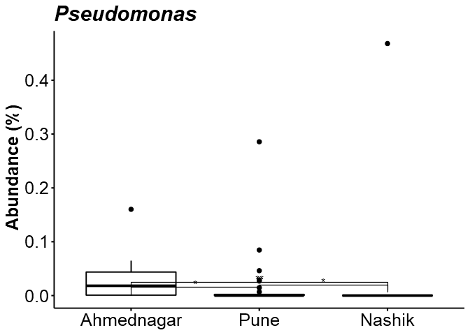
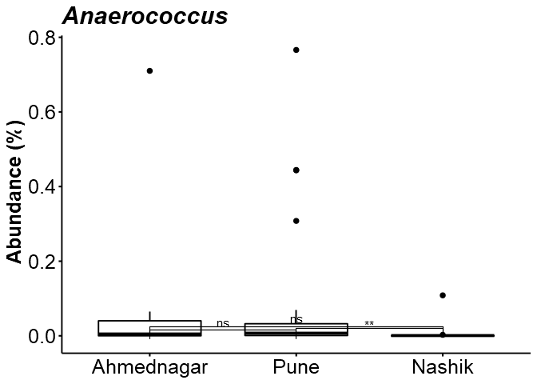

# Analysis


## Alpha diversity analysis

Diversity index: diversity_shannon


```
## [1] TRUE
```

```
## [1] TRUE
```


|           |        z|         f|
|:----------|--------:|---------:|
|Ahmednagar | 1.484529| 0.8822138|
|Nashik     | 1.271455| 0.7312206|
|Pune       | 1.176848| 0.6908416|


```
## 
## 	Kruskal-Wallis rank sum test
## 
## data:  index by factor(Geographical_location)
## Kruskal-Wallis chi-squared = 0.94558, df = 2, p-value = 0.6233
```


## Differential abundance analysis (with ANCOM)

In [jointanalysis.md](jointanalysis.md) it was shown that geographical location has a significant effect.

Here, we investigate individual taxonomic groups in more detail.

For community comparison, see [CSTAnalysis_SkinSamples.md](CSTAnalysis_SkinSamples.md)

Significant (or marginally significant) taxa between geographical locations.


```
##   taxa_id   W detected_0.9 detected_0.8 detected_0.7 detected_0.6
## 1 OTU1075 273         TRUE         TRUE         TRUE         TRUE
## 2 OTU2529 271         TRUE         TRUE         TRUE         TRUE
## 3  OTU773 267         TRUE         TRUE         TRUE         TRUE
## 4 OTU1235 267         TRUE         TRUE         TRUE         TRUE
## 5 OTU2172 265         TRUE         TRUE         TRUE         TRUE
## 6 OTU1893 263         TRUE         TRUE         TRUE         TRUE
```




```
## Error in `$<-.data.frame`(S3Part(x, TRUE), name, value): replacement has 674 rows, data has 58
```

