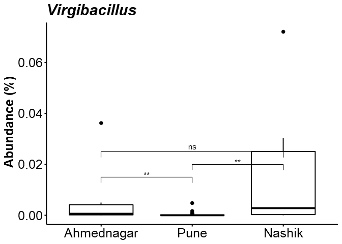
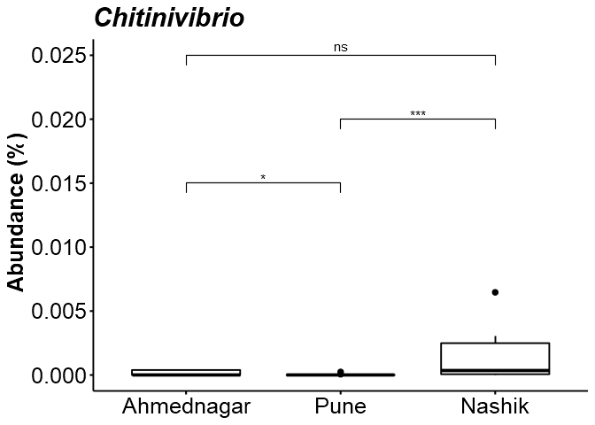

# Analysis

## Alpha diversity analysis

Diversity index: diversity\_shannon

    ## [1] TRUE

    ## [1] TRUE

<table>
<thead>
<tr class="header">
<th style="text-align: left;"></th>
<th style="text-align: right;">z</th>
<th style="text-align: right;">f</th>
</tr>
</thead>
<tbody>
<tr class="odd">
<td style="text-align: left;">Ahmednagar</td>
<td style="text-align: right;">1.484529</td>
<td style="text-align: right;">0.8822138</td>
</tr>
<tr class="even">
<td style="text-align: left;">Nashik</td>
<td style="text-align: right;">1.271455</td>
<td style="text-align: right;">0.7312206</td>
</tr>
<tr class="odd">
<td style="text-align: left;">Pune</td>
<td style="text-align: right;">1.176848</td>
<td style="text-align: right;">0.6908416</td>
</tr>
</tbody>
</table>

    ## 
    ##  Kruskal-Wallis rank sum test
    ## 
    ## data:  index by factor(Geographical_location)
    ## Kruskal-Wallis chi-squared = 0.94558, df = 2, p-value = 0.6233

## Phyla level individual relative abundance bar graph

## Differential abundance analysis (with ANCOM)

In [jointanalysis.md](jointanalysis.md) it was shown that geographical
location has a significant effect.

Here, we investigate individual taxonomic groups in more detail.

For community comparison, see
[CSTAnalysis\_SkinSamples.md](CSTAnalysis_SkinSamples.md)

Significant (or marginally significant) taxa between geographical
locations.

Dunn test was performed for pairwise comparisons on significant taxa.

    ##   taxa_id   W detected_0.9 detected_0.8 detected_0.7 detected_0.6
    ## 1 OTU1075 273         TRUE         TRUE         TRUE         TRUE
    ## 2 OTU2529 271         TRUE         TRUE         TRUE         TRUE
    ## 3  OTU773 267         TRUE         TRUE         TRUE         TRUE
    ## 4 OTU1235 267         TRUE         TRUE         TRUE         TRUE
    ## 5 OTU2172 265         TRUE         TRUE         TRUE         TRUE
    ## 6 OTU1893 263         TRUE         TRUE         TRUE         TRUE

