# Analysis


# Alpha diversity analysis


# Group-wise comparisons

Diversity index: diversity_shannon


# Ordination


## Principal Coordinates Analysis (PCoA)

* Ordination method: PCoA
* Dissimilarity measure: bray

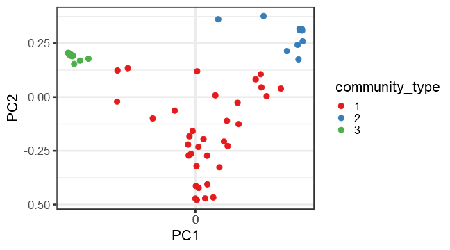


# Community composition (with PERMANOVA)


```r
library(microbiome)
library(ggplot2)
library(dplyr)

pseq <- phy# Rename the example data
data = microbiome::meta(phy)
# Pick relative abundances (compositional) and sample metadata 
pseq.rel <- microbiome::transform(pseq, "compositional")
otu <- abundances(pseq.rel)
meta <- meta(pseq.rel)
library(vegan)
library(phyloseq)
permanova <- adonis(t(otu) ~ Geographical_location,
               data = meta(phy), permutations=99, method = distance)

# P-value
print(as.data.frame(permanova$aov.tab)["Geographical_location", "Pr(>F)"])
```

```
## [1] 0.01
```

```r
# Check beta dispersion - is this OK?
dist <- vegdist(t(otu))
anova(betadisper(dist, meta$Geographical_location))
```

```
## Analysis of Variance Table
## 
## Response: Distances
##           Df  Sum Sq Mean Sq F value Pr(>F)
## Groups     2 0.15882 0.07941  1.7537 0.1827
## Residuals 55 2.49040 0.04528
```


# Investigate the top factors


```r
library(vegan)

coef1 <- coefficients(permanova)["Geographical_location1", ]
top.coef1 <- coef1[rev(order(abs(coef1)))[1:20]]
names(top.coef1) <- full.names[names(top.coef1)]

coef2 <- coefficients(permanova)["Geographical_location2", ]
top.coef2 <- coef2[rev(order(abs(coef2)))[1:20]]
names(top.coef2) <- full.names[names(top.coef2)]

par(mar = c(3, 20, 2, 1), mfrow = 2)
```

```
## Error in par(mar = c(3, 20, 2, 1), mfrow = 2): graphical parameter "mfrow" has the wrong length
```

```r
barplot(sort(top.coef1), horiz = T, las = 1, main = "Top taxa / 1")
```


```r
barplot(sort(top.coef2), horiz = T, las = 1, main = "Top taxa / 2")
```


## Differential abundance analysis (with Kruskal-Wallis test)

Significant (or marginally signifiant) taxa between geographical locations.


|taxon   |      padj|full_name                                                                                          |
|:-------|---------:|:--------------------------------------------------------------------------------------------------|
|OTU1137 | 0.0004564|Bacteria_Firmicutes_Bacilli_Bacillales_Bacillaceae_Halobacillus                                    |
|OTU1980 | 0.0005883|Bacteria_Firmicutes_Bacilli_Bacillales_Sporolactobacillaceae_Pullulanibacillus                     |
|OTU1053 | 0.0009277|Bacteria_Firmicutes_Bacilli_Lactobacillales_Leuconostocaceae_Fructobacillus                        |
|OTU860  | 0.0014029|Bacteria_Firmicutes_Negativicutes_Selenomonadales_Sporomusaceae_Desulfosporomusa                   |
|OTU611  | 0.0029045|Bacteria_Fibrobacteres_Chitinispirillia _Chitinispirillales _Chitinispirillaceae_Chitinivibrio     |
|OTU2335 | 0.0033954|Bacteria_Firmicutes_Clostridia_Thermoanaerobacterales_Thermoanaerobacteraceae_Thermoanaerobacter   |
|OTU610  | 0.0052708|Bacteria_Fibrobacteres_Chitinispirillia _Chitinispirillales _Chitinispirillaceae_Chitinispirillum  |
|OTU1429 | 0.0069412|Bacteria_Firmicutes_Bacilli_Bacillales_Thermoactinomycetaceae_Melghirimyces                        |
|OTU2057 | 0.0069827|Bacteria_Firmicutes_Bacilli_Bacillales_Bacillaceae_Salimicrobium                                   |
|OTU2529 | 0.0078574|Bacteria_Firmicutes_Bacilli_Bacillales_Bacillaceae_Virgibacillus                                   |
|OTU1075 | 0.0095364|Bacteria_Firmicutes_Bacilli_Bacillales_Bacillaceae_Geobacillus                                     |
|OTU915  | 0.0124887|Bacteria_Proteobacteria_Gammaproteobacteria_Chromatiales_Ectothiorhodospiraceae_Ectothiorhodospira |
|OTU1223 | 0.0126271|Bacteria_Actinobacteria_Actinobacteria_Micrococcales_Intrasporangiaceae_Janibacter                 |
|OTU211  | 0.0237266|Bacteria_Firmicutes_Bacilli_Bacillales_Bacillaceae_Anoxybacillus                                   |
|OTU15   | 0.0249790|Bacteria_Firmicutes_Negativicutes_Acidaminococcales_Acidaminococcaceae_Acidaminococcus             |
|OTU2283 | 0.0249790|Bacteria_Cyanobacteria_NA_Synechococcales_Synechococcaceae_Synechococcus                           |
|OTU1888 | 0.0250103|Bacteria_Firmicutes_Bacilli_Bacillales_Bacillaceae_Pseudogracilibacillus                           |
|OTU2390 | 0.0295262|Bacteria_Spirochaetes_Spirochaetia_Spirochaetales_Spirochaetaceae_Treponema                        |
|OTU1235 | 0.0297481|Bacteria_Firmicutes_Bacilli_Bacillales_Staphylococcaceae_Jeotgalicoccus                            |
|OTU562  | 0.0388722|Bacteria_Firmicutes_Bacilli_Bacillales_Bacillaceae_Calditerricola                                  |
|OTU1798 | 0.0389941|Bacteria_Actinobacteria_Actinobacteria_Micromonosporales_Micromonosporaceae_Phytomonospora         |
|OTU76   | 0.0470674|Bacteria_Actinobacteria_Actinobacteria_Streptosporangiales_Thermomonosporaceae_Actinomadura        |
|OTU1062 | 0.0788540|Bacteria_Firmicutes_Clostridia_Thermoanaerobacterales_Thermoanaerobacteraceae_Gelria               |
|OTU2153 | 0.0788540|Bacteria_Spirochaetes_Spirochaetia_Spirochaetales_Spirochaetaceae_Spirochaeta                      |
|OTU169  | 0.0795218|Bacteria_Firmicutes_Clostridia_Clostridiales_Eubacteriaceae_Aminicella                             |
|OTU184  | 0.0795218|Bacteria_Actinobacteria_Actinobacteria_Pseudonocardiales_Pseudonocardiaceae_Amycolatopsis          |
|OTU2286 | 0.0795218|Bacteria_Firmicutes_Clostridia_Clostridiales_Peptococcaceae_Syntrophobotulus                       |
|OTU2333 | 0.0795218|Bacteria_Firmicutes_Clostridia_Clostridiales_Peptococcaceae_Thermincola                            |
|OTU2388 | 0.0795218|Bacteria_Actinobacteria_Actinobacteria_Corynebacteriales_NA_Tomitella                              |
|OTU2394 | 0.0795218|Bacteria_Firmicutes_Bacilli_Lactobacillales_Carnobacteriaceae_Trichococcus                         |
|OTU1810 | 0.1017300|Bacteria_Firmicutes_Bacilli_Bacillales_Planococcaceae_Planomicrobium                               |
|OTU1336 | 0.1409617|Bacteria_Firmicutes_Bacilli_Bacillales_Bacillaceae_Lentibacillus                                   |
|OTU922  | 0.1592962|Bacteria_Firmicutes_Clostridia_Clostridiales_Clostridiales Family XIII. Incertae Sedis_Emergencia  |
|OTU2218 | 0.1613689|Bacteria_Firmicutes_Bacilli_Lactobacillales_Streptococcaceae_Streptococcus                         |

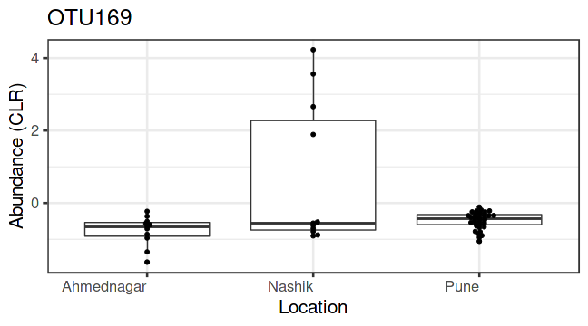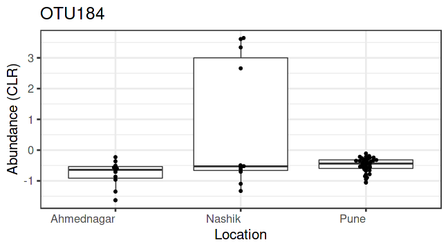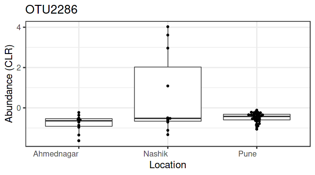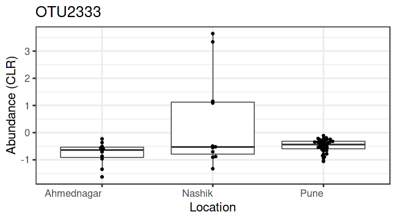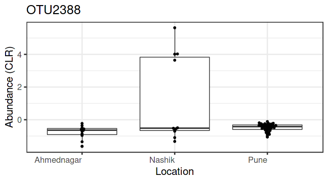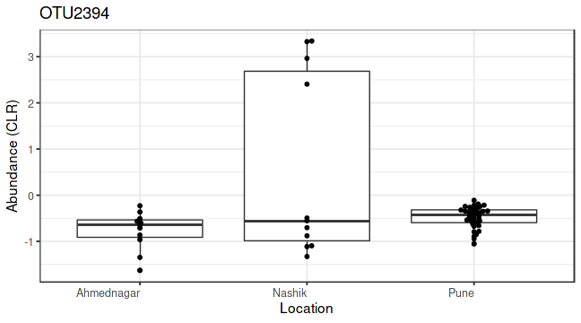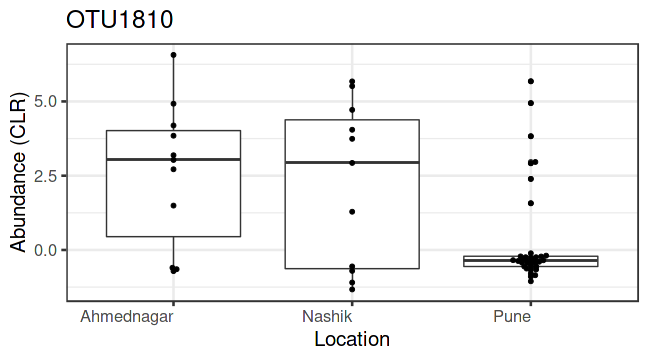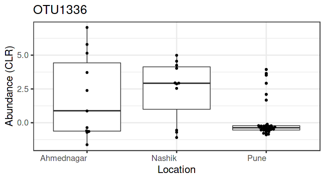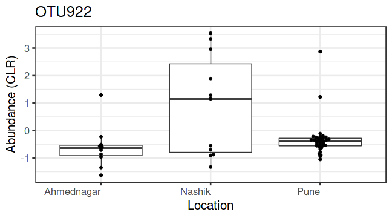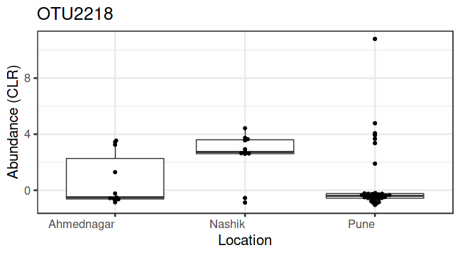


