# Analysis


## Alpha diversity analysis

Diversity index: diversity_shannon


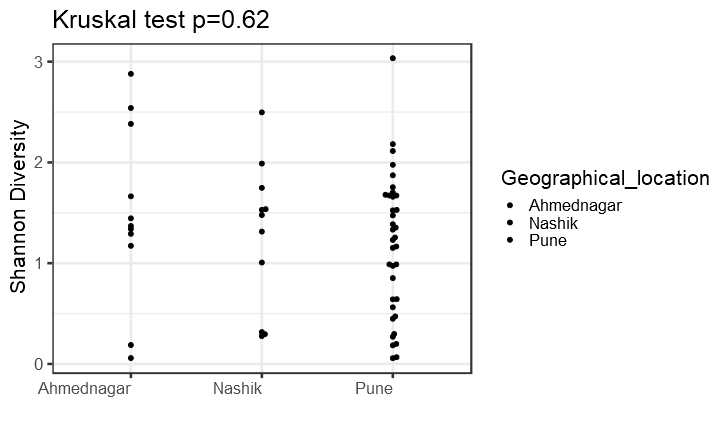


## Differential abundance analysis (with Kruskal-Wallis test)

In (jointanalysis.md) it was shown that geographical location has a significant effect.

Here, we investigate individual taxonomic groups in more detail.

Significant (or marginally significant) taxa between geographical locations.


|taxon   |      padj|full_name                                                                                            |
|:-------|---------:|:----------------------------------------------------------------------------------------------------|
|OTU2371 | 0.0150093|Bacteria_Firmicutes_Bacilli_Bacillales_Thermoactinomycetaceae_Polycladomyces                         |
|OTU1278 | 0.0532573|Bacteria_Planctomycetes_Planctomycetia_Pirellulales_Lacipirellulaceae_Bythopirellula                 |
|OTU1117 | 0.0582690|Bacteria_Proteobacteria_Alphaproteobacteria_Rhodobacterales_Rhodobacteraceae_Amaricoccus             |
|OTU1052 | 0.0763694|Bacteria_Actinobacteria_Actinobacteria_Actinopolysporales_Actinopolysporaceae_Actinopolyspora        |
|OTU1464 | 0.0763694|Bacteria_Proteobacteria_Deltaproteobacteria_DesulfoVibrionales_Desulfohalobiaceae_Desulfohalobium    |
|OTU2361 | 0.0794871|Bacteria_Proteobacteria_Deltaproteobacteria_Myxococcales_Nannocystaceae_Plesiocystis                 |
|OTU1197 | 0.0922708|Bacteria_Actinobacteria_Actinobacteria_Micrococcales_Micrococcaceae_Arthrobacter                     |
|OTU773  | 0.1175187|Bacteria_Actinobacteria_Actinobacteria_Micrococcales_Intrasporangiaceae_Tetrasphaera                 |
|OTU798  | 0.1422688|Bacteria_Firmicutes_Bacilli_Bacillales_Bacillaceae_Thalassobacillus                                  |
|OTU1002 | 0.1501257|Bacteria_Firmicutes_Clostridia_Clostridiales_Eubacteriaceae_Acetobacterium                           |
|OTU1449 | 0.1526400|Bacteria_Firmicutes_Clostridia_Clostridiales_Peptococcaceae_Desulfitibacter                          |
|OTU2399 | 0.1549577|Bacteria_Proteobacteria_Gammaproteobacteria_Enterobacterales _Morganellaceae_Proteocatella           |
|OTU1034 | 0.1802795|Bacteria_Proteobacteria_Acidithiobacillia_AcidithioBacillales_Acidithiobacillaceae_Acidithiobacillus |
|OTU2302 | 0.1930876|Bacteria_Firmicutes_Bacilli_Bacillales_Bacillaceae_Paucisalibacillus                                 |
|OTU1987 | 0.1961432|Bacteria_Bacteroidetes_Bacteroidia_Bacteroidales_Porphyromonadaceae_Lascolabacillus                  |
|OTU179  | 0.1973502|Bacteria_Actinobacteria_Actinobacteria_Micrococcales_Ruaniaceae_Haloactinobacterium                  |
|OTU154  | 0.1987752|Bacteria_Proteobacteria_Alphaproteobacteria_Rhizobiales_Rhizobiaceae_Ensifer                         |
|OTU1044 | 0.2098130|Bacteria_Actinobacteria_Actinobacteria_Streptosporangiales_Thermomonosporaceae_Actinocorallia        |
|OTU1194 | 0.2156831|Bacteria_Actinobacteria_Actinobacteria_Micrococcales_Intrasporangiaceae_Arsenicicoccus               |
|OTU623  | 0.2209866|Bacteria_Proteobacteria_Gammaproteobacteria_Aeromonadales_Succinivibrionaceae_Succinatimonas         |
|OTU1992 | 0.2330126|Bacteria_Proteobacteria_Gammaproteobacteria_Legionellales_Legionellaceae_Legionella                  |
|OTU1445 | 0.2334239|Bacteria_Firmicutes_Bacilli_Lactobacillales_Carnobacteriaceae_Desemzia                               |
|OTU570  | 0.2452140|Bacteria_Proteobacteria_Alphaproteobacteria_Rhodobacterales_Rhodobacteraceae_Siccibacter             |
|OTU272  | 0.2490892|Bacteria_Proteobacteria_Alphaproteobacteria_Rhodospirillales_Rhodospirillaceae_Rhodospirillaceae     |

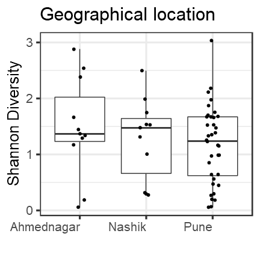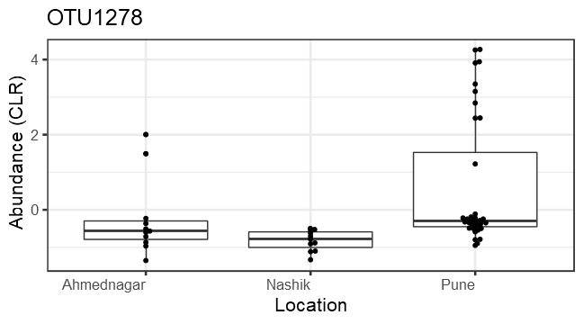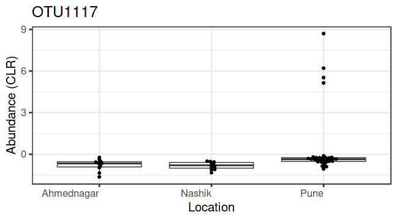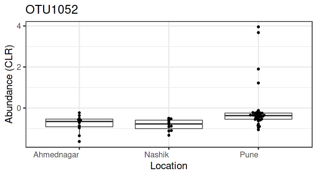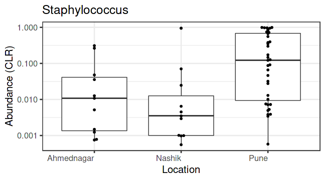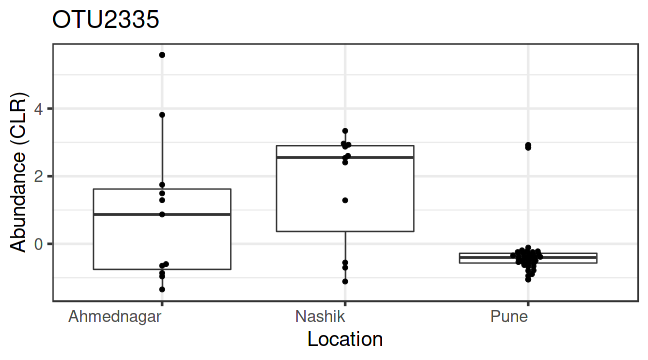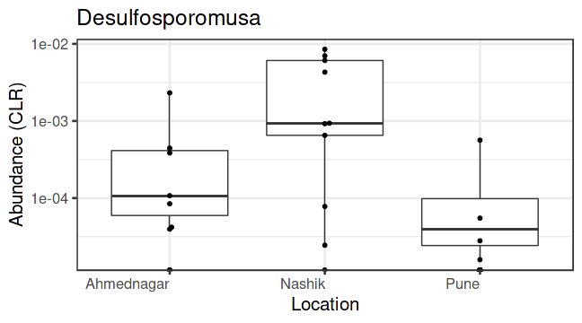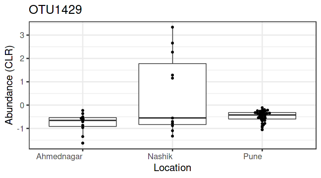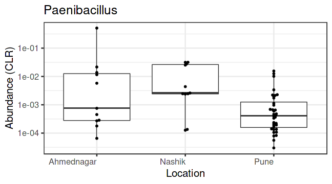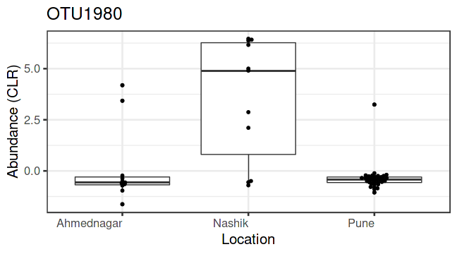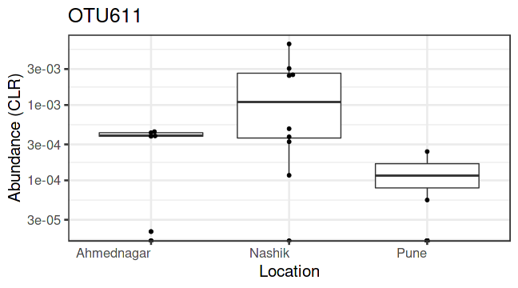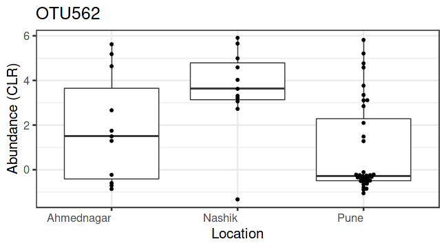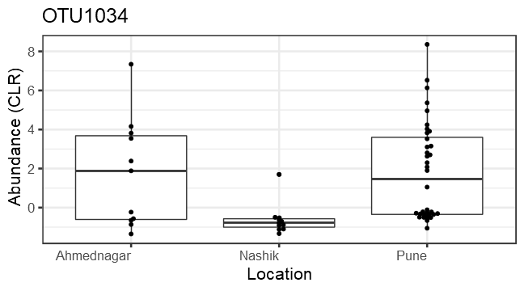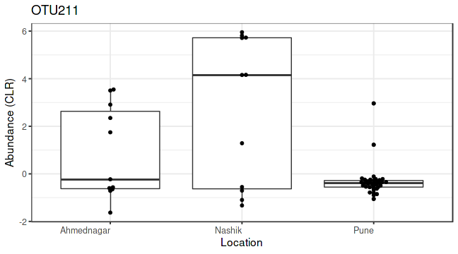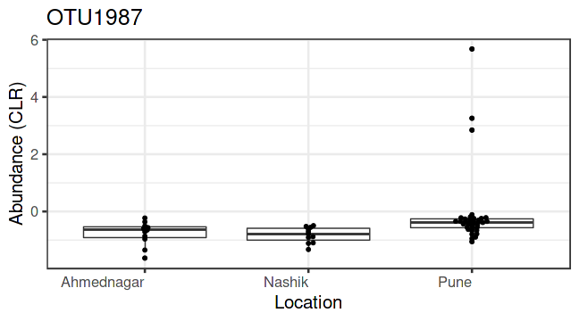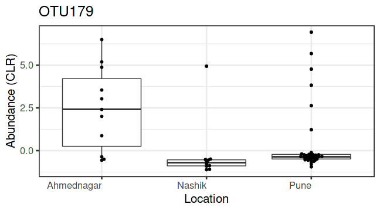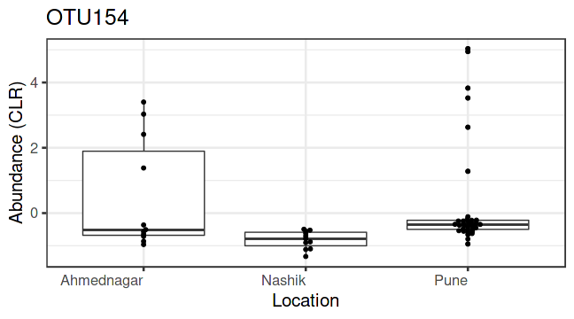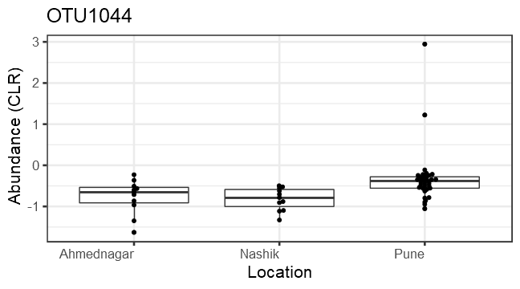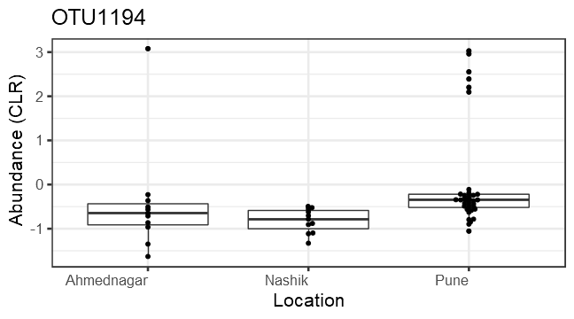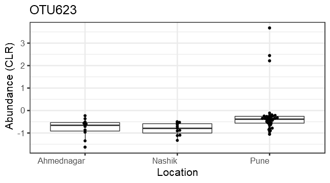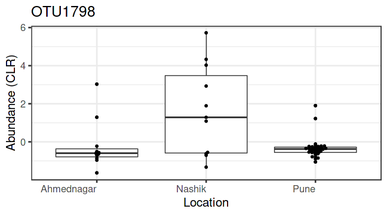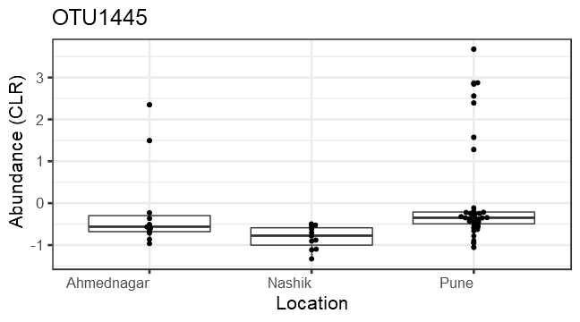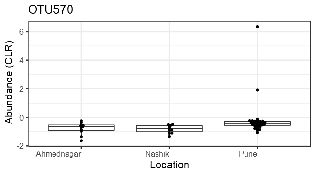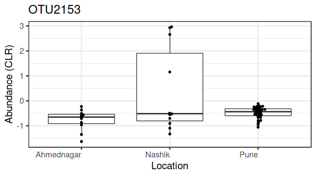


```
##      rn    OTU2371    OTU1278    OTU1117    OTU1052    OTU1464    OTU2361    OTU1197     OTU773     OTU798    OTU1002    OTU1449    OTU2399    OTU1034    OTU2302    OTU1987     OTU179     OTU154
##  1:  I1 -0.5072724 -0.5072724 -0.5072724 -0.5072724 -0.5072724 -0.5072724 -0.5072724  9.0536222 -0.5072724 -0.5072724 -0.5072724 -0.5072724  2.3861006 -0.5072724 -0.5072724 -0.5072724 -0.5072724
##  2:  I2 -0.3637324 -0.3637324 -0.3637324 -0.3637324 -0.3637324 -0.3637324 -0.3637324  6.7709271 -0.3637324 -0.3637324 -0.3637324 -0.3637324  1.8845033 -0.3637324 -0.3637324 -0.3637324 -0.3637324
##  3:  I3  4.1605822 -0.5986695 -0.5986695 -0.5986695 -0.5986695 -0.5986695 -0.5986695  7.9133744 -0.5986695  2.4107898 -0.5986695 -0.5986695  7.3441757 -0.5986695 -0.5986695  2.4107898  2.4107898
##  4:  I4 -0.3222889 -0.3222889 -0.3222889 -0.3222889 -0.3222889 -0.3222889 -0.3222889 10.5974151 -0.3222889 -0.3222889 -0.3222889 -0.3222889 -0.3222889 -0.3222889 -0.3222889 -0.3222889 -0.3222889
##  5:  I5  2.4406429  2.4406429 -0.4481249 -0.4481249 -0.4481249 -0.4481249 -0.4481249  7.8085996 -0.4481249 -0.4481249 -0.4481249 -0.4481249  3.1055733 -0.4481249 -0.4481249 -0.4481249 -0.4481249
##  6:  I6 -0.1912751 -0.1912751 -0.1912751 -0.1912751 -0.1912751 -0.1912751 -0.1912751  5.0455496 -0.1912751 -0.1912751 -0.1912751 -0.1912751  2.0809561 -0.1912751 -0.1912751 -0.1912751 -0.1912751
##  7:  I7  3.5036941 -0.8632492 -0.8632492 -0.8632492 -0.8632492 -0.8632492 -0.8632492  4.1904761 -0.8632492 -0.8632492 -0.8632492 -0.8632492 -0.8632492 -0.8632492 -0.8632492  4.8804254 -0.8632492
##  8:  I8 -0.2283286 -0.2283286 -0.2283286 -0.2283286 -0.2283286  0.8702837 -0.2283286  3.8825452 -0.2283286 -0.2283286 -0.2283286 -0.2283286 -0.2283286 -0.2283286 -0.2283286  0.8702837  1.3811093
##  9:  I9  4.4915919 -0.5648110 -0.5648110 -0.5648110 -0.5648110 -0.5648110 -0.5648110  6.7884289 -0.5648110 -0.5648110 -0.5648110 -0.5648110 -0.5648110 -0.5648110 -0.5648110 -0.5648110 -0.5648110
## 10: I10  3.3697020  4.2564954 -0.3851798 -0.3851798 -0.3851798  1.0522677 -0.3851798  5.4934041 -0.3851798 -0.3851798 -0.3851798 -0.3851798  1.0522677 -0.3851798 -0.3851798 -0.3851798 -0.3851798
## 11: I11  3.3495187  3.3495187 -0.3432811 -0.3432811 -0.3432811 -0.3432811 -0.3432811  5.2738530 -0.3432811 -0.3432811 -0.3432811 -0.3432811  4.0301366 -0.3432811 -0.3432811 -0.3432811 -0.3432811
## 12: I12 -0.4951364 -0.4951364 -0.4951364 -0.4951364 -0.4951364 -0.4951364 -0.4951364  4.1084518 -0.4951364 -0.4951364 -0.4951364 -0.4951364 -0.4951364 -0.4951364 -0.4951364 -0.4951364 -0.4951364
## 13: I13 -0.7836849 -0.7836849 -0.7836849 -0.7836849 -0.7836849 -0.7836849 -0.7836849 -0.7836849 -0.7836849 -0.7836849 -0.7836849 -0.7836849 -0.7836849 -0.7836849 -0.7836849 -0.7836849 -0.7836849
## 14: I14  1.1201296 -0.2205354 -0.2205354 -0.2205354 -0.2205354 -0.2205354 -0.2205354  3.8300607 -0.2205354 -0.2205354 -0.2205354 -0.2205354 -0.2205354 -0.2205354 -0.2205354 -0.2205354 -0.2205354
## 15: I15  2.8788054  1.2227999  5.5255063  1.2227999 -0.6588991  1.2227999  1.8367247  6.5595262 -0.6588991 -0.6588991 -0.6588991 -0.6588991 -0.6588991 -0.6588991 -0.6588991  1.2227999 -0.6588991
## 16: I16 -0.2166252 -0.2166252 -0.2166252 -0.2166252 -0.2166252 -0.2166252 -0.2166252  8.3330796 -0.2166252 -0.2166252 -0.2166252 -0.2166252 -0.2166252 -0.2166252 -0.2166252 -0.2166252 -0.2166252
## 17: I17  2.9194937 -0.3473824 -0.3473824 -0.3473824 -0.3473824 -0.3473824 -0.3473824  7.0083960 -0.3473824 -0.3473824 -0.3473824 -0.3473824 -0.3473824 -0.3473824 -0.3473824 -0.3473824 -0.3473824
## 18: I18 -0.5062156 -0.5062156 -0.5062156 -0.5062156 -0.5062156 -0.5062156 -0.5062156 10.7971219 -0.5062156 -0.5062156 -0.5062156 -0.5062156 -0.5062156 -0.5062156  5.6781897  5.6781897 -0.5062156
## 19: I19 -0.4884266 -0.4884266 -0.4884266 -0.4884266 -0.4884266 -0.4884266 -0.4884266  8.9091121 -0.4884266 -0.4884266 -0.4884266 -0.4884266 -0.4884266 -0.4884266 -0.4884266 -0.4884266 -0.4884266
## 20: I20  4.0610140 -0.3468212 -0.3468212 -0.3468212 -0.3468212 -0.3468212 -0.3468212  9.2277978 -0.3468212 -0.3468212 -0.3468212 -0.3468212 -0.3468212 -0.3468212 -0.3468212 -0.3468212 -0.3468212
## 21: I21 -0.4956468 -0.4956468 -0.4956468  3.6774762 -0.4956468 -0.4956468 -0.4956468  7.7893390 -0.4956468 -0.4956468 -0.4956468 -0.4956468 -0.4956468 -0.4956468 -0.4956468 -0.4956468 -0.4956468
## 22: I22  4.5212284  3.1522292 -0.6260548 -0.6260548 -0.6260548  2.7581302 -0.6260548  5.9636906 -0.6260548 -0.6260548 -0.6260548 -0.6260548  3.1522292 -0.6260548 -0.6260548 -0.6260548 -0.6260548
## 23: I23  5.7277886  3.9416853 -1.0538155 -1.0538155  3.9416853 -1.0538155 -1.0538155  6.3334086 -1.0538155  4.6314426 -1.0538155 -1.0538155 -1.0538155 -1.0538155 -1.0538155  6.9309669  5.0357752
## 24: I24 -0.2435970 -0.2435970 -0.2435970 -0.2435970 -0.2435970 -0.2435970 -0.2435970  5.0320796 -0.2435970 -0.2435970 -0.2435970 -0.2435970  2.8067674 -0.2435970 -0.2435970 -0.2435970 -0.2435970
## 25: I25 -0.2846552 -0.2846552 -0.2846552 -0.2846552 -0.2846552 -0.2846552 -0.2846552  8.7026426 -0.2846552 -0.2846552 -0.2846552 -0.2846552 -0.2846552 -0.2846552 -0.2846552 -0.2846552 -0.2846552
## 26: I26  4.6366064 -0.9626315 -0.9626315 -0.9626315 -0.9626315 -0.9626315 -0.9626315  8.7707878 -0.9626315 -0.9626315 -0.9626315 -0.9626315  3.5453682 -0.9626315 -0.9626315  3.5453682 -0.9626315
## 27: I27  3.5562304  2.0048247 -0.6476661 -0.6476661 -0.6476661 -0.6476661 -0.6476661  3.3368143 -0.6476661 -0.6476661 -0.6476661 -0.6476661 -0.6476661 -0.6476661 -0.6476661  2.0048247 -0.6476661
## 28: I28  4.2118677  2.8443835 -0.8506831 -0.8506831 -0.8506831 -0.8506831 -0.8506831  5.0192754  2.8443835 -0.8506831  2.8443835 -0.8506831  3.5250300 -0.8506831  2.8443835  4.7687672  3.5250300
## 29: I29  3.2288595  3.9105735 -0.5549439 -0.5549439 -0.5549439 -0.5549439 -0.5549439  8.5578294 -0.5549439 -0.5549439 -0.5549439 -0.5549439  3.9105735 -0.5549439 -0.5549439 -0.5549439 -0.5549439
## 30: I30  3.9563259 -0.7948374  8.6984345  3.9563259  2.8748492 -0.7948374  3.9563259  9.3089798  2.8748492  2.8748492 -0.7948374  2.8748492  4.2418452 -0.7948374 -0.7948374 -0.7948374 -0.7948374
## 31: I31 -0.3962466 -0.3962466 -0.3962466 -0.3962466 -0.3962466 -0.3962466 -0.3962466  7.1989160 -0.3962466  2.0972604 -0.3962466 -0.3962466  4.9601950 -0.3962466 -0.3962466 -0.3962466 -0.3962466
## 32: I32 -1.1134453 -1.1134453 -1.1134453 -1.1134453 -1.1134453 -1.1134453 -1.1134453  4.4307925 -1.1134453 -1.1134453 -1.1134453 -1.1134453 -1.1134453 -1.1134453 -1.1134453 -1.1134453 -1.1134453
## 33: I33 -0.6198265 -0.6198265 -0.6198265 -0.6198265 -0.6198265 -0.6198265 -0.6198265  1.7601762 -0.6198265 -0.6198265 -0.6198265 -0.6198265 -0.6198265 -0.6198265 -0.6198265 -0.6198265 -0.6198265
## 34: I34 -0.5229104 -0.5229104 -0.5229104 -0.5229104 -0.5229104 -0.5229104 -0.5229104 -0.5229104 -0.5229104 -0.5229104 -0.5229104 -0.5229104 -0.5229104 -0.5229104 -0.5229104 -0.5229104 -0.5229104
## 35: I35 -0.8801716 -0.8801716 -0.8801716 -0.8801716 -0.8801716 -0.8801716 -0.8801716 -0.8801716 -0.8801716 -0.8801716 -0.8801716 -0.8801716 -0.8801716 -0.8801716 -0.8801716 -0.8801716 -0.8801716
## 36: I36  1.0868139 -1.0962524 -1.0962524 -1.0962524 -1.0962524 -1.0962524 -1.0962524  3.9693095 -1.0962524 -1.0962524 -1.0962524 -1.0962524 -1.0962524 -1.0962524 -1.0962524 -1.0962524 -1.0962524
## 37: I37 -0.9057741 -0.9057741 -0.9057741 -0.9057741 -0.9057741 -0.9057741 -0.9057741  4.0262694 -0.9057741 -0.9057741 -0.9057741 -0.9057741 -0.9057741 -0.9057741 -0.9057741 -0.9057741 -0.9057741
## 38: I38 -1.3287797 -1.3287797 -1.3287797 -1.3287797 -1.3287797 -1.3287797 -1.3287797 -1.3287797 -1.3287797 -1.3287797 -1.3287797 -1.3287797 -1.3287797 -1.3287797 -1.3287797  4.9402969 -1.3287797
##        OTU1044    OTU1194     OTU623    OTU1992    OTU1445     OTU570     OTU272   location
##  1: -0.5072724 -0.5072724 -0.5072724 -0.5072724 -0.5072724 -0.5072724 -0.5072724 Ahmednagar
##  2: -0.3637324 -0.3637324 -0.3637324 -0.3637324 -0.3637324 -0.3637324 -0.3637324 Ahmednagar
##  3: -0.5986695  3.0789687 -0.5986695 -0.5986695 -0.5986695 -0.5986695 -0.5986695 Ahmednagar
##  4: -0.3222889 -0.3222889 -0.3222889 -0.3222889 -0.3222889 -0.3222889 -0.3222889       Pune
##  5: -0.4481249 -0.4481249 -0.4481249 -0.4481249 -0.4481249 -0.4481249 -0.4481249       Pune
##  6: -0.1912751 -0.1912751 -0.1912751 -0.1912751 -0.1912751 -0.1912751 -0.1912751       Pune
##  7: -0.8632492 -0.8632492 -0.8632492 -0.8632492 -0.8632492 -0.8632492 -0.8632492 Ahmednagar
##  8: -0.2283286 -0.2283286 -0.2283286 -0.2283286 -0.2283286 -0.2283286 -0.2283286 Ahmednagar
##  9: -0.5648110 -0.5648110 -0.5648110 -0.5648110 -0.5648110 -0.5648110 -0.5648110 Ahmednagar
## 10: -0.3851798 -0.3851798 -0.3851798 -0.3851798 -0.3851798 -0.3851798 -0.3851798       Pune
## 11: -0.3432811 -0.3432811 -0.3432811 -0.3432811 -0.3432811 -0.3432811 -0.3432811       Pune
## 12: -0.4951364 -0.4951364 -0.4951364 -0.4951364 -0.4951364 -0.4951364 -0.4951364     Nashik
## 13: -0.7836849 -0.7836849 -0.7836849 -0.7836849 -0.7836849 -0.7836849 -0.7836849     Nashik
## 14: -0.2205354 -0.2205354 -0.2205354 -0.2205354 -0.2205354 -0.2205354  3.7266330       Pune
## 15:  1.2227999  3.0287931  2.2143234 -0.6588991 -0.6588991 -0.6588991 -0.6588991       Pune
## 16: -0.2166252 -0.2166252 -0.2166252 -0.2166252 -0.2166252 -0.2166252 -0.2166252       Pune
## 17: -0.3473824 -0.3473824 -0.3473824 -0.3473824 -0.3473824 -0.3473824 -0.3473824       Pune
## 18: -0.5062156 -0.5062156 -0.5062156 -0.5062156 -0.5062156 -0.5062156 -0.5062156       Pune
## 19: -0.4884266 -0.4884266 -0.4884266 -0.4884266 -0.4884266 -0.4884266 -0.4884266       Pune
## 20: -0.3468212 -0.3468212 -0.3468212 -0.3468212 -0.3468212 -0.3468212 -0.3468212       Pune
## 21: -0.4956468 -0.4956468  3.6774762 -0.4956468  3.6774762 -0.4956468 -0.4956468       Pune
## 22: -0.6260548 -0.6260548 -0.6260548 -0.6260548 -0.6260548 -0.6260548 -0.6260548       Pune
## 23: -1.0538155 -1.0538155 -1.0538155 -1.0538155 -1.0538155 -1.0538155 -1.0538155       Pune
## 24: -0.2435970 -0.2435970 -0.2435970 -0.2435970 -0.2435970 -0.2435970 -0.2435970       Pune
## 25: -0.2846552  2.3919768 -0.2846552 -0.2846552  2.3919768 -0.2846552 -0.2846552       Pune
## 26: -0.9626315 -0.9626315 -0.9626315 -0.9626315 -0.9626315 -0.9626315 -0.9626315 Ahmednagar
## 27: -0.6476661 -0.6476661 -0.6476661 -0.6476661 -0.6476661 -0.6476661 -0.6476661 Ahmednagar
## 28: -0.8506831 -0.8506831 -0.8506831  2.8443835  2.8443835 -0.8506831 -0.8506831       Pune
## 29: -0.5549439 -0.5549439 -0.5549439 -0.5549439  2.5581938 -0.5549439 -0.5549439       Pune
## 30: -0.7948374 -0.7948374 -0.7948374 -0.7948374  2.8748492 -0.7948374 -0.7948374       Pune
## 31: -0.3962466  2.0972604 -0.3962466 -0.3962466 -0.3962466 -0.3962466 -0.3962466       Pune
## 32: -1.1134453 -1.1134453 -1.1134453 -1.1134453 -1.1134453 -1.1134453 -1.1134453     Nashik
## 33: -0.6198265 -0.6198265 -0.6198265 -0.6198265 -0.6198265 -0.6198265 -0.6198265     Nashik
## 34: -0.5229104 -0.5229104 -0.5229104 -0.5229104 -0.5229104 -0.5229104 -0.5229104     Nashik
## 35: -0.8801716 -0.8801716 -0.8801716 -0.8801716 -0.8801716 -0.8801716 -0.8801716     Nashik
## 36: -1.0962524 -1.0962524 -1.0962524 -1.0962524 -1.0962524 -1.0962524 -1.0962524     Nashik
## 37: -0.9057741 -0.9057741 -0.9057741 -0.9057741 -0.9057741 -0.9057741 -0.9057741     Nashik
## 38: -1.3287797 -1.3287797 -1.3287797 -1.3287797 -1.3287797 -1.3287797 -1.3287797     Nashik
##  [ reached getOption("max.print") -- omitted 21 rows ]
```

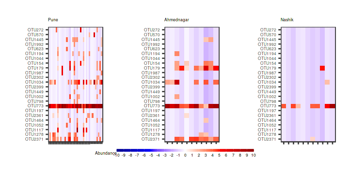


## Differential abundance analysis 

Differential abundance analysis with DESeq2 method


| log2FoldChange|      padj|taxon   |full_name                                                                        |
|--------------:|---------:|:-------|:--------------------------------------------------------------------------------|
|       5.890011| 0.0000000|OTU2172 |Bacteria_Firmicutes_Bacilli_Bacillales_Staphylococcaceae_Staphylococcus          |
|      -3.154752| 0.0070619|OTU367  |Bacteria_Firmicutes_Bacilli_Bacillales_Bacillaceae_Bacillus                      |
|      -3.199304| 0.0085109|OTU2529 |Bacteria_Firmicutes_Bacilli_Bacillales_Bacillaceae_Virgibacillus                 |
|      -2.511998| 0.0085109|OTU1680 |Bacteria_Firmicutes_Bacilli_Bacillales_Paenibacillaceae _Paenibacillus           |
|      -3.175628| 0.1176826|OTU251  |Bacteria_Actinobacteria_Actinobacteria_Micrococcales_Micrococcaceae_Arthrobacter |
|      -2.581503| 0.1319555|OTU1075 |Bacteria_Firmicutes_Bacilli_Bacillales_Bacillaceae_Geobacillus                   |

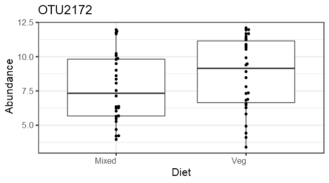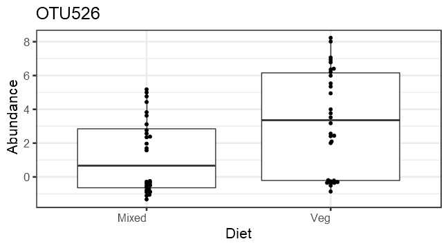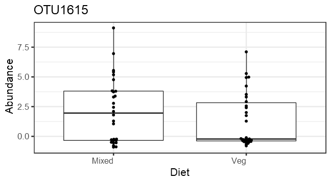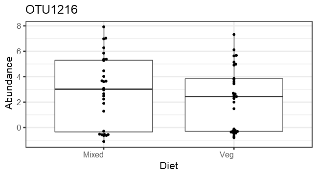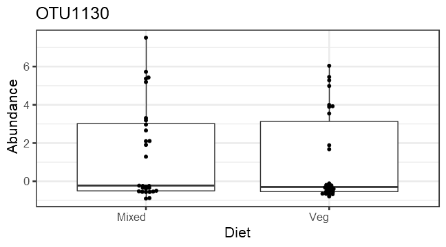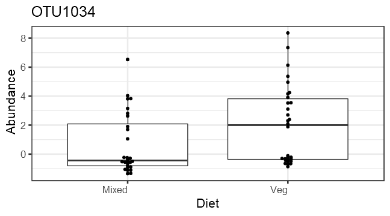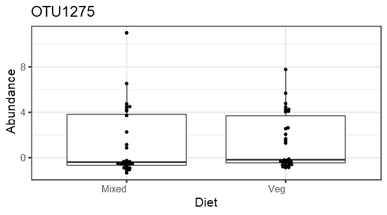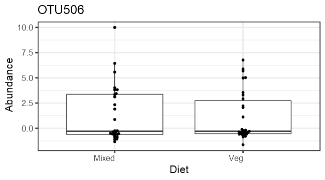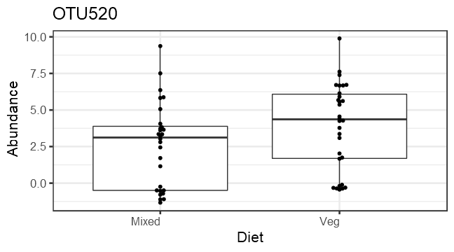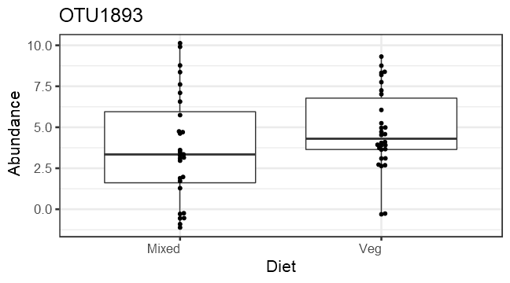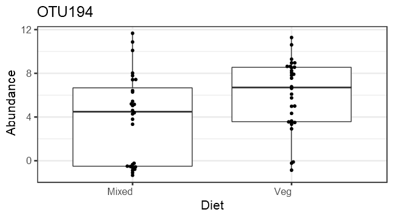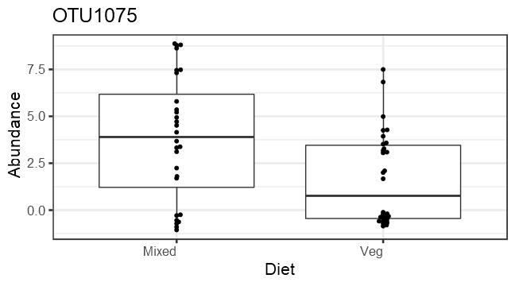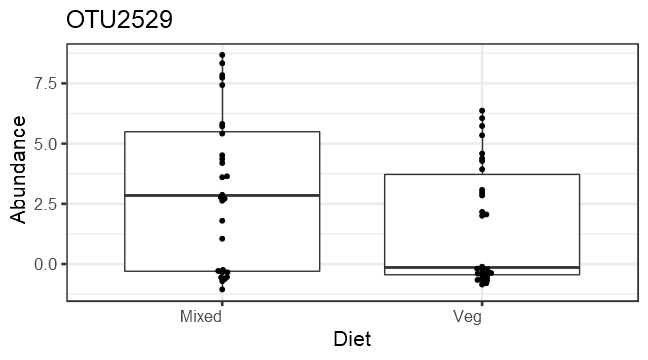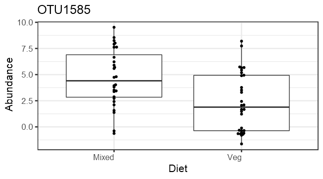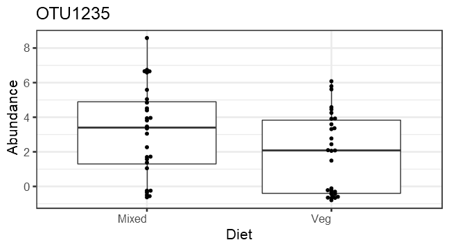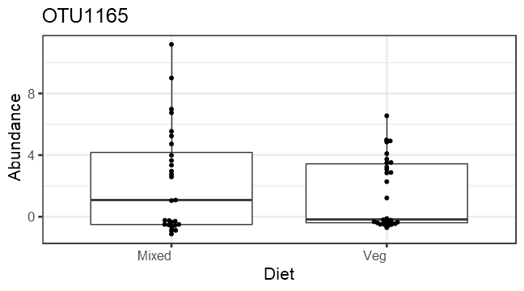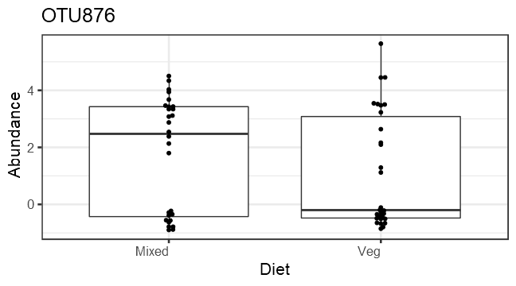
