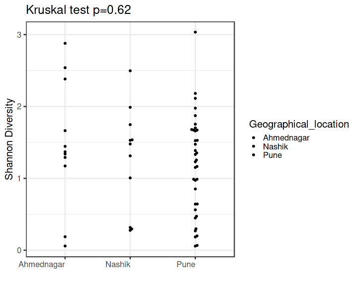
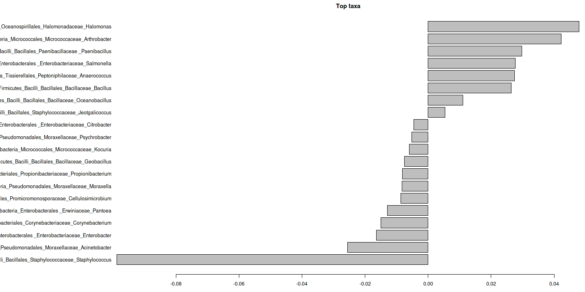
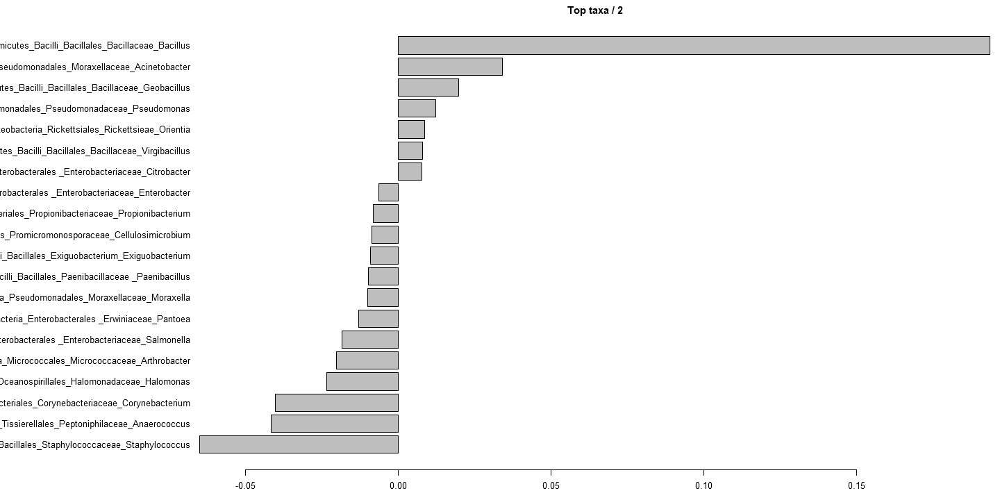

# Analysis


# Alpha diversity analysis


# Group-wise comparisons

Diversity index: diversity_shannon



# Ordination


## Principal Coordinates Analysis (PCoA)

* Ordination method: PCoA
* Dissimilarity measure: jaccard


## Differential abundance analysis (with DESeq2)


| log2FoldChange|      padj|taxon   |full_name                                                                        |
|--------------:|---------:|:-------|:--------------------------------------------------------------------------------|
|       5.890011| 0.0000000|OTU2172 |Bacteria_Firmicutes_Bacilli_Bacillales_Staphylococcaceae_Staphylococcus          |
|      -3.154752| 0.0070619|OTU367  |Bacteria_Firmicutes_Bacilli_Bacillales_Bacillaceae_Bacillus                      |
|      -3.199304| 0.0085109|OTU2529 |Bacteria_Firmicutes_Bacilli_Bacillales_Bacillaceae_Virgibacillus                 |
|      -2.511998| 0.0085109|OTU1680 |Bacteria_Firmicutes_Bacilli_Bacillales_Paenibacillaceae _Paenibacillus           |
|      -3.175628| 0.1176826|OTU251  |Bacteria_Actinobacteria_Actinobacteria_Micrococcales_Micrococcaceae_Arthrobacter |
|      -2.581503| 0.1319555|OTU1075 |Bacteria_Firmicutes_Bacilli_Bacillales_Bacillaceae_Geobacillus                   |

```
## Error in eval(expr, envir, enclos): object 'top.taxa' not found
```

# PERMANOVA analysis


```r
library(microbiome)
library(ggplot2)
library(dplyr)

pseq <- phy# Rename the example data
data = microbiome::meta(phy)
# Pick relative abundances (compositional) and sample metadata 
pseq.rel <- microbiome::transform(pseq, "compositional")
otu <- abundances(pseq.rel)
meta <- meta(pseq.rel)
library(vegan)
library(phyloseq)
permanova <- adonis(t(otu) ~ Geographical_location,
               data = meta(phy), permutations=99, method = "bray")

# P-value
print(as.data.frame(permanova$aov.tab)["Geographical_location", "Pr(>F)"])
```

```
## [1] 0.01
```

```r
dist <- vegdist(t(otu))
anova(betadisper(dist, meta$Geographical_location))
```

```
## Analysis of Variance Table
## 
## Response: Distances
##           Df  Sum Sq Mean Sq F value Pr(>F)
## Groups     2 0.15882 0.07941  1.7537 0.1827
## Residuals 55 2.49040 0.04528
```


# Investigate the top factors


```r
library(vegan)

coef1 <- coefficients(permanova)["Geographical_location1", ]
top.coef1 <- coef1[rev(order(abs(coef1)))[1:20]]
names(top.coef1) <- full.names[names(top.coef1)]

coef2 <- coefficients(permanova)["Geographical_location2", ]
top.coef2 <- coef2[rev(order(abs(coef2)))[1:20]]
names(top.coef2) <- full.names[names(top.coef2)]

par(mar = c(3, 20, 2, 1), mfrow = 2)
```

```
## Error in par(mar = c(3, 20, 2, 1), mfrow = 2): graphical parameter "mfrow" has the wrong length
```

```r
barplot(sort(top.coef1), horiz = T, las = 1, main = "Top taxa / 1")
```



```r
barplot(sort(top.coef2), horiz = T, las = 1, main = "Top taxa / 2")
```



