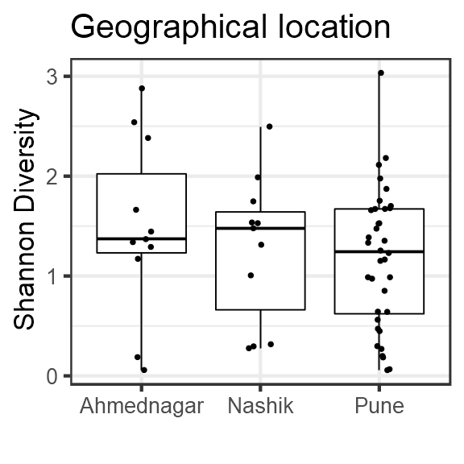

# Analysis


## Alpha diversity analysis

Diversity index: diversity_shannon


## Differential abundance analysis (with ANCOM)

In [jointanalysis.md] it was shown that geographical location has a significant effect.

Here, we investigate individual taxonomic groups in more detail.

Significant (or marginally significant) taxa between geographical locations.


```
##   taxa_id   W detected_0.9 detected_0.8 detected_0.7 detected_0.6
## 1 OTU1075 273         TRUE         TRUE         TRUE         TRUE
## 2 OTU2529 271         TRUE         TRUE         TRUE         TRUE
## 3  OTU773 267         TRUE         TRUE         TRUE         TRUE
## 4 OTU1235 267         TRUE         TRUE         TRUE         TRUE
## 5 OTU2172 265         TRUE         TRUE         TRUE         TRUE
## 6 OTU1893 263         TRUE         TRUE         TRUE         TRUE
```




```
## Error in abundances(ps)[colnames(otu_vs_sample)[i], rownames(otu_vs_sample)[j]]: subscript out of bounds
```

```
##      rn location
##  1:  I1       NA
##  2:  I2       NA
##  3:  I3       NA
##  4:  I4       NA
##  5:  I5       NA
##  6:  I6       NA
##  7:  I7       NA
##  8:  I8       NA
##  9:  I9       NA
## 10: I10       NA
## 11: I11       NA
## 12: I12       NA
## 13: I13       NA
## 14: I14       NA
## 15: I15       NA
## 16: I16       NA
## 17: I17       NA
## 18: I18       NA
## 19: I19       NA
## 20: I20       NA
## 21: I21       NA
## 22: I22       NA
## 23: I23       NA
## 24: I24       NA
## 25: I25       NA
## 26: I26       NA
## 27: I27       NA
## 28: I28       NA
## 29: I29       NA
## 30: I30       NA
## 31: I31       NA
## 32: I32       NA
## 33: I33       NA
## 34: I34       NA
## 35: I35       NA
## 36: I36       NA
## 37: I37       NA
## 38: I38       NA
## 39: I39       NA
## 40: I40       NA
## 41: I41       NA
## 42: I42       NA
## 43: I43       NA
## 44: I44       NA
## 45: I45       NA
## 46: I46       NA
## 47: I47       NA
## 48: I48       NA
## 49: I49       NA
## 50: I50       NA
## 51: I51       NA
## 52: I52       NA
## 53: I53       NA
## 54: I54       NA
## 55: I55       NA
## 56: I56       NA
## 57: I57       NA
## 58: I58       NA
##      rn location
```

```
## Error in setnames(x, value): Can't assign 3 names to a 1 column data.table
```

```
## Error in setnames(x, value): Can't assign 3 names to a 1 column data.table
```

```
## Error in setnames(x, value): Can't assign 3 names to a 1 column data.table
```

```
## Error in `[<-.data.frame`(x, i, j, value): replacement has 1 row, data has 0
```

```
## Error in `[<-.data.frame`(x, i, j, value): replacement has 1 row, data has 0
```

```
## Error in `[<-.data.frame`(x, i, j, value): replacement has 1 row, data has 0
```


