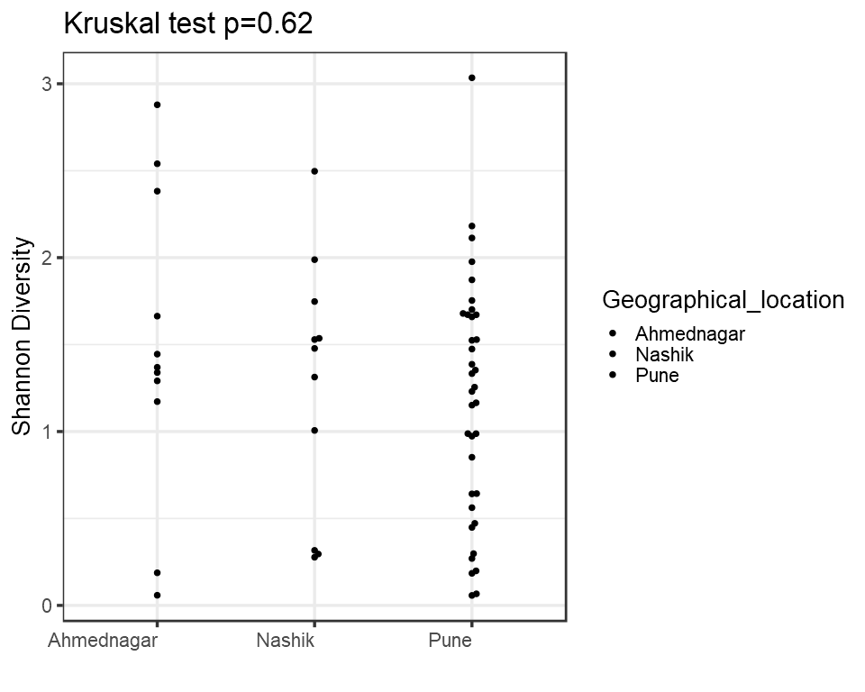
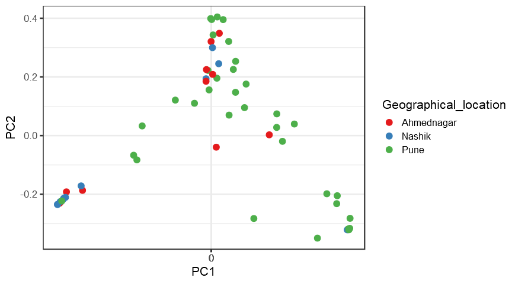
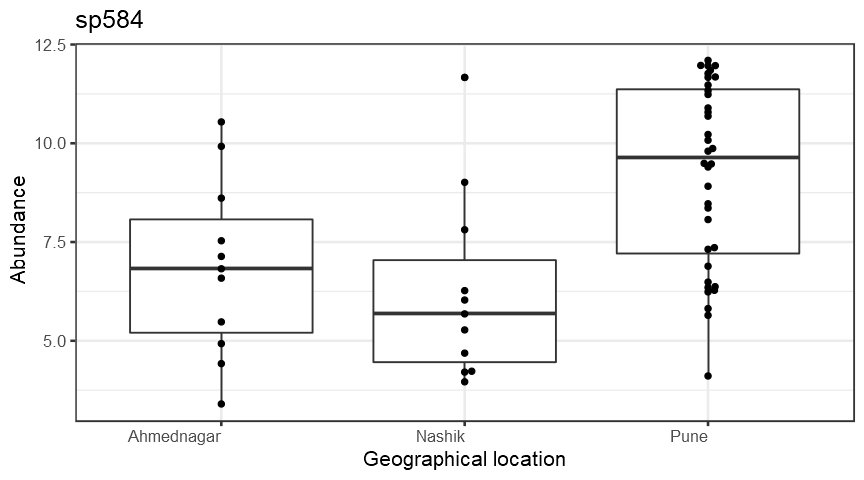
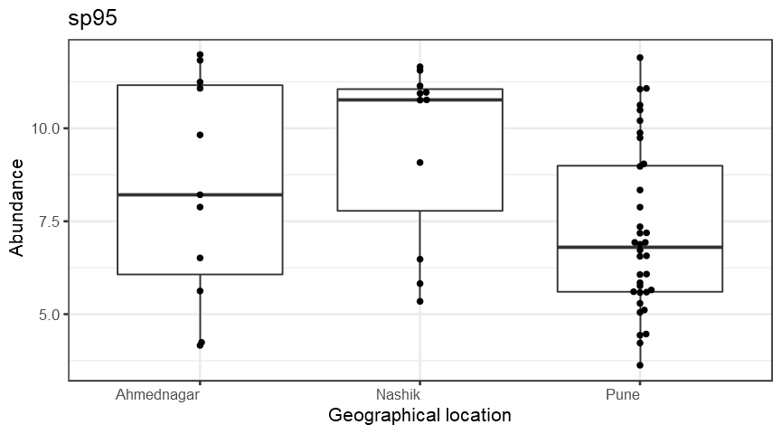
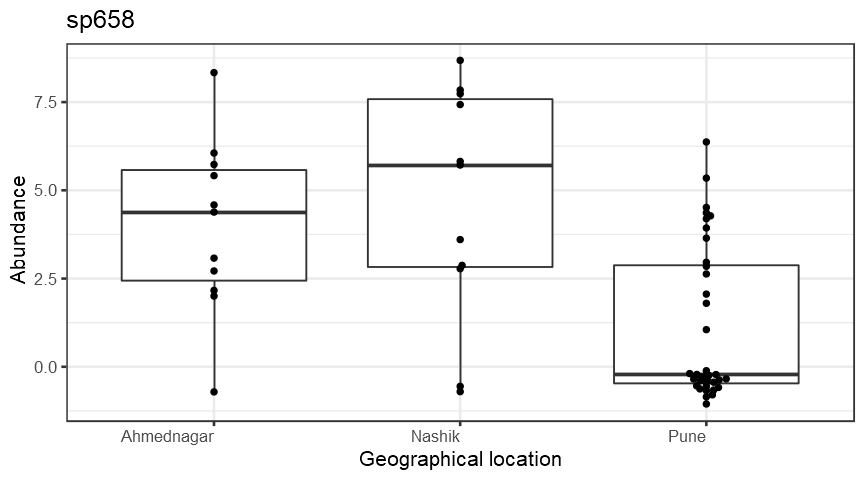
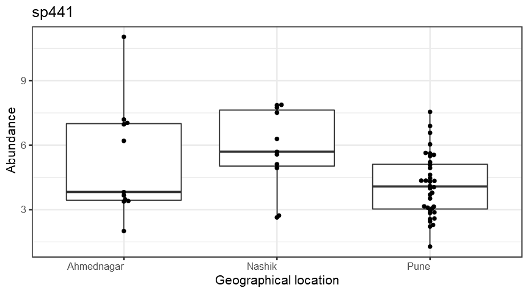
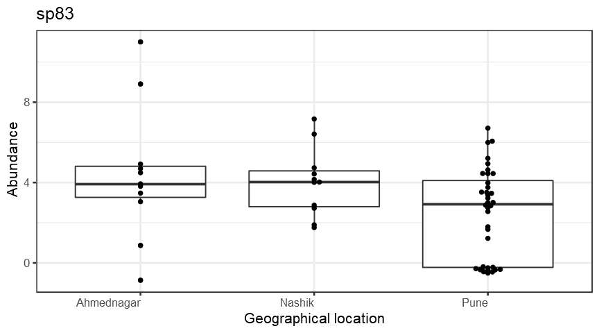
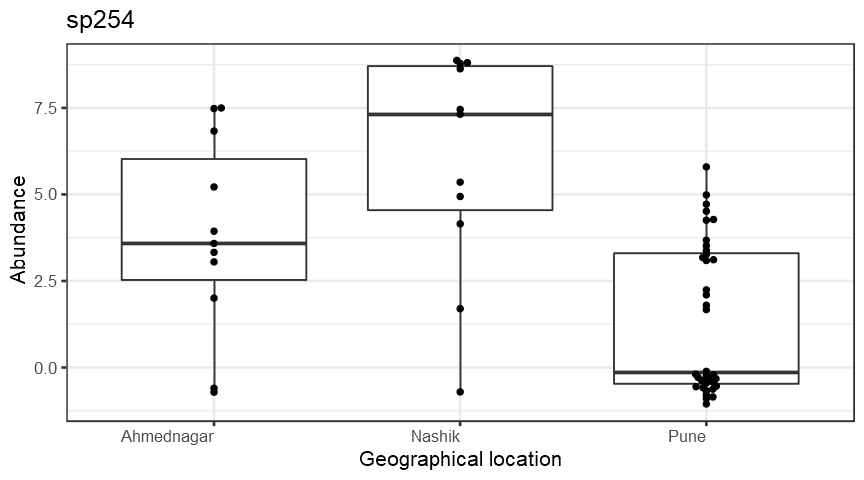
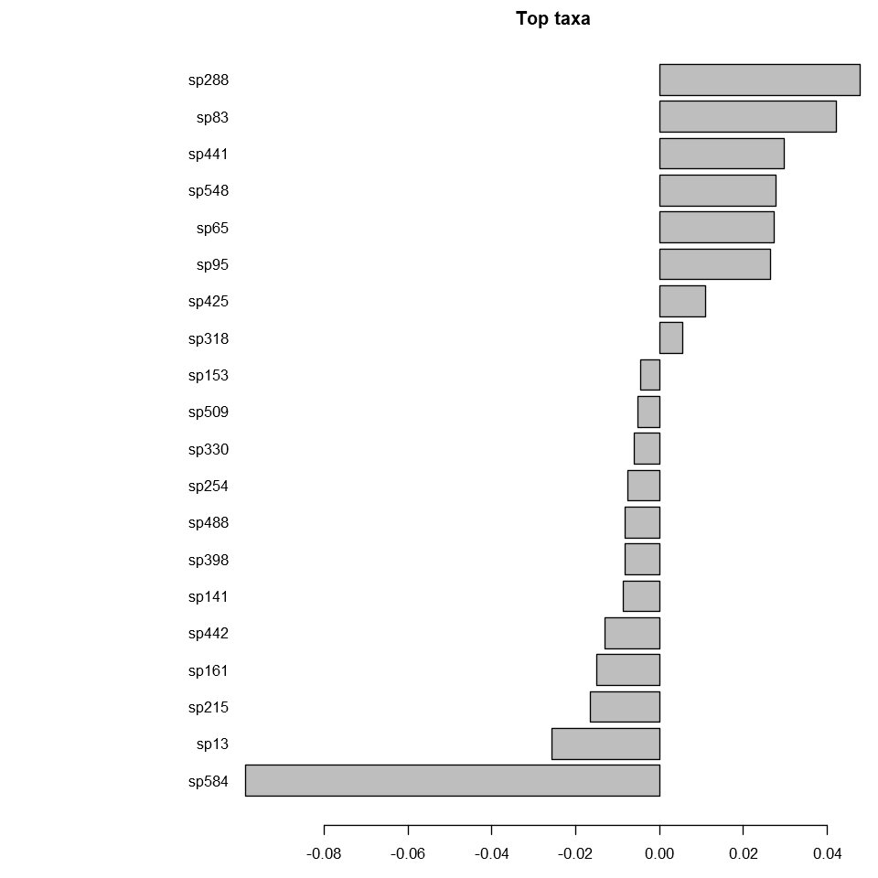

Analysis
========

    ## Warning: package 'knitr' was built under R version 3.6.3

    ## Warning: package 'knitcitations' was built under R version 3.6.3

    ## Warning: package 'reshape2' was built under R version 3.6.3

    ## Warning: package 'tidyverse' was built under R version 3.6.3

    ## Warning: package 'tibble' was built under R version 3.6.3

    ## Warning: package 'tidyr' was built under R version 3.6.3

    ## Warning: package 'readr' was built under R version 3.6.3

    ## Warning: package 'purrr' was built under R version 3.6.3

    ## Warning: package 'stringr' was built under R version 3.6.3

    ## Warning: package 'forcats' was built under R version 3.6.3

Alpha diversity analysis
========================

Group-wise comparisons
======================

-   Diversity index: diversity\_shannon

Ordination
==========

*Principal Coordinates Analysis (PCoA)*
---------------------------------------

-   Ordination method: PCoA
-   Dissimilarity measure: jaccard

DESeq2 analysis\*
-----------------

    ##                                                                                                                  sp1 
    ##                                              "Bacteria_Firmicutes_Bacilli_Lactobacillales_Aerococcaceae_Abiotrophia" 
    ##                                                                                                                  sp2 
    ##                                              "Bacteria_Firmicutes_Bacilli_Bacillales_Staphylococcaceae_Abyssicoccus" 
    ##                                                                                                                  sp3 
    ##                                         "Bacteria_Firmicutes_Clostridia_Clostridiales_Eubacteriaceae_Acetobacterium" 
    ##                                                                                                                  sp4 
    ##                                          "Bacteria_Firmicutes_Negativicutes_Selenomonadales_Sporomusaceae_Acetonema" 
    ##                                                                                                                  sp5 
    ##                                   "Bacteria_Firmicutes_Mollicutes_Acholeplasmatales_Acholeplasmataceae_Acholeplasma" 
    ##                                                                                                                  sp6 
    ##                            "Bacteria_Proteobacteria_Betaproteobacteria_Burkholderiales_Alcaligenaceae_Achromobacter" 
    ##                                                                                                                  sp7 
    ##                                         "Bacteria_Firmicutes_Clostridia_Clostridiales_IncertaeSedis_Acidaminobacter" 
    ##                                                                                                                  sp8 
    ##                             "Bacteria_Firmicutes_Negativicutes_Acidaminococcales_Acidaminococcaceae_Acidaminococcus" 
    ##                                                                                                                  sp9 
    ##                          "Bacteria_Proteobacteria_Alphaproteobacteria_Rhodospirillales_Acetobacteraceae_Acidicaldus" 
    ##                                                                                                                 sp10 
    ##                         "Bacteria_Proteobacteria_Alphaproteobacteria_Rhodospirillales_Acetobacteraceae_Acidiphilium" 
    ##                                                                                                                 sp11 
    ##                         "Bacteria_Actinobacteria_Acidimicrobiia_Acidimicrobiales _Acidimicrobiaceae_Aciditerrimonas" 
    ##                                                                                                                 sp12 
    ##               "Bacteria_Proteobacteria_Acidithiobacillia_AcidithioBacillales_Acidithiobacillaceae_Acidithiobacillus" 
    ##                                                                                                                 sp13 
    ##                            "Bacteria_Proteobacteria_Gammaproteobacteria_Pseudomonadales_Moraxellaceae_Acinetobacter" 
    ##                                                                                                                 sp14 
    ##                                                       "Bacteria_Actinobacteria_Actinobacteria_NA_NA_Actinobacterium" 
    ##                                                                                                                 sp15 
    ##                              "Bacteria_Actinobacteria_Actinobacteria_Actinomycetales_Actinomycetaceae_Actinobaculum" 
    ##                                                                                                                 sp16 
    ##                      "Bacteria_Actinobacteria_Actinobacteria_Micromonosporales_Micromonosporaceae_Actinocatenispora" 
    ##                                                                                                                 sp17 
    ##                      "Bacteria_Actinobacteria_Actinobacteria_Streptosporangiales_Thermomonosporaceae_Actinocorallia" 
    ##                                                                                                                 sp18 
    ##                       "Bacteria_Actinobacteria_Actinobacteria_Pseudonocardiales_Pseudonocardiaceae_Actinokineospora" 
    ##                                                                                                                 sp19 
    ##                        "Bacteria_Actinobacteria_Actinobacteria_Streptosporangiales_Thermomonosporaceae_Actinomadura" 
    ##                                                                                                                 sp20 
    ##                                "Bacteria_Actinobacteria_Actinobacteria_Actinomycetales_Actinomycetaceae_Actinomyces" 
    ##                                                                                                                 sp21 
    ##                        "Bacteria_Actinobacteria_Actinobacteria_Pseudonocardiales_Pseudonocardiaceae_Actinophytocola" 
    ##                                                                                                                 sp22 
    ##                           "Bacteria_Actinobacteria_Actinobacteria_Micromonosporales_Micromonosporaceae_Actinoplanes" 
    ##                                                                                                                 sp23 
    ##                      "Bacteria_Actinobacteria_Actinobacteria_Actinopolysporales_Actinopolysporaceae_Actinopolyspora" 
    ##                                                                                                                 sp24 
    ##                                 "Bacteria_Actinobacteria_Actinobacteria_Micrococcales_Cellulomonadaceae_Actinotalea" 
    ##                                                                                                                 sp25 
    ##                                         "Bacteria_Firmicutes_Clostridia_Clostridiales_Ruminococcaceae_Acutalibacter" 
    ##                                                                                                                 sp26 
    ##                                               "Bacteria_Firmicutes_Bacilli_Lactobacillales_Aerococcaceae_Aerococcus" 
    ##                                                                                                                 sp27 
    ##                           "Bacteria_Actinobacteria_Actinobacteria_Propionibacteriales_Nocardioidaceae_Aeromicrobium" 
    ##                                                                                                                 sp28 
    ##                                 "Bacteria_Proteobacteria_Gammaproteobacteria_Aeromonadales_Aeromonadaceae_Aeromonas" 
    ##                                                                                                                 sp29 
    ##                          "Bacteria_Proteobacteria_Gammaproteobacteria_Alteromonadales _Alteromonadaceae_Agaribacter" 
    ##                                                                                                                 sp30 
    ##                        "Bacteria_Proteobacteria_Gammaproteobacteria_Pasteurellales _Pasteurellaceae_Aggregatibacter" 
    ##                                                                                                                 sp31 
    ##                                 "Bacteria_Proteobacteria_Alphaproteobacteria_Rhizobiales_Rhizobiaceae_Agrobacterium" 
    ##                                                                                                                 sp32 
    ##                                   "Bacteria_Actinobacteria_Actinobacteria_Micrococcales_Microbacteriaceae_Agromyces" 
    ##                                                                                                                 sp33 
    ##                              "Bacteria_Proteobacteria_Alphaproteobacteria_Rhodobacterales_Rhodobacteraceae_Ahrensia" 
    ##                                                                                                                 sp34 
    ##                          "Bacteria_Proteobacteria_Gammaproteobacteria_Oceanospirillales_Halomonadaceae_Aidingimonas" 
    ##                                                                                                                 sp35 
    ##                       "Bacteria_Proteobacteria_Gammaproteobacteria_Alteromonadales _Pseudoalteromonadaceae_Algicola" 
    ##                                                                                                                 sp36 
    ##                              "Bacteria_Proteobacteria_Alphaproteobacteria_Rhodobacterales_Hyphomonadaceae_Algimonas" 
    ##                                                                                                                 sp37 
    ##                                        "Bacteria_Firmicutes_Bacilli_Bacillales_Alicyclobacillaceae_Alicyclobacillus" 
    ##                                                                                                                 sp38 
    ##                                                "Bacteria_Firmicutes_Bacilli_Bacillales_Staphylococcaceae_Aliicoccus" 
    ##                                                                                                                 sp39 
    ##                          "Bacteria_Proteobacteria_Gammaproteobacteria_Oceanospirillales_Kangiellaceae_Aliikangiella" 
    ##                                                                                                                 sp40 
    ##                        "Bacteria_Proteobacteria_Gammaproteobacteria_Alteromonadales _Alteromonadaceae_Alishewanella" 
    ##                                                                                                                 sp41 
    ##                                                  "Bacteria_Firmicutes_Bacilli_Bacillales_Bacillaceae_Alkalibacillus" 
    ##                                                                                                                 sp42 
    ##                                           "Bacteria_Firmicutes_Clostridia_Clostridiales_Eubacteriaceae_Alkalibacter" 
    ##                                                                                                                 sp43 
    ##                                      "Bacteria_Firmicutes_Bacilli_Lactobacillales_Carnobacteriaceae_Alkalibacterium" 
    ##                                                                                                                 sp44 
    ##                                          "Bacteria_Firmicutes_Clostridia_Clostridiales_Eubacteriaceae_Alkalibaculum" 
    ##                                                                                                                 sp45 
    ##                                                      "Bacteria_Firmicutes_Bacilli_Bacillales_NA_Alkalilactibacillus" 
    ##                                                                                                                 sp46 
    ##                        "Bacteria_Proteobacteria_Gammaproteobacteria_Alteromonadales _Alteromonadaceae_Alkalimarinus" 
    ##                                                                                                                 sp47 
    ##                             "Bacteria_Proteobacteria_Gammaproteobacteria_Pseudomonadales_Moraxellaceae_Alkanindiges" 
    ##                                                                                                                 sp48 
    ##                                                    "Bacteria_Firmicutes_Bacilli_Bacillales_Bacillaceae_Allobacillus" 
    ##                                                                                                                 sp49 
    ##                "Bacteria_Actinobacteria_Actinobacteria_Micromonosporales_Micromonosporaceae_Allocatelliglobosispora" 
    ##                                                                                                                 sp50 
    ##                                           "Bacteria_Firmicutes_Bacilli_Lactobacillales_Carnobacteriaceae_Allofustis" 
    ##                                                                                                                 sp51 
    ##                         "Bacteria_Actinobacteria_Actinobacteria_Bifidobacteriales _Bifidobacteriaceae_Alloscardovia" 
    ##                                                                                                                 sp52 
    ##                                 "Bacteria_Actinobacteria_Actinobacteria_Micrococcales_Microbacteriaceae_Alpinimonas" 
    ##                                                                                                                 sp53 
    ##                 "Bacteria_Proteobacteria_Alphaproteobacteria_Sphingomonadales_Erythrobacteraceae_Altererythrobacter" 
    ##                                                                                                                 sp54 
    ##                                                  "Bacteria_Firmicutes_Bacilli_Bacillales_Bacillaceae_Alteribacillus" 
    ##                                                                                                                 sp55 
    ##                           "Bacteria_Proteobacteria_Alphaproteobacteria_Rhodobacterales_Rhodobacteraceae_Amaricoccus" 
    ##                                                                                                                 sp56 
    ##                                             "Bacteria_Firmicutes_Clostridia_Clostridiales_Eubacteriaceae_Aminicella" 
    ##                                                                                                                 sp57 
    ##                                      "Bacteria_Synergistetes _Synergistia _Synergistales_Synergistaceae_Aminivibrio" 
    ##                                                                                                                 sp58 
    ##                                   "Bacteria_Synergistetes _Synergistia _Synergistales_Synergistaceae_Aminobacterium" 
    ##                                                                                                                 sp59 
    ##                                            "Bacteria_Firmicutes_Bacilli_Bacillales_Paenibacillaceae_Ammoniibacillus" 
    ##                                                                                                                 sp60 
    ##                                                   "Bacteria_Firmicutes_Bacilli_Bacillales_Bacillaceae_Amphibacillus" 
    ##                                                                                                                 sp61 
    ##                         "Bacteria_Proteobacteria_Gammaproteobacteria_Oceanospirillales_Oceanospirillaceae_Amphritea" 
    ##                                                                                                                 sp62 
    ##                          "Bacteria_Actinobacteria_Actinobacteria_Pseudonocardiales_Pseudonocardiaceae_Amycolatopsis" 
    ##                                                                                                                 sp63 
    ##                          "Bacteria_Actinobacteria_Actinobacteria_Pseudonocardiales_Pseudonocardiaceae_Amycolatopsis" 
    ##                                                                                                                 sp64 
    ##                                                  "Bacteria_Firmicutes_Bacilli_Bacillales_Bacillaceae_Anaerobacillus" 
    ##                                                                                                                 sp65 
    ##                                      "Bacteria_Firmicutes_Tissierellia_Tissierellales_Peptoniphilaceae_Anaerococcus" 
    ##                                                                                                                 sp66 
    ##                                           "Bacteria_Firmicutes_Clostridia_Clostridiales_Eubacteriaceae_Anaerofustis" 
    ##                                                                                                                 sp67 
    ##                                                               "Bacteria_Chloroflexi_Anaerolineae_NA_NA_Anaerolineae" 
    ##                                                                                                                 sp68 
    ##                    "Bacteria_Proteobacteria_Deltaproteobacteria_Myxococcales_Anaeromyxobacteraceae_Anaeromyxobacter" 
    ##                                                                                                                 sp69 
    ##                                     "Bacteria_Firmicutes_Tissierellia_Tissierellales_Peptoniphilaceae_Anaerosphaera" 
    ##                                                                                                                 sp70 
    ##                                         "Bacteria_Firmicutes_Clostridia_Clostridiales_Ruminococcaceae_Anaerotruncus" 
    ##                                                                                                                 sp71 
    ##                                 "Bacteria_Proteobacteria_Alphaproteobacteria_Rhizobiales_Rhodobiaceae_Anderseniella" 
    ##                                                                                                                 sp72 
    ##                                           "Bacteria_Firmicutes_Bacilli_Bacillales_Paenibacillaceae_Aneurinibacillus" 
    ##                                                                                                                 sp73 
    ##                                "Bacteria_Actinobacteria_Actinobacteria_Kineosporiales_Kineosporiaceae_Angustibacter" 
    ##                                                                                                                 sp74 
    ##                                                   "Bacteria_Firmicutes_Bacilli_Bacillales_Bacillaceae_Anoxybacillus" 
    ##                                                                                                                 sp75 
    ##                                                   "Bacteria_Actinobacteria_Actinobacteria_Frankiales_NA_Antricoccus" 
    ##                                                                                                                 sp76 
    ##                          "Bacteria_Proteobacteria_Betaproteobacteria_Neisseriales _Chromobacteriaceae_Aquaspirillum" 
    ##                                                                                                                 sp77 
    ##                                                    "Bacteria_Firmicutes_Bacilli_Bacillales_Bacillaceae_Aquibacillus" 
    ##                                                                                                                 sp78 
    ##                            "Bacteria_Actinobacteria_Actinobacteria_Actinomycetales_Actinomycetaceae_Arcanobacterium" 
    ##                                                                                                                 sp79 
    ##                            "Bacteria_Proteobacteria_Gammaproteobacteria_Xanthomonadales_Xanthomonadaceae_Arenimonas" 
    ##                                                                                                                 sp80 
    ##                        "Bacteria_Proteobacteria_Gammaproteobacteria_Chromatiales_Ectothiorhodospiraceae_Arhodomonas" 
    ##                                                                                                                 sp81 
    ##                             "Bacteria_Actinobacteria_Actinobacteria_Micrococcales_Intrasporangiaceae_Arsenicicoccus" 
    ##                                                                                                                 sp82 
    ##                               "Bacteria_Actinobacteria_Actinobacteria_Micrococcales_Intrasporangiaceae_Arsenophonus" 
    ##                                                                                                                 sp83 
    ##                                   "Bacteria_Actinobacteria_Actinobacteria_Micrococcales_Micrococcaceae_Arthrobacter" 
    ##                                                                                                                 sp84 
    ##                                "Bacteria_Proteobacteria_Alphaproteobacteria_Rhodospirillales_Acetobacteraceae_Asaia" 
    ##                                                                                                                 sp85 
    ##                               "Bacteria_Tenericutes_Mollicutes_Anaeroplasmatales _Anaeroplasmataceae_Asteroleplasma" 
    ##                                                                                                                 sp86 
    ##                         "Bacteria_Proteobacteria_Alphaproteobacteria_Caulobacterales_Caulobacteraceae_Asticcacaulis" 
    ##                                                                                                                 sp87 
    ##                                          "Bacteria_Firmicutes_Bacilli_Lactobacillales_Carnobacteriaceae_Atopococcus" 
    ##                                                                                                                 sp88 
    ##                             "Bacteria_Proteobacteria_Alphaproteobacteria_Rhizobiales_Aurantimonadaceae_Aurantimonas" 
    ##                                                                                                                 sp89 
    ##                                                   "Bacteria_Firmicutes_Bacilli_Bacillales_Bacillaceae_Aureibacillus" 
    ##                                                                                                                 sp90 
    ##                                 "Bacteria_Actinobacteria_Actinobacteria_Micrococcales_Micrococcaceae_Auritidibacter" 
    ##                                                                                                                 sp91 
    ##                                   "Bacteria_Actinobacteria_Actinobacteria_Micrococcales_Dermatophilaceae_Austwickia" 
    ##                                                                                                                 sp92 
    ##                                   "Bacteria_Proteobacteria_Proteobacteria_Pseudomonadales_Pseudomonadaceae_Azomonas" 
    ##                                                                                                                 sp93 
    ##                             "Bacteria_Proteobacteria_Alphaproteobacteria_Rhizobiales_Xanthobacteraceae_Azorhizobium" 
    ##                                                                                                                 sp94 
    ##                           "Bacteria_Proteobacteria_Gammaproteobacteria_Pseudomonadales_Pseudomonadaceae_Azotobacter" 
    ##                                                                                                                 sp95 
    ##                                                        "Bacteria_Firmicutes_Bacilli_Bacillales_Bacillaceae_Bacillus" 
    ##                                                                                                                 sp96 
    ##                           "Bacteria_Proteobacteria_Oligoflexia_Bacteriovoracales_Halobacteriovoraceae_Bacteriovorax" 
    ##                                                                                                                 sp97 
    ##                                          "Bacteria_Verrucomicrobia_Verrucomicrobiae_Verrucomicrobiales_NA_bacterium" 
    ##                                                                                                                 sp98 
    ##                                        "Bacteria_Bacteroidetes_Bacteroidia_Bacteroidales_Bacteroidaceae_Bacteroides" 
    ##                                                                                                                 sp99 
    ##                          "Bacteria_Proteobacteria_Gammaproteobacteria_Oceanospirillales_Balneatrichaceae_Balneatrix" 
    ##                                                                                                                sp100 
    ##                                          "Bacteria_Firmicutes_Bacilli_Lactobacillales_Enterococcaceae_Bavariicoccus" 
    ##                                                                                                                sp101 
    ##                              "Bacteria_Proteobacteria_Oligoflexia_Bdellovibrionales_Bdellovibrionaceae_Bdellovibrio" 
    ##                                                                                                                sp102 
    ##                                         "Bacteria_Proteobacteria_Oligoflexia_Bdellovibrionales_NA_Bdellovibrionales" 
    ##                                                                                                                sp103 
    ##                                 "Bacteria_Actinobacteria_Actinobacteria_Micrococcales_Beutenbergiaceae_Beutenbergia" 
    ##                                                                                                                sp104 
    ##                                                   "Bacteria_Firmicutes_Bacilli_Bacillales_Planococcaceae_Bhargavaea" 
    ##                                                                                                                sp105 
    ##                     "Bacteria_Proteobacteria_Gammaproteobacteria_Enterobacterales _Enterobacteriaceae_Biostraticola" 
    ##                                                                                                                sp106 
    ##                                  "Bacteria_Bacteroidetes_Flavobacteriia_Flavobacteriales_Flavobacteriaceae_Bizionia" 
    ##                                                                                                                sp107 
    ##                                     "Bacteria_Actinobacteria_Actinobacteria_Micrococcales_Bogoriellaceae_Bogoriella" 
    ##                                                                                                                sp108 
    ##                                    "Bacteria_Proteobacteria_Alphaproteobacteria_Rhizobiales_Bradyrhizobiaceae_Bosea" 
    ##                                                                                                                sp109 
    ##                              "Bacteria_Actinobacteria_Actinobacteria_Micrococcales_Dermabacteraceae_Brachybacterium" 
    ##                                                                                                                sp110 
    ##                               "Bacteria_Proteobacteria_Betaproteobacteria_Burkholderiales_Alcaligenaceae_Brackiella" 
    ##                                                                                                                sp111 
    ##                                              "Bacteria_Firmicutes_Bacilli_Bacillales_Paenibacillaceae_Brevibacillus" 
    ##                                                                                                                sp112 
    ##                           "Bacteria_Actinobacteria_Actinobacteria_Micrococcales_Brevibacteriaceae_Brevibacteriaceae" 
    ##                                                                                                                sp113 
    ##                              "Bacteria_Actinobacteria_Actinobacteria_Micrococcales_Brevibacteriaceae_Brevibacterium" 
    ##                                                                                                                sp114 
    ##                         "Bacteria_Proteobacteria_Alphaproteobacteria_Caulobacterales_Caulobacteraceae_Brevundimonas" 
    ##                                                                                                                sp115 
    ##                              "Bacteria_Firmicutes_Erysipelotrichia_Erysipelotrichales_Erysipelotrichaceae_Breznakia" 
    ##                                                                                                                sp116 
    ##                        "Bacteria_Actinobacteria_Actinobacteria_Propionibacteriales_Propionibacteriaceae_Brooklawnia" 
    ##                                                                                                                sp117 
    ##                                 "Bacteria_Proteobacteria_Gammaproteobacteria_Enterobacterales _Erwiniaceae_Buchnera" 
    ##                                                                                                                sp118 
    ##                           "Bacteria_Proteobacteria_Betaproteobacteria_Burkholderiales_Burkholderiaceae_Burkholderia" 
    ##                                                                                                                sp119 
    ##                      "Bacteria_Proteobacteria_Gammaproteobacteria_Enterobacterales _Enterobacteriaceae_Buttiauxella" 
    ##                                                                                                                sp120 
    ##                                         "Bacteria_Firmicutes_Clostridia_Clostridiales_Clostridiaceae_Butyricicoccus" 
    ##                                                                                                                sp121 
    ##                               "Bacteria_Planctomycetes_Planctomycetia_Pirellulales_Lacipirellulaceae_Bythopirellula" 
    ##                                                                                                                sp122 
    ##                               "Bacteria_Proteobacteria_Alphaproteobacteria_Holosporales_Caedimonadaceae_Caedibacter" 
    ##                                                                                                                sp123 
    ##                     "Bacteria_Firmicutes_Clostridia_Thermoanaerobacterales_Thermoanaerobacteraceae_Caldanaerobacter" 
    ##                                                                                                                sp124 
    ##                      "Bacteria_Firmicutes_Clostridia_Thermoanaerobacterales_Thermoanaerobacteraceae_Calderihabitans" 
    ##                                                                                                                sp125 
    ##                                 "Bacteria_Firmicutes_Clostridia_Clostridiales_Symbiobacteriaceae_Caldinitratiruptor" 
    ##                                                                                                                sp126 
    ##                                      "Bacteria_Caldiserica_Caldisericia_Caldisericales_Caldisericaceae_Caldisericum" 
    ##                                                                                                                sp127 
    ##                                                  "Bacteria_Firmicutes_Bacilli_Bacillales_Bacillaceae_Calditerricola" 
    ##                                                                                                                sp128 
    ##                                            "Bacteria_Firmicutes_Clostridia_Clostridiales_Clostridiaceae_Caloramator" 
    ##                                                                                                                sp129 
    ##                  "Bacteria_Proteobacteria_Epsilonproteobacteria _Campylobacterales_Campylobacteraceae_Campylobacter" 
    ##                                                                                                                sp130 
    ##                  "Bacteria_Proteobacteria_Gammaproteobacteria_Cardiobacteriales _Cardiobacteriaceae_Cardiobacterium" 
    ##                                                                                                                sp131 
    ##                  "Bacteria_Firmicutes_Clostridia_Clostridiales_Clostridiales Family XIII. Incertae Sedis_Casaltella" 
    ##                                                                                                                sp132 
    ##                         "Bacteria_Actinobacteria_Actinobacteria_Micromonosporales_Micromonosporaceae_Catellatospora" 
    ##                                                                                                                sp133 
    ##                                          "Bacteria_Firmicutes_Bacilli_Lactobacillales_Enterococcaceae_Catellicoccus" 
    ##                                                                                                                sp134 
    ##                                 "Bacteria_Proteobacteria_Gammaproteobacteria_Vibrionales _Vibrionaceae_Catenococcus" 
    ##                                                                                                                sp135 
    ##                          "Bacteria_Proteobacteria_Gammaproteobacteria_Alteromonadales _Alteromonadaceae_Catenovulum" 
    ##                                                                                                                sp136 
    ##                           "Bacteria_Actinobacteria_Actinobacteria_Catenulisporales _Catenulisporaceae_Catenulispora" 
    ##                                                                                                                sp137 
    ##                                "Bacteria_Proteobacteria_Gammaproteobacteria_Pseudomonadales_Moraxellaceae_Cavicella" 
    ##                                                                                                                sp138 
    ##                           "Bacteria_Proteobacteria_Gammaproteobacteria_Enterobacterales _Enterobacteriaceae_Cedecea" 
    ##                                                                                                                sp139 
    ##                          "Bacteria_Proteobacteria_Gammaproteobacteria_NA_Celerinatantimonadaceae_Celerinatantimonas" 
    ##                                                                                                                sp140 
    ##                                "Bacteria_Actinobacteria_Actinobacteria_Micrococcales_Cellulomonadaceae_Cellulomonas" 
    ##                                                                                                                sp141 
    ##                      "Bacteria_Actinobacteria_Actinobacteria_Micrococcales_Promicromonosporaceae_Cellulosimicrobium" 
    ##                                                                                                                sp142 
    ##                            "Bacteria_Proteobacteria_Gammaproteobacteria_CellVibrionales_Cellvibrionaceae_Cellvibrio" 
    ##                                                                                                                sp143 
    ##                                                  "Bacteria_Firmicutes_Bacilli_Bacillales_Bacillaceae_Cerasibacillus" 
    ##                                                                                                                sp144 
    ##                  "Bacteria_Fibrobacteres_Chitinispirillia _Chitinispirillales _Chitinispirillaceae_Chitinispirillum" 
    ##                                                                                                                sp145 
    ##                     "Bacteria_Fibrobacteres_Chitinispirillia _Chitinispirillales _Chitinispirillaceae_Chitinivibrio" 
    ##                                                                                                                sp146 
    ##                                         "Bacteria_Bacteroidetes_Chlorobia_Chlorobiales_Chlorobiaceae_Chloroherpeton" 
    ##                                                                                                                sp147 
    ##                                  "Bacteria_Proteobacteria_Gammaproteobacteria_Chromatiales_Chromatiaceae_Chromatium" 
    ##                                                                                                                sp148 
    ##                        "Bacteria_Proteobacteria_Betaproteobacteria_Neisseriales _Chromobacteriaceae_Chromobacterium" 
    ##                                                                                                                sp149 
    ##                           "Bacteria_Cyanobacteria_NA_Chroococcidiopsidales_Chroococcidiopsidaceae_Chroococcidiopsis" 
    ##                                                                                                                sp150 
    ##                          "Bacteria_Bacteroidetes_Flavobacteriia_Flavobacteriales_Flavobacteriaceae_Chryseobacterium" 
    ##                                                                                                                sp151 
    ##                                                          "Bacteria_Firmicutes_Bacilli_Lactobacillales_NA_Chungangia" 
    ##                                                                                                                sp152 
    ##                                    "Bacteria_Actinobacteria_Actinobacteria_Micrococcales_Micrococcaceae_Citricoccus" 
    ##                                                                                                                sp153 
    ##                       "Bacteria_Proteobacteria_Gammaproteobacteria_Enterobacterales _Enterobacteriaceae_Citrobacter" 
    ##                                                                                                                sp154 
    ##                       "Bacteria_Proteobacteria_Gammaproteobacteria_Enterobacterales _Enterobacteriaceae_Clavibacter" 
    ##                                                                                                                sp155 
    ##                                         "Bacteria_Bacteroidetes_Cytophagia_Cytophagales_Amoebophilaceae_Cloacimonas" 
    ##                                                                                                                sp156 
    ##                                   "Bacteria_Firmicutes_Clostridia_Clostridiales_Clostridiaceae_Clostridiisalibacter" 
    ##                                                                                                                sp157 
    ##                                            "Bacteria_Firmicutes_Clostridia_Clostridiales_Clostridiaceae_Clostridium" 
    ##                                                                                                                sp158 
    ##                                                   "Bacteria_Firmicutes_Bacilli_Bacillales_Paenibacillaceae_Cohnella" 
    ##                                                                                                                sp159 
    ## "Bacteria_Coprothermobacterota _Coprothermobacteria _Coprothermobacterales_Coprothermobacteraceae_Coprothermobacter" 
    ##                                                                                                                sp160 
    ##                         "Bacteria_Proteobacteria_Gammaproteobacteria_Alteromonadales _Alteromonadaceae_Corallomonas" 
    ##                                                                                                                sp161 
    ##                        "Bacteria_Actinobacteria_Actinobacteria_Corynebacteriales_Corynebacteriaceae_Corynebacterium" 
    ##                                                                                                                sp162 
    ##                                    "Bacteria_Proteobacteria_Gammaproteobacteria_Legionellales_Coxiellaceae_Coxiella" 
    ##                                                                                                                sp163 
    ##                                        "Bacteria_Chlamydiae_Chlamydiia_Parachlamydiales_Criblamydiaceae_Criblamydia" 
    ##                                                                                                                sp164 
    ##                       "Bacteria_Proteobacteria_Gammaproteobacteria_Enterobacterales _Enterobacteriaceae_Cronobacter" 
    ##                                                                                                                sp165 
    ##                              "Bacteria_Bacteroidetes_Flavobacteriia_Flavobacteriales_Flavobacteriaceae_Cruoricaptor" 
    ##                                                                                                                sp166 
    ##                               "Bacteria_Actinobacteria_Actinobacteria_Micrococcales_Microbacteriaceae_Cryobacterium" 
    ##                                                                                                                sp167 
    ##                                   "Bacteria_Bacteroidetes_Flavobacteriia_Flavobacteriales_Cryomorphaceae_Cryomorpha" 
    ##                                                                                                                sp168 
    ##                                      "Bacteria_Firmicutes_Clostridia_Clostridiales_Peptococcaceae_Cryptanaerobacter" 
    ##                                                                                                                sp169 
    ##                                            "Bacteria_Viridiplantae_Magnoliopsida_Cucurbitales_Cucurbitaceae_Cucumis" 
    ##                                                                                                                sp170 
    ##                                         "Bacteria_Firmicutes_Clostridia_Clostridiales_Lachnospiraceae_Cuneatibacter" 
    ##                                                                                                                sp171 
    ##                              "Bacteria_Actinobacteria_Actinobacteria_Micrococcales_Microbacteriaceae_Curtobacterium" 
    ##                                                                                                                sp172 
    ##                       "Bacteria_Proteobacteria_Gammaproteobacteria_Thiotrichales_Piscirickettsiaceae_Cycloclasticus" 
    ##                                                                                                                sp173 
    ##                                                      "Bacteria_Proteobacteria_Deltaproteobacteria_NA_NA_Deferrisoma" 
    ##                                                                                                                sp174 
    ##                      "Bacteria_Proteobacteria_Alphaproteobacteria_Rhodospirillales_Rhodospirillaceae_Defluviicoccus" 
    ##                                                                                                                sp175 
    ##                                           "Bacteria_Firmicutes_Clostridia_Clostridiales_Peptococcaceae_Dehalobacter" 
    ##                                                                                                                sp176 
    ##                          "Bacteria_Chloroflexi_Dehalococcoidia_Dehalococcoidales_Dehalococcoidaceae_Dehalococcoides" 
    ##                                                                                                                sp177 
    ##                              "Bacteria_Deinococcus-Thermus_Deinococci _Deinococcales _Deinococcaceae_Deinobacterium" 
    ##                                                                                                                sp178 
    ##                                       "Bacteria_Actinobacteria_Actinobacteria_Micrococcales_Demequinaceae_Demequina" 
    ##                                                                                                                sp179 
    ##                                       "Bacteria_Actinobacteria_Actinobacteria_Micrococcales_Dermacoccaceae_Demetria" 
    ##                                                                                                                sp180 
    ##                                  "Bacteria_Firmicutes_Negativicutes_Selenomonadales_Sporomusaceae_Dendrosporobacter" 
    ##                                                                                                                sp181 
    ##                                    "Bacteria_Actinobacteria_Actinobacteria_Micrococcales_Dermacoccaceae_Dermacoccus" 
    ##                                                                                                                sp182 
    ##                                "Bacteria_Actinobacteria_Actinobacteria_Micrococcales_Dermatophilaceae_Dermatophilus" 
    ##                                                                                                                sp183 
    ##                                  "Bacteria_Proteobacteria_Betaproteobacteria_Burkholderiales _Alcaligenaceae_Derxia" 
    ##                                                                                                                sp184 
    ##                                             "Bacteria_Firmicutes_Bacilli_Lactobacillales_Carnobacteriaceae_Desemzia" 
    ##                                                                                                                sp185 
    ##                                        "Bacteria_Firmicutes_Clostridia_Clostridiales_Peptococcaceae_Desulfitibacter" 
    ##                                                                                                                sp186 
    ##                                     "Bacteria_Firmicutes_Clostridia_Clostridiales_Peptococcaceae_Desulfitobacterium" 
    ##                                                                                                                sp187 
    ##                 "Bacteria_Proteobacteria_Deltaproteobacteria_Syntrophobacterales_Syntrophobacteraceae_Desulfoglaeba" 
    ##                                                                                                                sp188 
    ##                  "Bacteria_Proteobacteria_Deltaproteobacteria_DesulfoVibrionales_Desulfohalobiaceae_Desulfohalobium" 
    ##                                                                                                                sp189 
    ##                        "Bacteria_Proteobacteria_Deltaproteobacteria_Syntrophobacterales_Syntrophaceae_Desulfomonile" 
    ##                                                                                                                sp190 
    ##                  "Bacteria_Proteobacteria_Deltaproteobacteria_DesulfoVibrionales_Desulfonatronaceae_Desulfonauticus" 
    ##                                                                                                                sp191 
    ##                      "Bacteria_Proteobacteria_Deltaproteobacteria_Desulfobacterales _Desulfobacteraceae_Desulfonema" 
    ##                                                                                                                sp192 
    ##                                         "Bacteria_Firmicutes_Clostridia_Clostridiales_Peptococcaceae_Desulfonispora" 
    ##                                                                                                                sp193 
    ##                        "Bacteria_Proteobacteria_Deltaproteobacteria_Desulfobacterales _Desulfobulbaceae_Desulfopila" 
    ##                                                                                                                sp194 
    ##                      "Bacteria_Proteobacteria_Deltaproteobacteria_Desulfobacterales _Desulfobulbaceae_Desulforegula" 
    ##                                                                                                                sp195 
    ##                   "Bacteria_Proteobacteria_Deltaproteobacteria_Syntrophobacterales_Syntrophobacteraceae_Desulfosoma" 
    ##                                                                                                                sp196 
    ##                                   "Bacteria_Firmicutes_Negativicutes_Selenomonadales_Sporomusaceae_Desulfosporomusa" 
    ##                                                                                                                sp197 
    ##                                  "Bacteria_Firmicutes_Negativicutes_Selenomonadales_Sporomusaceae_Desulfosporosinus" 
    ##                                                                                                                sp198 
    ##                   "Bacteria_Proteobacteria_Deltaproteobacteria_DesulfoVibrionales_Desulfohalobiaceae_Desulfothermus" 
    ##                                                                                                                sp199 
    ##                                       "Bacteria_Firmicutes_Clostridia_Clostridiales_Peptococcaceae_Desulfotomaculum" 
    ##                                                                                                                sp200 
    ##                   "Bacteria_Proteobacteria_Deltaproteobacteria_DesulfoVibrionales_Desulfovibrionaceae_Desulfovibrio" 
    ##                                                                                                                sp201 
    ##                  "Bacteria_Proteobacteria_Deltaproteobacteria_Desulfuromonadales_Desulfuromonadaceae_Desulfuromonas" 
    ##                                                                                                                sp202 
    ##                                    "Bacteria_Actinobacteria_Actinobacteria_Micrococcales_Dermabacteraceae_Devriesea" 
    ##                                                                                                                sp203 
    ##                                         "Bacteria_Firmicutes_Negativicutes_Veillonellales_Veillonellaceae_Dialister" 
    ##                                                                                                                sp204 
    ##                                       "Bacteria_Actinobacteria_Actinobacteria_Corynebacteriales_Dietziaceae_Dietzia" 
    ##                                                                                                                sp205 
    ##                                                    "Bacteria_Firmicutes_Bacilli_Bacillales_Bacillaceae_Domibacillus" 
    ##                                                                                                                sp206 
    ##                                    "Bacteria_Bacteroidetes_Bacteroidia_Bacteroidales_Dysgonamonadaceae_Dysgonomonas" 
    ##                                                                                                                sp207 
    ##                 "Bacteria_Proteobacteria_Gammaproteobacteria_Chromatiales_Ectothiorhodospiraceae_Ectothiorhodospira" 
    ##                                                                                                                sp208 
    ##                                     "Bacteria_Actinobacteria_Nitriliruptoria_Egibacterales_Egibacteraceae_Egibacter" 
    ##                                                                                                                sp209 
    ##                                 "Bacteria_Proteobacteria_Alphaproteobacteria_Rhodospirillales_Elioraeaceae_Elioraea" 
    ##                                                                                                                sp210 
    ##                  "Bacteria_Firmicutes_Clostridia_Clostridiales_Clostridiales Family XIII. Incertae Sedis_Emergencia" 
    ##                                                                                                                sp211 
    ##                                             "Bacteria_Bacteroidetes_Cytophagia_Cytophagales_Cytophagaceae_Emticicia" 
    ##                                                                                                                sp212 
    ##                        "Bacteria_Proteobacteria_Gammaproteobacteria_Enterobacterales _Enterobacteriaceae_Endobacter" 
    ##                                                                                                                sp213 
    ##                                       "Bacteria_Proteobacteria_Alphaproteobacteria_Rhizobiales_Rhizobiaceae_Ensifer" 
    ##                                                                                                                sp214 
    ##                              "Bacteria_Actinobacteria_Actinobacteria_Micrococcales_Micrococcaceae_Enteractinococcus" 
    ##                                                                                                                sp215 
    ##                      "Bacteria_Proteobacteria_Gammaproteobacteria_Enterobacterales _Enterobacteriaceae_Enterobacter" 
    ##                                                                                                                sp216 
    ##                                           "Bacteria_Firmicutes_Bacilli_Lactobacillales_Enterococcaceae_Enterococcus" 
    ##                                                                                                                sp217 
    ##                                  "Bacteria_Tenericutes_Mollicutes_Entomoplasmatales_Entomoplasmataceae_Entomoplasma" 
    ##                                                                                                                sp218 
    ##                           "Bacteria_Bacteroidetes_Flavobacteriia_Flavobacteriales_Flavobacteriaceae_Epilithonimonas" 
    ##                                                                                                                sp219 
    ##                                              "Bacteria_Firmicutes_Bacilli_Lactobacillales_Aerococcaceae_Eremococcus" 
    ##                                                                                                                sp220 
    ##                                  "Bacteria_Proteobacteria_Gammaproteobacteria_Enterobacterales _Erwiniaceae_Erwinia" 
    ##                                                                                                                sp221 
    ##              "Bacteria_Proteobacteria_Gammaproteobacteria_Enterobacterales _Enterobacteriaceae_Escherichia/Shigella" 
    ##                                                                                                                sp222 
    ##                       "Bacteria_Proteobacteria_Gammaproteobacteria_Enterobacterales _Enterobacteriaceae_Escherichia" 
    ##                                                                                                                sp223 
    ##                                            "Bacteria_Firmicutes_Clostridia_Clostridiales_Eubacteriaceae_Eubacterium" 
    ##                                                                                                                sp224 
    ##                                  "Bacteria_Bacteroidetes_Flavobacteriia_Flavobacteriales_Flavobacteriaceae_Eudoraea" 
    ##                                                                                                                sp225 
    ##                               "Bacteria_Proteobacteria_Gammaproteobacteria_Enterobacterales _Yersiniaceae_Ewingella" 
    ##                                                                                                                sp226 
    ##                                             "Bacteria_Firmicutes_Bacilli_Bacillales_Exiguobacterium_Exiguobacterium" 
    ##                                                                                                                sp227 
    ##                                                                   "Bacteria_Firmicutes_Tissierellia_NA_NA_Ezakiella" 
    ##                                                                                                                sp228 
    ##                                                "Bacteria_Firmicutes_Bacilli_Lactobacillales_Aerococcaceae_Facklamia" 
    ##                                                                                                                sp229 
    ##                                                   "Bacteria_Firmicutes_Bacilli_Bacillales_Bacillaceae_Falsibacillus" 
    ##                                                                                                                sp230 
    ##                                                         "Bacteria_Firmicutes_Clostridia_Clostridiales_NA_Fenollaria" 
    ##                                                                                                                sp231 
    ##                            "Bacteria_Proteobacteria_Gammaproteobacteria_Alteromonadales _Ferrimonadaceae_Ferrimonas" 
    ##                                                                                                                sp232 
    ##                                                    "Bacteria_Firmicutes_Bacilli_Bacillales_Bacillaceae_Filobacillus" 
    ##                                                                                                                sp233 
    ##                                        "Bacteria_Firmicutes_Tissierellia_Tissierellales_Peptoniphilaceae_Finegoldia" 
    ##                                                                                                                sp234 
    ##                              "Bacteria_Bacteroidetes_Chitinophagia_Chitinophagales_Chitinophagaceae_Flavisolibacter" 
    ##                                                                                                                sp235 
    ##                            "Bacteria_Bacteroidetes_Flavobacteriia_Flavobacteriales_Flavobacteriaceae_Flavobacterium" 
    ##                                                                                                                sp236 
    ##                                         "Bacteria_Bacteroidetes_Cytophagia_Cytophagales_Flammeovirgaceae_Flexithrix" 
    ##                                                                                                                sp237 
    ##                                     "Bacteria_Actinobacteria_Actinobacteria_Micrococcales_Dermacoccaceae_Flexivirga" 
    ##                                                                                                                sp238 
    ##                                                       "Bacteria_Firmicutes_Clostridia_Clostridiales_NA_Flintibacter" 
    ##                                                                                                                sp239 
    ##                             "Bacteria_Proteobacteria_Gammaproteobacteria_Pseudomonadales_Moraxellaceae_Fluviicoccus" 
    ##                                                                                                                sp240 
    ##                           "Bacteria_Actinobacteria_Actinobacteria_Cryptosporangiales_Cryptosporangiaceae_Fodinicola" 
    ##                                                                                                                sp241 
    ##                                              "Bacteria_Firmicutes_Bacilli_Bacillales_Paenibacillaceae_Fontibacillus" 
    ##                                                                                                                sp242 
    ##                              "Bacteria_Actinobacteria_Actinobacteria_Micrococcales_Microbacteriaceae_Frondihabitans" 
    ##                                                                                                                sp243 
    ##                                        "Bacteria_Firmicutes_Bacilli_Lactobacillales_Leuconostocaceae_Fructobacillus" 
    ##                                                                                                                sp244 
    ##                                     "Bacteria_Firmicutes_Clostridia_Clostridiales_ClostridialesFamilyXII_Fusibacter" 
    ##                                                                                                                sp245 
    ##                                      "Bacteria_Firmicutes_Clostridia_Clostridiales_Lachnospiraceae_Fusicatenibacter" 
    ##                                                                                                                sp246 
    ##                                             "Bacteria_Actinobacteria_Rubrobacteria _Gaiellales _Gaiellaceae_Gaiella" 
    ##                                                                                                                sp247 
    ##                              "Bacteria_Proteobacteria_Gammaproteobacteria_Thiotrichales_Piscirickettsiaceae_Galenea" 
    ##                                                                                                                sp248 
    ##                                         "Bacteria_Firmicutes_Tissierellia_Tissierellales_Peptoniphilaceae_Gallicola" 
    ##                                                                                                                sp249 
    ##                               "Bacteria_Firmicutes_Clostridia_Thermoanaerobacterales_Thermoanaerobacteraceae_Gelria" 
    ##                                                                                                                sp250 
    ##                                                 "Bacteria_Firmicutes_Clostridia_Clostridiales_IncertaeSedis_Gemella" 
    ##                                                                                                                sp251 
    ##                          "Bacteria_Gemmatimonadetes_Gemmatimonadetes_Gemmatimonadales_Gemmatimonadaceae_Gemmatirosa" 
    ##                                                                                                                sp252 
    ##                           "Bacteria_Proteobacteria_Alphaproteobacteria_Rhodobacterales_Rhodobacteraceae_Gemmobacter" 
    ##                                                                                                                sp253 
    ##                       "Bacteria_Proteobacteria_Alphaproteobacteria_Rhodobacterales_Rhodobacteraceae_Geoalkalibacter" 
    ##                                                                                                                sp254 
    ##                                                     "Bacteria_Firmicutes_Bacilli_Bacillales_Bacillaceae_Geobacillus" 
    ##                                                                                                                sp255 
    ##                            "Bacteria_Proteobacteria_Deltaproteobacteria_Desulfuromonadales_Geobacteraceae_Geobacter" 
    ##                                                                                                                sp256 
    ##                     "Bacteria_Actinobacteria_Actinobacteria_Geodermatophilales_Geodermatophilaceae_Geodermatophilus" 
    ##                                                                                                                sp257 
    ##                                                             "Bacteria_Firmicutes_Bacilli_Bacillales_NA_Geomicrobium" 
    ##                                                                                                                sp258 
    ##                     "Bacteria_Proteobacteria_Deltaproteobacteria_Desulfuromonadales_Geobacteraceae_Geopsychrobacter" 
    ##                                                                                                                sp259 
    ##                                      "Bacteria_Pctinobacteria_Actinobacteria_Micrococcales_Bogoriellaceae_Georgenia" 
    ##                                                                                                                sp260 
    ##                                        "Bacteria_Firmicutes_Clostridia_Clostridiales _Clostridiaceae_Geosporobacter" 
    ##                                                                                                                sp261 
    ##                          "Bacteria_Proteobacteria_Alphaproteobacteria_Rickettsiales_Anaplasmataceae_Geothermobacter" 
    ##                                                                                                                sp262 
    ##                                  "Bacteria_Bacteroidetes_Flavobacteriia_Flavobacteriales_Flavobacteriaceae_Gillisia" 
    ##                                                                                                                sp263 
    ##                         "Bacteria_Proteobacteria_Gammaproteobacteria_CellVibrionales _Cellvibrionaceae_Gilvimarinus" 
    ##                                                                                                                sp264 
    ##                                             "Bacteria_Firmicutes_Bacilli_Lactobacillales_Aerococcaceae_Globicatella" 
    ##                                                                                                                sp265 
    ##                    "Bacteria_Proteobacteria_Alphaproteobacteria_Rhodospirillales_Acetobacteraceae_Gluconacetobacter" 
    ##                                                                                                                sp266 
    ##                        "Bacteria_Proteobacteria_Alphaproteobacteria_Rhodospirillales_Acetobacteraceae_Gluconobacter" 
    ##                                                                                                                sp267 
    ##                                   "Bacteria_Actinobacteria_Actinobacteria_Glycomycetales_Glycomycetaceae_Glycomyces" 
    ##                                                                                                                sp268 
    ##                                     "Bacteria_Actinobacteria_Actinobacteria_Corynebacteriales_Gordoniaceae_Gordonia" 
    ##                                                                                                                sp269 
    ##                                           "Bacteria_Firmicutes_Bacilli_Bacillales_Paenibacillaceae_Gorillibacterium" 
    ##                                                                                                                sp270 
    ##                                                 "Bacteria_Firmicutes_Bacilli_Bacillales_Bacillaceae_Gracilibacillus" 
    ##                                                                                                                sp271 
    ##                                      "Bacteria_Firmicutes_Clostridia_Clostridiales_Gracilibacteraceae_Gracilibacter" 
    ##                                                                                                                sp272 
    ##                                       "Bacteria_Firmicutes_Bacilli_Lactobacillales_Carnobacteriaceae_Granulicatella" 
    ##                                                                                                                sp273 
    ##                                "Bacteria_Actinobacteria_Actinobacteria_Micrococcales_Microbacteriaceae_Gulosibacter" 
    ##                                                                                                                sp274 
    ##                        "Bacteria_Proteobacteria_Gammaproteobacteria_Oceanospirillales_Saccharospirillaceae_Gynuella" 
    ##                                                                                                                sp275 
    ##                         "Bacteria_Proteobacteria_Alphaproteobacteria_Rhodobacterales_Rhodobacteraceae_Haematobacter" 
    ##                                                                                                                sp276 
    ##                             "Bacteria_Proteobacteria_Gammaproteobacteria_Pasteurellales_Pasteurellaceae_Haemophilus" 
    ##                                                                                                                sp277 
    ##                                  "Bacteria_Proteobacteria_Gammaproteobacteria_Oceanospirillales_Hahellaceae_Hahella" 
    ##                                                                                                                sp278 
    ##                                               "Bacteria_Firmicutes_Bacilli_Bacillales_Bacillaceae_Halalkalibacillus" 
    ##                                                                                                                sp279 
    ##                                      "Bacteria_Firmicutes_Clostridia_Halanaerobiales_Halanaerobiaceae_Halanaerobium" 
    ##                                                                                                                sp280 
    ##                                   "Bacteria_Proteobacteria_Deltaproteobacteria_Myxococcales_Kofleriaceae_Haliangium" 
    ##                                                                                                                sp281 
    ##                                      "Bacteria_Proteobacteria_Gammaproteobacteria_CellVibrionales_Halieaceae_Haliea" 
    ##                                                                                                                sp282 
    ##                                "Bacteria_Proteobacteria_Gammaproteobacteria_CellVibrionales _Halieaceae_Halioglobus" 
    ##                                                                                                                sp283 
    ##                                "Bacteria_Actinobacteria_Actinobacteria_Micrococcales_Ruaniaceae_Haloactinobacterium" 
    ##                                                                                                                sp284 
    ##                              "Bacteria_Actinobacteria_Actinobacteria_Jiangellales_Jiangellaceae_Haloactinopolyspora" 
    ##                                                                                                                sp285 
    ##                                                    "Bacteria_Firmicutes_Bacilli_Bacillales_Bacillaceae_Halobacillus" 
    ##                                                                                                                sp286 
    ##                                               "Bacteria_Firmicutes_Bacilli_Bacillales_Bacillaceae_Halolactibacillus" 
    ##                                                                                                                sp287 
    ##                                        "Bacteria_Cyanobacteria_NA_Synechococcales_Prochlorotrichaceae_Halomicronema" 
    ##                                                                                                                sp288 
    ##                             "Bacteria_Proteobacteria_Gammaproteobacteria_Oceanospirillales_Halomonadaceae_Halomonas" 
    ##                                                                                                                sp289 
    ##                                     "Bacteria_Firmicutes_Clostridia_Halanaerobiales_Halobacteroidaceae_Halonatronum" 
    ##                                                                                                                sp290 
    ##                                                         "Bacteria_NA_NA_Haloplasmatales_Haloplasmataceae_Haloplasma" 
    ##                                                                                                                sp291 
    ##                     "Bacteria_Proteobacteria_Gammaproteobacteria_Chromatiales_Ectothiorhodospiraceae_Halorhodospira" 
    ##                                                                                                                sp292 
    ##                             "Bacteria_Proteobacteria_Alphaproteobacteria_Rhodobacterales_Rhodobacteraceae_Halovulum" 
    ##                                                                                                                sp293 
    ##                            "Bacteria_Proteobacteria_Alphaproteobacteria_Rhizobiales_Methylocystaceae_Hansschlegelia" 
    ##                                                                                                                sp294 
    ##                          "Bacteria_Proteobacteria_Alphaproteobacteria_Rhodobacterales_Rhodobacteraceae_Hasllibacter" 
    ##                                                                                                                sp295 
    ##                                            "Bacteria_Firmicutes_Bacilli_Bacillales_Thermoactinomycetaceae_Hazenella" 
    ##                                                                                                                sp296 
    ##                                "Bacteria_Actinobacteria_Actinobacteria_Micrococcales_Dermabacteraceae_Helcobacillus" 
    ##                                                                                                                sp297 
    ##                                       "Bacteria_Firmicutes_Tissierellia_Tissierellales_Peptoniphilaceae_Helcococcus" 
    ##                                                                                                                sp298 
    ##                                      "Bacteria_Firmicutes_Clostridia_Clostridiales_Heliobacteriaceae_Heliobacterium" 
    ##                                                                                                                sp299 
    ##                                 "Bacteria_Actinobacteria_Actinobacteria_Micrococcales_Microbacteriaceae_Herbiconiux" 
    ##                                                                                                                sp300 
    ##                                 "Bacteria_Proteobacteria_Alphaproteobacteria_Rhizobiales_Phyllobacteriaceae_Hoeflea" 
    ##                                                                                                                sp301 
    ##                                           "Bacteria_Actinobacteria_Holophagae _Holophagales_Holophagaceae_Holophaga" 
    ##                                                                                                                sp302 
    ##                             "Bacteria_Actinobacteria_Actinobacteria_Micrococcales_Microbacteriaceae_Homoserinimonas" 
    ##                                                                                                                sp303 
    ##                                                                        "Bacteria_Firmicutes_NA_NA_NA_Hydrogenispora" 
    ##                                                                                                                sp304 
    ##                             "Bacteria_Proteobacteria_Gammaproteobacteria_Alteromonadales _Idiomarinaceae_Idiomarina" 
    ##                                                                                                                sp305 
    ##                    "Bacteria_Ignavibacteriae _Ignavibacteria _Ignavibacteriales _Ignavibacteriaceae_Ignavibacterium" 
    ##                                                                                                                sp306 
    ##                                             "Bacteria_Firmicutes_Bacilli_Lactobacillales_Aerococcaceae_Ignavigranum" 
    ##                                                                                                                sp307 
    ##                   "Bacteria_Firmicutes_Clostridia_Clostridiales_Clostridiales Family XIII. Incertae Sedis_Ihubacter" 
    ##                                                                                                                sp308 
    ##                          "Bacteria_Actinobacteria_Acidimicrobiia_Acidimicrobiales _Ilumatobacteraceae_Ilumatobacter" 
    ##                                                                                                                sp309 
    ##                                      "Bacteria_Firmicutes_Clostridia_Clostridiales_Eubacteriaceae_Intestinibacillus" 
    ##                                                                                                                sp310 
    ##                                                     "Bacteria_Firmicutes_Clostridia_Clostridiales_NA_Intestinimonas" 
    ##                                                                                                                sp311 
    ##                            "Bacteria_Actinobacteria_Actinobacteria_Micrococcales_Intrasporangiaceae_Intrasporangium" 
    ##                                                                                                                sp312 
    ##                                       "Bacteria_Firmicutes_Clostridia_Clostridiales_Eubacteriaceae_Irregularibacter" 
    ##                                                                                                                sp313 
    ##                                           "Bacteria_Firmicutes_Bacilli_Lactobacillales_Carnobacteriaceae_Isobaculum" 
    ##                                                                                                                sp314 
    ##                               "Bacteria_Proteobacteria_Gammaproteobacteria_Chromatiales_Chromatiaceae_Isochromatium" 
    ##                                                                                                                sp315 
    ##                                 "Bacteria_Actinobacteria_Actinobacteria_Micrococcales_Intrasporangiaceae_Janibacter" 
    ##                                                                                                                sp316 
    ##                            "Bacteria_Proteobacteria_Alphaproteobacteria_Rhodobacterales_Rhodobacteraceae_Jannaschia" 
    ##                                                                                                                sp317 
    ##                                     "Bacteria_Actinobacteria_Actinobacteria_Frankiales_Frankiaceae_Jatrophihabitans" 
    ##                                                                                                                sp318 
    ##                                            "Bacteria_Firmicutes_Bacilli_Bacillales_Staphylococcaceae_Jeotgalicoccus" 
    ##                                                                                                                sp319 
    ##                              "Bacteria_Firmicutes_Erysipelotrichia_Erysipelotrichales_Erysipelotrichaceae_Kandleria" 
    ##                                                                                                                sp320 
    ##                              "Bacteria_Proteobacteria_Gammaproteobacteria_Oceanospirillales_Kangiellaceae_Kangiella" 
    ##                                                                                                                sp321 
    ##                                "Bacteria_Proteobacteria_Alphaproteobacteria_Kiloniellales_Kiloniellaceae_Kiloniella" 
    ##                                                                                                                sp322 
    ##                                  "Bacteria_Actinobacteria_Actinobacteria_Kineosporiales_Kineosporiaceae_Kineococcus" 
    ##                                                                                                                sp323 
    ##                                 "Bacteria_Actinobacteria_Actinobacteria_Micrococcales_Dermatophilaceae_Kineosphaera" 
    ##                                                                                                                sp324 
    ##                       "Bacteria_Proteobacteria_Gammaproteobacteria_Oceanospirillales_Endozoicomonadaceae_Kistimonas" 
    ##                                                                                                                sp325 
    ##                           "Bacteria_Actinobacteria_Actinobacteria_Streptomycetales _Streptomycetaceae_Kitasatospora" 
    ##                                                                                                                sp326 
    ##                        "Bacteria_Proteobacteria_Gammaproteobacteria_Enterobacterales _Enterobacteriaceae_Klebsiella" 
    ##                                                                                                                sp327 
    ##                                   "Bacteria_Actinobacteria_Actinobacteria_Micrococcales_Microbacteriaceae_Klugiella" 
    ##                                                                                                                sp328 
    ##                          "Bacteria_Proteobacteria_Gammaproteobacteria_Enterobacterales _Enterobacteriaceae_Kluyvera" 
    ##                                                                                                                sp329 
    ##                          "Bacteria_Proteobacteria_Gammaproteobacteria_Enterobacterales _Enterobacteriaceae_Knoellia" 
    ##                                                                                                                sp330 
    ##                                        "Bacteria_Actinobacteria_Actinobacteria_Micrococcales_Micrococcaceae_Kocuria" 
    ##                                                                                                                sp331 
    ##                                   "Bacteria_Proteobacteria_Deltaproteobacteria_Myxococcales_Nannocystineae_Kofleria" 
    ##                                                                                                                sp332 
    ##                         "Bacteria_Proteobacteria_Gammaproteobacteria_Enterobacterales _Enterobacteriaceae_Kosakonia" 
    ##                                                                                                                sp333 
    ##                               "Bacteria_Actinobacteria_Actinobacteria_Propionibacteriales_Nocardioidaceae_Kribbella" 
    ##                                                                                                                sp334 
    ##                                       "Bacteria_Firmicutes_Bacilli_Bacillales_Thermoactinomycetaceae_Kroppenstedtia" 
    ##                                                                                                                sp335 
    ##                             "Bacteria_Proteobacteria_Gammaproteobacteria_Oceanospirillales_Halomonadaceae_Kushneria" 
    ##                                                                                                                sp336 
    ##                                     "Bacteria_Actinobacteria_Actinobacteria_Micrococcales_Dermacoccaceae_Kytococcus" 
    ##                                                                                                                sp337 
    ##                                   "Bacteria_Actinobacteria_Actinobacteria_Micrococcales_Microbacteriaceae_Laceyella" 
    ##                                                                                                                sp338 
    ##                                         "Bacteria_Firmicutes_Bacilli_Lactobacillales_Lactobacillaceae_Lactobacillus" 
    ##                                                                                                                sp339 
    ##                                           "Bacteria_Firmicutes_Bacilli_Lactobacillales_Streptococcaceae_Lactococcus" 
    ##                                                                                                                sp340 
    ##                                         "Bacteria_Firmicutes_Bacilli_Lactobacillales_Streptococcaceae_Lapillicoccus" 
    ##                                                                                                                sp341 
    ##                                            "Bacteria_Bacteroidetes_Cytophagia_Cytophagales_Cytophagaceae_Larkinella" 
    ##                                                                                                                sp342 
    ##                                "Bacteria_Bacteroidetes_Bacteroidia_Bacteroidales_Porphyromonadaceae_Lascolabacillus" 
    ##                                                                                                                sp343 
    ##                        "Bacteria_Proteobacteria_Deltaproteobacteria_DesulfoVibrionales_Desulfovibrionaceae_Lawsonia" 
    ##                                                                                                                sp344 
    ##                               "Bacteria_Proteobacteria_Epsilonproteobacteria _Nautiliales _Nautiliaceae_Lebetimonas" 
    ##                                                                                                                sp345 
    ##                                "Bacteria_Proteobacteria_Gammaproteobacteria_Legionellales_Legionellaceae_Legionella" 
    ##                                                                                                                sp346 
    ##                             "Bacteria_Proteobacteria_Gammaproteobacteria_Enterobacterales _Budviciaceae_Leminorella" 
    ##                                                                                                                sp347 
    ##                                                   "Bacteria_Firmicutes_Bacilli_Bacillales_Bacillaceae_Lentibacillus" 
    ##                                                                                                                sp348 
    ##                                "Bacteria_Actinobacteria_Actinobacteria_Pseudonocardiales_Pseudonocardiaceae_Lentzea" 
    ##                                                                                                                sp349 
    ##                                           "Bacteria_Proteobacteria_Betaproteobacteria_Burkholderiales_NA_Leptothrix" 
    ##                                                                                                                sp350 
    ##                                 "Bacteria_Actinobacteria_Actinobacteria_Micrococcales_Microbacteriaceae_Leucobacter" 
    ##                                                                                                                sp351 
    ##                                         "Bacteria_Bacteroidetes_Cytophagia_Cytophagales_Flammeovirgaceae_Limibacter" 
    ##                                                                                                                sp352 
    ##                           "Bacteria_Proteobacteria_Alphaproteobacteria_Rhodospirillales_Rhodospirillaceae_Limimonas" 
    ##                                                                                                                sp353 
    ##                                        "Bacteria_Firmicutes_Limnochordia_Limnochordales_Limnochordaceae_Limnochorda" 
    ##                                                                                                                sp354 
    ##                                                       "Bacteria_Firmicutes_Bacilli_Bacillales_Listeriaceae_Listeria" 
    ##                                                                                                                sp355 
    ##                    "Bacteria_Proteobacteria_Gammaproteobacteria_Oceanospirillales_Oceanospirillaceae_Litoribacillus" 
    ##                                                                                                                sp356 
    ##                           "Bacteria_Firmicutes_Erysipelotrichia_Erysipelotrichales_Erysipelotrichaceae_Longibaculum" 
    ##                                                                                                                sp357 
    ##                          "Bacteria_Proteobacteria_Gammaproteobacteria_Enterobacterales _Pectobacteriaceae_Lonsdalea" 
    ##                                                                                                                sp358 
    ##                          "Bacteria_Actinobacteria_Actinobacteria_Micromonosporales_Micromonosporaceae_Luedemannella" 
    ##                                                                                                                sp359 
    ##                                "Bacteria_Proteobacteria_Gammaproteobacteria_CellVibrionales_Halieaceae_Luminiphilus" 
    ##                                                                                                                sp360 
    ##                         "Bacteria_Proteobacteria_Gammaproteobacteria_Xanthomonadales_Rhodanobacteraceae_Luteibacter" 
    ##                                                                                                                sp361 
    ##                                             "Bacteria_Actinobacteria_Actinobacteria_Micrococcales_NA_Luteimicrobium" 
    ##                                                                                                                sp362 
    ##                            "Bacteria_Proteobacteria_Gammaproteobacteria_Xanthomonadales_Xanthomonadaceae_Luteimonas" 
    ##                                                                                                                sp363 
    ##                                                  "Bacteria_Firmicutes_Bacilli_Bacillales_Bacillaceae_Lysinibacillus" 
    ##                                                                                                                sp364 
    ##                            "Bacteria_Proteobacteria_Gammaproteobacteria_Xanthomonadales_Xanthomonadaceae_Lysobacter" 
    ##                                                                                                                sp365 
    ##                       "Bacteria_Proteobacteria_Alphaproteobacteria_Rhodospirillales_Rhodospirillaceae_Magnetovibrio" 
    ##                                                                                                                sp366 
    ##                                  "Bacteria_Firmicutes_Bacilli_Lactobacillales_Carnobacteriaceae_Marinilactibacillus" 
    ##                                                                                                                sp367 
    ##                   "Bacteria_Actinobacteria_Actinobacteria_Propionibacteriales_Propionibacteriaceae_Marinilutecoccus" 
    ##                                                                                                                sp368 
    ##                       "Bacteria_Proteobacteria_Gammaproteobacteria_CellVibrionales_Cellvibrionaceae_Marinimicrobium" 
    ##                                                                                                                sp369 
    ##                                           "Bacteria_Firmicutes_Bacilli_Bacillales_Thermoactinomycetaceae_Marininema" 
    ##                                                                                                                sp370 
    ##                         "Bacteria_Proteobacteria_Gammaproteobacteria_Alteromonadales _Alteromonadaceae_Marinobacter" 
    ##                                                                                                                sp371 
    ##                   "Bacteria_Proteobacteria_Gammaproteobacteria_Oceanospirillales_Oceanospirillaceae_Marinobacterium" 
    ##                                                                                                                sp372 
    ##                       "Bacteria_Proteobacteria_Gammaproteobacteria_Oceanospirillales_Oceanospirillaceae_Marinomonas" 
    ##                                                                                                                sp373 
    ##                   "Bacteria_Proteobacteria_Gammaproteobacteria_Oceanospirillales_Oceanospirillaceae_Marinospirillum" 
    ##                                                                                                                sp374 
    ##                          "Bacteria_Proteobacteria_Zetaproteobacteria_Mariprofundales_Mariprofundaceae_Mariprofundus" 
    ##                                                                                                                sp375 
    ##                                        "Bacteria_Firmicutes_Clostridia_Clostridiales_Lachnospiraceae_Marvinbryantia" 
    ##                                                                                                                sp376 
    ##                               "Bacteria_Proteobacteria_Betaproteobacteria_Burkholderiales_Oxalobacteraceae_Massilia" 
    ##                                                                                                                sp377 
    ##                                                "Bacteria_Firmicutes_Bacilli_Bacillales_Bacillaceae_Massilibacterium" 
    ##                                                                                                                sp378 
    ##                               "Bacteria_Proteobacteria_Alphaproteobacteria_Rhizobiales_Methylobacteriaceae_Meganema" 
    ##                                                                                                                sp379 
    ##                                       "Bacteria_Firmicutes_Negativicutes_Veillonellales_Veillonellaceae_Megasphaera" 
    ##                                                                                                                sp380 
    ##                                        "Bacteria_Firmicutes_Bacilli_Bacillales_Thermoactinomycetaceae_Melghirimyces" 
    ##                                                                                                                sp381 
    ##                                          "Bacteria_Firmicutes_Bacilli_Lactobacillales_Enterococcaceae_Melissococcus" 
    ##                                                                                                                sp382 
    ##                           "Bacteria_Proteobacteria_Alphaproteobacteria_Rhizobiales_Phyllobacteriaceae_Mesorhizobium" 
    ##                                                                                                                sp383 
    ##                          "Bacteria_Proteobacteria_Alphaproteobacteria_Rhodobacterales_Rhodobacteraceae_Methylarcula" 
    ##                                                                                                                sp384 
    ##                       "Bacteria_Proteobacteria_Betaproteobacteria_Nitrosomonadales_Methylophilaceae_Methylobacillus" 
    ##                                                                                                                sp385 
    ##                           "Bacteria_Proteobacteria_Gammaproteobacteria_Methylococcales_Methylococcaceae_Methylogaea" 
    ##                                                                                                                sp386 
    ##                     "Bacteria_Proteobacteria_Gammaproteobacteria_Methylococcales_Methylothermaceae_Methylomarinovum" 
    ##                                                                                                                sp387 
    ##                      "Bacteria_Proteobacteria_Gammaproteobacteria_Methylococcales_Methylococcaceae_Methylomicrobium" 
    ##                                                                                                                sp388 
    ##                         "Bacteria_Proteobacteria_Gammaproteobacteria_Thiotrichales_Piscirickettsiaceae_Methylophaga" 
    ##                                                                                                                sp389 
    ##                                                 "Bacteria_Firmicutes_Bacilli_Bacillales_Bacillaceae_Microaerobacter" 
    ##                                                                                                                sp390 
    ##                              "Bacteria_Actinobacteria_Actinobacteria_Micrococcales_Microbacteriaceae_Microbacterium" 
    ##                                                                                                                sp391 
    ##                       "Bacteria_Proteobacteria_Gammaproteobacteria_CellVibrionales_Microbulbiferaceae_Microbulbifer" 
    ##                                                                                                                sp392 
    ##                                  "Bacteria_Actinobacteria_Actinobacteria_Micrococcales_Microbacteriaceae_Microcella" 
    ##                                                                                                                sp393 
    ##                                 "Bacteria_Actinobacteria_Actinobacteria_Micrococcales_Microbacteriaceae_Micrococcus" 
    ##                                                                                                                sp394 
    ##                         "Bacteria_Actinobacteria_Actinobacteria_Micromonosporales_Micromonosporaceae_Micromonospora" 
    ##                                                                                                                sp395 
    ##                        "Bacteria_Actinobacteria_Actinobacteria_Geodermatophilales_Geodermatophilaceae_Modestobacter" 
    ##                                                                                                                sp396 
    ##                     "Bacteria_Actinobacteria_Actinobacteria_Geodermatophilales_Geodermatophilaceae_Modicisalibacter" 
    ##                                                                                                                sp397 
    ##                           "Bacteria_Proteobacteria_Gammaproteobacteria_Enterobacterales _Morganellaceae_Moellerella" 
    ##                                                                                                                sp398 
    ##                                "Bacteria_Proteobacteria_Gammaproteobacteria_Pseudomonadales_Moraxellaceae_Moraxella" 
    ##                                                                                                                sp399 
    ##                            "Bacteria_Actinobacteria_Actinobacteria_Corynebacteriales_Mycobacteriaceae_Mycobacterium" 
    ##                                                                                                                sp400 
    ##                                        "Bacteria_Tenericutes_Mollicutes_Mycoplasmatales_Mycoplasmataceae_Mycoplasma" 
    ##                                                                                                                sp401 
    ##                                                   "Bacteria_Firmicutes_Bacilli_Bacillales_Bacillaceae_Natribacillus" 
    ##                                                                                                                sp402 
    ##                                      "Bacteria_Firmicutes_Clostridia_Halanaerobiales_Halobacteroidaceae_Natroniella" 
    ##                                                                                                                sp403 
    ##                                                 "Bacteria_Firmicutes_Bacilli_Bacillales_Bacillaceae_Natronobacillus" 
    ##                                                                                                                sp404 
    ##                                                "Bacteria_Firmicutes_Bacilli_Bacillales_Bacillaceae_Negativibacillus" 
    ##                                                                                                                sp405 
    ##                                   "Bacteria_Proteobacteria_Betaproteobacteria_Neisseriales _Neisseriaceae_Neisseria" 
    ##                                                                                                                sp406 
    ##                    "Bacteria_Proteobacteria_Gammaproteobacteria_Oceanospirillales_Oceanospirillaceae_Neptuniibacter" 
    ##                                                                                                                sp407 
    ##                      "Bacteria_Proteobacteria_Gammaproteobacteria_Oceanospirillales_Oceanospirillaceae_Neptunomonas" 
    ##                                                                                                                sp408 
    ##                                  "Bacteria_Actinobacteria_Actinobacteria_Micrococcales_Micrococcaceae_Nesterenkonia" 
    ##                                                                                                                sp409 
    ##                                 "Bacteria_Proteobacteria_Epsilonproteobacteria _Campylobacterales_NA_Nitratifractor" 
    ##                                                                                                                sp410 
    ##                         "Bacteria_Proteobacteria_Alphaproteobacteria_Rhizobiales_Phyllobacteriaceae_Nitratireductor" 
    ##                                                                                                                sp411 
    ##                        "Bacteria_Proteobacteria_Gammaproteobacteria_Oceanospirillales_Oceanospirillaceae_Nitrincola" 
    ##                                                                                                                sp412 
    ##                              "Bacteria_Proteobacteria_Alphaproteobacteria_Rhizobiales_Bradyrhizobiaceae_Nitrobacter" 
    ##                                                                                                                sp413 
    ##                                 "Bacteria_Proteobacteria_Gammaproteobacteria_Chromatiales_Chromatiaceae_Nitrococcus" 
    ##                                                                                                                sp414 
    ##                               "Bacteria_Proteobacteria_Gammaproteobacteria_Chromatiales_Chromatiaceae_Nitrosococcus" 
    ##                                                                                                                sp415 
    ##                         "Bacteria_Proteobacteria_Betaproteobacteria_Nitrosomonadales_Nitrosomonadaceae_Nitrosomonas" 
    ##                                                                                                                sp416 
    ##                                     "Bacteria_Actinobacteria_Actinobacteria_Corynebacteriales_Nocardiaceae_Nocardia" 
    ##                                                                                                                sp417 
    ##                            "Bacteria_Actinobacteria_Actinobacteria_Propionibacteriales_Nocardioidaceae_Nocardioides" 
    ##                                                                                                                sp418 
    ##                         "Bacteria_Actinobacteria_Actinobacteria_Streptosporangiales_Streptosporangiaceae_Nonomuraea" 
    ##                                                                                                                sp419 
    ##                                           "Bacteria_Firmicutes_Bacilli_Bacillales_Staphylococcaceae_Nosocomiicoccus" 
    ##                                                                                                                sp420 
    ##                       "Bacteria_Proteobacteria_Alphaproteobacteria_Rhodospirillales_Rhodospirillaceae_Novispirillum" 
    ##                                                                                                                sp421 
    ##                     "Bacteria_Proteobacteria_Alphaproteobacteria_Sphingomonadales_Sphingomonadaceae_Novosphingobium" 
    ##                                                                                                                sp422 
    ##                                          "Bacteria_Firmicutes_Clostridia_Clostridiales_Clostridiaceae_Oceanirhabdus" 
    ##                                                                                                                sp423 
    ##                 "Bacteria_Proteobacteria_Gammaproteobacteria_Oceanospirillales_Oceanospirillaceae_Oceaniserpentilla" 
    ##                                                                                                                sp424 
    ##                                        "Bacteria_Deinococcus-Thermus_Deinococci _Thermales_Thermaceae_Oceanithermus" 
    ##                                                                                                                sp425 
    ##                                                  "Bacteria_Firmicutes_Bacilli_Bacillales_Bacillaceae_Oceanobacillus" 
    ##                                                                                                                sp426 
    ##                      "Bacteria_Proteobacteria_Gammaproteobacteria_Oceanospirillales_Oceanospirillaceae_Oceanobacter" 
    ##                                                                                                                sp427 
    ##                "Bacteria_Proteobacteria_Gammaproteobacteria_Oceanospirillales_Oceanospirillaceae_Oceanospirillaceae" 
    ##                                                                                                                sp428 
    ##                   "Bacteria_Proteobacteria_Gammaproteobacteria_Oceanospirillales_Oceanospirillaceae_Oceanospirillum" 
    ##                                                                                                                sp429 
    ##                                  "Bacteria_Proteobacteria_Alphaproteobacteria_Rhizobiales_Brucellaceae_Ochrobactrum" 
    ##                                                                                                                sp430 
    ##                         "Bacteria_Proteobacteria_Gammaproteobacteria_Oceanospirillales_Oceanospirillaceae_Oleispira" 
    ##                                                                                                                sp431 
    ##                                 "Bacteria_Lentisphaerae_Oligosphaeria_Oligosphaerales_Oligosphaeraceae_Oligosphaera" 
    ##                                                                                                                sp432 
    ##                                     "Bacteria_Actinobacteria_Coriobacteriia_Coriobacteriales_Atopobiaceae_Olsenella" 
    ##                                                                                                                sp433 
    ##                                           "Bacteria_Firmicutes_Clostridia_Halanaerobiales_Halobacteroidaceae_Orenia" 
    ##                                                                                                                sp434 
    ##                                    "Bacteria_Proteobacteria_Alphaproteobacteria_Rickettsiales_Rickettsieae_Orientia" 
    ##                                                                                                                sp435 
    ##                                       "Bacteria_Chloroflexi_Anaerolineae_Anaerolineales_Anaerolineaceae_Ornatilinea" 
    ##                                                                                                                sp436 
    ##                                               "Bacteria_Firmicutes_Bacilli_Bacillales_Bacillaceae_Ornithinibacillus" 
    ##                                                                                                                sp437 
    ##                            "Bacteria_Actinobacteria_Actinobacteria_Micrococcales_Intrasporangiaceae_Ornithinibacter" 
    ##                                                                                                                sp438 
    ##                         "Bacteria_Actinobacteria_Actinobacteria_Micrococcales_Intrasporangiaceae_Ornithinimicrobium" 
    ##                                                                                                                sp439 
    ##                                 "Bacteria_Actinobacteria_Actinobacteria_Micrococcales_Intrasporangiaceae_Oryzihumus" 
    ##                                                                                                                sp440 
    ##                                "Bacteria_Actinobacteria_Actinobacteria_Micrococcales_Intrasporangiaceae_Oryzobacter" 
    ##                                                                                                                sp441 
    ##                                             "Bacteria_Firmicutes_Bacilli_Bacillales_Paenibacillaceae _Paenibacillus" 
    ##                                                                                                                sp442 
    ##                                  "Bacteria_Proteobacteria_Gammaproteobacteria_Enterobacterales _Erwiniaceae_Pantoea" 
    ##                                                                                                                sp443 
    ##                            "Bacteria_Proteobacteria_Alphaproteobacteria_Rhodobacterales_Rhodobacteraceae_Paracoccus" 
    ##                                                                                                                sp444 
    ##                                                 "Bacteria_Firmicutes_Bacilli_Bacillales_Bacillaceae_Paraliobacillus" 
    ##                                                                                                                sp445 
    ##                         "Bacteria_Proteobacteria_Betaproteobacteria_Burkholderiales_Alcaligenaceae_Parapusillimonas" 
    ##                                                                                                                sp446 
    ##                           "Bacteria_Proteobacteria_Betaproteobacteria_Burkholderiales_Sutterellaceae_Parasutterella" 
    ##                                                                                                                sp447 
    ##                                               "Bacteria_Firmicutes_Bacilli_Bacillales_Bacillaceae_Paucisalibacillus" 
    ##                                                                                                                sp448 
    ##                     "Bacteria_Proteobacteria_Gammaproteobacteria_Enterobacterales _Pectobacteriaceae_Pectobacterium" 
    ##                                                                                                                sp449 
    ##                          "Bacteria_Bacteroidetes_Sphingobacteriia_Sphingobacteriales_Sphingobacteriaceae_Pedobacter" 
    ##                                                                                                                sp450 
    ##                          "Bacteria_Proteobacteria_Alphaproteobacteria_Rhodospirillales_Rhodospirillaceae_Pelagibius" 
    ##                                                                                                                sp451 
    ##                                    "Bacteria_Verrucomicrobia_Opitutae_Puniceicoccales_Puniceicoccaceae_Pelagicoccus" 
    ##                                                                                                                sp452 
    ##                                          "Bacteria_Firmicutes_Negativicutes_Selenomonadales_Sporomusaceae_Pelosinus" 
    ##                                                                                                                sp453 
    ##                                         "Bacteria_Firmicutes_Clostridia_Clostridiales_Syntrophomonadaceae_Pelospora" 
    ##                                                                                                                sp454 
    ##                                          "Bacteria_Firmicutes_Clostridia_Clostridiales_Peptococcaceae_Pelotomaculum" 
    ##                                                                                                                sp455 
    ##                                           "Bacteria_Firmicutes_Clostridia_Clostridiales_Peptoniphilus_Peptoniphilus" 
    ##                                                                                                                sp456 
    ##                              "Bacteria_Proteobacteria_Oligoflexia_Bacteriovoracales_Bacteriovoracaceae_Peredibacter" 
    ##                                                                                                                sp457 
    ##                           "Bacteria_Proteobacteria_Gammaproteobacteria_Arenicellales_Arenicellaceae_Perspicuibacter" 
    ##                                                                                                                sp458 
    ##                                     "Bacteria_Bacteroidetes_Bacteroidia_Bacteroidales_Porphyromonadaceae_Petrimonas" 
    ##                                                                                                                sp459 
    ##                         "Bacteria_Proteobacteria_Alphaproteobacteria_Rhodospirillales_Rhodospirillaceae_Phaeovibrio" 
    ##                                                                                                                sp460 
    ##                           "Bacteria_Proteobacteria_Gammaproteobacteria_Enterobacterales _Erwiniaceae_Phaseolibacter" 
    ##                                                                                                                sp461 
    ##                      "Bacteria_Proteobacteria_Alphaproteobacteria_Caulobacterales_Caulobacteraceae_Phenylobacterium" 
    ##                                                                                                                sp462 
    ##                                         "Bacteria_Bacteroidetes_Bacteroidetes_Bacteroidia_Bacteroidales_Phocaeicola" 
    ##                                                                                                                sp463 
    ##                          "Bacteria_Proteobacteria_Gammaproteobacteria_Enterobacterales _Morganellaceae_Photorhabdus" 
    ##                                                                                                                sp464 
    ##                                "Bacteria_Actinobacteria_Actinobacteria_Micrococcales_Intrasporangiaceae_Phycicoccus" 
    ##                                                                                                                sp465 
    ##                                                          "Bacteria_Planctomycetes_Phycisphaerae_NA_NA_Phycisphaerae" 
    ##                                                                                                                sp466 
    ##                         "Bacteria_Proteobacteria_Alphaproteobacteria_Rhizobiales_Phyllobacteriaceae_Phyllobacterium" 
    ##                                                                                                                sp467 
    ##                             "Bacteria_Actinobacteria_Actinobacteria_Jiangellales_Jiangellaceae_Phytoactinopolyspora" 
    ##                                                                                                                sp468 
    ##                                       "Bacteria_Proteobacteria_Gammaproteobacteria_Enterobacterales _NA_Phytobacter" 
    ##                                                                                                                sp469 
    ##                         "Bacteria_Actinobacteria_Actinobacteria_Micromonosporales_Micromonosporaceae_Phytomonospora" 
    ##                                                                                                                sp470 
    ##                                             "Bacteria_Firmicutes_Bacilli_Lactobacillales_Enterococcaceae_Pilibacter" 
    ##                                                                                                                sp471 
    ##                                  "Bacteria_Actinobacteria_Actinobacteria_Micrococcales_Dermatophilaceae_Piscicoccus" 
    ##                                                                                                                sp472 
    ##                      "Bacteria_Proteobacteria_Gammaproteobacteria_Thiotrichales_Piscirickettsiaceae_Piscirickettsia" 
    ##                                                                                                                sp473 
    ##                                 "Bacteria_Actinobacteria_Actinobacteria_Micrococcales_Microbacteriaceae_Planktoluna" 
    ##                                                                                                                sp474 
    ##                                                  "Bacteria_Firmicutes_Bacilli_Bacillales_Planococcaceae_Planococcus" 
    ##                                                                                                                sp475 
    ##                                               "Bacteria_Firmicutes_Bacilli_Bacillales_Planococcaceae_Planomicrobium" 
    ##                                                                                                                sp476 
    ##                       "Bacteria_Proteobacteria_Gammaproteobacteria_NA_CandidatusCompetibacteraceae_Plasticicumulans" 
    ##                                                                                                                sp477 
    ##                   "Bacteria_Proteobacteria_Alphaproteobacteria_Rhodobacterales_Rhodobacteraceae_Pleomorphobacterium" 
    ##                                                                                                                sp478 
    ##                               "Bacteria_Proteobacteria_Deltaproteobacteria_Myxococcales_Nannocystaceae_Plesiocystis" 
    ##                                                                                                                sp479 
    ##                                       "Bacteria_Proteobacteria_Gammaproteobacteria_Enterobacterales _NA_Plesiomonas" 
    ##                                                                                                                sp480 
    ##                     "Bacteria_Proteobacteria_Gammaproteobacteria_Enterobacterales _Enterobacteriaceae_Pluralibacter" 
    ##                                                                                                                sp481 
    ##                                       "Bacteria_Firmicutes_Bacilli_Bacillales_Thermoactinomycetaceae_Polycladomyces" 
    ##                                                                                                                sp482 
    ##                     "Bacteria_Proteobacteria_Alphaproteobacteria_Sphingomonadales_Erythrobacteraceae_Porphyrobacter" 
    ##                                                                                                                sp483 
    ##                                  "Bacteria_Bacteroidetes_Bacteroidia_Bacteroidales_Porphyromonadaceae_Porphyromonas" 
    ##                                                                                                                sp484 
    ##                                  "Bacteria_Proteobacteria_Gammaproteobacteria_Enterobacterales _Budviciaceae_Pragia" 
    ##                                                                                                                sp485 
    ##                                         "Bacteria_Bacteroidetes_Bacteroidia_Bacteroidales_Prevotellaceae_Prevotella" 
    ##                                                                                                                sp486 
    ##                     "Bacteria_Proteobacteria_Gammaproteobacteria_Oceanospirillales_Oceanospirillaceae_Profundimonas" 
    ##                                                                                                                sp487 
    ##                       "Bacteria_Actinobacteria_Actinobacteria_Micrococcales_Promicromonosporaceae_Promicromonospora" 
    ##                                                                                                                sp488 
    ##                  "Bacteria_Actinobacteria_Actinobacteria_Propionibacteriales_Propionibacteriaceae_Propionibacterium" 
    ##                                                                                                                sp489 
    ##                         "Bacteria_Actinobacteria_Actinobacteria_Propionibacteriales_Nocardioidaceae_Propionicicella" 
    ##                                                                                                                sp490 
    ##                    "Bacteria_Actinobacteria_Actinobacteria_Propionibacteriales_Propionibacteriaceae_Propioniciclava" 
    ##                                                                                                                sp491 
    ##                      "Bacteria_Actinobacteria_Actinobacteria_Propionibacteriales_Propionibacteriaceae_Propioniferax" 
    ##                                                                                                                sp492 
    ##                  "Bacteria_Actinobacteria_Actinobacteria_Propionibacteriales_Propionibacteriaceae_Propionimicrobium" 
    ##                                                                                                                sp493 
    ##                                      "Bacteria_Firmicutes_Clostridia_Clostridiales_Clostridiaceae_Proteiniclasticum" 
    ##                                                                                                                sp494 
    ##                                                  "Bacteria_Proteobacteria_Gammaproteobacteria_NA_NA_proteobacterium" 
    ##                                                                                                                sp495 
    ##                         "Bacteria_Proteobacteria_Gammaproteobacteria_Enterobacterales _Morganellaceae_Proteocatella" 
    ##                                                                                                                sp496 
    ##                               "Bacteria_Proteobacteria_Gammaproteobacteria_Enterobacterales _Morganellaceae_Proteus" 
    ##                                                                                                                sp497 
    ##                           "Bacteria_Proteobacteria_Gammaproteobacteria_Enterobacterales _Morganellaceae_Providencia" 
    ##                                                                                                                sp498 
    ##              "Bacteria_Proteobacteria_Gammaproteobacteria_Alteromonadales _Pseudoalteromonadaceae_Pseudoalteromonas" 
    ##                                                                                                                sp499 
    ##                              "Bacteria_Firmicutes_Clostridia_Clostridiales_Hungateiclostridiaceae_Pseudobacteroides" 
    ##                                                                                                                sp500 
    ##                           "Bacteria_Actinobacteria_Actinobacteria_Micrococcales_Microbacteriaceae_Pseudoclavibacter" 
    ##                                                                                                                sp501 
    ##                                           "Bacteria_Firmicutes_Bacilli_Bacillales_Bacillaceae_Pseudogracilibacillus" 
    ##                                                                                                                sp502 
    ##                            "Bacteria_Actinobacteria_Actinobacteria_Kineosporiales_Kineosporiaceae_Pseudokineococcus" 
    ##                                                                                                                sp503 
    ##                      "Bacteria_Proteobacteria_Gammaproteobacteria_Pseudomonadales_Pseudomonadaceae_Pseudomonadaceae" 
    ##                                                                                                                sp504 
    ##                           "Bacteria_Proteobacteria_Gammaproteobacteria_Pseudomonadales_Pseudomonadaceae_Pseudomonas" 
    ##                                                                                                                sp505 
    ##                         "Bacteria_Actinobacteria_Actinobacteria_Pseudonocardiales_Pseudonocardiaceae_Pseudonocardia" 
    ##                                                                                                                sp506 
    ##                   "Bacteria_Bacteroidetes_Sphingobacteriia_Sphingobacteriales_Sphingobacteriaceae_Pseudorhodobacter" 
    ##                                                                                                                sp507 
    ##                   "Bacteria_Proteobacteria_Gammaproteobacteria_Oceanospirillales_Oceanospirillaceae_Pseudospirillum" 
    ##                                                                                                                sp508 
    ##                     "Bacteria_Proteobacteria_Gammaproteobacteria_Xanthomonadales_Xanthomonadaceae_Pseudoxanthomonas" 
    ##                                                                                                                sp509 
    ##                            "Bacteria_Proteobacteria_Gammaproteobacteria_Pseudomonadales_Moraxellaceae_Psychrobacter" 
    ##                                                                                                                sp510 
    ##                        "Bacteria_Proteobacteria_Gammaproteobacteria_Alteromonadales _Psychromonadaceae_Psychromonas" 
    ##                                                                                                                sp511 
    ##                                     "Bacteria_Firmicutes_Bacilli_Bacillales_Sporolactobacillaceae_Pullulanibacillus" 
    ##                                                                                                                sp512 
    ##                             "Bacteria_Proteobacteria_Betaproteobacteria_Burkholderiales_Alcaligenaceae_Pusillimonas" 
    ##                                                                                                                sp513 
    ##                                "Bacteria_Actinobacteria_Actinobacteria_Kineosporiales_Kineosporiaceae_Quadrisphaera" 
    ##                                                                                                                sp514 
    ##                              "Bacteria_Proteobacteria_Betaproteobacteria_Burkholderiales_Burkholderiaceae_Ralstonia" 
    ##                                                                                                                sp515 
    ##                        "Bacteria_Proteobacteria_Gammaproteobacteria_Enterobacterales _Enterobacteriaceae_Raoultella" 
    ##                                                                                                                sp516 
    ##                                "Bacteria_Actinobacteria_Coriobacteriia_Eggerthellales_Eggerthellaceae_Raoultibacter" 
    ##                                                                                                                sp517 
    ##                                    "Bacteria_Actinobacteria_Actinobacteria_Micrococcales_Rarobacteraceae_Rarobacter" 
    ##                                                                                                                sp518 
    ##                               "Bacteria_Actinobacteria_Actinobacteria_Micrococcales_Microbacteriaceae_Rathayibacter" 
    ##                                                                                                                sp519 
    ##                        "Bacteria_Proteobacteria_Gammaproteobacteria_Oceanospirillales_Saccharospirillaceae_Reinekea" 
    ##                                                                                                                sp520 
    ##                                "Bacteria_Proteobacteria_Gammaproteobacteria_Chromatiales_Chromatiaceae_Rheinheimera" 
    ##                                                                                                                sp521 
    ##                                     "Bacteria_Proteobacteria_Alphaproteobacteria_Rhizobiales_Rhizobiaceae_Rhizobium" 
    ##                                                                                                                sp522 
    ##                           "Bacteria_Proteobacteria_Alphaproteobacteria_Rhodobacterales_Rhodobacteraceae_Rhodobacter" 
    ##                                                                                                                sp523 
    ##                                  "Bacteria_Actinobacteria_Actinobacteria_Corynebacteriales_Nocardiaceae_Rhodococcus" 
    ##                                                                                                                sp524 
    ##                                 "Bacteria_Actinobacteria_Actinobacteria_Micrococcales_Microbacteriaceae_Rhodoglobus" 
    ##                                                                                                                sp525 
    ##                              "Bacteria_Proteobacteria_Alphaproteobacteria_Rhizobiales_Rhodobiaceae_Rhodoligotrophos" 
    ##                                                                                                                sp526 
    ##                   "Bacteria_Proteobacteria_Alphaproteobacteria_Rhodospirillales_Rhodospirillaceae_Rhodospirillaceae" 
    ##                                                                                                                sp527 
    ##                                             "Bacteria_Firmicutes_Clostridia_Clostridiales_Lachnospiraceae_Roseburia" 
    ##                                                                                                                sp528 
    ##                           "Bacteria_Proteobacteria_Alphaproteobacteria_Rhodospirillales_Acetobacteraceae_Roseomonas" 
    ##                                                                                                                sp529 
    ##                                         "Bacteria_Actinobacteria_Actinobacteria_Micrococcales_Micrococcaceae_Rothia" 
    ##                                                                                                                sp530 
    ##                                             "Bacteria_Actinobacteria_Actinobacteria_Micrococcales_Ruaniaceae_Ruania" 
    ##                                                                                                                sp531 
    ##                        "Bacteria_Proteobacteria_Alphaproteobacteria_Rhodobacterales_Rhodobacteraceae_Rubribacterium" 
    ##                                                                                                                sp532 
    ##                            "Bacteria_Proteobacteria_Alphaproteobacteria_Rhodobacterales_Rhodobacteraceae_Rubrimonas" 
    ##                                                                                                                sp533 
    ##                                "Bacteria_Actinobacteria_Rubrobacteria _Rubrobacterales_Rubrobacteraceae_Rubrobacter" 
    ##                                                                                                                sp534 
    ##                         "Bacteria_Proteobacteria_Gammaproteobacteria_Aeromonadales_Succinivibrionaceae_Ruminobacter" 
    ##                                                                                                                sp535 
    ##                                           "Bacteria_Firmicutes_Bacilli_Bacillales_Paenibacillaceae_Saccharibacillus" 
    ##                                                                                                                sp536 
    ##                                                  "Bacteria_Firmicutes_Bacilli_Bacillales_Bacillaceae_Saccharococcus" 
    ##                                                                                                                sp537 
    ##                      "Bacteria_Actinobacteria_Actinobacteria_Pseudonocardiales_Pseudonocardiaceae_Saccharomonospora" 
    ##                                                                                                                sp538 
    ##                      "Bacteria_Actinobacteria_Actinobacteria_Pseudonocardiales_Pseudonocardiaceae_Saccharopolyspora" 
    ##                                                                                                                sp539 
    ##               "Bacteria_Proteobacteria_Gammaproteobacteria_Oceanospirillales_Saccharospirillaceae_Saccharospirillum" 
    ##                                                                                                                sp540 
    ##                          "Bacteria_Actinobacteria_Actinobacteria_Pseudonocardiales_Pseudonocardiaceae_Saccharothrix" 
    ##                                                                                                                sp541 
    ##                                       "Bacteria_Actinobacteria_Actinobacteria_Micrococcales_Beutenbergiaceae_Salana" 
    ##                                                                                                                sp542 
    ##                                                   "Bacteria_Firmicutes_Bacilli_Bacillales_Bacillaceae_Salimicrobium" 
    ##                                                                                                                sp543 
    ##                                                  "Bacteria_Firmicutes_Bacilli_Bacillales_Bacillaceae_Salinibacillus" 
    ##                                                                                                                sp544 
    ##                                              "Bacteria_Firmicutes_Bacilli_Bacillales_Staphylococcaceae_Salinicoccus" 
    ##                                                                                                                sp545 
    ##                          "Bacteria_Proteobacteria_Gammaproteobacteria_Alteromonadales _Alteromonadaceae_Salinimonas" 
    ##                                                                                                                sp546 
    ##                                                     "Bacteria_Firmicutes_Bacilli_Bacillales_Bacillaceae_Salirhabdus" 
    ##                                                                                                                sp547 
    ##                                               "Bacteria_Firmicutes_Bacilli_Bacillales_Bacillaceae_Saliterribacillus" 
    ##                                                                                                                sp548 
    ##                        "Bacteria_Proteobacteria_Gammaproteobacteria_Enterobacterales _Enterobacteriaceae_Salmonella" 
    ##                                                                                                                sp549 
    ##                                               "Bacteria_Firmicutes_Bacilli_Bacillales_Bacillaceae_Salsuginibacillus" 
    ##                                                                                                                sp550 
    ##                                "Bacteria_Proteobacteria_Gammaproteobacteria_Enterobacterales _Yersiniaceae_Samsonia" 
    ##                                                                                                                sp551 
    ##                   "Bacteria_Proteobacteria_Alphaproteobacteria_Sphingomonadales_Sphingomonadaceae_Sandaracinobacter" 
    ##                                                                                                                sp552 
    ##                                     "Bacteria_Proteobacteria_Myxococcales_Sorangiineae_Sandaracinaceae_Sandaracinus" 
    ##                                                                                                                sp553 
    ##                                "Bacteria_Actinobacteria_Actinobacteria_Micrococcales_Sanguibacteraceae_Sanguibacter" 
    ##                                                                                                                sp554 
    ##                                       "Bacteria_Chlorophyta_Chlorophyceae_Sphaeropleales_Scenedesmaceae_Scenedesmus" 
    ##                                                                                                                sp555 
    ##                              "Bacteria_Planctomycetes_Planctomycetia_Planctomycetales_Planctomycetaceae_Schlesneria" 
    ##                                                                                                                sp556 
    ##                                      "Bacteria_Firmicutes_Negativicutes_Selenomonadales_Selenomonadaceae_Schwartzia" 
    ##                                                                                                                sp557 
    ##                                       "Bacteria_Firmicutes_Bacilli_Bacillales_Sporolactobacillaceae_Scopulibacillus" 
    ##                                                                                                                sp558 
    ##                                           "Bacteria_Firmicutes_Bacilli_Bacillales_Thermoactinomycetaceae_Seinonella" 
    ##                                                                                                                sp559 
    ##                                     "Bacteria_Firmicutes_Negativicutes_Selenomonadales_Selenomonadaceae_Selenomonas" 
    ##                                                                                                                sp560 
    ##                                              "Bacteria_Firmicutes_Clostridia_Clostridiales_Clostridiaceae_Senegalia" 
    ##                                                                                                                sp561 
    ##                                 "Bacteria_Actinobacteria_Actinobacteria_Micrococcales_Beutenbergiaceae_Serinibacter" 
    ##                                                                                                                sp562 
    ##                               "Bacteria_Actinobacteria_Actinobacteria_Micrococcales_Intrasporangiaceae_Serinicoccus" 
    ##                                                                                                                sp563 
    ##                                "Bacteria_Proteobacteria_Gammaproteobacteria_Enterobacterales _Yersiniaceae_Serratia" 
    ##                                                                                                                sp564 
    ##                             "Bacteria_Proteobacteria_Gammaproteobacteria_Alteromonadales _Shewanellaceae_Shewanella" 
    ##                                                                                                                sp565 
    ##                                          "Bacteria_Firmicutes_Bacilli_Bacillales_Thermoactinomycetaceae_Shimazuella" 
    ##                                                                                                                sp566 
    ##                        "Bacteria_Proteobacteria_Gammaproteobacteria_Enterobacterales _Enterobacteriaceae_Shimwellia" 
    ##                                                                                                                sp567 
    ##                                        "Bacteria_Firmicutes_Clostridia_Clostridiales_Lachnospiraceae_Shuttleworthia" 
    ##                                                                                                                sp568 
    ##                           "Bacteria_Proteobacteria_Alphaproteobacteria_Rhodobacterales_Rhodobacteraceae_Siccibacter" 
    ##                                                                                                                sp569 
    ##                                      "Bacteria_Actinobacteria_Actinobacteria_Micrococcales_Micrococcaceae_Sinomonas" 
    ##                                                                                                                sp570 
    ##                                    "Bacteria_Actinobacteria_Actinobacteria_Corynebacteriales_Gordoniaceae_Skermania" 
    ##                                                                                                                sp571 
    ##                            "Bacteria_Proteobacteria_Gammaproteobacteria_Enterobacterales _Pectobacteriaceae_Sodalis" 
    ##                                                                                                                sp572 
    ##                         "Bacteria_Proteobacteria_Alphaproteobacteria_Sphingomonadales_Sphingomonadaceae_Sphingobium" 
    ##                                                                                                                sp573 
    ##                    "Bacteria_Proteobacteria_Alphaproteobacteria_Sphingomonadales_Sphingomonadaceae_Sphingomicrobium" 
    ##                                                                                                                sp574 
    ##                        "Bacteria_Proteobacteria_Alphaproteobacteria_Sphingomonadales_Sphingomonadaceae_Sphingomonas" 
    ##                                                                                                                sp575 
    ##                        "Bacteria_Proteobacteria_Gammaproteobacteria_Chromatiales_Ectothiorhodospiraceae_Spiribacter" 
    ##                                                                                                                sp576 
    ##                         "Bacteria_Actinobacteria_Actinobacteria_Micromonosporales_Micromonosporaceae_Spirilliplanes" 
    ##                                                                                                                sp577 
    ##                                      "Bacteria_Spirochaetes_Spirochaetia_Spirochaetales_Spirochaetaceae_Spirochaeta" 
    ##                                                                                                                sp578 
    ##                                    "Bacteria_Tenericutes_Mollicutes_Entomoplasmatales_Spiroplasmataceae_Spiroplasma" 
    ##                                                                                                                sp579 
    ##                      "Bacteria_Proteobacteria_Gammaproteobacteria_Oceanospirillales_Oceanospirillaceae_Spongiispira" 
    ##                                                                                                                sp580 
    ##                                  "Bacteria_Actinobacteria_Actinobacteria_Sporichthyales_Sporichthyaceae_Sporichthya" 
    ##                                                                                                                sp581 
    ##                                    "Bacteria_Firmicutes_Bacilli_Bacillales_Sporolactobacillaceae_Sporolactobacillus" 
    ##                                                                                                                sp582 
    ##                                          "Bacteria_Firmicutes_Negativicutes_Selenomonadales_Sporomusaceae_Sporomusa" 
    ##                                                                                                                sp583 
    ##                                                 "Bacteria_Firmicutes_Bacilli_Bacillales_Planococcaceae_Sporosarcina" 
    ##                                                                                                                sp584 
    ##                                            "Bacteria_Firmicutes_Bacilli_Bacillales_Staphylococcaceae_Staphylococcus" 
    ##                                                                                                                sp585 
    ##                      "Bacteria_Proteobacteria_Gammaproteobacteria_Xanthomonadales_Xanthomonadaceae_Stenotrophomonas" 
    ##                                                                                                                sp586 
    ##                              "Bacteria_Proteobacteria_Gammaproteobacteria_Nevskiales_Sinobacteraceae_Steroidobacter" 
    ##                                                                                                                sp587 
    ##                                         "Bacteria_Firmicutes_Bacilli_Lactobacillales_Streptococcaceae_Streptococcus" 
    ##                                                                                                                sp588 
    ##                              "Bacteria_Actinobacteria_Actinobacteria_Actinomycetales_Streptomycetaceae_Streptomyces" 
    ##                                                                                                                sp589 
    ##                  "Bacteria_Actinobacteria_Actinobacteria_Streptosporangiales_Streptosporangiaceae_Streptosporangium" 
    ##                                                                                                                sp590 
    ##                       "Bacteria_Proteobacteria_Gammaproteobacteria_Aeromonadales_Succinivibrionaceae_Succinatimonas" 
    ##                                                                                                                sp591 
    ##                         "Bacteria_Proteobacteria_Gammaproteobacteria_Aeromonadales_Succinivibrionaceae_Succinimonas" 
    ##                                                                                                                sp592 
    ##                        "Bacteria_Proteobacteria_Gammaproteobacteria_Aeromonadales_Succinivibrionaceae_Succinivibrio" 
    ##                                                                                                                sp593 
    ##                         "Bacteria_Proteobacteria_Gammaproteobacteria_Thiotrichales_Piscirickettsiaceae_Sulfurivirga" 
    ##                                                                                                                sp594 
    ##                                           "Bacteria_Cyanobacteria_NA_Synechococcales_Synechococcaceae_Synechococcus" 
    ##                                                                                                                sp595 
    ##             "Bacteria_Firmicutes_Clostridia_Thermoanaerobacterales_ThermoanaerobacteralesFamilyIII_Syntrophaceticus" 
    ##                                                                                                                sp596 
    ##                                       "Bacteria_Firmicutes_Clostridia_Clostridiales_Peptococcaceae_Syntrophobotulus" 
    ##                                                                                                                sp597 
    ##               "Bacteria_Proteobacteria_Deltaproteobacteria_Syntrophobacterales_Syntrophorhabdaceae_Syntrophorhabdus" 
    ##                                                                                                                sp598 
    ##                                "Bacteria_Proteobacteria_Gammaproteobacteria_Enterobacterales _Erwiniaceae_Tatumella" 
    ##                                                                                                                sp599 
    ##                                                  "Bacteria_Firmicutes_Bacilli_Bacillales_Bacillaceae_Tepidibacillus" 
    ##                                                                                                                sp600 
    ##                                  "Bacteria_Proteobacteria_Alphaproteobacteria_Rhizobiales_Rhodobiaceae_Tepidicaulis" 
    ##                                                                                                                sp601 
    ##                                    "Bacteria_Proteobacteria_Gammaproteobacteria_Oceanospirillales_NA_Terasakiispira" 
    ##                                                                                                                sp602 
    ##                        "Bacteria_Proteobacteria_Gammaproteobacteria_CellVibrionales_Cellvibrionaceae_Teredinibacter" 
    ##                                                                                                                sp603 
    ##                                                   "Bacteria_Firmicutes_Bacilli_Bacillales_Bacillaceae_Terribacillus" 
    ##                                                                                                                sp604 
    ##                                    "Bacteria_Actinobacteria_Actinobacteria_Micrococcales_Micrococcaceae_Tersicoccus" 
    ##                                                                                                                sp605 
    ##                      "Bacteria_Actinobacteria_Actinobacteria_Propionibacteriales_Propionibacteriaceae_Tessaracoccus" 
    ##                                                                                                                sp606 
    ##                                        "Bacteria_Firmicutes_Bacilli_Lactobacillales_Enterococcaceae_Tetragenococcus" 
    ##                                                                                                                sp607 
    ##                               "Bacteria_Actinobacteria_Actinobacteria_Micrococcales_Intrasporangiaceae_Tetrasphaera" 
    ##                                                                                                                sp608 
    ##                                 "Bacteria_Actinobacteria_Actinobacteria_Kineosporiales_Kineosporiaceae_Thalassiella" 
    ##                                                                                                                sp609 
    ##                                                "Bacteria_Firmicutes_Bacilli_Bacillales_Bacillaceae_Thalassobacillus" 
    ##                                                                                                                sp610 
    ##                     "Bacteria_Proteobacteria_Alphaproteobacteria_Rhodospirillales_Rhodospirillaceae_Thalassobaculum" 
    ##                                                                                                                sp611 
    ##                    "Bacteria_Proteobacteria_Gammaproteobacteria_Oceanospirillales_Oceanospirillaceae_Thalassolituus" 
    ##                                                                                                                sp612 
    ##                       "Bacteria_Proteobacteria_Alphaproteobacteria_Rhodospirillales_Rhodospirillaceae_Thalassospira" 
    ##                                                                                                                sp613 
    ##                                  "Bacteria_Chloroflexi_Anaerolineae_Anaerolineales_Anaerolineaceae_Thermanaerothrix" 
    ##                                                                                                                sp614 
    ##                        "Bacteria_Actinobacteria_Actinobacteria_Propionibacteriales_Nocardioidaceae_Thermasporomyces" 
    ##                                                                                                                sp615 
    ##                                 "Bacteria_Firmicutes_Bacilli_Bacillales_BacillalesFamilyX.IncertaeSedis_Thermicanus" 
    ##                                                                                                                sp616 
    ##                                            "Bacteria_Firmicutes_Clostridia_Clostridiales_Peptococcaceae_Thermincola" 
    ##                                                                                                                sp617 
    ##                   "Bacteria_Firmicutes_Clostridia_Thermoanaerobacterales_Thermoanaerobacteraceae_Thermoanaerobacter" 
    ##                                                                                                                sp618 
    ##        "Bacteria_Acidobacteria_Thermoanaerobaculia_Thermoanaerobaculales_Thermoanaerobaculaceae_Thermoanaerobaculum" 
    ##                                                                                                                sp619 
    ##                            "Bacteria_Proteobacteria_Gammaproteobacteria_Chromatiales_Chromatiaceae_Thermochromatium" 
    ##                                                                                                                sp620 
    ##                       "Bacteria_Firmicutes_Clostridia_Thermoanaerobacterales_Thermodesulfobiaceae_Thermodesulfobium" 
    ##                                                                                                                sp621 
    ##                                   "Bacteria_Nitrospirae_Nitrospira_Nitrospirales_Nitrospiraceae_Thermodesulfovibrio" 
    ##                                                                                                                sp622 
    ##                                      "Bacteria_Chloroflexi_Thermoflexia_Thermoflexales_Thermoflexaceae_Thermoflexus" 
    ##                                                                                                                sp623 
    ##                                       "Bacteria_Firmicutes_Clostridia_Clostridiales_Clostridiaceae_Thermohalobacter" 
    ##                                                                                                                sp624 
    ##                       "Bacteria_Actinobacteria_Thermoleophilia_Thermoleophilales_Thermoleophilaceae_Thermoleophilum" 
    ##                                                                                                                sp625 
    ##                                             "Bacteria_Firmicutes_Bacilli_Bacillales_Bacillaceae_Thermolongibacillus" 
    ##                                                                                                                sp626 
    ##                           "Bacteria_Proteobacteria_Gammaproteobacteria_Xanthomonadales_Xanthomonadaceae_Thermomonas" 
    ##                                                                                                                sp627 
    ##                     "Bacteria_Actinobacteria_Actinobacteria_Streptosporangiales_Thermomonosporaceae_Thermomonospora" 
    ##                                                                                                                sp628 
    ##                                         "Bacteria_Bacteroidetes_Cytophagia_Cytophagales_Thermonemataceae_Thermonema" 
    ##                                                                                                                sp629 
    ##                                   "Bacteria_Firmicutes_Clostridia_Clostridiales_Syntrophomonadaceae_Thermosyntropha" 
    ##                                                                                                                sp630 
    ##                                      "Bacteria_Synergistetes _Synergistia _Synergistales_Synergistaceae_Thermovirga" 
    ##                                                                                                                sp631 
    ##                  "Bacteria_Proteobacteria_Gammaproteobacteria_Thiotrichales_Piscirickettsiaceae_Thioalkalimicrobium" 
    ##                                                                                                                sp632 
    ##                       "Bacteria_Proteobacteria_Gammaproteobacteria_Chromatiales_Thioalkalispiraceae_Thioalkalispira" 
    ##                                                                                                                sp633 
    ##                   "Bacteria_Proteobacteria_Gammaproteobacteria_Chromatiales_Ectothiorhodospiraceae_Thioalkalivibrio" 
    ##                                                                                                                sp634 
    ##                              "Bacteria_Proteobacteria_Gammaproteobacteria_Chromatiales_Halothiobacillaceae_Thiofaba" 
    ##                                                                                                                sp635 
    ##                               "Bacteria_Proteobacteria_Gammaproteobacteria_Chromatiales_Chromatiaceae_Thiohalocapsa" 
    ##                                                                                                                sp636 
    ##                      "Bacteria_Proteobacteria_Gammaproteobacteria_Chromatiales_Ectothiorhodospiraceae_Thiohalomonas" 
    ##                                                                                                                sp637 
    ##                                                  "Bacteria_Proteobacteria_Gammaproteobacteria_NA_NA_Thiohalorhabdus" 
    ##                                                                                                                sp638 
    ##                               "Bacteria_Proteobacteria_Gammaproteobacteria_Chromatiales_Chromatiaceae_Thiolamprovum" 
    ##                                                                                                                sp639 
    ##                                                     "Bacteria_Proteobacteria_Gammaproteobacteria_NA_NA_Thiolapillus" 
    ##                                                                                                                sp640 
    ##                                            "Bacteria_Proteobacteria_Betaproteobacteria_Burkholderiales_NA_Thiomonas" 
    ##                                                                                                                sp641 
    ##                             "Bacteria_Proteobacteria_Gammaproteobacteria_Chromatiales_Chromatiaceae_Thiophaeococcus" 
    ##                                                                                                                sp642 
    ##                             "Bacteria_Proteobacteria_Gammaproteobacteria_Chromatiales_Chromatiaceae_Thiorhodococcus" 
    ##                                                                                                                sp643 
    ##                                 "Bacteria_Proteobacteria_Gammaproteobacteria_Thiotrichales_Thiotrichaceae_Thiothrix" 
    ##                                                                                                                sp644 
    ##                                              "Bacteria_Actinobacteria_Actinobacteria_Corynebacteriales_NA_Tomitella" 
    ##                                                                                                                sp645 
    ##                                        "Bacteria_Spirochaetes_Spirochaetia_Spirochaetales_Spirochaetaceae_Treponema" 
    ##                                                                                                                sp646 
    ##                                         "Bacteria_Firmicutes_Bacilli_Lactobacillales_Carnobacteriaceae_Trichococcus" 
    ##                                                                                                                sp647 
    ##                                                     "Bacteria_Firmicutes_Actinobacteria_Micrococcales_NA_Tropheryma" 
    ##                                                                                                                sp648 
    ##                                        "Bacteria_Firmicutes_Bacilli_Bacillales_Sporolactobacillaceae_Tuberibacillus" 
    ##                                                                                                                sp649 
    ##                              "Bacteria_Actinobacteria_Actinobacteria_Corynebacteriales_Corynebacteriaceae_Turicella" 
    ##                                                                                                                sp650 
    ##                         "Bacteria_Proteobacteria_Gammaproteobacteria_CellVibrionales_Cellvibrionaceae_Umboniibacter" 
    ##                                                                                                                sp651 
    ##                              "Bacteria_Actinobacteria_Actinobacteria_Pseudonocardiales_Pseudonocardiaceae_Umezawaea" 
    ##                                                                                                                sp652 
    ##                                                 "Bacteria_Firmicutes_Bacilli_Bacillales_Planococcaceae_Ureibacillus" 
    ##                                                                                                                sp653 
    ##                                                  "Bacteria_Firmicutes_Bacilli_Lactobacillales_Vagococcus_Vagococcus" 
    ##                                                                                                                sp654 
    ##                                         "Bacteria_Candidatus Melainabacteria_NA_VampiroVibrionales_NA_Vampirovibrio" 
    ##                                                                                                                sp655 
    ##                                 "Bacteria_Verrucomicrobia_Verrucomicrobiae_Verrucomicrobiales_NA_Verrucomicrobiales" 
    ##                                                                                                                sp656 
    ##                         "Bacteria_Actinobacteria_Actinobacteria_Micromonosporales_Micromonosporaceae_Verrucosispora" 
    ##                                                                                                                sp657 
    ##                                       "Bacteria_Proteobacteria_Gammaproteobacteria_Vibrionales _Vibrionaceae_Vibrio" 
    ##                                                                                                                sp658 
    ##                                                   "Bacteria_Firmicutes_Bacilli_Bacillales_Bacillaceae_Virgibacillus" 
    ##                                                                                                                sp659 
    ##                                "Bacteria_Proteobacteria_Betaproteobacteria_Neisseriales _Neisseriaceae_Vitreoscilla" 
    ##                                                                                                                sp660 
    ##                                                 "Bacteria_Firmicutes_Bacilli_Bacillales_Bacillaceae_Vulcanibacillus" 
    ##                                                                                                                sp661 
    ##                                               "Bacteria_Firmicutes_Bacilli_Bacillales_Bacillaceae_Vulcaniibacterium" 
    ##                                                                                                                sp662 
    ##                             "Bacteria_Proteobacteria_Myxococcales_Cystobacterineae_Vulgatibacteraceae_Vulgatibacter" 
    ##                                                                                                                sp663 
    ##                                             "Bacteria_Firmicutes_Bacilli_Lactobacillales_Leuconostocaceae_Weissella" 
    ##                                                                                                                sp664 
    ##                                       "Bacteria_Proteobacteria_Gammaproteobacteria_Chromatiales_Woeseiaceae_Woeseia" 
    ##                                                                                                                sp665 
    ##                           "Bacteria_Proteobacteria_Gammaproteobacteria_Xanthomonadales_Xanthomonadaceae_Xanthomonas" 
    ##                                                                                                                sp666 
    ##                           "Bacteria_Proteobacteria_Gammaproteobacteria_Enterobacterales _Morganellaceae_Xenorhabdus" 
    ##                                                                                                                sp667 
    ##                              "Bacteria_Actinobacteria_Actinobacteria_Micromonosporales_Micromonosporaceae_Xiangella" 
    ##                                                                                                                sp668 
    ##                                "Bacteria_Proteobacteria_Gammaproteobacteria_Enterobacterales _Yersiniaceae_Yersinia" 
    ##                                                                                                                sp669 
    ##                                        "Bacteria_Actinobacteria_Actinobacteria_Micrococcales_Dermacoccaceae_Yimella" 
    ##                                                                                                                sp670 
    ##                            "Bacteria_Actinobacteria_Actinobacteria_Pseudonocardiales_Pseudonocardiaceae_Yuhushiella" 
    ##                                                                                                                sp671 
    ##                                 "Bacteria_Actinobacteria_Actinobacteria_Micrococcales_Micrococcaceae_Zhihengliuella" 
    ##                                                                                                                sp672 
    ##                              "Bacteria_Actinobacteria_Actinobacteria_Micrococcales_Microbacteriaceae_Zimmermannella" 
    ##                                                                                                                sp673 
    ##                                "Bacteria_Proteobacteria_Gammaproteobacteria_Aeromonadales_Aeromonadaceae_Zobellella" 
    ##                                                                                                                sp674 
    ##                            "Bacteria_Proteobacteria_Gammaproteobacteria_Oceanospirillales_Halomonadaceae_Zymobacter"

<table>
<thead>
<tr class="header">
<th align="right">log2FoldChange</th>
<th align="right">padj</th>
<th align="left">taxon</th>
</tr>
</thead>
<tbody>
<tr class="odd">
<td align="right">5.890011</td>
<td align="right">0.0000000</td>
<td align="left">sp584</td>
</tr>
<tr class="even">
<td align="right">-3.154752</td>
<td align="right">0.0070619</td>
<td align="left">sp95</td>
</tr>
<tr class="odd">
<td align="right">-3.199304</td>
<td align="right">0.0085109</td>
<td align="left">sp658</td>
</tr>
<tr class="even">
<td align="right">-2.511998</td>
<td align="right">0.0085109</td>
<td align="left">sp441</td>
</tr>
<tr class="odd">
<td align="right">-3.175628</td>
<td align="right">0.1176826</td>
<td align="left">sp83</td>
</tr>
<tr class="even">
<td align="right">-2.581503</td>
<td align="right">0.1319555</td>
<td align="left">sp254</td>
</tr>
</tbody>
</table>

PERMANOVA analysis
==================

    library(microbiome)
    library(ggplot2)
    library(dplyr)

    pseq <- phy20.1# Rename the example data
    data = microbiome::meta(phy20.1)
    # Pick relative abundances (compositional) and sample metadata 
    pseq.rel <- microbiome::transform(pseq, "compositional")
    otu <- abundances(pseq.rel)
    meta <- meta(pseq.rel)
    library(vegan)
    library(phyloseq)
    permanova <- adonis(t(otu) ~ Geographical_location,
                   data = meta(phy20.1), permutations=99, method = "bray")

    # P-value
    print(as.data.frame(permanova$aov.tab)["Geographical_location", "Pr(>F)"])

    ## [1] 0.01

    dist <- vegdist(t(otu))
    anova(betadisper(dist, meta$Geographical_location))

    ## Analysis of Variance Table
    ## 
    ## Response: Distances
    ##           Df  Sum Sq Mean Sq F value Pr(>F)
    ## Groups     2 0.15882 0.07941  1.7537 0.1827
    ## Residuals 55 2.49040 0.04528

Investigate the top factors
===========================

    library(vegan)
    coef <- coefficients(permanova)["Geographical_location1", ]
    top.coef <- coef[rev(order(abs(coef)))[1:20]]
    par(mar = c(3, 14, 2, 1))
    barplot(sort(top.coef), horiz = T, las = 1, main = "Top taxa")

    #barplot(sort(coef(permanova)["Geographical_location1", ]))
    apply(tax_table(phy20.1), 1, function (x) {paste(x, collapse = "_")})

    ##                                                                                                                  sp1 
    ##                                              "Bacteria_Firmicutes_Bacilli_Lactobacillales_Aerococcaceae_Abiotrophia" 
    ##                                                                                                                  sp2 
    ##                                              "Bacteria_Firmicutes_Bacilli_Bacillales_Staphylococcaceae_Abyssicoccus" 
    ##                                                                                                                  sp3 
    ##                                         "Bacteria_Firmicutes_Clostridia_Clostridiales_Eubacteriaceae_Acetobacterium" 
    ##                                                                                                                  sp4 
    ##                                          "Bacteria_Firmicutes_Negativicutes_Selenomonadales_Sporomusaceae_Acetonema" 
    ##                                                                                                                  sp5 
    ##                                   "Bacteria_Firmicutes_Mollicutes_Acholeplasmatales_Acholeplasmataceae_Acholeplasma" 
    ##                                                                                                                  sp6 
    ##                            "Bacteria_Proteobacteria_Betaproteobacteria_Burkholderiales_Alcaligenaceae_Achromobacter" 
    ##                                                                                                                  sp7 
    ##                                         "Bacteria_Firmicutes_Clostridia_Clostridiales_IncertaeSedis_Acidaminobacter" 
    ##                                                                                                                  sp8 
    ##                             "Bacteria_Firmicutes_Negativicutes_Acidaminococcales_Acidaminococcaceae_Acidaminococcus" 
    ##                                                                                                                  sp9 
    ##                          "Bacteria_Proteobacteria_Alphaproteobacteria_Rhodospirillales_Acetobacteraceae_Acidicaldus" 
    ##                                                                                                                 sp10 
    ##                         "Bacteria_Proteobacteria_Alphaproteobacteria_Rhodospirillales_Acetobacteraceae_Acidiphilium" 
    ##                                                                                                                 sp11 
    ##                         "Bacteria_Actinobacteria_Acidimicrobiia_Acidimicrobiales _Acidimicrobiaceae_Aciditerrimonas" 
    ##                                                                                                                 sp12 
    ##               "Bacteria_Proteobacteria_Acidithiobacillia_AcidithioBacillales_Acidithiobacillaceae_Acidithiobacillus" 
    ##                                                                                                                 sp13 
    ##                            "Bacteria_Proteobacteria_Gammaproteobacteria_Pseudomonadales_Moraxellaceae_Acinetobacter" 
    ##                                                                                                                 sp14 
    ##                                                       "Bacteria_Actinobacteria_Actinobacteria_NA_NA_Actinobacterium" 
    ##                                                                                                                 sp15 
    ##                              "Bacteria_Actinobacteria_Actinobacteria_Actinomycetales_Actinomycetaceae_Actinobaculum" 
    ##                                                                                                                 sp16 
    ##                      "Bacteria_Actinobacteria_Actinobacteria_Micromonosporales_Micromonosporaceae_Actinocatenispora" 
    ##                                                                                                                 sp17 
    ##                      "Bacteria_Actinobacteria_Actinobacteria_Streptosporangiales_Thermomonosporaceae_Actinocorallia" 
    ##                                                                                                                 sp18 
    ##                       "Bacteria_Actinobacteria_Actinobacteria_Pseudonocardiales_Pseudonocardiaceae_Actinokineospora" 
    ##                                                                                                                 sp19 
    ##                        "Bacteria_Actinobacteria_Actinobacteria_Streptosporangiales_Thermomonosporaceae_Actinomadura" 
    ##                                                                                                                 sp20 
    ##                                "Bacteria_Actinobacteria_Actinobacteria_Actinomycetales_Actinomycetaceae_Actinomyces" 
    ##                                                                                                                 sp21 
    ##                        "Bacteria_Actinobacteria_Actinobacteria_Pseudonocardiales_Pseudonocardiaceae_Actinophytocola" 
    ##                                                                                                                 sp22 
    ##                           "Bacteria_Actinobacteria_Actinobacteria_Micromonosporales_Micromonosporaceae_Actinoplanes" 
    ##                                                                                                                 sp23 
    ##                      "Bacteria_Actinobacteria_Actinobacteria_Actinopolysporales_Actinopolysporaceae_Actinopolyspora" 
    ##                                                                                                                 sp24 
    ##                                 "Bacteria_Actinobacteria_Actinobacteria_Micrococcales_Cellulomonadaceae_Actinotalea" 
    ##                                                                                                                 sp25 
    ##                                         "Bacteria_Firmicutes_Clostridia_Clostridiales_Ruminococcaceae_Acutalibacter" 
    ##                                                                                                                 sp26 
    ##                                               "Bacteria_Firmicutes_Bacilli_Lactobacillales_Aerococcaceae_Aerococcus" 
    ##                                                                                                                 sp27 
    ##                           "Bacteria_Actinobacteria_Actinobacteria_Propionibacteriales_Nocardioidaceae_Aeromicrobium" 
    ##                                                                                                                 sp28 
    ##                                 "Bacteria_Proteobacteria_Gammaproteobacteria_Aeromonadales_Aeromonadaceae_Aeromonas" 
    ##                                                                                                                 sp29 
    ##                          "Bacteria_Proteobacteria_Gammaproteobacteria_Alteromonadales _Alteromonadaceae_Agaribacter" 
    ##                                                                                                                 sp30 
    ##                        "Bacteria_Proteobacteria_Gammaproteobacteria_Pasteurellales _Pasteurellaceae_Aggregatibacter" 
    ##                                                                                                                 sp31 
    ##                                 "Bacteria_Proteobacteria_Alphaproteobacteria_Rhizobiales_Rhizobiaceae_Agrobacterium" 
    ##                                                                                                                 sp32 
    ##                                   "Bacteria_Actinobacteria_Actinobacteria_Micrococcales_Microbacteriaceae_Agromyces" 
    ##                                                                                                                 sp33 
    ##                              "Bacteria_Proteobacteria_Alphaproteobacteria_Rhodobacterales_Rhodobacteraceae_Ahrensia" 
    ##                                                                                                                 sp34 
    ##                          "Bacteria_Proteobacteria_Gammaproteobacteria_Oceanospirillales_Halomonadaceae_Aidingimonas" 
    ##                                                                                                                 sp35 
    ##                       "Bacteria_Proteobacteria_Gammaproteobacteria_Alteromonadales _Pseudoalteromonadaceae_Algicola" 
    ##                                                                                                                 sp36 
    ##                              "Bacteria_Proteobacteria_Alphaproteobacteria_Rhodobacterales_Hyphomonadaceae_Algimonas" 
    ##                                                                                                                 sp37 
    ##                                        "Bacteria_Firmicutes_Bacilli_Bacillales_Alicyclobacillaceae_Alicyclobacillus" 
    ##                                                                                                                 sp38 
    ##                                                "Bacteria_Firmicutes_Bacilli_Bacillales_Staphylococcaceae_Aliicoccus" 
    ##                                                                                                                 sp39 
    ##                          "Bacteria_Proteobacteria_Gammaproteobacteria_Oceanospirillales_Kangiellaceae_Aliikangiella" 
    ##                                                                                                                 sp40 
    ##                        "Bacteria_Proteobacteria_Gammaproteobacteria_Alteromonadales _Alteromonadaceae_Alishewanella" 
    ##                                                                                                                 sp41 
    ##                                                  "Bacteria_Firmicutes_Bacilli_Bacillales_Bacillaceae_Alkalibacillus" 
    ##                                                                                                                 sp42 
    ##                                           "Bacteria_Firmicutes_Clostridia_Clostridiales_Eubacteriaceae_Alkalibacter" 
    ##                                                                                                                 sp43 
    ##                                      "Bacteria_Firmicutes_Bacilli_Lactobacillales_Carnobacteriaceae_Alkalibacterium" 
    ##                                                                                                                 sp44 
    ##                                          "Bacteria_Firmicutes_Clostridia_Clostridiales_Eubacteriaceae_Alkalibaculum" 
    ##                                                                                                                 sp45 
    ##                                                      "Bacteria_Firmicutes_Bacilli_Bacillales_NA_Alkalilactibacillus" 
    ##                                                                                                                 sp46 
    ##                        "Bacteria_Proteobacteria_Gammaproteobacteria_Alteromonadales _Alteromonadaceae_Alkalimarinus" 
    ##                                                                                                                 sp47 
    ##                             "Bacteria_Proteobacteria_Gammaproteobacteria_Pseudomonadales_Moraxellaceae_Alkanindiges" 
    ##                                                                                                                 sp48 
    ##                                                    "Bacteria_Firmicutes_Bacilli_Bacillales_Bacillaceae_Allobacillus" 
    ##                                                                                                                 sp49 
    ##                "Bacteria_Actinobacteria_Actinobacteria_Micromonosporales_Micromonosporaceae_Allocatelliglobosispora" 
    ##                                                                                                                 sp50 
    ##                                           "Bacteria_Firmicutes_Bacilli_Lactobacillales_Carnobacteriaceae_Allofustis" 
    ##                                                                                                                 sp51 
    ##                         "Bacteria_Actinobacteria_Actinobacteria_Bifidobacteriales _Bifidobacteriaceae_Alloscardovia" 
    ##                                                                                                                 sp52 
    ##                                 "Bacteria_Actinobacteria_Actinobacteria_Micrococcales_Microbacteriaceae_Alpinimonas" 
    ##                                                                                                                 sp53 
    ##                 "Bacteria_Proteobacteria_Alphaproteobacteria_Sphingomonadales_Erythrobacteraceae_Altererythrobacter" 
    ##                                                                                                                 sp54 
    ##                                                  "Bacteria_Firmicutes_Bacilli_Bacillales_Bacillaceae_Alteribacillus" 
    ##                                                                                                                 sp55 
    ##                           "Bacteria_Proteobacteria_Alphaproteobacteria_Rhodobacterales_Rhodobacteraceae_Amaricoccus" 
    ##                                                                                                                 sp56 
    ##                                             "Bacteria_Firmicutes_Clostridia_Clostridiales_Eubacteriaceae_Aminicella" 
    ##                                                                                                                 sp57 
    ##                                      "Bacteria_Synergistetes _Synergistia _Synergistales_Synergistaceae_Aminivibrio" 
    ##                                                                                                                 sp58 
    ##                                   "Bacteria_Synergistetes _Synergistia _Synergistales_Synergistaceae_Aminobacterium" 
    ##                                                                                                                 sp59 
    ##                                            "Bacteria_Firmicutes_Bacilli_Bacillales_Paenibacillaceae_Ammoniibacillus" 
    ##                                                                                                                 sp60 
    ##                                                   "Bacteria_Firmicutes_Bacilli_Bacillales_Bacillaceae_Amphibacillus" 
    ##                                                                                                                 sp61 
    ##                         "Bacteria_Proteobacteria_Gammaproteobacteria_Oceanospirillales_Oceanospirillaceae_Amphritea" 
    ##                                                                                                                 sp62 
    ##                          "Bacteria_Actinobacteria_Actinobacteria_Pseudonocardiales_Pseudonocardiaceae_Amycolatopsis" 
    ##                                                                                                                 sp63 
    ##                          "Bacteria_Actinobacteria_Actinobacteria_Pseudonocardiales_Pseudonocardiaceae_Amycolatopsis" 
    ##                                                                                                                 sp64 
    ##                                                  "Bacteria_Firmicutes_Bacilli_Bacillales_Bacillaceae_Anaerobacillus" 
    ##                                                                                                                 sp65 
    ##                                      "Bacteria_Firmicutes_Tissierellia_Tissierellales_Peptoniphilaceae_Anaerococcus" 
    ##                                                                                                                 sp66 
    ##                                           "Bacteria_Firmicutes_Clostridia_Clostridiales_Eubacteriaceae_Anaerofustis" 
    ##                                                                                                                 sp67 
    ##                                                               "Bacteria_Chloroflexi_Anaerolineae_NA_NA_Anaerolineae" 
    ##                                                                                                                 sp68 
    ##                    "Bacteria_Proteobacteria_Deltaproteobacteria_Myxococcales_Anaeromyxobacteraceae_Anaeromyxobacter" 
    ##                                                                                                                 sp69 
    ##                                     "Bacteria_Firmicutes_Tissierellia_Tissierellales_Peptoniphilaceae_Anaerosphaera" 
    ##                                                                                                                 sp70 
    ##                                         "Bacteria_Firmicutes_Clostridia_Clostridiales_Ruminococcaceae_Anaerotruncus" 
    ##                                                                                                                 sp71 
    ##                                 "Bacteria_Proteobacteria_Alphaproteobacteria_Rhizobiales_Rhodobiaceae_Anderseniella" 
    ##                                                                                                                 sp72 
    ##                                           "Bacteria_Firmicutes_Bacilli_Bacillales_Paenibacillaceae_Aneurinibacillus" 
    ##                                                                                                                 sp73 
    ##                                "Bacteria_Actinobacteria_Actinobacteria_Kineosporiales_Kineosporiaceae_Angustibacter" 
    ##                                                                                                                 sp74 
    ##                                                   "Bacteria_Firmicutes_Bacilli_Bacillales_Bacillaceae_Anoxybacillus" 
    ##                                                                                                                 sp75 
    ##                                                   "Bacteria_Actinobacteria_Actinobacteria_Frankiales_NA_Antricoccus" 
    ##                                                                                                                 sp76 
    ##                          "Bacteria_Proteobacteria_Betaproteobacteria_Neisseriales _Chromobacteriaceae_Aquaspirillum" 
    ##                                                                                                                 sp77 
    ##                                                    "Bacteria_Firmicutes_Bacilli_Bacillales_Bacillaceae_Aquibacillus" 
    ##                                                                                                                 sp78 
    ##                            "Bacteria_Actinobacteria_Actinobacteria_Actinomycetales_Actinomycetaceae_Arcanobacterium" 
    ##                                                                                                                 sp79 
    ##                            "Bacteria_Proteobacteria_Gammaproteobacteria_Xanthomonadales_Xanthomonadaceae_Arenimonas" 
    ##                                                                                                                 sp80 
    ##                        "Bacteria_Proteobacteria_Gammaproteobacteria_Chromatiales_Ectothiorhodospiraceae_Arhodomonas" 
    ##                                                                                                                 sp81 
    ##                             "Bacteria_Actinobacteria_Actinobacteria_Micrococcales_Intrasporangiaceae_Arsenicicoccus" 
    ##                                                                                                                 sp82 
    ##                               "Bacteria_Actinobacteria_Actinobacteria_Micrococcales_Intrasporangiaceae_Arsenophonus" 
    ##                                                                                                                 sp83 
    ##                                   "Bacteria_Actinobacteria_Actinobacteria_Micrococcales_Micrococcaceae_Arthrobacter" 
    ##                                                                                                                 sp84 
    ##                                "Bacteria_Proteobacteria_Alphaproteobacteria_Rhodospirillales_Acetobacteraceae_Asaia" 
    ##                                                                                                                 sp85 
    ##                               "Bacteria_Tenericutes_Mollicutes_Anaeroplasmatales _Anaeroplasmataceae_Asteroleplasma" 
    ##                                                                                                                 sp86 
    ##                         "Bacteria_Proteobacteria_Alphaproteobacteria_Caulobacterales_Caulobacteraceae_Asticcacaulis" 
    ##                                                                                                                 sp87 
    ##                                          "Bacteria_Firmicutes_Bacilli_Lactobacillales_Carnobacteriaceae_Atopococcus" 
    ##                                                                                                                 sp88 
    ##                             "Bacteria_Proteobacteria_Alphaproteobacteria_Rhizobiales_Aurantimonadaceae_Aurantimonas" 
    ##                                                                                                                 sp89 
    ##                                                   "Bacteria_Firmicutes_Bacilli_Bacillales_Bacillaceae_Aureibacillus" 
    ##                                                                                                                 sp90 
    ##                                 "Bacteria_Actinobacteria_Actinobacteria_Micrococcales_Micrococcaceae_Auritidibacter" 
    ##                                                                                                                 sp91 
    ##                                   "Bacteria_Actinobacteria_Actinobacteria_Micrococcales_Dermatophilaceae_Austwickia" 
    ##                                                                                                                 sp92 
    ##                                   "Bacteria_Proteobacteria_Proteobacteria_Pseudomonadales_Pseudomonadaceae_Azomonas" 
    ##                                                                                                                 sp93 
    ##                             "Bacteria_Proteobacteria_Alphaproteobacteria_Rhizobiales_Xanthobacteraceae_Azorhizobium" 
    ##                                                                                                                 sp94 
    ##                           "Bacteria_Proteobacteria_Gammaproteobacteria_Pseudomonadales_Pseudomonadaceae_Azotobacter" 
    ##                                                                                                                 sp95 
    ##                                                        "Bacteria_Firmicutes_Bacilli_Bacillales_Bacillaceae_Bacillus" 
    ##                                                                                                                 sp96 
    ##                           "Bacteria_Proteobacteria_Oligoflexia_Bacteriovoracales_Halobacteriovoraceae_Bacteriovorax" 
    ##                                                                                                                 sp97 
    ##                                          "Bacteria_Verrucomicrobia_Verrucomicrobiae_Verrucomicrobiales_NA_bacterium" 
    ##                                                                                                                 sp98 
    ##                                        "Bacteria_Bacteroidetes_Bacteroidia_Bacteroidales_Bacteroidaceae_Bacteroides" 
    ##                                                                                                                 sp99 
    ##                          "Bacteria_Proteobacteria_Gammaproteobacteria_Oceanospirillales_Balneatrichaceae_Balneatrix" 
    ##                                                                                                                sp100 
    ##                                          "Bacteria_Firmicutes_Bacilli_Lactobacillales_Enterococcaceae_Bavariicoccus" 
    ##                                                                                                                sp101 
    ##                              "Bacteria_Proteobacteria_Oligoflexia_Bdellovibrionales_Bdellovibrionaceae_Bdellovibrio" 
    ##                                                                                                                sp102 
    ##                                         "Bacteria_Proteobacteria_Oligoflexia_Bdellovibrionales_NA_Bdellovibrionales" 
    ##                                                                                                                sp103 
    ##                                 "Bacteria_Actinobacteria_Actinobacteria_Micrococcales_Beutenbergiaceae_Beutenbergia" 
    ##                                                                                                                sp104 
    ##                                                   "Bacteria_Firmicutes_Bacilli_Bacillales_Planococcaceae_Bhargavaea" 
    ##                                                                                                                sp105 
    ##                     "Bacteria_Proteobacteria_Gammaproteobacteria_Enterobacterales _Enterobacteriaceae_Biostraticola" 
    ##                                                                                                                sp106 
    ##                                  "Bacteria_Bacteroidetes_Flavobacteriia_Flavobacteriales_Flavobacteriaceae_Bizionia" 
    ##                                                                                                                sp107 
    ##                                     "Bacteria_Actinobacteria_Actinobacteria_Micrococcales_Bogoriellaceae_Bogoriella" 
    ##                                                                                                                sp108 
    ##                                    "Bacteria_Proteobacteria_Alphaproteobacteria_Rhizobiales_Bradyrhizobiaceae_Bosea" 
    ##                                                                                                                sp109 
    ##                              "Bacteria_Actinobacteria_Actinobacteria_Micrococcales_Dermabacteraceae_Brachybacterium" 
    ##                                                                                                                sp110 
    ##                               "Bacteria_Proteobacteria_Betaproteobacteria_Burkholderiales_Alcaligenaceae_Brackiella" 
    ##                                                                                                                sp111 
    ##                                              "Bacteria_Firmicutes_Bacilli_Bacillales_Paenibacillaceae_Brevibacillus" 
    ##                                                                                                                sp112 
    ##                           "Bacteria_Actinobacteria_Actinobacteria_Micrococcales_Brevibacteriaceae_Brevibacteriaceae" 
    ##                                                                                                                sp113 
    ##                              "Bacteria_Actinobacteria_Actinobacteria_Micrococcales_Brevibacteriaceae_Brevibacterium" 
    ##                                                                                                                sp114 
    ##                         "Bacteria_Proteobacteria_Alphaproteobacteria_Caulobacterales_Caulobacteraceae_Brevundimonas" 
    ##                                                                                                                sp115 
    ##                              "Bacteria_Firmicutes_Erysipelotrichia_Erysipelotrichales_Erysipelotrichaceae_Breznakia" 
    ##                                                                                                                sp116 
    ##                        "Bacteria_Actinobacteria_Actinobacteria_Propionibacteriales_Propionibacteriaceae_Brooklawnia" 
    ##                                                                                                                sp117 
    ##                                 "Bacteria_Proteobacteria_Gammaproteobacteria_Enterobacterales _Erwiniaceae_Buchnera" 
    ##                                                                                                                sp118 
    ##                           "Bacteria_Proteobacteria_Betaproteobacteria_Burkholderiales_Burkholderiaceae_Burkholderia" 
    ##                                                                                                                sp119 
    ##                      "Bacteria_Proteobacteria_Gammaproteobacteria_Enterobacterales _Enterobacteriaceae_Buttiauxella" 
    ##                                                                                                                sp120 
    ##                                         "Bacteria_Firmicutes_Clostridia_Clostridiales_Clostridiaceae_Butyricicoccus" 
    ##                                                                                                                sp121 
    ##                               "Bacteria_Planctomycetes_Planctomycetia_Pirellulales_Lacipirellulaceae_Bythopirellula" 
    ##                                                                                                                sp122 
    ##                               "Bacteria_Proteobacteria_Alphaproteobacteria_Holosporales_Caedimonadaceae_Caedibacter" 
    ##                                                                                                                sp123 
    ##                     "Bacteria_Firmicutes_Clostridia_Thermoanaerobacterales_Thermoanaerobacteraceae_Caldanaerobacter" 
    ##                                                                                                                sp124 
    ##                      "Bacteria_Firmicutes_Clostridia_Thermoanaerobacterales_Thermoanaerobacteraceae_Calderihabitans" 
    ##                                                                                                                sp125 
    ##                                 "Bacteria_Firmicutes_Clostridia_Clostridiales_Symbiobacteriaceae_Caldinitratiruptor" 
    ##                                                                                                                sp126 
    ##                                      "Bacteria_Caldiserica_Caldisericia_Caldisericales_Caldisericaceae_Caldisericum" 
    ##                                                                                                                sp127 
    ##                                                  "Bacteria_Firmicutes_Bacilli_Bacillales_Bacillaceae_Calditerricola" 
    ##                                                                                                                sp128 
    ##                                            "Bacteria_Firmicutes_Clostridia_Clostridiales_Clostridiaceae_Caloramator" 
    ##                                                                                                                sp129 
    ##                  "Bacteria_Proteobacteria_Epsilonproteobacteria _Campylobacterales_Campylobacteraceae_Campylobacter" 
    ##                                                                                                                sp130 
    ##                  "Bacteria_Proteobacteria_Gammaproteobacteria_Cardiobacteriales _Cardiobacteriaceae_Cardiobacterium" 
    ##                                                                                                                sp131 
    ##                  "Bacteria_Firmicutes_Clostridia_Clostridiales_Clostridiales Family XIII. Incertae Sedis_Casaltella" 
    ##                                                                                                                sp132 
    ##                         "Bacteria_Actinobacteria_Actinobacteria_Micromonosporales_Micromonosporaceae_Catellatospora" 
    ##                                                                                                                sp133 
    ##                                          "Bacteria_Firmicutes_Bacilli_Lactobacillales_Enterococcaceae_Catellicoccus" 
    ##                                                                                                                sp134 
    ##                                 "Bacteria_Proteobacteria_Gammaproteobacteria_Vibrionales _Vibrionaceae_Catenococcus" 
    ##                                                                                                                sp135 
    ##                          "Bacteria_Proteobacteria_Gammaproteobacteria_Alteromonadales _Alteromonadaceae_Catenovulum" 
    ##                                                                                                                sp136 
    ##                           "Bacteria_Actinobacteria_Actinobacteria_Catenulisporales _Catenulisporaceae_Catenulispora" 
    ##                                                                                                                sp137 
    ##                                "Bacteria_Proteobacteria_Gammaproteobacteria_Pseudomonadales_Moraxellaceae_Cavicella" 
    ##                                                                                                                sp138 
    ##                           "Bacteria_Proteobacteria_Gammaproteobacteria_Enterobacterales _Enterobacteriaceae_Cedecea" 
    ##                                                                                                                sp139 
    ##                          "Bacteria_Proteobacteria_Gammaproteobacteria_NA_Celerinatantimonadaceae_Celerinatantimonas" 
    ##                                                                                                                sp140 
    ##                                "Bacteria_Actinobacteria_Actinobacteria_Micrococcales_Cellulomonadaceae_Cellulomonas" 
    ##                                                                                                                sp141 
    ##                      "Bacteria_Actinobacteria_Actinobacteria_Micrococcales_Promicromonosporaceae_Cellulosimicrobium" 
    ##                                                                                                                sp142 
    ##                            "Bacteria_Proteobacteria_Gammaproteobacteria_CellVibrionales_Cellvibrionaceae_Cellvibrio" 
    ##                                                                                                                sp143 
    ##                                                  "Bacteria_Firmicutes_Bacilli_Bacillales_Bacillaceae_Cerasibacillus" 
    ##                                                                                                                sp144 
    ##                  "Bacteria_Fibrobacteres_Chitinispirillia _Chitinispirillales _Chitinispirillaceae_Chitinispirillum" 
    ##                                                                                                                sp145 
    ##                     "Bacteria_Fibrobacteres_Chitinispirillia _Chitinispirillales _Chitinispirillaceae_Chitinivibrio" 
    ##                                                                                                                sp146 
    ##                                         "Bacteria_Bacteroidetes_Chlorobia_Chlorobiales_Chlorobiaceae_Chloroherpeton" 
    ##                                                                                                                sp147 
    ##                                  "Bacteria_Proteobacteria_Gammaproteobacteria_Chromatiales_Chromatiaceae_Chromatium" 
    ##                                                                                                                sp148 
    ##                        "Bacteria_Proteobacteria_Betaproteobacteria_Neisseriales _Chromobacteriaceae_Chromobacterium" 
    ##                                                                                                                sp149 
    ##                           "Bacteria_Cyanobacteria_NA_Chroococcidiopsidales_Chroococcidiopsidaceae_Chroococcidiopsis" 
    ##                                                                                                                sp150 
    ##                          "Bacteria_Bacteroidetes_Flavobacteriia_Flavobacteriales_Flavobacteriaceae_Chryseobacterium" 
    ##                                                                                                                sp151 
    ##                                                          "Bacteria_Firmicutes_Bacilli_Lactobacillales_NA_Chungangia" 
    ##                                                                                                                sp152 
    ##                                    "Bacteria_Actinobacteria_Actinobacteria_Micrococcales_Micrococcaceae_Citricoccus" 
    ##                                                                                                                sp153 
    ##                       "Bacteria_Proteobacteria_Gammaproteobacteria_Enterobacterales _Enterobacteriaceae_Citrobacter" 
    ##                                                                                                                sp154 
    ##                       "Bacteria_Proteobacteria_Gammaproteobacteria_Enterobacterales _Enterobacteriaceae_Clavibacter" 
    ##                                                                                                                sp155 
    ##                                         "Bacteria_Bacteroidetes_Cytophagia_Cytophagales_Amoebophilaceae_Cloacimonas" 
    ##                                                                                                                sp156 
    ##                                   "Bacteria_Firmicutes_Clostridia_Clostridiales_Clostridiaceae_Clostridiisalibacter" 
    ##                                                                                                                sp157 
    ##                                            "Bacteria_Firmicutes_Clostridia_Clostridiales_Clostridiaceae_Clostridium" 
    ##                                                                                                                sp158 
    ##                                                   "Bacteria_Firmicutes_Bacilli_Bacillales_Paenibacillaceae_Cohnella" 
    ##                                                                                                                sp159 
    ## "Bacteria_Coprothermobacterota _Coprothermobacteria _Coprothermobacterales_Coprothermobacteraceae_Coprothermobacter" 
    ##                                                                                                                sp160 
    ##                         "Bacteria_Proteobacteria_Gammaproteobacteria_Alteromonadales _Alteromonadaceae_Corallomonas" 
    ##                                                                                                                sp161 
    ##                        "Bacteria_Actinobacteria_Actinobacteria_Corynebacteriales_Corynebacteriaceae_Corynebacterium" 
    ##                                                                                                                sp162 
    ##                                    "Bacteria_Proteobacteria_Gammaproteobacteria_Legionellales_Coxiellaceae_Coxiella" 
    ##                                                                                                                sp163 
    ##                                        "Bacteria_Chlamydiae_Chlamydiia_Parachlamydiales_Criblamydiaceae_Criblamydia" 
    ##                                                                                                                sp164 
    ##                       "Bacteria_Proteobacteria_Gammaproteobacteria_Enterobacterales _Enterobacteriaceae_Cronobacter" 
    ##                                                                                                                sp165 
    ##                              "Bacteria_Bacteroidetes_Flavobacteriia_Flavobacteriales_Flavobacteriaceae_Cruoricaptor" 
    ##                                                                                                                sp166 
    ##                               "Bacteria_Actinobacteria_Actinobacteria_Micrococcales_Microbacteriaceae_Cryobacterium" 
    ##                                                                                                                sp167 
    ##                                   "Bacteria_Bacteroidetes_Flavobacteriia_Flavobacteriales_Cryomorphaceae_Cryomorpha" 
    ##                                                                                                                sp168 
    ##                                      "Bacteria_Firmicutes_Clostridia_Clostridiales_Peptococcaceae_Cryptanaerobacter" 
    ##                                                                                                                sp169 
    ##                                            "Bacteria_Viridiplantae_Magnoliopsida_Cucurbitales_Cucurbitaceae_Cucumis" 
    ##                                                                                                                sp170 
    ##                                         "Bacteria_Firmicutes_Clostridia_Clostridiales_Lachnospiraceae_Cuneatibacter" 
    ##                                                                                                                sp171 
    ##                              "Bacteria_Actinobacteria_Actinobacteria_Micrococcales_Microbacteriaceae_Curtobacterium" 
    ##                                                                                                                sp172 
    ##                       "Bacteria_Proteobacteria_Gammaproteobacteria_Thiotrichales_Piscirickettsiaceae_Cycloclasticus" 
    ##                                                                                                                sp173 
    ##                                                      "Bacteria_Proteobacteria_Deltaproteobacteria_NA_NA_Deferrisoma" 
    ##                                                                                                                sp174 
    ##                      "Bacteria_Proteobacteria_Alphaproteobacteria_Rhodospirillales_Rhodospirillaceae_Defluviicoccus" 
    ##                                                                                                                sp175 
    ##                                           "Bacteria_Firmicutes_Clostridia_Clostridiales_Peptococcaceae_Dehalobacter" 
    ##                                                                                                                sp176 
    ##                          "Bacteria_Chloroflexi_Dehalococcoidia_Dehalococcoidales_Dehalococcoidaceae_Dehalococcoides" 
    ##                                                                                                                sp177 
    ##                              "Bacteria_Deinococcus-Thermus_Deinococci _Deinococcales _Deinococcaceae_Deinobacterium" 
    ##                                                                                                                sp178 
    ##                                       "Bacteria_Actinobacteria_Actinobacteria_Micrococcales_Demequinaceae_Demequina" 
    ##                                                                                                                sp179 
    ##                                       "Bacteria_Actinobacteria_Actinobacteria_Micrococcales_Dermacoccaceae_Demetria" 
    ##                                                                                                                sp180 
    ##                                  "Bacteria_Firmicutes_Negativicutes_Selenomonadales_Sporomusaceae_Dendrosporobacter" 
    ##                                                                                                                sp181 
    ##                                    "Bacteria_Actinobacteria_Actinobacteria_Micrococcales_Dermacoccaceae_Dermacoccus" 
    ##                                                                                                                sp182 
    ##                                "Bacteria_Actinobacteria_Actinobacteria_Micrococcales_Dermatophilaceae_Dermatophilus" 
    ##                                                                                                                sp183 
    ##                                  "Bacteria_Proteobacteria_Betaproteobacteria_Burkholderiales _Alcaligenaceae_Derxia" 
    ##                                                                                                                sp184 
    ##                                             "Bacteria_Firmicutes_Bacilli_Lactobacillales_Carnobacteriaceae_Desemzia" 
    ##                                                                                                                sp185 
    ##                                        "Bacteria_Firmicutes_Clostridia_Clostridiales_Peptococcaceae_Desulfitibacter" 
    ##                                                                                                                sp186 
    ##                                     "Bacteria_Firmicutes_Clostridia_Clostridiales_Peptococcaceae_Desulfitobacterium" 
    ##                                                                                                                sp187 
    ##                 "Bacteria_Proteobacteria_Deltaproteobacteria_Syntrophobacterales_Syntrophobacteraceae_Desulfoglaeba" 
    ##                                                                                                                sp188 
    ##                  "Bacteria_Proteobacteria_Deltaproteobacteria_DesulfoVibrionales_Desulfohalobiaceae_Desulfohalobium" 
    ##                                                                                                                sp189 
    ##                        "Bacteria_Proteobacteria_Deltaproteobacteria_Syntrophobacterales_Syntrophaceae_Desulfomonile" 
    ##                                                                                                                sp190 
    ##                  "Bacteria_Proteobacteria_Deltaproteobacteria_DesulfoVibrionales_Desulfonatronaceae_Desulfonauticus" 
    ##                                                                                                                sp191 
    ##                      "Bacteria_Proteobacteria_Deltaproteobacteria_Desulfobacterales _Desulfobacteraceae_Desulfonema" 
    ##                                                                                                                sp192 
    ##                                         "Bacteria_Firmicutes_Clostridia_Clostridiales_Peptococcaceae_Desulfonispora" 
    ##                                                                                                                sp193 
    ##                        "Bacteria_Proteobacteria_Deltaproteobacteria_Desulfobacterales _Desulfobulbaceae_Desulfopila" 
    ##                                                                                                                sp194 
    ##                      "Bacteria_Proteobacteria_Deltaproteobacteria_Desulfobacterales _Desulfobulbaceae_Desulforegula" 
    ##                                                                                                                sp195 
    ##                   "Bacteria_Proteobacteria_Deltaproteobacteria_Syntrophobacterales_Syntrophobacteraceae_Desulfosoma" 
    ##                                                                                                                sp196 
    ##                                   "Bacteria_Firmicutes_Negativicutes_Selenomonadales_Sporomusaceae_Desulfosporomusa" 
    ##                                                                                                                sp197 
    ##                                  "Bacteria_Firmicutes_Negativicutes_Selenomonadales_Sporomusaceae_Desulfosporosinus" 
    ##                                                                                                                sp198 
    ##                   "Bacteria_Proteobacteria_Deltaproteobacteria_DesulfoVibrionales_Desulfohalobiaceae_Desulfothermus" 
    ##                                                                                                                sp199 
    ##                                       "Bacteria_Firmicutes_Clostridia_Clostridiales_Peptococcaceae_Desulfotomaculum" 
    ##                                                                                                                sp200 
    ##                   "Bacteria_Proteobacteria_Deltaproteobacteria_DesulfoVibrionales_Desulfovibrionaceae_Desulfovibrio" 
    ##                                                                                                                sp201 
    ##                  "Bacteria_Proteobacteria_Deltaproteobacteria_Desulfuromonadales_Desulfuromonadaceae_Desulfuromonas" 
    ##                                                                                                                sp202 
    ##                                    "Bacteria_Actinobacteria_Actinobacteria_Micrococcales_Dermabacteraceae_Devriesea" 
    ##                                                                                                                sp203 
    ##                                         "Bacteria_Firmicutes_Negativicutes_Veillonellales_Veillonellaceae_Dialister" 
    ##                                                                                                                sp204 
    ##                                       "Bacteria_Actinobacteria_Actinobacteria_Corynebacteriales_Dietziaceae_Dietzia" 
    ##                                                                                                                sp205 
    ##                                                    "Bacteria_Firmicutes_Bacilli_Bacillales_Bacillaceae_Domibacillus" 
    ##                                                                                                                sp206 
    ##                                    "Bacteria_Bacteroidetes_Bacteroidia_Bacteroidales_Dysgonamonadaceae_Dysgonomonas" 
    ##                                                                                                                sp207 
    ##                 "Bacteria_Proteobacteria_Gammaproteobacteria_Chromatiales_Ectothiorhodospiraceae_Ectothiorhodospira" 
    ##                                                                                                                sp208 
    ##                                     "Bacteria_Actinobacteria_Nitriliruptoria_Egibacterales_Egibacteraceae_Egibacter" 
    ##                                                                                                                sp209 
    ##                                 "Bacteria_Proteobacteria_Alphaproteobacteria_Rhodospirillales_Elioraeaceae_Elioraea" 
    ##                                                                                                                sp210 
    ##                  "Bacteria_Firmicutes_Clostridia_Clostridiales_Clostridiales Family XIII. Incertae Sedis_Emergencia" 
    ##                                                                                                                sp211 
    ##                                             "Bacteria_Bacteroidetes_Cytophagia_Cytophagales_Cytophagaceae_Emticicia" 
    ##                                                                                                                sp212 
    ##                        "Bacteria_Proteobacteria_Gammaproteobacteria_Enterobacterales _Enterobacteriaceae_Endobacter" 
    ##                                                                                                                sp213 
    ##                                       "Bacteria_Proteobacteria_Alphaproteobacteria_Rhizobiales_Rhizobiaceae_Ensifer" 
    ##                                                                                                                sp214 
    ##                              "Bacteria_Actinobacteria_Actinobacteria_Micrococcales_Micrococcaceae_Enteractinococcus" 
    ##                                                                                                                sp215 
    ##                      "Bacteria_Proteobacteria_Gammaproteobacteria_Enterobacterales _Enterobacteriaceae_Enterobacter" 
    ##                                                                                                                sp216 
    ##                                           "Bacteria_Firmicutes_Bacilli_Lactobacillales_Enterococcaceae_Enterococcus" 
    ##                                                                                                                sp217 
    ##                                  "Bacteria_Tenericutes_Mollicutes_Entomoplasmatales_Entomoplasmataceae_Entomoplasma" 
    ##                                                                                                                sp218 
    ##                           "Bacteria_Bacteroidetes_Flavobacteriia_Flavobacteriales_Flavobacteriaceae_Epilithonimonas" 
    ##                                                                                                                sp219 
    ##                                              "Bacteria_Firmicutes_Bacilli_Lactobacillales_Aerococcaceae_Eremococcus" 
    ##                                                                                                                sp220 
    ##                                  "Bacteria_Proteobacteria_Gammaproteobacteria_Enterobacterales _Erwiniaceae_Erwinia" 
    ##                                                                                                                sp221 
    ##              "Bacteria_Proteobacteria_Gammaproteobacteria_Enterobacterales _Enterobacteriaceae_Escherichia/Shigella" 
    ##                                                                                                                sp222 
    ##                       "Bacteria_Proteobacteria_Gammaproteobacteria_Enterobacterales _Enterobacteriaceae_Escherichia" 
    ##                                                                                                                sp223 
    ##                                            "Bacteria_Firmicutes_Clostridia_Clostridiales_Eubacteriaceae_Eubacterium" 
    ##                                                                                                                sp224 
    ##                                  "Bacteria_Bacteroidetes_Flavobacteriia_Flavobacteriales_Flavobacteriaceae_Eudoraea" 
    ##                                                                                                                sp225 
    ##                               "Bacteria_Proteobacteria_Gammaproteobacteria_Enterobacterales _Yersiniaceae_Ewingella" 
    ##                                                                                                                sp226 
    ##                                             "Bacteria_Firmicutes_Bacilli_Bacillales_Exiguobacterium_Exiguobacterium" 
    ##                                                                                                                sp227 
    ##                                                                   "Bacteria_Firmicutes_Tissierellia_NA_NA_Ezakiella" 
    ##                                                                                                                sp228 
    ##                                                "Bacteria_Firmicutes_Bacilli_Lactobacillales_Aerococcaceae_Facklamia" 
    ##                                                                                                                sp229 
    ##                                                   "Bacteria_Firmicutes_Bacilli_Bacillales_Bacillaceae_Falsibacillus" 
    ##                                                                                                                sp230 
    ##                                                         "Bacteria_Firmicutes_Clostridia_Clostridiales_NA_Fenollaria" 
    ##                                                                                                                sp231 
    ##                            "Bacteria_Proteobacteria_Gammaproteobacteria_Alteromonadales _Ferrimonadaceae_Ferrimonas" 
    ##                                                                                                                sp232 
    ##                                                    "Bacteria_Firmicutes_Bacilli_Bacillales_Bacillaceae_Filobacillus" 
    ##                                                                                                                sp233 
    ##                                        "Bacteria_Firmicutes_Tissierellia_Tissierellales_Peptoniphilaceae_Finegoldia" 
    ##                                                                                                                sp234 
    ##                              "Bacteria_Bacteroidetes_Chitinophagia_Chitinophagales_Chitinophagaceae_Flavisolibacter" 
    ##                                                                                                                sp235 
    ##                            "Bacteria_Bacteroidetes_Flavobacteriia_Flavobacteriales_Flavobacteriaceae_Flavobacterium" 
    ##                                                                                                                sp236 
    ##                                         "Bacteria_Bacteroidetes_Cytophagia_Cytophagales_Flammeovirgaceae_Flexithrix" 
    ##                                                                                                                sp237 
    ##                                     "Bacteria_Actinobacteria_Actinobacteria_Micrococcales_Dermacoccaceae_Flexivirga" 
    ##                                                                                                                sp238 
    ##                                                       "Bacteria_Firmicutes_Clostridia_Clostridiales_NA_Flintibacter" 
    ##                                                                                                                sp239 
    ##                             "Bacteria_Proteobacteria_Gammaproteobacteria_Pseudomonadales_Moraxellaceae_Fluviicoccus" 
    ##                                                                                                                sp240 
    ##                           "Bacteria_Actinobacteria_Actinobacteria_Cryptosporangiales_Cryptosporangiaceae_Fodinicola" 
    ##                                                                                                                sp241 
    ##                                              "Bacteria_Firmicutes_Bacilli_Bacillales_Paenibacillaceae_Fontibacillus" 
    ##                                                                                                                sp242 
    ##                              "Bacteria_Actinobacteria_Actinobacteria_Micrococcales_Microbacteriaceae_Frondihabitans" 
    ##                                                                                                                sp243 
    ##                                        "Bacteria_Firmicutes_Bacilli_Lactobacillales_Leuconostocaceae_Fructobacillus" 
    ##                                                                                                                sp244 
    ##                                     "Bacteria_Firmicutes_Clostridia_Clostridiales_ClostridialesFamilyXII_Fusibacter" 
    ##                                                                                                                sp245 
    ##                                      "Bacteria_Firmicutes_Clostridia_Clostridiales_Lachnospiraceae_Fusicatenibacter" 
    ##                                                                                                                sp246 
    ##                                             "Bacteria_Actinobacteria_Rubrobacteria _Gaiellales _Gaiellaceae_Gaiella" 
    ##                                                                                                                sp247 
    ##                              "Bacteria_Proteobacteria_Gammaproteobacteria_Thiotrichales_Piscirickettsiaceae_Galenea" 
    ##                                                                                                                sp248 
    ##                                         "Bacteria_Firmicutes_Tissierellia_Tissierellales_Peptoniphilaceae_Gallicola" 
    ##                                                                                                                sp249 
    ##                               "Bacteria_Firmicutes_Clostridia_Thermoanaerobacterales_Thermoanaerobacteraceae_Gelria" 
    ##                                                                                                                sp250 
    ##                                                 "Bacteria_Firmicutes_Clostridia_Clostridiales_IncertaeSedis_Gemella" 
    ##                                                                                                                sp251 
    ##                          "Bacteria_Gemmatimonadetes_Gemmatimonadetes_Gemmatimonadales_Gemmatimonadaceae_Gemmatirosa" 
    ##                                                                                                                sp252 
    ##                           "Bacteria_Proteobacteria_Alphaproteobacteria_Rhodobacterales_Rhodobacteraceae_Gemmobacter" 
    ##                                                                                                                sp253 
    ##                       "Bacteria_Proteobacteria_Alphaproteobacteria_Rhodobacterales_Rhodobacteraceae_Geoalkalibacter" 
    ##                                                                                                                sp254 
    ##                                                     "Bacteria_Firmicutes_Bacilli_Bacillales_Bacillaceae_Geobacillus" 
    ##                                                                                                                sp255 
    ##                            "Bacteria_Proteobacteria_Deltaproteobacteria_Desulfuromonadales_Geobacteraceae_Geobacter" 
    ##                                                                                                                sp256 
    ##                     "Bacteria_Actinobacteria_Actinobacteria_Geodermatophilales_Geodermatophilaceae_Geodermatophilus" 
    ##                                                                                                                sp257 
    ##                                                             "Bacteria_Firmicutes_Bacilli_Bacillales_NA_Geomicrobium" 
    ##                                                                                                                sp258 
    ##                     "Bacteria_Proteobacteria_Deltaproteobacteria_Desulfuromonadales_Geobacteraceae_Geopsychrobacter" 
    ##                                                                                                                sp259 
    ##                                      "Bacteria_Pctinobacteria_Actinobacteria_Micrococcales_Bogoriellaceae_Georgenia" 
    ##                                                                                                                sp260 
    ##                                        "Bacteria_Firmicutes_Clostridia_Clostridiales _Clostridiaceae_Geosporobacter" 
    ##                                                                                                                sp261 
    ##                          "Bacteria_Proteobacteria_Alphaproteobacteria_Rickettsiales_Anaplasmataceae_Geothermobacter" 
    ##                                                                                                                sp262 
    ##                                  "Bacteria_Bacteroidetes_Flavobacteriia_Flavobacteriales_Flavobacteriaceae_Gillisia" 
    ##                                                                                                                sp263 
    ##                         "Bacteria_Proteobacteria_Gammaproteobacteria_CellVibrionales _Cellvibrionaceae_Gilvimarinus" 
    ##                                                                                                                sp264 
    ##                                             "Bacteria_Firmicutes_Bacilli_Lactobacillales_Aerococcaceae_Globicatella" 
    ##                                                                                                                sp265 
    ##                    "Bacteria_Proteobacteria_Alphaproteobacteria_Rhodospirillales_Acetobacteraceae_Gluconacetobacter" 
    ##                                                                                                                sp266 
    ##                        "Bacteria_Proteobacteria_Alphaproteobacteria_Rhodospirillales_Acetobacteraceae_Gluconobacter" 
    ##                                                                                                                sp267 
    ##                                   "Bacteria_Actinobacteria_Actinobacteria_Glycomycetales_Glycomycetaceae_Glycomyces" 
    ##                                                                                                                sp268 
    ##                                     "Bacteria_Actinobacteria_Actinobacteria_Corynebacteriales_Gordoniaceae_Gordonia" 
    ##                                                                                                                sp269 
    ##                                           "Bacteria_Firmicutes_Bacilli_Bacillales_Paenibacillaceae_Gorillibacterium" 
    ##                                                                                                                sp270 
    ##                                                 "Bacteria_Firmicutes_Bacilli_Bacillales_Bacillaceae_Gracilibacillus" 
    ##                                                                                                                sp271 
    ##                                      "Bacteria_Firmicutes_Clostridia_Clostridiales_Gracilibacteraceae_Gracilibacter" 
    ##                                                                                                                sp272 
    ##                                       "Bacteria_Firmicutes_Bacilli_Lactobacillales_Carnobacteriaceae_Granulicatella" 
    ##                                                                                                                sp273 
    ##                                "Bacteria_Actinobacteria_Actinobacteria_Micrococcales_Microbacteriaceae_Gulosibacter" 
    ##                                                                                                                sp274 
    ##                        "Bacteria_Proteobacteria_Gammaproteobacteria_Oceanospirillales_Saccharospirillaceae_Gynuella" 
    ##                                                                                                                sp275 
    ##                         "Bacteria_Proteobacteria_Alphaproteobacteria_Rhodobacterales_Rhodobacteraceae_Haematobacter" 
    ##                                                                                                                sp276 
    ##                             "Bacteria_Proteobacteria_Gammaproteobacteria_Pasteurellales_Pasteurellaceae_Haemophilus" 
    ##                                                                                                                sp277 
    ##                                  "Bacteria_Proteobacteria_Gammaproteobacteria_Oceanospirillales_Hahellaceae_Hahella" 
    ##                                                                                                                sp278 
    ##                                               "Bacteria_Firmicutes_Bacilli_Bacillales_Bacillaceae_Halalkalibacillus" 
    ##                                                                                                                sp279 
    ##                                      "Bacteria_Firmicutes_Clostridia_Halanaerobiales_Halanaerobiaceae_Halanaerobium" 
    ##                                                                                                                sp280 
    ##                                   "Bacteria_Proteobacteria_Deltaproteobacteria_Myxococcales_Kofleriaceae_Haliangium" 
    ##                                                                                                                sp281 
    ##                                      "Bacteria_Proteobacteria_Gammaproteobacteria_CellVibrionales_Halieaceae_Haliea" 
    ##                                                                                                                sp282 
    ##                                "Bacteria_Proteobacteria_Gammaproteobacteria_CellVibrionales _Halieaceae_Halioglobus" 
    ##                                                                                                                sp283 
    ##                                "Bacteria_Actinobacteria_Actinobacteria_Micrococcales_Ruaniaceae_Haloactinobacterium" 
    ##                                                                                                                sp284 
    ##                              "Bacteria_Actinobacteria_Actinobacteria_Jiangellales_Jiangellaceae_Haloactinopolyspora" 
    ##                                                                                                                sp285 
    ##                                                    "Bacteria_Firmicutes_Bacilli_Bacillales_Bacillaceae_Halobacillus" 
    ##                                                                                                                sp286 
    ##                                               "Bacteria_Firmicutes_Bacilli_Bacillales_Bacillaceae_Halolactibacillus" 
    ##                                                                                                                sp287 
    ##                                        "Bacteria_Cyanobacteria_NA_Synechococcales_Prochlorotrichaceae_Halomicronema" 
    ##                                                                                                                sp288 
    ##                             "Bacteria_Proteobacteria_Gammaproteobacteria_Oceanospirillales_Halomonadaceae_Halomonas" 
    ##                                                                                                                sp289 
    ##                                     "Bacteria_Firmicutes_Clostridia_Halanaerobiales_Halobacteroidaceae_Halonatronum" 
    ##                                                                                                                sp290 
    ##                                                         "Bacteria_NA_NA_Haloplasmatales_Haloplasmataceae_Haloplasma" 
    ##                                                                                                                sp291 
    ##                     "Bacteria_Proteobacteria_Gammaproteobacteria_Chromatiales_Ectothiorhodospiraceae_Halorhodospira" 
    ##                                                                                                                sp292 
    ##                             "Bacteria_Proteobacteria_Alphaproteobacteria_Rhodobacterales_Rhodobacteraceae_Halovulum" 
    ##                                                                                                                sp293 
    ##                            "Bacteria_Proteobacteria_Alphaproteobacteria_Rhizobiales_Methylocystaceae_Hansschlegelia" 
    ##                                                                                                                sp294 
    ##                          "Bacteria_Proteobacteria_Alphaproteobacteria_Rhodobacterales_Rhodobacteraceae_Hasllibacter" 
    ##                                                                                                                sp295 
    ##                                            "Bacteria_Firmicutes_Bacilli_Bacillales_Thermoactinomycetaceae_Hazenella" 
    ##                                                                                                                sp296 
    ##                                "Bacteria_Actinobacteria_Actinobacteria_Micrococcales_Dermabacteraceae_Helcobacillus" 
    ##                                                                                                                sp297 
    ##                                       "Bacteria_Firmicutes_Tissierellia_Tissierellales_Peptoniphilaceae_Helcococcus" 
    ##                                                                                                                sp298 
    ##                                      "Bacteria_Firmicutes_Clostridia_Clostridiales_Heliobacteriaceae_Heliobacterium" 
    ##                                                                                                                sp299 
    ##                                 "Bacteria_Actinobacteria_Actinobacteria_Micrococcales_Microbacteriaceae_Herbiconiux" 
    ##                                                                                                                sp300 
    ##                                 "Bacteria_Proteobacteria_Alphaproteobacteria_Rhizobiales_Phyllobacteriaceae_Hoeflea" 
    ##                                                                                                                sp301 
    ##                                           "Bacteria_Actinobacteria_Holophagae _Holophagales_Holophagaceae_Holophaga" 
    ##                                                                                                                sp302 
    ##                             "Bacteria_Actinobacteria_Actinobacteria_Micrococcales_Microbacteriaceae_Homoserinimonas" 
    ##                                                                                                                sp303 
    ##                                                                        "Bacteria_Firmicutes_NA_NA_NA_Hydrogenispora" 
    ##                                                                                                                sp304 
    ##                             "Bacteria_Proteobacteria_Gammaproteobacteria_Alteromonadales _Idiomarinaceae_Idiomarina" 
    ##                                                                                                                sp305 
    ##                    "Bacteria_Ignavibacteriae _Ignavibacteria _Ignavibacteriales _Ignavibacteriaceae_Ignavibacterium" 
    ##                                                                                                                sp306 
    ##                                             "Bacteria_Firmicutes_Bacilli_Lactobacillales_Aerococcaceae_Ignavigranum" 
    ##                                                                                                                sp307 
    ##                   "Bacteria_Firmicutes_Clostridia_Clostridiales_Clostridiales Family XIII. Incertae Sedis_Ihubacter" 
    ##                                                                                                                sp308 
    ##                          "Bacteria_Actinobacteria_Acidimicrobiia_Acidimicrobiales _Ilumatobacteraceae_Ilumatobacter" 
    ##                                                                                                                sp309 
    ##                                      "Bacteria_Firmicutes_Clostridia_Clostridiales_Eubacteriaceae_Intestinibacillus" 
    ##                                                                                                                sp310 
    ##                                                     "Bacteria_Firmicutes_Clostridia_Clostridiales_NA_Intestinimonas" 
    ##                                                                                                                sp311 
    ##                            "Bacteria_Actinobacteria_Actinobacteria_Micrococcales_Intrasporangiaceae_Intrasporangium" 
    ##                                                                                                                sp312 
    ##                                       "Bacteria_Firmicutes_Clostridia_Clostridiales_Eubacteriaceae_Irregularibacter" 
    ##                                                                                                                sp313 
    ##                                           "Bacteria_Firmicutes_Bacilli_Lactobacillales_Carnobacteriaceae_Isobaculum" 
    ##                                                                                                                sp314 
    ##                               "Bacteria_Proteobacteria_Gammaproteobacteria_Chromatiales_Chromatiaceae_Isochromatium" 
    ##                                                                                                                sp315 
    ##                                 "Bacteria_Actinobacteria_Actinobacteria_Micrococcales_Intrasporangiaceae_Janibacter" 
    ##                                                                                                                sp316 
    ##                            "Bacteria_Proteobacteria_Alphaproteobacteria_Rhodobacterales_Rhodobacteraceae_Jannaschia" 
    ##                                                                                                                sp317 
    ##                                     "Bacteria_Actinobacteria_Actinobacteria_Frankiales_Frankiaceae_Jatrophihabitans" 
    ##                                                                                                                sp318 
    ##                                            "Bacteria_Firmicutes_Bacilli_Bacillales_Staphylococcaceae_Jeotgalicoccus" 
    ##                                                                                                                sp319 
    ##                              "Bacteria_Firmicutes_Erysipelotrichia_Erysipelotrichales_Erysipelotrichaceae_Kandleria" 
    ##                                                                                                                sp320 
    ##                              "Bacteria_Proteobacteria_Gammaproteobacteria_Oceanospirillales_Kangiellaceae_Kangiella" 
    ##                                                                                                                sp321 
    ##                                "Bacteria_Proteobacteria_Alphaproteobacteria_Kiloniellales_Kiloniellaceae_Kiloniella" 
    ##                                                                                                                sp322 
    ##                                  "Bacteria_Actinobacteria_Actinobacteria_Kineosporiales_Kineosporiaceae_Kineococcus" 
    ##                                                                                                                sp323 
    ##                                 "Bacteria_Actinobacteria_Actinobacteria_Micrococcales_Dermatophilaceae_Kineosphaera" 
    ##                                                                                                                sp324 
    ##                       "Bacteria_Proteobacteria_Gammaproteobacteria_Oceanospirillales_Endozoicomonadaceae_Kistimonas" 
    ##                                                                                                                sp325 
    ##                           "Bacteria_Actinobacteria_Actinobacteria_Streptomycetales _Streptomycetaceae_Kitasatospora" 
    ##                                                                                                                sp326 
    ##                        "Bacteria_Proteobacteria_Gammaproteobacteria_Enterobacterales _Enterobacteriaceae_Klebsiella" 
    ##                                                                                                                sp327 
    ##                                   "Bacteria_Actinobacteria_Actinobacteria_Micrococcales_Microbacteriaceae_Klugiella" 
    ##                                                                                                                sp328 
    ##                          "Bacteria_Proteobacteria_Gammaproteobacteria_Enterobacterales _Enterobacteriaceae_Kluyvera" 
    ##                                                                                                                sp329 
    ##                          "Bacteria_Proteobacteria_Gammaproteobacteria_Enterobacterales _Enterobacteriaceae_Knoellia" 
    ##                                                                                                                sp330 
    ##                                        "Bacteria_Actinobacteria_Actinobacteria_Micrococcales_Micrococcaceae_Kocuria" 
    ##                                                                                                                sp331 
    ##                                   "Bacteria_Proteobacteria_Deltaproteobacteria_Myxococcales_Nannocystineae_Kofleria" 
    ##                                                                                                                sp332 
    ##                         "Bacteria_Proteobacteria_Gammaproteobacteria_Enterobacterales _Enterobacteriaceae_Kosakonia" 
    ##                                                                                                                sp333 
    ##                               "Bacteria_Actinobacteria_Actinobacteria_Propionibacteriales_Nocardioidaceae_Kribbella" 
    ##                                                                                                                sp334 
    ##                                       "Bacteria_Firmicutes_Bacilli_Bacillales_Thermoactinomycetaceae_Kroppenstedtia" 
    ##                                                                                                                sp335 
    ##                             "Bacteria_Proteobacteria_Gammaproteobacteria_Oceanospirillales_Halomonadaceae_Kushneria" 
    ##                                                                                                                sp336 
    ##                                     "Bacteria_Actinobacteria_Actinobacteria_Micrococcales_Dermacoccaceae_Kytococcus" 
    ##                                                                                                                sp337 
    ##                                   "Bacteria_Actinobacteria_Actinobacteria_Micrococcales_Microbacteriaceae_Laceyella" 
    ##                                                                                                                sp338 
    ##                                         "Bacteria_Firmicutes_Bacilli_Lactobacillales_Lactobacillaceae_Lactobacillus" 
    ##                                                                                                                sp339 
    ##                                           "Bacteria_Firmicutes_Bacilli_Lactobacillales_Streptococcaceae_Lactococcus" 
    ##                                                                                                                sp340 
    ##                                         "Bacteria_Firmicutes_Bacilli_Lactobacillales_Streptococcaceae_Lapillicoccus" 
    ##                                                                                                                sp341 
    ##                                            "Bacteria_Bacteroidetes_Cytophagia_Cytophagales_Cytophagaceae_Larkinella" 
    ##                                                                                                                sp342 
    ##                                "Bacteria_Bacteroidetes_Bacteroidia_Bacteroidales_Porphyromonadaceae_Lascolabacillus" 
    ##                                                                                                                sp343 
    ##                        "Bacteria_Proteobacteria_Deltaproteobacteria_DesulfoVibrionales_Desulfovibrionaceae_Lawsonia" 
    ##                                                                                                                sp344 
    ##                               "Bacteria_Proteobacteria_Epsilonproteobacteria _Nautiliales _Nautiliaceae_Lebetimonas" 
    ##                                                                                                                sp345 
    ##                                "Bacteria_Proteobacteria_Gammaproteobacteria_Legionellales_Legionellaceae_Legionella" 
    ##                                                                                                                sp346 
    ##                             "Bacteria_Proteobacteria_Gammaproteobacteria_Enterobacterales _Budviciaceae_Leminorella" 
    ##                                                                                                                sp347 
    ##                                                   "Bacteria_Firmicutes_Bacilli_Bacillales_Bacillaceae_Lentibacillus" 
    ##                                                                                                                sp348 
    ##                                "Bacteria_Actinobacteria_Actinobacteria_Pseudonocardiales_Pseudonocardiaceae_Lentzea" 
    ##                                                                                                                sp349 
    ##                                           "Bacteria_Proteobacteria_Betaproteobacteria_Burkholderiales_NA_Leptothrix" 
    ##                                                                                                                sp350 
    ##                                 "Bacteria_Actinobacteria_Actinobacteria_Micrococcales_Microbacteriaceae_Leucobacter" 
    ##                                                                                                                sp351 
    ##                                         "Bacteria_Bacteroidetes_Cytophagia_Cytophagales_Flammeovirgaceae_Limibacter" 
    ##                                                                                                                sp352 
    ##                           "Bacteria_Proteobacteria_Alphaproteobacteria_Rhodospirillales_Rhodospirillaceae_Limimonas" 
    ##                                                                                                                sp353 
    ##                                        "Bacteria_Firmicutes_Limnochordia_Limnochordales_Limnochordaceae_Limnochorda" 
    ##                                                                                                                sp354 
    ##                                                       "Bacteria_Firmicutes_Bacilli_Bacillales_Listeriaceae_Listeria" 
    ##                                                                                                                sp355 
    ##                    "Bacteria_Proteobacteria_Gammaproteobacteria_Oceanospirillales_Oceanospirillaceae_Litoribacillus" 
    ##                                                                                                                sp356 
    ##                           "Bacteria_Firmicutes_Erysipelotrichia_Erysipelotrichales_Erysipelotrichaceae_Longibaculum" 
    ##                                                                                                                sp357 
    ##                          "Bacteria_Proteobacteria_Gammaproteobacteria_Enterobacterales _Pectobacteriaceae_Lonsdalea" 
    ##                                                                                                                sp358 
    ##                          "Bacteria_Actinobacteria_Actinobacteria_Micromonosporales_Micromonosporaceae_Luedemannella" 
    ##                                                                                                                sp359 
    ##                                "Bacteria_Proteobacteria_Gammaproteobacteria_CellVibrionales_Halieaceae_Luminiphilus" 
    ##                                                                                                                sp360 
    ##                         "Bacteria_Proteobacteria_Gammaproteobacteria_Xanthomonadales_Rhodanobacteraceae_Luteibacter" 
    ##                                                                                                                sp361 
    ##                                             "Bacteria_Actinobacteria_Actinobacteria_Micrococcales_NA_Luteimicrobium" 
    ##                                                                                                                sp362 
    ##                            "Bacteria_Proteobacteria_Gammaproteobacteria_Xanthomonadales_Xanthomonadaceae_Luteimonas" 
    ##                                                                                                                sp363 
    ##                                                  "Bacteria_Firmicutes_Bacilli_Bacillales_Bacillaceae_Lysinibacillus" 
    ##                                                                                                                sp364 
    ##                            "Bacteria_Proteobacteria_Gammaproteobacteria_Xanthomonadales_Xanthomonadaceae_Lysobacter" 
    ##                                                                                                                sp365 
    ##                       "Bacteria_Proteobacteria_Alphaproteobacteria_Rhodospirillales_Rhodospirillaceae_Magnetovibrio" 
    ##                                                                                                                sp366 
    ##                                  "Bacteria_Firmicutes_Bacilli_Lactobacillales_Carnobacteriaceae_Marinilactibacillus" 
    ##                                                                                                                sp367 
    ##                   "Bacteria_Actinobacteria_Actinobacteria_Propionibacteriales_Propionibacteriaceae_Marinilutecoccus" 
    ##                                                                                                                sp368 
    ##                       "Bacteria_Proteobacteria_Gammaproteobacteria_CellVibrionales_Cellvibrionaceae_Marinimicrobium" 
    ##                                                                                                                sp369 
    ##                                           "Bacteria_Firmicutes_Bacilli_Bacillales_Thermoactinomycetaceae_Marininema" 
    ##                                                                                                                sp370 
    ##                         "Bacteria_Proteobacteria_Gammaproteobacteria_Alteromonadales _Alteromonadaceae_Marinobacter" 
    ##                                                                                                                sp371 
    ##                   "Bacteria_Proteobacteria_Gammaproteobacteria_Oceanospirillales_Oceanospirillaceae_Marinobacterium" 
    ##                                                                                                                sp372 
    ##                       "Bacteria_Proteobacteria_Gammaproteobacteria_Oceanospirillales_Oceanospirillaceae_Marinomonas" 
    ##                                                                                                                sp373 
    ##                   "Bacteria_Proteobacteria_Gammaproteobacteria_Oceanospirillales_Oceanospirillaceae_Marinospirillum" 
    ##                                                                                                                sp374 
    ##                          "Bacteria_Proteobacteria_Zetaproteobacteria_Mariprofundales_Mariprofundaceae_Mariprofundus" 
    ##                                                                                                                sp375 
    ##                                        "Bacteria_Firmicutes_Clostridia_Clostridiales_Lachnospiraceae_Marvinbryantia" 
    ##                                                                                                                sp376 
    ##                               "Bacteria_Proteobacteria_Betaproteobacteria_Burkholderiales_Oxalobacteraceae_Massilia" 
    ##                                                                                                                sp377 
    ##                                                "Bacteria_Firmicutes_Bacilli_Bacillales_Bacillaceae_Massilibacterium" 
    ##                                                                                                                sp378 
    ##                               "Bacteria_Proteobacteria_Alphaproteobacteria_Rhizobiales_Methylobacteriaceae_Meganema" 
    ##                                                                                                                sp379 
    ##                                       "Bacteria_Firmicutes_Negativicutes_Veillonellales_Veillonellaceae_Megasphaera" 
    ##                                                                                                                sp380 
    ##                                        "Bacteria_Firmicutes_Bacilli_Bacillales_Thermoactinomycetaceae_Melghirimyces" 
    ##                                                                                                                sp381 
    ##                                          "Bacteria_Firmicutes_Bacilli_Lactobacillales_Enterococcaceae_Melissococcus" 
    ##                                                                                                                sp382 
    ##                           "Bacteria_Proteobacteria_Alphaproteobacteria_Rhizobiales_Phyllobacteriaceae_Mesorhizobium" 
    ##                                                                                                                sp383 
    ##                          "Bacteria_Proteobacteria_Alphaproteobacteria_Rhodobacterales_Rhodobacteraceae_Methylarcula" 
    ##                                                                                                                sp384 
    ##                       "Bacteria_Proteobacteria_Betaproteobacteria_Nitrosomonadales_Methylophilaceae_Methylobacillus" 
    ##                                                                                                                sp385 
    ##                           "Bacteria_Proteobacteria_Gammaproteobacteria_Methylococcales_Methylococcaceae_Methylogaea" 
    ##                                                                                                                sp386 
    ##                     "Bacteria_Proteobacteria_Gammaproteobacteria_Methylococcales_Methylothermaceae_Methylomarinovum" 
    ##                                                                                                                sp387 
    ##                      "Bacteria_Proteobacteria_Gammaproteobacteria_Methylococcales_Methylococcaceae_Methylomicrobium" 
    ##                                                                                                                sp388 
    ##                         "Bacteria_Proteobacteria_Gammaproteobacteria_Thiotrichales_Piscirickettsiaceae_Methylophaga" 
    ##                                                                                                                sp389 
    ##                                                 "Bacteria_Firmicutes_Bacilli_Bacillales_Bacillaceae_Microaerobacter" 
    ##                                                                                                                sp390 
    ##                              "Bacteria_Actinobacteria_Actinobacteria_Micrococcales_Microbacteriaceae_Microbacterium" 
    ##                                                                                                                sp391 
    ##                       "Bacteria_Proteobacteria_Gammaproteobacteria_CellVibrionales_Microbulbiferaceae_Microbulbifer" 
    ##                                                                                                                sp392 
    ##                                  "Bacteria_Actinobacteria_Actinobacteria_Micrococcales_Microbacteriaceae_Microcella" 
    ##                                                                                                                sp393 
    ##                                 "Bacteria_Actinobacteria_Actinobacteria_Micrococcales_Microbacteriaceae_Micrococcus" 
    ##                                                                                                                sp394 
    ##                         "Bacteria_Actinobacteria_Actinobacteria_Micromonosporales_Micromonosporaceae_Micromonospora" 
    ##                                                                                                                sp395 
    ##                        "Bacteria_Actinobacteria_Actinobacteria_Geodermatophilales_Geodermatophilaceae_Modestobacter" 
    ##                                                                                                                sp396 
    ##                     "Bacteria_Actinobacteria_Actinobacteria_Geodermatophilales_Geodermatophilaceae_Modicisalibacter" 
    ##                                                                                                                sp397 
    ##                           "Bacteria_Proteobacteria_Gammaproteobacteria_Enterobacterales _Morganellaceae_Moellerella" 
    ##                                                                                                                sp398 
    ##                                "Bacteria_Proteobacteria_Gammaproteobacteria_Pseudomonadales_Moraxellaceae_Moraxella" 
    ##                                                                                                                sp399 
    ##                            "Bacteria_Actinobacteria_Actinobacteria_Corynebacteriales_Mycobacteriaceae_Mycobacterium" 
    ##                                                                                                                sp400 
    ##                                        "Bacteria_Tenericutes_Mollicutes_Mycoplasmatales_Mycoplasmataceae_Mycoplasma" 
    ##                                                                                                                sp401 
    ##                                                   "Bacteria_Firmicutes_Bacilli_Bacillales_Bacillaceae_Natribacillus" 
    ##                                                                                                                sp402 
    ##                                      "Bacteria_Firmicutes_Clostridia_Halanaerobiales_Halobacteroidaceae_Natroniella" 
    ##                                                                                                                sp403 
    ##                                                 "Bacteria_Firmicutes_Bacilli_Bacillales_Bacillaceae_Natronobacillus" 
    ##                                                                                                                sp404 
    ##                                                "Bacteria_Firmicutes_Bacilli_Bacillales_Bacillaceae_Negativibacillus" 
    ##                                                                                                                sp405 
    ##                                   "Bacteria_Proteobacteria_Betaproteobacteria_Neisseriales _Neisseriaceae_Neisseria" 
    ##                                                                                                                sp406 
    ##                    "Bacteria_Proteobacteria_Gammaproteobacteria_Oceanospirillales_Oceanospirillaceae_Neptuniibacter" 
    ##                                                                                                                sp407 
    ##                      "Bacteria_Proteobacteria_Gammaproteobacteria_Oceanospirillales_Oceanospirillaceae_Neptunomonas" 
    ##                                                                                                                sp408 
    ##                                  "Bacteria_Actinobacteria_Actinobacteria_Micrococcales_Micrococcaceae_Nesterenkonia" 
    ##                                                                                                                sp409 
    ##                                 "Bacteria_Proteobacteria_Epsilonproteobacteria _Campylobacterales_NA_Nitratifractor" 
    ##                                                                                                                sp410 
    ##                         "Bacteria_Proteobacteria_Alphaproteobacteria_Rhizobiales_Phyllobacteriaceae_Nitratireductor" 
    ##                                                                                                                sp411 
    ##                        "Bacteria_Proteobacteria_Gammaproteobacteria_Oceanospirillales_Oceanospirillaceae_Nitrincola" 
    ##                                                                                                                sp412 
    ##                              "Bacteria_Proteobacteria_Alphaproteobacteria_Rhizobiales_Bradyrhizobiaceae_Nitrobacter" 
    ##                                                                                                                sp413 
    ##                                 "Bacteria_Proteobacteria_Gammaproteobacteria_Chromatiales_Chromatiaceae_Nitrococcus" 
    ##                                                                                                                sp414 
    ##                               "Bacteria_Proteobacteria_Gammaproteobacteria_Chromatiales_Chromatiaceae_Nitrosococcus" 
    ##                                                                                                                sp415 
    ##                         "Bacteria_Proteobacteria_Betaproteobacteria_Nitrosomonadales_Nitrosomonadaceae_Nitrosomonas" 
    ##                                                                                                                sp416 
    ##                                     "Bacteria_Actinobacteria_Actinobacteria_Corynebacteriales_Nocardiaceae_Nocardia" 
    ##                                                                                                                sp417 
    ##                            "Bacteria_Actinobacteria_Actinobacteria_Propionibacteriales_Nocardioidaceae_Nocardioides" 
    ##                                                                                                                sp418 
    ##                         "Bacteria_Actinobacteria_Actinobacteria_Streptosporangiales_Streptosporangiaceae_Nonomuraea" 
    ##                                                                                                                sp419 
    ##                                           "Bacteria_Firmicutes_Bacilli_Bacillales_Staphylococcaceae_Nosocomiicoccus" 
    ##                                                                                                                sp420 
    ##                       "Bacteria_Proteobacteria_Alphaproteobacteria_Rhodospirillales_Rhodospirillaceae_Novispirillum" 
    ##                                                                                                                sp421 
    ##                     "Bacteria_Proteobacteria_Alphaproteobacteria_Sphingomonadales_Sphingomonadaceae_Novosphingobium" 
    ##                                                                                                                sp422 
    ##                                          "Bacteria_Firmicutes_Clostridia_Clostridiales_Clostridiaceae_Oceanirhabdus" 
    ##                                                                                                                sp423 
    ##                 "Bacteria_Proteobacteria_Gammaproteobacteria_Oceanospirillales_Oceanospirillaceae_Oceaniserpentilla" 
    ##                                                                                                                sp424 
    ##                                        "Bacteria_Deinococcus-Thermus_Deinococci _Thermales_Thermaceae_Oceanithermus" 
    ##                                                                                                                sp425 
    ##                                                  "Bacteria_Firmicutes_Bacilli_Bacillales_Bacillaceae_Oceanobacillus" 
    ##                                                                                                                sp426 
    ##                      "Bacteria_Proteobacteria_Gammaproteobacteria_Oceanospirillales_Oceanospirillaceae_Oceanobacter" 
    ##                                                                                                                sp427 
    ##                "Bacteria_Proteobacteria_Gammaproteobacteria_Oceanospirillales_Oceanospirillaceae_Oceanospirillaceae" 
    ##                                                                                                                sp428 
    ##                   "Bacteria_Proteobacteria_Gammaproteobacteria_Oceanospirillales_Oceanospirillaceae_Oceanospirillum" 
    ##                                                                                                                sp429 
    ##                                  "Bacteria_Proteobacteria_Alphaproteobacteria_Rhizobiales_Brucellaceae_Ochrobactrum" 
    ##                                                                                                                sp430 
    ##                         "Bacteria_Proteobacteria_Gammaproteobacteria_Oceanospirillales_Oceanospirillaceae_Oleispira" 
    ##                                                                                                                sp431 
    ##                                 "Bacteria_Lentisphaerae_Oligosphaeria_Oligosphaerales_Oligosphaeraceae_Oligosphaera" 
    ##                                                                                                                sp432 
    ##                                     "Bacteria_Actinobacteria_Coriobacteriia_Coriobacteriales_Atopobiaceae_Olsenella" 
    ##                                                                                                                sp433 
    ##                                           "Bacteria_Firmicutes_Clostridia_Halanaerobiales_Halobacteroidaceae_Orenia" 
    ##                                                                                                                sp434 
    ##                                    "Bacteria_Proteobacteria_Alphaproteobacteria_Rickettsiales_Rickettsieae_Orientia" 
    ##                                                                                                                sp435 
    ##                                       "Bacteria_Chloroflexi_Anaerolineae_Anaerolineales_Anaerolineaceae_Ornatilinea" 
    ##                                                                                                                sp436 
    ##                                               "Bacteria_Firmicutes_Bacilli_Bacillales_Bacillaceae_Ornithinibacillus" 
    ##                                                                                                                sp437 
    ##                            "Bacteria_Actinobacteria_Actinobacteria_Micrococcales_Intrasporangiaceae_Ornithinibacter" 
    ##                                                                                                                sp438 
    ##                         "Bacteria_Actinobacteria_Actinobacteria_Micrococcales_Intrasporangiaceae_Ornithinimicrobium" 
    ##                                                                                                                sp439 
    ##                                 "Bacteria_Actinobacteria_Actinobacteria_Micrococcales_Intrasporangiaceae_Oryzihumus" 
    ##                                                                                                                sp440 
    ##                                "Bacteria_Actinobacteria_Actinobacteria_Micrococcales_Intrasporangiaceae_Oryzobacter" 
    ##                                                                                                                sp441 
    ##                                             "Bacteria_Firmicutes_Bacilli_Bacillales_Paenibacillaceae _Paenibacillus" 
    ##                                                                                                                sp442 
    ##                                  "Bacteria_Proteobacteria_Gammaproteobacteria_Enterobacterales _Erwiniaceae_Pantoea" 
    ##                                                                                                                sp443 
    ##                            "Bacteria_Proteobacteria_Alphaproteobacteria_Rhodobacterales_Rhodobacteraceae_Paracoccus" 
    ##                                                                                                                sp444 
    ##                                                 "Bacteria_Firmicutes_Bacilli_Bacillales_Bacillaceae_Paraliobacillus" 
    ##                                                                                                                sp445 
    ##                         "Bacteria_Proteobacteria_Betaproteobacteria_Burkholderiales_Alcaligenaceae_Parapusillimonas" 
    ##                                                                                                                sp446 
    ##                           "Bacteria_Proteobacteria_Betaproteobacteria_Burkholderiales_Sutterellaceae_Parasutterella" 
    ##                                                                                                                sp447 
    ##                                               "Bacteria_Firmicutes_Bacilli_Bacillales_Bacillaceae_Paucisalibacillus" 
    ##                                                                                                                sp448 
    ##                     "Bacteria_Proteobacteria_Gammaproteobacteria_Enterobacterales _Pectobacteriaceae_Pectobacterium" 
    ##                                                                                                                sp449 
    ##                          "Bacteria_Bacteroidetes_Sphingobacteriia_Sphingobacteriales_Sphingobacteriaceae_Pedobacter" 
    ##                                                                                                                sp450 
    ##                          "Bacteria_Proteobacteria_Alphaproteobacteria_Rhodospirillales_Rhodospirillaceae_Pelagibius" 
    ##                                                                                                                sp451 
    ##                                    "Bacteria_Verrucomicrobia_Opitutae_Puniceicoccales_Puniceicoccaceae_Pelagicoccus" 
    ##                                                                                                                sp452 
    ##                                          "Bacteria_Firmicutes_Negativicutes_Selenomonadales_Sporomusaceae_Pelosinus" 
    ##                                                                                                                sp453 
    ##                                         "Bacteria_Firmicutes_Clostridia_Clostridiales_Syntrophomonadaceae_Pelospora" 
    ##                                                                                                                sp454 
    ##                                          "Bacteria_Firmicutes_Clostridia_Clostridiales_Peptococcaceae_Pelotomaculum" 
    ##                                                                                                                sp455 
    ##                                           "Bacteria_Firmicutes_Clostridia_Clostridiales_Peptoniphilus_Peptoniphilus" 
    ##                                                                                                                sp456 
    ##                              "Bacteria_Proteobacteria_Oligoflexia_Bacteriovoracales_Bacteriovoracaceae_Peredibacter" 
    ##                                                                                                                sp457 
    ##                           "Bacteria_Proteobacteria_Gammaproteobacteria_Arenicellales_Arenicellaceae_Perspicuibacter" 
    ##                                                                                                                sp458 
    ##                                     "Bacteria_Bacteroidetes_Bacteroidia_Bacteroidales_Porphyromonadaceae_Petrimonas" 
    ##                                                                                                                sp459 
    ##                         "Bacteria_Proteobacteria_Alphaproteobacteria_Rhodospirillales_Rhodospirillaceae_Phaeovibrio" 
    ##                                                                                                                sp460 
    ##                           "Bacteria_Proteobacteria_Gammaproteobacteria_Enterobacterales _Erwiniaceae_Phaseolibacter" 
    ##                                                                                                                sp461 
    ##                      "Bacteria_Proteobacteria_Alphaproteobacteria_Caulobacterales_Caulobacteraceae_Phenylobacterium" 
    ##                                                                                                                sp462 
    ##                                         "Bacteria_Bacteroidetes_Bacteroidetes_Bacteroidia_Bacteroidales_Phocaeicola" 
    ##                                                                                                                sp463 
    ##                          "Bacteria_Proteobacteria_Gammaproteobacteria_Enterobacterales _Morganellaceae_Photorhabdus" 
    ##                                                                                                                sp464 
    ##                                "Bacteria_Actinobacteria_Actinobacteria_Micrococcales_Intrasporangiaceae_Phycicoccus" 
    ##                                                                                                                sp465 
    ##                                                          "Bacteria_Planctomycetes_Phycisphaerae_NA_NA_Phycisphaerae" 
    ##                                                                                                                sp466 
    ##                         "Bacteria_Proteobacteria_Alphaproteobacteria_Rhizobiales_Phyllobacteriaceae_Phyllobacterium" 
    ##                                                                                                                sp467 
    ##                             "Bacteria_Actinobacteria_Actinobacteria_Jiangellales_Jiangellaceae_Phytoactinopolyspora" 
    ##                                                                                                                sp468 
    ##                                       "Bacteria_Proteobacteria_Gammaproteobacteria_Enterobacterales _NA_Phytobacter" 
    ##                                                                                                                sp469 
    ##                         "Bacteria_Actinobacteria_Actinobacteria_Micromonosporales_Micromonosporaceae_Phytomonospora" 
    ##                                                                                                                sp470 
    ##                                             "Bacteria_Firmicutes_Bacilli_Lactobacillales_Enterococcaceae_Pilibacter" 
    ##                                                                                                                sp471 
    ##                                  "Bacteria_Actinobacteria_Actinobacteria_Micrococcales_Dermatophilaceae_Piscicoccus" 
    ##                                                                                                                sp472 
    ##                      "Bacteria_Proteobacteria_Gammaproteobacteria_Thiotrichales_Piscirickettsiaceae_Piscirickettsia" 
    ##                                                                                                                sp473 
    ##                                 "Bacteria_Actinobacteria_Actinobacteria_Micrococcales_Microbacteriaceae_Planktoluna" 
    ##                                                                                                                sp474 
    ##                                                  "Bacteria_Firmicutes_Bacilli_Bacillales_Planococcaceae_Planococcus" 
    ##                                                                                                                sp475 
    ##                                               "Bacteria_Firmicutes_Bacilli_Bacillales_Planococcaceae_Planomicrobium" 
    ##                                                                                                                sp476 
    ##                       "Bacteria_Proteobacteria_Gammaproteobacteria_NA_CandidatusCompetibacteraceae_Plasticicumulans" 
    ##                                                                                                                sp477 
    ##                   "Bacteria_Proteobacteria_Alphaproteobacteria_Rhodobacterales_Rhodobacteraceae_Pleomorphobacterium" 
    ##                                                                                                                sp478 
    ##                               "Bacteria_Proteobacteria_Deltaproteobacteria_Myxococcales_Nannocystaceae_Plesiocystis" 
    ##                                                                                                                sp479 
    ##                                       "Bacteria_Proteobacteria_Gammaproteobacteria_Enterobacterales _NA_Plesiomonas" 
    ##                                                                                                                sp480 
    ##                     "Bacteria_Proteobacteria_Gammaproteobacteria_Enterobacterales _Enterobacteriaceae_Pluralibacter" 
    ##                                                                                                                sp481 
    ##                                       "Bacteria_Firmicutes_Bacilli_Bacillales_Thermoactinomycetaceae_Polycladomyces" 
    ##                                                                                                                sp482 
    ##                     "Bacteria_Proteobacteria_Alphaproteobacteria_Sphingomonadales_Erythrobacteraceae_Porphyrobacter" 
    ##                                                                                                                sp483 
    ##                                  "Bacteria_Bacteroidetes_Bacteroidia_Bacteroidales_Porphyromonadaceae_Porphyromonas" 
    ##                                                                                                                sp484 
    ##                                  "Bacteria_Proteobacteria_Gammaproteobacteria_Enterobacterales _Budviciaceae_Pragia" 
    ##                                                                                                                sp485 
    ##                                         "Bacteria_Bacteroidetes_Bacteroidia_Bacteroidales_Prevotellaceae_Prevotella" 
    ##                                                                                                                sp486 
    ##                     "Bacteria_Proteobacteria_Gammaproteobacteria_Oceanospirillales_Oceanospirillaceae_Profundimonas" 
    ##                                                                                                                sp487 
    ##                       "Bacteria_Actinobacteria_Actinobacteria_Micrococcales_Promicromonosporaceae_Promicromonospora" 
    ##                                                                                                                sp488 
    ##                  "Bacteria_Actinobacteria_Actinobacteria_Propionibacteriales_Propionibacteriaceae_Propionibacterium" 
    ##                                                                                                                sp489 
    ##                         "Bacteria_Actinobacteria_Actinobacteria_Propionibacteriales_Nocardioidaceae_Propionicicella" 
    ##                                                                                                                sp490 
    ##                    "Bacteria_Actinobacteria_Actinobacteria_Propionibacteriales_Propionibacteriaceae_Propioniciclava" 
    ##                                                                                                                sp491 
    ##                      "Bacteria_Actinobacteria_Actinobacteria_Propionibacteriales_Propionibacteriaceae_Propioniferax" 
    ##                                                                                                                sp492 
    ##                  "Bacteria_Actinobacteria_Actinobacteria_Propionibacteriales_Propionibacteriaceae_Propionimicrobium" 
    ##                                                                                                                sp493 
    ##                                      "Bacteria_Firmicutes_Clostridia_Clostridiales_Clostridiaceae_Proteiniclasticum" 
    ##                                                                                                                sp494 
    ##                                                  "Bacteria_Proteobacteria_Gammaproteobacteria_NA_NA_proteobacterium" 
    ##                                                                                                                sp495 
    ##                         "Bacteria_Proteobacteria_Gammaproteobacteria_Enterobacterales _Morganellaceae_Proteocatella" 
    ##                                                                                                                sp496 
    ##                               "Bacteria_Proteobacteria_Gammaproteobacteria_Enterobacterales _Morganellaceae_Proteus" 
    ##                                                                                                                sp497 
    ##                           "Bacteria_Proteobacteria_Gammaproteobacteria_Enterobacterales _Morganellaceae_Providencia" 
    ##                                                                                                                sp498 
    ##              "Bacteria_Proteobacteria_Gammaproteobacteria_Alteromonadales _Pseudoalteromonadaceae_Pseudoalteromonas" 
    ##                                                                                                                sp499 
    ##                              "Bacteria_Firmicutes_Clostridia_Clostridiales_Hungateiclostridiaceae_Pseudobacteroides" 
    ##                                                                                                                sp500 
    ##                           "Bacteria_Actinobacteria_Actinobacteria_Micrococcales_Microbacteriaceae_Pseudoclavibacter" 
    ##                                                                                                                sp501 
    ##                                           "Bacteria_Firmicutes_Bacilli_Bacillales_Bacillaceae_Pseudogracilibacillus" 
    ##                                                                                                                sp502 
    ##                            "Bacteria_Actinobacteria_Actinobacteria_Kineosporiales_Kineosporiaceae_Pseudokineococcus" 
    ##                                                                                                                sp503 
    ##                      "Bacteria_Proteobacteria_Gammaproteobacteria_Pseudomonadales_Pseudomonadaceae_Pseudomonadaceae" 
    ##                                                                                                                sp504 
    ##                           "Bacteria_Proteobacteria_Gammaproteobacteria_Pseudomonadales_Pseudomonadaceae_Pseudomonas" 
    ##                                                                                                                sp505 
    ##                         "Bacteria_Actinobacteria_Actinobacteria_Pseudonocardiales_Pseudonocardiaceae_Pseudonocardia" 
    ##                                                                                                                sp506 
    ##                   "Bacteria_Bacteroidetes_Sphingobacteriia_Sphingobacteriales_Sphingobacteriaceae_Pseudorhodobacter" 
    ##                                                                                                                sp507 
    ##                   "Bacteria_Proteobacteria_Gammaproteobacteria_Oceanospirillales_Oceanospirillaceae_Pseudospirillum" 
    ##                                                                                                                sp508 
    ##                     "Bacteria_Proteobacteria_Gammaproteobacteria_Xanthomonadales_Xanthomonadaceae_Pseudoxanthomonas" 
    ##                                                                                                                sp509 
    ##                            "Bacteria_Proteobacteria_Gammaproteobacteria_Pseudomonadales_Moraxellaceae_Psychrobacter" 
    ##                                                                                                                sp510 
    ##                        "Bacteria_Proteobacteria_Gammaproteobacteria_Alteromonadales _Psychromonadaceae_Psychromonas" 
    ##                                                                                                                sp511 
    ##                                     "Bacteria_Firmicutes_Bacilli_Bacillales_Sporolactobacillaceae_Pullulanibacillus" 
    ##                                                                                                                sp512 
    ##                             "Bacteria_Proteobacteria_Betaproteobacteria_Burkholderiales_Alcaligenaceae_Pusillimonas" 
    ##                                                                                                                sp513 
    ##                                "Bacteria_Actinobacteria_Actinobacteria_Kineosporiales_Kineosporiaceae_Quadrisphaera" 
    ##                                                                                                                sp514 
    ##                              "Bacteria_Proteobacteria_Betaproteobacteria_Burkholderiales_Burkholderiaceae_Ralstonia" 
    ##                                                                                                                sp515 
    ##                        "Bacteria_Proteobacteria_Gammaproteobacteria_Enterobacterales _Enterobacteriaceae_Raoultella" 
    ##                                                                                                                sp516 
    ##                                "Bacteria_Actinobacteria_Coriobacteriia_Eggerthellales_Eggerthellaceae_Raoultibacter" 
    ##                                                                                                                sp517 
    ##                                    "Bacteria_Actinobacteria_Actinobacteria_Micrococcales_Rarobacteraceae_Rarobacter" 
    ##                                                                                                                sp518 
    ##                               "Bacteria_Actinobacteria_Actinobacteria_Micrococcales_Microbacteriaceae_Rathayibacter" 
    ##                                                                                                                sp519 
    ##                        "Bacteria_Proteobacteria_Gammaproteobacteria_Oceanospirillales_Saccharospirillaceae_Reinekea" 
    ##                                                                                                                sp520 
    ##                                "Bacteria_Proteobacteria_Gammaproteobacteria_Chromatiales_Chromatiaceae_Rheinheimera" 
    ##                                                                                                                sp521 
    ##                                     "Bacteria_Proteobacteria_Alphaproteobacteria_Rhizobiales_Rhizobiaceae_Rhizobium" 
    ##                                                                                                                sp522 
    ##                           "Bacteria_Proteobacteria_Alphaproteobacteria_Rhodobacterales_Rhodobacteraceae_Rhodobacter" 
    ##                                                                                                                sp523 
    ##                                  "Bacteria_Actinobacteria_Actinobacteria_Corynebacteriales_Nocardiaceae_Rhodococcus" 
    ##                                                                                                                sp524 
    ##                                 "Bacteria_Actinobacteria_Actinobacteria_Micrococcales_Microbacteriaceae_Rhodoglobus" 
    ##                                                                                                                sp525 
    ##                              "Bacteria_Proteobacteria_Alphaproteobacteria_Rhizobiales_Rhodobiaceae_Rhodoligotrophos" 
    ##                                                                                                                sp526 
    ##                   "Bacteria_Proteobacteria_Alphaproteobacteria_Rhodospirillales_Rhodospirillaceae_Rhodospirillaceae" 
    ##                                                                                                                sp527 
    ##                                             "Bacteria_Firmicutes_Clostridia_Clostridiales_Lachnospiraceae_Roseburia" 
    ##                                                                                                                sp528 
    ##                           "Bacteria_Proteobacteria_Alphaproteobacteria_Rhodospirillales_Acetobacteraceae_Roseomonas" 
    ##                                                                                                                sp529 
    ##                                         "Bacteria_Actinobacteria_Actinobacteria_Micrococcales_Micrococcaceae_Rothia" 
    ##                                                                                                                sp530 
    ##                                             "Bacteria_Actinobacteria_Actinobacteria_Micrococcales_Ruaniaceae_Ruania" 
    ##                                                                                                                sp531 
    ##                        "Bacteria_Proteobacteria_Alphaproteobacteria_Rhodobacterales_Rhodobacteraceae_Rubribacterium" 
    ##                                                                                                                sp532 
    ##                            "Bacteria_Proteobacteria_Alphaproteobacteria_Rhodobacterales_Rhodobacteraceae_Rubrimonas" 
    ##                                                                                                                sp533 
    ##                                "Bacteria_Actinobacteria_Rubrobacteria _Rubrobacterales_Rubrobacteraceae_Rubrobacter" 
    ##                                                                                                                sp534 
    ##                         "Bacteria_Proteobacteria_Gammaproteobacteria_Aeromonadales_Succinivibrionaceae_Ruminobacter" 
    ##                                                                                                                sp535 
    ##                                           "Bacteria_Firmicutes_Bacilli_Bacillales_Paenibacillaceae_Saccharibacillus" 
    ##                                                                                                                sp536 
    ##                                                  "Bacteria_Firmicutes_Bacilli_Bacillales_Bacillaceae_Saccharococcus" 
    ##                                                                                                                sp537 
    ##                      "Bacteria_Actinobacteria_Actinobacteria_Pseudonocardiales_Pseudonocardiaceae_Saccharomonospora" 
    ##                                                                                                                sp538 
    ##                      "Bacteria_Actinobacteria_Actinobacteria_Pseudonocardiales_Pseudonocardiaceae_Saccharopolyspora" 
    ##                                                                                                                sp539 
    ##               "Bacteria_Proteobacteria_Gammaproteobacteria_Oceanospirillales_Saccharospirillaceae_Saccharospirillum" 
    ##                                                                                                                sp540 
    ##                          "Bacteria_Actinobacteria_Actinobacteria_Pseudonocardiales_Pseudonocardiaceae_Saccharothrix" 
    ##                                                                                                                sp541 
    ##                                       "Bacteria_Actinobacteria_Actinobacteria_Micrococcales_Beutenbergiaceae_Salana" 
    ##                                                                                                                sp542 
    ##                                                   "Bacteria_Firmicutes_Bacilli_Bacillales_Bacillaceae_Salimicrobium" 
    ##                                                                                                                sp543 
    ##                                                  "Bacteria_Firmicutes_Bacilli_Bacillales_Bacillaceae_Salinibacillus" 
    ##                                                                                                                sp544 
    ##                                              "Bacteria_Firmicutes_Bacilli_Bacillales_Staphylococcaceae_Salinicoccus" 
    ##                                                                                                                sp545 
    ##                          "Bacteria_Proteobacteria_Gammaproteobacteria_Alteromonadales _Alteromonadaceae_Salinimonas" 
    ##                                                                                                                sp546 
    ##                                                     "Bacteria_Firmicutes_Bacilli_Bacillales_Bacillaceae_Salirhabdus" 
    ##                                                                                                                sp547 
    ##                                               "Bacteria_Firmicutes_Bacilli_Bacillales_Bacillaceae_Saliterribacillus" 
    ##                                                                                                                sp548 
    ##                        "Bacteria_Proteobacteria_Gammaproteobacteria_Enterobacterales _Enterobacteriaceae_Salmonella" 
    ##                                                                                                                sp549 
    ##                                               "Bacteria_Firmicutes_Bacilli_Bacillales_Bacillaceae_Salsuginibacillus" 
    ##                                                                                                                sp550 
    ##                                "Bacteria_Proteobacteria_Gammaproteobacteria_Enterobacterales _Yersiniaceae_Samsonia" 
    ##                                                                                                                sp551 
    ##                   "Bacteria_Proteobacteria_Alphaproteobacteria_Sphingomonadales_Sphingomonadaceae_Sandaracinobacter" 
    ##                                                                                                                sp552 
    ##                                     "Bacteria_Proteobacteria_Myxococcales_Sorangiineae_Sandaracinaceae_Sandaracinus" 
    ##                                                                                                                sp553 
    ##                                "Bacteria_Actinobacteria_Actinobacteria_Micrococcales_Sanguibacteraceae_Sanguibacter" 
    ##                                                                                                                sp554 
    ##                                       "Bacteria_Chlorophyta_Chlorophyceae_Sphaeropleales_Scenedesmaceae_Scenedesmus" 
    ##                                                                                                                sp555 
    ##                              "Bacteria_Planctomycetes_Planctomycetia_Planctomycetales_Planctomycetaceae_Schlesneria" 
    ##                                                                                                                sp556 
    ##                                      "Bacteria_Firmicutes_Negativicutes_Selenomonadales_Selenomonadaceae_Schwartzia" 
    ##                                                                                                                sp557 
    ##                                       "Bacteria_Firmicutes_Bacilli_Bacillales_Sporolactobacillaceae_Scopulibacillus" 
    ##                                                                                                                sp558 
    ##                                           "Bacteria_Firmicutes_Bacilli_Bacillales_Thermoactinomycetaceae_Seinonella" 
    ##                                                                                                                sp559 
    ##                                     "Bacteria_Firmicutes_Negativicutes_Selenomonadales_Selenomonadaceae_Selenomonas" 
    ##                                                                                                                sp560 
    ##                                              "Bacteria_Firmicutes_Clostridia_Clostridiales_Clostridiaceae_Senegalia" 
    ##                                                                                                                sp561 
    ##                                 "Bacteria_Actinobacteria_Actinobacteria_Micrococcales_Beutenbergiaceae_Serinibacter" 
    ##                                                                                                                sp562 
    ##                               "Bacteria_Actinobacteria_Actinobacteria_Micrococcales_Intrasporangiaceae_Serinicoccus" 
    ##                                                                                                                sp563 
    ##                                "Bacteria_Proteobacteria_Gammaproteobacteria_Enterobacterales _Yersiniaceae_Serratia" 
    ##                                                                                                                sp564 
    ##                             "Bacteria_Proteobacteria_Gammaproteobacteria_Alteromonadales _Shewanellaceae_Shewanella" 
    ##                                                                                                                sp565 
    ##                                          "Bacteria_Firmicutes_Bacilli_Bacillales_Thermoactinomycetaceae_Shimazuella" 
    ##                                                                                                                sp566 
    ##                        "Bacteria_Proteobacteria_Gammaproteobacteria_Enterobacterales _Enterobacteriaceae_Shimwellia" 
    ##                                                                                                                sp567 
    ##                                        "Bacteria_Firmicutes_Clostridia_Clostridiales_Lachnospiraceae_Shuttleworthia" 
    ##                                                                                                                sp568 
    ##                           "Bacteria_Proteobacteria_Alphaproteobacteria_Rhodobacterales_Rhodobacteraceae_Siccibacter" 
    ##                                                                                                                sp569 
    ##                                      "Bacteria_Actinobacteria_Actinobacteria_Micrococcales_Micrococcaceae_Sinomonas" 
    ##                                                                                                                sp570 
    ##                                    "Bacteria_Actinobacteria_Actinobacteria_Corynebacteriales_Gordoniaceae_Skermania" 
    ##                                                                                                                sp571 
    ##                            "Bacteria_Proteobacteria_Gammaproteobacteria_Enterobacterales _Pectobacteriaceae_Sodalis" 
    ##                                                                                                                sp572 
    ##                         "Bacteria_Proteobacteria_Alphaproteobacteria_Sphingomonadales_Sphingomonadaceae_Sphingobium" 
    ##                                                                                                                sp573 
    ##                    "Bacteria_Proteobacteria_Alphaproteobacteria_Sphingomonadales_Sphingomonadaceae_Sphingomicrobium" 
    ##                                                                                                                sp574 
    ##                        "Bacteria_Proteobacteria_Alphaproteobacteria_Sphingomonadales_Sphingomonadaceae_Sphingomonas" 
    ##                                                                                                                sp575 
    ##                        "Bacteria_Proteobacteria_Gammaproteobacteria_Chromatiales_Ectothiorhodospiraceae_Spiribacter" 
    ##                                                                                                                sp576 
    ##                         "Bacteria_Actinobacteria_Actinobacteria_Micromonosporales_Micromonosporaceae_Spirilliplanes" 
    ##                                                                                                                sp577 
    ##                                      "Bacteria_Spirochaetes_Spirochaetia_Spirochaetales_Spirochaetaceae_Spirochaeta" 
    ##                                                                                                                sp578 
    ##                                    "Bacteria_Tenericutes_Mollicutes_Entomoplasmatales_Spiroplasmataceae_Spiroplasma" 
    ##                                                                                                                sp579 
    ##                      "Bacteria_Proteobacteria_Gammaproteobacteria_Oceanospirillales_Oceanospirillaceae_Spongiispira" 
    ##                                                                                                                sp580 
    ##                                  "Bacteria_Actinobacteria_Actinobacteria_Sporichthyales_Sporichthyaceae_Sporichthya" 
    ##                                                                                                                sp581 
    ##                                    "Bacteria_Firmicutes_Bacilli_Bacillales_Sporolactobacillaceae_Sporolactobacillus" 
    ##                                                                                                                sp582 
    ##                                          "Bacteria_Firmicutes_Negativicutes_Selenomonadales_Sporomusaceae_Sporomusa" 
    ##                                                                                                                sp583 
    ##                                                 "Bacteria_Firmicutes_Bacilli_Bacillales_Planococcaceae_Sporosarcina" 
    ##                                                                                                                sp584 
    ##                                            "Bacteria_Firmicutes_Bacilli_Bacillales_Staphylococcaceae_Staphylococcus" 
    ##                                                                                                                sp585 
    ##                      "Bacteria_Proteobacteria_Gammaproteobacteria_Xanthomonadales_Xanthomonadaceae_Stenotrophomonas" 
    ##                                                                                                                sp586 
    ##                              "Bacteria_Proteobacteria_Gammaproteobacteria_Nevskiales_Sinobacteraceae_Steroidobacter" 
    ##                                                                                                                sp587 
    ##                                         "Bacteria_Firmicutes_Bacilli_Lactobacillales_Streptococcaceae_Streptococcus" 
    ##                                                                                                                sp588 
    ##                              "Bacteria_Actinobacteria_Actinobacteria_Actinomycetales_Streptomycetaceae_Streptomyces" 
    ##                                                                                                                sp589 
    ##                  "Bacteria_Actinobacteria_Actinobacteria_Streptosporangiales_Streptosporangiaceae_Streptosporangium" 
    ##                                                                                                                sp590 
    ##                       "Bacteria_Proteobacteria_Gammaproteobacteria_Aeromonadales_Succinivibrionaceae_Succinatimonas" 
    ##                                                                                                                sp591 
    ##                         "Bacteria_Proteobacteria_Gammaproteobacteria_Aeromonadales_Succinivibrionaceae_Succinimonas" 
    ##                                                                                                                sp592 
    ##                        "Bacteria_Proteobacteria_Gammaproteobacteria_Aeromonadales_Succinivibrionaceae_Succinivibrio" 
    ##                                                                                                                sp593 
    ##                         "Bacteria_Proteobacteria_Gammaproteobacteria_Thiotrichales_Piscirickettsiaceae_Sulfurivirga" 
    ##                                                                                                                sp594 
    ##                                           "Bacteria_Cyanobacteria_NA_Synechococcales_Synechococcaceae_Synechococcus" 
    ##                                                                                                                sp595 
    ##             "Bacteria_Firmicutes_Clostridia_Thermoanaerobacterales_ThermoanaerobacteralesFamilyIII_Syntrophaceticus" 
    ##                                                                                                                sp596 
    ##                                       "Bacteria_Firmicutes_Clostridia_Clostridiales_Peptococcaceae_Syntrophobotulus" 
    ##                                                                                                                sp597 
    ##               "Bacteria_Proteobacteria_Deltaproteobacteria_Syntrophobacterales_Syntrophorhabdaceae_Syntrophorhabdus" 
    ##                                                                                                                sp598 
    ##                                "Bacteria_Proteobacteria_Gammaproteobacteria_Enterobacterales _Erwiniaceae_Tatumella" 
    ##                                                                                                                sp599 
    ##                                                  "Bacteria_Firmicutes_Bacilli_Bacillales_Bacillaceae_Tepidibacillus" 
    ##                                                                                                                sp600 
    ##                                  "Bacteria_Proteobacteria_Alphaproteobacteria_Rhizobiales_Rhodobiaceae_Tepidicaulis" 
    ##                                                                                                                sp601 
    ##                                    "Bacteria_Proteobacteria_Gammaproteobacteria_Oceanospirillales_NA_Terasakiispira" 
    ##                                                                                                                sp602 
    ##                        "Bacteria_Proteobacteria_Gammaproteobacteria_CellVibrionales_Cellvibrionaceae_Teredinibacter" 
    ##                                                                                                                sp603 
    ##                                                   "Bacteria_Firmicutes_Bacilli_Bacillales_Bacillaceae_Terribacillus" 
    ##                                                                                                                sp604 
    ##                                    "Bacteria_Actinobacteria_Actinobacteria_Micrococcales_Micrococcaceae_Tersicoccus" 
    ##                                                                                                                sp605 
    ##                      "Bacteria_Actinobacteria_Actinobacteria_Propionibacteriales_Propionibacteriaceae_Tessaracoccus" 
    ##                                                                                                                sp606 
    ##                                        "Bacteria_Firmicutes_Bacilli_Lactobacillales_Enterococcaceae_Tetragenococcus" 
    ##                                                                                                                sp607 
    ##                               "Bacteria_Actinobacteria_Actinobacteria_Micrococcales_Intrasporangiaceae_Tetrasphaera" 
    ##                                                                                                                sp608 
    ##                                 "Bacteria_Actinobacteria_Actinobacteria_Kineosporiales_Kineosporiaceae_Thalassiella" 
    ##                                                                                                                sp609 
    ##                                                "Bacteria_Firmicutes_Bacilli_Bacillales_Bacillaceae_Thalassobacillus" 
    ##                                                                                                                sp610 
    ##                     "Bacteria_Proteobacteria_Alphaproteobacteria_Rhodospirillales_Rhodospirillaceae_Thalassobaculum" 
    ##                                                                                                                sp611 
    ##                    "Bacteria_Proteobacteria_Gammaproteobacteria_Oceanospirillales_Oceanospirillaceae_Thalassolituus" 
    ##                                                                                                                sp612 
    ##                       "Bacteria_Proteobacteria_Alphaproteobacteria_Rhodospirillales_Rhodospirillaceae_Thalassospira" 
    ##                                                                                                                sp613 
    ##                                  "Bacteria_Chloroflexi_Anaerolineae_Anaerolineales_Anaerolineaceae_Thermanaerothrix" 
    ##                                                                                                                sp614 
    ##                        "Bacteria_Actinobacteria_Actinobacteria_Propionibacteriales_Nocardioidaceae_Thermasporomyces" 
    ##                                                                                                                sp615 
    ##                                 "Bacteria_Firmicutes_Bacilli_Bacillales_BacillalesFamilyX.IncertaeSedis_Thermicanus" 
    ##                                                                                                                sp616 
    ##                                            "Bacteria_Firmicutes_Clostridia_Clostridiales_Peptococcaceae_Thermincola" 
    ##                                                                                                                sp617 
    ##                   "Bacteria_Firmicutes_Clostridia_Thermoanaerobacterales_Thermoanaerobacteraceae_Thermoanaerobacter" 
    ##                                                                                                                sp618 
    ##        "Bacteria_Acidobacteria_Thermoanaerobaculia_Thermoanaerobaculales_Thermoanaerobaculaceae_Thermoanaerobaculum" 
    ##                                                                                                                sp619 
    ##                            "Bacteria_Proteobacteria_Gammaproteobacteria_Chromatiales_Chromatiaceae_Thermochromatium" 
    ##                                                                                                                sp620 
    ##                       "Bacteria_Firmicutes_Clostridia_Thermoanaerobacterales_Thermodesulfobiaceae_Thermodesulfobium" 
    ##                                                                                                                sp621 
    ##                                   "Bacteria_Nitrospirae_Nitrospira_Nitrospirales_Nitrospiraceae_Thermodesulfovibrio" 
    ##                                                                                                                sp622 
    ##                                      "Bacteria_Chloroflexi_Thermoflexia_Thermoflexales_Thermoflexaceae_Thermoflexus" 
    ##                                                                                                                sp623 
    ##                                       "Bacteria_Firmicutes_Clostridia_Clostridiales_Clostridiaceae_Thermohalobacter" 
    ##                                                                                                                sp624 
    ##                       "Bacteria_Actinobacteria_Thermoleophilia_Thermoleophilales_Thermoleophilaceae_Thermoleophilum" 
    ##                                                                                                                sp625 
    ##                                             "Bacteria_Firmicutes_Bacilli_Bacillales_Bacillaceae_Thermolongibacillus" 
    ##                                                                                                                sp626 
    ##                           "Bacteria_Proteobacteria_Gammaproteobacteria_Xanthomonadales_Xanthomonadaceae_Thermomonas" 
    ##                                                                                                                sp627 
    ##                     "Bacteria_Actinobacteria_Actinobacteria_Streptosporangiales_Thermomonosporaceae_Thermomonospora" 
    ##                                                                                                                sp628 
    ##                                         "Bacteria_Bacteroidetes_Cytophagia_Cytophagales_Thermonemataceae_Thermonema" 
    ##                                                                                                                sp629 
    ##                                   "Bacteria_Firmicutes_Clostridia_Clostridiales_Syntrophomonadaceae_Thermosyntropha" 
    ##                                                                                                                sp630 
    ##                                      "Bacteria_Synergistetes _Synergistia _Synergistales_Synergistaceae_Thermovirga" 
    ##                                                                                                                sp631 
    ##                  "Bacteria_Proteobacteria_Gammaproteobacteria_Thiotrichales_Piscirickettsiaceae_Thioalkalimicrobium" 
    ##                                                                                                                sp632 
    ##                       "Bacteria_Proteobacteria_Gammaproteobacteria_Chromatiales_Thioalkalispiraceae_Thioalkalispira" 
    ##                                                                                                                sp633 
    ##                   "Bacteria_Proteobacteria_Gammaproteobacteria_Chromatiales_Ectothiorhodospiraceae_Thioalkalivibrio" 
    ##                                                                                                                sp634 
    ##                              "Bacteria_Proteobacteria_Gammaproteobacteria_Chromatiales_Halothiobacillaceae_Thiofaba" 
    ##                                                                                                                sp635 
    ##                               "Bacteria_Proteobacteria_Gammaproteobacteria_Chromatiales_Chromatiaceae_Thiohalocapsa" 
    ##                                                                                                                sp636 
    ##                      "Bacteria_Proteobacteria_Gammaproteobacteria_Chromatiales_Ectothiorhodospiraceae_Thiohalomonas" 
    ##                                                                                                                sp637 
    ##                                                  "Bacteria_Proteobacteria_Gammaproteobacteria_NA_NA_Thiohalorhabdus" 
    ##                                                                                                                sp638 
    ##                               "Bacteria_Proteobacteria_Gammaproteobacteria_Chromatiales_Chromatiaceae_Thiolamprovum" 
    ##                                                                                                                sp639 
    ##                                                     "Bacteria_Proteobacteria_Gammaproteobacteria_NA_NA_Thiolapillus" 
    ##                                                                                                                sp640 
    ##                                            "Bacteria_Proteobacteria_Betaproteobacteria_Burkholderiales_NA_Thiomonas" 
    ##                                                                                                                sp641 
    ##                             "Bacteria_Proteobacteria_Gammaproteobacteria_Chromatiales_Chromatiaceae_Thiophaeococcus" 
    ##                                                                                                                sp642 
    ##                             "Bacteria_Proteobacteria_Gammaproteobacteria_Chromatiales_Chromatiaceae_Thiorhodococcus" 
    ##                                                                                                                sp643 
    ##                                 "Bacteria_Proteobacteria_Gammaproteobacteria_Thiotrichales_Thiotrichaceae_Thiothrix" 
    ##                                                                                                                sp644 
    ##                                              "Bacteria_Actinobacteria_Actinobacteria_Corynebacteriales_NA_Tomitella" 
    ##                                                                                                                sp645 
    ##                                        "Bacteria_Spirochaetes_Spirochaetia_Spirochaetales_Spirochaetaceae_Treponema" 
    ##                                                                                                                sp646 
    ##                                         "Bacteria_Firmicutes_Bacilli_Lactobacillales_Carnobacteriaceae_Trichococcus" 
    ##                                                                                                                sp647 
    ##                                                     "Bacteria_Firmicutes_Actinobacteria_Micrococcales_NA_Tropheryma" 
    ##                                                                                                                sp648 
    ##                                        "Bacteria_Firmicutes_Bacilli_Bacillales_Sporolactobacillaceae_Tuberibacillus" 
    ##                                                                                                                sp649 
    ##                              "Bacteria_Actinobacteria_Actinobacteria_Corynebacteriales_Corynebacteriaceae_Turicella" 
    ##                                                                                                                sp650 
    ##                         "Bacteria_Proteobacteria_Gammaproteobacteria_CellVibrionales_Cellvibrionaceae_Umboniibacter" 
    ##                                                                                                                sp651 
    ##                              "Bacteria_Actinobacteria_Actinobacteria_Pseudonocardiales_Pseudonocardiaceae_Umezawaea" 
    ##                                                                                                                sp652 
    ##                                                 "Bacteria_Firmicutes_Bacilli_Bacillales_Planococcaceae_Ureibacillus" 
    ##                                                                                                                sp653 
    ##                                                  "Bacteria_Firmicutes_Bacilli_Lactobacillales_Vagococcus_Vagococcus" 
    ##                                                                                                                sp654 
    ##                                         "Bacteria_Candidatus Melainabacteria_NA_VampiroVibrionales_NA_Vampirovibrio" 
    ##                                                                                                                sp655 
    ##                                 "Bacteria_Verrucomicrobia_Verrucomicrobiae_Verrucomicrobiales_NA_Verrucomicrobiales" 
    ##                                                                                                                sp656 
    ##                         "Bacteria_Actinobacteria_Actinobacteria_Micromonosporales_Micromonosporaceae_Verrucosispora" 
    ##                                                                                                                sp657 
    ##                                       "Bacteria_Proteobacteria_Gammaproteobacteria_Vibrionales _Vibrionaceae_Vibrio" 
    ##                                                                                                                sp658 
    ##                                                   "Bacteria_Firmicutes_Bacilli_Bacillales_Bacillaceae_Virgibacillus" 
    ##                                                                                                                sp659 
    ##                                "Bacteria_Proteobacteria_Betaproteobacteria_Neisseriales _Neisseriaceae_Vitreoscilla" 
    ##                                                                                                                sp660 
    ##                                                 "Bacteria_Firmicutes_Bacilli_Bacillales_Bacillaceae_Vulcanibacillus" 
    ##                                                                                                                sp661 
    ##                                               "Bacteria_Firmicutes_Bacilli_Bacillales_Bacillaceae_Vulcaniibacterium" 
    ##                                                                                                                sp662 
    ##                             "Bacteria_Proteobacteria_Myxococcales_Cystobacterineae_Vulgatibacteraceae_Vulgatibacter" 
    ##                                                                                                                sp663 
    ##                                             "Bacteria_Firmicutes_Bacilli_Lactobacillales_Leuconostocaceae_Weissella" 
    ##                                                                                                                sp664 
    ##                                       "Bacteria_Proteobacteria_Gammaproteobacteria_Chromatiales_Woeseiaceae_Woeseia" 
    ##                                                                                                                sp665 
    ##                           "Bacteria_Proteobacteria_Gammaproteobacteria_Xanthomonadales_Xanthomonadaceae_Xanthomonas" 
    ##                                                                                                                sp666 
    ##                           "Bacteria_Proteobacteria_Gammaproteobacteria_Enterobacterales _Morganellaceae_Xenorhabdus" 
    ##                                                                                                                sp667 
    ##                              "Bacteria_Actinobacteria_Actinobacteria_Micromonosporales_Micromonosporaceae_Xiangella" 
    ##                                                                                                                sp668 
    ##                                "Bacteria_Proteobacteria_Gammaproteobacteria_Enterobacterales _Yersiniaceae_Yersinia" 
    ##                                                                                                                sp669 
    ##                                        "Bacteria_Actinobacteria_Actinobacteria_Micrococcales_Dermacoccaceae_Yimella" 
    ##                                                                                                                sp670 
    ##                            "Bacteria_Actinobacteria_Actinobacteria_Pseudonocardiales_Pseudonocardiaceae_Yuhushiella" 
    ##                                                                                                                sp671 
    ##                                 "Bacteria_Actinobacteria_Actinobacteria_Micrococcales_Micrococcaceae_Zhihengliuella" 
    ##                                                                                                                sp672 
    ##                              "Bacteria_Actinobacteria_Actinobacteria_Micrococcales_Microbacteriaceae_Zimmermannella" 
    ##                                                                                                                sp673 
    ##                                "Bacteria_Proteobacteria_Gammaproteobacteria_Aeromonadales_Aeromonadaceae_Zobellella" 
    ##                                                                                                                sp674 
    ##                            "Bacteria_Proteobacteria_Gammaproteobacteria_Oceanospirillales_Halomonadaceae_Zymobacter"
