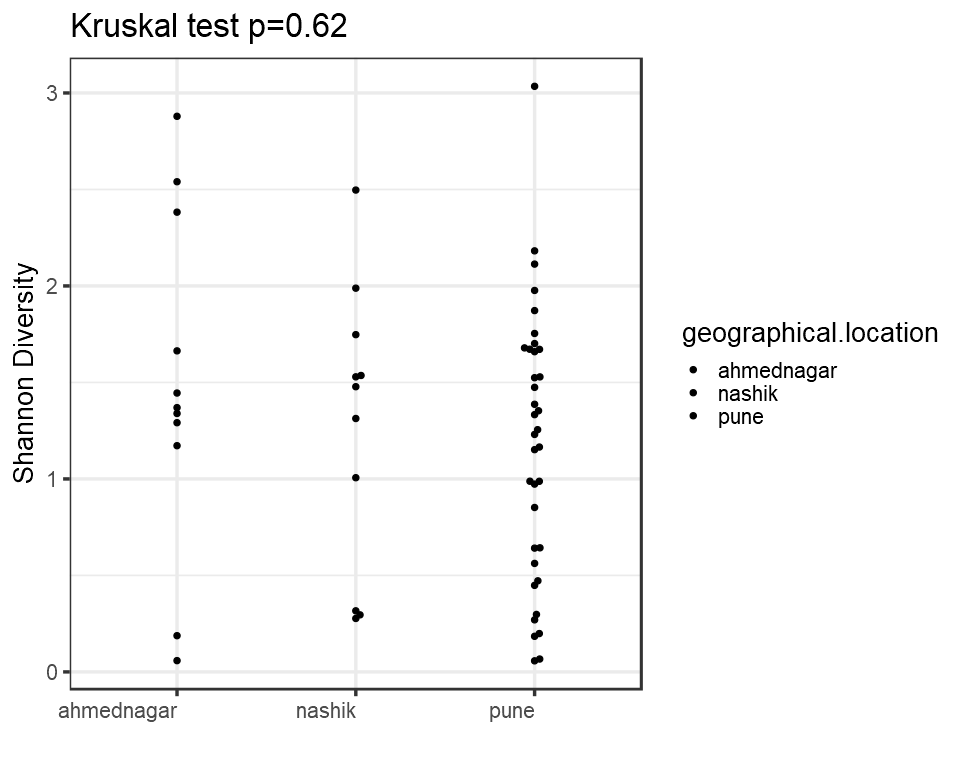
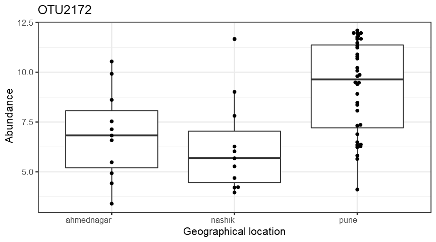
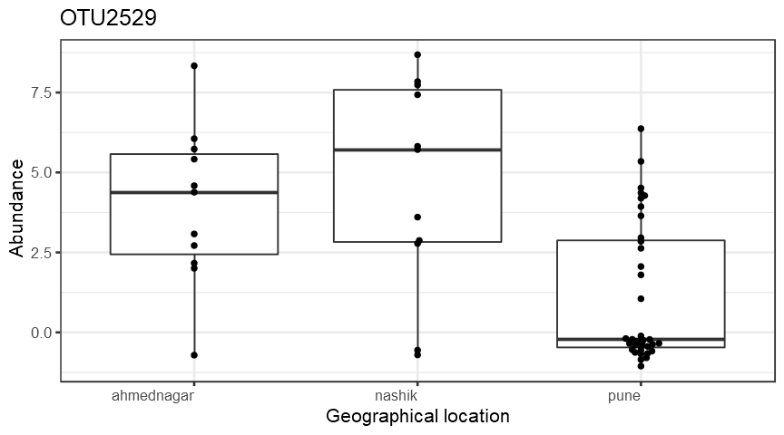
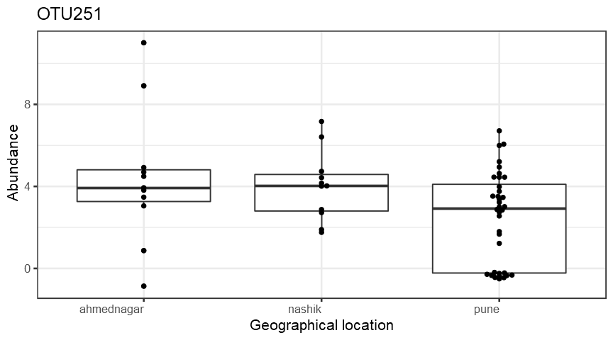
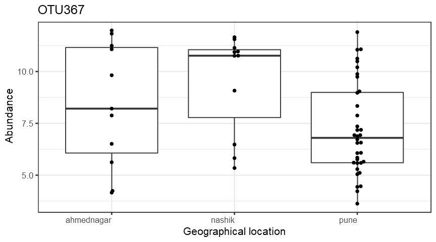
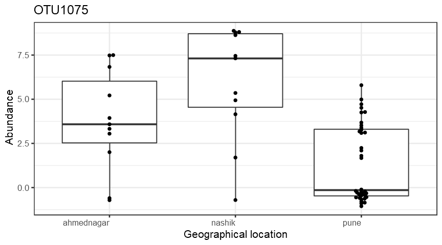
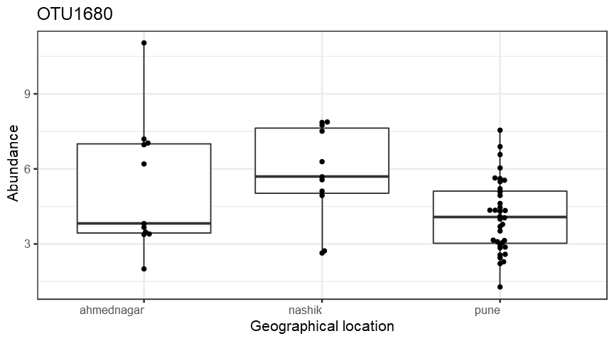

Alpha diversity analysis
========================

Group-wise comparisons
======================

-   Diversity index: diversity\_shannon

Ordination
==========

*Principal Coordinates Analysis (PCoA)*
---------------------------------------

-   Ordination method: PCoA
-   Dissimilarity measure: jaccard

DESeq2 analysis\*
-----------------

<table>
<thead>
<tr class="header">
<th align="left"></th>
<th align="right">baseMean</th>
<th align="right">log2FoldChange</th>
<th align="right">lfcSE</th>
<th align="right">stat</th>
<th align="right">pvalue</th>
<th align="right">padj</th>
<th align="left">taxon</th>
</tr>
</thead>
<tbody>
<tr class="odd">
<td align="left">OTU2172</td>
<td align="right">5958.148300</td>
<td align="right">5.890011</td>
<td align="right">0.8990864</td>
<td align="right">6.551106</td>
<td align="right">0.0000000</td>
<td align="right">0.0000000</td>
<td align="left">OTU2172</td>
</tr>
<tr class="even">
<td align="left">OTU2529</td>
<td align="right">4.610056</td>
<td align="right">-3.199304</td>
<td align="right">0.7822497</td>
<td align="right">-4.089876</td>
<td align="right">0.0000432</td>
<td align="right">0.0085109</td>
<td align="left">OTU2529</td>
</tr>
<tr class="odd">
<td align="left">OTU251</td>
<td align="right">17.748538</td>
<td align="right">-3.175628</td>
<td align="right">0.9553760</td>
<td align="right">-3.323956</td>
<td align="right">0.0008875</td>
<td align="right">0.1176826</td>
<td align="left">OTU251</td>
</tr>
<tr class="even">
<td align="left">OTU367</td>
<td align="right">934.496813</td>
<td align="right">-3.154752</td>
<td align="right">0.7421585</td>
<td align="right">-4.250779</td>
<td align="right">0.0000213</td>
<td align="right">0.0070619</td>
<td align="left">OTU367</td>
</tr>
<tr class="odd">
<td align="left">OTU1075</td>
<td align="right">9.344737</td>
<td align="right">-2.581503</td>
<td align="right">0.7966940</td>
<td align="right">-3.240270</td>
<td align="right">0.0011942</td>
<td align="right">0.1319555</td>
<td align="left">OTU1075</td>
</tr>
<tr class="even">
<td align="left">OTU1680</td>
<td align="right">24.974876</td>
<td align="right">-2.511998</td>
<td align="right">0.6203374</td>
<td align="right">-4.049406</td>
<td align="right">0.0000513</td>
<td align="right">0.0085109</td>
<td align="left">OTU1680</td>
</tr>
</tbody>
</table>

